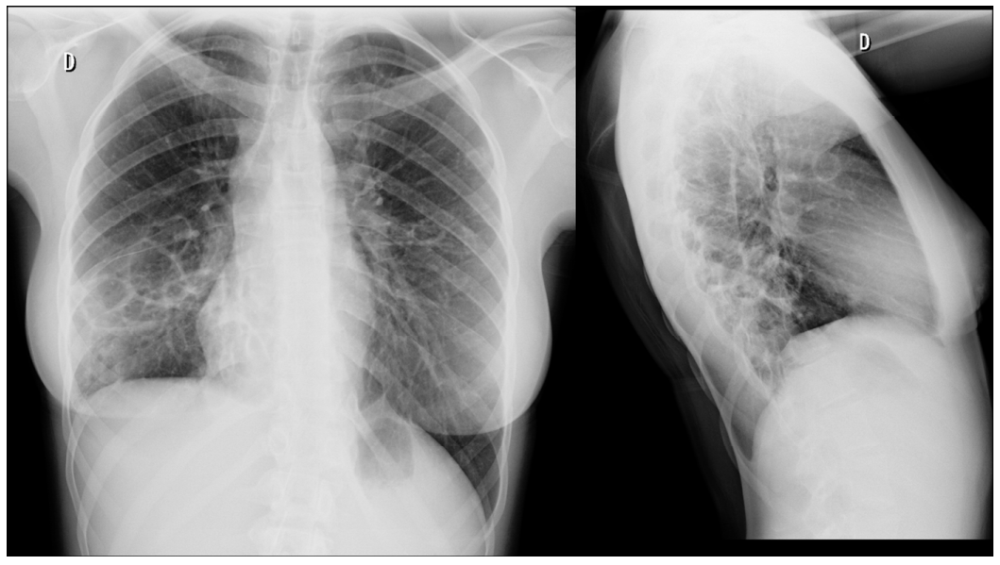
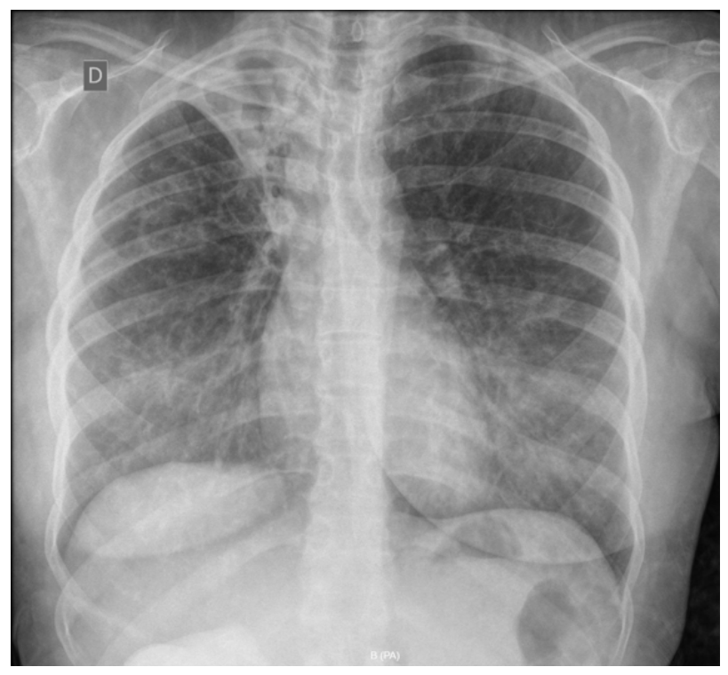
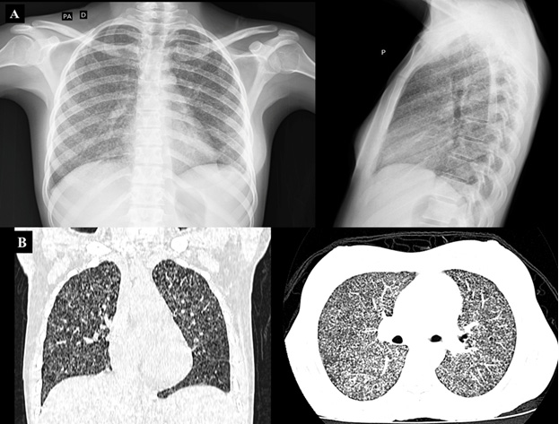
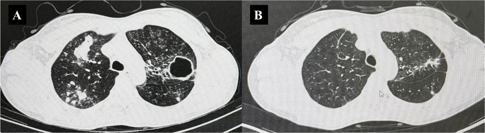
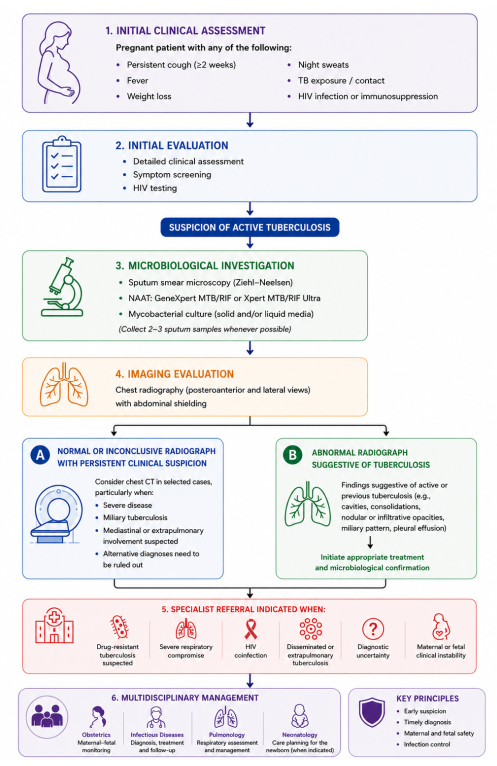

  <i class="fa-solid fa-magnifying-glass-chart"></i> Narrative &amp; Critical Appraisal Review
  <i class="fa-solid fa-newspaper"></i> Diagnostics (Basel) / WHO EBM
  <i class="fa-solid fa-person-pregnant"></i> Quản Lý Lao Trong Thai Kỳ
  <i class="fa-solid fa-shield-heart"></i> An Toàn Mẹ &amp; Thai (Cantwell Criteria)

<section class="stats-strip theme-trial">
  

    

      
10,7 triệu

      
Số ca mắc lao mới toàn cầu/năm (Phụ nữ chiếm 35% ~ 3,7 triệu ca)

    

    

      
x4,2 lần

      
Gia tăng nguy cơ tử vong chu sinh do lao hoạt động trong thai kỳ (Sobhy et al.)

    

    

      
88%

      
Tỷ lệ điều trị thành công với phác đồ chuẩn hàng 1 (2HRZE / 4HR) ở thai phụ

    

    

      
+95%

      
Tăng tỷ lệ mắc lao bùng phát trong 180 ngày đầu sau sinh (Postpartum flare)

    

  

</section>

  

    

      
🎯

      

        
Tầm soát hệ thống &amp; Chẩn đoán sớm

        
Áp dụng bộ 4 triệu chứng (ho, sốt, ra mồ hôi đêm, sụt cân/không tăng cân) tại mọi lần khám thai. Kết hợp GeneXpert MTB/RIF Ultra và X-quang ngực có chắn bụng để phát hiện kịp thời.

      

    

    

      
💊

      

        
Điều trị không trì hoãn

        
Khởi trị ngay phác đồ 6 tháng 2HRZE/4HR cho lao hoạt động nhạy cảm thuốc. Bắt buộc phối hợp Pyridoxine (Vitamin B6) liều hàng ngày để bảo vệ thần kinh mẹ và thai nhi.

      

    

    

      
🛡️

      

        
Cá thể hóa MDR-TB &amp; Chăm sóc chu sinh

        
Ưu tiên phác đồ hoàn toàn đường uống nhóm A cho MDR-TB; tuyệt đối tránh Aminoglycosides (độc thính giác thai) và Ethionamide. Quản lý chặt chẽ lao bẩm sinh theo tiêu chuẩn Cantwell.

      

    

  

  

    <a href="#sec-dichte" class="quickmenu-item active">1. Dịch tễ &amp; PRISMA</a>
    <a href="#sec-sinhbenh-nguyco" class="quickmenu-item">2. Sinh bệnh &amp; Biến chứng</a>
    <a href="#sec-chandoan" class="quickmenu-item">3. Phương thức chẩn đoán</a>
    <a href="#sec-luodo-chandoan" class="quickmenu-item">4. Lưu đồ thuật toán 6 bước</a>
    <a href="#sec-dieutri-hang1" class="quickmenu-item">5. Phác đồ hàng 1</a>
    <a href="#sec-mdr-hiv" class="quickmenu-item">6. MDR-TB &amp; HIV</a>
    <a href="#sec-sosinh-hauphu" class="quickmenu-item">7. EPTB, Sơ sinh &amp; Hậu sản</a>
    <a href="#sec-ebm-gaps" class="quickmenu-item">8. Khuyến cáo &amp; Tham khảo</a>
  

  <!-- ==================== PHÂN MỤC 1 ==================== -->
  

    

      🌍
      <h2 class="sec-title">1. Dịch Tễ Học Toàn Cầu, Gánh Nặng Lao Thai Kỳ &amp; Phương Pháp Tổng Quan (PRISMA 2020)</h2>
    

    

      
      

        📊
        

          <strong>Gánh nặng dịch tễ toàn cầu theo WHO Global Tuberculosis Report</strong>
          Bệnh lao (TB) tiếp tục là một trong những nguyên nhân truyền nhiễm hàng đầu gây tử vong trên toàn thế giới. Ước tính có <strong>10,7 triệu ca mắc mới</strong> và <strong>1,23 triệu người tử vong</strong> do lao mỗi năm (bao gồm 150.000 ca đồng nhiễm HIV). Tỷ lệ mắc mới toàn cầu là <strong>131 ca/100.000 dân</strong> với tỷ lệ tử vong 11,5%.
        

      

      

        

          

          

            
👥

            
Phân Bố Dân Số &amp; 8 Quốc Gia Trọng Điểm

          

          

            <ul style="margin-left: 1rem; line-height: 1.7;">
              <li><strong>Phụ nữ:</strong> Chiếm <strong>35%</strong> tổng số ca mắc mới (~3,7 triệu người), nam giới chiếm 54% và trẻ em chiếm 11%.</li>
              <li><strong>30 Quốc gia gánh nặng cao:</strong> Chiếm tới <strong>87%</strong> tổng số ca mắc toàn cầu.</li>
              <li><strong>8 Quốc gia chiếm 67% ca bệnh toàn cầu:</strong> Ấn Độ (25%), Indonesia (10%), Philippines (6,8%), Trung Quốc (6,5%), Pakistan (6,3%), Nigeria (4,8%), CHDC Congo (3,9%) và Bangladesh (3,6%).</li>
            </ul>
          

          
WHO Global TB Report

        

        

          

          

            
🤰

            
Bệnh Lao Trong Thai Kỳ &amp; Tử Vong Mẹ

          

          

            <ul style="margin-left: 1rem; line-height: 1.7;">
              <li>Ước tính có khoảng <strong>239.500 thai phụ</strong> và <strong>97.600 phụ nữ sau sinh</strong> mắc lao hoạt động mỗi năm.</li>
              <li>Lao là nguyên nhân gián tiếp hàng đầu gây tử vong mẹ (thuộc nhóm mã ICD-10: <strong>O98.0</strong>).</li>
              <li>Tại khu vực Cận Sahara (ví dụ: Mozambique), bệnh lao chiếm tới <strong>12,9% tổng số ca tử vong mẹ</strong> và lên đến <strong>27,7% số ca tử vong ở thai phụ nhiễm HIV</strong>.</li>
            </ul>
          

          
Nguyên nhân gián tiếp hàng đầu

        

      

      <!-- FIGURE 1: PRISMA 2020 SELECTION PROCESS VISUAL FLOW -->
      

        

          <h3 style="margin: 0; font-size: 1.05rem; color: var(--color-primary); display: flex; align-items: center; gap: 0.5rem;">
            <i class="fa-solid fa-filter"></i> Figure 1. Lưu Đồ PRISMA 2020: Quy Trình Tuyển Chọn Tài Liệu Tổng Quan
          </h3>
          
            PRISMA Flow Diagram
          
        

        

          Thiết kế tổng quan tự sự (narrative review) kết hợp thẩm định EBM phê phán trên cơ sở dữ liệu PubMed/MEDLINE, Scopus và Web of Science giai đoạn tháng 1/2000 – tháng 5/2026:
        

        <!-- PRISMA VISUAL PIPELINE -->
        

          
          <!-- BƯỚC 1: IDENTIFICATION -->
          

            

              

                <i class="fa-solid fa-magnifying-glass"></i> 1. NHẬN DIỆN (IDENTIFICATION)
              

              

                • Cơ sở dữ liệu điện tử (Databases): <strong>n = 2</strong> 
                • Sổ bộ đăng ký nghiên cứu (Registers): <strong>n = 131</strong> 
                • Tài liệu từ tổ chức quốc tế (WHO, CDC...): <strong>n = 17</strong>
              

            

            

              <strong style="color: #ef4444;">Loại trước sàng lọc:</strong> 
              • Bản ghi trùng lặp: n = 7 
              • Tự động loại: n = 5 
              • Lý do khác: n = 27
            

          

          
<i class="fa-solid fa-arrow-down"></i>

          <!-- BƯỚC 2: SCREENING -->
          

            

              

                <i class="fa-solid fa-list-check"></i> 2. SÀNG LỌC (SCREENING)
              

              

                • Sàng lọc tiêu đề và tóm tắt (Title/Abstract): <strong>n = 94</strong> 
                • Tìm kiếm toàn văn: <strong>n = 89</strong> (Databases) + <strong>n = 17</strong> (Nguồn khác)
              

            

            

              <strong style="color: #ef4444;">Loại trong sàng lọc:</strong> 
              • Loại qua Title/Abstract: n = 5 
              • Không truy xuất được toàn văn: n = 34
            

          

          
<i class="fa-solid fa-arrow-down"></i>

          <!-- BƯỚC 3: ELIGIBILITY -->
          

            

              

                <i class="fa-solid fa-clipboard-check"></i> 3. ĐÁNH GIÁ ĐỦ ĐIỀU KIỆN (ELIGIBILITY)
              

              

                • Đánh giá toàn văn từ Databases: <strong>n = 55</strong> 
                • Đánh giá toàn văn từ nguồn khác: <strong>n = 17</strong>
              

            

            

              <strong style="color: #ef4444;">Loại sau toàn văn (n = 13):</strong> 
              • DB (n=9): 2 sai tiếng, 1 trùng, 6 sai kết cục 
              • Nguồn khác (n=4): 2 lỗi thời, 2 sai quần thể
            

          

          
<i class="fa-solid fa-arrow-down"></i>

          <!-- BƯỚC 4: INCLUDED -->
          

            

              <i class="fa-solid fa-check-double"></i> 4. ĐƯA VÀO TỔNG QUAN (INCLUDED)
              46 Nghiên Cứu / 13 Báo Cáo
            

            

              Tổng cộng <strong>46 nghiên cứu</strong> (thuộc 13 báo cáo tổng hợp) được đưa vào tổng quan luận giải chuyên sâu về gánh nặng dịch tễ, cơ chế bệnh sinh, biến chứng mẹ - thai, phương thức chẩn đoán tích hợp, phác đồ điều trị hàng 1, quản lý MDR-TB, đồng nhiễm HIV, lao ngoài phổi, lao sơ sinh và khoảng trống nghiên cứu.
            

          

        

      

    

  

  <!-- ==================== PHÂN MỤC 2 ==================== -->
  

    

      🔬
      <h2 class="sec-title">2. Sinh Bệnh Học, Thích Ứng Miễn Dịch &amp; Các Biến Chứng Nặng Nề Lên Mẹ - Thai</h2>
    

    

      
      

        

          

          

            
🧬

            
Tác Nhân Phức Hợp MTBC &amp; 3 Kịch Bản Tự Nhiên

          

          

            <ul style="margin-left: 1rem; line-height: 1.7;">
              <li><strong>Phức hợp M. tuberculosis (MTBC):</strong> Bao gồm <em>M. tuberculosis, M. bovis, M. bovis BCG, M. africanum, M. caprae, M. microti...</em> Trong đó <em>M. bovis</em> và vắc-xin BCG có đặc tính <strong>kháng tự nhiên với Pyrazinamide</strong>.</li>
              <li><strong>1. Loại bỏ sớm / Kháng vi khuẩn:</strong> Nhờ hệ miễn dịch bẩm sinh và đại thực bào phế nang tiêu diệt hoàn toàn vi khuẩn.</li>
              <li><strong>2. Nhiễm lao (Tuberculosis Infection):</strong> Phản ứng miễn dịch tế bào tồn tại dai dẳng (TST/IGRA dương tính) nhưng <strong>không có triệu chứng hay tổn thương hoạt động</strong> (chiếm 1/4 – 1/3 dân số thế giới).</li>
              <li><strong>3. Bệnh lao hoạt động (Active TB):</strong> Vi khuẩn vượt qua hàng rào phòng ngự, tăng sinh gây tổn thương mô phổi hoặc ngoài phổi.</li>
            </ul>
          

          
MTBC &amp; Lịch sử tự nhiên

        

        

          

          

            
⚠️

            
Sự Thay Đổi Miễn Dịch &amp; Nguy Cơ Thai Kỳ

          

          

            <ul style="margin-left: 1rem; line-height: 1.7;">
              <li>Thai kỳ tạo trạng thái dung nạp miễn dịch sinh lý bảo vệ thai nhi, với sự <strong>chuyển dịch cán cân miễn dịch từ Th1 sang ưu thế Th2</strong>.</li>
              <li>Sự ức chế đáp ứng Th1 (giảm sản xuất IFN-γ và TNF-α) làm suy yếu khả năng kiểm soát vi khuẩn lao trong u hạt, thúc đẩy chuyển từ nhiễm lao sang lao hoạt động.</li>
              <li><strong>Các yếu tố nguy cơ bùng phát:</strong> Đái tháo đường (suy giảm đại thực bào), suy giảm miễn dịch (HIV làm sụt giảm CD4), suy dinh dưỡng, hút thuốc lá và lạm dụng rượu.</li>
            </ul>
          

          
Chuyển dịch Th1 → Th2

        

      

      <!-- BẢNG BIẾN CHỨNG MẸ VÀ THAI THEO SOBHY ET AL. -->
      

        <h3 style="font-size: 1.05rem; color: var(--color-primary); margin-bottom: 0.75rem; display: flex; align-items: center; gap: 0.5rem;">
          <i class="fa-solid fa-triangle-exclamation"></i> Tác Động &amp; Biến Chứng Lâm Sàng Của Bệnh Lao Hoạt Động (Meta-Analysis Sobhy et al.)
        </h3>
        

          <table class="regimen-table">
            <thead>
              <tr>
                <th style="width: 25%;">Biến chứng / Hậu quả</th>
                <th style="width: 20%;">Mức độ gia tăng nguy cơ</th>
                <th style="width: 55%;">Cơ chế bệnh sinh &amp; Lưu ý xử trí lâm sàng</th>
              </tr>
            </thead>
            <tbody>
              <tr>
                <td class="source-cell"><strong>Tử vong chu sinh</strong></td>
                <td>Tăng gấp 4,2 lần (OR = 4,2)</td>
                <td>Hậu quả của suy nhau thai, thiếu oxy trường diễn, sinh cực non và nhiễm lao bẩm sinh lan tỏa.</td>
              </tr>
              <tr>
                <td class="source-cell"><strong>Sảy thai &amp; Thai lưu</strong></td>
                <td>Tăng gấp 9 lần (OR = 9,0)</td>
                <td>Phản ứng viêm toàn thân nặng, sốt cao kéo dài và tổn thương bánh nhau do vi khuẩn lao.</td>
              </tr>
              <tr>
                <td class="source-cell"><strong>Sinh non &amp; Nhẹ cân (LBW)</strong></td>
                <td>Tăng gấp 1,7 lần (OR = 1,7)</td>
                <td>Giải phóng các cytokine tiền viêm (IL-1, IL-6, TNF-α) kích hoạt chuyển dạ sớm và suy dinh dưỡng mẹ.</td>
              </tr>
              <tr>
                <td class="source-cell"><strong>Bệnh tật chung ở người mẹ</strong></td>
                <td>Tăng gấp 3,0 lần (OR = 3,0)</td>
                <td>Thiếu máu nặng (tăng gấp 4 lần), suy dinh dưỡng, suy kiệt và tăng nguy cơ nhiễm trùng huyết, ARDS.</td>
              </tr>
              <tr>
                <td class="source-cell"><strong>Rối loạn THA thai kỳ / Tiền sản giật</strong></td>
                <td>Gia tăng đáng kể</td>
                <td>Viêm mạn tính gây rối loạn chức năng nội mạc mạch máu nhau thai. <em>Tương tác thuốc:</em> Rifampicin cảm ứng mạnh CYP450 làm giảm hiệu quả của Methyldopa; <strong>khuyến cáo ưu tiên dùng chẹn beta hoặc chẹn kênh calci (Nifedipine)</strong>.</td>
              </tr>
              <tr>
                <td class="source-cell"><strong>Lao nhau thai &amp; Viêm màng ối</strong></td>
                <td>Đặc thù thai kỳ</td>
                <td>Lan truyền theo đường máu vào bánh nhau: <em>Đại thể</em> thấy bánh nhau phì đại, có ổ hoại tử xám-trắng, nốt hoại tử bã đậu vàng-trắng hoặc vôi hóa rải rác; <em>Vi thể</em> điển hình có nang củ hoại tử với tế bào khổng lồ Langhans, nhưng hay gặp hơn là viêm màng thai cấp tính thâm nhiễm bạch cầu trung tính và hoại tử đông.</td>
              </tr>
              <tr>
                <td class="source-cell"><strong>Băng huyết sau sinh (PPH)</strong></td>
                <td>Tăng nguy cơ chảy máu</td>
                <td>Đờ tử cung do suy dinh dưỡng kiệt quệ và Rifampicin can thiệp vào quá trình tổng hợp các yếu tố đông máu phụ thuộc Vitamin K. <strong>Bắt buộc tiêm bắp Vitamin K dự phòng cho mẹ và sơ sinh gần ngày sinh.</strong></td>
              </tr>
              <tr>
                <td class="source-cell"><strong>Vỡ bóng khí phổi khi chuyển dạ</strong></td>
                <td>Biến chứng cấp cứu</td>
                <td>Động tác rặn đẻ kéo dài (Valsalva) làm tăng vọt áp lực trong lồng ngực gây vỡ bóng khí xơ sẹo cũ, dẫn đến tràn khí màng phổi áp lực. <strong>Chỉ định:</strong> Cân nhắc thủ thuật giúp sinh (giác hút - vacuum extraction) để rút ngắn giai đoạn 2 chuyển dạ.</td>
              </tr>
            </tbody>
          </table>
        

      

    

  

  <!-- ==================== PHÂN MỤC 3 ==================== -->
  

    

      🔬
      <h2 class="sec-title">3. Chiến Lược Tầm Soát, Các Phương Thức Chẩn Đoán Thực Tế (Table 1) &amp; Hình Ảnh Học</h2>
    

    

      
      

        ⚠️
        

          <strong>Cảnh báo chẩn đoán trễ trong thai kỳ do triệu chứng chồng lấp sinh lý</strong>
          Các triệu chứng kinh điển như mệt mỏi, khó thở nhẹ, đổ mồ hôi và thay đổi cân nặng thường bị nhầm lẫn với hiện tượng nghén hoặc thay đổi bình thường của thai kỳ. WHO khuyến cáo tầm soát hệ thống tại <strong>mỗi lần khám thai</strong> cho thai phụ ở vùng có gánh nặng lao cao (≥ 100/100.000 dân) bằng bộ 4 triệu chứng: <strong>Ho, Sốt, Ra mồ hôi ban đêm và Sụt cân / Không tăng cân thai kỳ phù hợp</strong>.
        

      

      <!-- TABLE 1: PRACTICAL DIAGNOSTIC MODALITIES -->
      

        <h3 style="font-size: 1.05rem; color: var(--color-primary); margin-bottom: 0.75rem; display: flex; align-items: center; gap: 0.5rem;">
          <i class="fa-solid fa-table-list"></i> Bảng 1. So Sánh Chi Tiết Các Phương Thức Chẩn Đoán Lao Trong Thai Kỳ (Table 1)
        </h3>
        

          <table class="regimen-table">
            <thead>
              <tr>
                <th style="width: 16%;">Phương thức</th>
                <th style="width: 14%;">Loại bệnh phẩm</th>
                <th style="width: 20%;">Chỉ định lâm sàng</th>
                <th style="width: 16%;">Hiệu suất ước tính</th>
                <th style="width: 18%;">Hạn chế đặc thù thai kỳ</th>
                <th style="width: 16%;">Ưu điểm chính</th>
              </tr>
            </thead>
            <tbody>
              <tr>
                <td class="source-cell"><strong>Tầm soát triệu chứng (4 dấu hiệu)</strong></td>
                <td>Đánh giá lâm sàng</td>
                <td>Sàng lọc ban đầu mỗi lần khám thai ở vùng dịch tễ cao/nguy cơ cao.</td>
                <td>Độ nhạy cao cho tầm soát; độ đặc hiệu thấp.</td>
                <td>Triệu chứng chồng lấp với thay đổi sinh lý thai kỳ.</td>
                <td>Đơn giản, chi phí 0 đồng, dễ triển khai rộng rãi.</td>
              </tr>
              <tr>
                <td class="source-cell"><strong>Test da TST (Mantoux)</strong></td>
                <td>Tiêm trong da PPD (0,1 mL)</td>
                <td>Phát hiện nhiễm lao ở người tiếp xúc gần hoặc nhóm nguy cơ cao.</td>
                <td>Độ nhạy ~70–80%; độ đặc hiệu thay đổi do tiêm BCG.</td>
                <td>Không phân biệt nhiễm lao tiềm ẩn và lao hoạt động; âm tính giả khi suy giảm miễn dịch.</td>
                <td>Hoàn toàn an toàn trong thai kỳ; sẵn có, chi phí thấp.</td>
              </tr>
              <tr>
                <td class="source-cell"><strong>Xét nghiệm IGRA (QFT / T-SPOT)</strong></td>
                <td>Máu toàn phần (ngoại vi)</td>
                <td>Phát hiện nhiễm lao, đặc biệt ở người đã từng tiêm vắc-xin BCG.</td>
                <td>Độ đặc hiệu &gt; 95%; độ nhạy ~75–85%.</td>
                <td>Sự suy giảm sinh lý đáp ứng IFN-γ trong thai kỳ có thể làm giảm độ nhạy; chi phí cao.</td>
                <td>Độ đặc hiệu vượt trội TST; không bị dương tính giả bởi vắc-xin BCG.</td>
              </tr>
              <tr>
                <td class="source-cell"><strong>Biomarker IP-10 (Nghiên cứu mới)</strong></td>
                <td>Máu ngoại vi</td>
                <td>Chỉ dấu bổ sung đang nghiên cứu đánh giá nhiễm lao ở thai phụ.</td>
                <td>Duy trì hiệu suất chẩn đoán ổn định dù IFN-γ suy giảm.</td>
                <td>Chưa được chuẩn hóa thương mại hóa rộng rãi.</td>
                <td>Bền vững hơn, ít bị ảnh hưởng bởi thay đổi miễn dịch thai kỳ.</td>
              </tr>
              <tr>
                <td class="source-cell"><strong>Nhuộm soi AFB (Ziehl-Neelsen)</strong></td>
                <td>Đờm (2–3 mẫu sáng sớm)</td>
                <td>Đánh giá vi sinh ban đầu nghi ngờ lao phổi.</td>
                <td>Độ nhạy ~40–60%; độ đặc hiệu cao ở vùng dịch tễ.</td>
                <td>Giảm độ nhạy rõ rệt ở thể ít vi khuẩn hoặc đồng nhiễm HIV.</td>
                <td>Nhanh chóng, chi phí rất thấp, sẵn có tại tuyến cơ sở.</td>
              </tr>
              <tr>
                <td class="source-cell">Đầu tay <strong>GeneXpert MTB/RIF</strong></td>
                <td>Đờm hoặc bệnh phẩm ngoài phổi</td>
                <td>Xét nghiệm sinh học phân tử hàng đầu phát hiện lao &amp; đột biến kháng Rifampicin.</td>
                <td>Độ nhạy &gt; 80%; độ đặc hiệu ~98–99%.</td>
                <td>Có thể cho kết quả âm tính ở bệnh nhân có tải lượng vi khuẩn cực thấp.</td>
                <td>Cho kết quả nhanh trong ~2 giờ; đồng thời phát hiện kháng Rifampicin.</td>
              </tr>
              <tr>
                <td class="source-cell">Độ nhạy cao <strong>Xpert MTB/RIF Ultra</strong></td>
                <td>Đờm, dịch màng phổi, hạch...</td>
                <td>Phát hiện lao ở đối tượng AFB âm tính, trẻ em, HIV(+), thể ít vi khuẩn.</td>
                <td>Độ nhạy cao hơn rõ rệt so với Xpert thế hệ 1.</td>
                <td>Giảm nhẹ độ đặc hiệu do phát hiện kết quả "vết" (trace) ở người từng mắc lao cũ.</td>
                <td>Tăng độ nhạy cho thể bệnh giai đoạn sớm và bệnh phẩm ít vi khuẩn.</td>
              </tr>
              <tr>
                <td class="source-cell"><strong>Nuôi cấy vi khuẩn (MGIT / LJ)</strong></td>
                <td>Đờm, dịch rửa phế quản, mô nhau thai</td>
                <td>Chẩn đoán xác định tiêu chuẩn vàng và làm kháng sinh đồ (DST).</td>
                <td>Độ nhạy cao nhất; tiêu chuẩn vàng tuyệt đối.</td>
                <td>Thời gian chờ kết quả kéo dài từ 2 đến 6 tuần.</td>
                <td>Bắt buộc để khẳng định tính nhạy cảm thuốc ở thể lao kháng thuốc.</td>
              </tr>
              <tr>
                <td class="source-cell"><strong>LF-LAM nước tiểu</strong></td>
                <td>Nước tiểu tươi</td>
                <td>Chẩn đoán nhanh bổ sung ở thai phụ nhiễm HIV suy giảm miễn dịch nặng.</td>
                <td>Độ nhạy cao nhất khi số lượng tế bào CD4 rất thấp (&lt; 100/µL).</td>
                <td>Giá trị chẩn đoán thấp ở người có hệ miễn dịch bình thường.</td>
                <td>Xét nghiệm tại chỗ (Point-of-care), không cần lấy đờm, trả kết quả sau 25 phút.</td>
              </tr>
              <tr>
                <td class="source-cell"><strong>X-quang ngực (CXR) chắn bụng</strong></td>
                <td>Hình ảnh lồng ngực</td>
                <td>Đánh giá hình ảnh ban đầu khi nghi ngờ tổn thương lao phổi.</td>
                <td>Độ nhạy trung bình; thấp hơn ở giai đoạn sớm hoặc thể lao kê.</td>
                <td>Hình ảnh có thể không điển hình ở người nhiễm HIV; tâm lý e ngại bức xạ làm chậm trễ chụp.</td>
                <td><strong>Hoàn toàn an toàn khi có chắn chì bảo vệ bụng</strong>; liều bức xạ thai nhi không đáng kể (&lt; 0,01 mGy).</td>
              </tr>
              <tr>
                <td class="source-cell"><strong>CT ngực liều thấp</strong></td>
                <td>Cắt lớp vi tính lồng ngực</td>
                <td>Nghi ngờ lao kê, tổn thương trung thất, lâm sàng nặng mà CXR không rõ.</td>
                <td>Độ nhạy vượt trội so với CXR đối với tổn thương kín đáo.</td>
                <td>Liều bức xạ cho mẹ cao hơn; cần cân nhắc nguy cơ - lợi ích cá thể hóa.</td>
                <td>Dựng hình giải phẫu chi tiết; liều chiếu xạ thai nhi thực tế rất thấp do nằm ngoài chùm tia.</td>
              </tr>
            </tbody>
          </table>
        

      

      <!-- BỘ SƯU TẬP HÌNH ẢNH MINH HỌA FIGURE 2, 3, 4, 5 -->
      

        <h3 style="font-size: 1.05rem; color: var(--color-primary); margin-bottom: 1rem; display: flex; align-items: center; gap: 0.5rem;">
          <i class="fa-solid fa-images"></i> Bộ Sưu Tập Hình Ảnh Chẩn Đoán Lâm Sàng Điển Hình (Figures 2 – 5)
        </h3>

        <!-- FIGURE 2 & 3: CXR CAVITARY & FIBROATELECTASIS -->
        

          

            
            

              
Figure 2. Phim X-quang Ngực Lao Phổi Tạo Hang Tiến Triển Hai Bên

              Phim X-quang ngực thẳng và nghiêng của thai phụ mắc lao phổi tạo hang tiến triển bilateral: Thấy giảm thể tích phổi phải, co kéo lệch trung thất cùng bên, nhiều tổn thương tạo hang thành mỏng ở thùy dưới phổi phải và thùy trên phổi trái.
            

          

          

            
            

              
Figure 3. X-quang Ngực Thẳng: Xơ Xẹp Thùy Trên &amp; Tổn Thương Hang

              Hình ảnh xơ xẹp phổi thùy trên phải kèm 2 tổn thương hang ở vùng giữa - trên phổi phải, tổn thương mờ không đồng nhất ở vùng quanh tim trái gợi ý tổn thương thâm nhiễm nhu mô đối bên.
            

          

        

        <!-- FIGURE 4 & 5: MILIARY TB & CT RESPONSE -->
        

          

            
            

              
Figure 4. Hình Ảnh Lao Kê (Miliary Tuberculosis) Trong Thai Kỳ

              <strong>(A)</strong> X-quang ngực cho thấy vô số nốt mờ nhỏ kích thước hạt kê (micronodular opacities) phân bố lan tỏa đồng đều khắp 2 phế trường. <strong>(B)</strong> Phim CT ngực (lát cắt Coronal &amp; Axial) xác nhận vô số nốt kê kích thước 1–6 mm phân bố ngẫu nhiên toàn bộ nhu mô phổi hai bên.
            

          

          

            
            

              
Figure 5. Đánh Giá Đáp Ứng Điều Trị Trên CT Ngực Trước &amp; Sau Phác Đồ Hàng 1

              <strong>(A)</strong> Trước điều trị: Tổn thương hang thành dày thùy trên trái, hình ảnh "nụ trên cành" (tree-in-bud), đông đặc phổi phải. <strong>(B)</strong> Sau hoàn thành phác đồ chuẩn 6 tháng hàng 1: Vùng đông đặc giảm rõ rệt, hang thùy trên trái đã khép lại thành dải xơ, tổn thương "nụ trên cành" thoái triển hầu như hoàn toàn.
            

          

        

      

    

  

  <!-- ==================== PHÂN MỤC 4 ==================== -->
  

    

      🔀
      <h2 class="sec-title">4. Lưu Đồ Thuật Toán Chẩn Đoán Tích Hợp (Figure 6 &amp; High-Fidelity Flowchart)</h2>
    

    

      
      

        💡
        

          <strong>Chiến lược tiếp cận lâm sàng đa tầng tích hợp</strong>
          Lưu đồ mô hình hóa trọn vẹn quy trình 6 bước chẩn đoán và xử trí lao trong thai kỳ: từ đánh giá lâm sàng ban đầu, xét nghiệm vi sinh phân tử, chẩn đoán hình ảnh an toàn, phân nhánh A &amp; B, các chỉ định chuyển tuyến chuyên khoa cho đến quản lý đa chuyên khoa và 4 nguyên tắc cốt lõi.
        

      

      <!-- FIGURE 6 IMAGE CARD -->
      

        
        

          
Figure 6. Integrated Diagnostic Approach for Suspected Tuberculosis During Pregnancy

          Lưu đồ thuật toán chẩn đoán tích hợp cho thai phụ nghi ngờ mắc bệnh lao: Kết hợp đánh giá lâm sàng, xét nghiệm vi sinh/phân tử, đánh giá hình ảnh học an toàn, phân nhánh A &amp; B, tiêu chuẩn hội chẩn chuyên khoa và mô hình phối hợp liên viện.
        

      

      <!-- HIGH-FIDELITY VISUAL CLINICAL FLOWCHART (REPRESENTING FIGURE 6 IN CODE) -->
      

        
        

          

            <i class="fa-solid fa-diagram-project"></i> Mô Hình Hóa Thuật Toán Lâm Sàng 6 Bước (Figure 6 Interactive Code)
          

          
            Chuẩn Hóa Editorial Flowchart
          
        

        

          
          <!-- BƯỚC 1: INITIAL CLINICAL ASSESSMENT -->
          

            

              

                <i class="fa-solid fa-person-pregnant"></i>
              

              

                

                  1. Đánh Giá Lâm Sàng Ban Đầu (Initial Clinical Assessment)
                

                

                  Thai phụ có bất kỳ dấu hiệu / yếu tố nguy cơ nào sau đây:
                

                

                  
• Ho kéo dài (≥ 2 tuần)

                  
• Ra mồ hôi trộm ban đêm

                  
• Sốt nhẹ về chiều / sốt kéo dài

                  
• Tiền sử tiếp xúc nguồn lây lao

                  
• Sụt cân hoặc không tăng cân thai kỳ

                  
• Nhiễm HIV hoặc suy giảm miễn dịch

                

              

            

          

          <!-- MŨI TÊN NỐI -->
          
<i class="fa-solid fa-arrow-down"></i>

          <!-- BƯỚC 2: INITIAL EVALUATION -->
          

            

              

                <i class="fa-solid fa-clipboard-list"></i>
              

              

                

                  2. Đánh Giá Ban Đầu (Initial Evaluation)
                

                

                  
<i class="fa-solid fa-check text-success"></i> <strong>Khám lâm sàng chi tiết</strong> toàn diện

                  
<i class="fa-solid fa-check text-success"></i> <strong>Tầm soát hệ thống 4 triệu chứng</strong>

                  
<i class="fa-solid fa-check text-success"></i> <strong>Xét nghiệm huyết thanh học HIV</strong>

                

              

            

          

          <!-- MŨI TÊN NỐI -->
          
<i class="fa-solid fa-arrow-down"></i>

          <!-- SUSPICION OF ACTIVE TUBERCULOSIS BADGE -->
          

            
              <i class="fa-solid fa-triangle-exclamation" style="color: #facc15; margin-right: 0.4rem;"></i>
              SUSPICION OF ACTIVE TUBERCULOSIS (NGHI NGỜ LAO HOẠT ĐỘNG)
            
          

          <!-- MŨI TÊN NỐI -->
          
<i class="fa-solid fa-arrow-down"></i>

          <!-- BƯỚC 3: MICROBIOLOGICAL INVESTIGATION -->
          

            

              

                <i class="fa-solid fa-microscope"></i>
              

              

                

                  3. Điều Tra Vi Sinh &amp; Sinh Học Phân Tử (Microbiological Investigation)
                

                <ul style="margin: 0.5rem 0 0 1.25rem; font-size: 0.9rem; line-height: 1.7;">
                  <li><strong>Nhuộm soi đờm trực tiếp:</strong> Kỹ thuật nhuộm soi Ziehl–Neelsen phát hiện trực khuẩn kháng cồn toan (AFB).</li>
                  <li><strong>Xét nghiệm NAAT (Sinh học phân tử):</strong> Bắt buộc thực hiện <strong>GeneXpert MTB/RIF</strong> hoặc <strong>Xpert MTB/RIF Ultra</strong> để xác định nhanh vi khuẩn lao và đột biến gen kháng Rifampicin trong ~2 giờ.</li>
                  <li><strong>Nuôi cấy vi khuẩn Mycobacteria:</strong> Môi trường lỏng (MGIT) và/hoặc môi trường đặc (Lowenstein–Jensen) để làm kháng sinh đồ DST.</li>
                  <li style="color: var(--color-text-muted); font-style: italic;">*Thu thập 2–3 mẫu đờm (ưu tiên mẫu sáng sớm) bất cứ khi nào có thể.</li>
                </ul>
              

            

          

          <!-- MŨI TÊN NỐI -->
          
<i class="fa-solid fa-arrow-down"></i>

          <!-- BƯỚC 4: IMAGING EVALUATION -->
          

            

              

                <i class="fa-solid fa-lungs"></i>
              

              

                

                  4. Đánh Giá Hình Ảnh Học (Imaging Evaluation)
                

                

                  <strong>Chụp X-quang ngực (Chest Radiography - CXR):</strong> Thực hiện tư thế sau - trước (PA) và nghiêng với <strong>tấm chắn chì bảo vệ vùng bụng (Abdominal Shielding)</strong> bắt buộc. Liều bức xạ thai nhi an toàn (&lt; 0,01 mGy).
                

              

            

          

          <!-- MŨI TÊN PHÂN NHÁNH A & B -->
          

            
<i class="fa-solid fa-arrow-down"></i>

            
<i class="fa-solid fa-arrow-down"></i>

          

          <!-- 2 NHÁNH A VÀ B -->
          

            
            <!-- NHÁNH A: NORMAL OR INCONCLUSIVE -->
            

              

                A
                

                  X-Quang Bình Thường / Không Rõ Nhưng Lâm Sàng Nghi Ngờ Cao
                

              

              

                <strong>Cân nhắc chụp Cắt lớp vi tính ngực (CT ngực)</strong> không cản quang trong các trường hợp chọn lọc, đặc biệt khi:
                <ul style="margin: 0.5rem 0 0 1.25rem;">
                  <li>Bệnh cảnh lâm sàng diễn tiến nặng (Severe disease)</li>
                  <li>Nghi ngờ thể lao kê lan tỏa (Miliary tuberculosis)</li>
                  <li>Nghi ngờ tổn thương hạch trung thất hoặc ngoài phổi</li>
                  <li>Cần loại trừ các chẩn đoán phân biệt nghiêm trọng khác</li>
                </ul>
              

              

                <i class="fa-solid fa-circle-radiation"></i> CT ngực: Đánh giá cá thể hóa nguy cơ - lợi ích
              

            

            <!-- NHÁNH B: ABNORMAL RADIOGRAPH -->
            

              

                B
                

                  X-Quang Bất Thường Gợi Ý Bệnh Lao (Suggestive of TB)
                

              

              

                Các tổn thương điển hình của lao hoạt động hoặc di chứng lao cũ:
                <ul style="margin: 0.5rem 0 0 1.25rem;">
                  <li>Tổn thương tạo hang (Cavities) thành mỏng hoặc dày</li>
                  <li>Đông đặc thùy phổi (Consolidations)</li>
                  <li>Nốt mờ hoặc thâm nhiễm phế trường (Infiltrates)</li>
                  <li>Hình ảnh hạt kê rải rác hai bên (Miliary pattern)</li>
                  <li>Tràn dịch màng phổi (Pleural effusion)</li>
                </ul>
              

              

                <i class="fa-solid fa-play"></i> Khởi trị ngay phác đồ phù hợp &amp; Xác nhận vi sinh
              

            

          

          <!-- MŨI TÊN HỘI TỤ -->
          
<i class="fa-solid fa-arrow-down"></i>

          <!-- BƯỚC 5: SPECIALIST REFERRAL INDICATED WHEN -->
          

            

              

                <i class="fa-solid fa-hospital-user"></i> 5. Chỉ Định Chuyển Tuyến / Hội Chẩn Chuyên Khoa (Specialist Referral Indicated When)
              

              
                6 Tiêu Chuẩn Kích Hoạt
              
            

            <!-- 6 SPECIALIST REFERRAL CARDS -->
            

              
              

                
<i class="fa-solid fa-bacteria"></i>

                

                  <strong>Nghi ngờ lao kháng thuốc</strong> 
                  MDR-TB / Kháng Rifampicin
                

              

              

                
<i class="fa-solid fa-lungs"></i>

                

                  <strong>Suy hô hấp tiến triển</strong> 
                  Severe respiratory compromise
                

              

              

                
<i class="fa-solid fa-ribbon"></i>

                

                  <strong>Đồng nhiễm HIV</strong> 
                  HIV coinfection &amp; suy giảm MD
                

              

              

                
<i class="fa-solid fa-virus-covid"></i>

                

                  <strong>Lao lan tỏa / ngoài phổi</strong> 
                  Lao màng não, kê, xương khớp
                

              

              

                
<i class="fa-solid fa-circle-question"></i>

                

                  <strong>Chẩn đoán chưa rõ ràng</strong> 
                  Diagnostic uncertainty / AFB(-)
                

              

              

                
<i class="fa-solid fa-heart-pulse"></i>

                

                  <strong>Mẹ hoặc thai không ổn định</strong> 
                  Huyết động, suy thai, tiền sản giật
                

              

            

          

          <!-- MŨI TÊN NỐI -->
          
<i class="fa-solid fa-arrow-down"></i>

          <!-- BƯỚC 6: MULTIDISCIPLINARY MANAGEMENT & KEY PRINCIPLES -->
          

            
            <!-- 4 CHUYÊN KHOA -->
            

              

                <i class="fa-solid fa-users"></i> 6. Quản Lý Đa Chuyên Khoa (Multidisciplinary Management)
              

              

                

                  
<i class="fa-solid fa-baby-carriage"></i> Sản Khoa (Obstetrics)

                  
Theo dõi sức khỏe mẹ - thai, tăng trưởng thai nhi và lập kế hoạch sinh an toàn.

                

                

                  
<i class="fa-solid fa-user-doctor"></i> Bệnh Truyền Nhiễm (ID)

                  
Chẩn đoán căn nguyên, lựa chọn phác đồ, theo dõi tương tác thuốc và tuân thủ.

                

                

                  
<i class="fa-solid fa-lungs"></i> Hô Hấp (Pulmonology)

                  
Đánh giá chức năng thông khí, xử trí tổn thương xơ sẹo, tràn khí và bóng khí phổi.

                

                

                  
<i class="fa-solid fa-baby"></i> Sơ Sinh (Neonatology)

                  
Lập kế hoạch đón bé, tầm soát lao bẩm sinh, điều trị dự phòng và tiêm chủng.

                

              

            

            <!-- KEY PRINCIPLES -->
            

              

                

                  <i class="fa-solid fa-shield-halved"></i> Key Principles (Nguyên Tắc Cốt Lõi)
                

                <ul style="margin: 0 0 0 1rem; font-size: 0.88rem; line-height: 1.8;">
                  <li><strong>Nghi ngờ sớm:</strong> Nhạy bén với triệu chứng chồng lấp thai kỳ.</li>
                  <li><strong>Chẩn đoán kịp thời:</strong> Không trì hoãn vì e ngại bức xạ/xét nghiệm.</li>
                  <li><strong>An toàn mẹ &amp; thai:</strong> Tối ưu hiệu lực và loại bỏ thuốc quái thai.</li>
                  <li><strong>Kiểm soát lây nhiễm:</strong> Cách ly giọt bắn và bảo vệ trẻ sơ sinh.</li>
                </ul>
              

              

                Tối ưu hóa kết cục cho cả mẹ và thai nhi
              

            

          

        

      

    

  

  <!-- ==================== PHÂN MỤC 5 ==================== -->
  

    

      💊
      <h2 class="sec-title">5. Phác Đồ Điều Trị Lao Nhạy Cảm Hàng 1 &amp; Hồ Sơ An Toàn Dược Lý (Table 2)</h2>
    

    

      
      

        ✅
        

          <strong>Nguyên tắc vàng: Không bao giờ trì hoãn điều trị lao hoạt động trong thai kỳ</strong>
          Nguy cơ tử vong và biến chứng nghiêm trọng cho mẹ và thai do bệnh lao không được điều trị vượt trội hoàn toàn so với bất kỳ nguy cơ lý thuyết nào từ các thuốc chống lao hàng một. Phác đồ chuẩn 6 tháng <strong>2HRZE / 4HR</strong> (2 tháng Isoniazid, Rifampicin, Pyrazinamide, Ethambutol + 4 tháng Isoniazid, Rifampicin) đạt tỷ lệ điều trị thành công lên tới <strong>88%</strong> ở thai phụ.
        

      

      <!-- TABLE 2: ANTITUBERCULOSIS DRUGS DURING PREGNANCY -->
      

        <h3 style="font-size: 1.05rem; color: var(--color-primary); margin-bottom: 0.75rem; display: flex; align-items: center; gap: 0.5rem;">
          <i class="fa-solid fa-prescription-bottle-medical"></i> Bảng 2. Đặc Tính Dược Lý, Độ An Toàn &amp; Mức Bằng Chứng Của Thuốc Chống Lao (Table 2)
        </h3>
        

          <table class="regimen-table">
            <thead>
              <tr>
                <th style="width: 20%;">Thuốc / Nhóm thuốc</th>
                <th style="width: 20%;">Khuyến cáo sử dụng</th>
                <th style="width: 42%;">Lưu ý an toàn thai kỳ &amp; Theo dõi lâm sàng</th>
                <th style="width: 18%;">Mức độ bằng chứng</th>
              </tr>
            </thead>
            <tbody>
              <!-- HÀNG 1 -->
              <tr style="background: rgba(16, 185, 129, 0.05);">
                <td colspan="4" style="font-weight: 700; color: #065f46; font-size: 0.9rem;">
                  I. NHÓM THUỐC HÀNG MỘT (DRUG-SUSCEPTIBLE TUBERCULOSIS)
                </td>
              </tr>
              <tr>
                <td class="source-cell">
                  Khuyên dùng <strong>Isoniazid (H)</strong>
                </td>
                <td>Liều: 5 mg/kg/ngày (tối đa 300 mg)</td>
                <td>Qua nhau thai dễ dàng nhưng không gây quái thai. Có nguy cơ độc tính trên gan (viêm gan do thuốc). <strong>Bắt buộc bổ sung Pyridoxine (Vitamin B6) 25–50 mg/ngày</strong> để phòng ngừa độc thần kinh ngoại biên cho mẹ và biến chứng co giật/thần kinh ở thai nhi.</td>
                <td>COR I LOE A <small>Hướng dẫn chuẩn WHO</small></td>
              </tr>
              <tr>
                <td class="source-cell">
                  Khuyên dùng <strong>Rifampicin (R)</strong>
                </td>
                <td>Liều: 10 mg/kg/ngày (tối đa 600 mg)</td>
                <td>An toàn, không gây dị tật bẩm sinh. Là chất cảm ứng enzym Cytochrome P450 mạnh mẽ, gây tương tác giảm nồng độ thuốc ARV và thuốc hạ áp. Có thể can thiệp yếu tố đông máu phụ thuộc Vit K; <strong>cần bổ sung Vitamin K cho mẹ và trẻ khi dùng gần ngày sinh</strong>.</td>
                <td>COR I LOE A <small>Hướng dẫn chuẩn WHO</small></td>
              </tr>
              <tr>
                <td class="source-cell">
                  Khuyên dùng <strong>Pyrazinamide (Z)</strong>
                </td>
                <td>Liều: 25 mg/kg/ngày (tối đa 2.000 mg)</td>
                <td>Dữ liệu lịch sử tại Hoa Kỳ từng thận trọng do thiếu thử nghiệm ngẫu nhiên, nhưng hiện nay được <strong>WHO, IUATLD và BTS chính thức công nhận an toàn</strong> và đưa vào phác đồ chuẩn 6 tháng trong thai kỳ. Theo dõi acid uric và chức năng gan.</td>
                <td>COR I LOE A <small>Đồng thuận quốc tế WHO</small></td>
              </tr>
              <tr>
                <td class="source-cell">
                  Khuyên dùng <strong>Ethambutol (E)</strong>
                </td>
                <td>Liều: 15–20 mg/kg/ngày (tối đa 1.200 mg)</td>
                <td>Độ an toàn thai kỳ rất cao, không gây quái thai. Độc tính viêm thần kinh thị giác hậu nhãn cầu là hiếm gặp ở liều chuẩn; theo dõi phân biệt thị lực màu xanh - đỏ nếu điều trị kéo dài.</td>
                <td>COR I LOE A <small>Hướng dẫn chuẩn WHO</small></td>
              </tr>

              <!-- HÀNG 2 -->
              <tr style="background: rgba(239, 68, 68, 0.05);">
                <td colspan="4" style="font-weight: 700; color: #991b1b; font-size: 0.9rem;">
                  II. NHÓM THUỐC HÀNG HAI &amp; LAO ĐA KHÁNG (MDR-TB REGIMENS)
                </td>
              </tr>
              <tr>
                <td class="source-cell">
                  Cân nhắc <strong>Levofloxacin / Moxifloxacin</strong>
                </td>
                <td>Dùng khi lợi ích vượt trội nguy cơ</td>
                <td>Thuộc nhóm Fluoroquinolones nòng cốt (Nhóm A MDR-TB). Lo ngại về tổn thương sụn khớp chủ yếu ghi nhận trên súc vật thí nghiệm liều cao; các nghiên cứu quan sát trên người không thấy tăng nguy cơ dị tật bẩm sinh.</td>
                <td>COR IIa LOE B <small>Dữ liệu quan sát / WHO hỗ trợ</small></td>
              </tr>
              <tr>
                <td class="source-cell">
                  Ca chọn lọc <strong>Bedaquiline (BDQ)</strong>
                </td>
                <td>Trụ cột phác đồ uống MDR-TB</td>
                <td>Dữ liệu lâm sàng thai kỳ ngày càng mở rộng, ghi nhận kết cục thai kỳ thuận lợi. Bắt buộc theo dõi <strong>điện tâm đồ (khoảng QTc)</strong> thường quy do nguy cơ kéo dài QTc.</td>
                <td>COR IIa LOE B <small>Dữ liệu quan sát / WHO hỗ trợ</small></td>
              </tr>
              <tr>
                <td class="source-cell">
                  Thận trọng <strong>Linezolid (LZD)</strong>
                </td>
                <td>Chỉ dùng khi bắt buộc thiết lập phác đồ</td>
                <td>Có nguy cơ ức chế tủy xương (thiếu máu, giảm tiểu cầu), viêm thần kinh ngoại biên và thần kinh thị giác khi dùng kéo dài. Cần công thức máu mỗi 2 tuần trong 2 tháng đầu, sau đó hàng tháng.</td>
                <td>COR IIb LOE C <small>Đồng thuận chuyên gia</small></td>
              </tr>
              <tr>
                <td class="source-cell">
                  Rất hạn chế <strong>Pretomanid &amp; Delamanid</strong>
                </td>
                <td>Tránh dùng thường quy</td>
                <td>Thai phụ bị loại trừ khỏi hầu hết các thử nghiệm then chốt (BPaL/BPaLM). Dữ liệu an toàn trên thai kỳ người còn rất thiếu thốn. Chỉ cân nhắc khi không còn lựa chọn nào khác.</td>
                <td>COR III LOE C <small>Thiếu dữ liệu an toàn</small></td>
              </tr>
              <tr>
                <td class="source-cell">
                  CHỐNG CHỈ ĐỊNH <strong>Aminoglycosides tiêm</strong> 
                  <small>(Amikacin, Streptomycin, Kanamycin)</small>
                </td>
                <td><strong>Tuyệt đối tránh dùng</strong></td>
                <td><strong>Độc tính thính giác thai nhi không hồi phục (gây điếc bẩm sinh thần kinh giác quan)</strong> và độc tính hoại tử ống thận cấp cho thai nhi.</td>
                <td>CHỐNG CHỈ ĐỊNH <small>Bằng chứng mạnh về độc thai</small></td>
              </tr>
              <tr>
                <td class="source-cell">
                  TRÁNH DÙNG <strong>Ethionamide / Prothionamide</strong>
                </td>
                <td><strong>Tuyệt đối tránh dùng</strong></td>
                <td>Nguy cơ gây dị tật hệ thần kinh trung ương thai nhi (quái thai) và gây nôn ói thai nghén trầm trọng, làm mất nước và suy kiệt người mẹ.</td>
                <td>TRÁNH DÙNG <small>Độc tính quái thai</small></td>
              </tr>
            </tbody>
          </table>
        

      

    

  

  <!-- ==================== PHÂN MỤC 6 ==================== -->
  

    

      🛡️
      <h2 class="sec-title">6. Quản Lý Lao Đa Kháng Thuốc (MDR-TB) &amp; Sinh Bệnh Học Đồng Nhiễm Lao - HIV</h2>
    

    

      
      

        

          

          

            
💊

            
MDR-TB Thai Kỳ: Phác Đồ Hoàn Toàn Đường Uống

          

          

            <ul style="margin-left: 1rem; line-height: 1.7;">
              <li><strong>Bằng chứng EBM (Meta-analysis Alene et al.):</strong> Trên 275 thai phụ MDR-TB, tỷ lệ điều trị thành công đạt <strong>72,2%</strong> và kết cục thai kỳ thuận lợi đạt <strong>72,3%</strong>.</li>
              <li><strong>Chiến lược All-oral:</strong> Xây dựng phác đồ phối hợp các thuốc nhóm A (Fluoroquinolones + Bedaquiline + Linezolid) và nhóm B (Clofazimine, Cycloserine).</li>
              <li><strong>Thời gian điều trị:</strong> Kéo dài từ <strong>18 đến 24 tháng</strong>. Cần giám sát chặt chẽ điện giải đồ, QTc và chức năng tủy xương.</li>
            </ul>
          

          
Alene et al. JAMA Netw Open

        

        

          

          

            
🤝

            
Đại Dịch Tương Tác: Đồng Nhiễm Lao &amp; HIV

          

          

            <ul style="margin-left: 1rem; line-height: 1.7;">
              <li>HIV làm gia tăng nguy cơ chuyển từ nhiễm lao sang lao hoạt động lên <strong>10% mỗi năm</strong> (so với 5–10% trong cả cuộc đời ở người không nhiễm HIV).</li>
              <li>Lâm sàng thường bất điển hình: Tỷ lệ cao AFB âm tính, lao kê, lao ngoài phổi và tổn thương X-quang không tạo hang.</li>
              <li><strong>Thời điểm khởi động ARV:</strong> Bắt đầu ARV sau <strong>2 đến 8 tuần</strong> kể từ khi khởi trị thuốc lao (sau 2 tuần nếu CD4 &lt; 50/µL để giảm tử vong).</li>
            </ul>
          

          
Tương tác dược lý &amp; ARV

        

      

      

        

          ⚡
          

            <strong>Xử trí tương tác Rifampicin – ARV &amp; Hội chứng viêm phục hồi miễn dịch (IRIS)</strong>
            <ul style="margin-top: 0.25rem; margin-left: 1rem; line-height: 1.6;">
              <li><strong>Tương tác dược lý:</strong> Rifampicin cảm ứng mạnh mẽ enzym CYP3A4, làm sụt giảm nghiêm trọng nồng độ Nevirapine và thuốc ức chế Protease. <em>Giải pháp:</em> Ưu tiên phác đồ nền tảng <strong>Efavirenz (EFV 600 mg)</strong> hoặc thay Rifampicin bằng <strong>Rifabutin (RFB 150 mg/ngày)</strong>.</li>
              <li><strong>Hội chứng IRIS:</strong> Biểu hiện sốt tái phát, hạch to nhanh hoặc thâm nhiễm phổi lan rộng sau khi bắt đầu dùng ARV. <em>Xử trí:</em> <strong>Tiếp tục duy trì cả phác đồ lao và phác đồ ARV</strong>; sử dụng Corticosteroid ngắn hạn nếu có chèn ép đường thở hoặc đe dọa tính mạng.</li>
              <li><strong>Điều trị dự phòng lao tiềm ẩn (TPT):</strong> Chỉ định Isoniazid tối thiểu <strong>36 tháng</strong> cho mọi thai phụ HIV(+) ở vùng có tỷ lệ lưu hành lao cao.</li>
            </ul>
          

        

      

    

  

  <!-- ==================== PHÂN MỤC 7 ==================== -->
  

    

      👶
      <h2 class="sec-title">7. Lao Ngoài Phổi (EPTB), Lao Sơ Sinh, Tiêu Chuẩn Cantwell, Hậu Sản &amp; Ngừa Thai</h2>
    

    

      
      <!-- LAO NGOÀI PHỔI TRONG THAI KỲ (EPTB) -->
      

        

          <h3 style="margin: 0; font-size: 1.05rem; color: var(--color-primary); display: flex; align-items: center; gap: 0.5rem;">
            <i class="fa-solid fa-viruses"></i> Lao Ngoài Phổi Trong Thai Kỳ (Extrapulmonary TB - EPTB)
          </h3>
          
            Chiếm tới 66,6% tại Ấn Độ
          
        

        

          Tại các quốc gia có gánh nặng lao cao, lao ngoài phổi chiếm tỷ lệ rất lớn ở phụ nữ trong độ tuổi sinh đẻ. Ba thể lâm sàng quan trọng nhất bao gồm:
        

        

          

            
1. Lao Hạch Cổ (Tuberculous Lymphadenitis)

            

              Dạng hay gặp nhất trong các thể EPTB thai kỳ. Biểu hiện khối hạch cổ sưng to, chắc, dính cụm, không đau hoặc rò chất bã đậu mạn tính. Tiên lượng nhìn chung rất thuận lợi khi điều trị phác đồ chuẩn 6 tháng.
            

          

          

            
2. Lao Màng Não (Tuberculous Meningitis)

            

              Thể lao ngoài phổi nguy hiểm nhất, đe dọa trực tiếp tính mạng mẹ và thai nhi. Đòi hỏi chẩn đoán khẩn cấp (chọc dò dịch não tủy làm GeneXpert/Ultra), phối hợp sớm Corticosteroid (Dexamethasone) và kéo dài thời gian điều trị từ 9–12 tháng.
            

          

          

            
3. Lao Đường Sinh Dục (Genital TB)

            

              Tổn thương chủ yếu ở niêm mạc tử cung và hai vòi trứng, gây dính xơ tắc vòi trứng dẫn đến <strong>vô sinh thứ phát</strong>, rối loạn kinh nguyệt kéo dài và gia tăng nguy cơ <strong>thai ngoài tử cung</strong> nghiêm trọng.
            

          

        

      

      

        

          

          

            
🍼

            
Lao Bẩm Sinh &amp; Tiêu Chuẩn Cantwell

          

          

            
<strong>3 Đường lây truyền chính:</strong>

            <ol style="margin-left: 1rem; font-size: 0.85rem; line-height: 1.6;">
              <li>Qua đường máu tĩnh mạch rốn &rarr; Phức hợp sơ nhiễm nguyên phát tại gan.</li>
              <li>Hít hoặc nuốt dịch ối nhiễm vi khuẩn lao trong tử cung.</li>
              <li>Tiếp xúc trực tiếp dịch âm đạo nhiễm khuẩn trong khi sinh thường.</li>
            </ol>
            

              <strong>Tiêu chuẩn Cantwell (1994):</strong> Tổn thương lao ở trẻ sơ sinh + ít nhất 1 trong 4 tiêu chí: (1) Khởi phát bệnh trong tuần đầu sau sinh; (2) Phức hợp sơ nhiễm hoặc u hạt bã đậu ở gan; (3) Xác nhận lao bánh nhau hoặc đường sinh dục mẹ; (4) Loại trừ lây truyền qua giọt bắn sau sinh nhờ cách ly chặt chẽ.
            

          

          
Chẩn đoán lao bẩm sinh

        

        

          

          

            
🌸

            
Thời Kỳ Sau Sinh &amp; Cho Con Bú

          

          

            <ul style="margin-left: 1rem; line-height: 1.7;">
              <li><strong>Bùng phát sau sinh (Postpartum flare):</strong> Tỷ lệ mắc lao hoạt động <strong>tăng vọt 95%</strong> trong 6 tháng (180 ngày) đầu sau sinh do hiện tượng đảo ngược miễn dịch nhanh chóng (phục hồi ồ ạt đáp ứng Th1 gây phản ứng viêm bùng nổ).</li>
              <li><strong>Cho con bú:</strong> <strong>KHÔNG CHỐNG CHỈ ĐỊNH</strong> khi mẹ dùng thuốc hàng 1 và đã điều trị đủ <strong>≥ 2 tuần</strong> (không còn khả năng lây qua giọt bắn). Lượng thuốc bài tiết vào sữa rất thấp. Mẹ cần bổ sung Vitamin B6.</li>
              <li><strong>Chống chỉ định cho con bú:</strong> Khi mẹ đang điều trị MDR-TB với Bedaquiline, Linezolid hoặc Pretomanid do chưa có dữ liệu an toàn.</li>
            </ul>
          

          
Khuyến khích bú mẹ an toàn

        

      

      <!-- XỬ TRÍ SƠ SINH TỪ MẸ MẮC LAO & NGỪA THỤ THAI -->
      

        
        

          <h4 style="margin-top: 0; color: var(--color-primary); font-size: 0.95rem;">
            <i class="fa-solid fa-syringe"></i> Quy Trình Dự Phòng &amp; Tiêm Chủng Cho Trẻ Sơ Sinh
          </h4>
          <ul style="margin: 0.5rem 0 0 1rem; font-size: 0.88rem; line-height: 1.6;">
            <li><strong>Điều trị lao bẩm sinh xác định:</strong> Phác đồ 4 thuốc (H + R + Z + E) trong tối thiểu <strong>6 tháng</strong>.</li>
            <li><strong>Trẻ khỏe mạnh sinh từ mẹ mắc lao hoạt động:</strong> Sau khi loại trừ lao hoạt động, cho trẻ uống dự phòng <strong>Isoniazid + Rifampicin trong 3 tháng</strong>. Sau đó làm test da TST: Nếu âm tính &rarr; Tiến hành tiêm vắc-xin BCG.</li>
            <li><strong>Chống chỉ định tuyệt đối vắc-xin BCG:</strong> Phụ nữ mang thai (nguy cơ vi khuẩn sống qua nhau thai) và trẻ sơ sinh đã xác định hoặc nghi ngờ nhiễm HIV cho đến khi xác minh hệ miễn dịch bình thường.</li>
          </ul>
        

        

          <h4 style="margin-top: 0; color: var(--color-primary); font-size: 0.95rem;">
            <i class="fa-solid fa-venus-mars"></i> Hướng Dẫn Tránh Thai Trong Điều Trị Lao
          </h4>
          <ul style="margin: 0.5rem 0 0 1rem; font-size: 0.88rem; line-height: 1.6;">
            <li><strong>Mất tác dụng thuốc tránh thai nội tiết:</strong> Rifampicin cảm ứng men gan CYP3A4 làm giảm mạnh nồng độ ethinylestradiol và progestin trong máu &rarr; <strong>Thất bại tránh thai bằng viên uống kết hợp, que cấy Implanon</strong>.</li>
            <li><strong>Biện pháp ưu tiên khuyên dùng:</strong> Dụng cụ tử cung chứa đồng (Copper IUD), Dụng cụ tử cung phóng thích Levonorgestrel (LNG-IUD) hoặc phương pháp bao cao su kép (barrier methods).</li>
            <li><strong>Đối với bệnh nhân MDR-TB:</strong> Bắt buộc sử dụng biện pháp tránh thai kép hiệu quả cao và trì hoãn mang thai cho đến khi hoàn thành xong toàn bộ phác đồ 18–24 tháng.</li>
          </ul>
        

      

    

  

  <!-- ==================== PHÂN MỤC 8 ==================== -->
  

    

      📚
      <h2 class="sec-title">8. Tổng Hợp Khuyến Cáo Thực Hành EBM, Khoảng Trống Nghiên Cứu &amp; Tài Liệu Tham Khảo</h2>
    

    

      
      <!-- BẢNG TỔNG KẾT KHUYẾN CÁO THEO NHÓM -->
      

        <table class="regimen-table">
          <thead>
            <tr>
              <th style="width: 28%;">Lĩnh vực lâm sàng</th>
              <th style="width: 54%;">Khuyến cáo cốt lõi (Core Recommendations)</th>
              <th style="width: 18%;">Mức độ EBM</th>
            </tr>
          </thead>
          <tbody>
            <tr>
              <td class="source-cell"><strong>Tầm soát tại cơ sở khám thai</strong></td>
              <td>Tầm soát hệ thống bằng bộ 4 câu hỏi (ho, sốt, sụt cân/không tăng cân, đổ mồ hôi đêm) ở mỗi lần khám thai tại vùng dịch tễ cao.</td>
              <td>COR I LOE A</td>
            </tr>
            <tr>
              <td class="source-cell"><strong>Chẩn đoán hình ảnh thai kỳ</strong></td>
              <td>Chụp X-quang ngực thẳng kèm chắn chì vùng bụng là an toàn và bắt buộc thực hiện khi nghi ngờ lao phổi; không được trì hoãn vì lo ngại bức xạ.</td>
              <td>COR I LOE A</td>
            </tr>
            <tr>
              <td class="source-cell"><strong>Khởi trị lao hoạt động nhạy cảm</strong></td>
              <td>Bắt đầu ngay phác đồ 6 tháng 2HRZE / 4HR không trì hoãn. Luôn phối hợp Pyridoxine (Vitamin B6) liều 25–50 mg/ngày.</td>
              <td>COR I LOE A</td>
            </tr>
            <tr>
              <td class="source-cell"><strong>Lao tiềm ẩn (TB Infection)</strong></td>
              <td>Trì hoãn điều trị đến 2–3 tháng sau sinh ở thai phụ khỏe mạnh; chỉ điều trị ngay trong thai kỳ nếu có đồng nhiễm HIV hoặc tiếp xúc nguồn lây hoạt động gần đây.</td>
              <td>COR IIa LOE B</td>
            </tr>
            <tr>
              <td class="source-cell"><strong>Phác đồ MDR-TB trong thai kỳ</strong></td>
              <td>Ưu tiên phác đồ hoàn toàn đường uống (Fluoroquinolones + Bedaquiline + Linezolid). Tuyệt đối tránh Aminoglycosides tiêm và Ethionamide.</td>
              <td>COR IIa LOE B</td>
            </tr>
            <tr>
              <td class="source-cell"><strong>Chăm sóc sơ sinh &amp; Nuôi con bằng sữa mẹ</strong></td>
              <td>Cho con bú bình thường khi mẹ dùng thuốc hàng 1 và đã điều trị ≥ 2 tuần. Cho trẻ sơ sinh uống dự phòng H + R trong 3 tháng trước khi tiêm BCG.</td>
              <td>COR I LOE A</td>
            </tr>
          </tbody>
        </table>
      

      <!-- KHOẢNG TRỐNG NGHIÊN CỨU (EVIDENCE GAPS) -->
      

        <h4 style="margin-top: 0; color: #0284c7; font-size: 0.95rem;">
          <i class="fa-solid fa-compass-drafting"></i> Khoảng Trống Nghiên Cứu &amp; Định Hướng Tương Lai (Research Priorities 2026–2030)
        </h4>
        <ul style="margin: 0.5rem 0 0 1rem; font-size: 0.88rem; line-height: 1.7;">
          <li><strong>Dược động học (PK/PD) thuốc mới:</strong> Thiếu dữ liệu thay đổi nồng độ thuốc trong huyết tương thai phụ đối với Bedaquiline, Pretomanid, Delamanid và Levofloxacin.</li>
          <li><strong>Đưa thai phụ vào các thử nghiệm lâm sàng:</strong> Cần xóa bỏ rào cản loại trừ thai phụ một cách hệ thống khỏi các thử nghiệm lâm sàng bản chất (Pha III) về thuốc lao mới.</li>
          <li><strong>Biomarker không phụ thuộc miễn dịch tế bào:</strong> Cần phát triển và chuẩn hóa các biomarker như IP-10, mRNA transcriptomic profile để chẩn đoán chính xác lao thai kỳ mà không bị ảnh hưởng bởi hiện tượng chuyển dịch Th1/Th2.</li>
          <li><strong>Tối ưu hóa phác đồ dự phòng lao ngắn ngày:</strong> Đánh giá tính an toàn của phác đồ 1HP (1 tháng Isoniazid + Rifapentine) hoặc 3HP ở phụ nữ mang thai.</li>
        </ul>
      

      <!-- CITATION BOX CHUẨN AMA -->
      

        <strong>Tài liệu tham khảo trích dẫn (Chuẩn AMA):</strong>
        <ol style="margin-top: 0.5rem; margin-left: 1.25rem; line-height: 1.7; font-size: 0.88rem;">
          <li>Longo C, Pontes KFM, Faíco MMM, Melo MM, Callado GY, Barbosa CB, Araujo Júnior E, Braga A. Tuberculosis in pregnancy: An updated narrative review. <em>Diagnostics</em>. 2026;16(10):1-31.</li>
          <li>World Health Organization. <em>Global Tuberculosis Report 2025</em>. Geneva: World Health Organization; 2025.</li>
          <li>Sobhy S, Babiker ZO, Zamora J, Khan KS, Kunst H. Maternal and perinatal mortality and morbidity associated with tuberculosis during pregnancy and the postpartum period: A systematic review and meta-analysis. <em>BJOG</em>. 2017;124(5):727-733.</li>
          <li>Miele K, Morris SB, Tepper NK. Tuberculosis in pregnancy. <em>Obstet Gynecol</em>. 2020;135(6):1444-1453.</li>
          <li>Alene KA, Murray MB, Van De Water BJ, Becerra MC, Atalell KA, Nicol MP, Clements AC. Treatment outcomes among pregnant patients with multidrug-resistant tuberculosis: A systematic review and meta-analysis. <em>JAMA Netw Open</em>. 2022;5(6):e2216527.</li>
        </ol>
      

    

  

<!-- BOTTOM NAV -->

  

    <a href="#/ebm/kho-guidelines" class="btn btn-primary" style="text-decoration: none;">
      <i class="fa-solid fa-arrow-left"></i> Quay lại Kho Guidelines
    </a>
    <a href="#sec-dichte" class="btn" style="text-decoration: none;">
      <i class="fa-solid fa-arrow-up"></i> Lên đầu trang
    </a>
  

