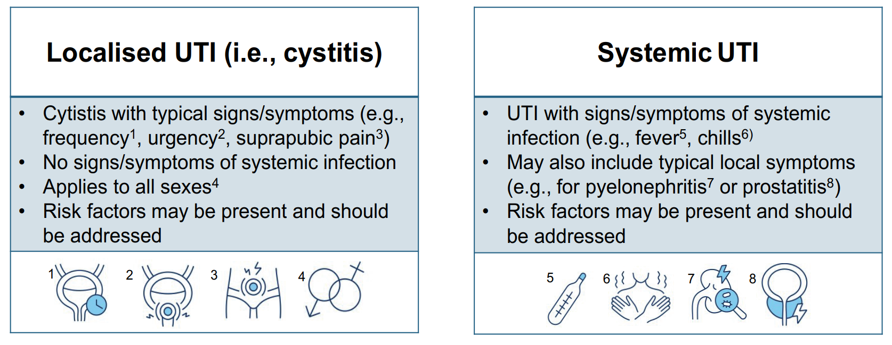
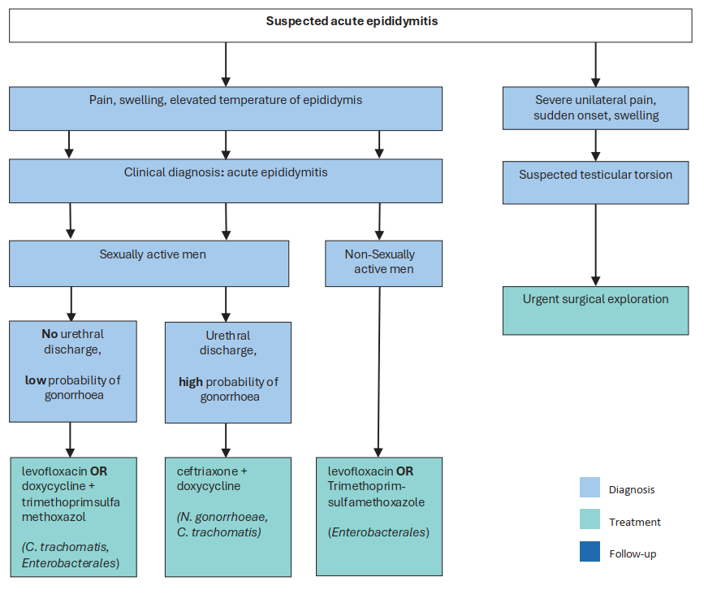
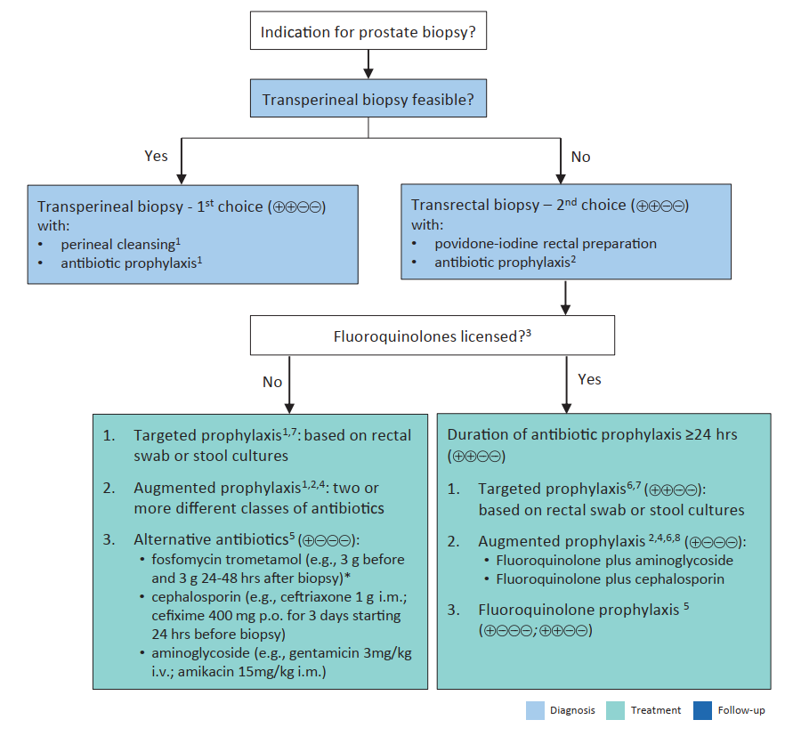

  

    

      
Local vs Systemic

      
Khung phân loại mới loại bỏ hoàn toàn khái niệm có/không biến chứng

    

    

      
100% Sinh Thiết TP

      
Chuyển sang đường tầng sinh môn, giảm tỷ lệ nhiễm khuẩn huyết xuống &lt; 0.1%

    

    

      
CẤM Quinolones PAP

      
Lệnh cấm của Ủy ban Châu Âu đình chỉ Fluoroquinolones dự phòng chu phẫu

    

    

      
Single-Dose PAP

      
Liều duy nhất trước mổ cho PCNL &amp; TURP, không kéo dài sau phẫu thuật

    

  

  

    

      
🏛️

      

        
Tái Định Hình Khung Phân Loại Lâm Sàng

        
Xóa bỏ định kiến giới tính; phân chia rạch ròi giữa nhiễm trùng khu trú (Localised UTI) điều trị ngoại trú và nhiễm trùng toàn thân (Systemic UTI) cần xét nghiệm máu, cấy máu, hình ảnh học và kháng sinh tĩnh mạch.

      

    

    

      
🌿

      

        
Quản Lý Kháng Sinh Chu Đáo (Stewardship)

        
Bảo vệ hàng rào vi khuẩn cộng sinh bằng cách KHÔNG điều trị ABU bừa bãi (RR tái phát 0.28); ưu tiên liệu pháp không kháng sinh (BNO 1045, Cranberry, Methenamine, Estrogen tại chỗ, GAG) trong viêm bàng quang tái phát.

      

    

    

      
⚡

      

        
Cách Mạng Ngoại Khoa &amp; Sinh Thiết Tuyến Tiền Liệt

        
Xóa bỏ đường sinh thiết trực tràng (TR); áp dụng 100% đường tầng sinh môn (TP) và cho phép KHÔNG dùng kháng sinh dự phòng ở bệnh nhân nguy cơ thấp (dữ liệu thử nghiệm NORAPP).

      

    

  

  <a href="#sec-phan-loai-abu" class="quickmenu-item active">1. Phân Loại &amp; ABU</a>
  <a href="#sec-viem-bang-quang" class="quickmenu-item">2. Viêm Bàng Quang</a>
  <a href="#sec-viem-be-than-toan-than" class="quickmenu-item">3. Viêm Bể Thận &amp; Toàn Thân</a>
  <a href="#sec-cauti-nam-khoa" class="quickmenu-item">4. CA-UTI &amp; Nam Khoa</a>
  <a href="#sec-mao-tinh-fournier-nam-lao" class="quickmenu-item">5. Mào Tinh, Fournier &amp; Nấm</a>
  <a href="#sec-du-phong-chu-phau-sinh-thiet" class="quickmenu-item">6. Kháng Sinh Chu Phẫu</a>
  <a href="#sec-trich-dan-y-van" class="quickmenu-item">7. Y Văn &amp; Tra Cứu</a>

  {/* SECTION 1 */}
  

    

      

        🔬
        <h2 class="sec-title">1. Phân Loại Mới EAU (Figure 1), Các Yếu Tố Nguy Cơ &amp; Quản Lý Vi Khuẩn Niệu Không Triệu Chứng (ABU)</h2>
      

      Classification &amp; ABU
    

    

      

        
💡

        

          Bước Chuyển Dịch Mô Hình: Phân Loại Dựa Trên Dấu Hiệu Toàn Thân
          Hội Tiết niệu Châu Âu (EAU 2026) chính thức **xóa bỏ thuật ngữ "có/không biến chứng"** (uncomplicated vs complicated) vốn tiềm ẩn nhiều rủi ro trì hoãn điều trị. Thay vào đó, bệnh nhân được phân tầng trực tiếp theo mức độ xâm lấn:
          <ul style="margin-top: 0.5rem; margin-left: 1.25rem;">
            <li><strong>Nhiễm trùng tiết niệu khu trú (Localised UTI - điển hình là Viêm bàng quang):</strong> Triệu chứng giới hạn tại đường tiểu dưới, <strong>hoàn toàn không có</strong> dấu hiệu nhiễm trùng toàn thân. Áp dụng cho cả nam và nữ.</li>
            <li><strong>Nhiễm trùng tiết niệu toàn thân (Systemic UTI):</strong> Xuất hiện sốt, rét run, hạ thân nhiệt, sảng, hạ huyết áp, đau góc sườn lưng (viêm bể thận cấp hoặc viêm tuyến tiền liệt cấp). Đòi hỏi xét nghiệm máu, cấy máu, chẩn đoán hình ảnh và nhập viện điều trị kháng sinh tĩnh mạch.</li>
          </ul>
        

      

      
Figure 1: Sơ Đồ Phân Loại Nhiễm Trùng Đường Tiết Niệu (EAU 2026 Guidelines)

      

        
        

          
Figure 1. Classification of UTI (EAU Guidelines on Urological Infections 2026)

          Phân định rõ 2 nhánh: <strong>Localised UTI</strong> (Viêm bàng quang, triệu chứng tại chỗ, không có dấu hiệu toàn thân, áp dụng cho mọi giới tính) và <strong>Systemic UTI</strong> (Kèm dấu hiệu toàn thân, viêm bể thận, viêm tuyến tiền liệt, cần giải quyết triệt để các yếu tố nguy cơ đi kèm).
        

      

      
Bảng 1: Đối Chiếu Các Dấu Hiệu &amp; Triệu Chứng Khu Trú vs Toàn Thân (Table 1 EAU 2026)

      

        <table class="data-table">
          <thead>
            <tr>
              <th style="width: 50%;">Triệu Chứng Khu Trú (Localised UTI)</th>
              <th style="width: 50%;">Dấu Hiệu &amp; Triệu Chứng Toàn Thân (Systemic UTI)</th>
            </tr>
          </thead>
          <tbody>
            <tr>
              <td>
                • Tiểu buốt, tiểu rát (Dysuria)
                 • Tiểu gấp (Urgency)
                 • Tiểu nhiều lần, lắt nhắt (Frequency)
                 • Tiểu không tự chủ mới khởi phát (Incontinence)
                 • Chảy mủ niệu đạo (Urethral purulence)
                 • Cảm giác đè nén, đau tức hoặc co thắt vùng hạ vị
              </td>
              <td>
                • <strong>Sốt (&gt; 38°C)</strong> hoặc hạ thân nhiệt (&lt; 36°C)
                 • Cơn rét run, run lập cập (Rigors, shaking chills)
                 • Rối loạn tri giác, lú lẫn, mê sảng (Delirium ở người cao tuổi)
                 • Tụt huyết áp (Hypotension), Nhịp tim nhanh (Tachycardia)
                 • <strong>Đau hoặc gõ đau vùng góc sườn lưng (CVA tenderness)</strong>
              </td>
            </tr>
          </tbody>
        </table>
      

      
Bảng 2: Các Yếu Tố Nguy Cơ Gây Diễn Tiến Phức Tạp Của UTI (Table 2 EAU 2026)

      

        

          

          
Yếu Tố Cơ Địa &amp; Giải Phẫu 👤

          

            <ul class="clin-card-list">
              <li>Trẻ sơ sinh và trẻ nhỏ (Infants).</li>
              <li>Tình trạng suy giảm miễn dịch (Ghép tạng, HIV, ung thư, thuốc ức chế MD).</li>
              <li>Bệnh nhân cao tuổi suy kiệt (Geriatric / frail patients).</li>
              <li>Bất thường giải phẫu hoặc chức năng đường tiết niệu.</li>
              <li>Thể tích nước tiểu tồn dư sau tiểu tiện lớn (Significant PVR).</li>
              <li>Bệnh lý thần kinh bàng quang (Neurourological disease).</li>
              <li>Phụ nữ có thai hoặc sa sinh dục (Pelvic organ prolapse).</li>
            </ul>
          

        

        

          

          
Yếu Tố Ngoại Khoa &amp; Vi Sinh ⚠️

          

            <ul class="clin-card-list">
              <li><strong>Nam giới có tổn thương tuyến tiền liệt</strong> (BPO gây tắc nghẽn, viêm TTL mạn). <em>(Lưu ý: Giới tính nam đơn thuần không còn là yếu tố nguy cơ tự động).</em></li>
              <li>Sỏi đường tiết niệu (Stones) hoặc tắc nghẽn đường niệu.</li>
              <li>Đặt ống thông tiểu lưu (Indwelling catheters).</li>
              <li>Tiền sử sử dụng kháng sinh gần đây hoặc can thiệp thủ thuật niệu khoa.</li>
              <li>Nhiễm các chủng vi khuẩn đa kháng thuốc (ESBL, CRE).</li>
            </ul>
          

        

      

      
Khuyến Cáo Quản Lý Vi Khuẩn Niệu Không Triệu Chứng (Asymptomatic Bacteriuria - ABU)

      

        
⚠️

        

          ABU Là Sự Cư Trú Cộng Sinh Bảo Vệ — Tuyệt Đối Không Điều Trị Bừa Bãi!
          ABU được định nghĩa khi cấy nước tiểu giữa dòng có <strong>&ge; 10⁵ CFU/mL</strong> (2 mẫu liên tiếp ở nữ, 1 mẫu ở nam) mà <strong>hoàn toàn không có triệu chứng</strong>. Vi khuẩn ABU cạnh tranh chỗ bám và ngăn chặn các chủng vi khuẩn độc lực cao. Việc dùng kháng sinh tiêu diệt ABU vô căn cứ sẽ phá hủy hàng rào này và làm tăng nguy cơ bùng phát đợt cấp (<strong>RR = 0.28</strong> ở nhóm không điều trị vs nhóm điều trị).
        

      

      

        <table class="data-table">
          <thead>
            <tr>
              <th style="width: 50%;">KHÔNG SÀNG LỌC &amp; KHÔNG ĐIỀU TRỊ ABU (Khuyến Cáo MẠNH)</th>
              <th style="width: 50%;">BẮT BUỘC SÀNG LỌC &amp; ĐIỀU TRỊ ABU</th>
            </tr>
          </thead>
          <tbody>
            <tr>
              <td>
                ❌ Phụ nữ không có yếu tố nguy cơ.
                 ❌ Bệnh nhân đái tháo đường kiểm soát tốt.
                 ❌ Phụ nữ sau mãn kinh.
                 ❌ Người cao tuổi sống tại viện dưỡng lão.
                 ❌ Bệnh nhân ghép thận ổn định.
                 ❌ Bệnh nhân có bàng quang thần kinh / dẫn lưu hồi tràng (Chủng <em>E. coli 83972</em> bảo vệ bàng quang).
                 ❌ Bệnh nhân đang mang ống thông tiểu lưu (catheter).
                 ❌ Trước phẫu thuật thay khớp háng/gối hoặc tim mạch (Khuyến cáo Yếu).
                 ❌ <strong>Bệnh nhân bị nhiễm trùng tiết niệu tái phát (CÓ HẠI NẾU ĐIỀU TRỊ!).</strong>
              </td>
              <td>
                ✅ <strong>Phụ nữ mang thai (Khuyến cáo YẾU):</strong> Cấy nước tiểu sàng lọc và điều trị phác đồ ngắn ngày (Fosfomycin 3g đơn liều hoặc Nitrofurantoin/Cephalexin 2–7 ngày) giúp giảm viêm bể thận và trẻ nhẹ cân.
                  
                ✅ <strong>Trước can thiệp tiết niệu có xâm lấn phá vỡ niêm mạc (Khuyến cáo MẠNH):</strong> Bắt buộc cấy nước tiểu trước mổ (như TURP, tán sỏi nội soi) và điều trị kháng sinh trúng đích theo kháng sinh đồ để phòng ngừa nhiễm khuẩn huyết hậu phẫu.
              </td>
            </tr>
          </tbody>
        </table>
      

    

  

  {/* SECTION 2 */}
  

    

      

        👩
        <h2 class="sec-title">2. Viêm Bàng Quang Cấp Khu Trú &amp; Viêm Bàng Quang Tái Phát Ở Phụ Nữ</h2>
      

      Cystitis &amp; Recurrences
    

    

      

        

          

          

            
🌿

            
Liệu Pháp Tránh Kháng Sinh (Antibiotic-Sparing)

          

          

            <ul style="margin-left: 1rem; line-height: 1.7;">
              <li><strong>Phytotherapy BNO 1045:</strong> Phối hợp Cây bách bộ, Độc hoạt, Hương thảo chứng minh <strong>không thua kém (non-inferior)</strong> Fosfomycin trong viêm bàng quang cấp.</li>
              <li><strong>Hỗn hợp Xyloglucan + Gelose + Hibiscus + Propolis:</strong> Tạo màng biofilm sinh học ngăn cản <em>E. coli</em> bám dính niêm mạc.</li>
              <li><strong>NSAIDs (Ibuprofen/Diclofenac):</strong> Giảm 63% lượng kháng sinh tiêu thụ nhưng bệnh nhân cần chấp nhận triệu chứng kéo dài hơn; tránh dùng ở người cao tuổi.</li>
            </ul>
          

          
Bảo Vệ Hệ Vi Sinh Vật

        

        

          

          

            
🚫

            
Lệnh Cấm Kháng Sinh Cần Tránh

          

          

            <ul style="margin-left: 1rem; line-height: 1.7;">
              <li><strong>CẤM Fluoroquinolones (Ciprofloxacin/Levofloxacin):</strong> Do quyết định ràng buộc pháp lý của Ủy ban Châu Âu (EC) về độc tính nghiêm trọng, kéo dài lên hệ gân cơ và thần kinh.</li>
              <li><strong>CẤM Aminopenicillins (Amoxicillin, Ampicillin đơn thuần):</strong> Tỷ lệ kháng thuốc toàn cầu của <em>E. coli</em> đã vượt ngưỡng 50%.</li>
              <li><strong>Chống chỉ định Nitrofurantoin khi eGFR &lt; 30 mL/min</strong> vì không đạt nồng độ trong nước tiểu và tích lũy độc tính.</li>
            </ul>
          

          
An Toàn Dược Lý

        

      

      
Bảng 3: Phác Đồ Kháng Sinh Khuyến Cáo Điều Trị Viêm Bàng Quang Cấp (Table 3 EAU 2026)

      

        <table class="regimen-table">
          <thead>
            <tr>
              <th style="width: 25%;">Nhóm Bệnh Nhân &amp; Kháng Sinh</th>
              <th style="width: 25%;">Liều Lượng Hàng Ngày</th>
              <th style="width: 20%;">Thời Gian</th>
              <th style="width: 30%;">Ghi Chú &amp; Cân Nhắc Lâm Sàng</th>
            </tr>
          </thead>
          <tbody>
            <tr>
              <td class="source-cell">Đầu tay Fosfomycin trometamol</td>
              <td>3 g uống</td>
              <td>Liều duy nhất (1 ngày)</td>
              <td>Hiệu quả cao, tiện lợi, tỷ lệ kháng thấp.</td>
            </tr>
            <tr>
              <td class="source-cell">Đầu tay Nitrofurantoin macrocrystal</td>
              <td>50 – 100 mg &times; 4 lần/ngày (hoặc 100mg &times; 2 lần/ngày dạng XR)</td>
              <td>5 ngày</td>
              <td>Chỉ định khi eGFR &ge; 30 mL/min; không dùng cho viêm bể thận.</td>
            </tr>
            <tr>
              <td class="source-cell">Đầu tay Pivmecillinam</td>
              <td>400 mg &times; 3 lần/ngày</td>
              <td>3 – 5 ngày</td>
              <td>Tác động sinh thái thấp, bảo tồn hệ vi sinh đường ruột.</td>
            </tr>
            <tr>
              <td class="source-cell">Đầu tay Nitroxoline</td>
              <td>250 mg &times; 3 lần/ngày</td>
              <td>5 ngày</td>
              <td>Kháng sinh dẫn xuất quinoline dùng phổ biến tại Châu Âu.</td>
            </tr>
            <tr>
              <td class="source-cell">Thay thế Cefadroxil / Cefpodoxime</td>
              <td>500 mg &times; 2 lần/ngày / 100 mg &times; 2 lần/ngày</td>
              <td>3 ngày</td>
              <td>Lựa chọn thay thế khi không dung nạp các thuốc đầu tay.</td>
            </tr>
            <tr>
              <td class="source-cell">Kháng &lt; 20% Trimethoprim-sulfamethoxazole</td>
              <td>160 / 800 mg &times; 2 lần/ngày</td>
              <td>3 ngày (Nữ) 7 ngày (Nam)</td>
              <td>Chỉ dùng nếu tỷ lệ kháng tại địa phương &lt; 20%. Tránh 3 tháng cuối thai kỳ.</td>
            </tr>
          </tbody>
        </table>
      

      
Viêm Bàng Quang Tái Phát (Recurrent Cystitis): Định Nghĩa &amp; Chiến Lược Dự Phòng Đa Tầng

      

        
🔄

        

          Tiêu Chuẩn Chẩn Đoán &amp; Bậc Thang Dự Phòng EAU 2026
          Được xác định khi có <strong>&ge; 3 đợt/năm</strong> hoặc <strong>&ge; 2 đợt trong 6 tháng</strong>, bắt buộc xác nhận bằng cấy nước tiểu. Không chụp chiếu xâm lấn ở phụ nữ trẻ &lt; 40 tuổi không có yếu tố nguy cơ.
            
          <strong>Bậc 1 — Thay đổi lối sống:</strong> Uống thêm 1.5 lít nước/ngày (giảm 50% số đợt cấp), không nhịn tiểu, không thụt rửa âm đạo.
           <strong>Bậc 2 — Dự phòng không dùng kháng sinh (Ưu tiên số 1):</strong>
          <ul style="margin-left: 1.25rem;">
            <li><em>Oestrogen đặt âm đạo:</em> Bắt buộc cho phụ nữ sau mãn kinh để tái tạo biểu mô và khôi phục <em>Lactobacillus</em>.</li>
            <li><em>Cranberry PACs (240mg) / D-mannose:</em> Ức chế vi khuẩn bám dính uroplakin.</li>
            <li><em>Methenamine hippurate (1g &times; 2 lần/ngày):</em> Đã chứng minh <strong>không thua kém kháng sinh dự phòng</strong> và không gây kháng thuốc.</li>
            <li><em>Bơm rửa GAG bàng quang (Hyaluronic acid + Chondroitin sulphate):</em> Phục hồi lớp bảo vệ niêm mạc.</li>
          </ul>
          <strong>Bậc 3 — Kháng sinh dự phòng liều thấp (Chỉ dùng khi Bậc 2 thất bại):</strong> Nitrofurantoin 50–100mg/ngày, Fosfomycin 3g mỗi 10 ngày, hoặc uống 1 liều ngay sau quan hệ tình dục (postcoital).
        

      

    

  

  {/* SECTION 3 */}
  

    

      

        🏥
        <h2 class="sec-title">3. Viêm Bể Thận Cấp &amp; Nhiễm Trùng Hệ Tiết Niệu Toàn Thân (Systemic UTIs)</h2>
      

      Pyelonephritis &amp; Sepsis
    

    

      

        
🚨

        

          Cấp Cứu Tiết Niệu: Tắc Nghẽn Kèm Ứ Mủ Thận (Obstructive Pyelonephritis)
          100% bệnh nhân nghi ngờ viêm bể thận cấp phải được **siêu âm hệ tiết niệu khẩn cấp** để loại trừ sỏi hoặc u chèn ép gây ứ nước/ứ mủ đài bể thận. Nếu có tắc nghẽn, **bắt buộc dẫn lưu giải áp khẩn cấp** (đặt JJ niệu quản hoặc mở thông thận qua da - PCN) song song cùng hồi sức và kháng sinh. Trì hoãn dẫn lưu sẽ dẫn đến sốc nhiễm trùng urosepsis và tử vong trong vài giờ.
        

      

      

        

          

          
Điều Trị Ngoại Trú (Thể Nhẹ – Trung Bình) 💊

          

            <ul class="clin-card-list">
              <li>Chỉ định cho bệnh nhân tỉnh táo, dung nạp được thuốc uống, không nôn, huyết động ổn định.</li>
              <li><strong>Lựa chọn đầu tay:</strong> Fluoroquinolones đường uống (<strong>Ciprofloxacin 500–750mg &times; 2 lần/ngày trong 7 ngày</strong> hoặc <strong>Levofloxacin 500mg/ngày trong 5 ngày</strong>) — <em>với điều kiện tỷ lệ kháng tại địa phương &lt; 10%</em>.</li>
              <li><strong>CẢNH BÁO:</strong> Tuyệt đối <strong>KHÔNG DÙNG</strong> Nitrofurantoin, Fosfomycin uống và Pivmecillinam vì nồng độ trong nhu mô thận và máu không đạt ngưỡng điều trị.</li>
            </ul>
          

        

        

          

          
Điều Trị Nội Trú (Thể Nặng / Toàn Thân) 💉

          

            <ul class="clin-card-list">
              <li>Bắt buộc cấy nước tiểu + cấy máu ngay khi nhập viện (cảnh báo SABSI nếu ra <em>S. aureus</em>).</li>
              <li>Khởi đầu bằng **kháng sinh truyền tĩnh mạch (IV)** phổ rộng.</li>
              <li>Chuyển sang kháng sinh đường uống (oral switch) khi hết sốt sau 48–72 giờ và lâm sàng cải thiện.</li>
              <li>Nếu vẫn sốt sau 72 giờ: Bắt buộc chụp **CT scan bụng có cản quang** tìm ổ áp-xe quanh thận, áp-xe tuyến tiền liệt hoặc sỏi sót.</li>
              <li>Thời gian điều trị ở nam giới có sốt tối thiểu là **2 tuần**.</li>
            </ul>
          

        

      

      
Bảng 6: Phác Đồ Kháng Sinh Truyền Tĩnh Mạch Kinh Nghiệm Trong Viêm Bể Thận Cấp (Table 6 EAU 2026)

      

        <table class="regimen-table">
          <thead>
            <tr>
              <th style="width: 25%;">Phân Tầng Điều Trị</th>
              <th style="width: 35%;">Kháng Sinh Truyền Tĩnh Mạch (IV)</th>
              <th style="width: 40%;">Liều Lượng &amp; Ghi Chú Lâm Sàng</th>
            </tr>
          </thead>
          <tbody>
            <tr>
              <td class="source-cell">Phác đồ đầu tay (First-line)</td>
              <td>
                • Ciprofloxacin (IV)
                 • Levofloxacin (IV)
                 • <strong>Ceftriaxone (IV)</strong>
                 • Cefotaxime (IV)
              </td>
              <td>
                • Ciprofloxacin: 400 mg &times; 2 lần/ngày
                 • Levofloxacin: 500 mg &times; 1–2 lần/ngày
                 • Ceftriaxone: <strong>2 g &times; 1–2 lần/ngày</strong> (liều cao 2g &times; 2 lần cho ca nặng)
                 • Cefotaxime: 2 g &times; 3 lần/ngày
              </td>
            </tr>
            <tr>
              <td class="source-cell">Hàng thứ hai (Second-line)</td>
              <td>
                • Cefepime (IV)
                 • <strong>Piperacillin / Tazobactam (IV)</strong>
                 • Gentamicin / Amikacin (IV)
              </td>
              <td>
                • Cefepime: 1–2 g &times; 2–3 lần/ngày
                 • Pip/Tazo: 4.5 g &times; 3–4 lần/ngày (ưu tiên khi nghi <em>Pseudomonas</em>)
                 • Gentamicin: 6–7 mg/kg &times; 1 lần/ngày (phối hợp)
                 • Amikacin: 25–30 mg/kg &times; 1 lần/ngày
              </td>
            </tr>
            <tr>
              <td class="source-cell">Nghi ngờ đa kháng (ESBL / CRE)</td>
              <td>
                • Meropenem / Imipenem-Cilastatin
                 • Ceftolozane / Tazobactam
                 • Ceftazidime / Avibactam
                 • Meropenem - Vaborbactam
                 • Cefiderocol / Plazomicin
              </td>
              <td>
                • Meropenem: 1 g &times; 3 lần/ngày
                 • Ceftolozane/Tazo: 1.5 g &times; 3 lần/ngày
                 • Ceftazidime/Avi: 2.5 g &times; 3 lần/ngày (cho Enterobacterales &amp; <em>P. aeruginosa</em> kháng)
                 • Cefiderocol: 2 g &times; 3–4 lần/ngày (Siderophore cephalosporin)
              </td>
            </tr>
          </tbody>
        </table>
      

    

  

  {/* SECTION 4 */}
  

    

      

        ♂️
        <h2 class="sec-title">4. Nhiễm Trùng Do Đặt Ống Thông (CA-UTIs), Viêm Niệu Đạo &amp; Viêm Tuyến Tiền Liệt</h2>
      

      Catheters, Urethritis &amp; Prostatitis
    

    

      
Nhiễm Trùng Tiết Niệu Do Đặt Ống Thông (CA-UTIs) (Table 5 EAU 2026)

      

        <table class="data-table">
          <thead>
            <tr>
              <th style="width: 25%;">Khía Cạnh Lâm Sàng</th>
              <th style="width: 75%;">Khuyến Cáo Thực Hành EAU 2026 (Mức Độ Mạnh)</th>
            </tr>
          </thead>
          <tbody>
            <tr>
              <td><strong>Chẩn đoán</strong></td>
              <td>
                • Vi sinh vật phát triển <strong>&ge; 10³ CFU/mL</strong> trong nước tiểu lấy qua ống thông hoặc giữa dòng sau khi rút ống &le; 48 giờ.
                 • <strong>KHÔNG</strong> dùng bạch cầu niệu (pyuria) hay đặc điểm nước tiểu đục/có mùi hôi đơn độc để chẩn đoán CA-UTI hay phân biệt với CA-ABU.
              </td>
            </tr>
            <tr>
              <td><strong>Xử trí ống thông</strong></td>
              <td>
                • <strong>Bắt buộc rút bỏ hoặc thay ống thông tiểu mới</strong> trước khi khởi động kháng sinh (loại bỏ ổ biofilm chứa vi khuẩn đa kháng).
                 • Tối thiểu hóa tối đa số ngày đặt thông tiểu lưu; ưu tiên đặt thông tiểu ngắt quãng (IC) bằng ống phủ hydrophilic.
              </td>
            </tr>
            <tr>
              <td><strong>Điều trị &amp; Dự phòng</strong></td>
              <td>
                • <strong>KHÔNG</strong> điều trị kháng sinh cho vi khuẩn niệu không triệu chứng do đặt ống (CA-ABU), trừ trước can thiệp nội soi niệu.
                 • <strong>KHÔNG</strong> dùng kháng sinh dự phòng khi rút ống thông hoặc đặt thông tiểu ngắt quãng.
                 • Thời gian điều trị CA-UTI: <strong>7 ngày</strong> nếu đáp ứng nhanh, <strong>14 ngày</strong> nếu đáp ứng chậm.
              </td>
            </tr>
          </tbody>
        </table>
      

      
Viêm Niệu Đạo (Urethritis): Phác Đồ Lậu Cầu (GU) vs Không Do Lậu (NGU) (Tables 9 &amp; 10)

      

        <table class="regimen-table">
          <thead>
            <tr>
              <th style="width: 24%;">Căn Nguyên Lâm Sàng</th>
              <th style="width: 40%;">Phác Đồ Kháng Sinh Khuyến Cáo Đầu Tay</th>
              <th style="width: 36%;">Phác Đồ Thay Thế &amp; Lưu Ý</th>
            </tr>
          </thead>
          <tbody>
            <tr>
              <td class="source-cell">Nghi nhiễm Lậu cầu (GU)</td>
              <td><strong>Ceftriaxone 1 – 2 g (IV/IM đơn liều)</strong> + <strong>Doxycycline 100 mg &times; 2 lần/ngày &times; 7 ngày</strong></td>
              <td>Nếu dị ứng Doxycycline: Thay bằng Azithromycin phác đồ 4 ngày (Ngày 1: 1g; Ngày 2–4: 500mg/ngày). Ceftriaxone IV giúp tránh đau tiêm bắp.</td>
            </tr>
            <tr>
              <td class="source-cell">Nghi Viêm niệu đạo không lậu (NGU)</td>
              <td><strong>Doxycycline 100 mg &times; 2 lần/ngày &times; 7 ngày</strong></td>
              <td>Azithromycin phác đồ 4 ngày (Doxycycline vượt trội Azithromycin trong diệt <em>C. trachomatis</em> ở nam giới).</td>
            </tr>
            <tr>
              <td class="source-cell"><em>Mycoplasma genitalium</em></td>
              <td>• <strong>Azithromycin phác đồ 4 ngày</strong> (nếu nhạy Macrolide) • <strong>Moxifloxacin 400 mg/ngày &times; 7 ngày</strong> (nếu kháng Macrolide)</td>
              <td>Sitafloxacin 100 mg &times; 2 lần/ngày &times; 7 ngày nếu thất bại cả hai thuốc trên.</td>
            </tr>
            <tr>
              <td class="source-cell"><em>Trichomonas vaginalis</em></td>
              <td><strong>Metronidazole 1.5 – 2 g uống liều duy nhất</strong></td>
              <td>Tinidazole 2 g uống liều duy nhất. Bắt buộc điều trị đồng thời bạn tình và kiêng QHTD &ge; 7 ngày.</td>
            </tr>
          </tbody>
        </table>
      

      
Viêm Tuyến Tiền Liệt Do Vi Khuẩn (Bacterial Prostatitis) (Table 10 EAU 2026)

      

        
🚫

        

          CẢNH BÁO: CHỐNG CHỈ ĐỊNH XOA BÓP TUYẾN TIỀN LIỆT TRONG ABP
          Trong viêm tuyến tiền liệt cấp (Acute Bacterial Prostatitis - Type I), tuyến tiền liệt căng sưng và cực kỳ đau khi thăm trực tràng (DRE). **Tuyệt đối cấm xoa bóp tuyến tiền liệt (prostatic massage)** vì sẽ đẩy ồ ạt vi khuẩn vào hệ tuần hoàn gây nhiễm khuẩn huyết và sốc nhiễm trùng. Nếu có bí tiểu cấp, đặt **ống mở thông bàng quang trên xương mu (suprapubic tube)** thay vì cố đặt sonde niệu đạo.
        

      

      

        

          

          
Type I: Viêm Cấp Tính (ABP) 🔥

          

            <ul class="clin-card-list">
              <li>Chủ yếu do <em>E. coli</em> và các trực khuẩn <em>Enterobacterales</em>.</li>
              <li>Sốt cao, rét run, đau tầng sinh môn, tiểu khó, tiểu buốt.</li>
              <li><strong>Điều trị:</strong> Kháng sinh truyền tĩnh mạch phổ rộng (Ceftriaxone, Pip/Tazo, Ciprofloxacin IV) trong giai đoạn cấp, sau đó chuyển uống đủ <strong>2 – 4 tuần</strong>.</li>
            </ul>
          

        

        

          

          
Type II: Viêm Mạn Tính (CBP) ⏱️

          

            <ul class="clin-card-list">
              <li>Nhiễm trùng tái diễn &ge; 3 tháng; chẩn đoán bằng nghiệm pháp Meares &amp; Stamey (2 hoặc 4 cốc).</li>
              <li><strong>Lựa chọn đầu tay:</strong> <strong>Fluoroquinolones (Ciprofloxacin / Levofloxacin) uống trong 4 – 6 tuần</strong> nhờ khả năng thâm nhập mô và dịch tuyến tiền liệt vượt trội.</li>
              <li>Nếu do vi khuẩn không điển hình: Doxycycline 100mg &times; 2 lần/ngày trong 10 ngày – 4 tuần.</li>
            </ul>
          

        

      

    

  

  {/* SECTION 5 */}
  

    

      

        🛡️
        <h2 class="sec-title">5. Viêm Mào Tinh Hoàn (Figure 2), Hoại Tử Fournier, Nấm &amp; Lao Hệ Tiết Niệu</h2>
      

      Epididymitis, Fournier, Fungi &amp; TB
    

    

      
Figure 2: Thuật Toán Chẩn Đoán &amp; Xử Trí Viêm Mào Tinh Hoàn Cấp (EAU 2026 Guidelines)

      

        
        

          
Figure 2. Diagnostic and treatment algorithm for men with acute epididymitis (EAU 2026 Guidelines)

          Bước 1: Siêu âm Doppler màu loại trừ khẩn cấp <strong>xoắn tinh hoàn (testicular torsion &rarr; Mổ thám sát cấp cứu)</strong>. Bước 2: Phân nhóm điều trị (Nam trẻ QHTD &rarr; Ceftriaxone 1g + Doxycycline 10–14 ngày; Nam không QHTD/lớn tuổi &rarr; Levofloxacin hoặc TMP-SMX 10–14 ngày).
        

      

      
Hoại Tử Vùng Sinh Dục Fournier (Fournier’s Gangrene) (Table 11 EAU 2026)

      

        
⚡

        

          Viêm Cân Mạc Hoại Tử Tối Khẩn — Cắt Lọc Ngoại Khoa Triệt Để &lt; 24 Giờ
          Nhiễm trùng đa khuẩn độc lực cao lan dọc lá cân dưới da gây tắc mạch hoại tử da bìu và tầng sinh môn, tiếng lạo xạo dưới da (crepitus), dịch mủ hôi thối và sốc nhiễm trùng.
            
          <strong>Xử trí bắt buộc (Khuyến cáo MẠNH):</strong>
           1. <strong>Cắt lọc hoại tử (Surgical debridement) rộng rãi và triệt để trong 24 giờ đầu</strong>, lặp lại nhiều lần nếu cần + dẫn lưu suprapubic.
           2. <strong>Kháng sinh tĩnh mạch phối hợp phổ rộng ngay lập tức:</strong>
           • <strong>Piperacillin/Tazobactam (4.5g mỗi 6–8h IV) + Vancomycin (15mg/kg mỗi 12h IV)</strong>; HOẶC
           • <strong>Meropenem (1g mỗi 8h IV)</strong> / Imipenem-cilastatin (1g mỗi 6h IV); HOẶC
           • <strong>Cefotaxime (2g mỗi 6h) + Metronidazole (500mg mỗi 6h) + Fosfomycin (5g mỗi 8h)</strong>.
        

      

      
Nhiễm Nấm &amp; Lao Hệ Tiết Niệu - Sinh Dục (Tables 12 &amp; 13 EAU 2026)

      

        <table class="data-table">
          <thead>
            <tr>
              <th style="width: 25%;">Bệnh Lý Nhiễm Trùng</th>
              <th style="width: 35%;">Đặc Điểm Sinh Lý Bệnh &amp; Chẩn Đoán</th>
              <th style="width: 40%;">Phác Đồ Điều Trị Khuyến Cáo EAU 2026</th>
            </tr>
          </thead>
          <tbody>
            <tr>
              <td>Nhiễm Nấm Đường Niệu (Fungal UTI)</td>
              <td>Chủ yếu <em>C. albicans</em> (50–70%), <em>C. glabrata</em>. Nguy cơ cao ở BN đái tháo đường, catheter, <strong>dùng thuốc SGLT2i</strong>. <em>Nấm niệu không triệu chứng: KHÔNG điều trị</em> (chỉ rút catheter).</td>
              <td>
                • <strong>Viêm bàng quang nấm:</strong> Fluconazole 200 mg/ngày uống &times; 14 ngày. (Kháng Fluconazole: Bơm rửa bàng quang Amphotericin B deoxycholate 200 mg/L &times; 3 lần/ngày &times; 7 ngày hoặc Caspofungin IV).
                 • <strong>Viêm bể thận nấm toàn thân:</strong> Fluconazole 200–400 mg/ngày &times; 14 ngày (hoặc Flucytosine 25 mg/kg &times; 4 lần/ngày).
              </td>
            </tr>
            <tr>
              <td>Lao Hệ Niệu - Sinh Dục (GUTB)</td>
              <td><em>M. tuberculosis</em> gieo rắc theo đường máu gây xơ hóa, hẹp niệu quản, suy thận (7.4%) hoặc mất chức năng thận một bên (26.9%). <strong>Tiêu chuẩn vàng:</strong> Cấy AFB 3 mẫu nước tiểu sáng sớm liên tiếp + GeneXpert MTB/RIF.</td>
              <td>
                Phác đồ chuẩn 6 tháng WHO:
                 • <strong>2 tháng tấn công:</strong> Isoniazid (H: 5mg/kg) + Rifampicin (R: 10mg/kg) + Pyrazinamide (Z: 25mg/kg) + Ethambutol (E: 15–20mg/kg).
                 • <strong>4 tháng duy trì:</strong> Isoniazid (H) + Rifampicin (R).
              </td>
            </tr>
          </tbody>
        </table>
      

    

  

  {/* SECTION 6 */}
  

    

      

        💉
        <h2 class="sec-title">6. Dự Phòng Kháng Sinh Chu Phẫu &amp; Đột Phá Sinh Thiết Tuyến Tiền Liệt (Figure 4)</h2>
      

      Surgical Prophylaxis &amp; Biopsy
    

    

      
Bảng 15: Khuyến Cáo Kháng Sinh Dự Phòng Chu Phẫu (PAP) Trước Thủ Thuật Tiết Niệu (EAU 2026)

      

        <table class="data-table">
          <thead>
            <tr>
              <th style="width: 32%;">Tên Thủ Thuật / Phẫu Thuật Tiết Niệu</th>
              <th style="width: 20%;">Cần Dự Phòng?</th>
              <th style="width: 48%;">Kháng Sinh Lựa Chọn &amp; Nguyên Tắc Thực Hành</th>
            </tr>
          </thead>
          <tbody>
            <tr>
              <td><strong>Đo niệu động học (Urodynamics)</strong></td>
              <td>KHÔNG</td>
              <td>Khuyến cáo MẠNH không dùng (không giảm clinical UTI).</td>
            </tr>
            <tr>
              <td><strong>Nội soi bàng quang chẩn đoán (Cystoscopy)</strong></td>
              <td>KHÔNG</td>
              <td>Khuyến cáo MẠNH không dùng (kể cả ống soi cứng hay mềm).</td>
            </tr>
            <tr>
              <td><strong>Tán sỏi ngoài cơ thể (ESWL)</strong></td>
              <td>KHÔNG</td>
              <td>Khuyến cáo MẠNH không dùng nếu nước tiểu vô khuẩn (chỉ dùng nếu sỏi nhiễm trùng).</td>
            </tr>
            <tr>
              <td><strong>Nội soi ngược dòng tán sỏi (URS)</strong></td>
              <td>CÓ (Yếu)</td>
              <td>TMP-SMX, Cephalosporin thế hệ 2/3, hoặc Aminopenicillin/BLI.</td>
            </tr>
            <tr>
              <td><strong>Tán sỏi thận qua da (PCNL / PNL)</strong></td>
              <td>CÓ (MẠNH)</td>
              <td><strong>BẮT BUỘC LIỀU DUY NHẤT (Single-dose)</strong> trước mổ (giảm 69% urosepsis, 74% sốt). Không kéo dài sau mổ.</td>
            </tr>
            <tr>
              <td><strong>Cắt nội soi tuyến tiền liệt (TURP)</strong></td>
              <td>CÓ (MẠNH)</td>
              <td>Bắt buộc chỉ định PAP (giảm 49% urosepsis): TMP-SMX, Ceph 2/3 hoặc Aminopenicillin/BLI.</td>
            </tr>
            <tr>
              <td><strong>Cắt u bàng quang nội soi (TURB)</strong></td>
              <td>CHỈ CA NGUY CƠ</td>
              <td>Không dùng thường quy; chỉ dùng khi u lớn, mổ kéo dài hoặc suy giảm miễn dịch.</td>
            </tr>
          </tbody>
        </table>
      

      
Cập Nhật Đột Phá EAU 2026: Sinh Thiết Tuyến Tiền Liệt Đường Tầng Sinh Môn (Figure 4)

      

        
        

          
Figure 4. Prostate biopsy workflow to reduce infectious complications (EAU 2026 Guidelines)

          Lưu đồ quyết định: Ưu tiên lựa chọn số 1 là <strong>Sinh thiết đường tầng sinh môn (Transperineal - TP)</strong> kết hợp sát khuẩn da; <strong>hoàn toàn có thể bỏ qua kháng sinh dự phòng</strong> ở bệnh nhân nguy cơ thấp. Nếu buộc phải sinh thiết trực tràng (TR): Bắt buộc rửa trực tràng bằng Povidone-iodine và <strong>CẤM TUYỆT ĐỐI Fluoroquinolones</strong> (thay bằng dự phòng đích theo cấy quẹt trực tràng hoặc phối hợp tăng cường Ceftriaxone, Fosfomycin, Gentamicin).
        

      

    

  

  {/* SECTION 7 */}
  

    

      

        📚
        <h2 class="sec-title">7. Tài Liệu Tham Khảo Chuẩn AMA &amp; Bảng Viết Tắt Y Khoa</h2>
      

      References &amp; Glossary
    

    

      

        <strong>Tài liệu gốc (AMA Citation):</strong>
         Bonkat G, Kranz J, Cai T, Geerlings SE, Köves B, Lambregts MMC, Mantica G, Pilatz A, Medina-Polo J, Schneidewind L, Schubert S, Vallée M, Veeratterapillay R, Wagenlehner F. <em>EAU Guidelines on Urological Infections 2026</em>. Arnhem, The Netherlands: European Association of Urology (EAU) Guidelines Office; 2026: 1-98.
      

      
Bảng Viết Tắt Y Khoa Chuẩn (Glossary)

      

        <table class="data-table">
          <thead>
            <tr>
              <th style="width: 20%;">Viết Tắt</th>
              <th style="width: 40%;">Thuật Ngữ Tiếng Anh</th>
              <th style="width: 40%;">Ý Nghĩa Lâm Sàng</th>
            </tr>
          </thead>
          <tbody>
            <tr>
              <td><strong>ABP / CBP</strong></td>
              <td>Acute / Chronic Bacterial Prostatitis</td>
              <td>Viêm tuyến tiền liệt vi khuẩn cấp / mạn tính</td>
            </tr>
            <tr>
              <td><strong>ABU</strong></td>
              <td>Asymptomatic Bacteriuria</td>
              <td>Vi khuẩn niệu không triệu chứng</td>
            </tr>
            <tr>
              <td><strong>CA-UTI</strong></td>
              <td>Catheter-Associated Urinary Tract Infection</td>
              <td>Nhiễm trùng tiết niệu do đặt ống thông tiểu</td>
            </tr>
            <tr>
              <td><strong>ESWL</strong></td>
              <td>Extracorporeal Shock Wave Lithotripsy</td>
              <td>Tán sỏi ngoài cơ thể bằng sóng xung kích</td>
            </tr>
            <tr>
              <td><strong>GAG</strong></td>
              <td>Glycosaminoglycan</td>
              <td>Lớp màng nhầy bảo vệ niêm mạc bàng quang</td>
            </tr>
            <tr>
              <td><strong>GUTB</strong></td>
              <td>Genitourinary Tuberculosis</td>
              <td>Lao hệ tiết niệu - sinh dục</td>
            </tr>
            <tr>
              <td><strong>PAP</strong></td>
              <td>Perioperative Antimicrobial Prophylaxis</td>
              <td>Dự phòng kháng sinh chu phẫu</td>
            </tr>
            <tr>
              <td><strong>PCNL / PNL</strong></td>
              <td>Percutaneous Nephrolithotomy</td>
              <td>Phẫu thuật tán sỏi thận qua da</td>
            </tr>
            <tr>
              <td><strong>TP / TR Biopsy</strong></td>
              <td>Transperineal / Transrectal Prostate Biopsy</td>
              <td>Sinh thiết tuyến tiền liệt đường tầng sinh môn / trực tràng</td>
            </tr>
            <tr>
              <td><strong>TURP / TURB</strong></td>
              <td>Transurethral Resection of Prostate / Bladder</td>
              <td>Cắt nội soi tuyến tiền liệt / u bàng quang qua niệu đạo</td>
            </tr>
            <tr>
              <td><strong>URS</strong></td>
              <td>Ureteroscopy</td>
              <td>Nội soi niệu quản ngược dòng tán sỏi</td>
            </tr>
            <tr>
              <td><strong>UTI</strong></td>
              <td>Urinary Tract Infection</td>
              <td>Nhiễm trùng đường tiết niệu</td>
            </tr>
          </tbody>
        </table>
      

    

  

{/* BOTTOM NAVIGATION */}

  

    <a href="#/ebm/kho-guidelines" class="btn btn-primary" style="text-decoration: none;">
      <i class="fa-solid fa-arrow-left"></i> Quay lại Kho Guidelines
    </a>
    <a href="#sec-phan-loai-abu" class="btn" style="text-decoration: none;">
      <i class="fa-solid fa-arrow-up"></i> Lên đầu trang
    </a>
  

