

  

    

      
STAMP on CKD

      
Khung Chiến Lược Tiếp Cận Tim - Thận Chuẩn Hóa

    

    

      
SBP 120–129

      
Đích Huyết Áp Tích Cực khi eGFR ≥ 30 (Class I, A)

    

    

      
SGLT2i Nền Tảng

      
Chỉ định cho mọi BN Suy tim có eGFR ≥ 20 (Class I, A)

    

    

      
uNa ≥ 70 mmol/L

      
Đích Natri Niệu 2h trong Giải Áp Sung Huyết DHF

    

  

  {/* SECTION 1 */}
  

    

      📌
      <h2 class="sec-title">Phần 1: Khung Chiến Lược "STAMP on CKD" &amp; Tầm Soát Nguy Cơ Tim - Thận</h2>
    

    

      
      

        💡
        

          <strong>Bối Cảnh &amp; Ý Nghĩa Lâm Sàng ESC 2026:</strong>
          Sự đồng mắc giữa bệnh lý tim mạch (CVD) và bệnh thận mạn (CKD) tạo nên vòng xoắn bệnh lý nguy hiểm: CKD làm tăng gấp bội biến cố mạch vành, suy tim và đột quỵ; ngược lại, suy tim và xơ vữa mạch máu đẩy nhanh tốc độ suy giảm chức năng lọc cầu thận. Hướng dẫn ESC 2026 là tài liệu thực hành chuyên biệt đầu tiên áp dụng <strong>hệ thống phân cấp mức độ bằng chứng cải tiến (LoE A, B1, B2, C)</strong> nhằm tối ưu hóa chẩn đoán, điều trị bảo vệ kép Tim - Thận.
        

      

      
1. Khung Chiến Lược Hành Động 5 Bước "STAMP on CKD" (Figure 1 Central Illustration)

      
      

        

          
S

          

            <strong>Screen (Tầm soát Hệ thống):</strong> Class I, Level C 
            Khuyến cáo tầm soát đồng thời <strong>eGFR</strong> (dựa trên Creatinine hoặc Cystatin C) và <strong>uACR nước tiểu</strong> cho tất cả bệnh nhân có bệnh lý tim mạch (CVD) ngay tại thời điểm chẩn đoán, và lặp lại <strong>tối thiểu 1 lần/năm</strong> ở bệnh nhân đái tháo đường.
          

        

        

          
T

          

            <strong>Triage &amp; Stage (Phân tầng Giai đoạn &amp; Xác định Mạn tính):</strong> 
            Chẩn đoán xác định CKD khi có eGFR &lt; 60 ml/min/1.73 m² hoặc uACR ≥ 3 mg/mmol (≥ 30 mg/g) kéo dài <strong>≥ 3 tháng</strong>. Phân nhóm theo hệ thống CGA (G1–G5 và A1–A3). Tầm soát nguyên nhân nền bằng que nhúng nước tiểu tìm hồng cầu (Class I) và siêu âm hệ tiết niệu (Class IIa).
          

        

        

          
A

          

            <strong>Address CKD Risk (Kiểm soát Nguy cơ Tiến triển CKD &amp; Tim mạch):</strong> 
            • Cai hoàn toàn thuốc lá, kiểm soát cân nặng (Class I). 
            • Khởi trị bộ ba bảo vệ nền tảng: <strong>ACEi/ARB + SGLT2i + Statin</strong> (Class I). 
            • Kiểm soát huyết áp tâm thu mục tiêu <strong>120–129 mmHg</strong> nếu dung nạp được (Class I, Level A). 
            • Bổ sung thêm <strong>GLP-1 RA</strong> hoặc <strong>ns-MRA (Finerenone)</strong> ở bệnh nhân ĐTĐ Típ 2 kèm CKD có albumin niệu (Class I).
          

        

        

          
M

          

            <strong>Modify CVD Management (Hiệu chỉnh Điều trị Tim mạch theo mức eGFR):</strong> 
            • <strong>Suy tim:</strong> SGLT2i khi eGFR ≥ 20 (Class I); sMRA khi eGFR ≥ 30 (Class I); GLP-1 RA cho HFpEF béo phì khi eGFR ≥ 15 (Class IIa). 
            • <strong>Hội chứng vành cấp (ACS):</strong> Không trì hoãn tái thông mạch vành vì eGFR giảm (Class I); ưu tiên can thiệp qua đường động mạch quay (Class IIa); rút ngắn DAPT còn 1–3 tháng nếu nguy cơ xuất huyết cao. 
            • <strong>Rung nhĩ:</strong> Khởi trị thuốc ức chế yếu tố Xa (DOAC) khi eGFR 15–29 ml/min (Class I). Khi eGFR &lt; 15 hoặc lọc máu: cá thể hóa cao độ (Class IIa).
          

        

        

          
P

          

            <strong>Plan Health Services (Xây dựng Mô hình Đa Chuyên Khoa Tích Hợp):</strong> 
            Thiết lập sự phối hợp chặt chẽ giữa Bác sĩ Tim mạch và Bác sĩ Thận học (Class I) cùng điều dưỡng chuyên khoa, dược sĩ lâm sàng và chuyên gia dinh dưỡng để quản lý tối ưu các biến chứng phức tạp.
          

        

      

      

        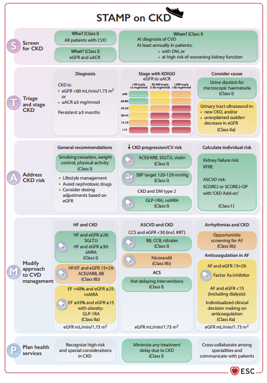
        

          
Figure 1. Sơ đồ Minh họa Trung tâm: Chiến lược Hành động "STAMP on CKD"

          Tóm tắt toàn bộ 5 bước can thiệp hệ thống: S (Tầm soát eGFR + uACR), T (Phân loại CGA &amp; loại trừ AKI), A (Kiểm soát lối sống, huyết áp 120–129 mmHg, statin, ACEi/ARB, SGLT2i, nsMRA/GLP-1RA), M (Hiệu chỉnh điều trị suy tim, ACS, rung nhĩ theo eGFR), và P (Lập kế hoạch phối hợp liên chuyên khoa Tim - Thận).
        

      

      
2. Phân Tầng Giai Đoạn CGA &amp; Dự Báo Nguy Cơ Toàn Diện (Figure 3 ESC 2026)

      

        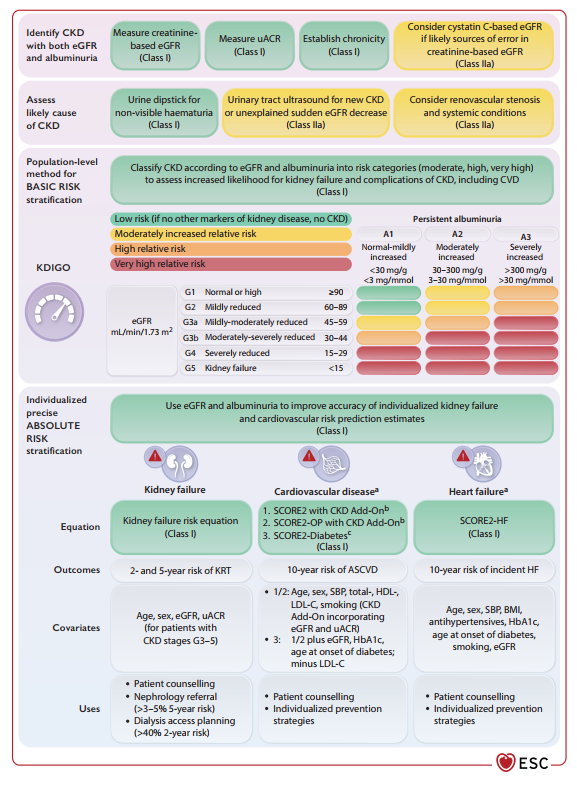
        

          
Figure 3. Tiếp cận Phân loại Bệnh Thận Mạn &amp; Dự Báo Nguy Cơ Tim Mạch - Thận

          Quy trình 3 bước: (1) Xác định ban đầu bằng Creatinine eGFR (Class I), uACR nước tiểu (Class I), Cystatin C (Class IIa), que thử hồng cầu (Class I) và siêu âm thận (Class IIa); (2) Phân tầng nguy cơ Heatmap KDIGO (Xanh lá, Vàng, Cam, Đỏ); (3) Dự báo nguy cơ tuyệt đối cá thể hóa bằng KFRE (suy thận 2y/5y), SCORE2/SCORE2-OP/SCORE2-Diabetes với CKD Add-on (biến cố xơ vữa 10 năm) và SCORE2-HF (mới mắc suy tim).
        

      

      
3. Các Thang Điểm Đánh Giá Nguy Cơ Tim Mạch Tích Hợp eGFR (Table 4 ESC 2026)

      
      

        <table class="med-table">
          <thead>
            <tr>
              <th>Quần Thể Bệnh Nhân</th>
              <th>Thang Điểm Khuyến Cáo</th>
              <th>Biến Cố Dự Báo &amp; Đặc Điểm Nổi Bật</th>
            </tr>
          </thead>
          <tbody>
            <tr>
              <td><strong>Chưa có ASCVD &amp; Chưa có ĐTĐ (&lt; 70 tuổi)</strong></td>
              <td><strong>SCORE2 + CKD Add-on</strong></td>
              <td>Dự báo nguy cơ biến cố ASCVD trong 10 năm; tích hợp cả <strong>eGFR</strong> và <strong>uACR</strong>.</td>
            </tr>
            <tr>
              <td><strong>Chưa có ASCVD &amp; Chưa có ĐTĐ (≥ 70 tuổi)</strong></td>
              <td><strong>SCORE2-OP + CKD Add-on</strong></td>
              <td>Dự báo nguy cơ ASCVD 10 năm ở người cao tuổi; hiệu chỉnh nguy cơ tử vong cạnh tranh.</td>
            </tr>
            <tr>
              <td><strong>Có Đái tháo đường nhưng chưa có ASCVD (≥ 40 tuổi)</strong></td>
              <td><strong>SCORE2-Diabetes</strong></td>
              <td>Dự báo nguy cơ biến cố tim mạch xơ vữa 10 năm ở bệnh nhân đái tháo đường.</td>
            </tr>
            <tr>
              <td><strong>Chưa có ASCVD, muốn dự phòng suy tim (≥ 40 tuổi)</strong></td>
              <td><strong>SCORE2-HF</strong></td>
              <td>Dự báo nguy cơ 10 năm <strong>mới mắc Suy tim</strong> (bất kể trạng thái đái tháo đường).</td>
            </tr>
            <tr>
              <td><strong>Đã có tiền sử ASCVD thiết lập</strong></td>
              <td><strong>SMART2 / SMART2-HF</strong></td>
              <td>Dự báo nguy cơ tái phát biến cố mạch vành hoặc khởi phát suy tim thứ phát trong 10 năm.</td>
            </tr>
            <tr>
              <td><strong>Đã có tiền sử Suy tim HFpEF</strong></td>
              <td><strong>LIFE-Preserved</strong></td>
              <td>Ước tính nguy cơ trọn đời (lifetime risk) bị tái nhập viện vì suy tim hoặc tử vong tim mạch.</td>
            </tr>
            <tr>
              <td><strong>CKD Giai đoạn G3–G5</strong></td>
              <td><strong>KFRE (4 biến / 8 biến)</strong></td>
              <td>Class I Ước tính nguy cơ tuyệt đối cần lọc máu/ghép thận trong 2 năm và 5 năm.</td>
            </tr>
          </tbody>
        </table>
      

      

        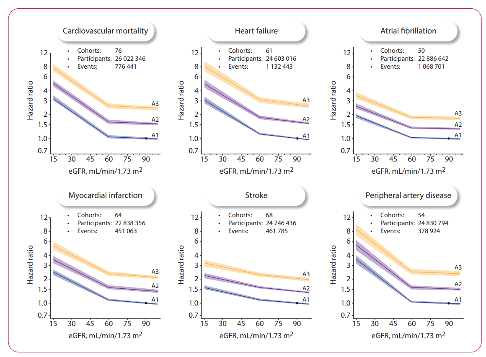
        

          
Figure 6. Tương Quan Giữa Mức Lọc Cầu Thận eGFR, Albumin Niệu &amp; Nguy Cơ Biến Cố Tim Mạch

          Đồ thị thể hiện mối liên quan phi tuyến tính giữa eGFR và phân nhóm uACR (A1, A2, A3) với tỷ số nguy cơ (Hazard Ratio) của 6 biến cố tim mạch chính: Suy tim, Rung nhĩ, Tử vong tim mạch, Bệnh động mạch ngoại biên, Đột quỵ và Nhồi máu cơ tim. Nguy cơ tăng vọt rõ rệt khi eGFR &lt; 60 ml/min/1.73 m² và khi albumin niệu tiến triển từ A1 lên A3.
        

      

    

  

  {/* SECTION 2 */}
  

    

      🫀
      <h2 class="sec-title">Phần 2: Phác Đồ Điều Trị Suy Tim Mạn Theo Dải eGFR &amp; LVEF</h2>
    

    

      
      
1. Nguyên Tắc Điều Trị Nội Khoa Suy Tim Mạn Theo eGFR (Figure 9 ESC 2026)

      

        🌟
        

          Class I, Level A
          <strong>SGLT2i Cho Mọi Thể Suy Tim:</strong> Thuốc ức chế SGLT2 (Dapagliflozin hoặc Empagliflozin) được khuyến cáo cho tất cả bệnh nhân suy tim đồng mắc CKD có <strong>eGFR ≥ 20 ml/min/1.73 m² bất kể phân suất tống máu thất trái (LVEF)</strong> nhằm giảm tử vong tim mạch, giảm nhập viện vì suy tim và bảo tồn chức năng thận dài hạn.
        

      

      

        
        

          
Figure 9. Phác Đồ Dược Lý Điều Trị Suy Tim Đồng Mắc Bệnh Thận Mạn Theo LVEF &amp; eGFR

          Phân cấp điều trị: Lợi tiểu quai (Class I) khi có sung huyết và SGLT2i (Class I) khi eGFR ≥ 20 bất kể LVEF. Đối với HFrEF: ACEi/ARB/ARNI + BB + sMRA (Class I) khi eGFR ≥ 30; nếu eGFR 15–29 dùng BB (Class I), ACEi/ARB/ARNI liều thấp (Class IIb) và Hydralazine/ISDN (Class IIa). Đối với HFpEF: SGLT2i (Class I), MRA (Class IIa), và GLP-1 RA (Class IIa) khi béo phì.
        

      

      
2. Quy Trình Khởi Trị, Tăng Liều &amp; Theo Dõi Xét Nghiệm (Figure 11 ESC 2026)

      
      

        

          
1

          

            <strong>Mốc Ngày +7 đến +14 (Khởi trị sMRA):</strong> 
            Đánh giá 3 tiêu chuẩn an toàn: <strong>SBP &gt; 100 mmHg</strong>, <strong>eGFR ≥ 30 ml/min</strong>, và <strong>Kali máu K+ &lt; 5.0 mmol/L</strong>. 
            &rarr; Nếu đạt tiêu chuẩn: Khởi trị Spironolactone 12.5–25 mg/ngày hoặc Eplerenone 25 mg/ngày. 
            &rarr; Nếu không đạt: Thực hiện chiến lược tối ưu hóa rào cản (ngừng nephrotoxin, bổ sung lợi tiểu thải kali, dùng potassium binder).
          

        

        

          
2

          

            <strong>Mốc Ngày +14 đến +21 (Tăng liều ARNI / ACEi):</strong> 
            Đánh giá: Mức sụt giảm eGFR &lt; 30% so với ban đầu, Kali máu K+ &lt; 5.5 mmol/L, và không có tụt huyết áp triệu chứng. 
            &rarr; Tiến hành tăng liều ARNI hoặc ACEi đến liều mục tiêu tối đa dung nạp được.
          

        

        

          
3

          

            <strong>Mốc Ngày +28 đến +42 (Tăng liều Chẹn Beta):</strong> 
            Đánh giá: Tần số tim &gt; 60 bpm và không có tụt huyết áp tư thế. 
            &rarr; Tăng liều chẹn Beta (Bisoprolol, Metoprolol succinate, Carvedilol) đến liều đích.
          

        

      

      

        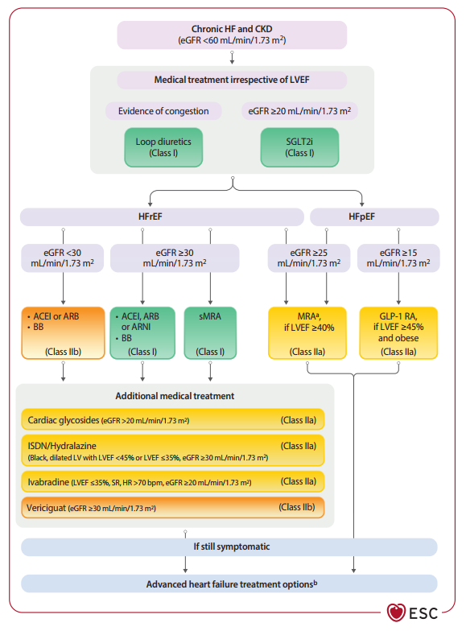
        

          
Figure 11. Quy Trình Theo Dõi Chức Năng Thận &amp; Tối Ưu Hóa Liều FMT trong HFrEF Đồng Mắc CKD

          Lưu đồ phân nhóm Baseline eGFR (&lt;15, 15–29, 30–59, ≥60 ml/min), các mốc theo dõi huyết thanh Ngày +7 đến +14, Ngày +14 đến +21, Ngày +28 đến +42, cùng các chiến lược xử trí khi huyết áp thấp, eGFR giảm, tăng kali máu hoặc nhịp tim chậm.
        

      

      
3. Quy Tắc Xử Trí Khi eGFR Sụt Giảm Đột Ngột Trong Điều Trị Suy Tim Mạn

      
      

        

          
🛡️ Tiếp Tục Duy Trì SGLT2i Khi eGFR &lt; 20

          

            Class IIa, Level C 
            Khuyến cáo <strong>tiếp tục duy trì sử dụng SGLT2i</strong> ở bệnh nhân suy tim mạn đồng mắc CKD ngay cả khi eGFR tiến triển sụt giảm xuống dưới 20 ml/min/1.73 m², nhằm tránh làm bùng phát suy tim nặng và tử vong. 
            <em>Điều kiện:</em> Tổng mức giảm eGFR &lt; 50% so với ban đầu và Kali máu ≤ 5.5 mmol/L.
          

        

        

          
🛡️ Tiếp Tục Duy Trì ARNI Khi eGFR &lt; 30

          

            Class IIa, Level C 
            Khuyến cáo <strong>tiếp tục duy trì sử dụng ARNI (Sacubitril/Valsartan)</strong> khi eGFR sụt giảm dưới 30 ml/min/1.73 m² để ngăn ngừa đợt cấp suy tim. 
            <em>Điều kiện:</em> Tổng mức giảm eGFR &lt; 50% so với ban đầu và Kali máu &lt; 5.5 mmol/L.
          

        

      

    

  

  {/* SECTION 3 */}
  

    

      🌊
      <h2 class="sec-title">Phần 3: Suy Tim Mất Bù (DHF), Giải Áp Định Hướng Natri Niệu &amp; WRF</h2>
    

    

      
      
1. Phác Đồ Giải Áp Sung Huyết Định Hướng Natri Niệu (Figure 10 ESC 2026)

      

        <table class="med-table">
          <thead>
            <tr>
              <th>Tình Trạng Dùng Lợi Tiểu Ngoại Trú</th>
              <th>Liều Khởi Đầu Furosemide Tĩnh Mạch (IV) Chuẩn Hóa</th>
            </tr>
          </thead>
          <tbody>
            <tr>
              <td><strong>Đã dùng lợi tiểu quai mạn tính ngoại trú</strong></td>
              <td>Tiêm tĩnh mạch liều bằng <strong>2.0 đến 2.5 lần</strong> tổng liều uống hàng ngày của bệnh nhân (Class IIb).</td>
            </tr>
            <tr>
              <td><strong>Chưa từng dùng lợi tiểu trước đó (Diuretic Naive)</strong></td>
              <td>
                Phân liều tiêm tĩnh mạch theo mức eGFR (Class IIa): 
                • <strong>eGFR &lt; 30:</strong> Tiêm tĩnh mạch <strong>160 mg</strong> Furosemide. 
                • <strong>eGFR 30–44:</strong> Tiêm tĩnh mạch <strong>120 mg</strong> Furosemide. 
                • <strong>eGFR ≥ 45:</strong> Tiêm tĩnh mạch <strong>80 mg</strong> Furosemide.
              </td>
            </tr>
          </tbody>
        </table>
      

      

        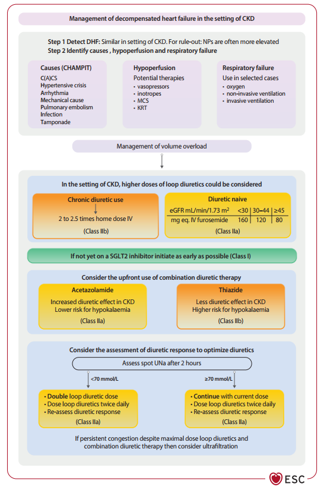
        

          
Figure 10. Phác Đồ Quản Lý Suy Tim Mất Bù (DHF) Trong Bối Cảnh Bệnh Thận Mạn

          Lưu đồ giải áp sung huyết tích cực: Đánh giá cấp cứu (CHAMPIT, giảm tưới máu), khởi liều Furosemide IV theo mức eGFR hoặc gấp 2–2.5x liều uống, khởi trị sớm SGLT2i (Class I), phối hợp Acetazolamide IV 500mg (Class IIa) hoặc Thiazide (Class IIb), đánh giá Natri niệu 2h (mục tiêu uNa ≥ 70 mmol/L), và xem xét lọc máu siêu lọc khi kháng trị.
        

      

      
2. Phân Biệt &amp; Xử Trí Suy Giảm Chức Năng Thận Nặng Dần (WRF) (Figure 12 ESC 2026)

      

        ⚠️
        

          Class I, Level C
          <strong>Tiếp Tục Lợi Tiểu Dù Creatinine Tăng Khi Đáp Ứng Tốt:</strong> Ở bệnh nhân suy tim mất bù nhập viện có đáp ứng lợi tiểu tốt, khuyến cáo <strong>tiếp tục duy trì liệu pháp giải áp sung huyết ngay cả khi creatinine huyết thanh tăng lên tới 50% so với ban đầu</strong>, nhằm đạt được trạng thái giải áp sung huyết hoàn toàn trước khi xuất viện. (Creatinine tăng trong bối cảnh này phản ánh sự cô đặc máu và giảm áp lực tĩnh mạch thận có lợi, không phải hoại tử ống thận cấp).
        

      

      

        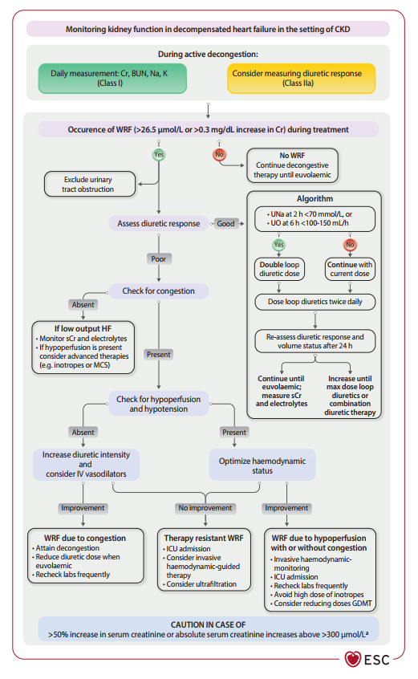
        

          
Figure 12. Theo Dõi Chức Năng Thận &amp; Xử Trí Hiện Tượng Suy Thận Nặng Dần (WRF) Trong Suy Tim Mất Bù

          Phân nhánh xử trí WRF: Đánh giá đáp ứng lợi tiểu tốt vs kém. Nếu kém: phân biệt WRF do sung huyết tĩnh mạch thận (tăng lợi tiểu + thuốc giãn mạch) vs WRF do giảm tưới máu (chuyển ICU, giảm GDMT, tránh vận mạch liều cao) vs WRF kháng trị (lọc máu siêu lọc). Cảnh báo nguy hiểm khi Creatinine tăng &gt; 50% hoặc &gt; 300 µmol/L (~2.5 mg/dL).
        

      

    

  

  {/* SECTION 4 */}
  

    

      📈
      <h2 class="sec-title">Phần 4: Kiểm Soát Huyết Áp, Lipid, Thiếu Máu &amp; Rối Loạn Điện Giải</h2>
    

    

      
      
1. Chiến Lược Kiểm Soát Huyết Áp Nghiêm Ngặt Ở Bệnh Nhân CKD

      

        🎯
        

          Class I, Level A
          <strong>Mục Tiêu Huyết Áp Tâm Thu 120–129 mmHg Khi eGFR ≥ 30:</strong> Khuyến cáo hạ áp tích cực hướng tới đích SBP <strong>120–129 mmHg</strong> (đo chuẩn hóa tại phòng khám có nhân viên y tế chứng kiến) cho bệnh nhân CKD có eGFR ≥ 30 ml/min/1.73 m² và huyết áp ban đầu ≥ 130/80 mmHg nhằm giảm tối đa biến cố tim mạch và giảm đạm niệu. (Dữ liệu từ thử nghiệm SPRINT và ESPRIT chứng minh an toàn không làm tăng suy thận giai đoạn cuối).
        

      

      

        

          
🩺 Tầm Soát Huyết Áp Ngoài Phòng Khám

          

            Class I, Level C 
            Khuyến cáo đo huyết áp liên tục 24 giờ (ABPM) hoặc tự đo tại nhà (HBPM) để phát hiện kiểu hình <strong>tăng huyết áp ẩn giấu (masked HTN)</strong> và <strong>tăng huyết áp ban đêm (night-time HTN)</strong> - yếu tố tiên lượng tổn thương thận rất nặng ở bệnh nhân CKD.
          

        

        

          
🎯 Cá Thể Hóa Khi eGFR &lt; 30 ml/min

          

            Class I, Level C 
            Đối với bệnh nhân CKD giai đoạn G4–G5 (eGFR &lt; 30), áp dụng <strong>mục tiêu huyết áp cá thể hóa</strong> dựa trên triệu chứng và khả năng dung nạp của người bệnh để phòng ngừa nguy cơ thiếu máu tưới máu não và vành.
          

        

      

      
2. Quản Lý Rối Loạn Lipid Máu &amp; Dự Phòng Đột Quỵ (Figure 15 ESC 2026)

      

        <table class="med-table">
          <thead>
            <tr>
              <th>Nhóm Bệnh Nhân CKD</th>
              <th>Khuyến Cáo Điều Trị Lipid (ESC 2026)</th>
              <th>Mức Độ (COR / LOE)</th>
            </tr>
          </thead>
          <tbody>
            <tr>
              <td><strong>CKD Chưa lọc máu (eGFR 15–60 ml/min)</strong></td>
              <td>Khởi trị ngay <strong>Statin cường độ trung bình/cao ± Ezetimibe</strong> bất kể nồng độ lipid nền (Thử nghiệm SHARP).</td>
              <td>Class I, Level A</td>
            </tr>
            <tr>
              <td><strong>Bệnh nhân Sau Ghép Thận</strong></td>
              <td>Khởi trị Statin dự phòng biến cố mạch vành (Thử nghiệm ALERT). Chú ý giảm liều statin khi dùng chung Ciclosporin (Atorvastatin max 10mg, Pravastatin max 20mg, Rosuvastatin max 5mg).</td>
              <td>Class I</td>
            </tr>
            <tr>
              <td><strong>CKD có Hội chứng vành mạn (CCS) còn LDL-C ≥ 1.8 mmol/L</strong></td>
              <td>Phối hợp thêm thuốc ức chế PCSK9 (Evolocumab hoặc Alirocumab) (Thử nghiệm FOURIER &amp; ODYSSEY).</td>
              <td>Class IIa, Level B1</td>
            </tr>
            <tr>
              <td><strong>Bệnh nhân Đang Lọc Máu Chu Kỳ</strong></td>
              <td>
                • <strong>Không khởi trị mới Statin</strong> nếu không có ASCVD thiết lập (Class III). 
                • Cân nhắc khởi trị statin nếu đã có tiền sử ASCVD rõ rệt (Class IIb, Level C). 
                • Tiếp tục duy trì phác đồ statin nếu đã dùng ổn định từ trước lọc máu (Class IIb).
              </td>
              <td>Class III / Class IIb</td>
            </tr>
          </tbody>
        </table>
      

      

        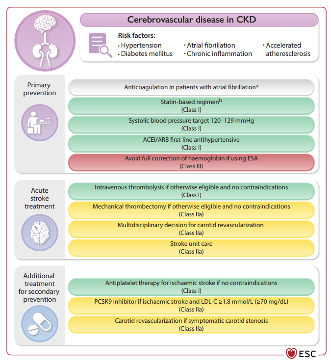
        

          
Figure 15. Dự Phòng &amp; Quản Lý Đột Quỵ Não Ở Bệnh Nhân Bệnh Thận Mạn

          Chiến lược đa yếu tố: Kiểm soát huyết áp tích cực 120–129 mmHg, liệu pháp hạ lipid Statin ± Ezetimibe ± PCSK9i (giảm 20% đột quỵ thiếu máu cho mỗi 1.0 mmol/L LDL-C hạ được), kiểm soát thiếu máu an toàn (tránh hiệu chỉnh hoàn toàn Hb bằng ESA), và dùng kháng đông DOACs khi có rung nhĩ.
        

      

      
3. Quản Lý Thiếu Máu, Thiếu Sắt &amp; Giám Sát Kali Máu (Figure 8 ESC 2026)

      

        

          
💉 Sắt Truyền Tĩnh Mạch trong Suy Tim &amp; CKD

          

            Class IIa, Level B1 
            Khuyến cáo bổ sung <strong>sắt truyền tĩnh mạch (FCM hoặc FDM)</strong> cho bệnh nhân HFrEF có triệu chứng kèm thiếu sắt (<strong>Ferritin &lt; 100 ng/ml</strong> HOẶC <strong>Ferritin 100–299 ng/ml kèm TSAT &lt; 20%</strong>) bất kể có thiếu máu hay không, giúp giảm tái nhập viện vì suy tim. 
            • <em>Bệnh nhân lọc máu:</em> Bổ sung sắt IV liều cao chủ động (Class I, thử nghiệm PIVOTAL).
          

        

        

          
🚫 Mục Tiêu Hb Nghiêm Ngặt &amp; Cấm Hiệu Chỉnh Hoàn Toàn

          

            • Chỉ khởi trị thuốc kích thích tạo hồng cầu (ESAs) khi <strong>Hb &lt; 9.0 – 10.0 g/dL</strong>. 
            • <strong>Đích kiểm soát:</strong> Duy trì Hb trong khoảng <strong>10.0 – 11.5 g/dL</strong>. 
            • Class III (Chống chỉ định) <strong>Cấm hiệu chỉnh hoàn toàn thiếu máu về mức bình thường (Hb &gt; 11.5 g/dL) bằng ESAs</strong> vì làm tăng vọt nguy cơ đột quỵ não và huyết khối tắc mạch (Thử nghiệm TREAT).
          

        

      

      

        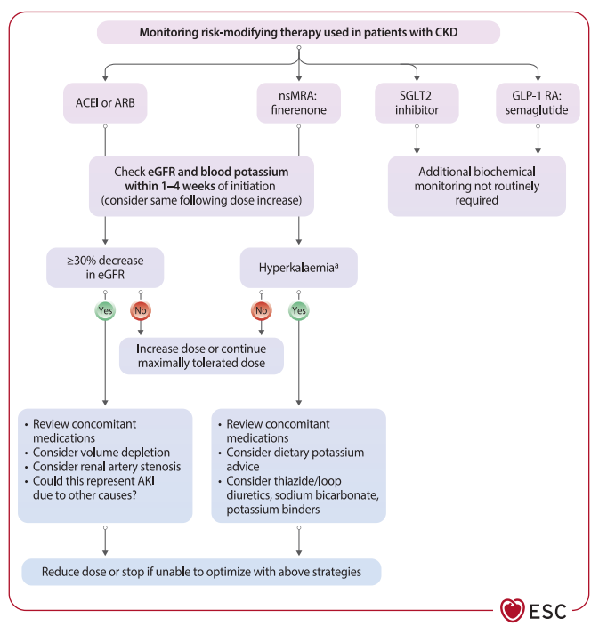
        

          
Figure 8. Cẩm Nang Theo Dõi Lâm Sàng &amp; Sinh Hóa Các Thuốc Bảo Vệ Tim - Thận

          Ngưỡng khởi trị an toàn (eGFR ≥ 20 cho SGLT2i, eGFR ≥ 25 cho Finerenone), lịch xét nghiệm eGFR/K+ ở tuần 1–4, ngưỡng ngắt thuốc khẩn cấp khi K+ ≥ 6.0 mmol/L, và chiến lược hạ kali bảo tồn (Patiromer/SZC Class IIa, lợi tiểu quai, sửa toan) ở dải K+ 5.5–6.0 mmol/L.
        

      

    

  

  {/* SECTION 5 */}
  

    

      🩺
      <h2 class="sec-title">Phần 5: Ma Trận Can Thiệp, Hội Chứng Vành Cấp (ACS) &amp; Kháng Đông</h2>
    

    

      
      
1. Ma Trận Can Thiệp Y Tế Toàn Diện Theo Bệnh Đồng Mắc (Figure 2 ESC 2026)

      

        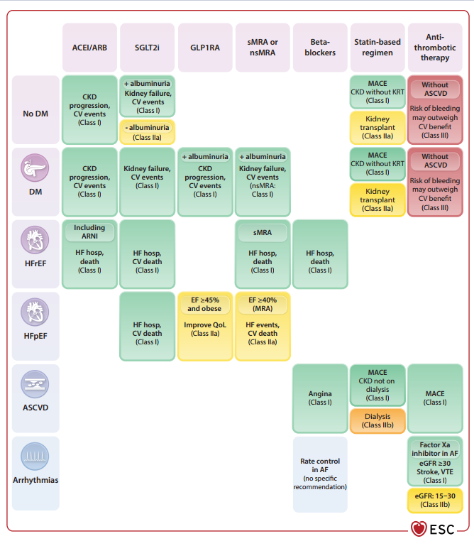
        

          
Figure 2. Ma Trận Can Thiệp Dược Lý Khuyến Cáo Theo Trạng Thái Đái Tháo Đường &amp; Thể Bệnh Tim Mạch

          Bản đồ 2 chiều tích hợp: RAASi (Class I cho CKD, HFrEF), SGLT2i (Class I cho CKD có albumin niệu, HFrEF, HFpEF), GLP-1 RA (Class I cho ĐTĐ + Albumin niệu, Class IIa cho HFpEF béo phì), nsMRA Finerenone (Class I cho ĐTĐ + Albumin niệu), sMRA (Class I cho HFrEF, Class IIa cho HFpEF), Chẹn Beta (Class I cho HFrEF, ASCVD), Statin (Class I cho CKD chưa lọc máu), Kháng huyết khối (Class III cho phòng ngừa tiên phát không ASCVD, Class I Factor Xa inhibitor cho Rung nhĩ).
        

      

      
2. Thuật Toán Quản Lý Hội Chứng Mạch Vành Cấp Trên BN Thận Mạn (Figure 14 ESC 2026)

      

        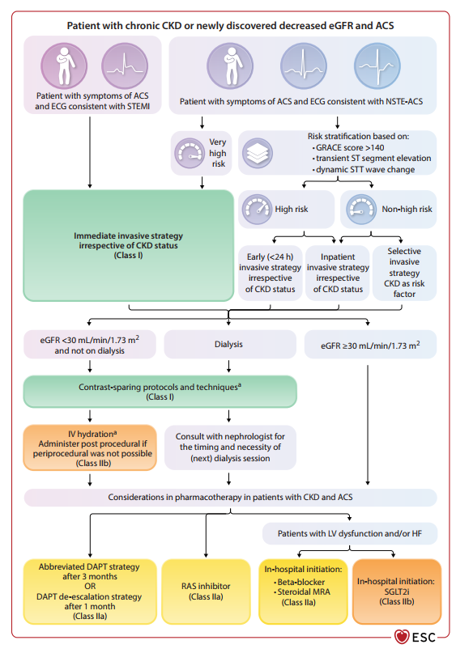
        

          
Figure 14. Thuật Toán Chẩn Đoán &amp; Xử Trí Hội Chứng Mạch Vành Cấp (ACS) Trên Bệnh Thận Mạn

          Động học hs-cTn 0/1-3h; Can thiệp Primary PCI khẩn cấp cho STEMI; NSTE-ACS ưu tiên đường động mạch quay (Radial approach, Class IIa); Rút ngắn thời gian DAPT còn 1–3 tháng ở bệnh nhân nguy cơ xuất huyết cao (Class IIa); Hạ bậc P2Y12 inhibitor sang Clopidogrel; Khởi trị sớm FMT (SGLT2i, BB, ACEi/ARB, MRA) sau khi ổn định huyết động.
        

      

      
3. Phác Đồ Điều Trị Thuyên Tắc Huyết Khối Tĩnh Mạch (VTE) Theo eGFR (Figure 16 ESC 2026)

      

        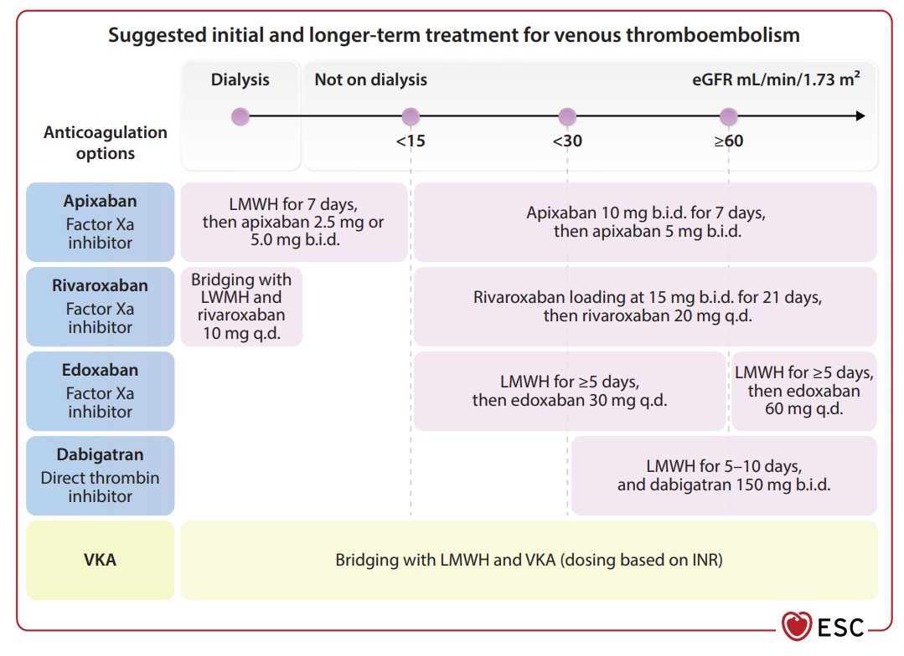
        

          
Figure 16. Lựa Chọn &amp; Hiệu Chỉnh Liều Thuốc Kháng Đông Điều Trị VTE Theo Dải eGFR &amp; Lọc Máu

          Phân tầng 4 dải: (1) Lọc máu: LMWH 7 ngày đầu &rarr; Apixaban 2.5mg/5mg b.i.d (hoặc Rivaroxaban 10mg/VKA); (2) eGFR &lt; 15 chưa lọc máu: VKA hoặc Apixaban liều thấp; (3) eGFR 15–29: Apixaban, Rivaroxaban 15mg q.d, Edoxaban 30mg q.d, chống chỉ định Dabigatran; (4) eGFR ≥ 60: liều DOACs chuẩn; Theo dõi anti-Xa khi dùng LMWH ở eGFR &lt; 30.
        

      

    

  

  {/* SECTION 6 */}
  

    

      🏥
      <h2 class="sec-title">Phần 6: Quản Lý Bệnh Nhân Lọc Máu, Ghép Thận &amp; Mô Hình Chăm Sóc Toàn Diện</h2>
    

    

      
      
1. Chiến Lược Giảm Biến Cố Tim Mạch Ở BN Lọc Máu Chu Kỳ (Figure 19 ESC 2026)

      

        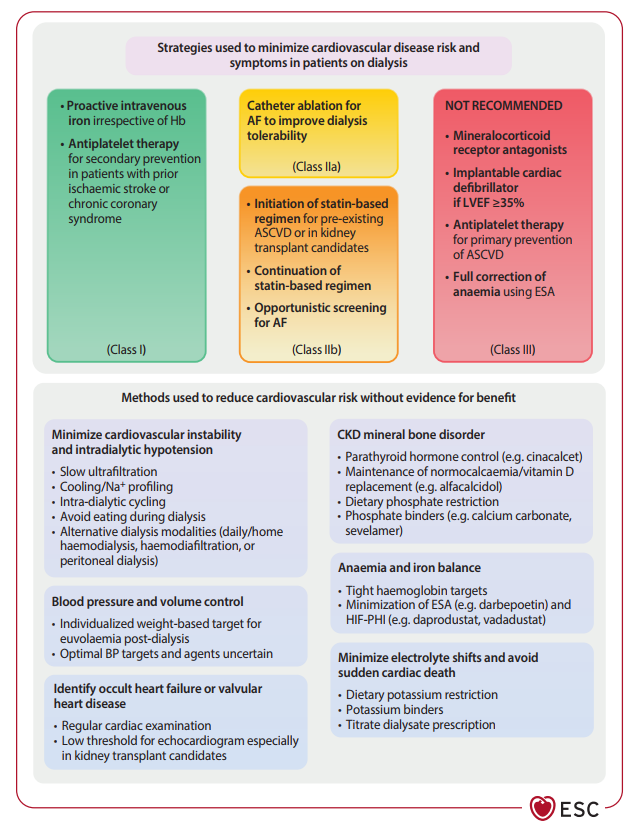
        

          
Figure 19. Phân Cấp Khuyến Cáo Giảm Thiểu Biến Cố Tim Mạch Ở Bệnh Nhân Lọc Máu Chu Kỳ

          Class I: Sắt IV liều cao chủ động (PIVOTAL), DAPT/SAPT dự phòng thứ phát; Class IIa: Triệt đốt rung nhĩ bằng catheter; Class IIb: Khởi trị statin nếu có ASCVD/chờ ghép thận, duy trì statin cũ, tầm soát rung nhĩ; Class III (Chống chỉ định): Không dùng MRA, Không cấy ICD nếu EF ≥ 35%, Không dùng kháng tiểu cầu dự phòng tiên phát, Không hiệu chỉnh hoàn toàn thiếu máu bằng ESA.
        

      

      
2. Đánh Giá Suy Tim Tiến Triển (Figure 13) &amp; Chăm Sóc Lấy Người Bệnh Làm Trung Tâm

      

        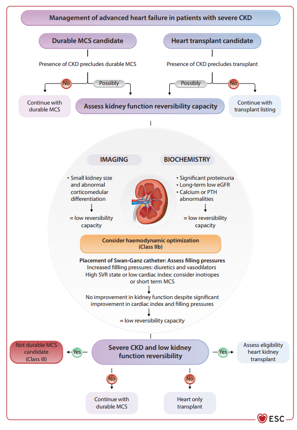
        

          
Figure 13. Quy Trình Đánh Giá Suy Tim Tiến Triển (Stage D) Đồng Mắc Bệnh Thận Mạn

          Đánh giá đa thông số để chỉ định thiết bị hỗ trợ tâm thất dài hạn (Durable MCS/LVAD) hoặc ghép tim: eGFR baseline, sức cản mạch máu hệ thống (SVR), nồng độ PTH (tầm soát CKD-MBD), trạng thái quá tải thể tích và khả năng hồi phục chức năng thận sau giải áp sung huyết.
        

      

      

        
🌐 Mô Hình Chăm Sóc Lấy Người Bệnh Làm Trung Tâm (Figure 21 ESC 2026)

        

          Bệnh nhân đồng mắc CVD và CKD nằm ở vị trí trung tâm, được hỗ trợ bởi mối liên kết giao tiếp trực tiếp giữa <strong>Bác sĩ Tim mạch (Cardiologist)</strong> và <strong>Bác sĩ Thận học (Nephrologist)</strong>: 
          • <strong>1. Đội ngũ Đa chuyên khoa:</strong> Bác sĩ gia đình, Điều dưỡng chuyên khoa Tim - Thận, Dược sĩ lâm sàng, Chuyên gia dinh dưỡng, Chuyên gia phục hồi chức năng thể lực, Cán bộ tâm lý và công tác xã hội. 
          • <strong>2. Đánh giá &amp; Lập kế hoạch:</strong> Tái khám định kỳ 3–6 tháng/lần, theo dõi từ xa qua thiết bị số (e-Health), tầm soát biến chứng sớm và tích hợp chăm sóc giảm nhẹ (palliative care) cho giai đoạn suy tim/suy thận tiến triển. 
          • <strong>3. Quản lý toàn diện:</strong> Kiểm soát triệu chứng uremic/sung huyết, tối ưu hóa lối sống, nâng cao chất lượng cuộc sống và giáo dục sức khỏe tự chăm sóc.
        

      

    

  

  {/* SECTION 7 */}
  

    

      📚
      <h2 class="sec-title">Phần 7: Tổng Hợp Thử Nghiệm RCT Bản Lề &amp; Tài Liệu Tham Khảo AMA</h2>
    

    

      
      
1. Các Thử Nghiệm Lâm Sàng Ngẫu Nhiên Bản Lề (RCTs) Củng Cố ESC 2026

      

        <table class="med-table">
          <thead>
            <tr>
              <th>Thử Nghiệm (Năm)</th>
              <th>Quần Thể Nghiên Cứu</th>
              <th>Can Thiệp Dược Lý</th>
              <th>Kết Quả Cốt Lõi &amp; Ý Nghĩa Lâm Sàng</th>
            </tr>
          </thead>
          <tbody>
            <tr>
              <td><strong>SPRINT (2015/2021)</strong></td>
              <td>9,361 BN Tăng huyết áp có nguy cơ cao (28% có CKD)</td>
              <td>Hạ áp SBP &lt; 120 vs &lt; 140 mmHg</td>
              <td>Giảm 25% biến cố tim mạch chính, giảm 27% tử vong toàn thể; không tăng nguy cơ suy thận giai đoạn cuối.</td>
            </tr>
            <tr>
              <td><strong>SHARP (2011)</strong></td>
              <td>9,270 BN CKD (bao gồm 3,023 BN đang lọc máu)</td>
              <td>Simvastatin 20mg + Ezetimibe 10mg vs Placebo</td>
              <td>Giảm 17% biến cố xơ vữa động mạch chính; thiết lập nền tảng hạ lipid máu trong CKD.</td>
            </tr>
            <tr>
              <td><strong>PIVOTAL (2019)</strong></td>
              <td>2,141 BN đang lọc máu chu kỳ có thiếu máu</td>
              <td>Sắt sucrose IV liều cao chủ động vs Liều thấp phản ứng</td>
              <td>Giảm 15% tử vong do mọi nguyên nhân và biến cố tim mạch chính; tiết kiệm đáng kể liều ESA.</td>
            </tr>
            <tr>
              <td><strong>CONFIRM-HF / AFFIRM-AHF (2015/2020)</strong></td>
              <td>Bệnh nhân HFrEF có thiếu sắt đồng mắc CKD</td>
              <td>Ferric Carboxymaltose (FCM) IV vs Placebo</td>
              <td>Giảm rõ rệt tỷ lệ tái nhập viện vì suy tim, cải thiện phân độ NYHA và chất lượng cuộc sống.</td>
            </tr>
            <tr>
              <td><strong>TREAT (2009)</strong></td>
              <td>4,038 BN ĐTĐ Típ 2 kèm CKD có thiếu máu</td>
              <td>Darbepoetin alfa (đích Hb 13 g/dL) vs Placebo (Hb &lt; 9)</td>
              <td>Không giảm tử vong/biến cố tim mạch; tăng gần gấp đôi nguy cơ đột quỵ não (HR 1.92, p &lt; 0.001) &rarr; Cấm hiệu chỉnh hoàn toàn Hb.</td>
            </tr>
            <tr>
              <td><strong>FOURIER / ODYSSEY (2017/2018)</strong></td>
              <td>Bệnh nhân ASCVD nguy cơ cao (phân tích dưới nhóm CKD)</td>
              <td>Evolocumab / Alirocumab (PCSK9i)</td>
              <td>Giảm biến cố tim mạch xơ vữa nhất quán trên toàn bộ các dải eGFR ≥ 20 ml/min.</td>
            </tr>
          </tbody>
        </table>
      

      
2. Bảng Tổng Hợp Cấp Độ Khuyến Cáo ESC 2026 (COR / LOE)

      

        <table class="med-table">
          <thead>
            <tr>
              <th style="width: 25%;">Hạng Mục Lâm Sàng</th>
              <th style="width: 18%;">Cấp Độ Khuyến Cáo</th>
              <th>Tóm Tắt Khuyến Cáo Thực Hành</th>
            </tr>
          </thead>
          <tbody>
            <tr>
              <td><strong>Tầm soát eGFR + uACR</strong></td>
              <td>Class I, Level C</td>
              <td>Tầm soát hệ thống cho 100% bệnh nhân tim mạch và lặp lại hàng năm ở bệnh nhân đái tháo đường.</td>
            </tr>
            <tr>
              <td><strong>SGLT2i trong Suy tim</strong></td>
              <td>Class I, Level A</td>
              <td>Khởi trị cho mọi bệnh nhân suy tim có eGFR ≥ 20 ml/min bất kể LVEF; duy trì ngay cả khi eGFR &lt; 20.</td>
            </tr>
            <tr>
              <td><strong>Hạ áp Tâm thu SBP 120–129</strong></td>
              <td>Class I, Level A</td>
              <td>Đích huyết áp tích cực cho bệnh nhân CKD có eGFR ≥ 30 ml/min nếu dung nạp được.</td>
            </tr>
            <tr>
              <td><strong>Statin ở BN CKD chưa lọc máu</strong></td>
              <td>Class I, Level A</td>
              <td>Statin cường độ trung bình/cao ± Ezetimibe cho CKD eGFR 15–60 ml/min bất kể mức lipid máu nền.</td>
            </tr>
            <tr>
              <td><strong>Sắt IV trong HFrEF</strong></td>
              <td>Class IIa, Level B1</td>
              <td>Bổ sung sắt truyền tĩnh mạch (FCM/FDM) khi Ferritin &lt; 100 hoặc 100–299 kèm TSAT &lt; 20%.</td>
            </tr>
            <tr>
              <td><strong>Cấm Hiệu Chỉnh Đầy Đủ Hb</strong></td>
              <td>Class III (Nguy hại)</td>
              <td>Tuyệt đối không dùng ESAs nâng Hb vượt quá 11.5 g/dL do tăng nguy cơ đột quỵ não.</td>
            </tr>
            <tr>
              <td><strong>Rút ngắn DAPT sau PCI</strong></td>
              <td>Class IIa</td>
              <td>Rút ngắn thời gian DAPT còn 1–3 tháng ở bệnh nhân CKD có nguy cơ xuất huyết cao.</td>
            </tr>
            <tr>
              <td><strong>Potassium Binders (SZC/Patiromer)</strong></td>
              <td>Class IIa</td>
              <td>Sử dụng thuốc gắn kali thế hệ mới để duy trì điều trị nền tảng ức chế RAAS/MRA.</td>
            </tr>
          </tbody>
        </table>
      

      

        <strong>Trích dẫn Tài liệu Tham khảo Chuẩn AMA:</strong> 
        1. Task Force for the 2026 ESC Guidelines for the management of cardiovascular disease in patients with chronic kidney disease. 2026 ESC Guidelines for the management of cardiovascular disease in patients with chronic kidney disease. <em>Eur Heart J</em>. Published online August 30, 2026. doi:10.1093/eurheartj/ehag098. 
        2. Baigent C, Landray MJ, Reith C, et al. The effects of lowering LDL cholesterol with simvastatin plus ezetimibe in patients with chronic kidney disease (Study of Heart and Renal Protection): a randomised placebo-controlled trial. <em>Lancet</em>. 2011;377(9784):2181-2192. 
        3. Macdougall IC, White C, Anker SD, et al. Intravenous Iron in Patients Undergoing Maintenance Hemodialysis. <em>N Engl J Med</em>. 2019;380(5):447-458. 
        4. Pfeffer MA, Burdmann EA, Chen CY, et al. A Trial of Darbepoetin Alfa in Type 2 Diabetes and Chronic Kidney Disease. <em>N Engl J Med</em>. 2009;361(21):2019-2032. 
        5. SPRINT Research Group. A Randomized Trial of Intensive versus Standard Blood-Pressure Control. <em>N Engl J Med</em>. 2015;373(22):2103-2116.
      

    

  

  {/* INTERACTIVE CDSS WIDGET */}
  

    
🧮 Công Cụ Tương Tác CDSS: Phân Tầng Phác Đồ Tim - Thận ESC 2026

    
Nhập chỉ số eGFR, uACR nước tiểu, phân suất tống máu LVEF và tình trạng Đái tháo đường của bệnh nhân để tự động tra cứu các chỉ định dược lý nền tảng chuẩn ESC 2026.

    

      

        <label for="w-esc-egfr">eGFR (ml/min/1.73m²)</label>
        <input type="number" id="w-esc-egfr" class="form-control" placeholder="VD: 35" value="35" />
      

      

        <label for="w-esc-uacr">uACR Nước tiểu (mg/mmol)</label>
        <input type="number" id="w-esc-uacr" class="form-control" placeholder="VD: 15" value="15" />
      

      

        <label for="w-esc-lvef">LVEF (%)</label>
        <input type="number" id="w-esc-lvef" class="form-control" placeholder="VD: 40" value="40" />
      

      

        <label for="w-esc-dm">Tình trạng Đái tháo đường</label>
        <select id="w-esc-dm" class="form-control">
          <option value="yes">Có Đái tháo đường Típ 2</option>
          <option value="no">Không Đái tháo đường</option>
        </select>
      

    

    <button class="btn-calc" id="btn-calc-esc">Tra Cứu Khuyến Cáo Tim - Thận ESC 2026</button>

    

      {/* Dynamic result rendered by JavaScript */}
    

  

  

    

      <a href="#/ebm/kho-guidelines" class="btn btn-primary">
        <i class="fa-solid fa-arrow-left"></i> Quay lại Kho Guidelines
      </a>
      <a href="#sec-1" class="btn">
        <i class="fa-solid fa-arrow-up"></i> Lên đầu trang
      </a>
    

  

<script is:inline dangerouslySetInnerHTML={{ __html: "\n  function calculateESC() {\n    const egfrInput = document.getElementById('w-esc-egfr');\n    const uacrInput = document.getElementById('w-esc-uacr');\n    const lvefInput = document.getElementById('w-esc-lvef');\n    const dmSelect = document.getElementById('w-esc-dm');\n    const resultDiv = document.getElementById('w-esc-result');\n\n    if (!egfrInput || !uacrInput || !lvefInput || !resultDiv) return;\n\n    const egfr = parseFloat(egfrInput.value) || 0;\n    const uacr = parseFloat(uacrInput.value) || 0;\n    const lvef = parseFloat(lvefInput.value) || 0;\n    const hasDM = dmSelect ? dmSelect.value === 'yes' : true;\n\n    let hfType = lvef < 50 ? 'HFrEF (LVEF < 50%)' : 'HFpEF (LVEF ≥ 50%)';\n    let gStage = egfr >= 90 ? 'G1' : egfr >= 60 ? 'G2' : egfr >= 45 ? 'G3a' : egfr >= 30 ? 'G3b' : egfr >= 15 ? 'G4' : 'G5';\n    let aStage = uacr < 3 ? 'A1' : uacr <= 30 ? 'A2' : 'A3';\n\n    let recs = [];\n\n    // SGLT2i\n    if (egfr >= 20) {\n      recs.push('<strong>SGLT2i (Dapagliflozin/Empagliflozin):</strong> Khởi trị nền tảng bắt buộc (Class I, Level A). Tiếp tục duy trì ngay cả khi eGFR < 20.');\n    } else {\n      recs.push('<strong>SGLT2i:</strong> Tiếp tục duy trì nếu đã dùng trước đó (Class IIa, Level C); không khởi trị mới khi eGFR < 20.');\n    }\n\n    // BP Target\n    if (egfr >= 30) {\n      recs.push('<strong>Huyết Áp Mục Tiêu:</strong> Huyết áp tâm thu SBP <strong>120–129 mmHg</strong> chuẩn hóa (Class I, Level A).');\n    } else {\n      recs.push('<strong>Huyết Áp Mục Tiêu:</strong> Cá thể hóa theo khả năng dung nạp (Class I, Level C) để đảm bảo tưới máu tạng.');\n    }\n\n    // HF Meds\n    if (lvef < 50) {\n      recs.push('<strong>Chẹn Beta:</strong> Liệu pháp nền tảng bắt buộc (Class I).');\n      if (egfr >= 30) {\n        recs.push('<strong>ARNI / ACEi:</strong> Khởi trị và tăng liều đến đích (Class I). Duy trì ARNI khi eGFR < 30 (Class IIa).');\n        recs.push('<strong>sMRA (Spironolactone/Eplerenone):</strong> Chỉ định khi eGFR ≥ 30 và K+ < 5.0 mmol/L (Class I).');\n      } else if (egfr >= 15) {\n        recs.push('<strong>ACEi/ARB/ARNI:</strong> Cân nhắc liều thấp (Class IIb) + Hydralazine/ISDN (Class IIa).');\n      }\n    } else {\n      if (egfr >= 25) {\n        recs.push('<strong>MRA:</strong> Cân nhắc bổ sung MRA cho HFpEF (Class IIa).');\n      }\n    }\n\n    // DM specific\n    if (hasDM && (aStage === 'A2' || aStage === 'A3')) {\n      if (egfr >= 25) {\n        recs.push('<strong>ns-MRA (Finerenone):</strong> Chỉ định phối hợp trên nền RASi giúp bảo vệ Tim - Thận (Class I).');\n      }\n      recs.push('<strong>GLP-1 RA (Semaglutide):</strong> Khởi trị kiểm soát đường huyết và giảm biến cố tim mạch (Class I).');\n    }\n\n    // Lipid\n    if (egfr >= 15) {\n      recs.push('<strong>Statin ± Ezetimibe:</strong> Khởi trị Statin cường độ trung bình/cao (Class I, Level A).');\n    }\n\n    resultDiv.innerHTML = `\n      
\n        
\n          <h4 style=\"margin: 0; font-size: 1.1rem; color: var(--color-text);\">Phân Loại: ${gStage}${aStage} | ${hfType}</h4>\n          ESC 2026 Guideline\n        
\n        
\n          <strong style=\"color: var(--color-primary); font-size: 0.9rem;\">Khuyến Cáo Điều Trị Cá Thể Hóa ESC 2026:</strong>\n          <ul style=\"margin: 0.5rem 0 0 1.25rem; padding: 0; font-size: 0.85rem; line-height: 1.65;\">\n            ${recs.map(r => `<li>${r}</li>`).join('')}\n          </ul>\n        
\n      
\n    `;\n  }\n\n  document.addEventListener('DOMContentLoaded', () => {\n    const btn = document.getElementById('btn-calc-esc');\n    if (btn) {\n      btn.addEventListener('click', calculateESC);\n    }\n    calculateESC();\n  });\n" }} />
