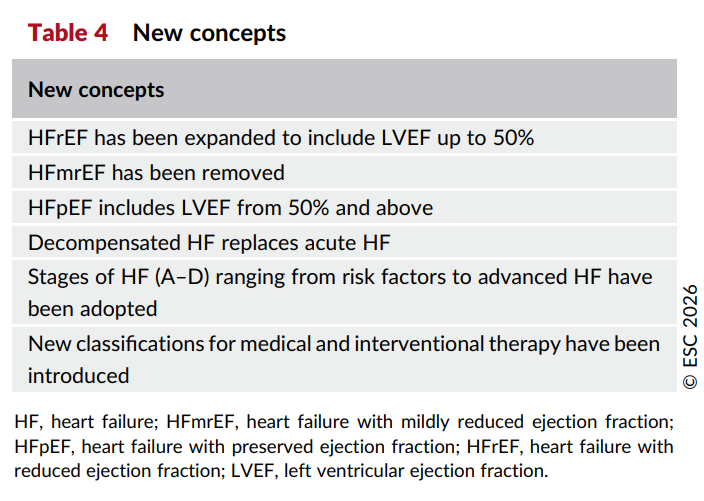
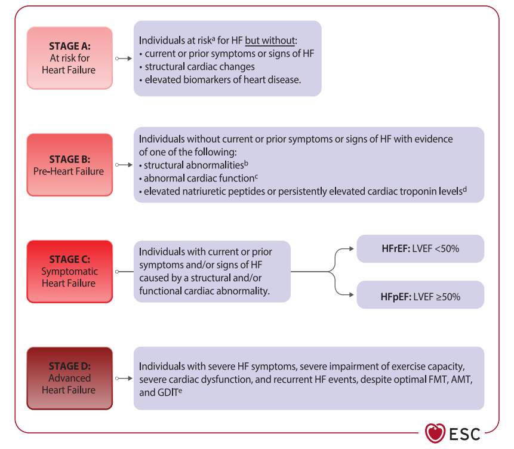
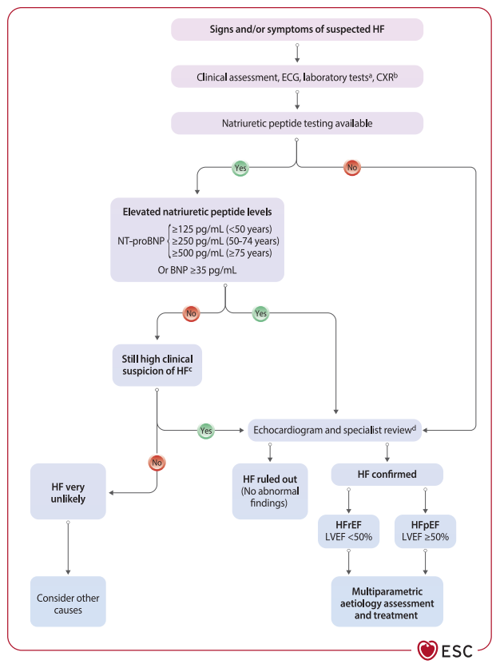
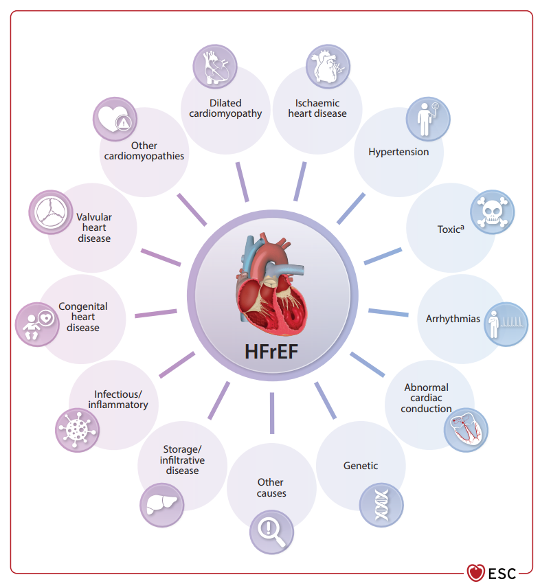
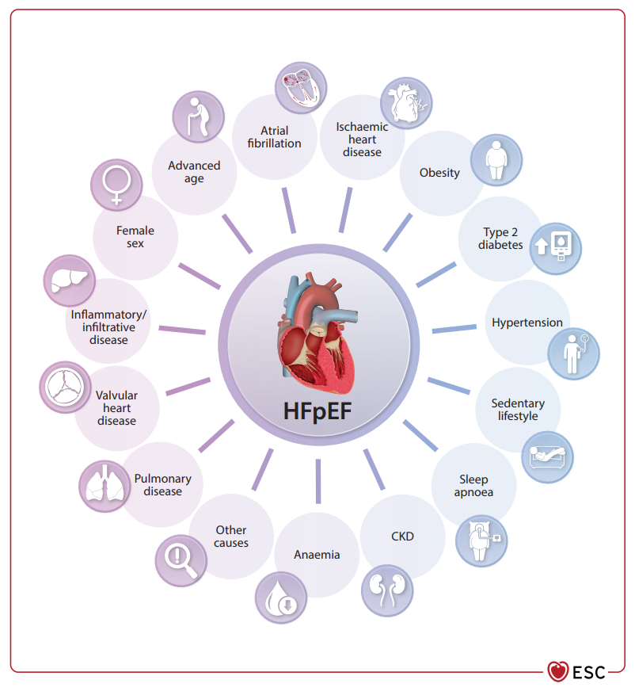
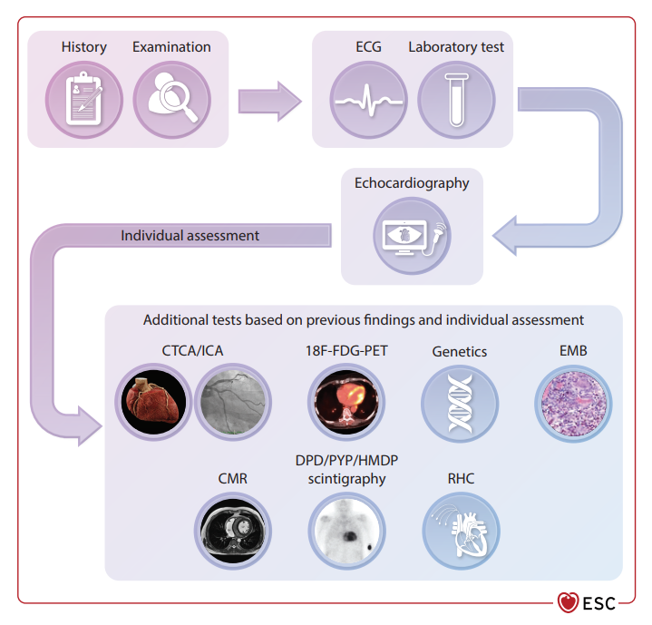
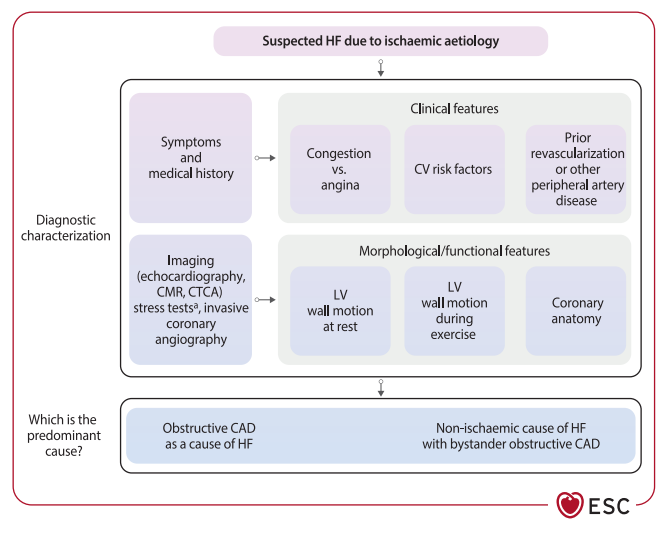
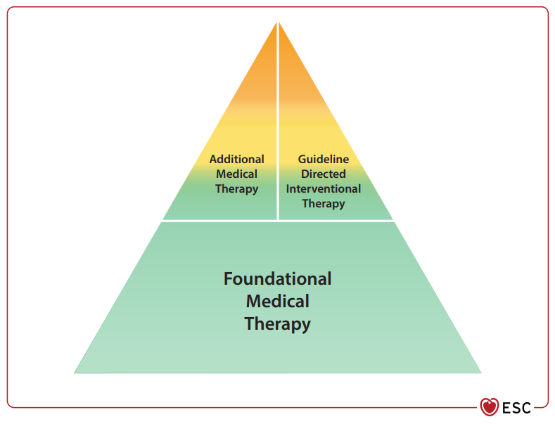
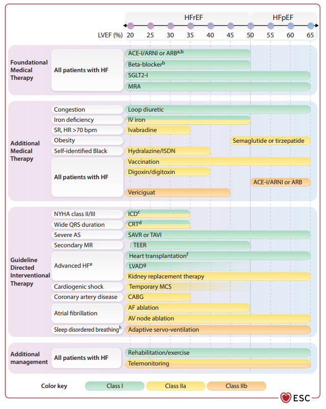

  

    

      
Loại Bỏ HFmrEF

      
Tái phân loại 2 kiểu hình cốt lõi: HFrEF (&lt;50%) &amp; HFpEF (≥50%)

    

    

      
FMT Nền Tảng (Class I)

      
Tứ trụ HFrEF (ACEi/ARNI + BB + MRA + SGLT2i) &amp; Nhị trụ HFpEF (SGLT2i + MRA)

    

    

      
STRONG-HF (Class I)

      
Khởi trị đồng thời &amp; Tối ưu hóa liều tối đa trong 6 tuần sau đợt mất bù

    

    

      
Stages A ➔ D

      
Đồng thuận phân tầng giai đoạn &amp; Can thiệp dự phòng sớm từ Stage A/B

    

  

  {/* ========================================================================= */}
  {/* PHẦN 1: ĐỊNH NGHĨA MỚI & TÁI PHÂN LOẠI LVEF */}
  {/* ========================================================================= */}
  

    

      

        
<i class="fa-solid fa-heart-pulse"></i>

        <h2 class="sec-title">Phần 1: Định Nghĩa Mới &amp; Tái Phân Loại Kiểu Hình Suy Tim Theo LVEF</h2>
      

      TABLE 4 • NEW CONCEPTS
    

    

      
      

        🫀
        

          <strong>Định Nghĩa Tổng Quát Về Suy Tim (Heart Failure - HF):</strong> 
          Suy tim là một hội chứng lâm sàng phức tạp bao gồm các triệu chứng cơ năng (khó thở, mệt mỏi, phù) và/hoặc thực thể (tĩnh mạch cổ nổi, tiếng T3, rales phổi) gây ra do các <strong>bất thường về cấu trúc và/hoặc chức năng của tim</strong>. Những bất thường này dẫn đến hệ quả là <strong>tăng áp lực trong buồng tim</strong> và/hoặc <strong>giảm cung lượng tim</strong> một cách không tương xứng lúc nghỉ ngơi hoặc khi gắng sức. Việc chẩn đoán xác định cần có các bằng chứng khách quan về tình trạng sung huyết phổi/hệ thống do tim thông qua các xét nghiệm chẩn đoán hỗ trợ.
        

      

      
Cuộc Cách Mạng Phân Loại: Loại Bỏ Hoàn Toàn HFmrEF &amp; Mở Rộng HFrEF

      

        Trước đây, theo Khuyến cáo ESC 2021, suy tim được chia thành 3 nhóm dựa trên LVEF: HFrEF (≤40%), HFmrEF (41–49%) và HFpEF (≥50%). Tuy nhiên, các bằng chứng lâm sàng tích lũy cho thấy bệnh nhân thuộc nhóm 41–49% có đặc điểm bệnh học, diễn tiến lâm sàng, quỹ đạo tiến triển LVEF, và đặc biệt là <strong>đáp ứng với các liệu pháp điều trị nền tảng (FMT) tương đồng chặt chẽ với nhóm LVEF ≤40%</strong> hơn là nhóm ≥50%.
      

      

        

          

            HFrEF (Reduced LVEF)
            LVEF &lt; 50%
          

          

            

              Suy tim phân suất tống máu giảm (Mở rộng)
            

            

              Đặc trưng bởi <strong>LVEF &lt; 50%</strong> đi kèm với các triệu chứng cơ năng và/hoặc thực thể của suy tim.
            

            

              
Trọng tâm điều trị

              Bắt buộc khởi trị sớm <strong>Tứ trụ FMT</strong> (ACEi/ARNI + Chẹn Beta + MRA + SGLT2i) để cải thiện sống còn và ngăn ngừa tái cấu trúc thất trái.
            

          

        

        

          

            HFpEF (Preserved LVEF)
            LVEF ≥ 50%
          

          

            

              Suy tim phân suất tống máu bảo tồn
            

            

              Đặc trưng bởi <strong>LVEF ≥ 50%</strong> đi kèm triệu chứng suy tim và có bằng chứng khách quan của bất thường cấu trúc/chức năng tim phù hợp với <strong>rối loạn chức năng tâm trương thất trái</strong> hoặc tăng áp lực đổ đầy (hỗ trợ bởi tăng peptide bài niệu).
            

            

              
Trọng tâm điều trị

              Khởi trị <strong>Nhị trụ FMT</strong> (SGLT2i + MRA) kết hợp giải áp sung huyết và điều trị trúng đích bệnh đồng mắc (Béo phì, T2DM, THA, Rung nhĩ).
            

          

        

      

      

        🔄
        

          <strong>Khái niệm Suy Tim Cải Thiện (Heart Failure with Improved LVEF):</strong> 
          Được định nghĩa khi bệnh nhân có sự <strong>gia tăng phân suất tống máu tuyệt đối từ 10% trở lên</strong> so với ban đầu, và trị số LVEF sau cải thiện phải <strong>đạt trên 40%</strong>. Những bệnh nhân này <strong>bắt buộc phải tiếp tục duy trì liệu pháp điều trị nội khoa nền tảng FMT lâu dài suốt đời</strong>, tuyệt đối không tự ý ngưng thuốc vì nguy cơ tái phát suy tim lên tới 40% trong vòng 6 tháng (chứng cứ thử nghiệm TRED-HF).
        

      

      

        
        

          
Table 4. Các khái niệm mới mang tính đột phá của Khuyến cáo ESC 2026

          So sánh các điểm thay đổi bản lề giữa phiên bản 2021 và 2026: mở rộng nhóm HFrEF để bao gồm tất cả bệnh nhân có LVEF &lt;50%; xóa bỏ hoàn toàn phân nhóm HFmrEF; nhóm HFpEF tính từ ngưỡng LVEF ≥50%; thuật ngữ "suy tim mất bù" (Decompensated HF - DHF) chính thức thay thế cho "suy tim cấp" (acute HF); đồng thuận áp dụng phân loại suy tim theo các giai đoạn từ A đến D và đưa vào hệ thống danh pháp phân loại điều trị mới (FMT, AMT, GDIT).
        

      

    

  

  {/* ========================================================================= */}
  {/* PHẦN 2: PHÂN TẦNG GIAI ĐOẠN A-B-C-D & DỰ PHÒNG SỚM */}
  {/* ========================================================================= */}
  

    

      

        
<i class="fa-solid fa-layer-group"></i>

        <h2 class="sec-title">Phần 2: Phân Tầng Giai Đoạn Suy Tim (Stages A, B, C, D) &amp; Chiến Lược Dự Phòng Sớm</h2>
      

      FIGURE 2 • STAGES CLASSIFICATION
    

    

      
      

        ESC 2026 đã chính thức đồng thuận và áp dụng phân loại suy tim theo giai đoạn tiến triển liên tục (từ Stage A đến Stage D) nhằm tăng cường tính dự phòng chủ động, phát hiện và can thiệp điều trị sớm trước khi xuất hiện triệu chứng lâm sàng:
      

      

        

          

            STAGE A
            Có Nguy Cơ Suy Tim
          

          

            
At Risk for Heart Failure

            <ul class="matrix-criteria-list">
              <li><i class="fa-solid fa-circle-exclamation" style="color: var(--color-warning, #f59e0b);"></i> Có yếu tố nguy cơ tim mạch - chuyển hóa: THA, ĐTĐ típ 2, béo phì, hút thuốc, tiếp xúc độc chất cơ tim (hóa trị ung thư).</li>
              <li><i class="fa-solid fa-circle-check" style="color: var(--color-success, #10b981);"></i> <strong>Hoàn toàn chưa có triệu chứng</strong> cơ năng/thực thể suy tim.</li>
              <li><i class="fa-solid fa-circle-check" style="color: var(--color-success, #10b981);"></i> Chưa có biến đổi cấu trúc hay chức năng tim; biomarker bình thường.</li>
            </ul>
            

              
Mục tiêu lâm sàng

              Dự phòng nguyên phát: Kiểm soát HA &lt;130 mmHg (Class I, A), SGLT2i cho ĐTĐ/CKD/ASCVD (Class I, A), Lối sống lành mạnh (Class I, C).
            

          

        

        

          

            STAGE B
            Tiền Suy Tim (Pre-HF)
          

          

            
Pre-Heart Failure

            <ul class="matrix-criteria-list">
              <li><i class="fa-solid fa-circle-check" style="color: var(--color-success, #10b981);"></i> <strong>Hoàn toàn chưa có triệu chứng</strong> cơ năng/thực thể suy tim.</li>
              <li><i class="fa-solid fa-triangle-exclamation" style="color: var(--color-warning, #f59e0b);"></i> Có bằng chứng khách quan của ít nhất 1 yếu tố:
                

                  • Bất thường cấu trúc tim: Phì đại thất trái (LVH), giãn buồng tim, bệnh van tim mạn. 
                  • Bất thường chức năng: Giảm LVEF (&lt;50%), rối loạn chức năng tâm trương. 
                  • Tăng peptide bài niệu (NT-proBNP/BNP) hoặc tăng troponin tim.
                

              </li>
            </ul>
            

              
Mục tiêu lâm sàng

              ACEi/ARB khi LVEF ≤40% (Class I, A); Chẹn Beta khi LVEF &lt;50% (Class I, B1); Eplerenone sau NMCT LVEF ≤40% (Class I, B1).
            

          

        

        

          

            STAGE C
            Suy Tim Có Triệu Chứng
          

          

            
Symptomatic Heart Failure

            <ul class="matrix-criteria-list">
              <li><i class="fa-solid fa-triangle-exclamation" style="color: var(--color-danger, #dc2626);"></i> <strong>Có triệu chứng cơ năng và/hoặc thực thể</strong> suy tim ở hiện tại hoặc trước đây gây ra do bất thường cấu trúc/chức năng tim.</li>
              <li><i class="fa-solid fa-code-fork" style="color: var(--color-primary, #0284c7);"></i> Phân nhánh thành 2 kiểu hình cốt lõi: <strong>HFrEF (LVEF &lt;50%)</strong> và <strong>HFpEF (LVEF ≥50%)</strong>.</li>
            </ul>
            

              
Mục tiêu lâm sàng

              Tối ưu hóa Liệu pháp Nội khoa Nền tảng FMT (Tứ trụ cho HFrEF, Nhị trụ cho HFpEF), kết hợp AMT và can thiệp GDIT theo chỉ định.
            

          

        

        

          

            STAGE D
            Suy Tim Tiến Triển (Advanced HF)
          

          

            
Advanced Heart Failure

            <ul class="matrix-criteria-list">
              <li><i class="fa-solid fa-triangle-exclamation" style="color: var(--color-danger, #dc2626);"></i> Triệu chứng suy tim mức độ nặng, dai dẳng (NYHA III–IV) bất chấp đã tối ưu hóa FMT, AMT và GDIT.</li>
              <li><i class="fa-solid fa-triangle-exclamation" style="color: var(--color-danger, #dc2626);"></i> Suy giảm chức năng tim nặng, sung huyết kháng trị hoặc cung lượng tim thấp, lệ thuộc thuốc tăng co bóp.</li>
            </ul>
            

              
Mục tiêu lâm sàng

              Đánh giá INTERMACS, chuyển trung tâm suy tim chuyên sâu: Thiết bị hỗ trợ thất trái (durable LVAD), Ghép tim hoặc Chăm sóc giảm nhẹ tích hợp.
            

          

        

      

      

        
        

          
Figure 2. Các giai đoạn tiến triển và phân loại suy tim theo ESC 2026

          Sơ đồ trực quan thể hiện 4 giai đoạn tiến triển liên tục của suy tim từ Stage A (At risk), Stage B (Pre-HF), Stage C (Symptomatic) cho đến Stage D (Advanced HF). Sơ đồ định nghĩa chi tiết tiêu chuẩn chuyển giai đoạn dựa trên sự xuất hiện của biến đổi cấu trúc, biến đổi biomarker và sự bộc phát triệu chứng lâm sàng. Ở Stage C, đường đi lâm sàng được phân nhánh rõ rệt thành hai kiểu hình HFrEF (LVEF &lt;50%) và HFpEF (LVEF ≥50%).
        

      

      
Chi Tiết Khuyến Cáo Dự Phòng Giai Đoạn Sớm (Stage A &amp; Stage B)

      

        

          Class I
          Level A
        

        <strong>Kiểm soát huyết áp nghiêm ngặt (Stage A):</strong> Khuyến cáo kiểm soát huyết áp chặt chẽ với <strong>mục tiêu huyết áp tâm thu &lt;130 mmHg</strong> cho bệnh nhân tăng huyết áp hoặc đã có Stage B HF để làm giảm tối đa nguy cơ khởi phát suy tim mạn.
      

      

        

          Class I
          Level A
        

        <strong>Thuốc ức chế SGLT2 (SGLT2i) dự phòng suy tim (Stage A):</strong> Khuyến cáo sử dụng SGLT2i (Dapagliflozin hoặc Empagliflozin) cho bệnh nhân đái tháo đường type 2 có kèm nguy cơ tim mạch cao hoặc đã có bệnh lý tim mạch xơ vữa (ASCVD), cũng như bệnh nhân đái tháo đường kèm bệnh thận mạn (CKD) để giảm nguy cơ nhập viện vì suy tim và tử vong tim mạch.
      

      

        

          Class IIa
          Level A
        

        <strong>Thuốc đồng vận thụ thể GLP-1 (GLP-1 RA) (Stage A):</strong> Nên được cân nhắc ở bệnh nhân đái tháo đường type 2 kèm ít nhất một yếu tố nguy cơ tim mạch khác để giảm biến cố tim mạch và suy tim.
      

      

        

          Class I
          Level C
        

        <strong>Tư vấn lối sống lành mạnh (Stage A &amp; B):</strong> Khuyến cáo duy trì cân nặng hợp lý, chế độ ăn cân bằng, tránh lối sống tĩnh tại, cai thuốc lá hoàn toàn, hạn chế tối đa bia rượu, và tuyệt đối không sử dụng các chất kích thích (cocaine, amphetamine, steroid tăng cơ).
      

      

        

          Class I
          Level A
        

        <strong>Quản lý Tiền suy tim LVEF ≤40% (Stage B):</strong> Khuyến cáo sử dụng <strong>thuốc ức chế men chuyển (ACEi)</strong> hoặc <strong>chẹn thụ thể Angiotensin (ARB)</strong> (nếu không dung nạp ACEi) ở bệnh nhân có LVEF ≤40% để giảm nguy cơ khởi phát triệu chứng suy tim, giảm nhập viện và tử vong.
      

      

        

          Class I
          Level B1
        

        <strong>Thuốc chẹn Beta trong Tiền suy tim (Stage B):</strong> Khuyến cáo sử dụng <strong>thuốc chẹn Beta</strong> cho bệnh nhân có LVEF &lt;50% nhằm giảm nguy cơ nhập viện vì suy tim hoặc tử vong.
      

      

        

          Class I
          Level B1
        

        <strong>Kháng Mineralocorticoid sau NMCT (Stage B):</strong> Sau nhồi máu cơ tim có LVEF ≤40% kèm đái tháo đường hoặc có triệu chứng suy tim thoáng qua, khuyến cáo sử dụng <strong>Eplerenone (nhóm MRA)</strong> để cải thiện tiên lượng sống còn.
      

    

  

  {/* ========================================================================= */}
  {/* PHẦN 3: QUY TRÌNH CHẨN ĐOÁN & TẦM SOÁT NGUYÊN NHÂN */}
  {/* ========================================================================= */}
  

    

      

        
<i class="fa-solid fa-stethoscope"></i>

        <h2 class="sec-title">Phần 3: Tiếp Cận Chẩn Đoán &amp; Đánh Giá Đa Phương Tiện Nguyên Nhân</h2>
      

      FIGURE 4, 5, 6, 7 &amp; 8
    

    

      
      
5 Bước Tiếp Cận Chẩn Đoán Ngoại Trú Chuẩn Hóa

      
      

        

          
1

          

            <strong>Bước 1: Đánh Giá Lâm Sàng &amp; Yếu Tố Nguy Cơ</strong>
            

              Nghi ngờ suy tim khi có các yếu tố nguy cơ (THA, ĐTĐ, CAD, béo phì) kèm triệu chứng cơ năng (khó thở gắng sức/kịch phát về đêm/khi cúi người - bendopnea, mệt mỏi, phù chân) và triệu chứng thực thể (tĩnh mạch cổ nổi, phản hồi gan - TMC (+), mỏm tim lệch trái, tiếng T3 ngựa phi, rales ẩm phổi, phù ngoại vi).
            

          

        

        

          
2

          

            <strong>Bước 2: Xét Nghiệm Sàng Lọc Ban Đầu &amp; ECG 12 Chuyển Đạo</strong>
            

              <strong>ECG 12 chuyển đạo:</strong> Rất hiếm khi bình thường ở bệnh nhân suy tim mạn thực sự. 
              <strong>Xét nghiệm máu cơ bản:</strong> Công thức máu, chức năng thận (eGFR, UACR nước tiểu), điện giải đồ, men gan, chức năng tuyến giáp (TSH), HbA1c, bilan lipid, và <strong>bộ sắt (Ferritin + TSAT)</strong> để tầm soát thiếu sắt. X-quang ngực thẳng đánh giá bóng tim và sung huyết phổi.
            

          

        

        

          
3

          

            <strong>Bước 3: Định Lượng Peptide Bài Niệu (Natriuretic Peptides)</strong>
            

              Là xét nghiệm sàng lọc hàng đầu có giá trị chẩn đoán loại trừ cao nếu âm tính. Ngưỡng loại trừ suy tim mạn ngoại trú: 
              • <strong>NT-proBNP &lt; 125 pg/mL</strong> HOẶC <strong>BNP &lt; 35 pg/mL</strong> ➔ Loại trừ suy tim (NPV rất cao). 
              • <em>Lưu ý đặc biệt:</em> Nồng độ peptide bài niệu giảm giả tạo ở bệnh nhân béo phì (BMI ≥30 kg/m²); tăng theo tuổi tác, suy thận, rung nhĩ. Nếu <strong>NT-proBNP &gt; 2000 pg/mL</strong> ➔ Chuyển làm siêu âm tim khẩn trong vòng 2 tuần.
            

          

        

        

          
4

          

            <strong>Bước 4: Siêu Âm Tim Qua Thành Ngực (Transthoracic Echocardiogram - TTE)</strong>
            

              Chỉ định bắt buộc (Class I) để xác định chẩn đoán, đo LVEF (phân định HFrEF &lt;50% vs HFpEF ≥50%) và đánh giá cấu trúc/chức năng van tim, huyết động buồng tim.
            

          

        

        

          
5

          

            <strong>Bước 5: Thăm Dò Nâng Cao Định Hướng Nguyên Nhân Trúng Đích</strong>
            

              Chụp cộng hưởng từ tim (CMR) có tiêm Gadolinium (Class I khi nghi ngờ bệnh cơ tim đặc hiệu/thâm nhiễm); Xạ hình xương (DPD/PYP/HMDP) tầm soát ATTR-CA (Class I); CT mạch vành (CTCA) hoặc chụp mạch vành qua ống thông (ICA) khi nghi ngờ thiếu máu cục bộ.
            

          

        

      

      

        
        

          
Figure 4. Thuật toán chẩn đoán suy tim mạn tính tại môi trường ngoại trú / cộng đồng

          Sơ đồ hướng dẫn quy trình thực hành lâm sàng từng bước: Khảo sát triệu chứng &amp; yếu tố nguy cơ ➔ ECG + NT-proBNP/BNP sàng lọc ➔ Chuyển siêu âm tim trong vòng 2 tuần nếu NT-proBNP &gt;2000 pg/mL ➔ Xác định kiểu hình (HFrEF &lt;50% vs HFpEF ≥50%) ➔ Tầm soát sâu tìm nguyên nhân sinh bệnh để điều trị trúng đích.
        

      

      
Tiêu Chuẩn Siêu Âm Tim Hỗ Trợ Chẩn Đoán HFpEF (LVEF ≥ 50%)

      

        

          Chẩn đoán HFpEF đòi hỏi bằng chứng khách quan về rối loạn cấu trúc/chức năng tâm trương thất trái hoặc tăng áp lực đổ đầy dựa trên các ngưỡng cắt:
        

        

          

            <strong>1. Phì đại thất trái (LVH):</strong> 
            LVMI ≥95 g/m² (nữ), ≥115 g/m² (nam); HOẶC RWT &gt;0.42.
          

          

            <strong>2. Giãn nhĩ trái (LA dilatation):</strong> 
            LAVi &gt;34 mL/m² (nhịp xoang) hoặc &gt;40 mL/m² (rung nhĩ).
          

          

            <strong>3. Tăng áp lực đổ đầy thất trái:</strong> 
            Tỷ lệ <strong>E/e' &gt; 9</strong> lúc nghỉ (E/e' ≥15 có độ chuyên biệt rất cao).
          

          

            <strong>4. Tăng áp lực ĐM phổi:</strong> 
            sPAP ước tính &gt;35 mmHg HOẶC vận tốc hở van ba lá (TRV) &gt;2.8 m/s.
          

        

        

          * Xác suất chẩn đoán HFpEF tăng tỷ lệ thuận với số lượng thông số siêu âm vượt ngưỡng bệnh lý nói trên.
        

      

      
Nguyên Nhân &amp; Yếu Tố Nguy Cơ Gây HFrEF vs HFpEF

      

        

          
          

            
Figure 5. Các nhóm nguyên nhân chính thúc đẩy HFrEF

            Bệnh mạch vành thiếu máu cơ tim (CAD), tăng huyết áp, bệnh van tim, rối loạn nhịp (nhịp nhanh, block AV), bệnh cơ tim di truyền/mắc phải, và nhóm độc chất (Toxic: thuốc, rượu, hóa trị ung thư).
          

        

        

          
          

            
Figure 6. Các yếu tố nguy cơ và bệnh đồng mắc chính của HFpEF

            Bệnh thận mạn (CKD), béo phì, đái tháo đường típ 2, tuổi cao, tăng huyết áp lâu năm, ít vận động thể lực, rối loạn mô mỡ và tình trạng viêm hệ thống mạn tính.
          

        

      

      
Tiếp Cận Đa Phương Tiện Tầm Soát Nguyên Nhân &amp; Bệnh Mạch Vành Thiếu Máu Cục Bộ

      

        

          
          

            
Figure 7. Tiếp cận đa phương tiện tầm soát nguyên nhân suy tim

            ECG + Siêu âm tim ➔ CMR (tìm sẹo/xơ hóa cơ tim) ➔ CTCA / ICA (khảo sát mạch vành) ➔ Xạ hình xương DPD/PYP (tìm ATTR-CA) ➔ 18F-FDG-PET (viêm cơ tim/sarcoidosis) ➔ Sinh thiết nội mạc cơ tim (EMB) / Thông tim phải (RHC).
          

        

        

          
          

            
Figure 8. Sơ đồ chẩn đoán suy tim do nguyên nhân bệnh mạch vành (CAD)

            Khảo sát triệu chứng (sung huyết vs đau thắt ngực) ➔ Đánh giá rối loạn vận động vùng thất trái lúc nghỉ &amp; khi gắng sức ➔ Giải phẫu mạch vành ➔ Phân định CAD hẹp khít là nguyên nhân trực tiếp hay chỉ là yếu tố đi kèm (bystander CAD).
          

        

      

    

  

  {/* ========================================================================= */}
  {/* PHẦN 4: DANH PHÁP MỚI & PHÁC ĐỒ NỘI KHOA NỀN TẢNG (FMT) */}
  {/* ========================================================================= */}
  

    

      

        
<i class="fa-solid fa-pills"></i>

        <h2 class="sec-title">Phần 4: Hệ Thống Danh Pháp Mới &amp; Phác Đồ Nội Khoa Nền Tảng (FMT)</h2>
      

      FIGURE 1 &amp; 3 • FMT ROADMAP
    

    

      
      

        Thay thế cho thuật ngữ chung chung GDMT, ESC 2026 giới thiệu mô hình phân cấp điều trị mới gồm 3 nhánh động:
      

      

        

          <strong style="color: var(--color-success, #10b981); font-size: 0.95rem; font-family: 'Plus Jakarta Sans', sans-serif;">FMT (Foundational Medical Therapy)</strong>
          

            <strong>Liệu pháp Nội khoa Nền tảng (Class I):</strong> Các nhóm thuốc chứng minh cải thiện sống còn, giảm tỷ lệ tử vong và tái nhập viện trên toàn bộ quần thể suy tim. 
            • <em>HFrEF (&lt;50%):</em> Tứ trụ (ACEi/ARNI + BB + MRA + SGLT2i). 
            • <em>HFpEF (≥50%):</em> Nhị trụ (SGLT2i + MRA).
          

        

        

          <strong style="color: var(--color-primary, #0284c7); font-size: 0.95rem; font-family: 'Plus Jakarta Sans', sans-serif;">AMT (Additional Medical Therapy)</strong>
          

            <strong>Liệu pháp Nội khoa Bổ sung (Class IIa/IIb hoặc Class I triệu chứng):</strong> Chỉ định trúng đích theo phân nhóm/kiểu hình (GLP-1 RA cho béo phì, sắt tĩnh mạch cho thiếu sắt, Ivabradine, Vericiguat, Digoxin, Lợi tiểu giải áp).
          

        

        

          <strong style="color: var(--color-purple, #7c3aed); font-size: 0.95rem; font-family: 'Plus Jakarta Sans', sans-serif;">GDIT (Interventional Therapy)</strong>
          

            <strong>Can thiệp theo Khuyến cáo:</strong> Thiết bị điện học cấy ghép (ICD, CRT), can thiệp qua ống thông (Mitral TEER, triệt đốt rung nhĩ, TAVI) và phẫu thuật (CABG, LVAD, Ghép tim).
          

        

      

      

        

          
          

            
Figure 3. Mô hình tháp danh pháp mới cho các liệu pháp điều trị suy tim

            Tháp tam giác phân cấp: FMT tạo nền móng vững chắc nhất ở đáy tháp áp dụng phổ quát. Đỉnh tháp chia đôi cho AMT (nội khoa bổ sung theo kiểu hình) và GDIT (thiết bị &amp; can thiệp), giúp cá thể hóa tối ưu.
          

        

        

          
          

            
Figure 1. Sơ đồ trung tâm (Central Illustration) quản lý toàn diện suy tim

            Bức tranh toàn cảnh phác đồ điều trị theo phổ LVEF từ &lt;20% đến ≥65%: FMT nền tảng cho mọi LVEF (SGLT2i + MRA) và mở rộng cho LVEF &lt;50% (+ ACEi/ARNI + BB); AMT cá thể hóa theo triệu chứng; GDIT phân tầng theo chỉ định can thiệp cơ học/điện học.
          

        

      

      
Phác Đồ Liệu Pháp Nội Khoa Nền Tảng (FMT) Cho HFrEF (LVEF &lt; 50%)

      
      

        

          Class I
          Level A
        

        <strong>Thuốc ức chế men chuyển (ACEi) hoặc Ức chế thụ thể - Neprilysin (ARNI):</strong> Khuyến cáo cho tất cả bệnh nhân HFrEF có triệu chứng nhằm giảm nguy cơ tử vong tim mạch và nhập viện do suy tim.
        

          • <strong>Khuyến cáo chuyển đổi (Switching):</strong> Khuyến cáo chuyển từ ACEi hoặc ARB sang ARNI (Sacubitril/Valsartan) ở bệnh nhân HFrEF mạn tính vẫn còn triệu chứng dù đã dùng liều tối ưu các thuốc khác để giảm thêm tỷ lệ tử vong và nhập viện <strong>(Class I, Level B1)</strong>. 
          • <strong>Khởi trị ban đầu (De novo):</strong> ARNI có thể được cân nhắc khởi trị ngay từ đầu ở bệnh nhân mới chẩn đoán HFrEF để đơn giản hóa quản lý, bảo tồn chức năng thận và nâng cao chất lượng sống. 
          • <strong>Chẹn thụ thể Angiotensin II (ARB):</strong> Chỉ được khuyến cáo khi bệnh nhân hoàn toàn không dung nạp với ACEi hoặc ARNI <strong>(Class I, Level A)</strong>.
        

      

      

        

          Class I
          Level A
        

        <strong>Thuốc chẹn Beta (Beta-blockers):</strong> Khuyến cáo sử dụng sớm cho bệnh nhân HFrEF có huyết động ổn định để giảm nguy cơ tử vong và nhập viện. 3 thuốc chứng minh hiệu quả giảm tử vong: <strong>Bisoprolol, Metoprolol succinate CR/XL, và Carvedilol</strong>.
      

      

        

          Class I
          Level A
        

        <strong>Thuốc kháng thụ thể Mineralocorticoid (MRA):</strong> Khuyến cáo cho tất cả bệnh nhân suy tim có triệu chứng bất kể trị số LVEF để giảm xơ hóa cơ tim, giảm tái cấu trúc thất trái, giảm tỷ lệ tử vong và nhập viện (Spironolactone, Eplerenone, Finerenone).
      

      

        

          Class I
          Level A
        

        <strong>Thuốc ức chế SGLT2 (SGLT2i):</strong> Dapagliflozin (10 mg/ngày) hoặc Empagliflozin (10 mg/ngày) được khuyến cáo cho tất cả bệnh nhân suy tim có triệu chứng bất kể trị số LVEF để giảm nhanh sung huyết, cải thiện triệu chứng, bảo tồn chức năng thận và giảm biến cố tử vong tim mạch / nhập viện.
      

      
Phác Đồ Liệu Pháp Nội Khoa Nền Tảng (FMT) Cho HFpEF (LVEF ≥ 50%)

      
      

        

          Class I
          Level A
        

        <strong>Thuốc ức chế SGLT2 (SGLT2i) trong HFpEF:</strong> Dapagliflozin hoặc Empagliflozin được khuyến cáo mạnh mẽ nhằm giảm nguy cơ tử vong tim mạch hoặc nhập viện vì suy tim. Hiệu quả giảm biến cố gộp được thúc đẩy chủ yếu bởi sự giảm mạnh tỷ lệ nhập viện do suy tim (chứng minh qua thử nghiệm DELIVER và EMPEROR-Preserved).
      

      

        

          Class I
          Level A
        

        <strong>Thuốc kháng Mineralocorticoid (MRA) trong HFpEF:</strong> Khuyến cáo điều trị cho bệnh nhân HFpEF có triệu chứng để giảm nguy cơ tử vong tim mạch và nhập viện. Bằng chứng được củng cố từ phân tích gộp các thử nghiệm lâm sàng sử dụng cả MRA steroid truyền thống (Spironolactone) và MRA không steroid thế hệ mới (Finerenone qua thử nghiệm FINEARTS-HF).
      

      

        

          Class IIb
          Level C
        

        <strong>ACEi, ARB hoặc ARNI trong HFpEF:</strong> Có thể được cân nhắc để giảm nguy cơ nhập viện do suy tim, đặc biệt phù hợp hơn ở những bệnh nhân có trị số LVEF ở giới hạn dưới của nhóm bảo tồn (khoảng 50–55%, theo dữ liệu phân tích dưới nhóm từ PARAGON-HF).
      

    

  

  {/* ========================================================================= */}
  {/* PHẦN 5: BẢNG LIỀU CHUẨN TABLE 11 & CHIẾN LƯỢC STRONG-HF */}
  {/* ========================================================================= */}
  

    

      

        
<i class="fa-solid fa-table-list"></i>

        <h2 class="sec-title">Phần 5: Bảng Liều Lượng Thuốc FMT/AMT &amp; Chiến Lược Khởi Trị Tăng Liều Nhanh (STRONG-HF)</h2>
      

      TABLE 11 • DOSING REGIMEN
    

    

      
      

        ⚡
        

          <strong>Chiến Lược Khởi Trị Đồng Thời &amp; Tăng Liều Nhanh Chóng (STRONG-HF):</strong> 
          ESC 2026 <strong>bác bỏ hoàn toàn chiến lược khởi trị tuần tự truyền thống</strong> (khởi trị từng thuốc và chờ tăng đủ liều mới thêm thuốc tiếp theo) vì làm trì hoãn cơ hội bảo vệ bệnh nhân. Khuyến cáo bắt đầu đồng thời các nhóm thuốc FMT ở liều thấp ngay khi chẩn đoán, và <strong>tối ưu hóa liều tối đa trong vòng 6 tuần đầu sau khi xuất viện vì đợt cấp suy tim</strong> (Class I, Level B2, dựa trên thử nghiệm STRONG-HF giảm 34% tử vong/tái nhập viện).
        

      

      
Bảng Liều Chuẩn Y Học Chứng Cứ Của Các Thuốc Thay Đổi Diễn Tiến Bệnh (Table 11 ESC 2026)

      
      

        <table class="regimen-table">
          <thead>
            <tr>
              <th class="th-source">Nhóm Thuốc / Tên Hoạt Chất</th>
              <th class="th-low">Liều Khởi Đầu (Starting Dose)</th>
              <th class="th-high">Liều Mục Tiêu (Target Dose)</th>
            </tr>
          </thead>
          <tbody>
            {/* ACEi */}
            <tr>
              <td colspan="3" style="background: var(--surface-2, #f8fafc); font-weight: 800; color: var(--color-primary, #0284c7); padding: 0.5rem 0.9rem;">
                <i class="fa-solid fa-capsules"></i> ỨC CHẾ MEN CHUYỂN (ACE-Is)
              </td>
            </tr>
            <tr>
              <td><strong>Enalapril</strong></td>
              <td>2.5 mg x 2 lần/ngày</td>
              <td>10–20 mg x 2 lần/ngày</td>
            </tr>
            <tr>
              <td><strong>Lisinopril</strong></td>
              <td>2.5–5 mg x 1 lần/ngày</td>
              <td>20–35 mg x 1 lần/ngày</td>
            </tr>
            <tr>
              <td><strong>Ramipril</strong></td>
              <td>1.25–2.5 mg x 2 lần/ngày</td>
              <td>5 mg x 2 lần/ngày</td>
            </tr>
            <tr>
              <td><strong>Captopril</strong></td>
              <td>6.25 mg x 3 lần/ngày</td>
              <td>50 mg x 3 lần/ngày</td>
            </tr>
            <tr>
              <td><strong>Trandolapril</strong></td>
              <td>0.5 mg x 1 lần/ngày</td>
              <td>4 mg x 1 lần/ngày</td>
            </tr>

            {/* ARNI */}
            <tr>
              <td colspan="3" style="background: var(--surface-2, #f8fafc); font-weight: 800; color: var(--color-success, #10b981); padding: 0.5rem 0.9rem;">
                <i class="fa-solid fa-shield-heart"></i> ỨC CHẾ THỤ THỂ - NEPRILYSIN (ARNIs)
              </td>
            </tr>
            <tr>
              <td><strong>Sacubitril / Valsartan</strong></td>
              <td>49/51 mg x 2 lần/ngày <em>(a)</em></td>
              <td>97/103 mg x 2 lần/ngày</td>
            </tr>

            {/* ARB */}
            <tr>
              <td colspan="3" style="background: var(--surface-2, #f8fafc); font-weight: 800; color: var(--color-text-muted, #64748b); padding: 0.5rem 0.9rem;">
                <i class="fa-solid fa-pills"></i> CHẸN THỤ THỂ ANGIOTENSIN II (ARBs)
              </td>
            </tr>
            <tr>
              <td><strong>Candesartan</strong></td>
              <td>4 mg x 1 lần/ngày</td>
              <td>32 mg x 1 lần/ngày</td>
            </tr>
            <tr>
              <td><strong>Losartan</strong></td>
              <td>25–50 mg x 1 lần/ngày</td>
              <td>150 mg x 1 lần/ngày</td>
            </tr>
            <tr>
              <td><strong>Valsartan</strong></td>
              <td>40 mg x 2 lần/ngày</td>
              <td>160 mg x 2 lần/ngày</td>
            </tr>

            {/* BETA BLOCKERS */}
            <tr>
              <td colspan="3" style="background: var(--surface-2, #f8fafc); font-weight: 800; color: #b45309; padding: 0.5rem 0.9rem;">
                <i class="fa-solid fa-heart-pulse"></i> CHẸN BETA (BETA-BLOCKERS)
              </td>
            </tr>
            <tr>
              <td><strong>Bisoprolol</strong></td>
              <td>1.25 mg x 1 lần/ngày</td>
              <td>10 mg x 1 lần/ngày</td>
            </tr>
            <tr>
              <td><strong>Carvedilol</strong></td>
              <td>3.125 mg x 2 lần/ngày</td>
              <td>25 mg x 2 lần/ngày <em>(b)</em></td>
            </tr>
            <tr>
              <td><strong>Metoprolol succinate (CR/XL)</strong></td>
              <td>12.5–25 mg x 1 lần/ngày</td>
              <td>200 mg x 1 lần/ngày</td>
            </tr>
            <tr>
              <td><strong>Nebivolol</strong></td>
              <td>1.25 mg x 1 lần/ngày</td>
              <td>10 mg x 1 lần/ngày</td>
            </tr>

            {/* MRA */}
            <tr>
              <td colspan="3" style="background: var(--surface-2, #f8fafc); font-weight: 800; color: #7c3aed; padding: 0.5rem 0.9rem;">
                <i class="fa-solid fa-dna"></i> KHÁNG MINERALOCORTICOID (MRAs)
              </td>
            </tr>
            <tr>
              <td><strong>Spironolactone</strong></td>
              <td>12.5–25 mg x 1 lần/ngày <em>(c)</em></td>
              <td>50 mg x 1 lần/ngày</td>
            </tr>
            <tr>
              <td><strong>Eplerenone</strong></td>
              <td>25 mg x 1 lần/ngày</td>
              <td>50 mg x 1 lần/ngày</td>
            </tr>
            <tr>
              <td><strong>Finerenone (Non-steroidal MRA)</strong></td>
              <td>10–20 mg x 1 lần/ngày <em>(d)</em></td>
              <td>20–40 mg x 1 lần/ngày <em>(d)</em></td>
            </tr>

            {/* SGLT2i */}
            <tr>
              <td colspan="3" style="background: var(--surface-2, #f8fafc); font-weight: 800; color: #059669; padding: 0.5rem 0.9rem;">
                <i class="fa-solid fa-droplet"></i> ỨC CHẾ ĐỒNG VẬN NATRI-GLUCOSE 2 (SGLT2-Is)
              </td>
            </tr>
            <tr>
              <td><strong>Dapagliflozin</strong></td>
              <td>10 mg x 1 lần/ngày</td>
              <td>10 mg x 1 lần/ngày (Không cần chỉnh liều)</td>
            </tr>
            <tr>
              <td><strong>Empagliflozin</strong></td>
              <td>10 mg x 1 lần/ngày</td>
              <td>10 mg x 1 lần/ngày (Không cần chỉnh liều)</td>
            </tr>

            {/* AMT */}
            <tr>
              <td colspan="3" style="background: var(--surface-2, #f8fafc); font-weight: 800; color: #dc2626; padding: 0.5rem 0.9rem;">
                <i class="fa-solid fa-notes-medical"></i> THUỐC NỘI KHOA BỔ SUNG (AMTs)
              </td>
            </tr>
            <tr>
              <td><strong>Ivabradine</strong></td>
              <td>5 mg x 2 lần/ngày</td>
              <td>7.5 mg x 2 lần/ngày</td>
            </tr>
            <tr>
              <td><strong>Vericiguat</strong></td>
              <td>2.5 mg x 1 lần/ngày</td>
              <td>10 mg x 1 lần/ngày</td>
            </tr>
            <tr>
              <td><strong>Digoxin</strong></td>
              <td>62.5 µg (0.0625 mg) x 1 lần/ngày</td>
              <td>250 µg (0.25 mg) x 1 lần/ngày <em>(e)</em></td>
            </tr>
            <tr>
              <td><strong>Hydralazine / Isosorbide dinitrate</strong></td>
              <td>37.5 mg / 20 mg x 3 lần/ngày</td>
              <td>75 mg / 40 mg x 3 lần/ngày</td>
            </tr>
          </tbody>
        </table>
      

      

        <strong>Chú thích lâm sàng chi tiết (Table 11 Notes):</strong> 
        • <em>(a) Sacubitril–valsartan:</em> Có thể bắt đầu ở liều thấp hơn 24/26 mg x 2 lần/ngày đối với bệnh nhân có tiền sử hạ huyết áp triệu chứng, bệnh nhân chưa từng dùng ACEi/ARB trước đó, hoặc bệnh nhân có eGFR từ 30–60 mL/min/1.73 m². 
        • <em>(b) Carvedilol:</em> Liều mục tiêu tối đa có thể đạt 50 mg x 2 lần/ngày ở những bệnh nhân có cân nặng trên 85 kg. 
        • <em>(c) Spironolactone:</em> Khởi trị ở liều thấp 12.5 mg x 1 lần/ngày ở bệnh nhân cần thận trọng về chức năng thận hoặc nồng độ kali máu nền cao. 
        • <em>(d) Finerenone:</em> Liều điều chỉnh theo eGFR: khởi đầu 10 mg nếu eGFR ≤60 mL/min/1.73 m²; khởi đầu 20 mg nếu eGFR &gt;60 mL/min/1.73 m²; tăng liều tương ứng lên liều mục tiêu 20 mg hoặc 40 mg một lần mỗi ngày. 
        • <em>(e) Digoxin:</em> Bắt buộc theo dõi sát nồng độ thuốc trong huyết tương (duy trì đích an toàn &lt;1.2 ng/mL, tối ưu 0.5–0.9 ng/mL).
      

    

  

  {/* ========================================================================= */}
  {/* PHẦN 6: LIỆU PHÁP BỔ SUNG (AMT) & BẰNG CHỨNG RCT LANDMARK */}
  {/* ========================================================================= */}
  

    

      

        
<i class="fa-solid fa-chart-line"></i>

        <h2 class="sec-title">Phần 6: Liệu Pháp Nội Khoa Bổ Sung (AMT) Cho Kiểu Hình Đặc Biệt &amp; Tổng Hợp Bằng Chứng RCTs</h2>
      

      RCT LANDMARKS • LEVEL A/B
    

    

      
      
Các Thuốc AMT Theo Kiểu Hình &amp; Bệnh Đồng Mắc

      
      

        

          Class IIa
          Level B1
        

        <strong>GLP-1 RA (Semaglutide hoặc Tirzepatide) cho Suy tim kèm Béo phì:</strong> Nên cân nhắc sử dụng Semaglutide hoặc Tirzepatide cho bệnh nhân suy tim có triệu chứng, <strong>LVEF ≥45% và béo phì (BMI ≥30 kg/m²)</strong> bất kể có đái tháo đường đi kèm hay không, nhằm giảm đáng kể cân nặng, cải thiện khả năng gắng sức và chất lượng cuộc sống (chứng minh qua thử nghiệm <strong>STEP-HFpEF, STEP-HFpEF DM</strong> và <strong>SUMMIT</strong>).
      

      

        

          Class I
          Level B1
        

        <strong>Bổ sung Sắt truyền tĩnh mạch (FCM hoặc FDM):</strong> Khuyến cáo bổ sung sắt đường tĩnh mạch (ferric carboxymaltose hoặc ferric derisomaltose) cho bệnh nhân suy tim HFrEF có triệu chứng kèm thiếu sắt (định nghĩa mới: <strong>ferritin &lt;100 ng/mL</strong> HOẶC <strong>ferritin 100–299 ng/mL đi kèm TSAT &lt;20%</strong>) nhằm cải thiện triệu chứng và chất lượng sống. Đồng thời nên cân nhắc để giảm nguy cơ nhập viện do suy tim tái phát <strong>(Class IIa, Level B1)</strong>, đặc biệt ở nhóm có TSAT &lt;20%.
      

      

        

          Class IIa
          Level B1/C
        

        <strong>Ivabradine (Ức chế chọn lọc kênh If nút xoang):</strong> Nên được cân nhắc ở bệnh nhân HFrEF có LVEF ≤35%, nhịp xoang, tần số tim nghỉ ≥70 lần/phút dù đã dùng liều tối đa chẹn Beta (hoặc chống chỉ định với chẹn Beta) để giảm nguy cơ tử vong tim mạch và nhập viện do suy tim.
      

      

        

          Class IIb
          Level B1
        

        <strong>Vericiguat (Kích thích Guanylate Cyclase hòa tan - sGC):</strong> Có thể cân nhắc cho bệnh nhân HFrEF có triệu chứng và <strong>LVEF &lt;45%</strong> dù đã tối ưu hóa FMT và mới có đợt suy tim tiến triển/nhập viện gần đây nhằm giảm biến cố tử vong tim mạch và tái nhập viện (thử nghiệm VICTORIA).
      

      

        

          Class IIa
          Level B1
        

        <strong>Digoxin / Digitoxin (Glycoside tim):</strong> Nên cân nhắc bổ sung ở bệnh nhân HFrEF (LVEF ≤40%) vẫn còn triệu chứng dai dẳng dù đã dùng FMT tối ưu để làm giảm nguy cơ nhập viện.
      

      
Ma Trận 12+ Thử Nghiệm Lâm Sàng Bản Lề (Landmark RCTs) Định Hình Khuyến Cáo ESC 2026

      
      

        <table class="regimen-table">
          <thead>
            <tr>
              <th class="th-source">Thử Nghiệm RCT</th>
              <th style="background: var(--color-primary, #0284c7); color: #fff;">Quần Thể &amp; Can Thiệp</th>
              <th style="background: var(--color-success, #10b981); color: #fff;">Kết Quả Chính &amp; Mức Giảm Biến Cố</th>
              <th style="background: #7c3aed; color: #fff;">Chỉ Định ESC 2026</th>
            </tr>
          </thead>
          <tbody>
            <tr>
              <td><strong>DAPA-HF</strong></td>
              <td>HFrEF (LVEF ≤40%), Dapagliflozin 10 mg vs Placebo</td>
              <td>Giảm <strong>26%</strong> biến cố gộp tử vong tim mạch hoặc suy tim xấu đi (HR 0.74, p&lt;0.001); giảm 18% tử vong tim mạch.</td>
              <td>Class I, A (FMT HFrEF)</td>
            </tr>
            <tr>
              <td><strong>EMPEROR-Reduced</strong></td>
              <td>HFrEF (LVEF ≤40%), Empagliflozin 10 mg vs Placebo</td>
              <td>Giảm <strong>25%</strong> tử vong tim mạch hoặc nhập viện suy tim (HR 0.75, p&lt;0.001); làm chậm suy giảm eGFR.</td>
              <td>Class I, A (FMT HFrEF)</td>
            </tr>
            <tr>
              <td><strong>DELIVER</strong></td>
              <td>HFpEF/HFmrEF (LVEF &gt;40%), Dapagliflozin 10 mg vs Placebo</td>
              <td>Giảm <strong>18%</strong> biến cố gộp tử vong tim mạch hoặc suy tim xấu đi (HR 0.82, p&lt;0.001) trên toàn bộ dải EF bảo tồn.</td>
              <td>Class I, A (FMT HFpEF)</td>
            </tr>
            <tr>
              <td><strong>EMPEROR-Preserved</strong></td>
              <td>HFpEF/HFmrEF (LVEF &gt;40%), Empagliflozin 10 mg vs Placebo</td>
              <td>Giảm <strong>21%</strong> tử vong tim mạch hoặc nhập viện suy tim (HR 0.79, p&lt;0.001); lợi ích nhất quán không phụ thuộc ĐTĐ.</td>
              <td>Class I, A (FMT HFpEF)</td>
            </tr>
            <tr>
              <td><strong>PARADIGM-HF</strong></td>
              <td>HFrEF (LVEF ≤40%), Sacubitril/Valsartan vs Enalapril 10mg x 2</td>
              <td>Giảm <strong>20%</strong> tử vong tim mạch (HR 0.80, p&lt;0.001); giảm 21% nhập viện vì suy tim; giảm 16% tử vong do mọi nguyên nhân.</td>
              <td>Class I, B1 (Switching)</td>
            </tr>
            <tr>
              <td><strong>PARAGON-HF</strong></td>
              <td>HFpEF (LVEF ≥45%), Sacubitril/Valsartan vs Valsartan</td>
              <td>Giảm 13% biến cố gộp (HR 0.87, p=0.056); phân tích dưới nhóm cho thấy lợi ích rõ rệt ở nữ giới và nhóm LVEF 45–57%.</td>
              <td>Class IIb, C (HFpEF dải thấp)</td>
            </tr>
            <tr>
              <td><strong>PIONEER-HF</strong></td>
              <td>Suy tim mất bù nội viện, Sacubitril/Valsartan vs Enalapril</td>
              <td>Khởi trị nội viện sau ổn định huyết động giảm <strong>46%</strong> NT-proBNP và giảm 42% tái nhập viện tại 8 tuần.</td>
              <td>Class I, B1 (In-hospital)</td>
            </tr>
            <tr>
              <td><strong>EMPULSE</strong></td>
              <td>Suy tim mất bù nội viện, Empagliflozin 10 mg vs Placebo</td>
              <td>Khởi trị nội viện mang lại lợi ích lâm sàng ròng vượt trội <strong>36%</strong> tại ngày 90 (Win Ratio 1.36, p=0.005).</td>
              <td>Class I, B1 (In-hospital SGLT2i)</td>
            </tr>
            <tr>
              <td><strong>STRONG-HF</strong></td>
              <td>Suy tim mất bù trước xuất viện, Tăng liều nhanh 6 tuần vs Chăm sóc thường</td>
              <td>Giảm <strong>34%</strong> tử vong hoặc tái nhập viện do suy tim tại 180 ngày (15.2% vs 23.3%, HR 0.66, p=0.002).</td>
              <td>Class I, B2 (Fast Titration)</td>
            </tr>
            <tr>
              <td><strong>FINEARTS-HF</strong></td>
              <td>HFpEF/HFmrEF (LVEF ≥40%), Finerenone vs Placebo</td>
              <td>Giảm <strong>16%</strong> tổng biến cố suy tim xấu đi và tử vong tim mạch (RR 0.84, p=0.007); giảm 24-38% nguy cơ albumin niệu.</td>
              <td>Class I, A (FMT HFpEF)</td>
            </tr>
            <tr>
              <td><strong>STEP-HFpEF</strong></td>
              <td>HFpEF + Béo phì (BMI ≥30), Semaglutide 2.4 mg/tuần vs Placebo</td>
              <td>Giảm <strong>10.7 kg</strong> cân nặng; tăng 16.6 điểm KCCQ-CSS; tăng 21.5 m quãng đường đi bộ 6 phút (6MWD); giảm 43.5% CRP.</td>
              <td>Class IIa, B1 (GLP-1 RA)</td>
            </tr>
            <tr>
              <td><strong>SUMMIT</strong></td>
              <td>HFpEF + Béo phì, Tirzepatide (GIP/GLP-1 RA) vs Placebo</td>
              <td>Giảm <strong>38%</strong> biến cố gộp suy tim hoặc tử vong tim mạch; cải thiện rõ rệt khả năng gắng sức và KCCQ score.</td>
              <td>Class IIa, B1 (Tirzepatide)</td>
            </tr>
            <tr>
              <td><strong>TRED-HF</strong></td>
              <td>Suy tim hồi phục (Improved LVEF), Rút thuốc FMT vs Duy trì</td>
              <td><strong>40%</strong> bệnh nhân tái phát suy tim trong vòng 6 tháng khi ngừng thuốc FMT ➔ Bắt buộc duy trì trọn đời.</td>
              <td>Class I, C (Duy trì FMT)</td>
            </tr>
          </tbody>
        </table>
      

    

  

  {/* ========================================================================= */}
  {/* PHẦN 7: TÀI LIỆU THAM KHẢO & LIÊN KẾT */}
  {/* ========================================================================= */}
  

    

      

        
<i class="fa-solid fa-book-medical"></i>

        <h2 class="sec-title">Phần 7: Tài Liệu Tham Khảo EBM &amp; Liên Kết Chéo Hệ Sinh Thái</h2>
      

      AMA CITATIONS
    

    

      
      

        <strong>Tài liệu gốc (Primary Guideline):</strong> 
        1. Task Force for the 2026 ESC Guidelines for the management of heart failure. 2026 ESC Guidelines for the management of heart failure. <em>European Heart Journal</em>. Published online August 30, 2026. doi:10.1093/eurheartj/ehag100.  
        <strong>Thử nghiệm lâm sàng then chốt (Key RCT Landmark References):</strong> 
        2. McMurray JJV, Solomon SD, Inzucchi SE, et al; DAPA-HF Trial Committees and Investigators. Dapagliflozin in patients with heart failure and reduced ejection fraction. <em>N Engl J Med</em>. 2019;381(21):1995-2008. 
        3. Packer M, Anker SD, Butler J, et al; EMPEROR-Reduced Investigators. Cardiovascular and renal outcomes with empagliflozin in heart failure. <em>N Engl J Med</em>. 2020;383(15):1413-1424. 
        4. Solomon SD, McMurray JJV, Claggett B, et al; DELIVER Trial Committees and Investigators. Dapagliflozin in heart failure with mildly reduced or preserved ejection fraction. <em>N Engl J Med</em>. 2022;387(12):1089-1098. 
        5. Anker SD, Butler J, Filippatos G, et al; EMPEROR-Preserved Trial Investigators. Empagliflozin in heart failure with a preserved ejection fraction. <em>N Engl J Med</em>. 2021;385(16):1451-1461. 
        6. McMurray JJV, Packer M, Desai AS, et al; PARADIGM-HF Investigators and Committees. Angiotensin-neprilysin inhibition versus enalapril in heart failure. <em>N Engl J Med</em>. 2014;371(11):993-1004. 
        7. Mebazaa A, Davison B, Chioncel O, et al; STRONG-HF Investigators. Safety, tolerability and efficacy of up-titration of guideline-directed medical therapies for acute heart failure (STRONG-HF): a multinational, open-label, randomised, trial. <em>Lancet</em>. 2022;400(10367):1938-1952. 
        8. Solomon SD, McMurray JJV, Vaduganathan M, et al; FINEARTS-HF Committees and Investigators. Finerenone in heart failure with mildly reduced and preserved ejection fraction. <em>N Engl J Med</em>. 2024;391(8):713-724. 
        9. Kosiborod MN, Abildstrøm SZ, Borlaug BA, et al; STEP-HFpEF Trial Committees and Investigators. Semaglutide in patients with heart failure with preserved ejection fraction and obesity. <em>N Engl J Med</em>. 2023;389(12):1069-1084. 
        10. Halliday BP, Wassall R, Lota AS, et al. Withdrawal of pharmacological treatment for heart failure in patients with recovered dilated cardiomyopathy (TRED-HF): an open-label, pilot, randomised trial. <em>Lancet</em>. 2019;393(10166):61-73.
      

      

        🔗
        

          <strong>Chuyển sang Phần 2 của Khuyến cáo ESC 2026:</strong> 
          Xem tiếp <a href="#/ebm/kho-guidelines/2026-esc-heart-failure-p2" style="font-weight: 700; color: var(--color-primary, #0284c7); text-decoration: underline;">ESC 2026 Suy Tim (Phần 2: Suy Tim Mất Bù, Can Thiệp Thiết Bị, Bệnh Đồng Mắc &amp; Suy Tim Tiến Triển)</a> để tra cứu: Phác đồ giải áp sung huyết theo Natri niệu, chỉ định ICD &amp; CRT, Mitral TEER Class I, ATTR-CA, Stage D, Ghép tim và Chăm sóc giảm nhẹ.
        

      

    

  

  

    <a href="#/ebm/kho-guidelines" class="btn btn-primary">
      <i class="fa-solid fa-arrow-left"></i> Quay lại Kho Guidelines
    </a>
    <a href="#/ebm/kho-guidelines/2026-esc-heart-failure-p2" class="btn btn-outline">
      Đọc Phần 2 <i class="fa-solid fa-arrow-right"></i>
    </a>
    <a href="#sec-1" class="btn">
      <i class="fa-solid fa-arrow-up"></i> Lên đầu trang
    </a>
  

