

  

    

      
Suy Tim Mất Bù (DHF)

      
Thay thế Acute HF; Ngưỡng loại trừ cấp cứu: NT-proBNP &lt;300 pg/mL

    

    

      
Natriuresis-Guided

      
Theo dõi Natri niệu giờ 2 (≥70 mmol/L); Phối hợp sớm Acetazolamide / Thiazide

    

    

      
CIED: ICD &amp; CRT

      
CRT (Class I, A) cho LBBB QRS ≥150 ms; Thay thế tạo nhịp RV khi Block AV độ cao

    

    

      
Can Thiệp Cấu Trúc

      
Mitral TEER Class I (COAPT-like); TAVI cho Hẹp chủ khít; Thuốc trúng đích ATTR-CA

    

  

  {/* ========================================================================= */}
  {/* PHẦN 1: SÀNG LỌC CHẨN ĐOÁN DHF & 4 PHA QUẢN LÝ NỘI VIỆN */}
  {/* ========================================================================= */}
  

    

      

        
<i class="fa-solid fa-hospital"></i>

        <h2 class="sec-title">Phần 1: Định Nghĩa, Sàng Lọc Chẩn Đoán DHF &amp; 4 Pha Quản Lý Nội Viện</h2>
      

      FIGURE 11, 12 &amp; 14
    

    

      
      

        🏥
        

          <strong>Định Nghĩa Mới: Suy Tim Mất Bù (Decompensated Heart Failure - DHF):</strong> 
          Khuyến cáo ESC 2026 chính thức sử dụng thuật ngữ <strong>Suy tim mất bù (DHF)</strong> thay thế cho thuật ngữ "Suy tim cấp" (Acute HF). DHF được định nghĩa là sự khởi phát đột ngột hoặc tiến triển dần dần các triệu chứng và/hoặc dấu hiệu của suy tim, ở mức độ đủ nặng để yêu cầu sự can thiệp y tế khẩn cấp, dẫn đến việc nhập viện ngoài kế hoạch hoặc phải khám cấp cứu và cần tăng cường/khởi trị các biện pháp điều trị.
        

      

      
Ngưỡng Peptide Bài Niệu Loại Trừ DHF Tại Khoa Cấp Cứu

      

        

          <strong style="color: var(--color-primary, #0284c7); font-size: 0.9rem;">NT-proBNP</strong>
          
&lt; 300 pg/mL

          
Loại trừ DHF cấp cứu với NPV &gt;98%

        

        

          <strong style="color: var(--color-teal, #0d9488); font-size: 0.9rem;">BNP</strong>
          
&lt; 100 pg/mL

          
Loại trừ DHF cấp cứu với NPV cao

        

        

          <strong style="color: var(--color-purple, #7c3aed); font-size: 0.9rem;">MR-proANP</strong>
          
&lt; 120 pg/mL

          
Biomarker hỗ trợ loại trừ DHF

        

      

      

        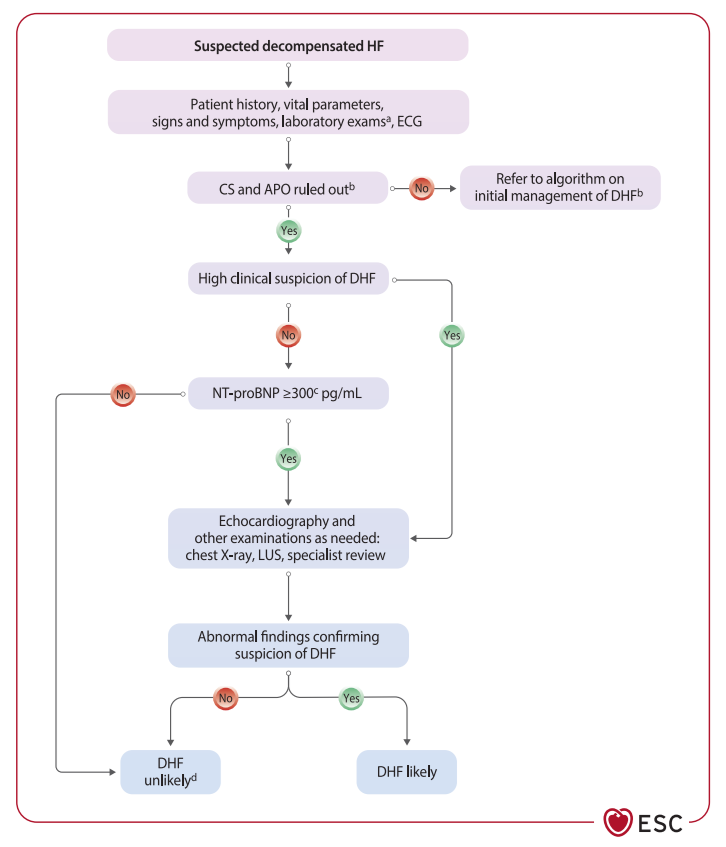
        

          
Figure 11. Lưu đồ chẩn đoán thực hành lâm sàng đối với suy tim mất bù (DHF)

          Bắt đầu bằng đánh giá toàn diện bệnh sử, sinh hiệu, triệu chứng và ECG ➔ Nếu có Sốc tim (CS) hoặc Phù phổi cấp (APO), chuyển ngay sang phác đồ cấp cứu khẩn cấp ➔ Nếu không có CS/APO, định lượng NT-proBNP/BNP ➔ Nếu dưới ngưỡng cắt giúp loại trừ DHF; nếu vượt ngưỡng, tiến hành siêu âm tim và thăm dò chuyên sâu (X-quang ngực, siêu âm phổi LUS).
        

      

      
4 Pha Quản Lý Bệnh Nhân Nhập Viện Vì Suy Tim Mất Bù

      

        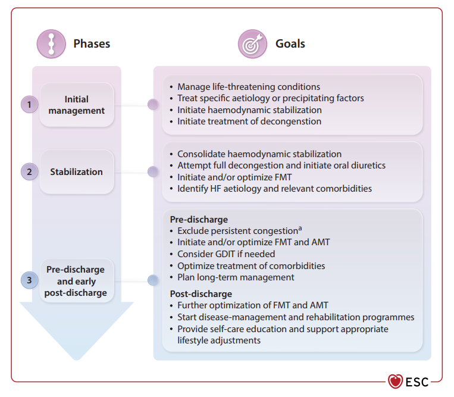
        

          
Figure 12. Các giai đoạn và mục tiêu điều trị nội viện của suy tim mất bù

          Phân cấp quá trình nằm viện thành 4 pha động liên tục:
           • <strong>Pha 1: Tiếp nhận cấp cứu (Admission):</strong> Đánh giá huyết động, hỗ trợ hô hấp, giải áp sung huyết khẩn cấp bằng lợi tiểu IV và tầm soát nguyên nhân đe dọa tính mạng (hội chứng vành cấp, loạn nhịp).
           • <strong>Pha 2: Pha nằm viện sớm (Early ward phase):</strong> Giải áp sung huyết triệt để, khởi trị/duy trì và tăng liều từng bước các thuốc nội khoa nền tảng FMT.
           • <strong>Pha 3: Pha chuẩn bị xuất viện (Pre-discharge phase):</strong> Đánh giá giải sung huyết hoàn toàn (Figure 14), lập kế hoạch tối ưu hóa liều FMT nhanh (STRONG-HF) và giáo dục tự quản lý.
           • <strong>Pha 4: Pha sau xuất viện sớm (Post-discharge phase):</strong> Tái khám sớm trong 1–2 tuần sau xuất viện để đánh giá an toàn (HA, mạch, eGFR, K+) và tiếp tục tăng liều FMT đạt liều mục tiêu trong vòng 6 tuần.
        

      

      
Bộ Công Cụ Đánh Giá Giải Áp Sung Huyết Trước Khi Cho Bệnh Nhân Xuất Viện

      

        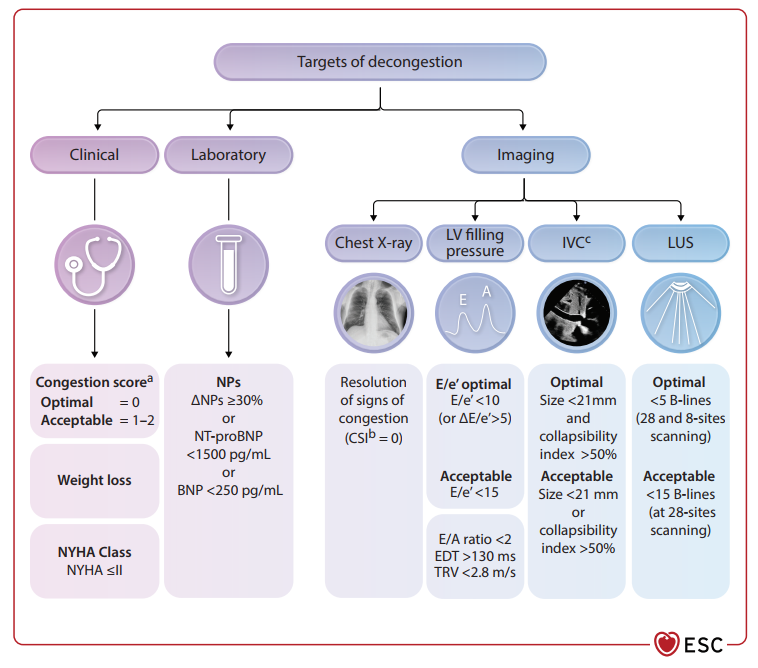
        

          
Figure 14. Bộ công cụ đa phương tiện đánh giá mức độ giải áp sung huyết trước xuất viện

          Ngăn ngừa biến cố tái nhập viện sớm vì sung huyết dội ngược bằng 4 nhóm công cụ:
           1. <strong>Lâm sàng:</strong> Thang điểm sung huyết (CSI - Congestion Score Index = 0: hết khó thở, hết khó thở khi nằm orthopnoea, hết rales phổi, hết phù, TMC xẹp).
           2. <strong>POCUS (Siêu âm tại giường):</strong> Siêu âm phổi (LUS) đếm số đường B-lines; siêu âm đánh giá đường kính và độ xẹp tĩnh mạch chủ dưới (IVC).
           3. <strong>Siêu âm tim (TTE):</strong> Vận tốc dòng hở van ba lá (TRV), thời gian giảm tốc sóng E (EDT) ước tính áp lực đổ đầy.
           4. <strong>Xét nghiệm:</strong> Xu hướng giảm rõ rệt của peptide bài niệu (BNP, NT-proBNP) so với lúc nhập viện.
        

      

    

  

  {/* ========================================================================= */}
  {/* PHẦN 2: GIẢI ÁP SUNG HUYẾT & LỢI TIỂU ĐỊNH HƯỚNG NATRI NIỆU */}
  {/* ========================================================================= */}
  

    

      

        
<i class="fa-solid fa-droplet"></i>

        <h2 class="sec-title">Phần 2: Phác Đồ Giải Áp Sung Huyết &amp; Điều Trị Lợi Tiểu Định Hướng Natri Niệu (Natriuresis-Guided)</h2>
      

      FIGURE 15 • NATRIURESIS-GUIDED
    

    

      
      

        Điều trị then chốt trong DHF là giải áp sung huyết bằng liệu pháp lợi tiểu đường tĩnh mạch. Nhằm tối ưu hóa hiệu quả thải muối nước, ESC 2026 đưa ra khuyến cáo <strong>cá thể hóa liệu pháp lợi tiểu dựa trên nồng độ natri niệu (spot uNa+)</strong>:
      

      

        

          
1

          

            <strong>Khởi Trị Lợi Tiểu Quai Tĩnh Mạch (Loop Diuretics IV)</strong>
            

              • Bệnh nhân chưa từng dùng lợi tiểu (diuretic naive): Bắt đầu bằng <strong>Furosemide 40 mg tiêm tĩnh mạch</strong>. 
              • Bệnh nhân đang dùng lợi tiểu mạn tính: Khởi đầu bằng <strong>liều IV tương đương gấp đôi liều uống hằng ngày</strong>.
            

          

        

        

          
2

          

            <strong>Đánh Giá Đáp Ứng Sớm (Natri Niệu Giờ 2 hoặc Thể Tích Nước Tiểu Giờ 6)</strong>
            

              • Đo <strong>Natri niệu ngẫu nhiên (spot uNa+) ở giờ thứ 2</strong>: Mục tiêu <strong>≥ 70 mmol/L (hoặc mEq/L)</strong>. 
              • HOẶC theo dõi <strong>thể tích nước tiểu ở 6 giờ đầu</strong>: Mục tiêu <strong>≥ 100 mL/giờ</strong>.
            

          

        

        

          
3

          

            <strong>Xử Trí Phân Nhánh Theo Mức Độ Đáp Ứng</strong>
            

              • <strong>Nếu ĐẠT MỤC TIÊU:</strong> Lặp lại liều lợi tiểu quai mỗi 12 giờ cho đến khi giải áp sung huyết hoàn toàn. 
              • <strong>Nếu KHÔNG ĐẠT (Đáp ứng kém):</strong> Ngay lập tức <strong>gấp đôi liều Furosemide IV</strong>. Đồng thời phối hợp sớm các lợi tiểu ngoài quai (non-loop diuretics): 
              &nbsp;&nbsp;+ <strong>Acetazolamide tiêm tĩnh mạch 500 mg x 1 lần/ngày</strong> (chứng cứ thử nghiệm ADVOR tăng tỷ lệ giải sung huyết thành công). 
              &nbsp;&nbsp;+ HOẶC <strong>Hydrochlorothiazide (HCTZ) đường uống</strong> (chỉnh liều 25–100 mg theo eGFR, chứng cứ thử nghiệm CLOROTIC). 
              • <strong>Kháng trị lợi tiểu (Diuretic Resistance):</strong> Cân nhắc chỉ định <strong>Siêu lọc máu (Ultrafiltration)</strong> để rút dịch trực tiếp.
            

          

        

      

      

        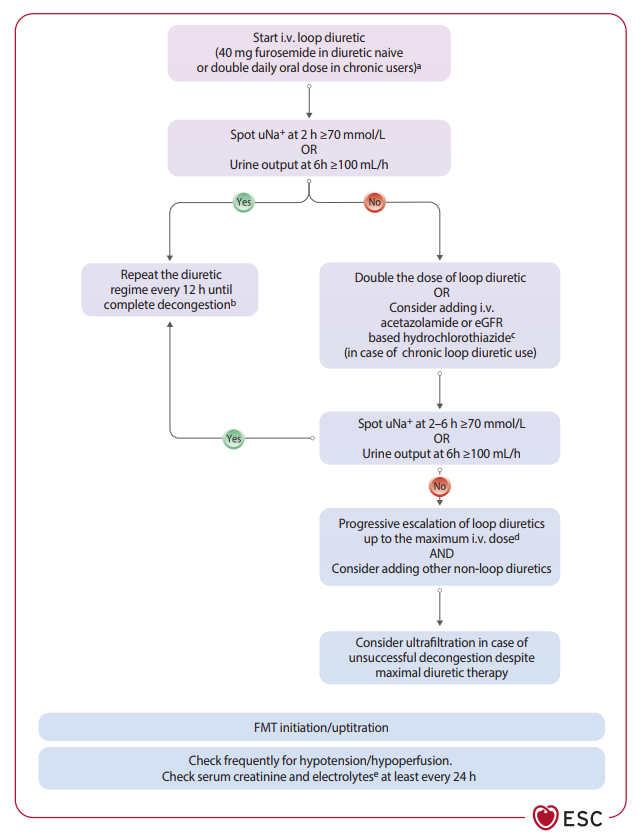
        

          
Figure 15. Thuật toán điều trị lợi tiểu giải áp sung huyết định hướng Natri niệu

          Lưu đồ phân nhánh rõ ràng dựa trên mục tiêu uNa+ ≥70 mmol/L ở giờ thứ 2 hoặc nước tiểu ≥100 mL/h ở giờ thứ 6. Nhánh đạt (Yes): duy trì phác đồ. Nhánh không đạt (No): gấp đôi liều Furosemide IV + bổ sung Acetazolamide IV (500 mg/ngày) hoặc Hydrochlorothiazide uống. Yêu cầu theo dõi creatinine huyết thanh và điện giải đồ tối thiểu mỗi 24 giờ.
        

      

      
Khuyến Cáo Bổ Trợ Nội Viện &amp; Shock Team

      

        

          Class I
          Level B1
        

        <strong>Khởi trị SGLT2i sớm ngay trong giai đoạn nội viện:</strong> Khuyến cáo khởi trị SGLT2i (Dapagliflozin hoặc Empagliflozin 10 mg/ngày) cho tất cả bệnh nhân suy tim mất bù ngay trong bệnh viện khi huyết động vừa đạt ổn định (chứng minh qua thử nghiệm EMPULSE và SOLOIST-WHF giúp giảm tái nhập viện sớm).
      

      

        

          Class IIb
          Level B1
        

        <strong>Liệu pháp lợi tiểu định hướng natri niệu:</strong> Đánh giá nồng độ natri niệu ngẫu nhiên sớm trong những ngày đầu nhập viện để định hướng điều chỉnh liều lợi tiểu giúp tăng cường thải muối nước.
      

      

        

          Class I
          Level C
        

        <strong>Shock Team trong Sốc Tim:</strong> Khuyến cáo thành lập và hội ý ê-kíp đa chuyên khoa <strong>Shock Team</strong> đối với các trường hợp sốc tim tiến triển, là ứng viên của thiết bị hỗ trợ tuần hoàn cơ học tạm thời (temporary MCS) để lựa chọn thiết bị can thiệp tối ưu.
      

    

  

  {/* ========================================================================= */}
  {/* PHẦN 3: THIẾT BỊ ĐIỆN HỌC TIM (GDIT: ICD & CRT) */}
  {/* ========================================================================= */}
  

    

      

        
<i class="fa-solid fa-bolt"></i>

        <h2 class="sec-title">Phần 3: Liệu Pháp Thiết Bị Điện Học Tim (GDIT: Cấy ICD &amp; Tái Đồng Bộ Cơ Tim CRT)</h2>
      

      FIGURE 10 • ICD &amp; CRT INDICATIONS
    

    

      
      
1. Cấy Máy Phá Rung Tự Động (ICD) Dự Phòng Đột Tử Do Tim (SCD)

      
      

        

          Class I
          Level A/B
        

        <strong>Dự phòng thứ phát (Secondary Prevention):</strong> Khuyến cáo cấy ICD cho bệnh nhân đã từng cứu sống sau ngừng tuần hoàn do rung thất (VF) hoặc nhanh thất (VT) gây mất ổn định huyết động, tiên lượng sống &gt;1 năm với chức năng tốt, không có nguyên nhân đảo ngược được và không xảy ra trong 48 giờ đầu sau NMCT cấp.
      

      

        

          Class I
          Level A/B
        

        <strong>Dự phòng tiên phát do Bệnh mạch vành (Ischaemic Etiology):</strong> Khuyến cáo cấy ICD cho bệnh nhân suy tim có triệu chứng (NYHA II–III), <strong>LVEF ≤35% sau tối thiểu 3 tháng điều trị nội khoa tối ưu FMT</strong>, ngoại trừ trường hợp mới bị NMCT trong vòng 40 ngày.
      

      

        

          Class IIa
          Level A/B
        

        <strong>Dự phòng tiên phát Không do thiếu máu cục bộ (Non-Ischaemic Etiology):</strong> Nên cân nhắc cấy ICD cho bệnh nhân suy tim triệu chứng (NYHA II–III), <strong>LVEF ≤35% sau tối thiểu 3 tháng FMT</strong> và tiên lượng sống &gt;1 năm.
      

      

        

          Class III (Gây Hại)
          Level B1
        

        <strong>Chống chỉ định ICD trong 40 ngày sau NMCT cấp:</strong> Không khuyến cáo cấy ICD dự phòng tiên phát trong vòng 40 ngày sau nhồi máu cơ tim cấp do không cải thiện tiên lượng sống còn.
      

      

        

          Class III (Gây Hại)
          Level C
        

        <strong>Chống chỉ định ICD ở NYHA IV kháng trị:</strong> Không khuyến cáo cấy ICD cho bệnh nhân suy tim NYHA IV triệu chứng nặng kháng trị với điều trị nội khoa, trừ khi họ là ứng viên chuẩn bị cấy CRT, cấy LVAD hoặc ghép tim.
      

      
2. Liệu Pháp Tái Đồng Bộ Cơ Tim (CRT-P / CRT-D)

      
      

        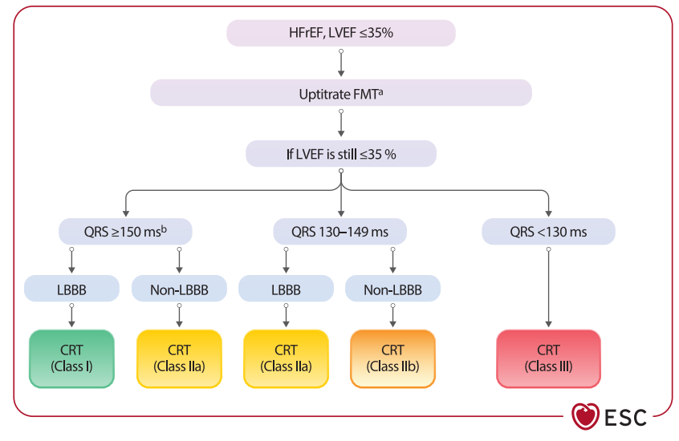
        

          
Figure 10. Lưu đồ thuật toán chỉ định cấy máy tái đồng bộ cơ tim (CRT)

          Phân cấp quyết định dựa trên: Nhịp xoang vs Rung nhĩ ➔ LVEF ≤35% ➔ Hình dạng QRS (LBBB vs Non-LBBB) ➔ Độ rộng QRS:
           • <strong>Màu xanh lá (Class I, A):</strong> Block nhánh trái hoàn toàn (LBBB) với <strong>QRS ≥ 150 ms</strong>.
           • <strong>Màu xanh dương (Class IIa, C):</strong> LBBB với <strong>QRS 130–149 ms</strong>.
           • <strong>Màu xanh dương (Class IIa, B1):</strong> Non-LBBB với <strong>QRS ≥ 150 ms</strong>.
           • <strong>Màu đỏ (Class III, A):</strong> Chống chỉ định CRT khi <strong>QRS &lt; 130 ms</strong> mà không có chỉ định tạo nhịp.
        

      

      

        

          Class I
          Level A
        

        <strong>Chỉ định CRT thay thế tạo nhịp RV ở bệnh nhân Block AV độ cao:</strong> Khuyến cáo lựa chọn cấy CRT thay vì tạo nhịp thất phải thông thường ở bệnh nhân suy tim phân suất tống máu giảm (<strong>LVEF &lt;50%</strong>), bất kể phân độ NYHA hay độ rộng QRS, khi có chỉ định tạo nhịp thất do Block nhĩ thất độ cao (bao gồm cả bệnh nhân rung nhĩ) nhằm giảm biến cố suy tim.
      

    

  

  {/* ========================================================================= */}
  {/* PHẦN 4: SUY TIM TIẾN TRIỂN (STAGE D), MCS, GHÉP TIM & PALLIATIVE CARE */}
  {/* ========================================================================= */}
  

    

      

        
<i class="fa-solid fa-hands-holding-circle"></i>

        <h2 class="sec-title">Phần 4: Quản Lý Suy Tim Tiến Triển (Stage D), Hỗ Trợ Cơ Học (MCS), Ghép Tim &amp; Palliative Care</h2>
      

      FIGURE 16, 18 &amp; TABLE 17
    

    

      
      
Quy Trình Sàng Lọc Sớm &amp; Chuyển Tuyến Kịp Thời (Triage to Advanced HF Centre)

      

        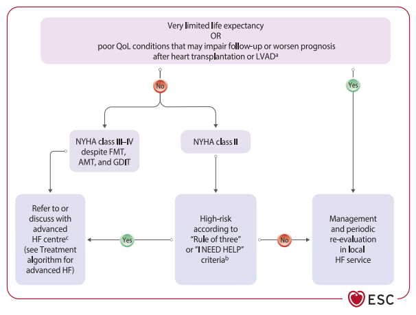
        

          
Figure 16. Quy trình phân loại và chuyển viện kịp thời bệnh nhân suy tim tiến triển

          Đánh giá triệu chứng dai dẳng NYHA III–IV dù tối ưu FMT ➔ Áp dụng tiêu chuẩn <strong>"I NEED HELP"</strong> hoặc <strong>"Rule of Three"</strong> (Table 15) ➔ Đánh giá các chống chỉ định / bệnh đồng mắc nặng ➔ Nếu có: Chuyển Chăm sóc giảm nhẹ tích hợp; Nếu không: Chuyển khẩn đến <strong>Trung tâm Suy tim Chuyên sâu</strong> để cấy LVAD hoặc Ghép tim.
        

      

      
Phân Tầng Điều Trị Theo Thang Điểm Huyết Động INTERMACS (Figure 18)

      

        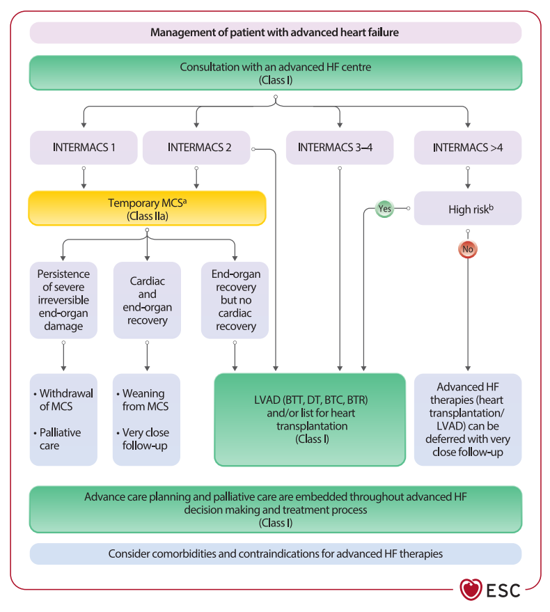
        

          
Figure 18. Thuật toán điều trị suy tim tiến triển theo phân độ INTERMACS

          • <strong>INTERMACS 1–2 (Sốc tim sâu sắc / Suy sụp huyết động nhanh):</strong> Hỗ trợ tuần hoàn cơ học tạm thời <strong>(Temporary MCS - Class IIa)</strong>. 
          • <strong>INTERMACS 3–4 (Lệ thuộc Inotrope liên tục):</strong> Cấy Thiết bị hỗ trợ thất trái dài hạn <strong>(Durable LVAD - Class I)</strong> cho các chiến lược: Cầu nối ghép tim (BTT), Cầu nối quyết định (BTC), hoặc Điều trị đích lâu dài (DT). 
          • <strong>INTERMACS &gt;4 (Nguy cơ cao: sung huyết kháng trị, VO2 đỉnh &lt;12–14 mL/kg/min):</strong> Chỉ định cấy LVAD hoặc đưa vào danh sách chờ ghép tim (Class I).
        

      

      
Tiêu Chuẩn Chỉ Định &amp; 5 Chống Chỉ Định Tuyệt Đối Của Ghép Tim (Table 17)

      

        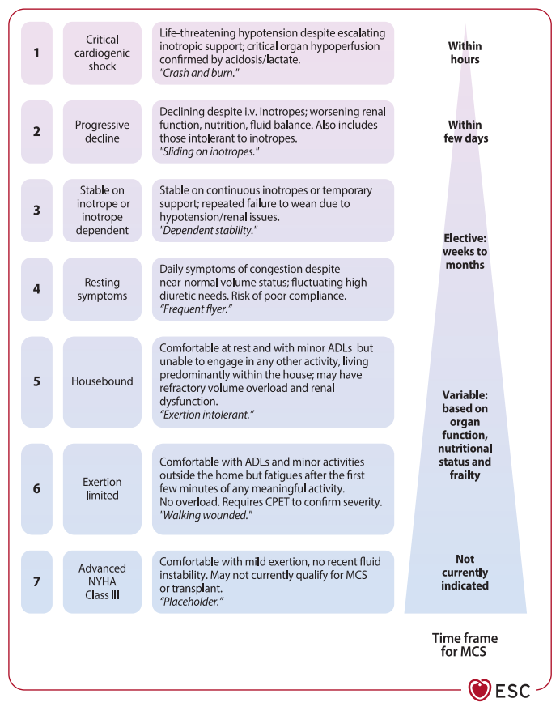
        

          
Table 17. Tiêu chuẩn chỉ định và chống chỉ định tuyệt đối của Ghép tim

          <strong>5 Chống chỉ định tuyệt đối của Ghép tim trong ESC 2026:</strong>
           1. Bệnh lý đồng mắc nghiêm trọng có tiên lượng sống còn rất kém không thể đảo ngược bằng ghép tim (ung thư tiến triển...).
           2. Sức cản mạch máu phổi tăng cao cố định (Elevated Pulmonary Vascular Resistance), không đáp ứng test giãn mạch.
           3. Suy chức năng gan không hồi phục (Xơ gan) hoặc suy thận không hồi phục.
           4. Lạm dụng rượu, chất kích thích hoặc duy trì hút thuốc lá chủ động trong 6 tháng gần nhất.
           5. Thiếu sự hỗ trợ gia đình và xã hội (insufficient social support) để đảm bảo tuân thủ thuốc thải ghép lâu dài.
        

      

      
Chăm Sóc Giảm Nhẹ Tích Hợp (Palliative Care) &amp; Lập Kế Hoạch Trước

      

        

          Class I
          Level B1
        

        <strong>Lập kế hoạch chăm sóc trước (Advance Care Planning):</strong> Khuyến cáo thảo luận chủ động và thường quy với bệnh nhân suy tim tiến triển về tiên lượng, mục tiêu chăm sóc, nguyện vọng cá nhân và kế hoạch cuối đời (bao gồm việc đồng thuận tắt các thiết bị cấy ghép như ICD khi bước vào giai đoạn hấp hối).
      

      

        

          Class I
          Level B2
        

        <strong>Đội ngũ chăm sóc giảm nhẹ đa chuyên khoa:</strong> Khuyến cáo cho phép bệnh nhân suy tim tiến triển tiếp cận đội ngũ chăm sóc giảm nhẹ tích hợp nhằm tối thiểu hóa gánh nặng triệu chứng, giảm trầm cảm và nâng cao chất lượng cuộc sống.
      

    

  

  {/* ========================================================================= */}
  {/* PHẦN 5: CAN THIỆP BỆNH VAN TIM & MẠCH VÀNH ĐỒNG MẮC */}
  {/* ========================================================================= */}
  

    

      

        
<i class="fa-solid fa-heart-circle-bolt"></i>

        <h2 class="sec-title">Phần 5: Can Thiệp Bệnh Van Tim (Mitral TEER / TAVI) &amp; Bệnh Mạch Vành Đồng Mắc (CABG/PCI)</h2>
      

      FIGURE 19 &amp; 20 • TABLE 19
    

    

      
      
1. Hẹp Van Động Mạch Chủ Khít (Severe Aortic Stenosis)

      

        

          Class I
          Level B
        

        <strong>Can thiệp van ĐMC (SAVR hoặc TAVI):</strong> Khuyến cáo chỉ định can thiệp thay van động mạch chủ (phẫu thuật SAVR hoặc qua ống thông TAVI) cho tất cả bệnh nhân suy tim có kèm hẹp chủ khít cơ năng nặng (high-gradient severe AS) có tiên lượng sống &gt;1 năm, bất kể trị số phân suất tống máu LVEF, nhằm cải thiện triệu chứng và giảm tỷ lệ tử vong.
      

      
2. Hở Van Hai Lá Thứ Phát (Secondary Mitral Regurgitation) &amp; Can Thiệp TEER

      
      

        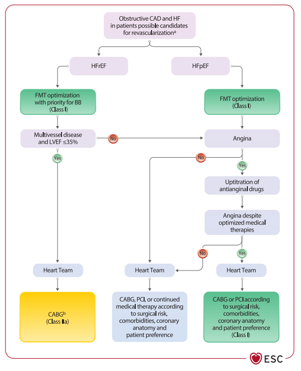
        

          
Figure 20. Sơ đồ xử trí hở van hai lá thứ phát ở bệnh nhân HFrEF

          Tối ưu hóa FMT &amp; cấy CRT (nếu có chỉ định) ➔ Đánh giá hở hai lá nặng dai dẳng ➔ Kiểm tra tiêu chuẩn <strong>COAPT-like</strong> (Table 19):
           • <strong>Nếu ĐẠT (Yes):</strong> Khuyến cáo thực hiện <strong>Sửa van hai lá qua ống thông (Mitral TEER) - Chỉ định Class I</strong>.
           • <strong>Nếu KHÔNG ĐẠT (No):</strong> Đánh giá suy tim Stage D (ưu tiên LVAD / Ghép tim, TEER chỉ là Class IIb cân nhắc thêm).
        

      

      

        <strong style="color: var(--color-primary, #0284c7);">Tiêu chuẩn lựa chọn Mitral TEER theo Table 19 (COAPT Criteria):</strong> 
        1. Đã tối ưu hóa tối đa FMT và CRT. 
        2. Triệu chứng NYHA Class ≥II. 
        3. Có ≥1 lần nhập viện suy tim trong năm qua HOẶC BNP ≥300 pg/mL / NT-proBNP ≥1000 pg/mL. 
        4. Không có suy tim tiến triển Stage D. 
        5. Không có bệnh mạch vành cần tái thông. 
        6. LVEF từ 20% đến 50%. 
        7. Đường kính cuối tâm thu thất trái (LVESD) ≤ 70 mm. 
        8. Áp lực ĐM phổi tâm thu (sPAP) ≤ 70 mmHg. 
        9. Không có suy thất phải nặng, không có bệnh van ĐMC/van 3 lá nặng đi kèm.
      

      
3. Chiến Lược Quản Lý Bệnh Mạch Vành Đồng Mắc (CAD Management)

      
      

        
        

          
Figure 19. Sơ đồ thuật toán xử trí bệnh mạch vành ở bệnh nhân suy tim

          Phân nhánh theo LVEF ➔ HFrEF (&lt;50%): Tối ưu FMT, ưu tiên liều tối đa Chẹn Beta (Class I) ➔ Nếu có bệnh mạch vành nhiều nhánh (multivessel CAD) kèm <strong>LVEF ≤35%</strong>: Chuyển <strong>Heart Team</strong> chỉ định <strong>Phẫu thuật bắc cầu chủ-vành (CABG) - Class I/IIa</strong> để cải thiện sống còn lâu dài ➔ Nếu có đau thắt ngực dai dẳng dù đã tối ưu thuốc: Heart Team quyết định CABG hoặc PCI (Class I).
        

      

    

  

  {/* ========================================================================= */}
  {/* PHẦN 6: BỆNH CƠ TIM NHIỄM BỘT, RUNG NHĨ & BỆNH ĐỒNG MẮC */}
  {/* ========================================================================= */}
  

    

      

        
<i class="fa-solid fa-dna"></i>

        <h2 class="sec-title">Phần 6: Bệnh Cơ Tim Nhiễm Bột (Cardiac Amyloidosis), Rung Nhĩ &amp; Bệnh Đồng Mắc</h2>
      

      FIGURE 23 &amp; TABLE 20
    

    

      
      
1. Chẩn Đoán Không Xâm Lấn &amp; Điều Trị Trúng Đích Bệnh Cơ Tim Nhiễm Bột (ATTR-CA)

      
      

        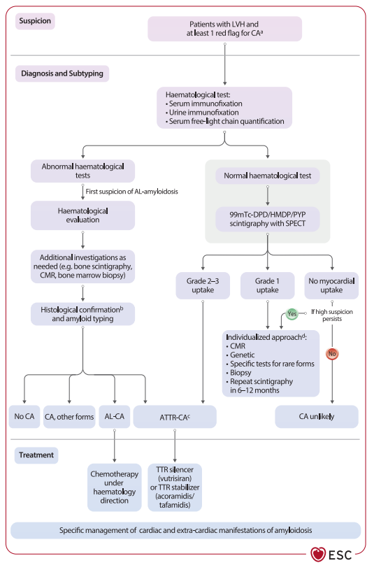
        

          
Figure 23. Quy trình chẩn đoán không xâm lấn và điều trị bệnh cơ tim nhiễm bột

          Khi nghi ngờ bệnh nhân có Amyloidosis tim ➔ Thực hiện song song 2 nhánh: 
          • <strong>Nhánh 1: Tầm soát huyết học (tìm thể AL-CA):</strong> Định lượng chuỗi nhẹ tự do huyết thanh, điện di cố định miễn dịch huyết thanh &amp; nước tiểu ➔ Chuyển chuyên khoa Huyết học hóa trị nếu bất thường. 
          • <strong>Nhánh 2: Xạ hình xương bằng chất gắn Phosphonate (99mTc-DPD/HMDP/PYP):</strong> Nếu huyết học âm tính và xạ hình xương đạt <strong>Grade 2–3</strong> ➔ <strong>Chẩn đoán xác định ATTR-CA không cần sinh thiết cơ tim</strong>.
        

      

      

        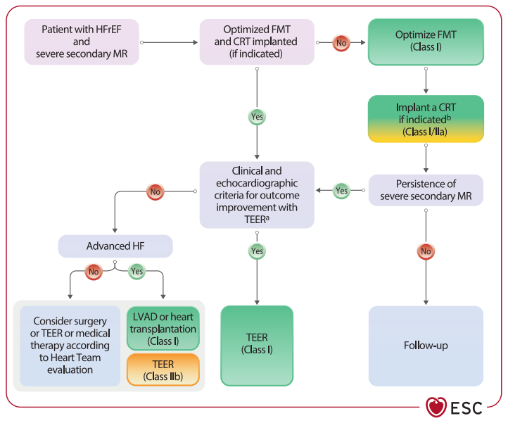
        

          
Table 20. Các "Dấu hiệu cảnh báo đỏ" (Red Flags) nghi ngờ bệnh amyloidosis tim

          • <strong>Dấu hiệu ngoài tim:</strong> Hội chứng ống cổ tay 2 bên, đứt gân cơ nhị đầu tự phát, hẹp ống sống thắt lưng, bệnh đa dây thần kinh cảm giác/vận động, hạ huyết áp tư thế. 
          • <strong>ECG:</strong> Điện thế thấp (low voltage) không tương xứng độ dày thành tim trên siêu âm, hình ảnh giả nhồi máu (pseudo-infarct), block AV. 
          • <strong>Siêu âm / CMR:</strong> Cơ tim lấp lánh dạng hạt (granular sparkling), dày vách liên nhĩ, tràn dịch màng tim, bảo tồn sức căng dọc mỏm tim (apical sparing pattern).
        

      

      

        

          Class I
          Level A
        

        <strong>Thuốc điều trị trúng đích ATTR-CA:</strong> Khuyến cáo sử dụng thuốc ổn định phân tử TTR (<strong>Tafamidis</strong> hoặc <strong>Acoramidis</strong>) hoặc thuốc bất hoạt gen TTR (<strong>Vutrisiran</strong>) cho bệnh nhân ATTR-CA thể hoang dã hoặc đột biến di truyền có triệu chứng (NYHA I–III) để giảm tiến triển bệnh, giảm nhập viện và giảm tỷ lệ tử vong do mọi nguyên nhân.
      

      
2. Quản Lý Rung Nhĩ (Atrial Fibrillation) Trong Suy Tim

      
      

        

          Class I
          Level A
        

        <strong>Kháng đông đường uống (DOACs ưu tiên):</strong> Khuyến cáo sử dụng DOACs cho tất cả bệnh nhân suy tim có rung nhĩ kèm tăng nguy cơ thuyên tắc (theo thang điểm CHA2DS2-VA). VKAs chỉ bắt buộc khi có hẹp hai lá vừa–nặng hoặc van tim cơ học.
      

      

        

          Class I
          Level A
        

        <strong>Kháng đông bắt buộc trong Amyloidosis tim &amp; Bệnh cơ tim phì đại (HCM):</strong> Bệnh nhân suy tim do ATTR-CA hoặc HCM có kèm rung nhĩ có nguy cơ huyết khối cực cao và <strong>bắt buộc phải dùng kháng đông đường uống suốt đời bất kể điểm CHA2DS2-VA</strong>.
      

      

        

          Class IIa
          Level B
        

        <strong>Triệt đốt rung nhĩ bằng Catheter (Catheter Ablation):</strong> Nên được cân nhắc ở bệnh nhân HFrEF kèm rung nhĩ có triệu chứng để cải thiện chất lượng sống, giảm tỷ lệ tử vong và tái nhập viện (ưu tiên khi gánh nặng AF cao, thời gian persistent &lt;1 năm).
      

      
3. Quản Lý Bệnh Đồng Mắc Không Do Tim Mạch &amp; Cảnh Báo An Toàn

      
      

        

          Class I
          Level A
        

        <strong>Đái tháo đường típ 2:</strong> Khuyến cáo sử dụng ức chế SGLT2 (SGLT2i) độc lập với HbA1c ban đầu. <em>Chống chỉ định SGLT2i ở ĐTĐ típ 1 do nguy cơ nhiễm toan ceton ĐTĐ.</em>
      

      

        

          Class IIa
          Level C
        

        <strong>Tiêm chủng phòng ngừa (Vaccination):</strong> Khuyến cáo tiêm phòng vắc-xin cúm (influenza) và phế cầu (pneumococcal) định kỳ cho tất cả bệnh nhân suy tim để giảm nguy cơ biến chứng viêm phổi và giảm nhập viện.
      

      

        

          Class IIa
          Level B1
        

        <strong>Theo dõi áp lực động mạch phổi từ xa (CardioMEMS):</strong> Nên cân nhắc cấy thiết bị theo dõi áp lực ĐM phổi không dây để định hướng điều chỉnh thuốc ngoại trú ở bệnh nhân suy tim NYHA III có nhập viện gần đây (thử nghiệm MONITOR-HF và GUIDE-HF).
      

      

        

          Class III (Gây Hại)
          Level B2
        

        <strong>Chống chỉ định NSAIDs và ức chế chọn lọc COX-2:</strong> Tuyệt đối không sử dụng NSAIDs và thuốc ức chế chọn lọc COX-2 cho bệnh nhân suy tim vì làm tăng giữ muối nước, gây đợt mất bù tiến triển và tăng tỷ lệ nhập viện.
      

    

  

  {/* ========================================================================= */}
  {/* PHẦN 7: TÀI LIỆU THAM KHẢO & LIÊN KẾT */}
  {/* ========================================================================= */}
  

    

      

        
<i class="fa-solid fa-book-medical"></i>

        <h2 class="sec-title">Phần 7: Tài Liệu Tham Khảo EBM &amp; Liên Kết Chéo Hệ Sinh Thái</h2>
      

      AMA CITATIONS
    

    

      
      

        <strong>Tài liệu gốc (Primary Guideline):</strong> 
        1. Task Force for the 2026 ESC Guidelines for the management of heart failure. 2026 ESC Guidelines for the management of heart failure. <em>European Heart Journal</em>. Published online August 30, 2026. doi:10.1093/eurheartj/ehag100.  
        <strong>Thử nghiệm can thiệp &amp; Thiết bị lâm sàng (Key Interventional &amp; Device Trials):</strong> 
        2. Stone GW, Lindenfeld J, Abraham WT, et al; COAPT Trial Investigators. Transcatheter mitral-valve repair in patients with heart failure. <em>N Engl J Med</em>. 2018;379(24):2307-2318. 
        3. Mullens W, Dauw J, Martens P, et al; ADVOR Study Group. Acetazolamide in acute decompensated heart failure with volume overload. <em>N Engl J Med</em>. 2022;387(13):1185-1195. 
        4. Trullàs JC, Morales-Rull JL, Casado J, et al; CLOROTIC Trial Investigators. Combining loop with thiazide diuretics for decompensated heart failure. <em>Eur Heart J</em>. 2023;44(9):808-819. 
        5. Maurer MS, Schwartz JH, Gundapaneni B, et al; ATTR-ACT Study Investigators. Tafamidis treatment for patients with transthyretin amyloid cardiomyopathy. <em>N Engl J Med</em>. 2018;379(11):1007-1016. 
        6. Fontana M, Berk JL, Gillmore JD, et al; HELIOS-B Investigators. Vutrisiran in patients with transthyretin amyloidosis with cardiomyopathy. <em>N Engl J Med</em>. 2024;391(10):890-901. 
        7. Brugts JJ, Radhoe SP, Cleland JGF, et al; MONITOR-HF Investigators. Remote hemodynamic monitoring of pulmonary artery pressure in patients with chronic heart failure (MONITOR-HF): a randomised, clinical trial. <em>Lancet</em>. 2023;401(10394):2113-2123. 
        8. Maron MS, Rowin EJ, Vassiliou V, et al. Anticoagulation in patients with hypertrophic cardiomyopathy and atrial fibrillation. <em>J Am Coll Cardiol</em>. 2022;79(15):1501-1514.
      

      

        🔗
        

          <strong>Quay lại Phần 1 của Khuyến cáo ESC 2026:</strong> 
          Xem <a href="./2026-esc-heart-failure-p1.html" style="font-weight: 700; color: var(--color-primary, #0284c7); text-decoration: underline;">ESC 2026 Suy Tim (Phần 1: Định Nghĩa, Kiểu Hình, Dự Phòng &amp; Phác Đồ Nội Khoa)</a> để tra cứu: Tái phân loại LVEF &lt;50% vs ≥50%, phân tầng Stages A-D, FMT Tứ trụ &amp; Nhị trụ, Bảng liều Table 11 và 12+ thử nghiệm RCT bản lề.
        

      

    

  

