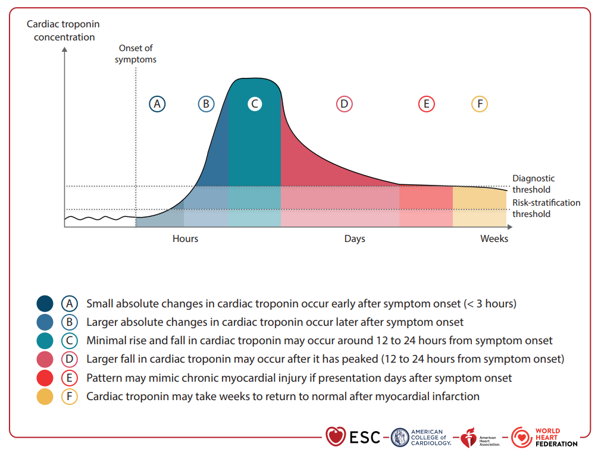
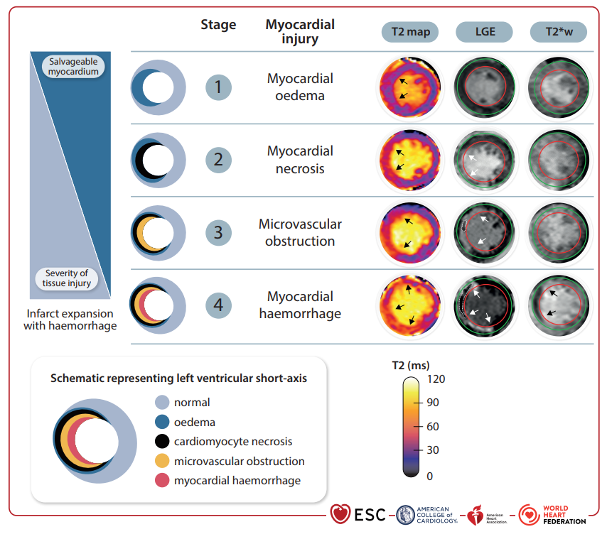
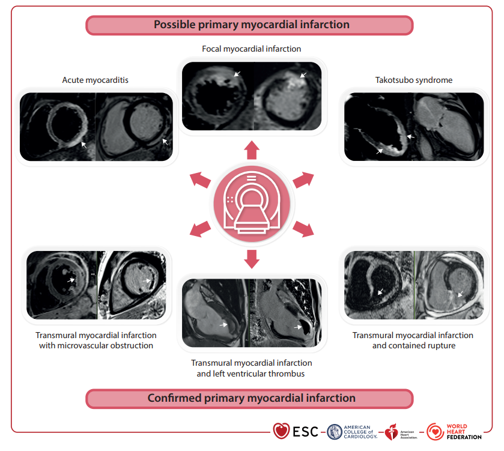
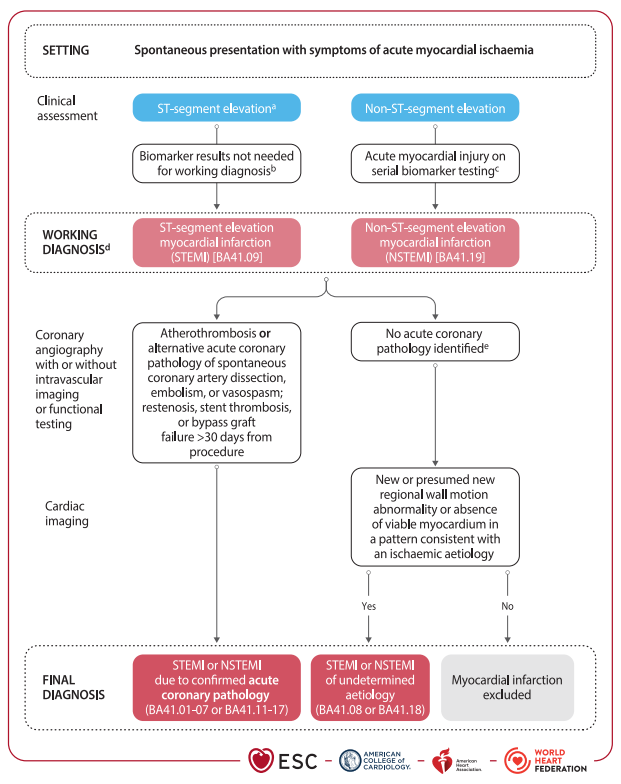
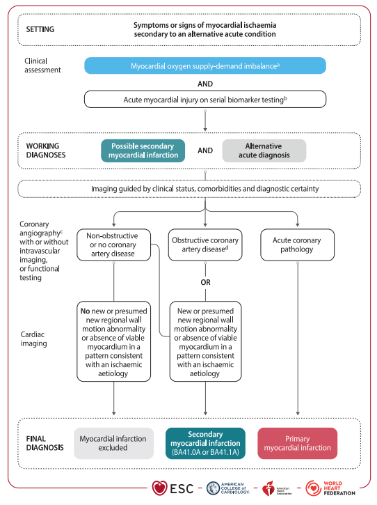
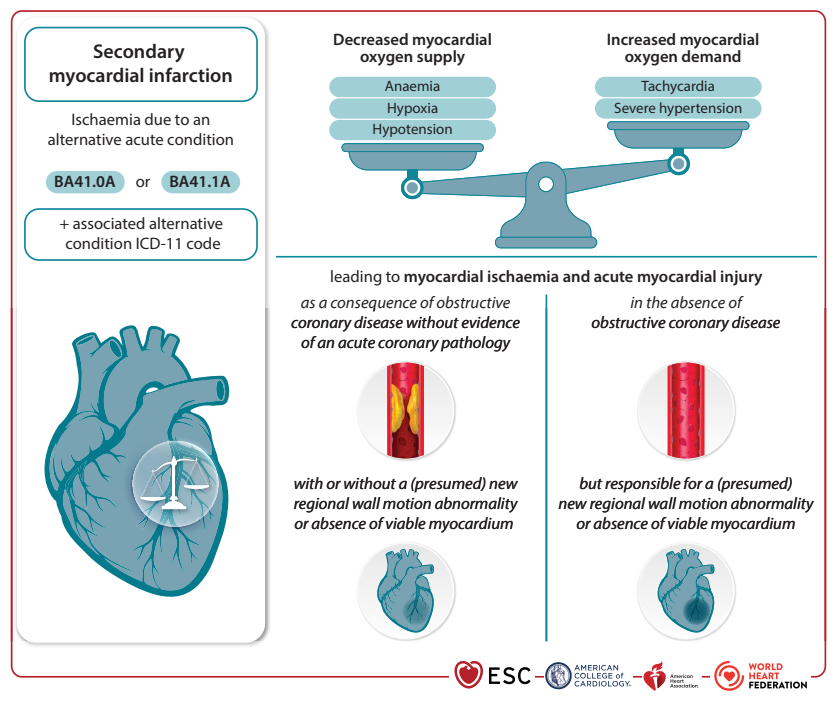
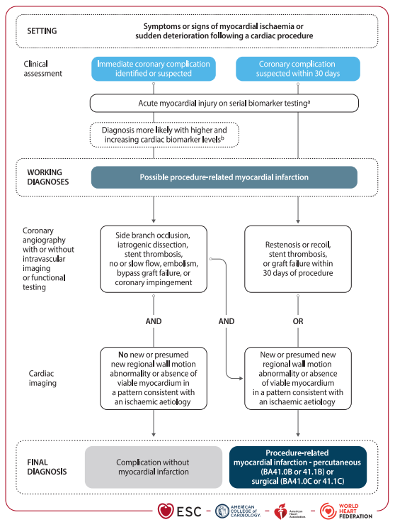
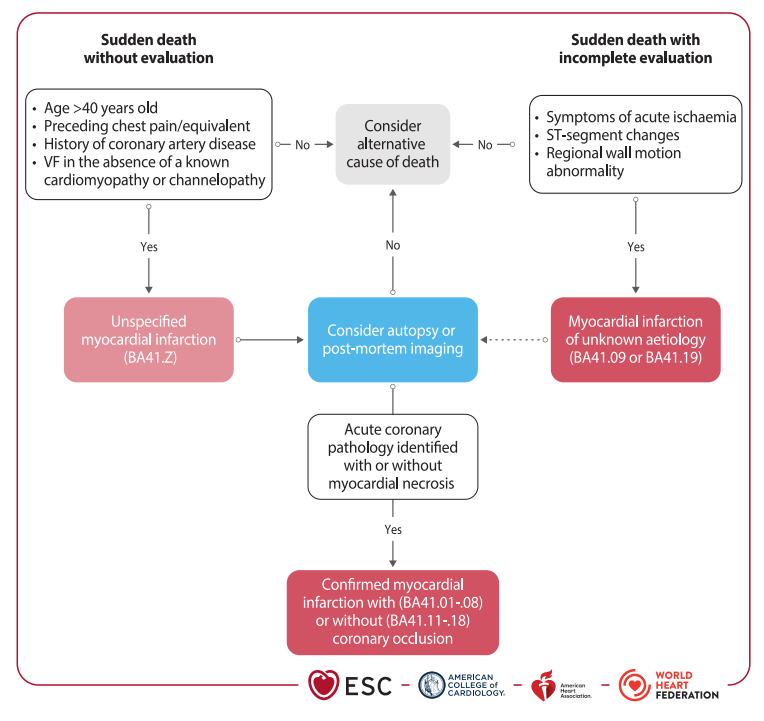
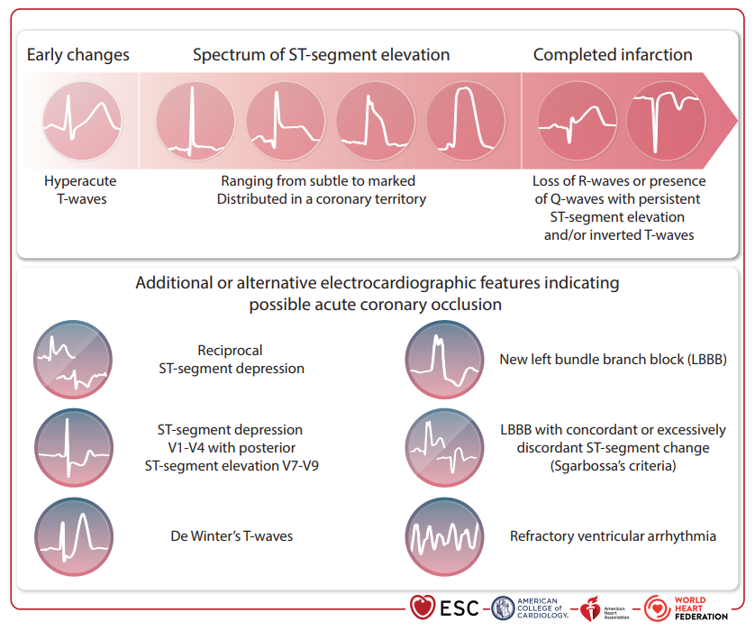

  

    

      
Fifth UDMI 2026

      
Đồng thuận toàn cầu Joint ESC/ACC/AHA/WHF Task Force

    

    

      
Sex-Specific URL

      
Ngưỡng hs-cTn bách phân vị 99th phân tầng theo giới tính

    

    

      
4 Giai Đoạn CMR

      
Đặc trưng hóa mô học: Phù nề ➔ Hoại tử ➔ MVO ➔ Xuất huyết IMH

    

    

      
Mô Hình OMI

      
Vượt qua nhị phân STEMI/NSTEMI, tái thông khẩn cấp theo tương đương OMI

    

  

  {/* ========================================================================= */}
  {/* PHẦN 1: TỔNG QUAN & RANH GIỚI TỔN THƯƠNG VS NHỒI MÁU CƠ TIM */}
  {/* ========================================================================= */}
  

    

      

        
<i class="fa-solid fa-heart-pulse"></i>

        <h2 class="sec-title">Phần 1: Tổng Quan &amp; Ranh Giới Giữa Tổn Thương Cơ Tim và Nhồi Máu Cơ Tim</h2>
      

      TABLE 2 &amp; 3 • CONSENSUS 2026
    

    

      
      

        🫀
        

          <strong>Bối Cảnh Ra Đời Của Đồng Thuận Toàn Cầu Lần Thứ 5 (Fifth UDMI 2026):</strong> 
          Đồng thuận Toàn cầu lần thứ 5 về Định nghĩa Nhồi máu cơ tim (<em>Fifth Universal Definition of Myocardial Infarction</em>) được công bố bởi Nhóm Đặc nhiệm Liên kết giữa <strong>ESC, ACC, AHA và WHF</strong>. Phiên bản 2026 tái khẳng định vị trí trung tâm của troponin tim nhạy cao (hs-cTn), chuẩn hóa ranh giới giữa tổn thương cơ tim (<em>Myocardial Injury</em>) và nhồi máu cơ tim (<em>Myocardial Infarction</em>), đưa cộng hưởng từ tim (CMR) vào chuẩn phân tầng mô học, đồng thời mở đường cho sự chuyển dịch mô hình chẩn đoán điện tâm đồ hướng tới <strong>Nhồi máu cơ tim do Tắc nghẽn cấp (Occlusion Myocardial Infarction - OMI)</strong>.
        

      

      
1. Định Nghĩa &amp; Phân Biệt Tổn Thương Cơ Tim (Myocardial Injury)

      

        <strong>Tổn thương cơ tim</strong> được xác lập khi nồng độ troponin tim (cTnI hoặc cTnT) trong máu tuần hoàn vượt quá bách phân vị thứ 99 của giới hạn tham chiếu trên (<strong>sex-specific 99th percentile URL</strong>). Đồng thuận nhấn mạnh việc bắt buộc áp dụng ngưỡng tham chiếu riêng biệt cho nam và nữ nhằm loại bỏ định kiến hệ thống và hạn chế tối đa nguy cơ bỏ sót tổn thương/nhồi máu cơ tim ở bệnh nhân nữ giới:
      

      

        

          

            Tổn Thương Cơ Tim CẤP TÍNH
            Acute Myocardial Injury
          

          

            

              Đặc Trưng Bởi Động Học hs-cTn Tăng / Giảm
            

            

              Có sự <strong>tăng và/hoặc giảm động (rise and/or fall)</strong> có ý nghĩa thống kê của nồng độ troponin tim trên các lần xét nghiệm liên tiếp.
            

            

              
Bản chất lâm sàng

              Chỉ ra một biến cố cấp tính phá hủy màng tế bào cơ tim (do thiếu máu cục bộ, viêm, căng thẳng huyết động, độc chất hoặc chấn thương).
            

          

        

        

          

            Tổn Thương Cơ Tim MẠN TÍNH
            Chronic Myocardial Injury
          

          

            

              Nồng Độ hs-cTn Tăng Ổn Định Kéo Dài
            

            

              Nồng độ troponin tim vượt quá 99th percentile URL nhưng <strong>duy trì ổn định, không có biến động động học đáng kể (&lt;20% delta)</strong> trên các mẫu máu kế tiếp.
            

            

              
Bản chất lâm sàng

              Phản ánh tình trạng hủy hoại/tái cấu trúc tế bào cơ tim âm thầm liên tục trong bệnh cơ tim mạn, suy tim mạn, hoặc bệnh thận mạn.
            

          

        

      

      
2. Bảng Phân Loại Cơ Chế Bệnh Sinh Gây Tổn Thương Cơ Tim (Tables 2 &amp; 3)

      
      

        <table class="data-table">
          <thead>
            <tr>
              <th style="width: 25%;">Nhóm Cơ Chế Bệnh Sinh</th>
              <th style="width: 35%;">Table 2: Tổn Thương Cơ Tim CẤP TÍNH</th>
              <th style="width: 40%;">Table 3: Tổn Thương Cơ Tim MẠN TÍNH</th>
            </tr>
          </thead>
          <tbody>
            <tr>
              <td><strong>1. Thiếu máu cục bộ (Ischaemia)</strong></td>
              <td>
                Nhồi máu cơ tim 
                Biến cố động mạch vành cấp (vỡ mảng xơ vữa, co thắt vành, SCAD, thuyên tắc vành).
              </td>
              <td>
                Hội chứng vành mạn (CCS) 
                Bệnh động mạch vành ổn định, bệnh cơ tim thiếu máu cục bộ mạn tính.
              </td>
            </tr>
            <tr>
              <td><strong>2. Phản ứng viêm (Inflammation)</strong></td>
              <td>
                Viêm cơ tim cấp (do nhiễm siêu vi, tự miễn, miễn dịch), thải ghép tim cấp, bão cytokine trong <strong>nhiễm trùng huyết (sepsis)</strong>.
              </td>
              <td>
                Viêm cơ tim mạn tính 
                Bệnh cơ tim tự miễn mạn tính, viêm mạch máu hệ thống.
              </td>
            </tr>
            <tr>
              <td><strong>3. Căng thẳng huyết động (Haemodynamic stress)</strong></td>
              <td>
                Mất cân bằng cung - cầu oxy cấp: Cơn nhịp nhanh/chậm kịch phát, <strong>suy tim mất bù cấp (DHF)</strong>, thuyên tắc phổi cấp (PE), cơn tăng huyết áp cấp cứu.
              </td>
              <td>
                <strong>Bệnh cơ tim tăng huyết áp</strong>, phì đại thất trái (LVH), bệnh cơ tim giãn (DCM), bệnh van tim mạn tính gây tăng hậu tải/tiền tải kéo dài.
              </td>
            </tr>
            <tr>
              <td><strong>4. Căng thẳng sinh lý (Physiological stress)</strong></td>
              <td>
                Gắng sức thể lực cực hạn (marathon), bão catecholamine (<strong>Hội chứng Takotsubo</strong>, xuất huyết dưới nhện, đột quỵ cấp, co giật động kinh, u tủy thượng thận).
              </td>
              <td>
                Bệnh cơ tim chuyển hóa, bệnh cơ tim do tuyến giáp mạn tính, rối loạn thần kinh thực vật mạn.
              </td>
            </tr>
            <tr>
              <td><strong>5. Độc chất (Toxicity)</strong></td>
              <td>
                Độc chất tim cấp: Hóa trị liệu ung thư (<strong>Anthracyclines</strong>, liệu pháp nhắm trúng đích ErbB/HER2, ức chế tyrosine kinase, ức chế chốt kiểm soát miễn dịch - <strong>ICIs</strong>), ngộ độc cấp (cocaine, CO).
              </td>
              <td>
                Bệnh cơ tim do rượu mạn tính, bệnh cơ tim do kim loại nặng, tổn thương sau xạ trị trung thất kéo dài.
              </td>
            </tr>
            <tr>
              <td><strong>6. Chấn thương &amp; Xâm lấn (Trauma / Structural)</strong></td>
              <td>
                Sốc điện chuyển nhịp, can thiệp mạch vành qua da (PCI), phẫu thuật tim (CABG/van tim), triệt đốt catheter, sinh thiết cơ tim, dập tim do chấn thương ngực kín.
              </td>
              <td>
                <strong>Bệnh cơ tim hạn chế &amp; Thâm nhiễm:</strong> Amyloidosis tim, Sarcoidosis, Hemochromatosis, bệnh Fabry, bệnh cơ tim do urê huyết cao (Uraemic cardiomyopathy) trong CKD.
              </td>
            </tr>
          </tbody>
        </table>
      

    

  

  {/* ========================================================================= */}
  {/* PHẦN 2: SINH LÝ ĐỘNG HỌC HS-CTN & PHÁC ĐỒ ĐÁNH GIÁ GIA TỐC */}
  {/* ========================================================================= */}
  

    

      

        
<i class="fa-solid fa-chart-line"></i>

        <h2 class="sec-title">Phần 2: Sinh Lý Động Học Troponin Tim (hs-cTn) &amp; Phác Đồ Đánh Giá Gia Tốc</h2>
      

      FIGURE 10 • KINETICS &amp; RAPID PROTOCOLS
    

    

      

        Troponin tim (cTnI và cTnT) là chất chỉ điểm sinh học (biomarker) tiêu chuẩn vàng có độ nhạy và độ đặc hiệu tối ưu để phát hiện hoại tử tế bào cơ tim. Trong bệnh cảnh nhồi máu cơ tim nguyên phát, động học giải phóng troponin tuần hoàn tuân theo một quy luật biến đổi thời gian đặc trưng:
      

      

        

          

1

          

            
Giai Đoạn Khởi Phát Tăng Nồng Độ (2 – 3 Giờ Đầu)

            

              hs-cTn bắt đầu được giải phóng từ bào tương vào máu tuần hoàn trong vòng <strong>2 đến 3 giờ</strong> sau khi xuất hiện thiếu máu cục bộ cơ tim. Ở mốc &lt;3 giờ, biến đổi tuyệt đối giữa các mẫu máu còn rất nhỏ, đòi hỏi các thuật toán gia tốc (0/1h hoặc 0/2h) với ngưỡng cut-off nhạy cao để loại trừ hoặc xác định sớm.
            

          

        

        

          

2

          

            
Giai Đoạn Đạt Đỉnh Cực Đại (12 – 24 Giờ)

            

              Nồng độ troponin tim thường đạt mức cực đại (peak) trong khoảng <strong>12 đến 24 giờ</strong> kể từ lúc khởi phát triệu chứng. Trong giai đoạn bình nguyên quanh đỉnh, độ biến thiên delta giữa 2 mẫu máu liên tiếp có thể ở mức tối thiểu, dễ gây nhầm lẫn với tổn thương cơ tim mạn tính nếu thiếu đánh giá lâm sàng toàn diện.
            

          

        

        

          

3

          

            
Giai Đoạn Thoái Trào Kéo Dài (Nhiều Ngày Đến Nhiều Tuần)

            

              Troponin giải phóng từ phức hợp sợi co cơ tim thoái hóa tiếp tục duy trì ở mức cao và giảm dần trong nhiều ngày hoặc nhiều tuần trước khi trở lại bình thường. Nếu bệnh nhân nhập viện muộn sau nhiều ngày, đường cong troponin thoái trào chậm có thể biểu hiện dưới dạng tăng ổn định bắt chước tổn thương cơ tim mạn tính.
            

          

        

      

      
Các Yếu Tố Ảnh Hưởng Then Chốt Đến Động Học Troponin:

      <ul style="padding-left: 1.25rem; line-height: 1.7; margin-bottom: 1.25rem; font-size: 0.88rem;">
        <li><strong>Trạng thái tái tưới máu động mạch vành:</strong> Tái thông mạch vành sớm và thành công (qua PCI cấp cứu hoặc tiêu sợi huyết) gây ra hiện tượng "rửa trôi" (washout), làm đỉnh troponin xuất hiện sớm hơn và cao vọt hơn, theo sau bởi sự sụt giảm nhanh chóng.</li>
        <li><strong>Tắc nghẽn vi tuần hoàn (MVO) &amp; Xuất huyết trong cơ tim (IMH):</strong> Ở bệnh nhân có MVO đơn thuần sau can thiệp, đỉnh troponin thường thấp hơn và xuất hiện muộn hơn. Ngược lại, nếu có tình trạng xuất huyết trong cơ tim (IMH) đi kèm, đỉnh troponin sẽ cao hơn rất nhiều và xuất hiện sớm hơn do phá hủy hàng rào vi mạch triệt để.</li>
        <li><strong>Thời điểm lấy mẫu xét nghiệm:</strong>
          

            • <em>Trước 3 giờ:</em> Biến đổi tuyệt đối rất nhỏ ➔ Bắt buộc dùng phác đồ gia tốc 0/1h hoặc 0/2h. 
            • <em>Từ 12 đến 24 giờ (gần đỉnh):</em> Biến đổi tương đối nhỏ ➔ Cần đối chiếu với ECG và bệnh sử. 
            • <em>Trình diện muộn sau nhiều ngày:</em> Nồng độ thoái trào chậm ➔ Cần phân biệt với bệnh cơ tim mạn.
          

        </li>
      </ul>

      

        
        

          
Figure 10. Động học tăng và giảm của Troponin tim theo thời gian từ khi khởi phát triệu chứng (Fifth UDMI 2026)

          Mô hình động học chi tiết giải thích 6 trạng thái thời gian lâm sàng:
          <strong>(A)</strong> Biến đổi tuyệt đối rất nhỏ của troponin tim xảy ra ở giai đoạn sớm sau khi khởi phát triệu chứng (&lt; 3 giờ).
          <strong>(B)</strong> Biến đổi tuyệt đối lớn hơn xảy ra ở giai đoạn muộn hơn sau khi khởi phát triệu chứng (từ 3 đến 12 giờ).
          <strong>(C)</strong> Sự tăng và giảm ở mức tối thiểu của troponin tim có thể xảy ra xung quanh thời điểm 12 đến 24 giờ kể từ khi khởi phát triệu chứng (giai đoạn đạt đỉnh).
          <strong>(D)</strong> Sự sụt giảm nồng độ troponin tim lớn hơn xảy ra sau khi nồng độ đã đạt đỉnh (sau 12 đến 24 giờ).
          <strong>(E)</strong> Mô hình động học có thể bắt chước tổn thương cơ tim mạn tính nếu bệnh nhân nhập viện muộn nhiều ngày sau khởi phát.
          <strong>(F)</strong> Troponin tim có thể mất nhiều tuần để trở về giới hạn bình thường sau nhồi máu cơ tim, và một số bệnh nhân có thể tiến triển thành tổn thương cơ tim mạn tính sau nhồi máu.
        

      

    

  

  {/* ========================================================================= */}
  {/* PHẦN 3: PHÂN TẦNG 4 GIAI ĐOẠN MÔ HỌC TRÊN CMR */}
  {/* ========================================================================= */}
  

    

      

        
<i class="fa-solid fa-layer-group"></i>

        <h2 class="sec-title">Phần 3: Phân Giai Đoạn Mô Học Tổn Thương Cơ Tim Trên Cộng Hưởng Từ Tim (CMR)</h2>
      

      FIGURE 11 • 4 CMR HISTOLOGICAL STAGES
    

    

      
      

        Cộng hưởng từ tim (CMR) là công cụ chẩn đoán hình ảnh không xâm lấn mạnh mẽ nhất nhờ khả năng <strong>đặc trưng hóa mô học (tissue characterization)</strong>. CMR cho phép phân định rạch ròi giữa tổn thương có thể hồi phục (phù nề mô kẽ) và tổn thương không hồi phục (hoại tử, xơ hóa, tắc nghẽn vi tuần hoàn và xuất huyết). Đồng thuận Fifth UDMI 2026 chính thức chuẩn hóa <strong>4 giai đoạn mô học tiến triển</strong> trên phim chụp CMR:
      

      

        

          

            STAGE 1: CHỈ CÓ PHÙ NỀ CƠ TIM
            Myocardial Oedema Only
          

          

            <ul class="matrix-criteria-list">
              <li><i class="fa-solid fa-circle-check" style="color: var(--color-success, #10b981);"></i> <strong>Bản đồ T2 (T2 map):</strong> Tăng tín hiệu rõ rệt biểu hiện phù nề mô kẽ.</li>
              <li><i class="fa-solid fa-circle-xmark" style="color: var(--color-text-muted, #94a3b8);"></i> <strong>Ngấm thuốc muộn (LGE):</strong> Hoàn toàn không ngấm thuốc (<strong>chưa có hoại tử tế bào</strong>).</li>
              <li><i class="fa-solid fa-circle-xmark" style="color: var(--color-text-muted, #94a3b8);"></i> <strong>Chuỗi xung T2*w:</strong> Không có giảm tín hiệu (<strong>chưa có xuất huyết</strong>).</li>
            </ul>
            

              
Ý nghĩa lâm sàng

              Tổn thương cơ tim ở giai đoạn sớm, hoàn toàn còn khả năng hồi phục nếu được tái tưới máu kịp thời.
            

          

        

        

          

            STAGE 2: PHÙ NỀ + HOẠI TỬ ĐƠN THUẦN
            Oedema + Necrosis
          

          

            <ul class="matrix-criteria-list">
              <li><i class="fa-solid fa-circle-check" style="color: var(--color-success, #10b981);"></i> <strong>Bản đồ T2 (T2 map):</strong> Phù nề cơ tim rõ rệt (tín hiệu cao).</li>
              <li><i class="fa-solid fa-circle-check" style="color: var(--color-danger, #dc2626);"></i> <strong>Ngấm thuốc muộn (LGE):</strong> Tín hiệu sáng rõ rệt đại diện cho <strong>hoại tử tế bào cơ tim không thể hồi phục</strong>.</li>
              <li><i class="fa-solid fa-circle-xmark" style="color: var(--color-text-muted, #94a3b8);"></i> <strong>Tắc vi mạch &amp; Xuất huyết:</strong> Chưa xuất hiện MVO (không có lõi tối trong LGE) và chưa có xuất huyết trên T2*w.</li>
            </ul>
            

              
Ý nghĩa lâm sàng

              Nhồi máu cơ tim hoại tử đơn thuần không đi kèm biến chứng vi mạch kéo dài.
            

          

        

        

          

            STAGE 3: TẮC NGHẼN VI TUẦN HOÀN (MVO)
            Microvascular Obstruction
          

          

            <ul class="matrix-criteria-list">
              <li><i class="fa-solid fa-circle-check" style="color: var(--color-success, #10b981);"></i> <strong>Bản đồ T2 &amp; LGE:</strong> Có đầy đủ bằng chứng phù nề và hoại tử cơ tim rộng.</li>
              <li><i class="fa-solid fa-triangle-exclamation" style="color: var(--color-warning, #f59e0b);"></i> <strong>Dấu hiệu MVO:</strong> Xuất hiện <strong>lõi tối giảm tín hiệu (no-reflow core)</strong> nằm khu trú ở trung tâm vùng LGE sáng.</li>
              <li><i class="fa-solid fa-circle-xmark" style="color: var(--color-text-muted, #94a3b8);"></i> <strong>Chuỗi xung T2*w:</strong> Vẫn chưa có tín hiệu giảm đậm độ do xuất huyết.</li>
            </ul>
            

              
Ý nghĩa lâm sàng

              Tổn thương vi mạch nặng nề, tiên lượng tái cấu trúc thất trái bất lợi và suy tim sau nhồi máu.
            

          

        

        

          

            STAGE 4: XUẤT HUYẾT TRONG CƠ TIM (IMH)
            Intramyocardial Haemorrhage
          

          

            <ul class="matrix-criteria-list">
              <li><i class="fa-solid fa-circle-exclamation" style="color: var(--color-danger, #dc2626);"></i> <strong>Chuỗi xung T2*w:</strong> Xuất hiện <strong>vùng giảm tín hiệu tối màu rất rõ rệt</strong> nằm trong lõi nhồi máu do sự lắng đọng sản phẩm thoái hóa của hemoglobin (deoxyhemoglobin/methemoglobin/ferritin).</li>
              <li><i class="fa-solid fa-circle-check" style="color: var(--color-danger, #dc2626);"></i> <strong>Tổn thương phối hợp:</strong> Luôn đi kèm MVO, hoại tử xuyên thành và phù nề lan rộng.</li>
            </ul>
            

              
Ý nghĩa lâm sàng

              Giai đoạn tổn thương mô học nặng nề nhất; nguy cơ cao loạn nhịp thất ác tính, thủng tim và tử vong.
            

          

        

      

      

        
        

          
Figure 11. Các giai đoạn tổn thương nhồi máu cơ tim nguyên phát trên Cộng hưởng từ tim CMR (Fifth UDMI 2026)

          Sự tiến triển mô học từ Stage 1 đến Stage 4 được khảo sát đa tham số qua Bản đồ T2 (cột trái), hình ảnh ngấm thuốc muộn LGE (cột giữa), và hình ảnh trục ngắn trọng T2* (T2*w, cột phải):
          <strong>Stage 1:</strong> Chỉ có phù nề (tín hiệu cao trên T2 map - đầu mũi tên đen), không có LGE hoặc IMH trên T2*w.
          <strong>Stage 2:</strong> Hoại tử cơ tim (LGE sáng - đầu mũi tên trắng) kèm phù nề nhưng chưa có MVO hay IMH.
          <strong>Stage 3:</strong> Hiện diện MVO (lõi tối nằm trong vùng LGE sáng) kèm hoại tử và phù nề, chưa có xuất huyết trên T2*w.
          <strong>Stage 4:</strong> Xuất huyết cơ tim (vùng tín hiệu thấp tối màu trên T2*w - đầu mũi tên xanh) đi kèm MVO, hoại tử và phù nề.
          <em>(Đường viền đỏ và xanh lá cây trên hình ảnh LGE và T2w là đường viền nội mạc và ngoại mạc phân vùng thất trái).</em>
        

      

    

  

  {/* ========================================================================= */}
  {/* PHẦN 4: ỨNG DỤNG CMR TRONG CHẨN ĐOÁN PHÂN BIỆT & BIẾN CHỨNG */}
  {/* ========================================================================= */}
  

    

      

        
<i class="fa-solid fa-circle-nodes"></i>

        <h2 class="sec-title">Phần 4: Ứng Dụng CMR Trong Chẩn Đoán Phân Biệt &amp; Nhận Diện Biến Chứng Cơ Học</h2>
      

      FIGURE 12 • MINOCA &amp; COMPLICATIONS
    

    

      
      

        🎯
        

          <strong>Chỉ Định Chụp CMR Sớm Trong MINOCA (Class I, Level B):</strong> 
          Đồng thuận Fifth UDMI (2026) khuyến cáo mạnh mẽ việc thực hiện chụp CMR sớm (<strong>lý tưởng nhất trong vòng 2 tuần</strong> kể từ khi khởi phát) ở tất cả bệnh nhân nghi ngờ hội chứng vành cấp nhưng chụp mạch vành không ghi nhận hẹp tắc nghẽn (MINOCA). CMR cho phép xác định chính xác căn nguyên thực sự ở hơn 85% bệnh nhân, tránh điều trị nhầm lẫn hoặc dùng kháng kết tập tiểu cầu kéo dài không cần thiết.
        

      

      
1. Chẩn Đoán Phân Biệt 3 Mô Hình Bệnh Học Phổ Biến:

      

        

          

            VIÊM CƠ TIM CẤP
            Acute Myocarditis
          

          

            

              Phù nề cơ tim khu trú ở vùng đáy thành dưới và thành bên dưới thất trái.
            

            

              
Mô hình LGE đặc trưng

              Ngấm thuốc muộn (LGE) phân bố ở <strong>lớp dưới màng ngoài tim (subepicardial)</strong> hoặc <strong>giữa thành cơ tim (mid-wall)</strong>. Hoàn toàn <strong>không tuân theo sự phân bố giải phẫu cấp máu</strong> của động mạch vành.
            

          

        

        

          

            HỘI CHỨNG TAKOTSUBO
            Takotsubo Syndrome
          

          

            

              Phù nề cơ tim xuyên thành rất rộng tập trung ở các phân thùy vùng mỏm tim (khớp với vùng phình vô động mỏm).
            

            

              
Mô hình LGE đặc trưng

              <strong>HOÀN TOÀN KHÔNG CÓ NGẤM THUỐC MUỘN (LGE ÂM TÍNH)</strong>. Đây là tiêu chuẩn vàng trên CMR để loại trừ nhồi máu cơ tim hoại tử.
            

          

        

        

          

            NHỒI MÁU CƠ TIM VÙNG
            True Ischaemic MI
          

          

            

              Phù nề và hoại tử cơ tim cấp tính do thuyên tắc vi mạch hoặc co thắt vành thoáng qua.
            

            

              
Mô hình LGE đặc trưng

              LGE bắt đầu từ <strong>lớp dưới nội mạc (subendocardial)</strong> và lan ra xuyên thành (transmural), <strong>phân bố hoàn toàn khớp với lãnh thổ cấp máu</strong> của nhánh vành thủ phạm (LAD, LCx, RCA).
            

          

        

      

      
2. Nhận Diện Các Biến Chứng Cơ Học Nguy Hiểm Trên CMR:

      <ul style="padding-left: 1.25rem; line-height: 1.7; font-size: 0.88rem; margin-bottom: 1.25rem;">
        <li><strong>Huyết khối bám thành buồng thất trái (LV Thrombus):</strong> Biểu hiện bằng khối không ngấm thuốc tín hiệu thấp lồi vào buồng tim trên thì LGE sớm và muộn, thường gặp trong nhồi máu vùng mỏm do LAD.</li>
        <li><strong>Tắc nghẽn vi tuần hoàn (MVO) diện rộng:</strong> Vùng lõi tối lớn trung tâm vùng ngấm thuốc LGE xuyên thành (ví dụ vùng thành bên do LCx).</li>
        <li><strong>Vỡ thành tim khu trú &amp; Giả phình thất (Contained LV Rupture):</strong> Hình ảnh rách thành cơ tim thất trái khu trú kèm phù nề cơ tim xung quanh và bọc máu tụ ngoài tim được màng ngoài tim bao bọc.</li>
        <li><strong>Nhồi máu cơ nhú &amp; Hở van hai lá cấp:</strong> Hoại tử cơ nhú sau trong hoặc trước ngoài dẫn đến đứt dây chằng và sa van hai lá.</li>
      </ul>

      

        
        

          
Figure 12. Vai trò của Cộng hưởng từ tim (CMR) trong chẩn đoán phân biệt và nhận diện biến chứng (Fifth UDMI 2026)

          Khảo sát 6 panel đối sánh thực tế trên phim chụp CMR:
          <strong>(Hàng trên, trái) Viêm cơ tim cấp:</strong> Phù nề vùng đáy thành dưới/dưới bên (mũi tên trắng, trái) kèm LGE dưới màng ngoài tim tương ứng (mũi tên trắng, phải).
          <strong>(Hàng trên, giữa) Nhồi máu cơ tim khu trú:</strong> Phù nề xuyên thành ở thành bên trước (trái) và LGE xuyên thành tương ứng (phải).
          <strong>(Hàng trên, phải) Hội chứng Takotsubo:</strong> Phù nề xuyên thành ở mỏm tim (trái) khớp vùng vô động mỏm và hoàn toàn không có LGE (phải).
          <strong>(Hàng dưới, trái) Nhồi máu LCx kèm MVO:</strong> Phù nề thành bên (trái) và LGE xuyên thành kèm lõi tối MVO lớn không ngấm thuốc ở trung tâm (phải).
          <strong>(Hàng dưới, giữa) Nhồi máu LAD kèm Huyết khối thất trái:</strong> Nhồi máu xuyên thành vùng LAD kèm huyết khối bám thành thất trái (mũi tên trắng ở cả hai hình).
          <strong>(Hàng dưới, phải) Nhồi máu kèm Vỡ thành tim khu trú (Giả phình):</strong> Rách thành thất trái khu trú ở vùng đáy vách liên thất dưới kèm phù nề thành cơ tim tổn thương (trái) và LGE xuyên thành (phải).
        

      

    

  

  {/* ========================================================================= */}
  {/* PHẦN 5: HỆ THỐNG LƯU ĐỒ TIẾP CẬN LÂM SÀNG (PATHWAYS) */}
  {/* ========================================================================= */}
  

    

      

        
<i class="fa-solid fa-diagram-project"></i>

        <h2 class="sec-title">Phần 5: Hệ Thống Lưu Đồ Tiếp Cận Chẩn Đoán Lâm Sàng Theo Thể Bệnh</h2>
      

      FIGURES 2, 4, 5, 6 &amp; 8 • CLINICAL PATHWAYS
    

    

      
      
1. Lưu Đồ Chẩn Đoán Nhồi Máu Cơ Tim Nguyên Phát (Figure 2)

      

        Nhồi máu cơ tim nguyên phát (Primary MI) xuất hiện tự phát do bệnh lý động mạch vành cấp tính tại chỗ làm giảm hoặc tắc hoàn toàn dòng chảy vành (xơ vữa huyết khối, bóc tách động mạch vành tự phát SCAD, co thắt vành, thuyên tắc vành, hoặc huyết khối stent muộn &gt;30 ngày).
      

      

        

          

A

          

            
Tiếp Cận Ban Đầu &amp; Phân Tầng Điện Tâm Đồ (12-lead ECG)

            

              Bệnh nhân nhập viện với cơn đau ngực cấp hoặc triệu chứng tương đương. Thực hiện ngay ECG 12 chuyển đạo:
            

            

              

                
Nhánh STEMI / OMI Cấp:

                
ST chênh lên hoặc tương đương OMI ➔ <strong>Chỉ định tái tưới máu khẩn cấp ngay lập tức</strong> (PCI cấp cứu). Lấy máu hs-cTn đồng thời để củng cố chẩn đoán.

              

              

                
Nhánh Nghi Ngờ NSTEMI:

                
ECG không đặc hiệu hoặc ST chênh xuống ➔ <strong>Tiến hành xét nghiệm hs-cTn liên tiếp (0/1h hoặc 0/2h)</strong> để đánh giá động học.

              

            

          

        

        

          

B

          

            
Đánh Giá Động Học Troponin &amp; Khảo Sát Mạch Vành (ICA / CĐHA)

            

              • <em>Không có biến đổi động học hs-cTn:</em> Loại trừ NMCT; xem xét Đau thắt ngực không ổn định (Unstable Angina) hoặc bệnh ngoài tim. 
              • <em>Có động học tăng/giảm hs-cTn:</em> Xác định tổn thương cơ tim cấp ➔ Chụp mạch vành xâm lấn (ICA) hoặc CĐHA tim mạch.
            

          

        

        

          

C

          

            
Xác Lập Chẩn Đoán Cuối Cùng

            

              • <strong>Confirmed Primary MI:</strong> Phát hiện huyết khối xơ vữa, SCAD, co thắt, hoặc thuyên tắcและ mã hóa ICD-11 tương ứng. 
              • <strong>MINOCA:</strong> Mạch vành không hẹp đáng kể (&lt;50%) ➔ Chụp CMR để chẩn đoán phân biệt. 
              • <strong>Primary MI chưa rõ căn nguyên:</strong> Tại cơ sở không có ICA/CMR, chẩn đoán dựa trên lâm sàng + ECG + hs-cTn.
            

          

        

      

      

        
        

          
Figure 2. Lưu đồ chẩn đoán lâm sàng Nhồi máu cơ tim Nguyên phát (Primary MI - Fifth UDMI 2026)

        

      

      
2. Lưu Đồ Chẩn Đoán Nhồi Máu Cơ Tim Thứ Phát (Figures 4 &amp; 5)

      

        Nhồi máu cơ tim thứ phát hình thành do sự mất cân bằng giữa cung và cầu oxy cơ tim trong bệnh cảnh một bệnh lý toàn thân cấp tính. Đồng thuận 2026 đưa ra các tiêu chuẩn khách quan nghiêm ngặt để xác định:
      

      

        

          

            TIÊU CHUẨN XÁC ĐỊNH (CONFIRMED)
            Secondary MI
          

          

            

              Bệnh nhân có bệnh lý cấp tính toàn thân + Động học hs-cTn tăng/giảm + Ít nhất 1 tiêu chí khách quan:
            

            <ul class="matrix-criteria-list">
              <li><i class="fa-solid fa-circle-check" style="color: var(--color-danger, #dc2626);"></i> Phát hiện <strong>bệnh động mạch vành tắc nghẽn mạn tính đáng kể</strong> (hẹp ≥70%, hoặc hẹp ≥50% kèm bằng chứng hạn chế dòng chảy FFR/iFR) và <strong>hoàn toàn không có tổn thương vành cấp tại chỗ</strong>.</li>
              <li><i class="fa-solid fa-circle-check" style="color: var(--color-danger, #dc2626);"></i> Phát hiện <strong>vùng rối loạn vận động thành tim mới xuất hiện</strong> hoặc mất cơ tim sống trên siêu âm tim/CMR phù hợp với nguồn gốc thiếu máu cục bộ.</li>
            </ul>
          

        

        

          

            LOẠI TRỪ (EXCLUDED)
            Non-Ischaemic Injury
          

          

            

              Nếu chụp mạch vành không có hẹp đáng kể VÀ không có rối loạn vận động vùng mới:
            

            

              
Chẩn đoán kết luận

              <strong>Tổn thương cơ tim cấp không do thiếu máu cục bộ (Non-ischaemic acute myocardial injury)</strong> liên quan đến bệnh lý nền (Nhiễm trùng huyết, suy hô hấp, viêm tụy cấp, v.v.).
            

          

        

      

      

        

          
          

            
Figure 4. Lưu đồ chẩn đoán Nhồi máu cơ tim Thứ phát

          

        

        

          
          

            
Figure 5. Cán cân Cung - Cầu Oxy cơ tim

            Giảm cung cấp (Thiếu máu, giảm oxy máu, tụt HA) vs Tăng nhu cầu (Nhịp nhanh kịch phát, tăng HA nghiêm trọng).
          

        

      

      
3. Lưu Đồ Chẩn Đoán Nhồi Máu Cơ Tim Liên Quan Đến Thủ Thuật (Figure 6)

      

        Fifth UDMI 2026 bãi bỏ các ranh giới tùy ý về ngưỡng tăng troponin khác biệt giữa PCI (&gt;5 lần) và CABG (&gt;10 lần URL), thống nhất một quy trình chẩn đoán dựa trên <strong>bằng chứng hình ảnh học khách quan trong vòng 30 ngày sau thủ thuật</strong>:
      

      

        
        

          
Figure 6. Lưu đồ chẩn đoán Nhồi máu cơ tim liên quan đến thủ thuật (trong vòng 30 ngày)

          hs-cTn tăng rõ rệt + Bằng chứng chụp mạch về biến chứng động mạch vành (tắc nhánh bên, rách mạch, huyết khối stent, tắc cầu nối) <strong>VÀ/HOẶC</strong> Bằng chứng CĐHA về rối loạn vận động vùng mới. <em>(Bắt buộc phải có cả hai tiêu chuẩn nếu biến chứng xảy ra ngay trong thủ thuật ban đầu).</em>
        

      

      
4. Lưu Đồ Tiếp Cận Tử Vong Đột Ngột Ngoài Cộng Đồng (Sudden Death - Figure 8)

      

        Quy trình chuẩn hóa mã hóa tử vong và dịch tễ học cho bệnh nhân tử vong đột ngột trước khi kịp hoàn tất xét nghiệm cận lâm sàng:
      

      

        
        

          
Figure 8. Lưu đồ chẩn đoán Nhồi máu cơ tim sau Tử vong Đột ngột

          <strong>Chưa đánh giá y khoa:</strong> Tuổi &gt;40, đau ngực trước chết, có CAD hoặc rung thất (VF) ➔ Mã ICD-11 <strong>BA41.Z (Unspecified MI)</strong>. 
          <strong>Đánh giá bán phần:</strong> Có triệu chứng hoặc thay đổi ST trước chết nhưng chưa xét nghiệm hs-cTn ➔ Mã ICD-11 <strong>BA41.09 / BA41.19 (MI of unknown aetiology)</strong>. 
          <strong>Xác định (Confirmed):</strong> Bắt buộc qua <strong>Khám nghiệm tử thi (Autopsy) hoặc CĐHA sau tử vong (Post-mortem imaging)</strong>.
        

      

    

  

  {/* ========================================================================= */}
  {/* PHẦN 6: CHUYỂN DỊCH QUAN ĐIỂM ECG: MÔ HÌNH TẮC NGHẼN CẤP (OMI) */}
  {/* ========================================================================= */}
  

    

      

        
<i class="fa-solid fa-wave-square"></i>

        <h2 class="sec-title">Phần 6: Chuyển Dịch Quan Điểm ECG: Hướng Tới Mô Hình Tắc Nghẽn Mạch Vành Cấp (OMI)</h2>
      

      FIGURE 9 &amp; TABLE 5 • OMI PARADIGM SHIFT
    

    

      
      

        ⚡
        

          <strong>Cuộc Cách Mạng Mô Hình: Từ STEMI/NSTEMI Sang OMI/NOMI:</strong> 
          Đồng thuận Fifth UDMI 2026 chính thức ghi nhận sự chuyển dịch mô hình sâu sắc (<em>paradigm shift</em>) từ phân loại nhị phân cổ điển STEMI/NSTEMI sang khái niệm lâm sàng thực tế: <strong>Nhồi máu cơ tim do Tắc nghẽn cấp tính (Occlusion Myocardial Infarction - OMI)</strong>. Các nghiên cứu hiện đại chứng minh có tới <strong>gần 25% số bệnh nhân biểu hiện lâm sàng dưới dạng NSTEMI thực chất lại có tình trạng tắc nghẽn hoàn toàn động mạch vành thủ phạm</strong> (OMI) và chịu tỷ lệ tử vong cao gấp đôi nếu bị trì hoãn can thiệp tái tưới máu.
        

      

      
1. Các Dấu Hiệu Tương Đương STEMI Chỉ Điểm Tắc Nghẽn Cấp (OMI) Cần Tái Tưới Máu Khẩn Cấp:

      

        

          

            DẤU HIỆU DE WINTER
            de Winter T Waves
          

          

            

              Đoạn ST chênh xuống đi dốc lên &gt;1 mm tại điểm J ở các chuyển đạo trước ngực (V1–V4), tiếp nối bởi <strong>sóng T cao, nhọn, đối xứng khổng lồ</strong>. Chỉ điểm tắc nghẽn hoàn toàn đoạn gần nhánh liên thất trước (LAD).
            

          

        

        

          

            HỘI CHỨNG WELLENS
            Wellens Syndrome
          

          

            

              Sóng T hai pha (Type A - 25%) hoặc âm sâu đối xứng (Type B - 75%) ở V2–V3 xuất hiện trong <strong>giai đoạn bệnh nhân đã tạm thời hết đau ngực</strong>. Chỉ điểm hẹp rất khít hoặc tắc tái thông ngắt quãng đoạn gần LAD.
            

          

        

        

          

            TIÊU CHUẨN SGARBOSSA CẢI TIẾN
            Modified Sgarbossa (LBBB / Paced)
          

          

            

              Phát hiện OMI trên nền Block nhánh trái (LBBB) hoặc nhịp máy tạo nhịp thất: 
              • ST chênh lên đồng hướng ≥1 mm. 
              • ST chênh xuống đồng hướng ≥1 mm ở V1–V3. 
              • <strong>ST chênh lên bất đồng hướng với tỷ lệ ST/S ≤ -0.25 (hoặc ≥5 mm)</strong>.
            

          

        

        

          

            NHỒI MÁU THÀNH SAU THỰC THỤ
            Posterior OMI (LCx / RCA)
          

          

            

              ST chênh xuống đi ngang/dốc xuống ở V1–V3 kèm sóng R cao ưu thế và sóng T dương ➔ <strong>Bắt buộc đo bổ sung chuyển đạo sau lưng V7–V9</strong> (ST chênh lên ≥0.5 mm).
            

          

        

      

      

        
        

          
Figure 9. Đặc điểm Điện tâm đồ của Tắc nghẽn Động mạch vành Cấp tính (OMI - Fifth UDMI 2026)

          <strong>Tiến triển theo thời gian:</strong> Khởi đầu bằng sóng T cao khổng lồ (Hyperacute T waves) ➔ Giai đoạn tiến triển bộc lộ ST chênh lên khu trú ➔ Giai đoạn nhồi máu hoàn thành xuất hiện sóng Q hoại tử bệnh lý vĩnh viễn kèm ST bớt chênh và T âm sâu. 
          <strong>Các biểu hiện tương đương STEMI chỉ ra OMI:</strong> Hình ảnh soi gương rõ rệt ở chuyển đạo đối diện, ST chênh xuống V1–V4 kèm ST chênh lên thành sau V7–V9, dấu hiệu de Winter, block nhánh trái mới, tiêu chuẩn Sgarbossa cải tiến (ST/S ≤ -0.25), hội chứng Wellens, và loạn nhịp thất ác tính kháng trị.
        

      

      
2. Bảng Tiêu Chuẩn Điện Tâm Đồ Chi Tiết Theo Guidelines (Table 5)

      

        <table class="data-table">
          <thead>
            <tr>
              <th style="width: 25%;">Đặc Điểm Điện Tâm Đồ</th>
              <th style="width: 75%;">Tiêu Chuẩn Chẩn Đoán Chi Tiết Theo Fifth UDMI (2026)</th>
            </tr>
          </thead>
          <tbody>
            <tr>
              <td><strong>ST-segment elevation</strong> (Đoạn ST chênh lên)</td>
              <td>
                Đoạn ST chênh lên mới tại điểm J ở ít nhất 2 chuyển đạo liên sườn kế cận: 
                • <strong>≥ 1.0 mm (0.1 mV)</strong> ở tất cả các chuyển đạo khác ngoài V2–V3. 
                • Ở chuyển đạo V2–V3: 
                &nbsp;&nbsp;- <strong>≥ 2.5 mm</strong> ở nam giới &lt; 40 tuổi. 
                &nbsp;&nbsp;- <strong>≥ 2.0 mm</strong> ở nam giới ≥ 40 tuổi. 
                &nbsp;&nbsp;- <strong>≥ 1.5 mm</strong> ở nữ giới bất kể độ tuổi (khi không có phì đại thất trái hay block nhánh). 
                • Ở chuyển đạo thành sau (V7–V9): <strong>≥ 0.5 mm</strong>. 
                • Ở chuyển đạo thất phải (V3R–V4R): <strong>≥ 0.5 mm</strong> (≥ 1.0 mm ở nam giới &lt; 30 tuổi).
              </td>
            </tr>
            <tr>
              <td><strong>ST-segment depression</strong> (Đoạn ST chênh xuống)</td>
              <td>
                Đoạn ST chênh xuống mới dạng đi ngang (horizontal) hoặc dốc xuống (down-sloping) <strong>≥ 0.5 mm (0.05 mV)</strong> tại điểm J ở ít nhất 2 chuyển đạo liên sườn kế cận.
              </td>
            </tr>
            <tr>
              <td><strong>Hyperacute T waves</strong> (Sóng T khổng lồ)</td>
              <td>
                Sóng T đối xứng, rộng ở đáy, biên độ cao khổng lồ mất cân đối so với biên độ phức bộ QRS đi trước ở ít nhất 2 chuyển đạo kế cận.
              </td>
            </tr>
            <tr>
              <td><strong>de Winter T waves</strong> (Sóng T de Winter)</td>
              <td>
                Sóng T cao, nhọn, đối xứng đi kèm đoạn ST chênh xuống đi dốc lên 1–3 mm tại điểm J ở các chuyển đạo trước ngực (V1–V4).
              </td>
            </tr>
            <tr>
              <td><strong>Biphasic T waves</strong> (Sóng T hai pha)</td>
              <td>
                Sóng T hai pha (pha dương đi trước, pha âm đi sau) ở các chuyển đạo liên sườn kế cận.
              </td>
            </tr>
            <tr>
              <td><strong>T-wave inversion</strong> (Sóng T âm sâu)</td>
              <td>
                Sóng T âm mới xuất hiện hoặc biến đổi động học <strong>≥ 1.0 mm (0.1 mV)</strong> ở ít nhất 2 chuyển đạo kế cận có sóng R ưu thế.
              </td>
            </tr>
            <tr>
              <td><strong>Wellens syndrome</strong> (Hội chứng Wellens)</td>
              <td>
                Sóng T hai pha (Wellens Type A) hoặc sóng T âm sâu, nhọn, đối xứng (Wellens Type B) ở chuyển đạo V2 và V3 xuất hiện trong giai đoạn bệnh nhân đã hết đau ngực hoàn toàn.
              </td>
            </tr>
            <tr>
              <td><strong>Pathologic Q waves</strong> (Sóng Q bệnh lý)</td>
              <td>
                Thời gian sóng Q <strong>≥ 40 ms (0.04 s)</strong> VÀ/HOẶC độ sâu <strong>≥ 25% biên độ sóng R đi sau</strong> trong phức bộ tương ứng ở ít nhất 2 chuyển đạo kế cận (tương quan chặt chẽ nhất với kích thước vùng sẹo hoại tử trên CMR).
              </td>
            </tr>
            <tr>
              <td><strong>Sgarbossa criteria</strong> (Tiêu chuẩn trên LBBB/Paced)</td>
              <td>
                Trên nền LBBB hoặc máy tạo nhịp thất: 
                • ST chênh lên đồng hướng (concordant) <strong>≥ 1.0 mm</strong> với phức bộ QRS (5 điểm). 
                • ST chênh xuống đồng hướng <strong>≥ 1.0 mm</strong> ở chuyển đạo V1, V2 hoặc V3 (3 điểm). 
                • <strong>Tiêu chuẩn Smith cải tiến (Modified):</strong> Tỷ lệ ST chênh lên bất đồng hướng so với sóng S <strong>ST/S ≤ -0.25 (hay biên độ ST ≥ 25% biên độ sóng S)</strong> (Độ nhạy &gt;90% phát hiện OMI).
              </td>
            </tr>
            <tr>
              <td><strong>Ventricular arrhythmia</strong> (Rối loạn nhịp thất)</td>
              <td>
                Rung thất (VF) hoặc Nhịp nhanh thất (VT) đa hình thái vô tâm thu xuất hiện đột ngột trong bối cảnh thiếu máu cục bộ cơ tim cấp.
              </td>
            </tr>
          </tbody>
        </table>
      

    

  

  {/* ========================================================================= */}
  {/* PHẦN 7: CÔNG CỤ CDSS & BỘ TIÊU CHUẨN SÀNG LỌC OMI */}
  {/* ========================================================================= */}
  

    

      

        
<i class="fa-solid fa-calculator"></i>

        <h2 class="sec-title">Phần 7: Công Cụ CDSS Tính Toán &amp; Bảng Kiểm Sàng Lọc OMI Tại Giường</h2>
      

      BEDSIDE CDSS &amp; CHECKLIST
    

    

      
Bảng Kiểm 7 Bước Nhận Diện Nhanh OMI Cần Tái Tưới Máu Khẩn Tại Khoa Cấp Cứu

      

        

          

1

          

            
Kiểm tra ST chênh lên kinh điển theo giới tính / độ tuổi

            
Nam &lt;40t (≥2.5mm ở V2-V3), Nam ≥40t (≥2.0mm), Nữ (≥1.5mm), các chuyển đạo khác (≥1.0mm).

          

        

        

          

2

          

            
Tìm kiếm hình ảnh ST chênh xuống soi gương (Reciprocal changes)

            
ST chênh xuống ở DIII/aVF khi ST chênh lên ở aVL/DI (hoặc ngược lại) khẳng định OMI thực sự.

          

        

        

          

3

          

            
Phát hiện dấu hiệu Nhồi máu thành sau thực thụ

            
ST chênh xuống đi ngang V1–V3 ➔ Mắc ngay V7–V9, tìm ST chênh lên ≥0.5 mm.

          

        

        

          

4

          

            
Kiểm tra dấu hiệu de Winter &amp; Sóng T khổng lồ (Hyperacute T)

            
ST chênh xuống dốc lên + Sóng T cao nhọn đối xứng khổng lồ ở V1–V4 ➔ Tắc LAD khẩn cấp.

          

        

        

          

5

          

            
Đánh giá Hội chứng Wellens trong giai đoạn hết đau ngực

            
Sóng T 2 pha hoặc âm sâu ở V2–V3 ➔ Chống chỉ định nghiệm pháp gắng sức, chụp mạch vành sớm.

          

        

        

          

6

          

            
Áp dụng Tiêu chuẩn Modified Sgarbossa trên nền LBBB / Tạo nhịp

            
Tỷ lệ ST/S ≤ -0.25 ở bất kỳ chuyển đạo nào bộc lộ tắc nghẽn vành cấp cần can thiệp ngay.

          

        

        

          

7

          

            
Đánh giá động học hs-cTn theo phác đồ gia tốc (0/1h hoặc 0/2h)

            
Sử dụng delta tuyệt đối đặc hiệu theo xét nghiệm (Roche hs-cTnT, Abbott hs-cTnI, Siemens hs-cTnI).

          

        

      

    

  

  {/* ========================================================================= */}
  {/* PHẦN 8: TÀI LIỆU THAM KHẢO AMA & LIÊN KẾT HỆ SINH THÁI */}
  {/* ========================================================================= */}
  

    

      

        
<i class="fa-solid fa-book-medical"></i>

        <h2 class="sec-title">Phần 8: Tài Liệu Tham Khảo Chuẩn AMA &amp; Liên Kết Chéo Hệ Sinh Thái</h2>
      

      EBM REFERENCES
    

    

      
      
Tài Liệu Tham Khảo Gốc (AMA Format):

      

        <strong>Tài liệu gốc (Primary Guideline):</strong> 
        1. Mills NL, Newby LK, Zaman S, et al; Joint European Society of Cardiology (ESC)/American College of Cardiology (ACC)/American Heart Association (AHA)/World Heart Federation (WHF) Task Force for the Universal Definition of Myocardial Infarction. <strong>Fifth Universal Definition of Myocardial Infarction (2026)</strong>. <em>Eur Heart J</em>. 2026;00:1-48. doi:10.1093/eurheartj/ehag101.  
        <strong>Tài liệu nền tảng &amp; Thử nghiệm then chốt (Foundational Landmark References):</strong> 
        2. Thygesen K, Alpert JS, Jaffe AS, et al; Executive Group on behalf of the Joint ESC/ACC/AHA/WHF Task Force for the Universal Definition of Myocardial Infarction. Fourth Universal Definition of Myocardial Infarction (2018). <em>Eur Heart J</em>. 2019;40(3):237-269. 
        3. Meyers HP, Bracey A, Lee D, et al. Comparison of the ST-Elevation Myocardial Infarction (STEMI) vs. Normal Occlusion Myocardial Infarction (NOMI) and Occlusion MI (OMI) Paradigm in Patients with Acute Myocardial Infarction. <em>J Am Heart Assoc</em>. 2021;10(8):e018494. 
        4. Smith SW, Dodd KW, Henry TD, Dvorak DM, Pearce LA. Diagnosis of ST-elevation myocardial infarction in the presence of left bundle branch block with the ST-elevation to S-wave ratio in a modified Sgarbossa rule. <em>Ann Emerg Med</em>. 2012;60(6):766-776.
      

      
Liên Kết Bài Học Liên Quan Trong Hệ Sinh Thái CliniPortal:

      

        <a href="/ebm/kho-guidelines/2026-esc-heart-failure-p1" style="text-decoration: none; color: inherit;">
          

            

              ESC 2026: SUY TIM MẠN
              PHẦN 1
            

            

              
Khuyến Cáo Chẩn Đoán &amp; Điều Trị Suy Tim Mạn

              
Tái phân loại LVEF &lt;50%, FMT Tứ trụ &amp; Nhị trụ, STRONG-HF.

            

          

        </a>

        <a href="/ebm/kho-guidelines/2026-jcva-soc-tim" style="text-decoration: none; color: inherit;">
          

            

              JCVA 2026: SỐC TIM
              SCAI A-E
            

            

              
Cập Nhật Sốc Tim &amp; Hỗ Trợ Tuần Hoàn Cơ Học

              
Phân độ SCAI, theo dõi PAC, thiết bị MCS (Impella/ECMO) và Shock Team.

            

          

        </a>

        <a href="#/ebm/kho-guidelines/2024-esc-atrial-fibrillation" style="text-decoration: none; color: inherit;">
          

            

              ESC 2024: RUNG NHĨ
              CARE FRAMEWORK
            

            

              
Khuyến Cáo Chẩn Đoán &amp; Quản Lý Rung Nhĩ

              
Chiến lược CARE, kháng đông NOAC và triệt đốt catheter sớm.

            

          

        </a>
      

    

  

  

    <a href="#/ebm/kho-guidelines" class="btn btn-primary">
      <i class="fa-solid fa-arrow-left"></i> Quay lại Kho Guidelines
    </a>
    <a href="#sec-1" class="btn">
      <i class="fa-solid fa-arrow-up"></i> Lên đầu trang
    </a>
  

