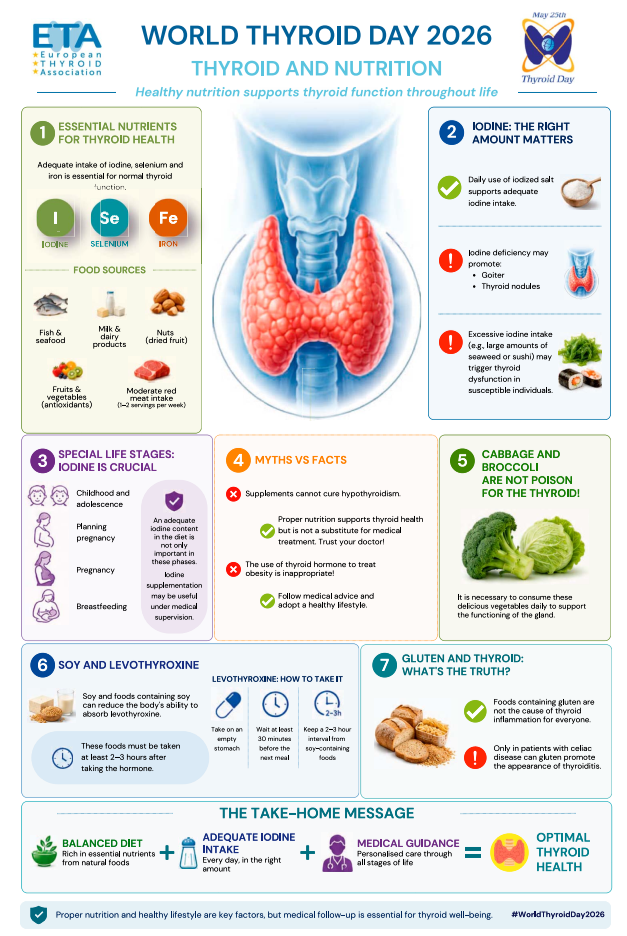

  <i class="fa-solid fa-file-medical"></i> European Thyroid Association (ETA) Review
  <i class="fa-solid fa-newspaper"></i> European Thyroid Journal
  <i class="fa-solid fa-ribbon"></i> Dinh Dưỡng Tuyến Giáp (World Thyroid Day)
  <i class="fa-solid fa-shield-halved"></i> Bộ Ba Vi Chất I-ốt, Se, Sắt &amp; Levothyroxine

<section class="stats-strip theme-trial">
  

    

      
Bộ Ba Vệ Sĩ

      
I-ốt (NIS), Selen (GPX/DIOs) và Sắt (Enzym TPO) đồng vận bảo vệ mô giáp

    

    

      
Ferritin 70–100

      
Đích Ferritin (ng/mL) tối ưu để enzym TPO hoạt động và cải thiện triệu chứng suy giáp

    

    

      
≥ 2–3 Giờ

      
Khoảng cách Levothyroxine cách ly Đậu nành; cách ly Canxi & Sắt ≥ 2–4 giờ

    

    

      
Không Thể Thay Thuốc

      
Dinh dưỡng đóng vai trò bổ trợ quan trọng nhưng không thể thay thế điều trị y khoa

    

  

</section>

  

    

      
🛡️

      

        
Cung Ứng Vi Chất Cân Bằng

        
Duy trì muối i-ốt vừa phải; ăn cá biển/hải sản 3 phần/tuần bổ sung Selen; bổ sung đủ Sắt duy trì Ferritin đích mà không lạm dụng TPCN liều cao.

      

    

    

      
⏰

      

        
Chuẩn Hóa Uống Levothyroxine (L-T4)

        
Uống lúc bụng đói hoàn toàn trước ăn sáng 60 phút hoặc trước ngủ sau ăn tối ≥ 3–4 giờ; cách ly tuyệt đối thực phẩm cản trở hấp thu.

      

    

    

      
🥗

      

        
Kháng Viêm Trục Ruột - Tuyến Giáp

        
Ưu tiên Chế độ ăn Địa Trung Hải giàu polyphenol, dầu olive và chất xơ; kiêng gluten chỉ có chỉ định khi đồng mắc Bệnh Celiac; ăn rau họ cải an toàn.

      

    

  

  

    <a href="#sec-tong-quan-dong-co" class="quickmenu-item active">1. Tuyến Giáp &amp; Chuyển Hóa</a>
    <a href="#sec-bo-ba-ve-si" class="quickmenu-item">2. Ba Vi Chất "Vệ Sĩ"</a>
    <a href="#sec-infographic-truyen-thong" class="quickmenu-item">3. Infographic ETA 2026</a>
    <a href="#sec-giai-dap-8-cau-hoi" class="quickmenu-item">4. Giải Đáp 8 Câu Hỏi</a>
    <a href="#sec-duoc-dong-hoc-l-t4" class="quickmenu-item">5. Dược Động Học L-T4</a>
    <a href="#sec-che-do-an-tu-mien" class="quickmenu-item">6. Miễn Dịch &amp; Chế Độ Ăn</a>
    <a href="#sec-so-do-chuyen-hoa" class="quickmenu-item">7. Sơ Đồ Cơ Chế</a>
    <a href="#sec-tai-lieu-tham-khao" class="quickmenu-item">8. Tài Liệu Tham Khảo</a>
  

  <!-- SECTION 1 -->
  <section id="sec-tong-quan-dong-co" class="guideline-section">
    <h2><i class="fa-solid fa-fire-flame-curved"></i> 1. Tuyến Giáp: "Động Cơ Chuyển Hóa" &amp; Mối Liên Hệ Dinh Dưỡng</h2>
    
    

      

        <i class="fa-solid fa-circle-info"></i> Thông Điệp Ngày Tuyến Giáp Thế Giới 2026 (ETA World Thyroid Day)
      

      

        Tài liệu tổng quan chuyên môn từ <strong>Hiệp hội Tuyến giáp Châu Âu (ETA)</strong> do GS. Luca Persani và GS. Leonidas H. Duntas chủ biên trên <em>European Thyroid Journal (2026)</em> nhấn mạnh: Tuyến giáp đóng vai trò như một <strong>"động cơ chuyển hóa"</strong> trung tâm của cơ thể, chịu trách nhiệm biến đổi các chất dinh dưỡng thành năng lượng tế bào. 
      

      

        Hoạt động sinh học này đòi hỏi sự cung cấp đồng bộ cả các chất dinh dưỡng đa lượng (carbohydrate, protein, chất béo) và các vi chất thiết yếu. Trong đó, sự kết hợp của <strong>3 vi chất: I-ốt (Iodine), Selen (Selenium) và Sắt (Iron)</strong> được ví như <strong>3 "vệ sĩ" (bodyguards)</strong> cốt lõi bảo tồn cấu trúc và chức năng bình giáp.
      

    

    

      Tuy nhiên, ETA khẳng định một nguyên tắc thực hành lâm sàng nền tảng: <strong>Dinh dưỡng đóng vai trò bổ trợ đắc lực nhưng KHÔNG THỂ thay thế điều trị y khoa, và không có bất kỳ chế độ ăn hay thực phẩm chức năng đơn lẻ nào có thể "chữa khỏi" bệnh suy giáp.</strong>
    

  </section>

  <!-- SECTION 2 -->
  <section id="sec-bo-ba-ve-si" class="guideline-section">
    <h2><i class="fa-solid fa-shield-halved"></i> 2. Cơ Chế Sinh Học 3 Vi Chất "Vệ Sĩ": I-ốt, Selen &amp; Sắt</h2>

    

      <!-- I-ốt -->
      

        <h3><i class="fa-solid fa-circle-dot"></i> A. I-ốt (Iodine) — Nguyên Liệu Tổng Hợp T3 / T4</h3>
        
<strong>Cơ chế hấp thu &amp; gắn kết:</strong>

        <ul>
          <li>I-ốt từ thức ăn đi vào tuần hoàn dưới dạng iodide (I⁻) và được vận chuyển chủ động vào tế bào nang giáp nhờ <strong>kênh đồng vận chuyển Natri-Iodide (NIS)</strong> ở màng đáy.</li>
          <li>Tại mặt đỉnh nang giáp, enzym <strong>Thyroid Peroxidase (TPO)</strong> oxy hóa iodide thành i-ốt hoạt tính (I⁰ hoặc I⁺). I-ốt gắn vào các gốc tyrosyl trên phân tử Thyroglobulin (Tg) để tạo thành monoiodotyrosine (MIT) và diiodotyrosine (DIT), sau đó trùng ngưng tạo nên <strong>Thyroxine (T4)</strong> và <strong>Triiodothyronine (T3)</strong>.</li>
        </ul>
        
<strong>Tác động sinh bệnh học hai mặt:</strong>

        <ul>
          <li><em>Thiếu i-ốt:</em> Kích thích tuyến yên tăng tiết TSH kéo dài, gây quá sản tế bào nang giáp, phát triển <strong>bướu cổ (goiter)</strong> và hình thành các <strong>nhân giáp (thyroid nodules)</strong>.</li>
          <li><em>Thừa i-ốt thường xuyên:</em> Ăn quá nhiều tảo bẹ (kelp), rong biển, sushi hoặc dùng TPCN liều cao có thể gây ức chế tổng hợp hormone thoáng qua (hiệu ứng Wolff-Chaikoff) hoặc bùng phát <strong>cường giáp do i-ốt (hiệu ứng Jod-Basedow)</strong> ở người có nhân giáp tự chủ tiềm ẩn.</li>
        </ul>
      

      <!-- Selen -->
      

        <h3><i class="fa-solid fa-shield-virus"></i> B. Selen (Selenium) — Lá Chắn Oxy Hóa &amp; Deiodinases</h3>
        
<strong>Cơ chế selenoprotein:</strong>

        <ul>
          <li>Tuyến giáp là cơ quan có nồng độ Selen trên mỗi gram mô cao nhất trong toàn bộ cơ thể. Selen là acid amin selenocysteine bắt buộc để tổng hợp <strong>25 loại selenoprotein</strong> ở người.</li>
          <li><strong>Bảo vệ mô giáp:</strong> Quá trình tổng hợp hormone giáp sinh ra lượng lớn H₂O₂ nội sinh. Hai enzym chống oxy hóa chứa Selen là <strong>Glutathione Peroxidase (GPX)</strong> và <strong>Thioredoxin Reductase (TXNRD)</strong> giữ vai trò dọn dẹp gốc tự do, bảo vệ nang giáp khỏi tổn thương DNA và xơ hóa mô.</li>
          <li><strong>Chuyển hóa ngoại vi:</strong> Bộ ba enzym <strong>Deiodinase (DIO1, DIO2, DIO3)</strong> chứa Selen đảm nhiệm phản ứng khử i-ốt vòng ngoài, chuyển T4 thành T3 có hoạt tính sinh học hoặc bất hoạt T4 thành reverse T3 (rT3).</li>
          <li><strong>Vận chuyển:</strong> Selen được hấp thu từ cá, hải sản, thịt nạc, ngũ cốc, hạt Brazil và được vận chuyển trong tuần hoàn bởi <strong>Selenoprotein P (SELENOP)</strong> do gan sản xuất.</li>
        </ul>
      

      <!-- Sắt -->
      

        <h3><i class="fa-solid fa-droplet"></i> C. Sắt (Iron) — Tâm Điểm Xúc Tác Của Enzym TPO</h3>
        
<strong>Hoạt tính enzym TPO &amp; Ferritin đích:</strong>

        <ul>
          <li>Enzym Thyroid Peroxidase (TPO) là một hemoprotein chứa một nhóm heme gắn sắt ở trung tâm hoạt động. <strong>Thiếu sắt làm suy giảm trực tiếp hoạt tính xúc tác của TPO</strong>, làm đình trệ tổng hợp hormone giáp và giảm hiệu quả chuyển đổi T4 → T3 tại gan và cơ.</li>
          <li><strong>Ngưỡng Ferritin tối ưu:</strong> Nghiên cứu ghi nhận nồng độ <strong>Ferritin huyết thanh đích từ 70–100 ng/mL</strong> là cần thiết cho hoạt động bình giáp trơn tru. Ferritin thấp làm trầm trọng thêm cảm giác kiệt sức, rụng tóc (telogen effluvium), sợ lạnh và sa sút nhận thức ở bệnh nhân nhược giáp.</li>
          <li><strong>Vòng xoắn bệnh lý:</strong> Tình trạng suy giáp tự thân làm giảm acid dạ dày và giảm hấp thu sắt (sideropenia). Điều trị đưa hormone giáp về bình giáp (euthyroid) giúp phục hồi nồng độ Ferritin mà đôi khi chưa cần truyền hoặc uống sắt bổ sung.</li>
        </ul>
      

    

    <!-- Vi chất hỗ trợ khác -->
    

      

        <i class="fa-solid fa-notes-medical"></i> Các Vi Chất Hỗ Trợ: Kẽm (Zinc), Vitamin D3 &amp; Vitamin B12
      

      

        <strong>Kẽm (Zinc)</strong> tham gia vào cấu trúc ngón tay kẽm (zinc finger) của các thụ thể nhân hormone giáp (TRs). <strong>Vitamin D3</strong> điều hòa dung thứ miễn dịch tế bào; nồng độ vitamin D đầy đủ giúp giảm nguy cơ bùng phát viêm giáp tự miễn Hashimoto. 
        Bệnh nhân suy giáp có tỷ lệ <strong>thiếu hụt Vitamin B12</strong> cao hơn rõ rệt người bình thường do đồng mắc viêm dạ dày tự miễn thể teo, cần được tầm soát định kỳ để dự phòng thiếu máu hồng cầu to và tổn thương thần kinh ngoại biên.
      

    

  </section>

  <!-- SECTION 3 -->
  <section id="sec-infographic-truyen-thong" class="guideline-section">
    <h2><i class="fa-solid fa-image"></i> 3. Infographic Truyền Thông World Thyroid Day 2026 (ETA)</h2>
    
    <figure class="fig-card" style="text-align: center; margin: 2rem 0; background: var(--color-surface); padding: 1.5rem; border-radius: 12px; border: 1px solid var(--color-border);">
      
      <figcaption class="fig-caption" style="margin-top: 1rem; font-size: 0.95rem; color: var(--color-text-muted); font-style: italic;">
        <strong>Hình 1.</strong> Infographic chính thức nhân Ngày Tuyến giáp Thế giới 2026 (World Thyroid Day 2026: Thyroid and Nutrition). Nguồn: <em>European Thyroid Journal (ETJ-26-0185)</em>.
      </figcaption>
    </figure>
  </section>

  <!-- SECTION 4 -->
  <section id="sec-giai-dap-8-cau-hoi" class="guideline-section">
    <h2><i class="fa-solid fa-circle-question"></i> 4. Giải Đáp Lâm Sàng 8 Câu Hỏi Cốt Lõi Về Dinh Dưỡng Tuyến Giáp (ETA 2026)</h2>

    

      <!-- Q1 -->
      

        <h3 class="faq-question"><i class="fa-solid fa-1"></i> Nhu cầu I-ốt và nguyên tắc sử dụng muối i-ốt như thế nào là an toàn?</h3>
        

          

            Tuyến giáp cần nguồn i-ốt ngoại sinh liên tục. Việc dùng <strong>muối i-ốt trong nấu nướng hàng ngày với lượng vừa phải</strong> là giải pháp đại chúng an toàn và hiệu quả nhất để phòng ngừa bướu cổ và suy giáp do thiếu hụt vi chất.
          

          

            <strong>Cảnh báo:</strong> Tránh lạm dụng thực phẩm chứa hàm lượng i-ốt siêu đậm đặc như viên tảo bẹ khô, súp rong biển ăn hàng ngày hoặc thuốc có gốc i-ốt vì nguy cơ gây độc tế bào giáp và kích phát cường giáp trên cơ địa nhạy cảm.
          

        

      

      <!-- Q2 -->
      

        <h3 class="faq-question"><i class="fa-solid fa-2"></i> Nguồn thực phẩm tự nhiên nào tối ưu nhất cho chức năng tuyến giáp?</h3>
        

          <ul>
            <li><strong>Cá biển &amp; Hải sản:</strong> Nguồn cung cấp i-ốt và selen sinh khả dụng cao nhất, khuyến nghị tiêu thụ <strong>3 phần/tuần</strong>.</li>
            <li><strong>Hạt khô &amp; Ngũ cốc:</strong> Hạt Brazil, quả óc chó, trứng và sữa cung cấp Selen và acid amin cho cấu trúc mô.</li>
            <li><strong>Trái cây tươi &amp; Rau củ:</strong> Cung cấp chất chống oxy hóa tự nhiên bảo vệ màng tế bào nang giáp.</li>
            <li><strong>Thịt đỏ &amp; Các loại đậu:</strong> Ăn <strong>1–2 phần/tuần</strong> thịt nạc hoặc đậu lăng (lentils) nhằm duy trì dự trữ sắt cho enzym TPO.</li>
          </ul>
        

      

      <!-- Q3 -->
      

        <h3 class="faq-question"><i class="fa-solid fa-3"></i> Mối quan hệ giữa chế độ ăn uống và điều trị y khoa là gì? Có chữa khỏi suy giáp bằng ăn uống?</h3>
        

          

            Chế độ dinh dưỡng lành mạnh giữ vai trò hỗ trợ chuyển hóa cốt lõi nhưng <strong>KHÔNG THỂ THAY THẾ điều trị y khoa</strong>. Các thực phẩm chức năng, nước ép thanh lọc hay vi chất đơn độc <strong>KHÔNG THỂ CHỮA KHỎI bệnh suy giáp</strong> một khi mô tuyến giáp đã bị phá hủy do tự miễn (Hashimoto) hoặc cắt phẫu thuật/uống iod phóng xạ. Bệnh nhân bắt buộc phải tuân thủ dùng hormone thay thế theo chỉ định của bác sĩ.
          

        

      

      <!-- Q4 -->
      

        <h3 class="faq-question"><i class="fa-solid fa-4"></i> Vai trò của I-ốt trong các giai đoạn sinh lý đặc biệt (Tăng trưởng, Mang thai &amp; Cho con bú)?</h3>
        

          

            Nhu cầu i-ốt tăng vọt ở các giai đoạn phát triển thể chất nhanh (trẻ nhỏ, dậy thì). Đặc biệt trong <strong>thai kỳ và giai đoạn cho con bú</strong>, tuyến giáp người mẹ phải tăng sản xuất hormone thêm 50% để cung cấp cho sự phát triển não bộ của thai nhi. 
            ETA khuyến cáo mạnh mẽ bổ sung viên vi chất chứa i-ốt chuẩn y khoa cho phụ nữ chuẩn bị mang thai, suốt thai kỳ và cho con bú dưới sự theo dõi của nhân viên y tế.
          

        

      

      <!-- Q5 -->
      

        <h3 class="faq-question"><i class="fa-solid fa-5"></i> Có nên dùng hormone tuyến giáp (Levothyroxine) để giảm cân ở người bình giáp?</h3>
        

          

            
<i class="fa-solid fa-triangle-exclamation"></i> CẤM TUYỆT ĐỐI

            

              Tự ý dùng hormone tuyến giáp (Levothyroxine hoặc T3) để giảm cân hoặc tăng cơ ở người có chức năng tuyến giáp bình thường là <strong>HÀNH VI NGUY HIỂM VÀ PHẢN KHOA HỌC</strong>. Nó không làm giảm mỡ bền vững mà gây mất khối cơ xương, rối loạn nhịp tim kịch phát (rung nhĩ), loãng xương sớm và suy giáp thứ phát do ức chế trục tuyến yên - tuyến giáp.
            

          

        

      

      <!-- Q6 -->
      

        <h3 class="faq-question"><i class="fa-solid fa-6"></i> Bắp cải và bông cải xanh (Goitrogens) có phải là "chất độc" với tuyến giáp?</h3>
        

          

            <strong>ĐÂY LÀ HIỂU LẦM TAI HẠI.</strong> Các loại rau họ cải (cruciferous vegetables như bắp cải, súp lơ, bông cải xanh, cải xoăn) chứa hợp chất glucosinolate có thể chuyển thành goitrin cạnh tranh với i-ốt, nhưng hiệu ứng này <em>chỉ xảy ra trên động vật khi tiêu thụ lượng khổng lồ dạng tươi sống kèm thiếu i-ốt trầm trọng</em>.
          

          

            Ở mức tiêu thụ thực phẩm thông thường của con người, nhiệt độ nấu chín sẽ làm bất hoạt enzym myrosinase. Các loại rau này cực kỳ giàu chất xơ, vitamin C, folate và chất chống ung thư sulforaphane, <strong>được khuyến khích ăn hàng ngày</strong> cho bệnh nhân tuyến giáp.
          

        

      

      <!-- Q7 -->
      

        <h3 class="faq-question"><i class="fa-solid fa-7"></i> Đậu nành tương tác với thuốc Levothyroxine như thế nào?</h3>
        

          

            Các hợp chất isoflavone trong đậu nành có thể gắn kết với Levothyroxine tại lòng ruột, làm giảm đáng kể sinh khả dụng đường uống của thuốc. 
            Khuyến cáo lâm sàng: Bệnh nhân suy giáp <strong>vẫn có thể sử dụng đậu nành bình thường</strong>, nhưng phải <strong>cách ly thời điểm ăn đậu nành tối thiểu 2–3 giờ</strong> sau khi uống thuốc Levothyroxine.
          

        

      

      <!-- Q8 -->
      

        <h3 class="faq-question"><i class="fa-solid fa-8"></i> Có cần kiêng Gluten đại trà ở bệnh nhân viêm tuyến giáp tự miễn (Hashimoto)?</h3>
        

          

            <strong>KHÔNG CẦN THIẾT CHO TẤT CẢ MỌI NGƯỜI.</strong> Gluten không phải là dị nguyên gây viêm tuyến giáp ở đa số dân số. Chế độ ăn kiêng gluten nghiêm ngặt (Gluten-free diet) chỉ mang lại lợi ích lâm sàng và giảm kháng thể tuyến giáp ở những bệnh nhân <strong>đồng mắc Bệnh Celiac (Celiac disease)</strong> hoặc nhạy cảm gluten không do Celiac đã được chẩn đoán xác định qua sinh thiết hoặc kháng thể tTG-IgA. Việc kiêng khem mù quáng gây tốn kém, thiếu hụt chất xơ và vitamin nhóm B.
          

        

      

    

  </section>

  <!-- SECTION 5 -->
  <section id="sec-duoc-dong-hoc-l-t4" class="guideline-section">
    <h2><i class="fa-solid fa-capsules"></i> 5. Dược Động Học: Tương Tác Levothyroxine (L-T4) &amp; Bảng Quy Tắc Dùng Thuốc</h2>

    

      
<i class="fa-solid fa-star"></i> CLINICAL PEARL — THỜI ĐIỂM VÀNG UỐNG L-T4

      

        Levothyroxine hấp thu chủ yếu tại hỗng tràng và hồi tràng với sinh khả dụng dao động 60–80%. Sự hiện diện của thức ăn hoặc dịch vị làm suy giảm hấp thu rõ rệt:
      

      <ul>
        <li><strong>Phương án 1 (Ưu tiên):</strong> Uống buổi sáng lúc bụng đói hoàn toàn với một ly nước lọc đầy, <strong>cách bữa ăn sáng ít nhất 60 phút</strong>.</li>
        <li><strong>Phương án 2 (Thay thế linh hoạt):</strong> Uống buổi tối trước khi đi ngủ, cách bữa ăn tối hoặc đồ ăn vặt cuối cùng <strong>ít nhất 3–4 giờ</strong>.</li>
      </ul>
    

    <h3>Bảng Tương Tác Dược Động Học Giữa Levothyroxine và Thực Phẩm / Dược Chất</h3>
    <table class="data-table">
      <thead>
        <tr>
          <th>Yếu Tố Tương Tác</th>
          <th>Cơ Chế Dược Động Học</th>
          <th>Khuyến Cáo Thời Điểm Lâm Sàng</th>
        </tr>
      </thead>
      <tbody>
        <tr>
          <td><strong>Đậu nành &amp; Chế phẩm đậu nành</strong></td>
          <td>Isoflavones tạo phức hấp phụ, cản trở hormone giáp qua niêm mạc ruột.</td>
          <td>Ăn sau khi uống Levothyroxine <strong>ít nhất 2–3 giờ</strong>.</td>
        </tr>
        <tr>
          <td><strong>Canxi (Thuốc / Viên bổ sung / Sữa)</strong></td>
          <td>Canxi carbonate / citrate tạo phức hợp chelate không hòa tan với L-T4.</td>
          <td>Uống cách Levothyroxine <strong>ít nhất 2–4 giờ</strong>.</td>
        </tr>
        <tr>
          <td><strong>Sắt (Viên sắt / Thuốc bổ máu)</strong></td>
          <td>Ion sắt (Fe²⁺ / Fe³⁺) gắn kết chặt chẽ với vòng phenolic của thyroxine.</td>
          <td>Uống cách Levothyroxine <strong>ít nhất 2–4 giờ</strong>.</td>
        </tr>
        <tr>
          <td><strong>Cà phê / Trà / Nước bưởi chùm</strong></td>
          <td>Làm tăng nhu động ruột và cản trở hấp thu viên nén hormone.</td>
          <td>Đợi <strong>ít nhất 60 phút</strong> sau khi uống L-T4 mới dùng cà phê.</td>
        </tr>
        <tr>
          <td><strong>Thuốc ức chế bơm Proton (PPIs)</strong></td>
          <td>Làm tăng pH dạ dày, cản trở quá trình hòa tan của viên nén Levothyroxine.</td>
          <td>Cân nhắc tăng liều L-T4 hoặc chuyển sang dạng dung dịch uống / viên nang mềm.</td>
        </tr>
      </tbody>
    </table>
  </section>

  <!-- SECTION 6 -->
  <section id="sec-che-do-an-tu-mien" class="guideline-section">
    <h2><i class="fa-solid fa-utensils"></i> 6. Miễn Dịch Học Tuyến Giáp: Western Diet, Địa Trung Hải &amp; Ketogenic</h2>

    

      
<i class="fa-solid fa-triangle-exclamation"></i> Cảnh Giác Với Các Chế Độ Ăn Truyền Miệng ("Siren-Call Diets")

      

        Trên mạng xã hội xuất hiện nhiều chế độ ăn được quảng bá là "thần dược chữa khỏi bệnh tuyến giáp". Nghiên cứu khẳng định: <strong>Không có một chế độ ăn đơn lẻ nào có thể điều trị dứt điểm viêm tuyến giáp tự miễn.</strong> 
        Chiến lược dinh dưỡng cần được <strong>cá thể hóa (personalized nutrition)</strong> dựa trên đặc điểm chuyển hóa, xét nghiệm vi chất và bệnh lý đi kèm của từng bệnh nhân.
      

    

    <h3>Đối Sánh Miễn Dịch Giữa Western Diet và Mediterranean Diet</h3>
    <table class="data-table">
      <thead>
        <tr>
          <th>Tiêu Chí So Sánh</th>
          <th>Chế Độ Ăn Phương Tây (Western Diet)</th>
          <th>Chế Độ Ăn Địa Trung Hải (Mediterranean Diet)</th>
        </tr>
      </thead>
      <tbody>
        <tr>
          <td><strong>Thành phần dinh dưỡng</strong></td>
          <td>Giàu mỡ động vật, protein động vật, muối, đường tinh chế và thực phẩm siêu chế biến.</td>
          <td>Giàu rau củ quả tươi, dầu olive nguyên chất, cá béo (Omega-3), ngũ cốc nguyên cám và các loại hạt.</td>
        </tr>
        <tr>
          <td><strong>Hệ vi sinh đường ruột</strong></td>
          <td>Gây loạn khuẩn ruột (gut dysbiosis), làm mỏng lớp nhầy bảo vệ và rò rỉ ruột (leaky gut).</td>
          <td>Tăng sinh vi khuẩn sinh Butyrate, duy trì tính toàn vẹn hàng rào biểu mô ruột.</td>
        </tr>
        <tr>
          <td><strong>Tác động miễn dịch</strong></td>
          <td>Kích hoạt viêm mạn tính hệ thống, mất dung thứ miễn dịch, gia tăng nguy cơ tự miễn tuyến giáp (AIT).</td>
          <td>Kháng viêm tự nhiên, điều hòa tế bào miễn dịch (immunomodulatory) và duy trì cân bằng oxy hóa - khử.</td>
        </tr>
      </tbody>
    </table>

    

      
<i class="fa-solid fa-flask"></i> Dữ Liệu Nghiên Cứu Mới: Chế Độ Ăn Ketogenic (KD) Trong Viêm Giáp Tự Miễn

      

        Nghiên cứu thực nghiệm (Luo et al., <em>PLoS One 2026</em>) ghi nhận chế độ ăn Ketogenic có khả năng làm giảm tình trạng viêm tuyến giáp tự miễn do i-ốt gây ra trên mô hình động vật.
        Cơ chế phân tử: Thể ketone (beta-hydroxybutyrate) giúp tái thiết lập sự cân bằng giữa tế bào <strong>Th17 và Treg</strong>, đồng thời ức chế con đường viêm <strong>HMGB1/NLRP3 inflammasome</strong>. Đây là hướng nghiên cứu tiền lâm sàng triển vọng cho các liệu pháp bổ trợ tương lai.
      

    

  </section>

  <!-- SECTION 7 -->
  <section id="sec-so-do-chuyen-hoa" class="guideline-section">
    <h2><i class="fa-solid fa-diagram-project"></i> 7. Sơ Đồ Dòng Dinh Dưỡng Chuyển Hóa Tuyến Giáp</h2>

    

      <pre style="margin: 0; color: var(--color-text);">
                                  [CHẾ ĐỘ ĂN HÀNG NGÀY]
                                           │
          ┌────────────────────────────────┼────────────────────────────────┐
          ▼                                ▼                                ▼
    [I-ốt (Iodine)]               [Selen (Selenium)]                 [Sắt (Iron)]
          │                                │                                │
  Kênh NIS vận chuyển             Tổng hợp 25 Selenoproteins           Cấu trúc trung tâm
  vào tế bào nang giáp                    │                            của enzym TPO
          │                        ┌──────┴──────┐                          │
  Oxy hóa bởi enzym TPO            ▼             ▼                          ▼
          │                   Glutathione     Deiodinases            Chuyển hóa T4 -> T3
  Tổng hợp T4 &amp; T3             Peroxidase    (DIO1, DIO2, DIO3)      Ổn định Ferritin
          │                   (Bảo vệ khỏi    (Chuyển T4 -> T3        (Mức tối ưu:
          │                    gốc tự do      ở mô ngoại vi)          70-100 ng/mL)
          │                     H2O2)            │                          │
          ▼                        │             │                          ▼
  ┌───────────────┐                └──────┬──────┘                  Ngăn ngừa mệt mỏi,
  │ Nồng độ I-ốt  │                       │                         rụng tóc, sợ lạnh,
  └───────┬───────┘                       ▼                         thiếu máu sideropenia
          │                       [BÌNH GIÁP &amp; BẢO VỆ
  ┌───────┴───────┐                MÔ TẾ BÀO GIÁP]
  ▼               ▼
[THIẾU I-ỐT]    [THỪA I-ỐT]
  │               │
Bướu cổ,        Độc tế bào giáp,
Nhân giáp       Khởi phát Cường giáp
      </pre>
    

  </section>

  <!-- SECTION 8 -->
  <section id="sec-tai-lieu-tham-khao" class="guideline-section">
    <h2><i class="fa-solid fa-book-medical"></i> 8. Tài Liệu Tham Khảo Chuẩn AMA</h2>

    

      <ol>
        <li>Persani L, Duntas LH. World Thyroid Day 2026: Thyroid and Nutrition. <em>European Thyroid Journal</em>. 2026;15:ETJ-26-0185. doi:10.1530/ETJ-26-0185.</li>
        <li>Rayman MP. Multiple nutritional factors and thyroid disease, with particular reference to autoimmune thyroid disease. <em>Proc Nutr Soc</em>. 2019;78(1):34-44. doi:10.1017/S0029665118001192.</li>
        <li>Duntas LH, Benvenga S. Selenium: an element for life. <em>Endocrine</em>. 2015;48(3):756-775. doi:10.1007/s12020-014-0477-6.</li>
        <li>Minich WB. Selenium metabolism and biosynthesis of selenoproteins in the human body. <em>Biochemistry (Mosc)</em>. 2022;87(Suppl 1):S168-S177. doi:10.1134/S0006297922140139.</li>
        <li>Berry MJ, Banu L, Chen Y, et al. Recognition of UGA as a selenocysteine codon in Type I deiodinase requires sequences in the 3' untranslated region. <em>Nature</em>. 1991;353(6341):273-276. doi:10.1038/353273a0.</li>
        <li>Schomburg L. Selenoprotein P - Selenium transport protein, enzyme, and biomarker of selenium status. <em>Free Radic Biol Med</em>. 2022;191:150-163. doi:10.1016/j.freeradbiomed.2022.08.022.</li>
        <li>Gierach M, Junik R. Disorders of the iron economy in females with Hashimoto’s thyroiditis. <em>Endokrynol Pol</em>. 2025;76:485-489. doi:10.5603/ep.105209.</li>
        <li>Beserra JB, Morais JBS, Severo JS, et al. Relation between zinc and thyroid hormones in humans: a systematic review. <em>Biol Trace Elem Res</em>. 2021;199(11):4092-4100. doi:10.1007/s12011-020-02562-5.</li>
        <li>Benites-Zapata VA, Ignacio-Cconchoy FL, Ulloque-Badaracco JR, et al. Vitamin B12 levels in thyroid disorders: a systematic review and meta-analysis. <em>Front Endocrinol (Lausanne)</em>. 2023;14:1070592. doi:10.3389/fendo.2023.1070592.</li>
        <li>Ruggeri RM, Barbalace MC, Croce L, et al. Autoimmune thyroid disorders: the mediterranean diet as a protective choice. <em>Nutrients</em>. 2023;15(18):3953. doi:10.3390/nu15183953.</li>
        <li>Luo Y, Gao H, Wang M, et al. The ketogenic diet alleviates autoimmune thyroiditis caused by Th17/Treg imbalance by inhibiting the HMGB1/NLRP3 signaling pathway. <em>PLoS One</em>. 2026;21:e0341564. doi:10.1371/journal.pone.0341564.</li>
      </ol>
    

  </section>

