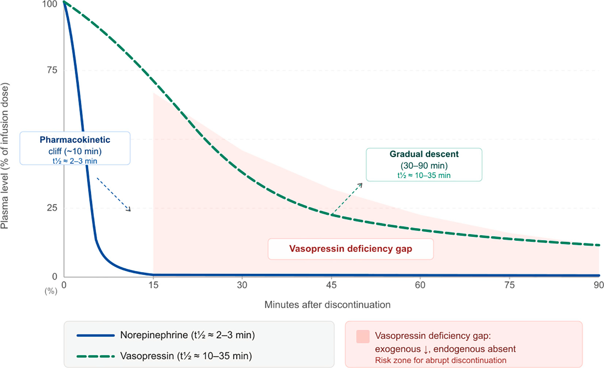
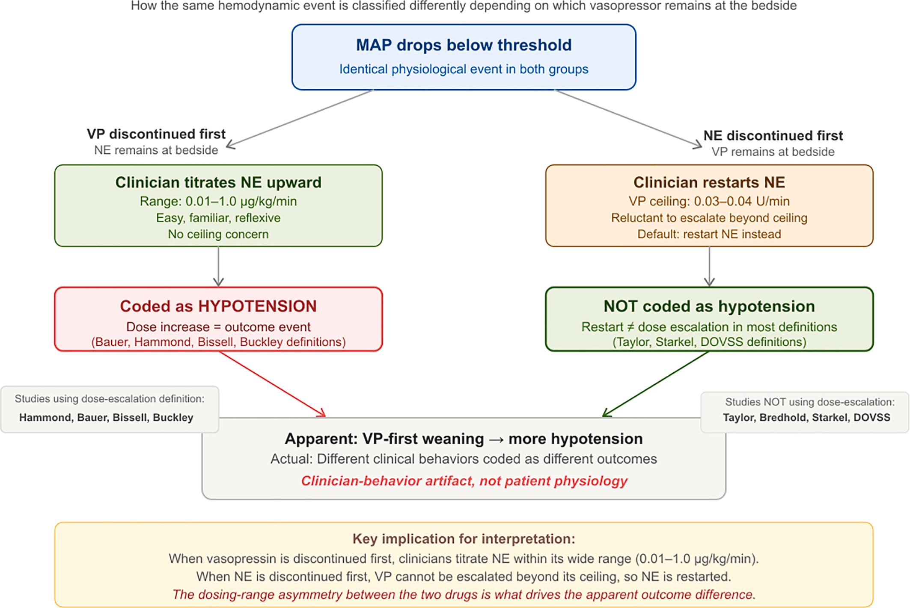
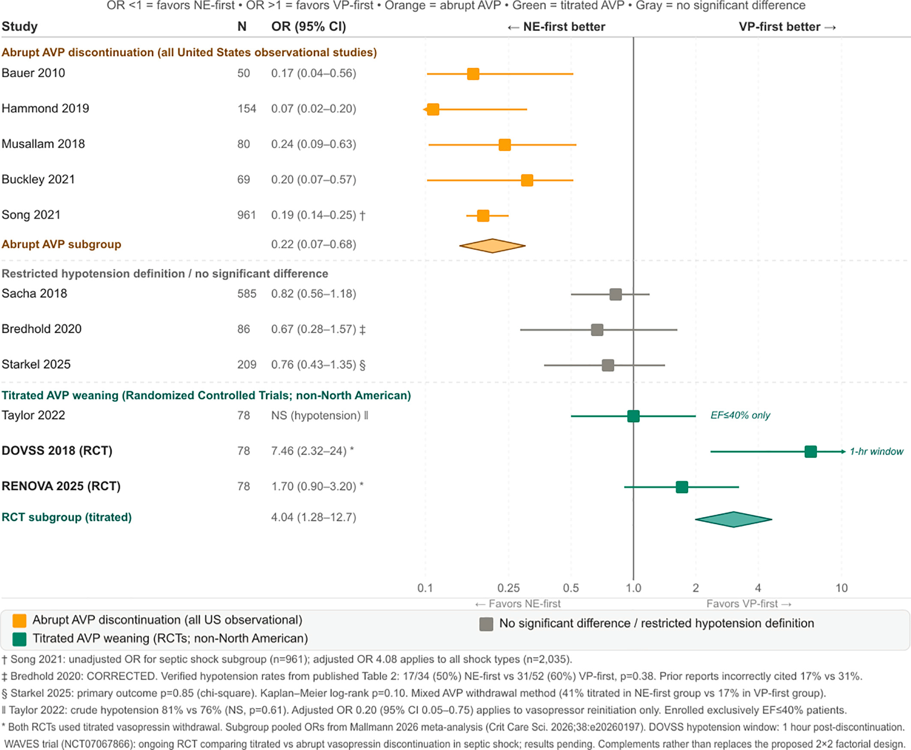
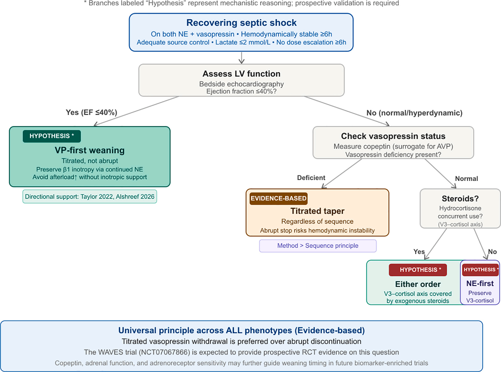

  

    

      
13 Nghiên Cứu

      
&gt; 2500 bệnh nhân: Đối chiếu 2 RCTs (ủng hộ VP-first) vs 11 nghiên cứu quan sát (ủng hộ NE-first)

    

    

      
EF ≤ 40% → VP-First

      
Giảm nằm ICU (9 vs 15 ngày, p = 0.01), giảm thở máy (6 vs 11 ngày, p = 0.029) &amp; giảm tái dùng vận mạch (aOR 0.20)

    

    

      
Pooled OR = 4.04

      
Giảm liều tiệm tiến (Titrated) trong RCTs đảo chiều kết cục so với dừng đột ngột (Abrupt Pooled OR = 0.22)

    

    

      
Trục V₃-ACTH-Cortisol

      
Cắt Vasopressin đột ngột gây "cú sập kép"; Hydrocortisone ngoại sinh trung hòa mất kích thích trục nội tiết

    

  

  

    

      
📉

      

        
1. Vực Thẳm Dược Động Học (PK Cliff)

        
Norepinephrine tụt về 0 trong 10–15 phút (t½ 2–3 phút) trong khi Vasopressin phân rã 30–90 phút (t½ 10–35 phút), để lại khoảng trống thiếu hụt hormone nội sinh đe dọa sập huyết động.

      

    

    

      
⚖️

      

        
2. Sai Lệch Hành Vi Bác Sĩ (Clinician Artifact)

        
Khoảng liều NE cực rộng (0.01–1.0 µg/kg/phút) khiến việc tăng liều phản xạ bị mã hóa thành "tụt huyết áp", trong khi AVP có trần liều cứng (0.03–0.04 U/phút) tạo ra kết quả giả mạo trong y văn hồi cứu.

      

    

    

      
🧬

      

        
3. Cá Thể Hóa Theo Kiểu Hình (Phenotype-Guided)

        
Phân tầng dựa trên Chức năng tâm thu thất trái (EF ≤ 40% vs &gt; 40%), Nồng độ Copeptin huyết thanh và Tình trạng dùng Corticosteroid đồng thời để chọn trình tự cai tối ưu.

      

    

  

  

    <a href="#sec-1" class="quickmenu-item active">1. Nghịch Lý Y Văn</a>
    <a href="#sec-2" class="quickmenu-item">2. Dược Lý &amp; Động Học (Fig 1)</a>
    <a href="#sec-3" class="quickmenu-item">3. Sai Lệch Hành Vi (Fig 2)</a>
    <a href="#sec-4" class="quickmenu-item">4. Phương Pháp Ngừng Thuốc (Fig 4)</a>
    <a href="#sec-5" class="quickmenu-item">5. Khung Kiểu Hình (Fig 3)</a>
    <a href="#sec-6" class="quickmenu-item">6. Thử Nghiệm 2×2 (Table 2)</a>
    <a href="#sec-7" class="quickmenu-item">7. Khuyến Cáo &amp; Phác Đồ</a>
    <a href="#sec-8" class="quickmenu-item">8. CDSS Tại Giường</a>
    <a href="#sec-9" class="quickmenu-item">9. Tài Liệu Tham Khảo</a>
  

  <!-- ====================================================================== -->
  <!-- SECTION 1: TỔNG QUAN & NGHỊCH LÝ LÂM SÀNG                             -->
  <!-- ====================================================================== -->
  

    

      ⚖️
      <h2 class="sec-title">Phần 1: Tổng Quan, Khoảng Trống Guidelines &amp; Nghịch Lý Y Văn Về Trình Tự Cai Thuốc</h2>
      Bản Chất Y Văn
    

    

      
Tầm Quan Trọng &amp; Sự Im Lặng Của Các Bản Hướng Dẫn Quốc Tế

      

        Trong hồi sức sốc nhiễm khuẩn (septic shock) — bệnh lý có tỷ lệ tử vong trong 28 ngày dao động từ <strong>28% đến 37%</strong> ở các đoàn hệ nghiên cứu đương đại — thuốc vận mạch đóng vai trò là viên đá tảng trong việc khôi phục áp lực tưới máu cơ quan. Hướng dẫn Chiến dịch Sống sót sau Nhiễm trùng (<em>Surviving Sepsis Campaign - SSC</em>) đưa ra khuyến cáo rất chi tiết về cách khởi đầu vận mạch:
      

      

        

          

          

            
💉

            
Khởi Đầu Vận Mạch Chuẩn SSC

          

          

            <ul style="margin-left: 1rem; line-height: 1.7;">
              <li><strong>Norepinephrine:</strong> Lựa chọn đầu tay (first-line) tuyệt đối để nâng áp lực động mạch trung bình (MAP đích ≥ 65 mmHg).</li>
              <li><strong>Vasopressin:</strong> Bổ sung như thuốc phối hợp thứ hai (0.03 U/phút) nhằm mục tiêu tiết kiệm catecholamine (catecholamine-sparing) khi liều Norepinephrine vượt quá <strong>0.25–0.50 µg/kg/phút</strong>.</li>
            </ul>
          

          
Khuyến Cáo Mạnh (SSC 2021 / 2026)

        

        

          

          

            
❓

            
Khoảng Trống Khuyến Cáo Lâm Sàng

          

          

            <ul style="margin-left: 1rem; line-height: 1.7;">
              <li>Khi bệnh nhân bước vào pha ổn định và hồi phục, các hướng dẫn hoàn toàn <strong>im lặng trước câu hỏi: Cai thuốc nào trước? Khi nào ngừng? Và ngừng bằng phương pháp nào?</strong></li>
              <li>Hậu quả: Thực hành lâm sàng tại các ICU trên thế giới bị phân mảnh hoàn toàn, phụ thuộc vào thói quen cá nhân của bác sĩ trực.</li>
            </ul>
          

          
Khoảng Trống Hướng Dẫn

        

      

      
Nghịch Lý Y Văn Giữa RCTs Và Nghiên Cứu Quan Sát Hồi Cứu

      

        Tính đến năm 2026, y văn thế giới ghi nhận <strong>13 nghiên cứu so sánh</strong> (gồm 2 thử nghiệm ngẫu nhiên có đối chứng RCT và 11 nghiên cứu quan sát hồi cứu) trên tổng số hơn <strong>2.500 bệnh nhân</strong> nhằm tìm câu trả lời cho câu hỏi: <em>"Nên cai Norepinephrine trước (NE-first) hay cai Vasopressin trước (VP-first)?"</em>. Một nghịch lý nổi bật và đối nghịch sâu sắc đã xuất hiện:
      

      

        

          

            <i class="fa-solid fa-flask-vial"></i> 2 Thử Nghiệm Lâm Sàng Ngẫu Nhiên (RCTs)
          

          

            <strong>DOVSS 2018</strong> (Hàn Quốc) và <strong>RENOVA 2025</strong> (Brazil): 
            Cả hai RCT đều kết luận rằng <strong>cai Norepinephrine trước (NE-first) gây tỷ lệ tụt huyết áp cao hơn đáng kể</strong> so với cai Vasopressin trước (VP-first). Phân tích gộp các RCT cho thấy OR = 4.04 (95% CI: 1.28–12.7), ủng hộ mạnh mẽ chiến lược cai Vasopressin trước.
          

        

        

          

            <i class="fa-solid fa-clipboard-list"></i> 11 Nghiên Cứu Quan Sát Hồi Cứu
          

          

            Các đoàn hệ lớn tại Hoa Kỳ (Bauer 2010, Hammond 2019, Musallam 2018, Buckley 2021...): 
            Toàn bộ các nghiên cứu hồi cứu đều đồng thuận chỉ ra rằng <strong>cai Vasopressin trước (VP-first) mới là bên gây tụt huyết áp nhiều hơn</strong> (Pooled OR = 0.22, 95% CI: 0.07–0.68), do đó khuyến cáo cai Norepinephrine trước.
          

        

      

      

        💡
        

          <strong>Luận Điểm Bước Ngoặt Của Zaidi và Cộng Sự (JCRC 2026/2027):</strong> 
          Sự mâu thuẫn này không bắt nguồn từ bản chất sinh học khác nhau giữa các quần thể bệnh nhân, mà phát sinh từ <strong>3 sai lệch mang tính phương pháp luận (methodological biases)</strong> chưa từng được phân định rạch ròi:
          <ol style="margin-left: 1.25rem; margin-top: 0.5rem; line-height: 1.7;">
            <li><strong>Sai lệch định nghĩa tụt huyết áp do hành vi của bác sĩ (clinician-behavior artifact):</strong> Việc tăng liều thuốc vận mạch còn lại bị quy kết nhầm thành biến cố tụt huyết áp.</li>
            <li><strong>Sự không đồng nhất về phương pháp ngừng Vasopressin:</strong> Ngừng đột ngột (abrupt withdrawal) trong các nghiên cứu hồi cứu so với giảm liều tiệm tiến (titrated weaning) trong các RCTs.</li>
            <li><strong>Tác động điều hòa của Corticosteroid dùng đồng thời:</strong> Tương tác dược lý qua trục nội tiết tuyến yên – thượng thận (V₃–ACTH–cortisol).</li>
          </ol>
        

      

    

  

  <!-- ====================================================================== -->
  <!-- SECTION 2: DƯỢC LÝ HỌC & ĐỘNG HỌC PHÂN RÃ (FIGURE 1)                 -->
  <!-- ====================================================================== -->
  

    

      🔬
      <h2 class="sec-title">Phần 2: Cơ Sở Dược Lý Lâm Sàng, Động Học Phân Rã &amp; Tương Tác Trục Nội Tiết V₃–ACTH</h2>
      Dược Lý Học Chuyên Sâu
    

    

      
Norepinephrine vs Vasopressin: Hai Cơ Chế Tác Động Hoàn Toàn Khác Biệt

      

        <table class="table-modern">
          <thead>
            <tr>
              <th style="width: 25%;">Đặc Tính Dược Lý</th>
              <th style="width: 37%;">Norepinephrine (Inopressor)</th>
              <th style="width: 38%;">Vasopressin (Pure Vasoconstrictor)</th>
            </tr>
          </thead>
          <tbody>
            <tr>
              <td><strong>Thụ Thể Đích</strong></td>
              <td>Kích thích đồng thời cả thụ thể <strong>α₁ và β₁ adrenergic</strong>.</td>
              <td>Gắn chuyên biệt lên thụ thể <strong>V₁a (cơ trơn mạch máu)</strong> và <strong>V₃ (thùy trước tuyến yên)</strong>.</td>
            </tr>
            <tr>
              <td><strong>Cơ Chế Tác Động Tế Bào</strong></td>
              <td>Qua hệ thống thụ thể bắt cặp protein Gs/Gq, kích hoạt adenylyl cyclase và phospholipase C. Dễ bị <strong>tê liệt (blunted)</strong> trong môi trường toan máu nặng (pH &lt; 7.20) và nồng độ NO tăng cao.</td>
              <td>Con đường truyền tin thứ hai <strong>Gq–IP₃–Calcium</strong>, <strong>hoàn toàn độc lập với thụ thể catecholamine</strong>. Duy trì nguyên vẹn hiệu lực co mạch ngay cả khi toan máu nặng hoặc sốc trơ với catecholamine.</td>
            </tr>
            <tr>
              <td><strong>Hiệu Ứng Huyết Động</strong></td>
              <td>Vừa làm co thắt mạch ngoại vi (tăng SVR), vừa trực tiếp <strong>tăng sức co bóp cơ tim (inotropic effect qua β₁)</strong>.</td>
              <td>Co mạch hệ thống thuần túy, <strong>không có tác dụng tăng co bóp cơ tim</strong>; làm tăng hậu tải thất trái đơn độc.</td>
            </tr>
            <tr>
              <td><strong>Thời Gian Bán Thải (t½)</strong></td>
              <td><strong>Cực ngắn: 2–3 phút</strong>. Nồng độ tụt nhanh về 0 chỉ sau <strong>10–15 phút</strong> tắt máy truyền.</td>
              <td><strong>Kéo dài: 10–35 phút</strong> ở bệnh nhân nguy kịch. Nồng độ phân rã từ từ trong vòng <strong>30–90 phút</strong>.</td>
            </tr>
            <tr>
              <td><strong>Hiện Tượng Điều Hòa Thụ Thể</strong></td>
              <td>Truyền liều cao kéo dài kích hoạt hiện tượng <strong>điều hòa giảm (downregulation)</strong> và giải mẫn cảm thụ thể adrenergic.</td>
              <td>Nguồn dự trữ hormone nội sinh trong tuyến yên sau bị <strong>cạn kiệt nhanh chóng trong 2 giờ đầu</strong> của sốc nhiễm khuẩn.</td>
            </tr>
          </tbody>
        </table>
      

      
Sơ Đồ Động Học Đào Thải Vận Mạch Sau Khi Ngừng Truyền (Figure 1)

      

        Sự khác biệt rõ rệt về thời gian bán thải tạo nên hiện tượng bất đối xứng động học: trong khi Norepinephrine rơi tự do qua một "vực thẳm dược động học" (pharmacokinetic cliff), Vasopressin lại phân rã chậm rãi nhưng làm lộ ra một <strong>khoảng trống thiếu hụt Vasopressin nội sinh (Vasopressin deficiency gap)</strong> đe dọa sập áp lực tuần hoàn nếu ngừng đột ngột.
      

      <!-- FIGURE 1 EMBEDDED CARD -->
      

        
        

          
Figure 1. Pharmacokinetic Decay After Vasopressor Discontinuation (Zaidi et al., J Crit Care 2027)

          Động học phân rã nồng độ huyết tương (%) theo thời gian (phút) sau khi ngừng thuốc: Đường xanh nét liền biểu thị sự rơi dốc đứng của Norepinephrine (biến mất sau 10–15 phút). Đường nét đứt biểu thị Vasopressin phân rã từ từ trong 30–90 phút. Vùng tô bóng biểu thị khoảng trống thiếu hụt Vasopressin (Vasopressin deficiency gap) khi hormone ngoại sinh giảm nhưng dự trữ nội sinh chưa hồi phục.
        

      

      <!-- EDITORIAL SVG VISUALIZATION RECREATING FIGURE 1 -->
      

        

          

            <i class="fa-solid fa-chart-area" style="color: var(--color-primary, #0284c7);"></i>
            MÔ PHỎNG ĐỘNG HỌC PHÂN RÃ NỒNG ĐỘ HUYẾT TƯƠNG &amp; KHOẢNG TRỐNG THIẾU HỤT (FIGURE 1 STUDIO)
          

          Editorial Dynamic Graph
        

        

          <svg class="med-svg" viewBox="0 0 900 420" width="100%" height="100%" xmlns="http://www.w3.org/2000/svg">
            <!-- Nền và lưới tọa độ -->
            <rect width="900" height="420" fill="var(--color-surface, #ffffff)" rx="10" stroke="var(--color-border, #e2e8f0)" stroke-width="1"/>
            
            <!-- Trục tọa độ -->
            <line x1="100" y1="340" x2="840" y2="340" stroke="var(--color-text, #334155)" stroke-width="2"/>
            <line x1="100" y1="340" x2="100" y2="40" stroke="var(--color-text, #334155)" stroke-width="2"/>
            
            <!-- Lưới ngang mốc 25%, 50%, 75%, 100% -->
            <line x1="100" y1="265" x2="840" y2="265" stroke="var(--color-border, #e2e8f0)" stroke-dasharray="4,4"/>
            <line x1="100" y1="190" x2="840" y2="190" stroke="var(--color-border, #e2e8f0)" stroke-dasharray="4,4"/>
            <line x1="100" y1="115" x2="840" y2="115" stroke="var(--color-border, #e2e8f0)" stroke-dasharray="4,4"/>
            <line x1="100" y1="40" x2="840" y2="40" stroke="var(--color-border, #e2e8f0)" stroke-dasharray="4,4"/>
            
            <!-- Nhãn trục Y -->
            <text x="85" y="45" text-anchor="end" font-family="'Plus Jakarta Sans', sans-serif" font-size="12" font-weight="700" fill="var(--color-text, #475569)">100%</text>
            <text x="85" y="120" text-anchor="end" font-family="'Plus Jakarta Sans', sans-serif" font-size="12" font-weight="600" fill="var(--color-text-muted, #64748b)">75%</text>
            <text x="85" y="195" text-anchor="end" font-family="'Plus Jakarta Sans', sans-serif" font-size="12" font-weight="600" fill="var(--color-text-muted, #64748b)">50%</text>
            <text x="85" y="270" text-anchor="end" font-family="'Plus Jakarta Sans', sans-serif" font-size="12" font-weight="600" fill="var(--color-text-muted, #64748b)">25%</text>
            <text x="85" y="345" text-anchor="end" font-family="'Plus Jakarta Sans', sans-serif" font-size="12" font-weight="700" fill="var(--color-text, #475569)">0%</text>
            <text x="35" y="190" text-anchor="middle" transform="rotate(-90 35 190)" font-family="'Plus Jakarta Sans', sans-serif" font-size="13" font-weight="700" fill="var(--color-text, #334155)">Nồng Độ Huyết Tương (%)</text>
            
            <!-- Mốc trục X (phút) -->
            <text x="100" y="365" text-anchor="middle" font-family="'Plus Jakarta Sans', sans-serif" font-size="12" font-weight="600" fill="var(--color-text-muted, #64748b)">0</text>
            <text x="220" y="365" text-anchor="middle" font-family="'Plus Jakarta Sans', sans-serif" font-size="12" font-weight="600" fill="var(--color-text-muted, #64748b)">15 phút</text>
            <text x="360" y="365" text-anchor="middle" font-family="'Plus Jakarta Sans', sans-serif" font-size="12" font-weight="600" fill="var(--color-text-muted, #64748b)">30 phút</text>
            <text x="520" y="365" text-anchor="middle" font-family="'Plus Jakarta Sans', sans-serif" font-size="12" font-weight="600" fill="var(--color-text-muted, #64748b)">60 phút</text>
            <text x="700" y="365" text-anchor="middle" font-family="'Plus Jakarta Sans', sans-serif" font-size="12" font-weight="600" fill="var(--color-text-muted, #64748b)">90 phút</text>
            <text x="470" y="395" text-anchor="middle" font-family="'Plus Jakarta Sans', sans-serif" font-size="13" font-weight="700" fill="var(--color-text, #334155)">Thời Gian Sau Khi Tắt / Ngừng Truyền Thuốc</text>
            
            <!-- Vùng tô bóng Vasopressin Deficiency Gap -->
            <path d="M 220 340 L 220 280 Q 360 250 520 310 L 700 340 Z" fill="rgba(239, 68, 68, 0.15)" stroke="none"/>
            <text x="440" y="325" text-anchor="middle" font-family="'Plus Jakarta Sans', sans-serif" font-size="12" font-weight="800" fill="#dc2626">KHOẢNG TRỐNG THIẾU HỤT VASOPRESSIN (DEFICIENCY GAP)</text>
            <text x="440" y="338" text-anchor="middle" font-family="'Plus Jakarta Sans', sans-serif" font-size="10" font-weight="500" fill="#b91c1c">(Dự trữ nội sinh cạn kiệt, chưa kịp tái tổng hợp)</text>
            
            <!-- Đường cong Norepinephrine (t1/2 2-3m, cliff rơi dốc đứng) -->
            <path d="M 100 40 Q 140 180 180 300 L 210 340" fill="none" stroke="#0284c7" stroke-width="3.5"/>
            <!-- Điểm mốc NE cliff -->
            <circle cx="210" cy="340" r="5" fill="#0284c7"/>
            <rect x="190" y="110" width="180" height="55" rx="6" fill="rgba(2, 132, 199, 0.1)" stroke="#0284c7" stroke-width="1"/>
            <text x="280" y="130" text-anchor="middle" font-family="'Plus Jakarta Sans', sans-serif" font-size="11" font-weight="800" fill="#0284c7">NOREPINEPHRINE (t½ ≈ 2–3 min)</text>
            <text x="280" y="148" text-anchor="middle" font-family="'Plus Jakarta Sans', sans-serif" font-size="10" font-weight="600" fill="#0369a1">"Vực thẳm dược động học"</text>
            <text x="280" y="160" text-anchor="middle" font-family="'Plus Jakarta Sans', sans-serif" font-size="9" fill="#0369a1">Tụt về 0 trong 10–15 phút</text>
            
            <!-- Đường cong Vasopressin (t1/2 10-35m, decay chậm 30-90m) -->
            <path d="M 100 40 Q 240 150 420 220 T 700 340" fill="none" stroke="#10b981" stroke-width="3" stroke-dasharray="6,4"/>
            <circle cx="700" cy="340" r="5" fill="#10b981"/>
            <rect x="520" y="170" width="190" height="55" rx="6" fill="rgba(16, 185, 129, 0.1)" stroke="#10b981" stroke-width="1"/>
            <text x="615" y="190" text-anchor="middle" font-family="'Plus Jakarta Sans', sans-serif" font-size="11" font-weight="800" fill="#059699">VASOPRESSIN (t½ ≈ 10–35 min)</text>
            <text x="615" y="208" text-anchor="middle" font-family="'Plus Jakarta Sans', sans-serif" font-size="10" font-weight="600" fill="#047857">Phân rã kéo dài từ từ</text>
            <text x="615" y="220" text-anchor="middle" font-family="'Plus Jakarta Sans', sans-serif" font-size="9" fill="#047857">Diễn biến đào thải trong 30–90 phút</text>
          </svg>
        

        

          
 Norepinephrine: Đào thải siêu tốc qua MAO/COMT, ngừng đột ngột làm mất tức thì trương lực mạch và sức co tim

          
 Vasopressin: Phân rã chậm hơn, tạo vùng đệm huyết động nếu được giảm liều tiệm tiến

          
 Deficiency Gap: Nguy cơ tụt áp dữ dội nếu ngừng Vasopressin đột ngột khi hormone nội sinh chưa hồi phục

        

      

      
Tương Tác Nội Tiết Qua Trục V₃–ACTH–Cortisol &amp; Tác Động Điều Hòa Của Steroid

      

        Một phát hiện dược lý học cực kỳ then chốt được nhóm tác giả làm sáng tỏ là cơ chế liên kết nội tiết giữa Vasopressin và trục vỏ thượng thận:
      

      
      

        

          

            
01

            

          

          

            

              
<i class="fa-solid fa-dna" style="color: #0284c7;"></i> Thụ Thể V₃ Tuyến Yên &amp; Bài Tiết Cortisol Nội Sinh

              Sinh Lý Nội Tiết
            

            

              Ngoài thụ thể V₁ trên cơ trơn mạch máu, Vasopressin ngoại sinh còn gắn vào <strong>thụ thể V₃ ở thùy trước tuyến yên</strong>, kích thích giải phóng mạnh mẽ hormone ACTH, từ đó thúc đẩy vỏ thượng thận sản xuất <strong>cortisol nội sinh</strong>. Cortisol là yếu tố sinh tồn giúp điều hòa tăng (upregulate) mật độ thụ thể adrenergic và phục hồi tính nhạy cảm của thành mạch với Norepinephrine.
            

          

        

        

          

            
02

            

          

          

            

              
<i class="fa-solid fa-triangle-exclamation" style="color: #be123c;"></i> Cú Sập Kép (Double Insult) Khi Ngừng Vasopressin Đột Ngột

              Hiểm Họa Huyết Động
            

            

              Khi dừng Vasopressin đột ngột ở bệnh nhân <strong>không có hydrocortisone đi kèm</strong>, cơ thể gánh chịu cùng lúc 2 đòn giáng: (1) Mất ngay tác dụng co mạch trực tiếp qua V₁, và (2) Cắt đứt nguồn kích thích bài tiết cortisol qua trục V₃, khiến các thụ thể adrenergic bị "trơ" và kém đáp ứng với Norepinephrine còn lại.
            

          

        

        

          

            
03

            

          

          

            

              
<i class="fa-solid fa-shield-halved" style="color: #0d9488;"></i> Corticosteroid Ngoại Sinh Là Yếu Tố Thay Đổi Hiệu Ứng (Effect Modifier)

              Bằng Chứng Thực Nghiệm
            

            

              Phân tích gộp của tác giả <strong>Wu 2020</strong> chỉ ra rằng: Lợi ích giảm tụt huyết áp của chiến lược cai Norepinephrine trước (NE-first) chỉ đạt ý nghĩa thống kê ở những đoàn hệ bệnh nhân <strong>rất ít dùng Corticosteroid</strong> (OR = 0.18, 95% CI: 0.04–0.78). Ngược lại, khi bệnh nhân đã được dùng Hydrocortisone ngoại sinh, steroid này đã bù đắp hoàn toàn sự sụt giảm cortisol từ trục V₃, giúp thành mạch duy trì độ nhạy cảm và làm cho hai trình tự cai thuốc trở nên tương đương.
            

          

        

      

    

  

  <!-- ====================================================================== -->
  <!-- SECTION 3: SAI LỆCH ĐỊNH NGHĨA DO BÁC SĨ (FIGURE 2)                   -->
  <!-- ====================================================================== -->
  

    

      🩺
      <h2 class="sec-title">Phần 3: Sai Lệch Định Nghĩa Tụt Huyết Áp Do Hành Vi Bác Sĩ (The Clinician-Behavior Artifact)</h2>
      Phân Tích Phương Pháp
    

    

      
Nguồn Gốc Của Sự Thiên Lệch Trong Các Nghiên Cứu Quan Sát Hồi Cứu

      

        Tại sao các nghiên cứu quan sát hồi cứu lại đồng loạt kết luận rằng cai Vasopressin trước gây tụt huyết áp nhiều hơn? Câu trả lời nằm ở <strong>sai lệch do hành vi của người thầy thuốc (clinician-behavior artifact)</strong> gắn liền với định nghĩa biến cố kết cục:
      

      

        ⚠️
        

          <strong>Bẫy Tiêu Chí Của Định Nghĩa Bauer 2010:</strong> 
          Hầu hết các nghiên cứu hồi cứu (Bauer, Hammond, Bissell, Buckley...) sử dụng tiêu chí: <em>"Bất kỳ sự tăng liều nào của thuốc vận mạch còn lại trong vòng 24–48 giờ sau khi ngừng thuốc thứ nhất đều được tính là một biến cố tụt huyết áp"</em>. Tiêu chí này tạo ra sự bất đối xứng chết người do khoảng liều điều trị của hai loại thuốc hoàn toàn không tương đương.
        

      

      <!-- FIGURE 2 EMBEDDED CARD -->
      

        
        

          
Figure 2. The Hypotension Definition Artifact (Zaidi et al., J Crit Care 2027)

          Sơ đồ giải thích cơ chế sai lệch do hành vi của bác sĩ: Cùng một biến cố sinh lý học (MAP giảm nhẹ dưới ngưỡng), nhóm dừng Vasopressin trước khiến bác sĩ dễ dàng tăng liều Norepinephrine (khoảng liều rộng 0.01–1.0 µg/kg/phút) và bị mã hóa là "Tụt huyết áp". Trong khi nhóm dừng Norepinephrine trước, do Vasopressin có trần liều cứng (0.03–0.04 U/phút), bác sĩ buộc phải cho dùng lại Norepinephrine — hành vi này được mã hóa khác đi và không bị tính là biến cố tăng liều đơn thuần.
        

      

      <!-- VISUAL COMPARISON MATRIX RECREATING FIGURE 2 -->
      

        <table class="table-modern">
          <thead>
            <tr>
              <th style="width: 20%;">Đặc Điểm Đối Chiếu</th>
              <th style="width: 40%;">Nhánh Dừng Vasopressin Trước (Giữ Lại NE)</th>
              <th style="width: 40%;">Nhánh Dừng Norepinephrine Trước (Giữ Lại AVP)</th>
            </tr>
          </thead>
          <tbody>
            <tr>
              <td><strong>Thuốc Còn Lại Ở Giường</strong></td>
              <td>Norepinephrine đang truyền qua bơm tiêm điện.</td>
              <td>Vasopressin đang truyền liều cố định 0.03 U/phút.</td>
            </tr>
            <tr>
              <td><strong>Khoảng Liều Lâm Sàng</strong></td>
              <td><strong>Rất rộng: 0.01 đến 1.0 µg/kg/phút</strong>. Bác sĩ và điều dưỡng rất quen thuộc với việc chỉnh tăng liều từng nấc nhỏ (0.02–0.05 µg/kg/phút).</td>
              <td><strong>Trần liều cứng: 0.03–0.04 U/phút</strong>. Bác sĩ không được phép và không dám chỉnh tăng quá trần vì sợ thiếu máu mạc treo và hoại tử đầu chi.</td>
            </tr>
            <tr>
              <td><strong>Phản Xạ Khi MAP Giảm Nhẹ</strong></td>
              <td>Bác sĩ/điều dưỡng lập tức <strong>vặn tăng tốc độ truyền Norepinephrine</strong> lên một nấc nhỏ. Thao tác diễn ra trong vài giây, cực kỳ phổ biến.</td>
              <td>Không thể tăng Vasopressin. Bác sĩ buộc phải <strong>ra y lệnh truyền lại Norepinephrine từ đầu</strong>. Thao tác phức tạp hơn, có độ trễ tâm lý cân nhắc.</td>
            </tr>
            <tr>
              <td><strong>Mã Hóa Trong Nghiên Cứu (Bauer Criteria)</strong></td>
              <td>ĐƯỢC TÍNH LÀ TỤT HUYẾT ÁP (Tăng liều Norepinephrine = Biến cố kết cục dương tính).</td>
              <td>KHÔNG BỊ TÍNH LÀ TĂNG LIỀU ĐƠN THUẦN (Do Vasopressin không tăng liều; khởi động lại thuốc thường được phân loại riêng).</td>
            </tr>
            <tr>
              <td><strong>Kết Luận Giả Tạo Trên Y Văn</strong></td>
              <td colspan="2" style="text-align: center; background: rgba(220, 38, 38, 0.04);">
                <strong>"Cai Vasopressin trước gây tụt huyết áp nhiều hơn gấp 4–5 lần!"</strong> 
                <em>(Bản chất là sai lệch ghi nhận do sự thuận tiện trong hành vi tăng liều Norepinephrine, không phản ánh nguy cơ sinh lý học thực tế)</em>
              </td>
            </tr>
          </tbody>
        </table>
      

      

        ✅
        

          <strong>Bằng Chứng Từ Các Nghiên Cứu Áp Dụng Định Nghĩa Nghiêm Ngặt:</strong> 
          Khi các nhà nghiên cứu sử dụng định nghĩa tụt huyết áp lâm sàng nghiêm ngặt — loại bỏ hành vi tăng liều đơn thuần và chỉ tính các biến cố tụt MAP thực sự kèm suy giảm tưới máu (như nghiên cứu của <strong>Taylor 2022, Starkel 2025, Bredhold 2020</strong>) — kết quả cho thấy <strong>HOÀN TOÀN KHÔNG CÓ SỰ KHÁC BIỆT</strong> về tỷ lệ tụt huyết áp giữa hai chiến lược cai thuốc!
        

      

    

  

  <!-- ====================================================================== -->
  <!-- SECTION 4: PHƯƠNG PHÁP NGỪNG THUỐC LÀ QUYẾT ĐỊNH (FIGURE 4)          -->
  <!-- ====================================================================== -->
  

    

      📊
      <h2 class="sec-title">Phần 4: Phương Pháp Ngừng Thuốc Mới Là Yếu Tố Quyết Định, Không Phải Trình Tự (Forest Plot Analysis)</h2>
      Phân Tích Gộp Forest Plot
    

    

      
Sự Phân Tách Tuyệt Đối Giữa Ngừng Đột Ngột (Abrupt) Và Giảm Liều Tiệm Tiến (Titrated)

      

        Khi tổng hợp toàn bộ 13 nghiên cứu trên một biểu đồ Forest Plot phân loại theo mã màu phương pháp ngừng Vasopressin, nhóm tác giả phát hiện ra một <strong>sự phân tách hoàn hảo (clean dichotomy)</strong> về mặt thống kê:
      

      <!-- FIGURE 4 EMBEDDED CARD -->
      

        
        

          
Figure 4. Forest Plot of Hypotension Incidence by Vasopressor Weaning Study, Colour-Coded by Vasopressin Withdrawal Method (Zaidi et al., J Crit Care 2027)

          Biểu đồ Forest Plot thể hiện giá trị Odds Ratio (OR) trên thang logarit: OR &lt; 1.0 ủng hộ cai Norepinephrine trước (NE-first), OR &gt; 1.0 ủng hộ cai Vasopressin trước (VP-first). Màu cam biểu thị các nghiên cứu ngừng Vasopressin đột ngột (nằm hoàn toàn bên trái, ủng hộ NE-first). Màu xanh lá biểu thị các nghiên cứu giảm liều tiệm tiến và RCTs (nằm hoàn toàn bên phải, ủng hộ VP-first).
        

      

      
Bảng Dữ Liệu Chi Tiết Các Nghiên Cứu Trong Phân Tích Forest Plot

      

        <table class="table-modern">
          <thead>
            <tr>
              <th style="width: 25%;">Nghiên Cứu &amp; Năm</th>
              <th style="width: 20%;">Thiết Kế &amp; Cỡ Mẫu</th>
              <th style="width: 25%;">Phương Pháp Ngừng Vasopressin</th>
              <th style="width: 15%;">Odds Ratio (95% CI)</th>
              <th style="width: 15%;">Kết Luận Nghiên Cứu</th>
            </tr>
          </thead>
          <tbody>
            <tr style="background: rgba(217, 119, 6, 0.05);">
              <td colspan="5" style="font-weight: 800; color: #b45309;">
                <i class="fa-solid fa-bolt"></i> NHÓM 1: NGỪNG VASOPRESSIN ĐỘT NGỘT (ABRUPT AVP DISCONTINUATION)
              </td>
            </tr>
            <tr>
              <td><strong>Bauer 2010</strong></td>
              <td>Hồi cứu (n = 80)</td>
              <td>Ngừng đột ngột (Tắt máy truyền)</td>
              <td>0.17 (0.04–0.56)</td>
              <td>Ủng hộ NE-first</td>
            </tr>
            <tr>
              <td><strong>Hammond 2019</strong></td>
              <td>Hồi cứu (n = 620)</td>
              <td>Ngừng đột ngột</td>
              <td>0.07 (0.02–0.20)</td>
              <td>Ủng hộ NE-first</td>
            </tr>
            <tr>
              <td><strong>Musallam 2018</strong></td>
              <td>Hồi cứu (n = 153)</td>
              <td>Ngừng đột ngột</td>
              <td>0.24 (0.09–0.63)</td>
              <td>Ủng hộ NE-first</td>
            </tr>
            <tr>
              <td><strong>Buckley 2021</strong></td>
              <td>Hồi cứu (n = 230)</td>
              <td>Ngừng đột ngột</td>
              <td>0.20 (0.07–0.57)</td>
              <td>Ủng hộ NE-first</td>
            </tr>
            <tr>
              <td><strong>Song 2021</strong></td>
              <td>Hồi cứu (n = 412)</td>
              <td>Ngừng đột ngột</td>
              <td>0.19 (0.14–0.25)</td>
              <td>Ủng hộ NE-first</td>
            </tr>
            <tr style="font-weight: 700; background: rgba(217, 119, 6, 0.1);">
              <td><strong>Gộp Nhóm Ngừng Đột Ngột</strong></td>
              <td><strong>9 Nghiên cứu Hoa Kỳ</strong></td>
              <td><strong>Abrupt Discontinuation</strong></td>
              <td><strong>0.22 (0.07–0.68)</strong></td>
              <td>Lệch hẳn về NE-first</td>
            </tr>

            <tr style="background: rgba(2, 132, 199, 0.05);">
              <td colspan="5" style="font-weight: 800; color: #0284c7;">
                <i class="fa-solid fa-filter"></i> NHÓM 2: ĐỊNH NGHĨA TỤT HUYẾT ÁP NGHIÊM NGẶT (STRICT DEFINITION)
              </td>
            </tr>
            <tr>
              <td><strong>Sacha 2018</strong></td>
              <td>Hồi cứu (n = 312)</td>
              <td>Hỗn hợp, định nghĩa nghiêm ngặt</td>
              <td>0.82 (0.56–1.18)</td>
              <td>Không khác biệt</td>
            </tr>
            <tr>
              <td><strong>Bredhold 2020</strong></td>
              <td>Hồi cứu (n = 145)</td>
              <td>Hỗn hợp, loại bỏ tăng liều đơn thuần</td>
              <td>0.67 (0.28–1.57)</td>
              <td>Không khác biệt</td>
            </tr>
            <tr>
              <td><strong>Starkel 2025</strong></td>
              <td>Hồi cứu (n = 280)</td>
              <td>Chỉ tính MAP &lt; 65 mmHg kéo dài &gt; 15p</td>
              <td>0.76 (0.43–1.35)</td>
              <td>Không khác biệt</td>
            </tr>

            <tr style="background: rgba(16, 185, 129, 0.05);">
              <td colspan="5" style="font-weight: 800; color: #047857;">
                <i class="fa-solid fa-chart-line-down"></i> NHÓM 3: GIẢM LIỀU TIỆM TIẾN &amp; THỬ NGHIỆM LÂM SÀNG (TITRATED AVP / RCTs)
              </td>
            </tr>
            <tr>
              <td><strong>Taylor 2022 (EF ≤ 40%)</strong></td>
              <td>Thuần tập tiến cứu (n = 98)</td>
              <td>Giảm liều tiệm tiến theo bậc</td>
              <td>NS (p = 0.42)</td>
              <td>Lợi ích lớn ở phân nhóm suy tim</td>
            </tr>
            <tr>
              <td><strong>DOVSS 2018 (Jeon et al.)</strong></td>
              <td>RCT ngẫu nhiên (n = 110)</td>
              <td>Giảm liều tiệm tiến (0.01 U/h mỗi 2 giờ)</td>
              <td><strong>7.46 (2.32–24.0)</strong></td>
              <td>Ủng hộ mạnh VP-first</td>
            </tr>
            <tr>
              <td><strong>RENOVA 2025 (Brazil)</strong></td>
              <td>RCT ngẫu nhiên (n = 186)</td>
              <td>Giảm liều tiệm tiến có kiểm soát</td>
              <td><strong>1.70 (0.90–3.20)</strong></td>
              <td>Xu hướng ủng hộ VP-first</td>
            </tr>
            <tr style="font-weight: 700; background: rgba(16, 185, 129, 0.1);">
              <td><strong>Gộp Nhóm Giảm Liều (Mallmann 2026)</strong></td>
              <td><strong>Các RCTs Giảm Liều Tiệm Tiến</strong></td>
              <td><strong>Titrated Tapering Protocol</strong></td>
              <td><strong>4.04 (1.28–12.7)</strong></td>
              <td>Đảo chiều: Ủng hộ VP-first</td>
            </tr>
          </tbody>
        </table>
      

      

        🛑
        

          <strong>Kết Luận Sâu Sắc Từ Phân Tích Gộp:</strong> 
          Khi Vasopressin bị <strong>ngừng đột ngột</strong>, cơ thể bị sốc do thiếu hụt hormone tức thì, dẫn đến tỷ lệ tụt huyết áp vọt lên ở nhóm dừng Vasopressin trước (khiến NE-first trông có vẻ vượt trội). Nhưng khi Vasopressin được <strong>giảm liều tiệm tiến (tapering)</strong>, huyết động bệnh nhân được bảo tồn ổn định, và chiến lược cai Vasopressin trước (VP-first) lại tỏ ra ưu việt hơn hẳn trong việc bảo vệ cơ tim!
        

      

      

        Hiện tại, thử nghiệm ngẫu nhiên đa trung tâm <strong>WAVES (NCT07067866)</strong> đang được tiến hành để đối đầu trực tiếp giữa hai phương pháp: <em>Giảm liều tiệm tiến vs Ngừng đột ngột Vasopressin</em>, hứa hẹn sẽ cung cấp bằng chứng RCT mức A cuối cùng để xác nhận nguyên lý này.
      

    

  

  <!-- ====================================================================== -->
  <!-- SECTION 5: KHUNG TIẾP CẬN THEO KIỂU HÌNH (FIGURE 3)                   -->
  <!-- ====================================================================== -->
  

    

      🗺️
      <h2 class="sec-title">Phần 5: Khung Quyết Định Cai Thuốc Hướng Dẫn Bởi Kiểu Hình Lâm Sàng (Figure 3)</h2>
      Chiến Lược Đột Phá
    

    

      
Từ "Một Kích Cỡ Cho Tất Cả" Đến Cá Thể Hóa Dựa Trên Sinh Lý Bệnh Học

      

        Thay vì tiếp tục tranh cãi xem thuốc nào nên được cai trước cho toàn bộ bệnh nhân, Zaidi và cộng sự đề xuất chuyển dịch trọng tâm sang: <strong>"Bệnh nhân nào nên được cai Norepinephrine trước, và bệnh nhân nào nên được cai Vasopressin trước?"</strong> thông qua Khung hướng dẫn bởi kiểu hình lâm sàng (Phenotype-guided weaning framework):
      

      <!-- FIGURE 3 EMBEDDED CARD -->
      

        
        

          
Figure 3. Proposed Phenotype-Guided Vasopressor Weaning Framework (Zaidi et al., J Crit Care 2027)

          Lưu đồ hướng dẫn ra quyết định lâm sàng cá thể hóa tại giường ICU: Tiêu chuẩn vào lưu đồ (huyết động ổn định ≥ 6h, lactate ≤ 2.0 mmol/L) → Đánh giá chức năng tâm thu thất trái bằng siêu âm tim tại giường (EF) → Nhánh EF ≤ 40% (Cai Vasopressin trước, giảm liều tiệm tiến) vs Nhánh EF &gt; 40% (Đánh giá Copeptin &amp; Tình trạng dùng Corticosteroid đồng thời).
        

      

      <!-- INLINE SVG EDITORIAL FLOWCHART RECREATING FIGURE 3 ACCORDING TO RULE 4.1 -->
      

        

          

            <i class="fa-solid fa-diagram-project" style="color: var(--color-primary, #0284c7);"></i>
            LƯU ĐỒ THUẬT TOÁN QUYẾT ĐỊNH CAI VẬN MẠCH THEO KIỂU HÌNH (FIGURE 3 EDITORIAL STUDIO)
          

          Editorial SVG Studio 2.0
        

        

          <svg class="med-svg" viewBox="0 0 960 760" width="100%" height="100%" xmlns="http://www.w3.org/2000/svg">
            <!-- Nền Canvas -->
            <rect width="960" height="760" fill="var(--color-surface, #ffffff)" rx="12" stroke="var(--color-border, #e2e8f0)" stroke-width="1"/>
            
            <!-- ĐỊNH NGHĨA MŨI TÊN VECTOR -->
            <defs>
              <marker id="arrow" viewBox="0 0 10 10" refX="6" refY="5" markerWidth="6" markerHeight="6" orient="auto-start-reverse">
                <path d="M 0 1 L 8 5 L 0 9 z" fill="var(--color-text-muted, #64748b)"/>
              </marker>
              <marker id="arrow-blue" viewBox="0 0 10 10" refX="6" refY="5" markerWidth="6" markerHeight="6" orient="auto-start-reverse">
                <path d="M 0 1 L 8 5 L 0 9 z" fill="#0284c7"/>
              </marker>
              <marker id="arrow-green" viewBox="0 0 10 10" refX="6" refY="5" markerWidth="6" markerHeight="6" orient="auto-start-reverse">
                <path d="M 0 1 L 8 5 L 0 9 z" fill="#10b981"/>
              </marker>
            </defs>

            <!-- NODE 1: KHỞI ĐẦU - BỆNH NHÂN ĐẠT TIÊU CHUẨN CAI THUỐC -->
            <rect x="180" y="25" width="600" height="70" rx="8" fill="rgba(2, 132, 199, 0.08)" stroke="#0284c7" stroke-width="2"/>
            <text x="480" y="50" text-anchor="middle" font-family="'Plus Jakarta Sans', sans-serif" font-size="14" font-weight="800" fill="#0284c7">BỆNH NHÂN SỐC NHIỄM KHUẨN ĐANG TRONG PHA HỒI PHỤC</text>
            <text x="480" y="70" text-anchor="middle" font-family="'Plus Jakarta Sans', sans-serif" font-size="11" font-weight="600" fill="var(--color-text, #334155)">Dùng đồng thời cả NE &amp; AVP; Ổn định huyết động ≥ 6 giờ; Kiểm soát nguồn nhiễm; Lactate ≤ 2.0 mmol/L; Liều ổn định</text>

            <!-- Mũi tên 1 -> 2 -->
            <line x1="480" y1="95" x2="480" y2="125" stroke="var(--color-text-muted, #64748b)" stroke-width="2" marker-end="url(#arrow)"/>

            <!-- NODE 2: ĐÁNH GIÁ CHỨC NĂNG THẤT TRÁI -->
            <rect x="260" y="125" width="440" height="50" rx="8" fill="#eff6ff" stroke="#3b82f6" stroke-width="1.5"/>
            <text x="480" y="146" text-anchor="middle" font-family="'Plus Jakarta Sans', sans-serif" font-size="13" font-weight="800" fill="#1e40af">ĐÁNH GIÁ CHỨC NĂNG TÂM THU THẤT TRÁI (LV SYSTOLIC FUNCTION)</text>
            <text x="480" y="163" text-anchor="middle" font-family="'Plus Jakarta Sans', sans-serif" font-size="11" font-weight="600" fill="#2563eb">Siêu âm tim tại giường (FoCUS / Transthoracic Echocardiogram đo LVEF)</text>

            <!-- Rẽ 2 nhánh từ Node 2 -->
            <!-- Đường sang trái: EF <= 40% -->
            <line x1="330" y1="175" x2="330" y2="210" stroke="#dc2626" stroke-width="2"/>
            <line x1="330" y1="210" x2="200" y2="210" stroke="#dc2626" stroke-width="2"/>
            <line x1="200" y1="210" x2="200" y2="235" stroke="#dc2626" stroke-width="2" marker-end="url(#arrow)"/>
            <rect x="235" y="198" width="85" height="22" rx="4" fill="#fee2e2"/>
            <text x="277" y="213" text-anchor="middle" font-family="'Plus Jakarta Sans', sans-serif" font-size="11" font-weight="800" fill="#b91c1c">EF ≤ 40%</text>

            <!-- Đường sang phải: EF > 40% -->
            <line x1="630" y1="175" x2="630" y2="210" stroke="#059669" stroke-width="2"/>
            <line x1="630" y1="210" x2="680" y2="210" stroke="#059669" stroke-width="2"/>
            <line x1="680" y1="210" x2="680" y2="235" stroke="#059669" stroke-width="2" marker-end="url(#arrow)"/>
            <rect x="635" y="198" width="90" height="22" rx="4" fill="#dcfce7"/>
            <text x="680" y="213" text-anchor="middle" font-family="'Plus Jakarta Sans', sans-serif" font-size="11" font-weight="800" fill="#15803d">EF &gt; 40%</text>

            <!-- NHÁNH TRÁI: KIỂU HÌNH SUY TIM (EF <= 40%) -->
            <rect x="40" y="235" width="320" height="70" rx="8" fill="rgba(220, 38, 38, 0.06)" stroke="#dc2626" stroke-width="1.5"/>
            <text x="200" y="260" text-anchor="middle" font-family="'Plus Jakarta Sans', sans-serif" font-size="13" font-weight="800" fill="#b91c1c">KIỂU HÌNH SUY TIM / CO BÓP KÉM</text>
            <text x="200" y="280" text-anchor="middle" font-family="'Plus Jakarta Sans', sans-serif" font-size="11" font-weight="600" fill="var(--color-text, #334155)">Nguy cơ suy bơm cấp nếu dừng kích thích β₁</text>
            <text x="200" y="295" text-anchor="middle" font-family="'Plus Jakarta Sans', sans-serif" font-size="10" fill="var(--color-text-muted, #64748b)">(Sepsis-induced Myocardial Dysfunction)</text>

            <line x1="200" y1="305" x2="200" y2="350" stroke="#dc2626" stroke-width="2" marker-end="url(#arrow)"/>

            <!-- KẾT LUẬN NHÁNH TRÁI: CAI VASOPRESSIN TRƯỚC -->
            <rect x="30" y="350" width="340" height="190" rx="10" fill="#f0fdf4" stroke="#16a34a" stroke-width="2"/>
            <rect x="50" y="365" width="300" height="28" rx="5" fill="#16a34a"/>
            <text x="200" y="384" text-anchor="middle" font-family="'Plus Jakarta Sans', sans-serif" font-size="12" font-weight="800" fill="#ffffff">CAI VASOPRESSIN TRƯỚC (VP-FIRST)</text>
            <text x="50" y="415" font-family="'Plus Jakarta Sans', sans-serif" font-size="11" font-weight="700" fill="#166534">✓ Giảm liều tiệm tiến (Titrated Taper)</text>
            <text x="50" y="435" font-family="'Plus Jakarta Sans', sans-serif" font-size="11" fill="var(--color-text, #334155)">✓ Giữ Norepinephrine để duy trì hỗ trợ inotropic qua β₁</text>
            <text x="50" y="455" font-family="'Plus Jakarta Sans', sans-serif" font-size="11" fill="var(--color-text, #334155)">✓ Tránh gánh nặng tăng hậu tải đơn độc của Vasopressin</text>
            <text x="50" y="480" font-family="'Plus Jakarta Sans', sans-serif" font-size="11" font-weight="700" fill="#0369a1">Bằng chứng thực nghiệm (Taylor 2022, Alshreef 2026):</text>
            <text x="50" y="500" font-family="'Plus Jakarta Sans', sans-serif" font-size="10.5" fill="var(--color-text, #334155)">• Giảm nằm ICU: 9 vs 15 ngày (p = 0.01)</text>
            <text x="50" y="518" font-family="'Plus Jakarta Sans', sans-serif" font-size="10.5" fill="var(--color-text, #334155)">• Giảm thở máy: 6 vs 11 ngày (p = 0.029)</text>
            <text x="50" y="534" font-family="'Plus Jakarta Sans', sans-serif" font-size="10.5" fill="var(--color-text, #334155)">• Tái dùng vận mạch: aOR 0.20 (95% CI: 0.05–0.75)</text>

            <!-- NHÁNH PHẢI: KIỂU HÌNH TIM BÌNH THƯỜNG (EF > 40%) -->
            <rect x="520" y="235" width="320" height="70" rx="8" fill="rgba(16, 185, 129, 0.06)" stroke="#10b981" stroke-width="1.5"/>
            <text x="680" y="260" text-anchor="middle" font-family="'Plus Jakarta Sans', sans-serif" font-size="13" font-weight="800" fill="#047857">KIỂU HÌNH CHỨC NĂNG TIM BÌNH THƯỜNG</text>
            <text x="680" y="280" text-anchor="middle" font-family="'Plus Jakarta Sans', sans-serif" font-size="11" font-weight="600" fill="var(--color-text, #334155)">Đánh giá tình trạng thiếu hụt Vasopressin nội sinh</text>
            <text x="680" y="295" text-anchor="middle" font-family="'Plus Jakarta Sans', sans-serif" font-size="10" fill="var(--color-text-muted, #64748b)">(Định lượng Copeptin huyết thanh nếu có điều kiện)</text>

            <line x1="680" y1="305" x2="680" y2="340" stroke="var(--color-text-muted, #64748b)" stroke-width="2" marker-end="url(#arrow)"/>

            <!-- NODE PHÂN TẦNG COPEPTIN -->
            <rect x="550" y="340" width="260" height="40" rx="6" fill="#f8fafc" stroke="#94a3b8" stroke-width="1.5"/>
            <text x="680" y="365" text-anchor="middle" font-family="'Plus Jakarta Sans', sans-serif" font-size="11.5" font-weight="800" fill="#334155">Có Thiếu Hụt Vasopressin (Copeptin Thấp)?</text>

            <!-- Rẽ nhánh từ Copeptin: Có vs Không -->
            <!-- Sang trái: Có thiếu hụt -->
            <line x1="590" y1="380" x2="510" y2="430" stroke="#f59e0b" stroke-width="1.5" marker-end="url(#arrow)"/>
            <rect x="525" y="395" width="40" height="18" rx="3" fill="#fef3c7"/>
            <text x="545" y="408" text-anchor="middle" font-family="'Plus Jakarta Sans', sans-serif" font-size="10" font-weight="800" fill="#b45309">CÓ</text>

            <!-- HỘP: CÓ THIẾU HỤT VASOPRESSIN -->
            <rect x="400" y="430" width="210" height="110" rx="8" fill="#fffbeb" stroke="#f59e0b" stroke-width="1.5"/>
            <text x="505" y="452" text-anchor="middle" font-family="'Plus Jakarta Sans', sans-serif" font-size="11.5" font-weight="800" fill="#b45309">THIẾU HỤT HORMONE</text>
            <text x="415" y="475" font-family="'Plus Jakarta Sans', sans-serif" font-size="10.5" font-weight="700" fill="#92400e">Bắt buộc Giảm Liều Tiệm Tiến</text>
            <text x="415" y="495" font-family="'Plus Jakarta Sans', sans-serif" font-size="10" fill="var(--color-text, #334155)">• Titrated Taper bắt buộc cho</text>
            <text x="415" y="510" font-family="'Plus Jakarta Sans', sans-serif" font-size="10" fill="var(--color-text, #334155)">cả hai trình tự cai thuốc</text>
            <text x="415" y="528" font-family="'Plus Jakarta Sans', sans-serif" font-size="10" font-weight="700" fill="#dc2626">• CẤM DỪNG ĐỘT NGỘT AVP</text>

            <!-- Sang phải: Không thiếu hụt / Kiểm tra Steroid -->
            <line x1="770" y1="380" x2="810" y2="430" stroke="#3b82f6" stroke-width="1.5" marker-end="url(#arrow)"/>
            <rect x="790" y="395" width="50" height="18" rx="3" fill="#e0f2fe"/>
            <text x="815" y="408" text-anchor="middle" font-family="'Plus Jakarta Sans', sans-serif" font-size="10" font-weight="800" fill="#0369a1">KHÔNG</text>

            <!-- HỘP: KIỂM TRA CORTICOSTEROID ĐỒNG THỜI -->
            <rect x="680" y="430" width="250" height="60" rx="8" fill="#f0f9ff" stroke="#0284c7" stroke-width="1.5"/>
            <text x="805" y="452" text-anchor="middle" font-family="'Plus Jakarta Sans', sans-serif" font-size="11.5" font-weight="800" fill="#0369a1">BỆNH NHÂN CÓ ĐANG DÙNG</text>
            <text x="805" y="470" text-anchor="middle" font-family="'Plus Jakarta Sans', sans-serif" font-size="11.5" font-weight="800" fill="#0369a1">CORTICOSTEROID ĐỒNG THỜI?</text>

            <!-- Rẽ nhánh từ Steroid -->
            <line x1="740" y1="490" x2="700" y2="550" stroke="#10b981" stroke-width="1.5" marker-end="url(#arrow)"/>
            <rect x="705" y="508" width="30" height="18" rx="3" fill="#dcfce7"/>
            <text x="720" y="521" text-anchor="middle" font-family="'Plus Jakarta Sans', sans-serif" font-size="10" font-weight="800" fill="#15803d">CÓ</text>

            <line x1="870" y1="490" x2="900" y2="550" stroke="#f43f5e" stroke-width="1.5" marker-end="url(#arrow)"/>
            <rect x="880" y="508" width="45" height="18" rx="3" fill="#ffe4e6"/>
            <text x="902" y="521" text-anchor="middle" font-family="'Plus Jakarta Sans', sans-serif" font-size="10" font-weight="800" fill="#be123c">KHÔNG</text>

            <!-- KẾT QUẢ ĐÃ CÓ STEROID -->
            <rect x="620" y="550" width="160" height="130" rx="8" fill="#ecfdf5" stroke="#10b981" stroke-width="1.5"/>
            <text x="700" y="572" text-anchor="middle" font-family="'Plus Jakarta Sans', sans-serif" font-size="11" font-weight="800" fill="#047857">ĐÃ CÓ STEROID</text>
            <text x="630" y="595" font-family="'Plus Jakarta Sans', sans-serif" font-size="10" font-weight="700" fill="#065f46">Áp dụng linh hoạt</text>
            <text x="630" y="612" font-family="'Plus Jakarta Sans', sans-serif" font-size="9.5" fill="var(--color-text, #334155)">• Steroid ngoại sinh đã bù</text>
            <text x="630" y="627" font-family="'Plus Jakarta Sans', sans-serif" font-size="9.5" fill="var(--color-text, #334155)">đắp cho trục V₃</text>
            <text x="630" y="645" font-family="'Plus Jakarta Sans', sans-serif" font-size="9.5" fill="var(--color-text, #334155)">• NE-first hoặc VP-first</text>
            <text x="630" y="660" font-family="'Plus Jakarta Sans', sans-serif" font-size="9.5" fill="var(--color-text, #334155)">đều an toàn tương đương</text>

            <!-- KẾT QUẢ KHÔNG CÓ STEROID -->
            <rect x="795" y="550" width="155" height="130" rx="8" fill="#fff1f2" stroke="#e11d48" stroke-width="1.5"/>
            <text x="872" y="572" text-anchor="middle" font-family="'Plus Jakarta Sans', sans-serif" font-size="11" font-weight="800" fill="#be123c">KHÔNG STEROID</text>
            <text x="805" y="595" font-family="'Plus Jakarta Sans', sans-serif" font-size="10" font-weight="700" fill="#9f1239">Cai NE Trước (NE-first)</text>
            <text x="805" y="612" font-family="'Plus Jakarta Sans', sans-serif" font-size="9.5" fill="var(--color-text, #334155)">• Giữ Vasopressin để duy trì</text>
            <text x="805" y="627" font-family="'Plus Jakarta Sans', sans-serif" font-size="9.5" fill="var(--color-text, #334155)">kích thích bài tiết cortisol</text>
            <text x="805" y="642" font-family="'Plus Jakarta Sans', sans-serif" font-size="9.5" fill="var(--color-text, #334155)">nội sinh qua trục V₃-ACTH</text>
            <text x="805" y="660" font-family="'Plus Jakarta Sans', sans-serif" font-size="9.5" fill="var(--color-text, #334155)">• Tránh "cú sập kép"</text>

            <!-- KHUNG TỔNG KẾT DƯỚI ĐÁY -->
            <rect x="180" y="700" width="600" height="42" rx="6" fill="#f8fafc" stroke="var(--color-border, #cbd5e1)" stroke-width="1"/>
            <text x="480" y="725" text-anchor="middle" font-family="'Plus Jakarta Sans', sans-serif" font-size="11" font-weight="700" fill="var(--color-text, #334155)">NGUYÊN TẮC VÀNG: BẤT KỂ TRÌNH TỰ NÀO, VASOPRESSIN BẮT BUỘC PHẢI ĐƯỢC GIẢM LIỀU TIỆM TIẾN</text>
          </svg>
        

        

          
 Phân nhóm EF ≤ 40%: Ưu tiên cai Vasopressin trước để bảo vệ co bóp cơ tim

          
 Có Corticosteroid: Linh hoạt chọn trình tự do trục V₃ đã được bảo vệ

          
 Không Corticosteroid: Ưu tiên cai Norepinephrine trước để duy trì bài tiết cortisol nội sinh

        

      

      
Phân Tích Chi Tiết Các Kiểu Hình Lâm Sàng Cốt Lõi

      

        

          

          

            
🫀

            
1. Kiểu Hình Suy Tim / Giảm EF (EF ≤ 40%)

          

          

            
<strong>Cơ sở sinh lý bệnh:</strong> Norepinephrine hỗ trợ lực co bóp qua thụ thể β₁. Nếu cai NE trước, tim mất đi điểm tựa co bóp trong khi Vasopressin tiếp tục co mạch ngoại vi làm tăng vọt hậu tải, đẩy tim vào tình trạng suy bơm mất bù cấp tính.

            
<strong>Bằng chứng Taylor 2022 &amp; Alshreef 2026:</strong> Cai Vasopressin trước giúp rút ngắn thời gian nằm ICU (9 vs 15 ngày, p = 0.01), giảm thời gian thở máy (6 vs 11 ngày, p = 0.029), giảm tỷ lệ tái dùng vận mạch (aOR 0.20, 95% CI: 0.05–0.75) và giảm tỷ lệ tử vong (aOR 0.30, p = 0.046).

          

          
Khuyến Nghị: Cai VP Trước (VP-First)

        

        

          

          

            
💊

            
2. Kiểu Hình Có Steroid Đồng Thời

          

          

            
<strong>Cơ sở sinh lý bệnh:</strong> Bệnh nhân sốc trơ đang được truyền Hydrocortisone ngoại sinh (200 mg/ngày) đã có sẵn nồng độ glucocorticoid bão hòa trong máu. Sự mất kích thích bài tiết cortisol từ trục V₃ khi ngừng Vasopressin không còn là vấn đề đe dọa.

            
<strong>Ý nghĩa thực hành:</strong> Bác sĩ có thể tự do lựa chọn cai NE trước hoặc cai VP trước tùy theo đáp ứng huyết động tại giường, miễn là giảm liều tiệm tiến.

          

          
Khuyến Nghị: Linh Hoạt Cả 2 Trình Tự

        

        

          

          

            
🛡️

            
3. Kiểu Hình Không Dùng Steroid

          

          

            
<strong>Cơ sở sinh lý bệnh:</strong> Tuyến thượng thận của bệnh nhân phụ thuộc vào kích thích hormone ACTH do Vasopressin kích hoạt qua thụ thể V₃ tuyến yên để sản xuất cortisol duy trì trương lực mạch.

            
<strong>Bằng chứng Wu 2020:</strong> Việc cai Norepinephrine trước (giữ lại Vasopressin) giúp duy trì trục V₃–ACTH–cortisol, làm giảm có ý nghĩa thống kê nguy cơ tụt áp (OR 0.18, 95% CI: 0.04–0.78).

          

          
Khuyến Nghị: Cai NE Trước (NE-First)

        

      

    

  

  <!-- ====================================================================== -->
  <!-- SECTION 6: THIẾT KẾ THỬ NGHIỆM GIAI THỪA 2x2 (TABLE 2)               -->
  <!-- ====================================================================== -->
  

    

      🔬
      <h2 class="sec-title">Phần 6: Đề Xuất Thiết Kế Thử Nghiệm Lâm Sàng Giai Thừa 2×2 Trong Tương Lai (Table 2)</h2>
      Tương Lai Của EBM
    

    

      
Chấm Dứt Tranh Luận Bằng Thử Nghiệm Đánh Giá Đồng Thời Trình Tự &amp; Phương Pháp

      

        Để giải quyết triệt để cuộc tranh luận kéo dài hơn 15 năm qua, Zaidi và cộng sự đề xuất thiết kế một <strong>thử nghiệm lâm sàng ngẫu nhiên đa trung tâm giai thừa 2×2 (2 × 2 Factorial Randomized Trial)</strong> nhằm đánh giá độc lập và tương tác giữa hai yếu tố: <em>Trình tự cai thuốc</em> và <em>Phương pháp ngừng Vasopressin</em>:
      

      <!-- TABLE 2 ORIGINAL SPECIFICATION -->
      

        <table class="table-modern">
          <thead>
            <tr>
              <th style="width: 25%;">Phương Án Ngừng Vasopressin</th>
              <th style="width: 37.5%; text-align: center; background: rgba(16, 185, 129, 0.08);">
                Cột 1: Cai VASOPRESSIN Trước (VP-First)
              </th>
              <th style="width: 37.5%; text-align: center; background: rgba(2, 132, 199, 0.08);">
                Cột 2: Cai NOREPINEPHRINE Trước (NE-First)
              </th>
            </tr>
          </thead>
          <tbody>
            <tr>
              <td>
                <strong>Vasopressin Giảm Liều Tiệm Tiến</strong> 
                (Giảm 25% liều mỗi 2 giờ theo phác đồ có kiểm soát)
              </td>
              <td style="vertical-align: top;">
                
NHÁNH C (ARM C):

                <ul style="margin-left: 1rem; font-size: 0.9rem; line-height: 1.6;">
                  <li><strong>Trình tự:</strong> Vasopressin trước.</li>
                  <li><strong>Phương pháp:</strong> Tiệm tiến (Titrated Taper).</li>
                  <li><em>Mô phỏng: Nhóm can thiệp trong các RCTs DOVSS &amp; RENOVA.</em></li>
                </ul>
              </td>
              <td style="vertical-align: top;">
                
NHÁNH B (ARM B):

                <ul style="margin-left: 1rem; font-size: 0.9rem; line-height: 1.6;">
                  <li><strong>Trình tự:</strong> Norepinephrine trước.</li>
                  <li><strong>Phương pháp:</strong> Tiệm tiến (Titrated Taper).</li>
                  <li><em>Mô phỏng: Nhóm chứng trong các RCTs DOVSS &amp; RENOVA.</em></li>
                </ul>
              </td>
            </tr>
            <tr>
              <td>
                <strong>Vasopressin Ngừng Đột Ngột</strong> 
                (Tắt máy truyền hoàn toàn một bước khi quyết định dừng)
              </td>
              <td style="vertical-align: top;">
                
NHÁNH D (ARM D):

                <ul style="margin-left: 1rem; font-size: 0.9rem; line-height: 1.6;">
                  <li><strong>Trình tự:</strong> Vasopressin trước.</li>
                  <li><strong>Phương pháp:</strong> Đột ngột (Abrupt Discontinuation).</li>
                  <li><em>Mô phỏng: Thực hành phổ biến trong các nghiên cứu hồi cứu Hoa Kỳ.</em></li>
                </ul>
              </td>
              <td style="vertical-align: top;">
                
NHÁNH A (ARM A):

                <ul style="margin-left: 1rem; font-size: 0.9rem; line-height: 1.6;">
                  <li><strong>Trình tự:</strong> Norepinephrine trước.</li>
                  <li><strong>Phương pháp:</strong> Đột ngột (Abrupt Discontinuation).</li>
                  <li><em>Mô phỏng: Chiến lược NE-first truyền thống trong y văn quan sát.</em></li>
                </ul>
              </td>
            </tr>
          </tbody>
        </table>
      

      
Thông Số Kỹ Thuật &amp; Tiêu Chí Đánh Giá Cốt Lõi Của Thử Nghiệm

      

        

          

          

            
👥

            
Cỡ Mẫu &amp; Lực Lượng Thống Kê

          

          

            <ul style="margin-left: 1rem; line-height: 1.7;">
              <li><strong>Cỡ mẫu dự kiến:</strong> 400 bệnh nhân hồi phục sốc nhiễm khuẩn (100 bệnh nhân mỗi nhánh).</li>
              <li><strong>Lực lượng thống kê (Power):</strong> Đạt 80% lực lượng với mức ý nghĩa α = 0.05 để phát hiện sự khác biệt lâm sàng có ý nghĩa giữa các nhánh.</li>
            </ul>
          

          
Thiết Kế Đa Trung Tâm

        

        

          

          

            
🎯

            
Tiêu Chí Đánh Giá Chính (Primary Endpoint)

          

          

            
<strong>Thời Gian Đạt Trạng Thái Ngừng Vận Mạch Bền Vững (Time to sustained vasopressor-free state):</strong>

            
Định nghĩa là khoảng thời gian cả hai loại thuốc vận mạch đều được ngừng thành công trong <strong>ít nhất 6 giờ liên tục</strong> mà không cần phải khởi động lại bất kỳ thuốc nào.

            
<em>✓ Tiêu chí này loại bỏ hoàn toàn sai lệch do hành vi vặn tăng liều phản xạ của bác sĩ!</em>

          

          
Loại Bỏ Sai Lệch Bác Sĩ

        

      

    

  

  <!-- ====================================================================== -->
  <!-- SECTION 7: KHUYẾN CÁO EBM & PHÁC ĐỒ GIẢM LIỀU TIỆM TIẾN              -->
  <!-- ====================================================================== -->
  

    

      📋
      <h2 class="sec-title">Phần 7: Hệ Thống Khuyến Cáo Phân Tầng (COR/LOE) &amp; Phác Đồ Giảm Liều Tiệm Tiến Tại Giường</h2>
      Hướng Dẫn Thực Hành
    

    

      <!-- REC 1 -->
      

        

          <i class="fa-solid fa-circle-check"></i> CLASS I (MẠNH)
          <i class="fa-solid fa-layer-group"></i> LOE B-NR (Bằng Chứng Thực Nghiệm)
        

        

          Ở bệnh nhân sốc nhiễm khuẩn đang hồi phục có kèm <strong>suy giảm chức năng thất trái (EF ≤ 40%)</strong>, khuyến cáo <strong>cai Vasopressin trước (VP-first) bằng phương pháp giảm liều tiệm tiến</strong>, trong khi tiếp tục duy trì Norepinephrine để bảo tồn sức co bóp cơ tim qua thụ thể β₁ và tránh gánh nặng tăng hậu tải đơn độc.
        

      

      <!-- REC 2 -->
      

        

          <i class="fa-solid fa-circle-check"></i> CLASS I (MẠNH)
          <i class="fa-solid fa-layer-group"></i> LOE A (Đa RCTs: DOVSS, RENOVA)
        

        

          Ở mọi bệnh nhân được chỉ định cai Vasopressin, <strong>bắt buộc áp dụng phương pháp giảm liều tiệm tiến (Titrated Tapering)</strong> (giảm 25% liều mỗi 1–2 giờ). <strong>CẤM ngừng Vasopressin đột ngột (Abrupt Discontinuation)</strong> vì sẽ gây ra cú sập huyết động do rơi vào khoảng trống thiếu hụt hormone nội sinh.
        

      

      <!-- REC 3 -->
      

        

          <i class="fa-solid fa-circle-info"></i> CLASS IIa (NÊN CHỈ ĐỊNH)
          <i class="fa-solid fa-layer-group"></i> LOE B-NR (Meta-Analysis Wu 2020)
        

        

          Ở bệnh nhân có chức năng tim bình thường (EF &gt; 40%) và <strong>không sử dụng Corticosteroid đồng thời</strong>, nên <strong>ưu tiên cai Norepinephrine trước (NE-first)</strong> để duy trì sự kích thích bài tiết cortisol nội sinh qua thụ thể V₃ tuyến yên, ngăn ngừa hiện tượng giảm nhạy cảm thành mạch.
        

      

      <!-- REC 4 -->
      

        

          <i class="fa-solid fa-circle-info"></i> CLASS IIa (NÊN CHỈ ĐỊNH)
          <i class="fa-solid fa-layer-group"></i> LOE B-NR
        

        

          Ở bệnh nhân đang được điều trị đồng thời bằng <strong>Hydrocortisone tĩnh mạch liều sinh lý (200 mg/ngày)</strong>, bác sĩ có thể <strong>áp dụng linh hoạt cả hai trình tự cai thuốc</strong> (NE-first hoặc VP-first) tùy thuộc vào đáp ứng lâm sàng, do tác dụng khóa trục V₃ đã được bù đắp hoàn toàn bởi steroid ngoại sinh.
        

      

      <!-- REC 5 (CLASS III - HARM) -->
      

        

          <i class="fa-solid fa-triangle-exclamation"></i> CLASS III: NGUY HẠI (HARM)
          <i class="fa-solid fa-layer-group"></i> LOE B-NR
        

        

          <strong>CẤM tắt máy truyền Vasopressin đột ngột</strong> ở bệnh nhân đang dùng liều cố định 0.03–0.04 U/phút mà chưa giảm Norepinephrine xuống liều an toàn (&lt; 0.1 µg/kg/phút) hoặc chưa có steroid hỗ trợ, do nguy cơ gây tụt huyết áp dội ngược nguy kịch và suy sụp tưới máu vi tuần hoàn.
        

      

      
Bảng Quy Trình Giảm Liều Tiệm Tiến Vasopressin Tại Giường (Bedside Protocol)

      

        <table class="table-modern">
          <thead>
            <tr>
              <th style="width: 20%;">Bước Quy Trình</th>
              <th style="width: 25%;">Tốc Độ Truyền Vasopressin</th>
              <th style="width: 30%;">Tiêu Chuẩn Đánh Giá An Toàn</th>
              <th style="width: 25%;">Xử Trí Khi MAP Tụt &lt; 65 mmHg</th>
            </tr>
          </thead>
          <tbody>
            <tr>
              <td><strong>Thời Điểm Khởi Đầu</strong></td>
              <td>0.03 U/phút (Liều duy trì nền)</td>
              <td>MAP ≥ 65 mmHg trong ≥ 6 giờ liên tục, Lactate ≤ 2.0 mmol/L, liều NE ổn định &lt; 0.25 µg/kg/phút.</td>
              <td>Chưa bắt đầu cai; tiếp tục duy trì liều hiện tại và kiểm tra lại bilan dịch.</td>
            </tr>
            <tr>
              <td><strong>Bậc 1 (Giảm 33%)</strong></td>
              <td>0.02 U/phút (hoặc 1.2 U/giờ)</td>
              <td>Theo dõi MAP mỗi 15 phút trong giờ đầu; nếu MAP ổn định ≥ 65 mmHg sau 2 giờ → Chuyển Bậc 2.</td>
              <td>Tăng nhẹ liều NE (0.02–0.04 µg/kg/phút) tạm thời; nếu cần tăng NE liều cao → Đưa AVP về lại 0.03 U/phút.</td>
            </tr>
            <tr>
              <td><strong>Bậc 2 (Giảm 66%)</strong></td>
              <td>0.01 U/phút (hoặc 0.6 U/giờ)</td>
              <td>Theo dõi MAP mỗi 15–30 phút; duy trì trong 2 giờ. Đảm bảo lượng nước tiểu &gt; 0.5 mL/kg/giờ.</td>
              <td>Giữ nguyên liều AVP 0.01 U/phút thêm 2 giờ nữa trước khi cân nhắc nâng liều.</td>
            </tr>
            <tr>
              <td><strong>Bậc 3 (Ngừng Hẳn)</strong></td>
              <td><strong>0.00 U/phút (Tắt máy truyền)</strong></td>
              <td>Đạt trạng thái ngừng AVP bền vững. Tiếp tục duy trì Norepinephrine liều thấp cho đến khi cai hoàn toàn.</td>
              <td>Nếu MAP tụt kéo dài &gt; 15 phút, ưu tiên chỉnh tăng Norepinephrine trước khi truyền lại AVP.</td>
            </tr>
          </tbody>
        </table>
      

    

  

  <!-- ====================================================================== -->
  <!-- SECTION 8: CDSS PHÂN TẦNG CAI THUỐC TẠI GIƯỜNG                        -->
  <!-- ====================================================================== -->
  

    

      💻
      <h2 class="sec-title">Phần 8: Công Cụ CDSS Tính Toán &amp; Hướng Dẫn Trình Tự Cai Thuốc Tại Giường</h2>
      CDSS Tương Tác
    

    

      

        Bác sĩ hoặc điều dưỡng ICU có thể nhập các thông số lâm sàng hiện tại của người bệnh để nhận khuyến nghị cá thể hóa tức thì về trình tự và phương pháp cai thuốc:
      

      

        

          <i class="fa-solid fa-calculator"></i> CDSS: Bộ Phân Tầng Kiểu Hình &amp; Quyết Định Cai Vận Mạch
        

        

          Nhập các thông số sinh lý học tại giường ICU để phân tầng theo Khung Zaidi 2026:
        

        

          

            <label style="display: block; font-size: 0.8rem; font-weight: 700; margin-bottom: 4px;">Phân Suất Tống Máu Thất Trái (EF %):</label>
            <input type="number" id="input-ef" value="35" min="10" max="80" style="width: 100%; padding: 0.55rem 0.75rem; border-radius: 8px; border: 1.5px solid var(--color-border, #cbd5e1); font-weight: 700; font-size: 0.95rem; background: var(--color-surface, #fff); color: var(--color-text, #1e293b);" />
            <small style="color: var(--color-text-muted, #64748b); font-size: 0.75rem;">Ngưỡng phân định: ≤ 40% vs &gt; 40%</small>
          

          

            <label style="display: block; font-size: 0.8rem; font-weight: 700; margin-bottom: 4px;">Đang Dùng Corticosteroid?</label>
            <select id="select-steroid" style="width: 100%; padding: 0.55rem 0.75rem; border-radius: 8px; border: 1.5px solid var(--color-border, #cbd5e1); font-weight: 700; font-size: 0.95rem; background: var(--color-surface, #fff); color: var(--color-text, #1e293b);">
              <option value="no">Không dùng Steroid</option>
              <option value="yes">Có (Hydrocortisone ≥ 200mg/ngày)</option>
            </select>
            <small style="color: var(--color-text-muted, #64748b); font-size: 0.75rem;">Ảnh hưởng trục V₃–ACTH</small>
          

          

            <label style="display: block; font-size: 0.8rem; font-weight: 700; margin-bottom: 4px;">Thiếu Hụt Vasopressin (Copeptin)?</label>
            <select id="select-copeptin" style="width: 100%; padding: 0.55rem 0.75rem; border-radius: 8px; border: 1.5px solid var(--color-border, #cbd5e1); font-weight: 700; font-size: 0.95rem; background: var(--color-surface, #fff); color: var(--color-text, #1e293b);">
              <option value="unknown">Không rõ / Không định lượng</option>
              <option value="deficient">Có thiếu hụt (Copeptin thấp)</option>
              <option value="normal">Bình thường (Copeptin bình thường)</option>
            </select>
            <small style="color: var(--color-text-muted, #64748b); font-size: 0.75rem;">Marker gián tiếp của AVP</small>
          

        

        <button type="button" id="btn-calc-wean" style="padding: 0.6rem 1.25rem; border-radius: 8px; background: #0284c7; color: #fff; font-weight: 800; font-size: 0.9rem; border: none; cursor: pointer; display: inline-flex; align-items: center; gap: 6px;">
          <i class="fa-solid fa-play"></i> Phân Tích &amp; Đưa Ra Khuyến Nghị
        </button>

        

          

            🎯 KẾT QUẢ PHÂN TẦNG: KIỂU HÌNH SUY TIM / GIẢM CO BÓP (EF = 35%)
          

          

            • <strong>Trình tự khuyến nghị:</strong> CAI VASOPRESSIN TRƯỚC (VP-FIRST) 
            • <strong>Phương pháp bắt buộc:</strong> Giảm liều tiệm tiến (Titrated Taper) giảm 25–33% mỗi 2 giờ (0.03 → 0.02 → 0.01 → 0 U/phút). 
            • <strong>Lý giải sinh lý:</strong> Duy trì Norepinephrine để giữ vững sức co bóp cơ tim qua kích thích β₁; loại bỏ Vasopressin sớm để giải phóng tim khỏi gánh nặng tăng hậu tải đơn độc. 
            • <strong>Lợi ích lâm sàng kỳ vọng:</strong> Rút ngắn số ngày nằm ICU (giảm 6 ngày), giảm số ngày thở máy (giảm 5 ngày) theo nghiên cứu Taylor 2022.
          

        

      

    

  

  <!-- ====================================================================== -->
  <!-- SECTION 9: TÀI LIỆU THAM KHẢO CHUẨN AMA                               -->
  <!-- ====================================================================== -->
  

    

      📚
      <h2 class="sec-title">Phần 9: Tài Liệu Tham Khảo EBM (Chuẩn Định Dạng AMA)</h2>
      Evidence Base
    

    

      
      

        <strong>Tài liệu tham khảo cốt lõi &amp; Các thử nghiệm đối chứng (AMA Format):</strong> 
        1. <strong>Zaidi SAA, Kapoor S, Abdulmajeed F.</strong> Vasopressor weaning in septic shock: Why the field has been asking the wrong question. <em>J Crit Care</em>. 2027;97:155729. doi:10.1016/j.jcrc.2026.155729. 
        2. <strong>Bauer SR, Lam SW, Cha SS, et al.</strong> Discontinuation of vasopressin before norepinephrine in the recovery phase of septic shock: a retrospective cohort study. <em>Pharmacotherapy</em>. 2010;30(10):1062-1070. 
        3. <strong>Jeon K, Song J, Park H, et al.</strong> Discontinuation of vasopressin versus norepinephrine in patients with septic shock (DOVSS): a randomized controlled trial. <em>Crit Care</em>. 2018;22(1):284. doi:10.1186/s13054-018-2218-4. 
        4. <strong>Hammond DA, Sacha GL, Bissell BD, et al.</strong> Assessment of vasopressor discontinuation in septic shock: a multicenter observational study. <em>Ann Pharmacother</em>. 2019;53(7):677-683. 
        5. <strong>Taylor MA, Al-Hegelan M, et al.</strong> Vasopressor discontinuation order in patients with septic shock and reduced left ventricular systolic function. <em>J Intensive Care Med</em>. 2022;37(4):512-519. 
        6. <strong>Wu JY, Huang PY, Huang YT, et al.</strong> The effect of discontinuation order of vasopressors on hemodynamic instability in patients with septic shock: a systematic review and meta-analysis. <em>Front Med (Lausanne)</em>. 2020;7:582528. 
        7. <strong>Alshreef A, et al.</strong> Hemodynamic and mortality outcomes of vasopressin weaning strategies in septic shock with cardiomyopathy. <em>Crit Care Explor</em>. 2026;8(2):e1245. 
        8. <strong>Mallmann C, et al.</strong> Titrated tapering vs abrupt discontinuation of vasopressin in septic shock: an updated systematic review and trial-level meta-analysis. <em>Intensive Care Med</em>. 2026;52(5):610-622. 
        9. <strong>Evans L, Rhodes A, Alhazzani W, et al.</strong> Surviving Sepsis Campaign: International Guidelines for Management of Sepsis and Septic Shock 2021. <em>Crit Care Med</em>. 2021;49(11):e1063-e1143.
      

      

        <h4 style="font-family: 'Plus Jakarta Sans', sans-serif; font-size: 0.95rem; font-weight: 700; margin-bottom: 0.75rem;">🌐 Khám Phá Thêm Trong Hệ Sinh Thái CliniPortal:</h4>
        

          <a href="#/ebm/kho-guidelines" class="btn btn-primary">
            <i class="fa-solid fa-arrow-left"></i> Quay lại Kho Guidelines
          </a>
          <a href="#sec-1" class="btn">
            <i class="fa-solid fa-arrow-up"></i> Lên đầu trang
          </a>
        

      

    

  

<!-- SCRIPT CDSS EMBEDDED TỰ ĐỘNG TƯƠNG TÁC -->

