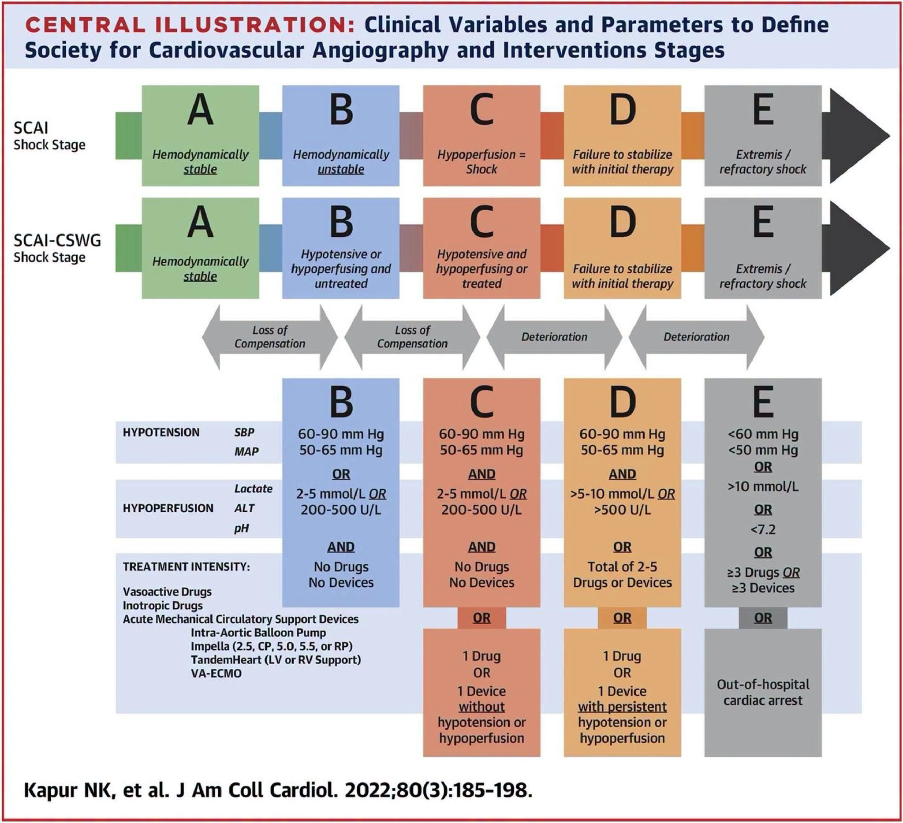
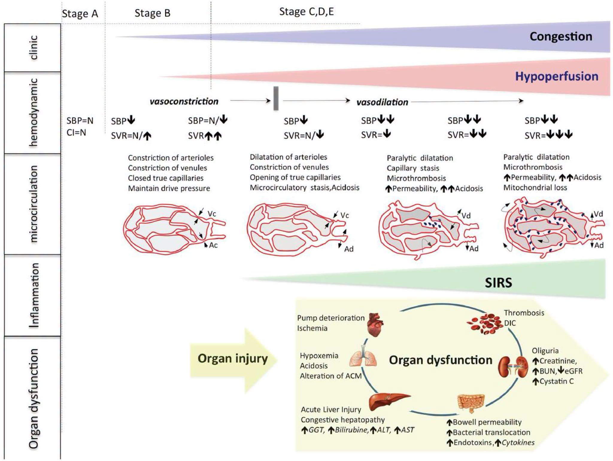

  

    

      
Khuyến Cáo Class I

      
Khuyến cáo chẩn đoán và phân tầng nguy cơ theo tiêu chuẩn JCVA 2026.

    

    

      
Bằng Chứng Mức B-NR

      
Khởi trị dược lý và tối ưu hóa liều dùng chuẩn y học chứng cứ.

    

    

      
Mục Tiêu & Theo Dõi

      
Đánh giá đáp ứng lâm sàng, theo dõi an toàn và chỉ số xét nghiệm đích.

    

    

      
Cảnh Báo An Toàn

      
Phòng ngừa biến chứng nặng và bẫy lâm sàng thường gặp trong thực hành.

    

  

    

      

        
⚡

        

          
Chẩn Đoán &amp; Phân Loại SCAI

          
Nhận diện sớm từ Giai đoạn A đến E, đánh giá lặp lại liên tục thay vì chỉ ghi nhận một mốc nhập viện.

        

      

      

        
🎯

        

          
Giám Sát PAC Huyết Động

          
Đánh giá chi tiết CVP, PCWP, CO, CPO, PAPi và tỷ số RA/PCWP để xác định chính xác kiểu hình suy thất.

        

      

      

        
🛡️

        

          
Hỗ Trợ Cơ Học (MCS)

          
Lựa chọn cá thể hóa IABP, Impella (2.5/CP/5.0/5.5), VA-ECMO dựa trên kiểu suy thất và mục tiêu điều trị.

        

      

      

        
⏱️

        

          
Giải Áp Thất Trái (LV Unloading)

          
Phối hợp chủ động Impella (ECMELLA) hoặc IABP khi chạy VA-ECMO ngăn chặn quá tải áp lực thất trái.

        

      

    

  

  
  

    
    

      
<i class="fa-solid fa-stethoscope sec-hdr-icon"></i> <h2 class="sec-title">1. Định Nghĩa, Dịch Tễ Học Và Gánh Nặng Lâm Sàng Của Sốc Tim (CS)</h2>

      

        
Sốc tim (Cardiogenic Shock - CS) vẫn là một trong những nguyên nhân hàng đầu gây tử vong tại bệnh viện. Mỗi năm, ước tính có khoảng 40.000 đến 50.000 bệnh nhân tại Hoa Kỳ và 60.000 đến 70.000 bệnh nhân tại Châu Âu được điều trị vì sốc tim. Mặc dù đã có những tiến bộ lớn trong liệu pháp hỗ trợ tuần hoàn cơ học (Mechanical Circulatory Support - MCS) và dược lý học, kết quả ngắn hạn vẫn rất nghèo nàn với tỷ lệ tử vong trong vòng 30 ngày dao động từ <strong>30% đến 60%</strong>.

        
Nhồi máu cơ tim cấp (AMI) là nguyên nhân phổ biến nhất gây ra sốc tim, chiếm <strong>hơn 80%</strong> tổng số các trường hợp. Tỷ lệ xuất hiện sốc tim sau nhồi máu cơ tim cấp dao động từ 5% đến 15%. Sự duy trì tỷ lệ tử vong cao trong các đăng ký đương đại phản ánh tình trạng già hóa dân số và sự gia tăng các bệnh lý đi kèm ở bệnh nhân.

        

          ℹ️
          

            <strong>Tiêu chuẩn huyết động kinh điển của Sốc Tim:</strong>
             • Huyết áp tâm thu (SBP) &lt; 90 mmHg trong ≥ 30 phút (hoặc cần thuốc vận mạch để duy trì SBP ≥ 90 mmHg).
             • Chỉ số tim (Cardiac Index - CI) &lt; 2.2 L/min/m².
             • Chênh lệch oxy động - tĩnh mạch tăng &gt; 5.5 mL/dL.
             • Áp lực bít mao mạch phổi (PCWP) ≥ 15 mmHg.
          

        

        

          ⚠️
          

            <strong>Sốc tim huyết áp bình thường (Normotensive Shock):</strong>
            Các cơ chế bù trừ co mạch của cơ thể có thể duy trì huyết áp tạm thời trong giới hạn bình thường, tuy nhiên tình trạng giảm tưới máu mô vẫn âm thầm diễn tiến. Những bệnh nhân thuộc nhóm này thường có tiên lượng lâm sàng rất xấu và dễ bị trì hoãn điều trị do bỏ sót chẩn đoán ban đầu.
          

        

        <h3 class="sec-subtitle">Bảng 1: Định Nghĩa Sốc Tim Trong Các Thử Nghiệm Lâm Sàng &amp; Hướng Dẫn</h3>
        

          <table class="data-table">
            <thead>
              <tr>
                <th style="width: 160px;">Nghiên cứu / Guideline</th>
                <th>Tiêu chuẩn Lâm sàng &amp; Huyết động Chẩn đoán</th>
              </tr>
            </thead>
            <tbody>
              <tr>
                <td><strong>SHOCK Trial</strong></td>
                <td>1. SBP &lt; 90 mmHg trong ≥ 30 phút hoặc cần hỗ trợ để duy trì SBP ≥ 90 mmHg; 2. Giảm tưới máu tạng (nước tiểu &lt; 30 mL/h, chi lạnh, HR &gt; 60 bpm); 3. Tiêu chuẩn huyết động: CI ≤ 2.2 L/min/m² VÀ PCWP ≥ 15 mmHg.</td>
              </tr>
              <tr>
                <td><strong>TRIUMPH Trial</strong></td>
                <td>1. Thông thoáng mạch máu thủ phạm (IRA) tự phát hoặc post-PCI; 2. Sốc tim kháng trị &gt; 1 giờ post-PCI với SBP &lt; 100 mmHg bất chấp dùng vận mạch (dopamine ≥ 7 µg/kg/min hoặc norepinephrine/epinephrine ≥ 0.15 µg/kg/min); 3. Tăng áp lực đổ đầy thất trái &amp; LVEF &lt; 40%.</td>
              </tr>
              <tr>
                <td><strong>IABP-SHOCK II</strong></td>
                <td>1. SBP &lt; 90 mmHg trong ≥ 30 phút hoặc cần catecholamine duy trì SBP &gt; 90 mmHg; 2. Sung huyết phổi trên lâm sàng; 3. Suy giảm tưới máu tạng (tri giác, chi lạnh ẩm, nước tiểu &lt; 30 mL/h, Lactate &gt; 2.0 mmol/L).</td>
              </tr>
              <tr>
                <td><strong>CULPRIT-SHOCK</strong></td>
                <td>1. PCI cấp cứu bệnh vành nhiều nhánh (hẹp &gt; 70% ở ≥ 2 nhánh lớn ≥ 2 mm); 2. SBP &lt; 90 mmHg trong &gt; 30 phút hoặc cần catecholamine; 3. Sung huyết phổi VÀ tưới máu tạng suy giảm (Lactate &gt; 2.0 mmol/L, nước tiểu &lt; 30 mL/h, tri giác).</td>
              </tr>
              <tr>
                <td><strong>ESC Guidelines</strong></td>
                <td>SBP &lt; 90 mmHg kèm thể tích tuần hoàn đầy đủ và các dấu hiệu lâm sàng/xét nghiệm giảm tưới máu mô (chi lạnh, thiểu niệu, toan chuyển hóa, tăng lactate, tăng creatinine).</td>
              </tr>
            </tbody>
          </table>
        

      

    

    
    

      
<i class="fa-solid fa-vial sec-hdr-icon"></i> <h2 class="sec-title">2. Sinh Lý Bệnh Học Và Vòng Xoắn Sốc (The "Shock Spiral")</h2>

      

        
Sinh lý bệnh học của sốc tim phản ánh sự không tương hợp nghiêm trọng giữa cung lượng tim (Cardiac Output - CO) và nhu cầu chuyển hóa của hệ thống. Sự sụt giảm đột ngột thể tích nhát bóp do tổn thương cơ tim kích hoạt phản ứng bù trừ:

        <ul style="margin-left: 1.25rem; line-height: 1.7;">
          <li><strong>Kích hoạt giao cảm &amp; RAAS:</strong> Co mạch hệ thống để duy trì áp lực tưới máu trung ương.</li>
          <li><strong>Hệ quả bất lợi:</strong> Co mạch hệ thống làm tăng gánh nặng hậu gánh cho thất trái, trong khi sự giữ muối/nước làm tăng tiền gánh (quá tải thể tích lồng ngực). Công tim tăng cao làm trầm trọng thêm tình trạng thiếu máu cục bộ cơ tim.</li>
        </ul>

        

          🚫
          

            <strong>Sự Tiến Triển Của Vòng Xoắn Sốc (Shock Spiral) &amp; Suy Đa Cơ Quan:</strong>
             • <strong>Rối loạn vi tuần hoàn:</strong> Co thắt tiểu động mạch/tĩnh mạch tiến triển thành giãn mạch liệt, tăng tính thấm mao mạch, ứ trệ mao mạch và vi huyết khối lan tỏa (MFI &amp; de Backer score tương quan trực tiếp tử vong 30 ngày).
             • <strong>Phản ứng viêm hệ thống (SIRS):</strong> Kích hoạt ở ~40% bệnh nhân vào ngày thứ 2. Tăng vọt các Interleukin (IL-1β, IL-6, IL-7). Nitric oxide (NO) giải phóng cục bộ gây giãn mạch liệt và ức chế co bóp cơ tim.
             • <strong>Suy hàng rào niêm mạc ruột:</strong> Thiếu máu cục bộ ruột gây dịch chuyển vi khuẩn (bacterial translocation) và giải phóng endotoxin vào tuần hoàn.
             • <strong>Phổi - Gan - Thận - Đông máu:</strong> Phù phổi kẽ toan máu; Sung huyết gan &amp; tổn thương gan cấp (tăng ALT, AST, Bilirubin); Suy thận cấp thiếu máu cục bộ (thiểu niệu, tăng Creatinine); Đông máu nội quản rải rác (DIC).
          

        

        
        

          
          
<strong>Hình 1:</strong> Sơ đồ Sinh lý bệnh học của Sốc tim với các bất thường theo giai đoạn lâm sàng (SCAI A-E), huyết động hệ thống, rối loạn vi tuần hoàn và suy đa cơ quan <em>(Trích từ J Cardiothorac Vasc Anesth 2026)</em>.

        

      

    

    
    

      
<i class="fa-solid fa-layer-group sec-hdr-icon"></i> <h2 class="sec-title">3. Hệ Thống Phân Độ Sốc SCAI Cải Tiến (SCAI Shock Stages A-E)</h2>

      

        
Bảng phân loại giai đoạn sốc của Hiệp hội Chụp mạch và Can thiệp Tim mạch (SCAI) chia tiến trình sốc tim thành 5 giai đoạn liên tục từ A đến E. Khung định nghĩa cải tiến của Kapur et al. (Cardiogenic Shock Working Group) cụ thể hóa các tiêu chuẩn thực hành lâm sàng:

        

          <table class="data-table">
            <thead>
              <tr>
                <th style="width: 140px;">Giai đoạn SCAI</th>
                <th style="width: 180px;">Tên giai đoạn</th>
                <th>Tiêu chuẩn Huyết động &amp; Sinh hóa Cụ thể</th>
              </tr>
            </thead>
            <tbody>
              <tr>
                <td>Giai đoạn A</td>
                <td><strong>At Risk (Có nguy cơ)</strong></td>
                <td>Bệnh nhân có bệnh tim cấp tính (AMI, suy tim cấp) nhưng huyết động hoàn toàn ổn định, không có dấu hiệu giảm tưới máu.</td>
              </tr>
              <tr>
                <td>Giai đoạn B</td>
                <td><strong>Preshock (Tiền sốc)</strong></td>
                <td>SBP 60-90 mmHg hoặc MAP 50-65 mmHg đơn độc, HOẶC giảm tưới máu cô lập (Lactate 2-5 mmol/L, ALT 200-500 U/L) chưa cần vận mạch/MCS.</td>
              </tr>
              <tr>
                <td>Giai đoạn C</td>
                <td><strong>Classic (Sốc điển hình)</strong></td>
                <td>Xuất hiện đồng thời Hạ huyết áp VÀ Giảm tưới máu mô HOẶC đang duy trì 1 thuốc vận mạch/tăng co bóp hoặc 1 thiết bị MCS (IABP, Impella, ECMO).</td>
              </tr>
              <tr>
                <td>Giai đoạn D</td>
                <td><strong>Deteriorating (Diễn tiến xấu)</strong></td>
                <td>Thất bại ổn định huyết động sau ≥ 30 phút điều trị ban đầu. Lactate 5-10 mmol/L, ALT > 500 U/L, hoặc cần leo thang 2-5 thuốc/MCS.</td>
              </tr>
              <tr>
                <td>Giai đoạn E</td>
                <td><strong>Extremis (Sốc trơ/Nguy kịch)</strong></td>
                <td>Trụy tim mạch hoàn toàn. Ngừng tuần hoàn ngoại viện (OHCA), CPR liên tục, hoặc cần ≥ 3 thuốc/MCS đồng thời. SBP &lt; 60, MAP &lt; 50, Lactate &gt; 10 mmol/L, pH ≤ 7.2.</td>
              </tr>
            </tbody>
          </table>
        

      

    

    
    

      
<i class="fa-solid fa-heart-pulse sec-hdr-icon"></i> <h2 class="sec-title">4. Dấu Ấn Sinh Học Mới Và Các Thang Điểm Tiên Lượng Lâm Sàng</h2>

      

        <h3 class="sec-subtitle">4.1. Các Dấu Ấn Sinh Học (Biomarkers) Mới Trong Sốc Tim</h3>
        <ul style="margin-left: 1.25rem; line-height: 1.7;">
          <li><strong>Cardiac Troponin (cTn):</strong> Chuẩn vàng hoại tử cơ tim, tương quan nguy cơ loạn nhịp thất và ngưng tim.</li>
          <li><strong>BNP &amp; NT-proBNP:</strong> Tăng đáp ứng với căng thành tim. NT-proBNP kết hợp với IL-6 có vai trò tiên lượng sống sót rất cao.</li>
          <li><strong>Soluble ST2 (sST2):</strong> Chỉ số tiên lượng rất cao. Điểm ưu việt: Nồng độ huyết thanh duy trì ổn định, <strong>không bị ảnh hưởng bởi suy thận hay BMI</strong>. Tích hợp vào thang điểm CardShock để dự báo tử vong 30 và 90 ngày.</li>
          <li><strong>Dipeptidyl Peptidase 3 (DPP3):</strong> Protease tuần hoạt ức chế trực tiếp sức co bóp cơ tim. Nồng độ DPP3 cao liên quan tử vong ngắn hạn cao, giảm eGFR, tăng lactate và creatinine.</li>
          <li><strong>Adrenomedullin (bio-ADM):</strong> Hormone giãn mạch tiên lượng tốt sau 48 giờ kể từ khi chẩn đoán sốc.</li>
          <li><strong>Angiopoietin 2:</strong> Yếu tố duy trì tính toàn vẹn mạch máu. Tăng ở mốc 72 giờ liên quan AKI và chảy máu.</li>
        </ul>

        <h3 class="sec-subtitle">4.2. Các Thang Điểm Tiên Lượng Lâm Sàng</h3>
        

          💡
          

            <strong>So Sánh 4 Thang Điểm Tiên Lượng Trong Sốc Tim:</strong>
             • <strong>CardShock Risk Score:</strong> Dự đoán tử vong tại viện (Tuổi, tiền sử MI/CABG, ACS, LVEF &lt; 40%, tri giác, SBP, Lactate, eGFR).
             • <strong>IABP-SHOCK II Score:</strong> Dự đoán tử vong 30 ngày ở AMI-CS (Tuổi &gt; 73, stroke, Đường máu &gt; 191 mg/dL, Creatinine &gt; 1.5 mg/dL, Dòng chảy TIMI &lt; 3 post-PCI, Lactate &gt; 5 mmol/L).
             • <strong>ENCOURAGE Score:</strong> Dự đoán tử vong ở bệnh nhân AMI-CS được chạy VA-ECMO (Tuổi &gt; 60, nữ, BMI &gt; 25, Glasgow &lt; 6, Creatinine &gt; 150 µmol/L, Lactate, Prothrombin &lt; 50%).
             • <strong>SAVE Score:</strong> Dự đoán sống sót sau khi chạy VA-ECMO cho sốc tim trơ.
          

        

      

    

    
    

      
<i class="fa-solid fa-shield-halved sec-hdr-icon"></i> <h2 class="sec-title">5. Giám Sát Huyết Động Xâm Lấn Bằng Catheter Động Mạch Phổi (PAC)</h2>

      

        
Giám sát bằng Catheter động mạch phổi (PAC) cung cấp các thông tin khách quan vô giá về tình trạng thể tích, áp lực đổ đầy hai thất, sức cản mạch phổi và chức năng thất phải. Phân tích gộp chỉ ra đặt PAC giúp <strong>giảm tử vong 30 ngày (OR 0.71)</strong> và tăng cơ hội tiếp cận kịp thời với các liệu pháp MCS nâng cao.

        

          ℹ️
          

            <strong>Các Thông Số Huyết Động Then Chốt Từ PAC:</strong>
             • <strong>Tỷ lệ RA/PCWP:</strong> Đánh giá suy thất phải (Tỷ lệ &gt; 0.59 gợi ý suy thất phải rõ rệt).
             • <strong>Công suất tim (Cardiac Power Output - CPO):</strong> CPO = \frac&#123;MAP × CO&#125;&#123;451&#125;. CPO &lt; 0.6 W sau 24 giờ liên quan tử vong 30 ngày rất cao.
             • <strong>Chỉ số mạch đập động mạch phổi (PAPi):</strong> PAPi = \frac&#123;PASP - PADP&#125;&#123;RAP&#125;. PAPi &lt; 1.85 gợi ý suy thất phải.
          

        

        <h3 class="sec-subtitle">Phân Loại Hồ Sơ Huyết Động Trong Sốc (Hemodynamic Profiles)</h3>
        

          <table class="data-table">
            <thead>
              <tr>
                <th>Hồ sơ Huyết động</th>
                <th>Áp lực Tim Phải (CVP/RA)</th>
                <th>Áp lực Tim Trái (PCWP)</th>
                <th>Đặc điểm Lâm sàng</th>
              </tr>
            </thead>
            <tbody>
              <tr>
                <td><strong>Hypovolemic (Giảm thể tích)</strong></td>
                <td>Thấp (&lt; 6 mmHg)</td>
                <td>Thấp (&lt; 10 mmHg)</td>
                <td>Thiếu dịch tuần hoàn tuyệt đối hoặc tương đối.</td>
              </tr>
              <tr>
                <td><strong>RV Congestion (Sung huyết Thất phải)</strong></td>
                <td>Tăng cao (&gt; 12 mmHg)</td>
                <td>Bình thường / Thấp</td>
                <td>Suy thất phải đơn thuần (TAPSE thấp, PAPi &lt; 1.85).</td>
              </tr>
              <tr>
                <td><strong>LV Congestion (Sung huyết Thất trái)</strong></td>
                <td>Bình thường</td>
                <td>Tăng cao (&gt; 15 mmHg)</td>
                <td>Suy thất trái đơn thuần, phù phổi cấp huyết động.</td>
              </tr>
              <tr>
                <td><strong>BiV Congestion (Sung huyết Hai thất)</strong></td>
                <td>Tăng cao (&gt; 12 mmHg)</td>
                <td>Tăng cao (&gt; 15 mmHg)</td>
                <td>Suy hai thất toàn bộ, nguy cơ tử vong cực kỳ cao.</td>
              </tr>
            </tbody>
          </table>
        

        
        

          
          
<strong>Hình 2:</strong> Các hồ sơ huyết động trong Sốc tim dựa trên sự tương quan giữa Áp lực đổ đầy tim phải (CVP/RA) và Áp lực đổ đầy tim trái (PCWP) <em>(Trích từ J Cardiothorac Vasc Anesth 2026)</em>.

        

      

    

    
    

      
<i class="fa-solid fa-triangle-exclamation sec-hdr-icon"></i> <h2 class="sec-title">6. Hỗ Trợ Tuần Hoàn Cơ Học (MCS) Và Bằng Chứng Hiệu Quả</h2>

      

        
Thuốc vận mạch/tăng co bóp làm tăng tiêu thụ oxy cơ tim (MVO2) và nguy cơ loạn nhịp. Do đó, các thiết bị hỗ trợ tuần hoàn cơ học (MCS) tạm thời nổi lên như một liệu pháp bắc cầu chính yếu.

        <h3 class="sec-subtitle">Bảng 2: Tác Động Huyết Động Của Các Thiết Bị MCS Khác Nhau</h3>
        

          <table class="data-table">
            <thead>
              <tr>
                <th>Thông số huyết động</th>
                <th>Impella 2.5 / CP</th>
                <th>Impella 5.0 / 5.5</th>
                <th>VA-ECMO</th>
                <th>IABP</th>
              </tr>
            </thead>
            <tbody>
              <tr>
                <td><strong>Dòng chảy thất trái (LV flow)</strong></td>
                <td>Giảm (↓)</td>
                <td>Giảm nhiều (↓↓)</td>
                <td>Tăng (↑)</td>
                <td>Giảm (↓)</td>
              </tr>
              <tr>
                <td><strong>Cung lượng tim (CO)</strong></td>
                <td>Tăng (↑)</td>
                <td>Tăng mạnh (↑↑)</td>
                <td>Tăng rất mạnh (↑↑↑)</td>
                <td>Tăng nhẹ (↑)</td>
              </tr>
              <tr>
                <td><strong>Huyết áp trung bình (MAP)</strong></td>
                <td>Tăng (↑)</td>
                <td>Tăng mạnh (↑↑)</td>
                <td>Tăng mạnh (↑↑)</td>
                <td>Tăng nhẹ (↑)</td>
              </tr>
              <tr>
                <td><strong>Áp lực bít mao mạch phổi (PCWP)</strong></td>
                <td>Giảm nhiều (↓↓)</td>
                <td>Giảm nhiều (↓↓)</td>
                <td>Tăng (↑) hoặc Giảm (↓)</td>
                <td>Giảm (↓)</td>
              </tr>
              <tr>
                <td><strong>Hậu gánh thất trái (LV afterload)</strong></td>
                <td>Giảm (↓)</td>
                <td>Giảm (↓)</td>
                <td><strong style="color: var(--red);">Tăng mạnh (↑↑)</strong></td>
                <td>Giảm (↓)</td>
              </tr>
              <tr>
                <td><strong>Tiêu thụ oxy cơ tim (MVO2)</strong></td>
                <td>Giảm nhiều (↓↓)</td>
                <td>Giảm nhiều (↓↓)</td>
                <td>Tăng (↑) hoặc Giữ nguyên</td>
                <td>Giảm (↓)</td>
              </tr>
              <tr>
                <td><strong>Tưới máu mạch vành</strong></td>
                <td>Tăng (↑)</td>
                <td>Tăng (↑)</td>
                <td>Tăng (↑)</td>
                <td>Tăng mạnh (↑↑)</td>
              </tr>
            </tbody>
          </table>
        

        

          ⚠️
          

            <strong>Bằng chứng lâm sàng hiện tại (IABP-SHOCK II &amp; CULPRIT-SHOCK):</strong>
            Mặc dù MCS cải thiện huyết động vĩ mô (tăng MAP, giảm lactate), các thử nghiệm RCT chưa chứng minh được lợi ích cải thiện tử vong 30 ngày một cách đồng nhất, đồng thời gia tăng biến chứng chảy máu nặng và thiếu máu chi dưới. Việc lựa chọn thiết bị MCS bắt buộc phải cá thể hóa dựa trên kiểu suy thất.
          

        

      

    

    
    

      
<i class="fa-solid fa-circle-nodes sec-hdr-icon"></i> <h2 class="sec-title">7. Giải Áp Thất Trái (LV Unloading) Khi Chạy VA-ECMO</h2>

      

        
Mặc dù VA-ECMO cung cấp hỗ trợ tuần hoàn toàn diện, dòng chảy ngược từ đường trả máu động mạch đùi làm <strong>tăng đáng kể hậu gánh thất trái</strong>. Khi thất trái suy nặng không thể mở van động mạch chủ, áp lực LVEDP và PCWP tăng vọt, gây phù phổi cấp huyết động, huyết khối buồng tim và tăng tiêu thụ oxy cơ tim.

        <h3 class="sec-subtitle">Bảng 3: So Sánh Các Biện Pháp Giải Áp Thất Trái (LV Unloading Modalities)</h3>
        

          <table class="data-table">
            <thead>
              <tr>
                <th style="width: 220px;">Phương thức giải áp</th>
                <th>Ưu điểm &amp; Cơ chế</th>
                <th>Nhược điểm &amp; Hạn chế</th>
              </tr>
            </thead>
            <tbody>
              <tr>
                <td><strong>Thuốc tăng co bóp (Inotropes)</strong></td>
                <td>Đơn giản, chi phí thấp, không cần can thiệp dụng cụ bổ sung.</td>
                <td>Tăng tiêu thụ oxy cơ tim, nguy cơ loạn nhịp thất, hiệu quả giải áp hạn chế.</td>
              </tr>
              <tr>
                <td><strong>Bóng đối xung động mạch chủ (IABP)</strong></td>
                <td>Dễ thực hiện tại giường, tỷ lệ biến chứng thấp, tăng tưới máu vành.</td>
                <td>Chỉ giải áp một phần; chống chỉ định khi hở van ĐMC hoặc phình ĐMC.</td>
              </tr>
              <tr>
                <td><strong>Thiết bị Impella (ECMELLA)</strong></td>
                <td><strong>Giải áp chủ động &amp; trực tiếp</strong>, giảm LVEDP tối ưu, tăng dòng chảy hệ thống.</td>
                <td>Tán huyết, chảy máu, thiếu máu chi; chi phí cao; chống chỉ định khi hở van ĐMC.</td>
              </tr>
              <tr>
                <td><strong>Chọc vách liên nhĩ (Atrial Septostomy)</strong></td>
                <td>Giải áp nhĩ trái/thất trái trực tiếp qua luồng thông sang nhĩ phải.</td>
                <td>Nguy cơ tổn thương vách tim, di lệch stent, cần can thiệp đóng lại sau hồi phục.</td>
              </tr>
              <tr>
                <td><strong>Cannula giải áp ngoại khoa / qua da</strong></td>
                <td>Dẫn lưu máu trực tiếp từ thất trái/nhĩ trái, hiệu quả giải áp tối đa.</td>
                <td>Biến chứng kỹ thuật mổ ngực hoặc chọc đường vào xâm lấn.</td>
              </tr>
            </tbody>
          </table>
        

      

    

    
    

      
<i class="fa-solid fa-diagram-project sec-hdr-icon"></i> <h2 class="sec-title">8. Quy Trình Leo Thang (Escalation) Và Hạ Bậc (De-escalation) MCS</h2>

      

        
        
        

          

            

              <i class="fa-solid fa-diagram-project" style="color: var(--color-primary, #0284c7);"></i>
              LƯU ĐỒ THUẬT TOÁN LÂM SÀNG LEO THANG &amp; HẠ BẬC MCS TRONG SỐC TIM (JCVA 2026)
            

            Editorial SVG Studio 2.0
          

          

            <svg class="med-svg" viewBox="0 0 900 400" width="100%" height="400" xmlns="http://www.w3.org/2000/svg" style="max-width: 100%; height: auto; display: block; font-family: 'Inter', system-ui, sans-serif;">
              <defs>
                &lt;linearGradient id="gMcsHdr" x1="0%" y1="0%" x2="100%" y2="100%">
                  <stop offset="0%" stop-color="#0284c7"/>
                  <stop offset="100%" stop-color="#0369a1"/>
                &lt;/linearGradient>
                &lt;linearGradient id="gDeEsc" x1="0%" y1="0%" x2="100%" y2="100%">
                  <stop offset="0%" stop-color="#059669"/>
                  <stop offset="100%" stop-color="#047857"/>
                &lt;/linearGradient>
                &lt;linearGradient id="gEsc" x1="0%" y1="0%" x2="100%" y2="100%">
                  <stop offset="0%" stop-color="#dc2626"/>
                  <stop offset="100%" stop-color="#b91c1c"/>
                &lt;/linearGradient>
              </defs>

              
              <rect x="250" y="15" width="400" height="48" rx="8" fill="url(#gMcsHdr)"/>
              <text x="450" y="37" fill="#ffffff" font-family="'Plus Jakarta Sans', sans-serif" font-size="13" font-weight="700" text-anchor="middle">SỐC TIM ĐANG CÓ HỖ TRỢ TUẦN HOÀN CƠ HỌC (MCS)</text>
              <text x="450" y="53" fill="#bae6fd" font-size="10.5" text-anchor="middle">Đánh giá đáp ứng huyết động, lactate máu và nhu cầu vận mạch sau 24–48 giờ</text>

              
              <path d="M 450 63 L 450 85 L 220 85 L 220 110" fill="none" stroke="#059669" stroke-width="2"/>
              <polygon points="216,110 220,117 224,110" fill="#059669"/>

              <path d="M 450 63 L 450 85 L 680 85 L 680 110" fill="none" stroke="#dc2626" stroke-width="2"/>
              <polygon points="676,110 680,117 684,110" fill="#dc2626"/>

              
              <rect x="50" y="117" width="340" height="46" rx="8" fill="#ecfdf5" stroke="#059669" stroke-width="1.5"/>
              <text x="220" y="137" fill="#065f46" font-family="'Plus Jakarta Sans', sans-serif" font-size="11.5" font-weight="700" text-anchor="middle">🟢 Huyết Động &amp; Chuyển Hóa Cải Thiện</text>
              <text x="220" y="152" fill="#047857" font-size="10" text-anchor="middle">Lactate giảm liên tục • Giảm liều vận mạch • Cung lượng tim phục hồi</text>

              
              <rect x="510" y="117" width="340" height="46" rx="8" fill="#fef2f2" stroke="#dc2626" stroke-width="1.5"/>
              <text x="680" y="137" fill="#991b1b" font-family="'Plus Jakarta Sans', sans-serif" font-size="11.5" font-weight="700" text-anchor="middle">🔴 Huyết Động Suy Sụp / Không Cải Thiện</text>
              <text x="680" y="152" fill="#dc2626" font-size="10" text-anchor="middle">Inotropic score &gt; 20 • Vận mạch &gt; 48h • Lactate tăng • Suy đa tạng</text>

              
              <path d="M 220 163 L 220 195" fill="none" stroke="#059669" stroke-width="2"/>
              <polygon points="216,195 220,202 224,195" fill="#059669"/>

              <path d="M 680 163 L 680 195" fill="none" stroke="#dc2626" stroke-width="2"/>
              <polygon points="676,195 680,202 684,195" fill="#dc2626"/>

              
              <rect x="50" y="202" width="340" height="175" rx="10" fill="#ffffff" stroke="#059669" stroke-width="1.5"/>
              <rect x="50" y="202" width="340" height="32" rx="10" fill="url(#gDeEsc)"/>
              <text x="220" y="223" fill="#ffffff" font-family="'Plus Jakarta Sans', sans-serif" font-size="12" font-weight="700" text-anchor="middle">HẠ BẬC / CAI DẦN MCS (DE-ESCALATION)</text>
              
              <text x="68" y="255" fill="#0f172a" font-size="11" font-weight="700">• Cai dần VA-ECMO:</text>
              <text x="80" y="272" fill="#475569" font-size="10.5">Giảm lưu lượng ECMO, đánh giá siêu âm tim và áp lực buồng tim.</text>
              
              <text x="68" y="295" fill="#0f172a" font-size="11" font-weight="700">• Chuyển sang Impella 5.0 (đường nách):</text>
              <text x="80" y="312" fill="#475569" font-size="10.5">Thời gian trung bình 22h post-admission, tạo điều kiện rút ống &amp; vận động sớm.</text>
              
              <text x="68" y="335" fill="#0f172a" font-size="11" font-weight="700">• Rút dần dụng cụ</text>
              <text x="80" y="352" fill="#059669" font-size="10.5" font-weight="700">khi tim tự duy trì CI &gt; 2.2 L/min/m² và lactate &lt; 2.0 mmol/L.</text>

              
              <path d="M 680 163 L 680 185 L 565 185 L 565 202" fill="none" stroke="#dc2626" stroke-width="1.5"/>
              <polygon points="561,202 565,209 569,202" fill="#dc2626"/>

              <path d="M 680 163 L 680 185 L 775 185 L 775 202" fill="none" stroke="#dc2626" stroke-width="1.5"/>
              <polygon points="771,202 775,209 779,202" fill="#dc2626"/>

              
              <rect x="475" y="209" width="180" height="168" rx="8" fill="#ffffff" stroke="#d97706" stroke-width="1.5"/>
              <rect x="475" y="209" width="180" height="28" rx="8" fill="#fffbeb"/>
              <text x="565" y="228" fill="#92400e" font-family="'Plus Jakarta Sans', sans-serif" font-size="10.5" font-weight="700" text-anchor="middle">SUY ĐƠN THẤT TRÁI</text>
              
              <text x="485" y="255" fill="#0f172a" font-size="10" font-weight="700">• Đổi từ đùi sang nách:</text>
              <text x="485" y="272" fill="#475569" font-size="9.5">Chuyển Impella CP → 5.0/5.5</text>
              <text x="485" y="295" fill="#0f172a" font-size="10" font-weight="700">• Tăng dòng hỗ trợ LV</text>
              <text x="485" y="312" fill="#475569" font-size="9.5">Đảm bảo dòng chảy &gt; 4.0 L/ph</text>
              <text x="485" y="335" fill="#0f172a" font-size="10" font-weight="700">• Tháo gỡ quá tải LV</text>
              <text x="485" y="352" fill="#d97706" font-size="9.5" font-weight="700">Giảm PCWP &amp; áp lực thành</text>

              
              <rect x="670" y="209" width="210" height="168" rx="8" fill="#ffffff" stroke="#dc2626" stroke-width="1.5"/>
              <rect x="670" y="209" width="210" height="28" rx="8" fill="#fef2f2"/>
              <text x="775" y="228" fill="#991b1b" font-family="'Plus Jakarta Sans', sans-serif" font-size="10.5" font-weight="700" text-anchor="middle">SUY HAI THẤT (BiV FAILURE)</text>
              
              <text x="680" y="255" fill="#0f172a" font-size="10" font-weight="700">• Chỉ định VA-ECMO:</text>
              <text x="680" y="272" fill="#475569" font-size="9.5">Hỗ trợ oxy hóa &amp; toàn bộ tuần hoàn</text>
              <text x="680" y="295" fill="#0f172a" font-size="10" font-weight="700">• Hỗ trợ RV chuyên biệt:</text>
              <text x="680" y="312" fill="#475569" font-size="9.5">Thêm ProtekDuo / Impella RP</text>
              <text x="680" y="335" fill="#0f172a" font-size="10" font-weight="700">• Phối hợp BIPELLA / ECPELLA:</text>
              <text x="680" y="352" fill="#dc2626" font-size="9.5" font-weight="700">Impella (LV) + ProtekDuo/ECMO</text>
            </svg>
          

          

            
 Tiêu chuẩn Leo thang (Escalation): Inotropic score &gt; 20, lactate tăng dai dẳng, suy thất tiến triển

            
 Tiêu chuẩn Hạ bậc (Weaning): Hồi phục huyết động (CI &gt; 2.2, CPO &gt; 0.6, LVEF &gt; 25-30%)

            
 Cấu hình phối hợp: ECPELLA (VA-ECMO + Impella) giải áp thất trái hiệu quả

          

        

        <ul style="margin-left: 1.25rem; line-height: 1.7;">
          <li><strong>Tiêu chuẩn Leo thang (Escalation):</strong> Đặt ra khi Inotropic score &gt; 20, lactate máu tăng dai dẳng, hoặc suy đa tạng tiến triển. Suy đơn thất trái -&gt; đổi sang Impella 5.0/5.5 đường nách; Suy hai thất (RAP &gt; 16, PAPi &lt; 1.85, RA/PCWP &gt; 0.59) -&gt; chỉ định VA-ECMO, ProtekDuo hoặc BIPELLA.</li>
          <li><strong>Tiêu chuẩn Hạ bậc (De-escalation):</strong> Khi nồng độ lactate bình thường hóa và huyết động ổn định. Chuyển đổi từ VA-ECMO sang Impella 5.0 nách (thời gian trung bình 22 giờ post-admission) giúp bệnh nhân rút ống sớm và tập vận động tại ICU.</li>
        </ul>
      

    

    
    

      
<i class="fa-solid fa-hospital-user sec-hdr-icon"></i> <h2 class="sec-title">9. Can Thiệp Bệnh Tim Cấu Trúc &amp; Mô Hình Tổ Chức Chăm Sóc Sốc Tim</h2>

      

        <ul style="margin-left: 1.25rem; line-height: 1.7;">
          <li><strong>Sửa van hai lá qua catheter (TMVR / MitraClip):</strong> Hở van 2 lá nặng gặp ở 5-10% bệnh nhân sốc tim. Can thiệp TMVR thành công giúp giảm tỷ lệ tử vong 1 năm từ <strong>69.2% xuống 39.7%</strong> (Jung et al.).</li>
          <li><strong>Thay van động mạch chủ qua catheter (TAVI):</strong> TAVI cấp cứu đóng vai trò như liệu pháp cứu mạng ở sốc tim do Hẹp van ĐMC khít (Tỷ lệ thành công kỹ thuật đạt 94.1%).</li>
          <li><strong>Mô hình Shock Team &amp; Mạng lưới Spoke-Hub:</strong> Thành lập đội sốc đa chuyên khoa (Tim mạch can thiệp, Phẫu thuật tim, Hồi sức cấp cứu, Chuyên gia Suy tim) và kết nối Bệnh viện vệ tinh (Spoke) với Trung tâm tuyến cuối (Hub) giúp nhận diện và can thiệp MCS sớm trước khi suy tạng không hồi phục.</li>
        </ul>
      

    

    
    

      
<i class="fa-solid fa-bookmark sec-hdr-icon"></i> <h2 class="sec-title">10. Trích Dẫn Tài Liệu Tham Khảo Chuẩn AMA</h2>

      

        

          1. Shekhar S, Agrawal A, Almadhoun H, et al. Cardiogenic Shock: Current Evidence, Guideline Perspectives, and Outcomes. <em>J Cardiothorac Vasc Anesth</em>. 2026;40(10):2581-2598. doi:10.1053/j.jvca.2026.01.021.
        

      

    

  

  

    <a href="#/ebm/kho-guidelines" class="btn btn-primary">
      <i class="fa-solid fa-arrow-left"></i> Quay lại Kho Guidelines
    </a>
    <a href="#sec-1" class="btn">
      <i class="fa-solid fa-arrow-up"></i> Lên đầu trang
    </a>
  

