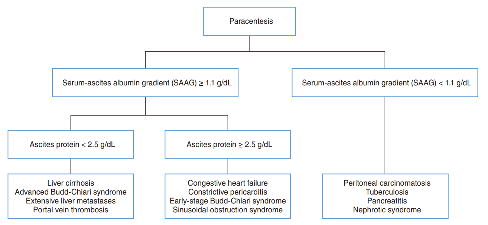
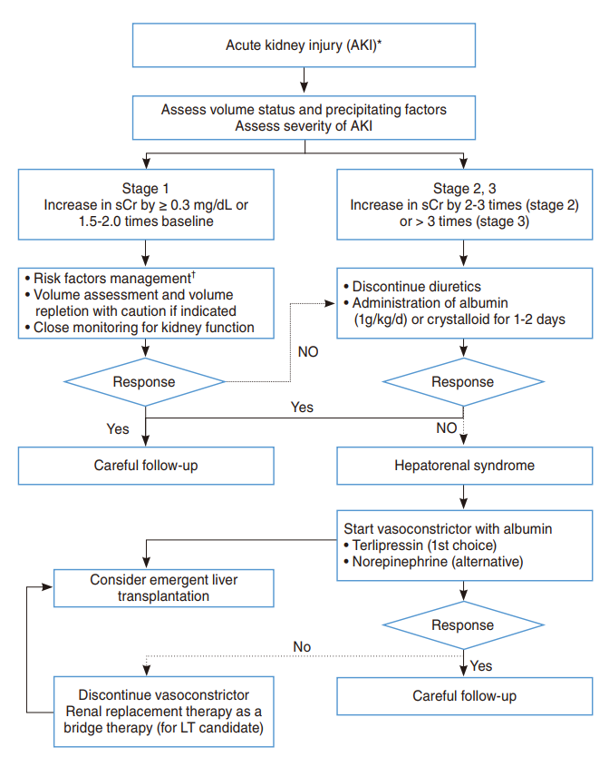

  

    

      
12 - 24 Giờ

      
Mốc thời gian vàng chọc dịch chẩn đoán giúp giảm tử vong nội viện

    

    

      
6 - 8 g/L

      
Liều Albumin bắt buộc cho mỗi lít dịch rút ra khi chọc tháo LVP &gt; 5 L

    

    

      
100 : 40

      
Tỷ lệ liều vàng Spironolactone : Furosemide cân bằng điện giải tối ưu

    

    

      
ADQI-ICA 2024

      
Tích hợp tiêu chuẩn thể tích nước tiểu vào chẩn đoán AKI &amp; HRS-AKI

    

  

  

    

      
🎯

      

        
Chẩn Đoán Nhanh &amp; Phân Tầng SAAG

        
Chọc dịch màng bụng sớm trong 12-24h; phân định áp lực cửa bằng SAAG ngưỡng 1.1 g/dL và protein dịch 2.5 g/dL.

      

    

    

      
⚖️

      

        
Cân Bằng Nội Môi &amp; Lợi Tiểu An Toàn

        
Cung cấp đủ 30-35 kcal/kg, bữa phụ đêm (LES), BCAAs, tiết chế muối &lt; 5g/ngày và phối hợp lợi tiểu đường uống liều tăng dần.

      

    

    

      
🛡️

      

        
Bảo Vệ Thận &amp; Kháng Sinh Trúng Đích

        
Albumin ngăn ngừa biến chứng PICD/HRS; Terlipressin truyền liên tục; cá thể hóa kháng sinh SBP theo nguy cơ vi khuẩn đa kháng.

      

    

  

  

    <a href="#sec-tong-quan-chan-doan" class="quickmenu-item active">1. Tổng Quan &amp; Chẩn Đoán</a>
    <a href="#sec-dinh-duong-loi-tieu" class="quickmenu-item">2. Dinh Dưỡng &amp; Lợi Tiểu</a>
    <a href="#sec-co-truong-khang-tri" class="quickmenu-item">3. Cổ Trướng Kháng Trị &amp; TIPS</a>
    <a href="#sec-ha-natri-mau" class="quickmenu-item">4. Hạ Natri Máu</a>
    <a href="#sec-viem-phuc-mac-sbp" class="quickmenu-item">5. SBP &amp; Kháng Sinh</a>
    <a href="#sec-ton-thuong-than-hrs" class="quickmenu-item">6. AKI &amp; HRS-AKI</a>
    <a href="#sec-bien-chung-dung-thuoc" class="quickmenu-item">7. Biến Chứng &amp; Dùng Thuốc</a>
    <a href="#sec-tai-lieu-tham-khao" class="quickmenu-item">8. Tham Khảo AMA</a>
  

  {/* ==================== SECTION 1 ==================== */}
  

    

      🔬
      <h2 class="sec-title">1. Tổng Quan, Phân Loại GRADE &amp; Thuật Toán Chẩn Đoán Cổ Trướng (Figure 1)</h2>
    

    

      

        💡
        

          <strong>Ý Nghĩa Lâm Sàng Của Cập Nhật KASL 2026</strong>
          Cổ trướng là biến chứng mất bù phổ biến nhất ở bệnh nhân xơ gan (chiếm 75% - 85% tổng số các ca cổ trướng). Sự xuất hiện của cổ trướng đánh dấu bước ngoặt tiên lượng xấu: tỷ lệ sống sót sau 1 năm và 2 năm lần lượt sụt giảm xuống còn khoảng <strong>60% và 45%</strong>. Bản hướng dẫn 2026 của Hiệp hội Nghiên cứu Bệnh gan Hàn Quốc (KASL) được sửa đổi toàn diện sau 9 năm (so với bản 2017) nhằm cập nhật các động học vi sinh đa kháng thuốc mới của SBP, mở rộng vai trò kháng viêm và bảo vệ mạch của Albumin, tích hợp đồng thuận suy thận cấp ADQI-ICA 2024 và chuẩn hóa quy trình can thiệp tại giường dưới hướng dẫn của siêu âm.
        

      

      
Hệ Thống Phân Loại Bằng Chứng GRADE Sửa Đổi Của KASL 2026

      

        <table class="regimen-table">
          <thead>
            <tr>
              <th style="width: 25%;">Phân Loại</th>
              <th style="width: 75%;">Định Nghĩa &amp; Ý Nghĩa Lâm Sàng</th>
            </tr>
          </thead>
          <tbody>
            <tr>
              <td class="source-cell"><strong>Chất lượng Cao (High - A)</strong></td>
              <td>Nghiên cứu trong tương lai rất khó có khả năng làm thay đổi mức độ tin cậy đối với ước tính hiệu quả điều trị.</td>
            </tr>
            <tr>
              <td class="source-cell"><strong>Chất lượng Trung bình (Moderate - B)</strong></td>
              <td>Nghiên cứu tương lai có khả năng gây ảnh hưởng quan trọng đến mức độ tin cậy và có thể làm thay đổi ước tính hiệu quả can thiệp.</td>
            </tr>
            <tr>
              <td class="source-cell"><strong>Chất lượng Thấp (Low - C)</strong></td>
              <td>Nghiên cứu tương lai cực kỳ có khả năng làm thay đổi ước tính hiệu quả điều trị.</td>
            </tr>
            <tr>
              <td class="source-cell"><strong>Chất lượng Rất thấp (Very Low - D)</strong></td>
              <td>Bất kỳ ước tính hiệu quả điều trị nào cũng đều rất không chắc chắn.</td>
            </tr>
            <tr>
              <td class="source-cell">Khuyến nghị Mạnh (Strong - 1)</td>
              <td>Các tác dụng có lợi của can thiệp vượt trội rõ rệt so với tác dụng có hại; can thiệp nên được áp dụng cho hầu hết bệnh nhân trong thực hành hàng ngày.</td>
            </tr>
            <tr>
              <td class="source-cell">Khuyến nghị Yếu / Có điều kiện (Weak - 2)</td>
              <td>Bằng chứng kém chắc chắn hơn; các lựa chọn thay thế có thể phù hợp tùy thuộc vào giá trị, sở thích cá nhân của người bệnh và hoàn cảnh lâm sàng thực tế.</td>
            </tr>
          </tbody>
        </table>
      

      
Khám Lâm Sàng &amp; Phân Độ Cổ Trướng

      

        

          

          
Cổ Trướng Độ 1 (Nhẹ) 🔍

          

            <ul class="clin-card-list">
              <li>Chỉ phát hiện được qua chẩn đoán hình ảnh (siêu âm ổ bụng hoặc CT Scan).</li>
              <li>Không thể phát hiện bằng các nghiệm pháp thăm khám thực thể thông thường.</li>
              <li>Chưa có chỉ định dùng thuốc lợi tiểu hoặc hạn chế muối nghiêm ngặt.</li>
            </ul>
          

        

        

          

          
Cổ Trướng Độ 2 (Vừa) 🩺

          

            <ul class="clin-card-list">
              <li>Bụng chướng vừa phải, đối xứng hai bên.</li>
              <li>Dễ dàng phát hiện bằng khám thực thể: gõ đục vùng thấp (flank dullness), gõ đục thay đổi (shifting dullness).</li>
              <li>Thường đòi hỏi thể tích dịch tích tụ tối thiểu <strong>1.5 L</strong> để bộc lộ dấu hiệu gõ đục.</li>
              <li>Chỉ định bắt buộc điều trị nội khoa (tiết chế muối + lợi tiểu).</li>
            </ul>
          

        

        

          

          
Cổ Trướng Độ 3 (Căng / Nặng) ⚠️

          

            <ul class="clin-card-list">
              <li>Bụng chướng căng to rõ rệt, da bụng bóng, rốn lồi hoặc thoát vị.</li>
              <li>Gây căng tức dữ dội, khó thở do chèn ép cơ hoành hoặc hạn chế vận động.</li>
              <li>Dấu hiệu sóng dịch (fluid wave) dương tính rõ.</li>
              <li>Chỉ định đầu tay: Chọc tháo dịch lượng lớn (LVP) giải áp kết hợp truyền Albumin.</li>
            </ul>
          

        

      

      
Chọc Dò Dịch Cổ Trướng Chẩn Đoán (Diagnostic Paracentesis)

      

        

          

          

            
⏱️

            
Mốc Thời Gian Vàng: 12 - 24 Giờ Đầu Sau Nhập Viện

          

          

            <ul style="margin-left: 1rem; line-height: 1.7;">
              <li><strong>Chỉ định bắt buộc:</strong> (1) Bệnh nhân mới xuất hiện cổ trướng Độ ≥ 2; (2) Mọi bệnh nhân xơ gan cổ trướng nhập viện vì bất kỳ lý do gì hoặc cổ trướng tiến triển nhanh; (3) Nghi ngờ nhiễm trùng (sốt, đau bụng, phản ứng dội); (4) Xuất hiện các biến chứng khác (xuất huyết tiêu hóa, bệnh não gan, tổn thương thận cấp AKI).</li>
              <li><strong>Lợi ích sống còn:</strong> Chọc dịch sớm trong 12 - 24h đầu giúp phát hiện kịp thời SBP tiềm ẩn, giảm tỷ lệ tử vong nội viện rõ rệt, rút ngắn thời gian điều trị và ngăn ngừa tiến triển suy thận cấp.</li>
            </ul>
          

          
Bắt buộc thực hiện sớm

        

        

          

          

            
🛡️

            
Kỹ Thuật An Toàn &amp; Tỷ Lệ Biến Chứng Thực Tế

          

          

            <ul style="margin-left: 1rem; line-height: 1.7;">
              <li><strong>Vị trí ưu tiên:</strong> Hố chậu trái (cách gai chậu trước trên 2 đốt ngón tay) được ưu tiên hơn hố chậu phải vì thành bụng mỏng hơn và bể dịch sâu hơn, tránh được manh tràng ứ hơi.</li>
              <li><strong>Bằng chứng an toàn (Meta-analysis 131 nghiên cứu, 12,509 thủ thuật):</strong> Rò rỉ dịch kéo dài 2.6%; tụ máu thành bụng / chảy máu 0.3% - 0.7%; thủng ruột 0.2%; tử vong liên quan thủ thuật cực hiếm gặp (0.02%).</li>
              <li><strong>Rối loạn đông máu trong xơ gan:</strong> Giảm tiểu cầu hoặc kéo dài INR nội khoa <em>không phải là chống chỉ định</em> của chọc dịch. Không cần truyền huyết tương tươi đông lạnh hoặc tiểu cầu dự phòng thường quy. Siêu âm dẫn đường tại giường giúp nâng tỷ lệ thành công lên &gt; 95% và giảm tối đa nguy cơ chảy máu.</li>
            </ul>
          

          
Thủ thuật an toàn cao

        

      

      
Phân Loại Chẩn Đoán Phân Biệt Các Căn Nguyên Gây Cổ Trướng (Table 2 KASL)

      

        <table class="regimen-table">
          <thead>
            <tr>
              <th style="width: 25%;">Nhóm Bệnh Lý</th>
              <th style="width: 75%;">Các Căn Nguyên Cụ Thể</th>
            </tr>
          </thead>
          <tbody>
            <tr>
              <td class="source-cell"><strong>Bệnh lý tại gan (Hepatic)</strong></td>
              <td>
                • Xơ gan mất bù (chiếm ưu thế 75% - 85% trường hợp). 
                • Suy gan cấp (Acute liver failure). 
                • Hội chứng Budd-Chiari (tắc tĩnh mạch trên gan). 
                • Hội chứng tắc nghẽn xoang gan (Sinusoidal Obstruction Syndrome - SOS / VOD). 
                • Huyết khối tĩnh mạch cửa (Portal Vein Thrombosis - PVT).
              </td>
            </tr>
            <tr>
              <td class="source-cell"><strong>Bệnh lý ngoài gan (Extrahepatic)</strong></td>
              <td>
                • Cổ trướng ác tính (Peritoneal carcinomatosis, di căn màng bụng diện rộng). 
                • Viêm phúc mạc do lao (Tuberculous peritonitis). 
                • Suy tim sung huyết, viêm màng ngoài tim co thắt. 
                • Viêm tụy cấp hoặc nang giả tụy rò dịch. 
                • Hội chứng thận hư mức độ nặng. 
                • Thủng tạng rỗng, suy giáp nặng gây phù niêm mạc bụng.
              </td>
            </tr>
            <tr>
              <td class="source-cell"><strong>Bệnh lý hỗn hợp (Mixed)</strong></td>
              <td>
                • Cổ trướng hỗn hợp do sự kết hợp đồng thời của xơ gan và một bệnh lý ngoài gan đi kèm (ví dụ: xơ gan kèm suy tim sung huyết hoặc xơ gan trên nền bệnh thận đái tháo đường).
              </td>
            </tr>
          </tbody>
        </table>
      

      
Danh Mục Xét Nghiệm Dịch Cổ Trướng (Table 3 KASL)

      

        <table class="regimen-table">
          <thead>
            <tr>
              <th style="width: 25%;">Nhóm Xét Nghiệm</th>
              <th style="width: 40%;">Chỉ Số Cần Đo</th>
              <th style="width: 35%;">Mục Đích &amp; Điểm Cắt Lâm Sàng</th>
            </tr>
          </thead>
          <tbody>
            <tr>
              <td class="source-cell">Bắt buộc (Mandatory)</td>
              <td>
                • Tế bào học &amp; công thức bạch cầu (Cell count &amp; differential). 
                • Albumin dịch cổ trướng. 
                • Protein toàn phần dịch cổ trướng.
              </td>
              <td>
                • Chẩn đoán SBP (PMN ≥ 250/mm³). 
                • Tính SAAG để phát hiện tăng áp cửa. 
                • Phân tầng nguy cơ nhiễm trùng và phân loại sau gan.
              </td>
            </tr>
            <tr>
              <td class="source-cell">Tùy chọn theo định hướng</td>
              <td>
                • Nhuộm Gram &amp; cấy dịch vào 2 chai cấy máu tại giường. 
                • Tế bào học tìm tế bào lạ (Cytology), chỉ số CEA. 
                • AFB, nuôi cấy tìm lao, nồng độ ADA. 
                • LDH &amp; Glucose dịch cổ trướng. 
                • Amylase dịch cổ trướng. 
                • Triglyceride dịch cổ trướng. 
                • Bilirubin dịch cổ trướng. 
                • Creatinine &amp; Urea dịch cổ trướng. 
                • BNP hoặc NT-proBNP huyết thanh.
              </td>
              <td>
                • Xác định vi khuẩn gây SBP (&gt; 90% nhạy). 
                • Phát hiện ung thư màng bụng. 
                • Chẩn đoán lao màng bụng. 
                • Phân biệt SBP với viêm phúc mạc thứ phát. 
                • Cổ trướng do tụy (&gt; 1,000 U/L). 
                • Cổ trướng dưỡng chấp (≥ 200 mg/dL). 
                • Rò rỉ đường mật do thủng túi mật/ống mật. 
                • Rò rỉ nước tiểu do vỡ bàng quang/niệu quản. 
                • Phân biệt cổ trướng do suy tim.
              </td>
            </tr>
          </tbody>
        </table>
      

      
Phân Tích Huyết Động Học Dịch &amp; Vai Trò Của Chỉ Số SAAG

      

        📊
        

          <strong>Chỉ Số Khoảng Chênh Albumin Huyết Thanh - Cổ Trướng (SAAG):</strong>
          $$	ext{SAAG} = 	ext{Albumin huyết thanh} - 	ext{Albumin dịch cổ trướng}$$
          SAAG là thước đo sinh lý bệnh ưu việt nhất phản ánh trực tiếp sự gia tăng áp lực thủy tĩnh trong hệ thống tĩnh mạch cửa. Phân tích gộp của KASL xác nhận chỉ số SAAG đạt <strong>độ nhạy 91.7%</strong> và <strong>độ đặc hiệu 80.5%</strong> trong chẩn đoán tăng áp lực tĩnh mạch cửa (vượt trội hơn hẳn cách phân loại dịch thấm/dịch tiết cổ điển).
        

      

      {/* FIGURE 1 CARD */}
      

        
        

          
Figure 1. Thuật Toán Chẩn Đoán Phân Biệt Cổ Trướng Theo KASL 2026

          Sơ đồ tích hợp 2 bước phân loại huyết động học: (1) <strong>SAAG ≥ 1.1 g/dL</strong> xác lập tình trạng tăng áp lực tĩnh mạch cửa; sau đó xét nồng độ <strong>Protein toàn phần dịch</strong> với ngưỡng <strong>2.5 g/dL</strong> để tách biệt xơ gan (&lt; 2.5 g/dL do xoang gan tổn thương giảm tổng hợp và rò rỉ lympho nghèo protein) với suy tim sung huyết / viêm màng ngoài tim co thắt / Budd-Chiari sớm (≥ 2.5 g/dL do tăng áp sau gan dẫn đến rò lympho giàu protein qua bao Glisson). Nhóm <strong>SAAG &lt; 1.1 g/dL</strong> không có tăng áp cửa, cần tìm ung thư màng bụng, lao, tụy hoặc thận hư.
        

      

    

  

  {/* ==================== SECTION 2 ==================== */}
  

    

      🥗
      <h2 class="sec-title">2. Liệu Pháp Dinh Dưỡng, Hạn Chế Muối &amp; Phác Đồ Lợi Tiểu Tỷ Lệ Vàng 100:40</h2>
    

    

      
Bảng Can Thiệp Điều Trị Theo Cấp Độ Cổ Trướng (Table 4 KASL)

      

        <table class="regimen-table">
          <thead>
            <tr>
              <th style="width: 30%;">Biện Pháp Can Thiệp</th>
              <th style="width: 35%;">Cổ Trướng Độ 1 (Grade 1)</th>
              <th style="width: 35%;">Cổ Trướng Độ 2 &amp; 3 (Grade 2 &amp; 3)</th>
            </tr>
          </thead>
          <tbody>
            <tr>
              <td class="source-cell"><strong>Điều trị nguyên nhân bệnh gan nền</strong></td>
              <td>Bắt buộc (A1)</td>
              <td>Bắt buộc (A1)</td>
            </tr>
            <tr>
              <td class="source-cell"><strong>Liệu pháp dinh dưỡng &amp; Bữa phụ đêm (LES)</strong></td>
              <td>Khuyến cáo (B1)</td>
              <td>Khuyến cáo (B1)</td>
            </tr>
            <tr>
              <td class="source-cell"><strong>Hạn chế muối natri đường ăn uống</strong></td>
              <td>Không bắt buộc</td>
              <td>Khuyến cáo mạnh mẽ (B1) (&lt; 5g muối/ngày)</td>
            </tr>
            <tr>
              <td class="source-cell"><strong>Thuốc lợi tiểu đường uống</strong></td>
              <td>Không khuyến cáo</td>
              <td>Lựa chọn hàng đầu (A1)</td>
            </tr>
            <tr>
              <td class="source-cell"><strong>Chọc tháo dịch lượng lớn (LVP)</strong></td>
              <td>Không chỉ định</td>
              <td>Chỉ định đầu tay cho Độ 3 (A1)</td>
            </tr>
            <tr>
              <td class="source-cell"><strong>Ngừng thuốc có hại (NSAIDs, ACEi, ARB)</strong></td>
              <td>Bắt buộc</td>
              <td>Bắt buộc</td>
            </tr>
          </tbody>
        </table>
      

      
Điều Trị Bệnh Căn Nguyên (Etiologic Therapy)

      

        

          

          
Xơ Gan Do Rượu 🍷

          

            
<strong>Kiêng rượu tuyệt đối:</strong> Giúp giảm áp lực tĩnh mạch cửa, phục hồi độ nhạy với thuốc lợi tiểu và cải thiện cấu trúc xơ hóa.

            
Bệnh nhân Child-Pugh C kiêng rượu triệt để đạt tỷ lệ sống sót sau 3 năm lên tới <strong>khoảng 75%</strong>.

          

        

        

          

          
Viêm Gan Siêu Vi B 💉

          

            
<strong>Thuốc kháng virus NAs đường uống dài hạn:</strong> Entecavir, Tenofovir DF hoặc Tenofovir Alafenamide ức chế HBV DNA liên tục.

            
Phục hồi chức năng gan, giảm nguy cơ tiến triển cổ trướng và thoái triển xơ gan.

          

        

        

          

          
Viêm Gan Siêu Vi C 💊

          

            
<strong>Phác đồ DAAs trực tiếp:</strong> Sofosbuvir + Velpatasvir trong 12 tuần đạt tỷ lệ sạch virus (SVR12) &gt; 95%.

            
Giúp cải thiện điểm số MELD ở <strong>51%</strong> và điểm Child-Pugh ở <strong>47%</strong> bệnh nhân xơ gan mất bù.

          

        

      

      
Liệu Pháp Dinh Dưỡng Chuyên Sâu: Chống Teo Cơ &amp; Dị Hóa

      

        

          

          

            
⚡

            
Mục Tiêu Năng Lượng &amp; Tuyệt Đối Không Hạn Chế Đạm

          

          

            <ul style="margin-left: 1rem; line-height: 1.7;">
              <li><strong>Nhu cầu năng lượng:</strong> Đảm bảo <strong>30 - 35 kcal/kg/ngày</strong> (dựa trên cân nặng lý tưởng hoặc cân nặng khô sau khi tháo dịch).</li>
              <li><strong>Nhu cầu Protein:</strong> Cung cấp <strong>1.2 - 1.5 g/kg/ngày</strong>; tăng lên đến <strong>1.5 g/kg/ngày</strong> ở bệnh nhân teo cơ (sarcopenia) hoặc suy dinh dưỡng nặng.</li>
              <li><strong style="color: #dc2626;">CẢNH BÁO:</strong> Tuyệt đối <em>không kiêng đạm</em> vì quan niệm sợ hôn mê gan! Kiêng đạm làm tăng phân hủy khối cơ vân, làm suy sụp nồng độ albumin máu và thúc đẩy tử vong.</li>
            </ul>
          

          
Protein 1.2 - 1.5 g/kg/ngày

        

        

          

          

            
🌙

            
Bữa Phụ Đêm Muộn (Late Evening Snack - LES) &amp; Axit Amin BCAAs

          

          

            <ul style="margin-left: 1rem; line-height: 1.7;">
              <li><strong>Bữa phụ đêm (LES):</strong> Gan xơ hóa bị cạn kiệt dự trữ glycogen, khiến cơ thể chuyển sang trạng thái "nhịn đói kéo dài" chỉ sau một đêm ngủ ngắn. Bữa phụ chứa carbohydrate phức hợp và protein trước khi ngủ giúp ngăn chặn dị hóa cơ, tăng tổng hợp albumin và giảm tái phát cổ trướng.</li>
              <li><strong>BCAAs đường uống:</strong> Bổ sung axit amin chuỗi nhánh (Leucine, Isoleucine, Valine) dài hạn (&gt; 6 tháng) kích thích tổng hợp protein cơ vân, giải độc amoniac tại cơ, giảm bùng phát bệnh não gan HE, giảm biến chứng nhiễm trùng SBP và kéo dài thời gian sống còn không biến cố.</li>
              <li><strong>Bù vi chất:</strong> Bổ sung Kẽm (Zinc - đồng yếu tố chuyển hóa chu trình ure và giải độc NH3), Vitamin D và Thiamine (B1) khi ghi nhận thiếu hụt.</li>
            </ul>
          

          
LES &amp; BCAAs chuẩn EBM

        

      

      
Quy Tắc Tiết Chế Muối &amp; Hạn Chế Nước Đúng Chuẩn

      

        

          

          
Tiết Chế Muối Natri 🧂

          

            
• Hạn chế muối ăn vào ở mức <strong>&lt; 5 g muối/ngày</strong> (tương đương <strong>&lt; 2,000 mg Natri</strong> hoặc <strong>88 mmol Natri/ngày</strong>).

            
• <em>Lưu ý thực hành:</em> Tránh siết muối quá ngặt (&lt; 2g muối) vì làm thức ăn mất vị, bệnh nhân chán ăn dẫn đến suy dinh dưỡng và suy thận trước thận.

          

        

        

          

          
Quản Lý Nước Uống 💧

          

            
• <strong>KHÔNG hạn chế nước thường quy</strong> ở đại đa số bệnh nhân cổ trướng.

            
• Chỉ đặt chỉ định hạn chế nước (giới hạn 1,000 - 1,500 mL/ngày) khi có <strong>hạ natri máu loãng mức độ nặng với Natri máu &lt; 125 mmol/L</strong>.

          

        

      

      
Liệu Pháp Thuốc Lợi Tiểu: Phác Đồ Tỷ Lệ Vàng 100 : 40

      

        ⚠️
        

          <strong>Chống Chỉ Định Lợi Tiểu Tiêm Tĩnh Mạch Thường Quy:</strong>
          Chỉ sử dụng thuốc lợi tiểu đường uống cho cổ trướng Độ 2 &amp; 3. Cấm tiêm tĩnh mạch Furosemide liều cao thường quy vì gây tụt thể tích nội mạch đột ngột, khởi phát suy thận cấp AKI và bệnh não gan.
        

      

      

        <table class="regimen-table">
          <thead>
            <tr>
              <th style="width: 20%;">Thuốc / Hoạt Chất</th>
              <th style="width: 40%;">Liều Khởi Đầu &amp; Chỉnh Liều Tối Đa</th>
              <th style="width: 40%;">Cơ Chế &amp; Tác Dụng Phụ Cần Giám Sát</th>
            </tr>
          </thead>
          <tbody>
            <tr>
              <td class="source-cell">Kháng Aldosterone <strong>Spironolactone</strong></td>
              <td>
                • Khởi đầu: <strong>50 - 100 mg/ngày</strong> uống 1 lần buổi sáng. 
                • Tăng dần sau mỗi 3 - 5 ngày nếu chưa đáp ứng. 
                • Liều tối đa: <strong>400 mg/ngày</strong>.
              </td>
              <td>
                • Lựa chọn đầu tay giải quyết tình trạng cường aldosterone thứ phát. 
                • Nguy cơ: Tăng kali máu, toan chuyển hóa, vú to đau ở nam giới (gynecomastia). Thay bằng <em>Amiloride</em> (liều bằng 1/10) nếu vú to đau.
              </td>
            </tr>
            <tr>
              <td class="source-cell">Lợi Tiểu Quai <strong>Furosemide</strong></td>
              <td>
                • Khởi đầu: <strong>20 - 40 mg/ngày</strong> uống buổi sáng. 
                • Chỉnh liều tăng dần sau mỗi 3 - 5 ngày. 
                • Liều tối đa: <strong>160 mg/ngày</strong>.
              </td>
              <td>
                • Ức chế đồng vận Na-K-2Cl tại quai Henle, tác dụng bài niệu nhanh. 
                • Thải kali để bù trừ hiệu ứng giữ kali của spironolactone. 
                • Thay bằng <em>Torasemide</em> (liều bằng 1/2) nếu hấp thu kém.
              </td>
            </tr>
            <tr>
              <td class="source-cell">Phối Hợp Tỷ Lệ Vàng <strong>Spironolactone : Furosemide</strong></td>
              <td>
                • Phối hợp đồng thời theo tỷ lệ <strong>100 mg : 40 mg</strong>. 
                • Các bậc chỉnh liều: (50:20) → (100:40) → (200:80) → (300:120) → (400:160).
              </td>
              <td>
                • Tối ưu hóa hiệu quả bài xuất natri qua thận nhanh nhất. 
                • Giữ nồng độ Kali máu luôn cân bằng trong ngưỡng sinh lý an toàn (3.5 - 5.0 mmol/L).
              </td>
            </tr>
          </tbody>
        </table>
      

      
Theo Dõi &amp; Giám Sát An Toàn Khi Dùng Lợi Tiểu

      

        

          

          
Mục Tiêu Giảm Cân ⚖️

          

            
• <strong>Không có phù ngoại biên:</strong> Giảm tối đa <strong>0.5 kg/ngày</strong> để bảo vệ thể tích tuần hoàn hiệu dụng.

            
• <strong>Có phù chân đi kèm:</strong> Cho phép giảm tối đa <strong>1.0 kg/ngày</strong> do dịch phù tái hấp thu nhanh vào lòng mạch.

          

        

        

          

          
Tỷ Số Na/K Niệu Ngẫu Nhiên 🧪

          

            
• <strong>Spot Urine Na/K &gt; 1:</strong> Lợi tiểu đạt đáp ứng bài xuất muối tốt. Nếu không giảm cân → Bệnh nhân <em>không tuân thủ chế độ ăn giảm muối</em>.

            
• <strong>Spot Urine Na/K &lt; 1:</strong> Lợi tiểu chưa đủ hoạt lực thải muối → Cần <em>tăng liều lợi tiểu</em>.

          

        

        

          

          
Tiêu Chuẩn Dừng Lợi Tiểu 🛑

          

            
Ngừng ngay hoặc giảm liều khi có một trong các dấu hiệu:

            <ul class="clin-card-list">
              <li>Natri máu &lt; 125 mmol/L.</li>
              <li>Kali máu &lt; 3.0 mmol/L (ngừng quai) hoặc &gt; 6.0 mmol/L (ngừng kháng aldosterone).</li>
              <li>Creatinine máu tăng ≥ 0.3 mg/dL hoặc tăng gấp 1.5 lần nền.</li>
              <li>Xuất hiện bệnh não gan (HE) mới khởi phát.</li>
            </ul>
          

        

      

    

  

  {/* ==================== SECTION 3 ==================== */}
  

    

      🛡️
      <h2 class="sec-title">3. Cổ Trướng Kháng Trị, Chọc Tháo LVP Kèm Albumin &amp; Can Thiệp TIPS / CART</h2>
    

    

      
Phân Loại &amp; Tiêu Chuẩn Chẩn Đoán Cổ Trướng Kháng Trị (Table 5 KASL)

      

        <table class="regimen-table">
          <thead>
            <tr>
              <th style="width: 25%;">Phân Loại &amp; Tiêu Chí</th>
              <th style="width: 75%;">Nội Dung &amp; Ngưỡng Chẩn Đoán Chi Tiết</th>
            </tr>
          </thead>
          <tbody>
            <tr>
              <td class="source-cell"><strong>Cổ trướng kháng thuốc lợi tiểu (Diuretic-resistant)</strong></td>
              <td>Tình trạng cổ trướng không thể giải quyết được hoặc tái phát sớm sau chọc tháo dù đã áp dụng chế độ ăn hạn chế natri nghiêm ngặt (&lt; 5g muối/ngày) kết hợp với liều lợi tiểu tối đa được dung nạp.</td>
            </tr>
            <tr>
              <td class="source-cell"><strong>Cổ trướng không dung nạp lợi tiểu (Diuretic-intractable)</strong></td>
              <td>Tình trạng không thể tăng liều lợi tiểu đến mức có hiệu quả do xuất hiện sớm các tác dụng phụ nghiêm trọng của thuốc khiến phải ngừng hoặc giảm liều.</td>
            </tr>
            <tr>
              <td class="source-cell"><strong>Liều &amp; thời gian thử thách tối thiểu</strong></td>
              <td>Điều trị ít nhất <strong>1 tuần</strong> với phác đồ liều tối đa: <strong>Spironolactone 400 mg/ngày + Furosemide 160 mg/ngày</strong> kết hợp ăn giảm muối &lt; 5g/ngày.</td>
            </tr>
            <tr>
              <td class="source-cell"><strong>Không đáp ứng (Non-response)</strong></td>
              <td>Cân nặng giảm <strong>&lt; 0.8 kg trong vòng 4 ngày</strong> điều trị liên tục kèm nồng độ natri niệu thấp hơn lượng natri nạp vào đường ăn uống.</td>
            </tr>
            <tr>
              <td class="source-cell"><strong>Tái phát sớm (Early recurrence)</strong></td>
              <td>Cổ trướng tái phát mức độ Độ 2 hoặc Độ 3 trong vòng <strong>4 tuần</strong> kể từ đợt chọc tháo sạch dịch hoàn toàn trước đó.</td>
            </tr>
            <tr>
              <td class="source-cell"><strong>Tác dụng phụ giới hạn liều</strong></td>
              <td>
                • <strong>Bệnh não gan (HE):</strong> Khởi phát HE rõ rệt không tìm thấy nguyên nhân khởi kích khác. 
                • <strong>Tổn thương thận cấp (AKI):</strong> Tăng sCr ≥ 0.3 mg/dL trong 48h hoặc tăng ≥ 50% trong 7 ngày, hoặc nước tiểu ≤ 0.5 mL/kg/h kéo dài ≥ 6h. 
                • <strong>Hạ natri máu:</strong> Natri máu giảm &gt; 10 mmol/L xuống dưới ngưỡng 125 mmol/L. 
                • <strong>Rối loạn kali máu:</strong> Kali máu &lt; 3.0 mmol/L hoặc &gt; 6.0 mmol/L.
              </td>
            </tr>
          </tbody>
        </table>
      

      
Chọc Tháo Dịch Lượng Lớn (LVP) &amp; Phòng Ngừa Biến Chứng PICD Bằng Albumin

      

        

          

          

            
⚠️

            
Cơ Chế Rối Loạn Tuần Hoàn Sau Chọc Tháo (PICD)

          

          

            <ul style="margin-left: 1rem; line-height: 1.7;">
              <li><strong>Bệnh sinh PICD:</strong> Tháo dịch ổ bụng lượng lớn (&gt; 5 L) làm sụt giảm đột ngột áp lực trong ổ bụng, gây giãn các xoang mạch tạng dội ngược diện rộng, làm sụt giảm nghiêm trọng thể tích tuần hoàn động mạch hiệu dụng (EABV).</li>
              <li><strong>Hậu quả nặng nề:</strong> Kích hoạt hệ giao cảm và RAAS cực độ, dẫn đến suy thận cấp tiến triển (HRS-AKI), hạ natri máu loãng nghiêm trọng và tăng tỷ lệ tử vong sau chọc.</li>
            </ul>
          

          
Nguy cơ PICD đe dọa mạng sống

        

        

          

          

            
💉

            
Phác Đồ Bắt Buộc Truyền Albumin Theo KASL 2026

          

          

            <ul style="margin-left: 1rem; line-height: 1.7;">
              <li><strong>Chỉ định:</strong> Khi thể tích dịch chọc tháo <strong>vượt quá 5 L</strong> trong một lần thực hiện.</li>
              <li><strong>Liều lượng chuẩn:</strong> Truyền tĩnh mạch <strong>6 - 8 g Albumin người cho mỗi 1 L dịch cổ trướng được rút ra</strong> (truyền ngay trong hoặc ngay sau khi chọc).</li>
              <li><strong>Bằng chứng tối ưu (Meta-analysis 26 nghiên cứu):</strong> Hiệu quả bảo vệ thận và ngăn ngừa hạ natri máu chỉ đạt được ý nghĩa thống kê rõ rệt khi đảm bảo liều Albumin <strong>≥ 6 g/L dịch rút</strong> và kiểm soát tổng thể tích tháo dịch <strong>dưới 9 L mỗi lần</strong>.</li>
              <li><strong>Bối cảnh ăn mặn tại Châu Á (Hàn Quốc/Việt Nam):</strong> Lượng natri nạp vào thường cao (4,500 - 7,000 mg/ngày), ngay cả khi ăn kiêng vẫn tích lũy ~1,350 mg Na/ngày, đòi hỏi phải phối hợp chọc tháo định kỳ kèm Albumin.</li>
            </ul>
          

          
6 - 8 g Albumin/L dịch tháo

        

      

      
Can Thiệp TIPS &amp; Các Liệu Pháp Mới

      

        <table class="regimen-table">
          <thead>
            <tr>
              <th style="width: 25%;">Phương Pháp Can Thiệp</th>
              <th style="width: 45%;">Bằng Chứng EBM &amp; Hiệu Quả Lâm Sàng</th>
              <th style="width: 30%;">Chỉ Định &amp; Lưu Ý An Toàn</th>
            </tr>
          </thead>
          <tbody>
            <tr>
              <td class="source-cell">TIPS <strong>Thông Cửa Chủ Trong Gan</strong></td>
              <td>
                • Phân tích gộp 7 RCTs: TIPS vượt trội hoàn toàn so với LVP đơn thuần về tỷ lệ sạch dịch (<strong>56% so với 16%</strong>) và cải thiện sống còn (<strong>HR = 0.59</strong>). 
                • Tuy nhiên làm tăng nguy cơ bùng phát bệnh não gan HE (<strong>OR = 1.80</strong>).
              </td>
              <td>
                • Lựa chọn cẩn trọng: Ưu tiên bệnh nhân Child-Pugh B, MELD thấp, không có tiền sử HE, bảo tồn chức năng tim mạch. 
                • Vẫn cần duy trì lợi tiểu liều thấp sau đặt TIPS để chống tích tụ dịch.
              </td>
            </tr>
            <tr>
              <td class="source-cell">Vaptans &amp; SGLT2i <strong>Tolvaptan / Empagliflozin</strong></td>
              <td>
                • <strong>Tolvaptan liều thấp (~7.5 mg/ngày):</strong> Cải thiện sống còn, giảm cân và sửa chữa hạ natri máu hiệu quả ở bệnh nhân Đông Á. 
                • <strong>SGLT2i:</strong> Giảm nhu cầu chọc LVP và giảm AKI, nhưng tăng nguy cơ hạ natri máu và chuột rút cơ.
              </td>
              <td>
                • Cần theo dõi sát điện giải đồ. 
                • Tolvaptan liều thấp an toàn hơn liều cao phương Tây (tránh hủy tế bào gan).
              </td>
            </tr>
            <tr>
              <td class="source-cell">Tái Truyền Đạm <strong>CART</strong></td>
              <td>
                • Lọc bỏ tế bào và vi khuẩn, cô đặc protein chất lượng cao từ chính dịch cổ trướng của bệnh nhân để tái truyền tĩnh mạch. 
                • Tiết kiệm nguồn Albumin ngoại sinh, bảo tồn đạm nội sinh.
              </td>
              <td>
                • Rất hữu ích cho bệnh nhân thể trạng nhỏ (body habitus nhỏ) hoặc thiếu nguồn cung Albumin.
              </td>
            </tr>
            <tr>
              <td class="source-cell">Dẫn Lưu Dài Hạn <strong>LTADs (Pigtail / Cuffed)</strong></td>
              <td>
                • Đặt ống thông lưu màng bụng dài hạn có nguy cơ nhiễm trùng màng bụng thứ phát và mất đạm cực nặng.
              </td>
              <td>
                • <strong style="color:#dc2626;">Chỉ dùng vớt vát (Salvage):</strong> Bệnh nhân không thể ghép gan, chống chỉ định TIPS và không thể chọc LVP định kỳ.
              </td>
            </tr>
          </tbody>
        </table>
      

    

  

  {/* ==================== SECTION 4 ==================== */}
  

    

      💧
      <h2 class="sec-title">4. Hạ Natri Máu Loãng: Cơ Chế Bệnh Sinh &amp; Chiến Lược Điều Trị Tolvaptan Liều Thấp</h2>
    

    

      
Phân Loại Hạ Natri Máu Trong Xơ Gan (Serum Na ≤ 135 mmol/L)

      

        

          

          
Mức Độ Nhẹ 🟢

          

            
• Nồng độ Natri máu: <strong>130 - 135 mmol/L</strong>.

            
• Chiếm tỷ lệ phổ biến nhất (<strong>30% - 55%</strong> bệnh nhân xơ gan tiến triển).

            
• Thường không có triệu chứng thần kinh rõ, chỉ cần theo dõi và điều chỉnh liều lợi tiểu.

          

        

        

          

          
Mức Độ Trung Bình 🟡

          

            
• Nồng độ Natri máu: <strong>125 - 129 mmol/L</strong>.

            
• Bắt đầu xuất hiện triệu chứng mệt mỏi, chán ăn, chậm chạp nhẹ.

            
• Cần đánh giá thể tích tuần hoàn và cân nhắc giảm liều lợi tiểu.

          

        

        

          

          
Mức Độ Nặng 🔴

          

            
• Nồng độ Natri máu: <strong>&lt; 125 mmol/L</strong>.

            
• Gặp ở 15% - 30% xơ gan mất bù; nguy cơ cao phù não, lú lẫn, co giật, thúc đẩy bệnh não gan và tăng tỷ lệ tử vong.

            
• Bắt buộc ngừng toàn bộ lợi tiểu và áp dụng can thiệp tích cực.

          

        

      

      
Cơ Chế Bệnh Sinh Của Hạ Natri Máu Quá Tải Thể Tích (Hypervolemic Hyponatremia)

      

        🧬
        

          <strong>Vòng Xoắn Bệnh Sinh Giãn Mạch Tạng &amp; Tăng Tiết ADH Không Do Áp Suất Thẩm Thấu:</strong>
          Tăng áp lực tĩnh mạch cửa kích thích giải phóng ồ ạt các chất giãn mạch nội sinh (Nitric Oxide - NO, Glucagon, Prostacyclin) làm giãn nở dữ dội tuần hoàn tạng → Giảm thể tích tuần hoàn động mạch hiệu dụng (EABV) → Kích hoạt các thụ thể áp lực xoang cảnh và quai động mạch chủ → Hoạt hóa tối đa hệ giao cảm (SNS) và hệ RAAS → Kích thích bài tiết liên tục hormone kháng niệu <strong>ADH (Vasopressin)</strong> bất chấp áp lực thẩm thấu máu đã giảm → ADH gắn lên thụ thể <strong>V2</strong> tại ống góp thận làm biểu hiện dày đặc kênh nước Aquaporin-2 → Tái hấp thu nước tự do vượt xa lượng natri giữ lại → Gây hạ natri máu loãng trong bối cảnh cơ thể ứ dịch toàn thể (bụng to, phù chân).
        

      

      
Chiến Lược Điều Trị Hệ Thống Theo KASL 2026

      

        

          

          

            
🚰

            
Hạn Chế Dịch Tự Do &amp; Bù Albumin Người Dài Hạn

          

          

            <ul style="margin-left: 1rem; line-height: 1.7;">
              <li><strong>Hạn chế nước:</strong> Chỉ định khi sNa &lt; 120 - 125 mmol/L. Giới hạn tổng dịch uống vào mức <strong>1,000 - 1,500 mL/ngày</strong> (hoặc siết đến 500 mL/ngày ở ca trơ). Lưu ý: đơn trị liệu hạn chế nước chỉ có tỷ lệ thành công khiêm tốn (~36%).</li>
              <li><strong>Ngừng lợi tiểu:</strong> Bắt buộc ngừng toàn bộ lợi tiểu quai và kháng aldosterone khi sNa &lt; 125 mmol/L.</li>
              <li><strong>Truyền Albumin người:</strong> Mở rộng thể tích lòng mạch hiệu dụng, tăng tưới máu thận, ức chế tín hiệu bài tiết ADH từ cung phản xạ thụ cảm áp lực. Nghiên cứu ANSWER chứng minh truyền Albumin dài hạn (<strong>40 g/tuần</strong>) giúp giảm <strong>49%</strong> tỷ lệ bùng phát hạ natri máu nặng ở xơ gan mất bù.</li>
            </ul>
          

          
Albumin 40g/tuần giảm 49% hạ Na

        

        

          

          

            
💊

            
Đột Phá Tolvaptan Liều Thấp &amp; Cảnh Báo Dung Dịch Ưu Trương

          

          

            <ul style="margin-left: 1rem; line-height: 1.7;">
              <li><strong>Tolvaptan liều cực thấp (Kinh nghiệm Châu Á):</strong> Đối vận chọn lọc thụ thể V2 ống góp, giúp đào thải nước tự do qua nước tiểu mà không làm mất điện giải. KASL ghi nhận các nghiên cứu tại Nhật Bản và Hàn Quốc dùng liều cực thấp <strong>3.75 - 7.5 mg/ngày</strong> mang lại hiệu quả nâng natri máu xuất sắc, kiểm soát cổ trướng vượt trội và an toàn hơn nhiều so với liều cao phương Tây (15 - 60 mg/ngày) vốn bị FDA cảnh báo tổn thương tế bào gan.</li>
              <li><strong style="color:#dc2626;">CẢNH BÁO DUNG DỊCH NATRI ƯU TRƯƠNG (NaCl 3%):</strong> Không khuyến cáo sử dụng thường quy vì gây tích tụ muối, làm bùng phát cổ trướng và phù phổi. Chỉ dùng trong cấp cứu đe dọa tính mạng (hôn mê, co giật hoặc sNa &lt; 110 mmol/L).</li>
              <li><strong>Ngăn ngừa Hội chứng hủy myelin cầu não (ODS):</strong> Tốc độ nâng natri máu không được vượt quá <strong>8 - 10 mmol/L trong 24 giờ đầu</strong> và không quá 18 mmol/L trong 48 giờ để tránh tổn thương thần kinh vĩnh viễn.</li>
            </ul>
          

          
Tolvaptan 3.75 - 7.5 mg/ngày

        

      

    

  

  {/* ==================== SECTION 5 ==================== */}
  

    

      🦠
      <h2 class="sec-title">5. Viêm Phúc Mạc Nhiễm Khuẩn Tự Phát (SBP): Chẩn Đoán, Kháng Sinh &amp; Dự Phòng</h2>
    

    

      
Tiêu Chuẩn Chẩn Đoán &amp; Các Thể Lâm Sàng Của SBP

      

        

          

          

            
🔬

            
Tiêu Chuẩn Chẩn Đoán Vàng: PMN ≥ 250/mm³

          

          

            <ul style="margin-left: 1rem; line-height: 1.7;">
              <li><strong>Điểm cắt tế bào học:</strong> Số lượng bạch cầu đa nhân trung tính (PMN) trong dịch cổ trướng <strong>≥ 250/mm³</strong> (0.25 × 10⁹/L), bất kể cấy vi khuẩn âm tính hay dương tính.</li>
              <li><strong>Hiệu chỉnh dịch lẫn máu (Traumatic Tap):</strong> Nếu chọc dịch bị chạm mạch lẫn máu, bắt buộc phải hiệu chỉnh: <strong>trừ đi 1 PMN cho mỗi 250 hồng cầu/mm³</strong> đo được trong dịch.</li>
              <li><strong>Kỹ thuật cấy tại giường:</strong> Bơm tối thiểu <strong>10 mL dịch cổ trướng</strong> trực tiếp vào hai chai cấy máu (hiếu khí và kỵ khí) ngay tại giường bệnh trước liều kháng sinh đầu tiên (nâng độ nhạy cấy từ 50% lên &gt; 90%).</li>
            </ul>
          

          
PMN ≥ 250/mm³ là tiêu chuẩn vàng

        

        

          

          

            
🧬

            
Phân Loại Thể Bệnh &amp; Phân Biệt Thứ Phát

          

          

            <ul style="margin-left: 1rem; line-height: 1.7;">
              <li><strong>Thể CNNA (Culture-negative neutrocytic ascites):</strong> PMN ≥ 250/mm³ nhưng cấy âm tính. Chiếm 40% ca bệnh, tỷ lệ tử vong ngang bằng thể cấy dương tính → <em>Bắt buộc điều trị kháng sinh đầy đủ như SBP thực thụ</em>.</li>
              <li><strong>Thể Bacterascites:</strong> PMN &lt; 250/mm³ nhưng cấy dương tính. Điều trị kháng sinh nếu bệnh nhân có sốt/đau bụng; nếu không triệu chứng thì theo dõi sát và chọc dịch kiểm tra lại.</li>
              <li><strong>Viêm phúc mạc thứ phát (Secondary Peritonitis):</strong> Do thủng tạng rỗng. Nghi ngờ cao khi dịch mọc đa khuẩn, Protein dịch &gt; 1.0 g/dL, Glucose dịch ≤ 50 mg/dL, LDH dịch &gt; LDH máu, hoặc PMN không giảm sau 48h → Chụp CT ổ bụng khẩn cấp và hội chẩn ngoại khoa.</li>
            </ul>
          

          
Điều trị CNNA như SBP

        

      

      
Đặc Điểm Vi Sinh &amp; Tỷ Lệ Đề Kháng Kháng Sinh Tại Hàn Quốc (Table 6 KASL)

      

        <table class="regimen-table">
          <thead>
            <tr>
              <th style="width: 25%;">Nghiên Cứu &amp; Phân Nhóm</th>
              <th style="width: 35%;">Tác Nhân Phân Lập Chủ Yếu (%)</th>
              <th style="width: 40%;">Tỷ Lệ Đề Kháng Kháng Sinh Thực Tế (%)</th>
            </tr>
          </thead>
          <tbody>
            <tr>
              <td class="source-cell"><strong>Yim et al. 2023</strong> <em>(2007 - 2018)</em> [Nhiễm khuẩn cộng đồng]</td>
              <td>
                • <em>E. coli</em>: 34.1% 
                • <em>Klebsiella spp.</em>: 29.3% 
                • <em>Streptococcus spp.</em>: 20.7% 
                • <em>Aeromonas spp.</em>: 6.1%
              </td>
              <td>
                • Kháng Cefotaxime: <em>E. coli</em> (<strong>10.7%</strong>), <em>Klebsiella</em> (<strong>8.3%</strong>). 
                • Chủng sinh ESBL: <em>E. coli</em> (<strong>10.7%</strong>), <em>Klebsiella</em> (<strong>8.3%</strong>). 
                • Kháng Quinolone: <em>E. coli</em> (<strong>46.4%</strong>), <em>Streptococcus</em> (<strong>11.8%</strong>). 
                • Kháng Piperacillin: <em>E. coli</em> (<strong>14.3%</strong>), <em>Klebsiella</em> (<strong>16.7%</strong>).
              </td>
            </tr>
            <tr>
              <td class="source-cell"><strong>Na et al. 2017</strong> <em>(2005 - 2014)</em> [Bệnh viện + liên quan y tế]</td>
              <td>
                • <em>E. coli</em>: 43.1% 
                • <em>Klebsiella pneumoniae</em>: 22.8% 
                • <em>Streptococcus spp.</em>: 7.3% 
                • <em>Enterococcus spp.</em>: 3.5%
              </td>
              <td>
                • Kháng Cephalosporin thế hệ 3: <strong>6.8%</strong>. 
                • Chủng sinh ESBL: <strong>3.4%</strong>. 
                • Kháng Fluoroquinolones: <strong>16.2%</strong>.
              </td>
            </tr>
            <tr>
              <td class="source-cell"><strong>Kim et al. 2016</strong> <em>(2006 - 2013)</em> [Bệnh viện + liên quan y tế]</td>
              <td>
                • <em>E. coli</em>: 32.4% 
                • <em>Klebsiella spp.</em>: 19.4% 
                • <em>Enterococcus spp.</em>: 12.9% 
                • <em>S. aureus</em>: 12.9%
              </td>
              <td>
                • Chủng sinh ESBL: <em>E. coli</em> (<strong>16.0%</strong>), <em>Klebsiella</em> (<strong>40.0%</strong>). 
                • <strong>Kháng Vancomycin (VRE):</strong> <strong>20.0%</strong> (Enterococcus). 
                • <strong>Kháng Methicillin (MRSA):</strong> <strong>60.0%</strong> (S. aureus).
              </td>
            </tr>
          </tbody>
        </table>
      

      
Phác Đồ Kháng Sinh Kinh Nghiệm &amp; Phối Hợp Albumin (KASL 2026)

      

        <table class="regimen-table">
          <thead>
            <tr>
              <th style="width: 25%;">Bối Cảnh Nhiễm Khuẩn</th>
              <th style="width: 45%;">Phác Đồ Kháng Sinh Đầu Tay</th>
              <th style="width: 30%;">Lưu Ý &amp; Đổi Phác Đồ</th>
            </tr>
          </thead>
          <tbody>
            <tr>
              <td class="source-cell">Cộng đồng <strong>Community-acquired SBP</strong></td>
              <td>
                • <strong>Ceftriaxone:</strong> 1 - 2 g/ngày tiêm tĩnh mạch. 
                • <em>Hoặc</em> <strong>Cefotaxime:</strong> 2 g mỗi 6 - 8 giờ tiêm tĩnh mạch. 
                • Thời gian điều trị chuẩn: <strong>5 - 7 ngày</strong>.
              </td>
              <td>
                • Áp dụng khi bệnh nhân không nằm viện gần đây và nguy cơ vi khuẩn MDRO thấp. 
                • Tỷ lệ khỏi bệnh đạt &gt; 80% đối với vi khuẩn nhạy cảm.
              </td>
            </tr>
            <tr>
              <td class="source-cell">Bệnh viện / Y tế <strong>Hospital-acquired SBP</strong></td>
              <td>
                • <strong>Nguy cơ MDRO trung bình:</strong> Piperacillin/Tazobactam 4.5 g mỗi 6 - 8 giờ IV. 
                • <strong>Nguy cơ MDRO cao / Sốc nhiễm khuẩn:</strong> Meropenem 1 g mỗi 8 giờ IV. 
                • <strong>Nghi ngờ MRSA:</strong> Phối hợp thêm Vancomycin. 
                • <strong>Nghi ngờ VRE:</strong> Phối hợp Daptomycin hoặc Linezolid.
              </td>
              <td>
                • Phổ biến tại ICU hoặc bệnh nhân dùng quinolone dự phòng trước đó. 
                • Điều chỉnh kháng sinh theo kết quả kháng sinh đồ khi có kết quả cấy.
              </td>
            </tr>
            <tr>
              <td class="source-cell">Phối Hợp Albumin <strong>Ngăn Ngừa AKI &amp; Tử Vong</strong></td>
              <td>
                • <strong>Ngày 1:</strong> Truyền Albumin <strong>1.5 g/kg</strong> tiêm tĩnh mạch. 
                • <strong>Ngày 3:</strong> Truyền Albumin <strong>1.0 g/kg</strong> tiêm tĩnh mạch.
              </td>
              <td>
                • Lợi ích vượt trội ở nhóm có <em>Bilirubin ≥ 4 mg/dL</em> hoặc <em>Creatinine ≥ 1.0 mg/dL</em>. 
                • Giảm tỷ lệ tổn thương thận cấp từ 30% xuống 10% và giảm tỷ lệ tử vong từ 29% xuống 10%.
              </td>
            </tr>
          </tbody>
        </table>
      

      
Đánh Giá Đáp Ứng Sau 48 Giờ &amp; Các Phác Đồ Dự Phòng SBP

      

        

          

          
Chọc Dịch Đánh Giá Lại Sau 48 - 72h 🔄

          

            
• Khuyến cáo chọc dịch màng bụng kiểm tra lại sau <strong>48 - 72 giờ</strong> khởi trị kháng sinh.

            
• <strong>Đáp ứng tốt:</strong> Số lượng PMN dịch cổ trướng <strong>giảm ≥ 25%</strong> so với trước điều trị.

            
• <strong>Thất bại điều trị:</strong> PMN giảm &lt; 25% hoặc tăng lên, hoặc triệu chứng lâm sàng xấu đi → <em>Bắt buộc đổi sang kháng sinh phổ rộng hơn (Carbapenem) và loại trừ ngay viêm phúc mạc thứ phát bằng CT Scan</em>.

          

        

        

          

          
Chiến Lược Dự Phòng SBP Toàn Diện 🛡️

          

            <ul class="clin-card-list">
              <li><strong>Dự phòng tiên phát ngắn hạn (Xuất huyết tiêu hóa):</strong> Bắt buộc dùng <strong>Ceftriaxone 1 g/ngày IV trong 7 ngày</strong> cho mọi ca xơ gan có xuất huyết tiêu hóa do vỡ giãn.</li>
              <li><strong>Dự phòng tiên phát dài hạn (Protein dịch thấp):</strong> Chỉ định khi Protein dịch <strong>≤ 1.5 g/dL</strong> kèm suy gan nặng (Child-Pugh ≥ 9, Bilirubin ≥ 3) hoặc suy thận (Creatinine ≥ 1.2, BUN ≥ 25) hoặc Natri máu &lt; 130 mmol/L. Dùng Rifaximin hoặc Norfloxacin (400 mg/ngày).</li>
              <li><strong>Dự phòng thứ phát dài hạn:</strong> Bắt buộc cho mọi ca sau khi hồi phục đợt SBP đầu tiên. <strong>Rifaximin vượt trội hơn Norfloxacin</strong> (RR 0.32 so với 0.55) trong việc ngăn ngừa tái phát và giảm tử vong.</li>
            </ul>
          

        

      

    

  

  {/* ==================== SECTION 6 ==================== */}
  

    

      🫘
      <h2 class="sec-title">6. Tổn Thương Thận Cấp (ADQI-ICA 2024), Hội Chứng Gan Thận (HRS-AKI) &amp; Thuật Toán Xử Trí (Figure 2)</h2>
    

    

      

        💡
        

          <strong>Bước Tiến Mới Trong Tiêu Chuẩn Đồng Thuận ADQI-ICA 2024:</strong>
          Do bệnh nhân xơ gan bị suy giảm khối cơ vân trầm trọng (sarcopenia), nồng độ Serum Creatinine nền nội sinh thường thấp giả tạo. Việc áp dụng các mốc cắt Creatinine cố định cũ (&gt; 1.5 mg/dL) làm chậm trễ cơ hội điều trị. Đồng thuận ADQI-ICA 2024 đưa ra tiêu chuẩn chẩn đoán động học nhạy cảm hơn và <strong>chính thức đưa chỉ số thể tích nước tiểu trở lại hệ thống phân độ AKI</strong> ở bệnh nhân xơ gan.
        

      

      
Tiêu Chuẩn Chẩn Đoán &amp; Phân Độ AKI Ở Bệnh Nhân Xơ Gan (Table 7 KASL)

      

        <table class="regimen-table">
          <thead>
            <tr>
              <th style="width: 25%;">Phân Độ (Staging)</th>
              <th style="width: 45%;">Tiêu Chuẩn Serum Creatinine (sCr)</th>
              <th style="width: 30%;">Tiêu Chuẩn Thể Tích Nước Tiểu</th>
            </tr>
          </thead>
          <tbody>
            <tr>
              <td class="source-cell"><strong>Định Nghĩa Chung AKI</strong></td>
              <td>Tăng sCr <strong>≥ 0.3 mg/dL</strong> (26.5 µmol/L) trong vòng <strong>48 giờ</strong> HOẶC tăng <strong>≥ 50%</strong> so với sCr nền trong vòng <strong>7 ngày</strong> trước đó.</td>
              <td>Thể tích nước tiểu <strong>≤ 0.5 mL/kg/giờ kéo dài ≥ 6 giờ</strong>.</td>
            </tr>
            <tr>
              <td class="source-cell">AKI Giai đoạn 1</td>
              <td>Tăng sCr ≥ 0.3 mg/dL hoặc tăng từ <strong>1.5 lần đến dưới 2.0 lần</strong> so với sCr nền.</td>
              <td>Nước tiểu ≤ 0.5 mL/kg/giờ kéo dài <strong>6 - 12 giờ</strong>.</td>
            </tr>
            <tr>
              <td class="source-cell">AKI Giai đoạn 2</td>
              <td>Tăng sCr từ <strong>2.0 lần đến dưới 3.0 lần</strong> so với sCr nền.</td>
              <td>Nước tiểu ≤ 0.5 mL/kg/giờ kéo dài <strong>≥ 12 giờ</strong>.</td>
            </tr>
            <tr>
              <td class="source-cell">AKI Giai đoạn 3</td>
              <td>Tăng sCr <strong>≥ 3.0 lần</strong> so với sCr nền, HOẶC sCr đạt mức <strong>≥ 4.0 mg/dL</strong> kèm đợt tăng cấp ≥ 0.3 mg/dL, HOẶC bắt đầu chỉ định <strong>Điều trị thay thế thận (RRT)</strong>.</td>
              <td>Nước tiểu <strong>≤ 0.3 mL/kg/giờ kéo dài ≥ 24 giờ</strong>, HOẶC <strong>Vô niệu hoàn toàn kéo dài ≥ 12 giờ</strong>.</td>
            </tr>
          </tbody>
        </table>
      

      
Tiêu Chuẩn Chẩn Đoán Xác Định Hội Chứng Gan Thận (HRS-AKI) (Table 8 KASL)

      

        📋
        

          <strong>4 Tiêu Chuẩn Vàng Bắt Buộc Để Xác Chẩn HRS-AKI:</strong>
          <ol style="margin-left: 1.5rem; margin-top: 0.5rem; line-height: 1.8;">
            <li>Bệnh nhân đã được xác chẩn <strong>Xơ gan kèm theo có cổ trướng</strong>.</li>
            <li>Thỏa mãn đầy đủ tiêu chuẩn chẩn đoán <strong>Tổn thương thận cấp (AKI)</strong> theo đồng thuận ADQI-ICA (dựa trên sCr hoặc thể tích nước tiểu).</li>
            <li><strong>Không có sự cải thiện</strong> về sCr hoặc thể tích nước tiểu sau <strong>1 - 2 ngày điều trị bù thể tích tích cực</strong> bằng cách ngừng toàn bộ lợi tiểu kết hợp truyền <strong>Albumin người (1 g/kg/ngày, tối đa 100 g/ngày)</strong> hoặc dịch tinh thể.</li>
            <li><strong>Loại trừ hoàn toàn các nguyên nhân gây tổn thương thận thực thể khác:</strong> không có sốc nhiễm trùng (septic shock), không có tổn thương cầu thận cấp (protein niệu &gt; 500 mg/ngày, hồng cầu niệu vi thể &gt; 50/quang trường), không tắc nghẽn đường niệu trên siêu âm, và không có tiền sử tiếp xúc với thuốc độc thận gần đây (NSAIDs, cản quang, aminoglycosides).</li>
          </ol>
        

      

      {/* FIGURE 2 CARD */}
      

        
        

          
Figure 2. Thuật Toán Xử Trí Tổn Thương Thận Cấp Ở Bệnh Nhân Xơ Gan (KASL 2026)

          Lưu đồ phân tầng xử trí AKI bậc thang: Khi xác định AKI, bước 1 là rà soát yếu tố khởi kích (ngừng thuốc độc thận, điều trị nhiễm trùng, giảm liều lactulose nếu tiêu chảy). Ở AKI Giai đoạn 1, quản lý sát các yếu tố nguy cơ. Ở AKI Giai đoạn 2 &amp; 3, bắt buộc ngừng ngay thuốc lợi tiểu và tiến hành thử thách bù thể tích bằng Albumin (1 g/kg/ngày) trong 1 - 2 ngày. Nếu đáp ứng → chức năng thận phục hồi. Nếu không đáp ứng và thỏa mãn tiêu chuẩn HRS-AKI → khởi động ngay liệu pháp đồng trị liệu Thuốc co mạch (ưu tiên <strong>Terlipressin truyền liên tục</strong>) phối hợp Albumin. Trường hợp thất bại nội khoa, lọc máu liên tục (CRRT) làm cầu nối chờ ghép gan khẩn cấp.
        

      

      
Phác Đồ Thuốc Co Mạch Phối Hợp Albumin Trong HRS-AKI

      

        

          

          

            
⭐

            
Terlipressin: Lựa Chọn Ưu Tiên Hàng Đầu (First-Line)

          

          

            <ul style="margin-left: 1rem; line-height: 1.7;">
              <li><strong>Cơ chế:</strong> Đồng vận chọn lọc thụ thể V1a trên hệ mạch tạng, gây co mạnh giường mạch tạng giãn nở, chuyển hướng lưu lượng máu tưới về thận, tái lập áp lực lọc cầu thận.</li>
              <li><strong>Đột phá truyền liên tục:</strong> KASL khuyến cáo ưu tiên <strong>truyền tĩnh mạch liên tục</strong> (bắt đầu <strong>2 mg/ngày</strong>, tăng dần lên tối đa <strong>12 mg/ngày</strong>) thay vì tiêm bolus ngắt quãng. Truyền liên tục giúp giảm một nửa tỷ lệ tác dụng phụ nghiêm trọng (35% so với 62%) trong khi vẫn duy trì hiệu quả phục hồi thận tương đương.</li>
              <li><strong>Phối hợp bắt buộc:</strong> Luôn truyền kèm Albumin người với liều <strong>20 - 40 g/ngày</strong>.</li>
            </ul>
          

          
Terlipressin truyền liên tục

        

        

          

          

            
🏥

            
Norepinephrine: Lựa Chọn Thay Thế Tại Hồi Sức Tích Cực (ICU)

          

          

            <ul style="margin-left: 1rem; line-height: 1.7;">
              <li><strong>Chỉ định:</strong> Khi không có sẵn Terlipressin hoặc tại các đơn vị hồi sức có sẵn đường truyền tĩnh mạch trung tâm và monitor theo dõi liên tục.</li>
              <li><strong>Liều lượng:</strong> Truyền tĩnh mạch liên tục <strong>0.5 - 3.0 mg/giờ</strong>, điều chỉnh liều sau mỗi 4 giờ với mục tiêu nâng huyết áp động mạch trung bình (MAP) thêm <strong>≥ 10 mmHg</strong> so với ban đầu.</li>
              <li><strong>Phối hợp:</strong> Bắt buộc duy trì Albumin 20 - 40 g/ngày đi kèm.</li>
            </ul>
          

          
Norepinephrine thay thế tại ICU

        

      

      
Điều Chỉnh Liều &amp; Đánh Giá Đáp Ứng Điều Trị Terlipressin (Table 10 &amp; 11 KASL)

      

        <table class="regimen-table">
          <thead>
            <tr>
              <th style="width: 25%;">Chỉ Số Theo Dõi</th>
              <th style="width: 75%;">Chi Tiết Quy Chuẩn Thực Hành Lâm Sàng</th>
            </tr>
          </thead>
          <tbody>
            <tr>
              <td class="source-cell"><strong>Khởi trị &amp; Tăng liều</strong></td>
              <td>
                • <strong>Truyền liên tục (Ưu tiên):</strong> Bắt đầu 2 mg/ngày; nếu sCr không giảm ≥ 25% sau 3 ngày, tăng dần lên 4 mg → 6 mg → 8 mg → tối đa <strong>12 mg/ngày</strong>. 
                • <strong>Tiêm bolus ngắt quãng:</strong> Khởi đầu 1 mg i.v. mỗi 6 giờ; nếu không đáp ứng sau 3 ngày tăng lên tối đa 2 mg mỗi 6 giờ.
              </td>
            </tr>
            <tr>
              <td class="source-cell"><strong>Tiêu chuẩn ngừng thuốc</strong></td>
              <td>
                • Đạt trạng thái đáp ứng hoàn toàn (sCr phục hồi). 
                • Tổng thời gian điều trị đạt mốc tối đa <strong>14 ngày</strong>. 
                • Hoàn toàn không đáp ứng sau <strong>48 - 72 giờ</strong> duy trì ở liều tối đa. 
                • Xuất hiện tác dụng phụ nghiêm trọng (thiếu máu cục bộ chi/tim/ruột, loạn nhịp, phù phổi cấp quá tải thể tích). 
                • Tiến hành lọc máu thay thế thận (RRT) hoặc được ghép gan.
              </td>
            </tr>
            <tr>
              <td class="source-cell">Đáp Ứng Hoàn Toàn (Complete)</td>
              <td>Thận phục hồi ngoạn mục: nồng độ sCr sụt giảm về mức <strong>trong vòng 0.3 mg/dL</strong> so với giá trị sCr nền ban đầu.</td>
            </tr>
            <tr>
              <td class="source-cell">Đáp Ứng Một Phần (Partial)</td>
              <td>Có sự cải thiện về phân độ AKI, nhưng sCr vẫn duy trì ở mức <strong>≥ 0.3 mg/dL trên mức sCr nền</strong>.</td>
            </tr>
            <tr>
              <td class="source-cell">Không Đáp Ứng (Non-Response)</td>
              <td>Hoàn toàn không có sự cải thiện sCr hoặc suy thận tiến triển nặng hơn. Cần chuẩn bị phương án ghép gan khẩn và cân nhắc RRT cầu nối.</td>
            </tr>
          </tbody>
        </table>
      

    

  

  {/* ==================== SECTION 7 ==================== */}
  

    

      ⚠️
      <h2 class="sec-title">7. Tràn Dịch Màng Phổi Do Gan, Thoát Vị Rốn &amp; Bảng An Toàn Thuốc Hệ Thống</h2>
    

    

      
Tràn Dịch Màng Phổi Do Gan (Hepatic Hydrothorax)

      

        

          

          

            
🫁

            
Cơ Chế Bệnh Sinh &amp; Chẩn Đoán

          

          

            <ul style="margin-left: 1rem; line-height: 1.7;">
              <li><strong>Cơ chế:</strong> Dịch cổ trướng di chuyển trực tiếp từ khoang phúc mạc vào khoang màng phổi qua các khuyết tật nhỏ của cơ hoành (thường &lt; 1 cm, chủ yếu xảy ra ở bên phải 60% - 80%) do lực hút áp suất âm lồng ngực khi hít vào.</li>
              <li><strong>Chẩn đoán:</strong> Khoảng chênh Albumin huyết thanh - dịch màng phổi (<strong>SPAG &gt; 1.1 g/dL</strong>) kèm tế bào PMN &lt; 250/mm³.</li>
              <li><strong>Nhiễm trùng dịch màng phổi tự phát (SBEM):</strong> Xác định khi cấy dương tính kèm PMN &gt; 250/mm³ (hoặc cấy âm tính kèm PMN &gt; 500/mm³). Điều trị bằng kháng sinh như SBP.</li>
            </ul>
          

          
SPAG &gt; 1.1 g/dL

        

        

          

          

            
🛑

            
Điều Trị &amp; TUYỆT ĐỐI CẤM ĐẶT ỐNG DẪN LƯU MÀNG PHỔI

          

          

            <ul style="margin-left: 1rem; line-height: 1.7;">
              <li><strong>Điều trị nội khoa:</strong> Tiết chế muối kết hợp thuốc lợi tiểu là nền tảng. TIPS là lựa chọn thứ hai hiệu quả cho thể kháng trị.</li>
              <li><strong style="color:#dc2626;">CHỐNG CHỈ ĐỊNH TUYỆT ĐỐI:</strong> Tuyệt đối <em>không đặt ống dẫn lưu màng phổi (chest tube) thường quy</em> vì gây mất đạm, mất nước ồ ạt, suy thận cấp, viêm mủ màng phổi và đẩy tỷ lệ tử vong lên tới <strong>45%</strong>!</li>
            </ul>
          

          
CẤM đặt ống dẫn lưu màng phổi

        

      

      
Thoát Vị Thành Bụng &amp; Thoát Vị Rốn (Abdominal Hernia)

      

        

          

          
Phẫu Thuật Chương Trình (Elective) 🗓️

          

            
• Thoát vị rốn gặp ở khoảng <strong>20%</strong> bệnh nhân xơ gan cổ trướng do tăng áp lực ổ bụng và teo cơ thành bụng.

            
• <strong>Nguyên tắc:</strong> Chỉ phẫu thuật chương trình khi dịch cổ trướng đã được kiểm soát hoàn toàn và chức năng gan bảo tồn. Phẫu thuật khi còn dịch cổ trướng làm tăng tỷ lệ tái phát lên tới <strong>73%</strong>.

          

        

        

          

          
Phẫu Thuật Cấp Cứu (Emergency) 🚨

          

            
• <strong>Bắt buộc mổ cấp cứu lập tức</strong> khi có biến chứng thoát vị nghẹt (incarceration / strangulation) hoặc vỡ bao thoát vị gây rò rỉ dịch, bất kể mức độ suy gan.

            
• Tỷ lệ tử vong chu phẫu tăng vọt theo điểm MELD (đạt <strong>100% khi MELD &gt; 30</strong>), đòi hỏi hồi sức tích cực đa chuyên khoa.

          

        

      

      
Bảng Quy Chuẩn Sử Dụng Thuốc An Toàn Hệ Thống Trong Xơ Gan (KASL 2026)

      

        <table class="regimen-table">
          <thead>
            <tr>
              <th style="width: 20%;">Nhóm Thuốc</th>
              <th style="width: 25%;">Khuyến Cáo KASL 2026</th>
              <th style="width: 55%;">Lý Do Dược Lý &amp; Hướng Dẫn Lâm Sàng Cụ Thể</th>
            </tr>
          </thead>
          <tbody>
            <tr>
              <td class="source-cell"><strong>Acetaminophen (Paracetamol)</strong></td>
              <td>Ưu tiên hàng đầu</td>
              <td>Là thuốc giảm đau hạ sốt an toàn nhất trong xơ gan. Khuyến cáo <strong>giới hạn liều tối đa 2 - 3 g/ngày</strong> ở bệnh nhân xơ gan mất bù để tránh nguy cơ độc gan tích lũy.</td>
            </tr>
            <tr>
              <td class="source-cell"><strong>NSAIDs</strong></td>
              <td>CHỐNG CHỈ ĐỊNH TUYỆT ĐỐI</td>
              <td>Ức chế Prostaglandin tại thận gây co mạch thận dữ dội, khởi phát suy thận cấp AKI kịch phát, gây kháng hoàn toàn với thuốc lợi tiểu và làm tăng gấp đôi nguy cơ xuất huyết tiêu hóa do vỡ giãn hoặc loét.</td>
            </tr>
            <tr>
              <td class="source-cell"><strong>Opioids &amp; Tramadol</strong></td>
              <td>Thận trọng cao độ</td>
              <td>Độ thanh thải qua gan giảm mạnh, làm thời gian bán thải của Morphine/Oxycodone tăng gấp 2 - 4 lần. Phải bắt đầu bằng liều cực thấp và giãn cách thời gian đưa thuốc. <strong>Tramadol giới hạn ≤ 50 mg mỗi 12 giờ</strong> để tránh hôn mê gan.</td>
            </tr>
            <tr>
              <td class="source-cell"><strong>NSBBs (Propranolol, Carvedilol)</strong></td>
              <td>Thận trọng cá thể hóa</td>
              <td>Khởi đầu liều thấp (Propranolol ≤ 80 mg/ngày; Carvedilol ≤ 12.5 mg/ngày). Tránh dùng liều cao ở bệnh nhân có huyết áp tụt hoặc cổ trướng kháng trị vì làm giảm tưới máu thận và tăng nguy cơ tử vong.</td>
            </tr>
            <tr>
              <td class="source-cell"><strong>Thuốc ức chế RAAS (ACEi / ARB)</strong></td>
              <td>Tránh dùng khi có cổ trướng</td>
              <td>Gây tụt huyết áp hệ thống nghiêm trọng và suy thận cấp ở bệnh nhân xơ gan có cổ trướng chưa kiểm soát.</td>
            </tr>
            <tr>
              <td class="source-cell"><strong>Statins</strong></td>
              <td>An toàn &amp; Có lợi</td>
              <td>An toàn trong điều trị rối loạn lipid máu ở bệnh nhân xơ gan còn bù và mất bù ổn định. Statins còn giúp cải thiện xơ hóa vi mạch nội gan và giảm áp lực tĩnh mạch cửa.</td>
            </tr>
            <tr>
              <td class="source-cell"><strong>Thuốc ức chế bơm Proton (PPIs)</strong></td>
              <td>CẤM LẠM DỤNG KÉO DÀI</td>
              <td>Chỉ dùng khi có chỉ định loét dạ dày - tá tràng rõ ràng. Lạm dụng PPI dài hạn làm biến đổi hệ vi sinh đường ruột, làm tăng rõ rệt nguy cơ bùng phát SBP, bệnh não gan, nhiễm khuẩn <em>C. difficile</em> và tăng tỷ lệ tử vong hệ thống.</td>
            </tr>
            <tr>
              <td class="source-cell"><strong>Thuốc hạ đường huyết</strong></td>
              <td>Cá thể hóa chặt chẽ</td>
              <td>Tránh dùng Sulfonylureas ở xơ gan mất bù do nguy cơ hạ đường huyết nặng kéo dài. Metformin chỉ dùng liều thấp (&lt; 1,000 mg/ngày). Nhóm ức chế SGLT2 cần dùng hết sức thận trọng ở bệnh nhân Child-Pugh C.</td>
            </tr>
          </tbody>
        </table>
      

    

  

  {/* ==================== SECTION 8 ==================== */}
  

    

      📚
      <h2 class="sec-title">8. Tài Liệu Tham Khảo Chuẩn AMA &amp; Bảng Viết Tắt Y Khoa</h2>
    

    

      
Bảng Viết Tắt Y Khoa Trong Guideline

      

        

          

          
Thuật Ngữ Lâm Sàng &amp; Huyết Động 📖

          

            <ul class="clin-card-list">
              <li><strong>KASL:</strong> Korean Association for the Study of the Liver.</li>
              <li><strong>SAAG:</strong> Serum-Ascites Albumin Gradient.</li>
              <li><strong>LVP:</strong> Large-Volume Paracentesis (Chọc tháo dịch lượng lớn &gt; 5 L).</li>
              <li><strong>PICD:</strong> Paracentesis-Induced Circulatory Dysfunction.</li>
              <li><strong>TIPS:</strong> Transjugular Intrahepatic Portosystemic Shunt.</li>
              <li><strong>CART:</strong> Cell-free and Concentrated Ascites Reinfusion Therapy.</li>
              <li><strong>EABV:</strong> Effective Arterial Blood Volume.</li>
              <li><strong>LES:</strong> Late Evening Snack (Bữa phụ đêm muộn).</li>
              <li><strong>BCAAs:</strong> Branched-Chain Amino Acids.</li>
            </ul>
          

        

        

          

          
Thuật Ngữ Nhiễm Trùng &amp; Thận Học 🧬

          

            <ul class="clin-card-list">
              <li><strong>SBP:</strong> Spontaneous Bacterial Peritonitis.</li>
              <li><strong>CNNA:</strong> Culture-Negative Neutrocytic Ascites.</li>
              <li><strong>PMN:</strong> Polymorphonuclear leukocytes (Bạch cầu đa nhân trung tính).</li>
              <li><strong>MDRO:</strong> Multidrug-Resistant Organisms.</li>
              <li><strong>VRE:</strong> Vancomycin-Resistant Enterococcus.</li>
              <li><strong>MRSA:</strong> Methicillin-Resistant Staphylococcus aureus.</li>
              <li><strong>AKI:</strong> Acute Kidney Injury (Tổn thương thận cấp).</li>
              <li><strong>HRS-AKI:</strong> Hepatorenal Syndrome - Acute Kidney Injury.</li>
              <li><strong>ADQI-ICA:</strong> Acute Disease Quality Initiative &amp; International Club of Ascites.</li>
              <li><strong>ODS:</strong> Osmotic Demyelination Syndrome (Hội chứng hủy myelin thẩm thấu).</li>
            </ul>
          

        

      

      
Danh Mục Tài Liệu Tham Khảo Chuẩn AMA

      

        <strong>Tài liệu gốc chính thức:</strong>
        <ol style="margin-left: 1.5rem; margin-top: 0.5rem; line-height: 1.8;">
          <li>Song DS, Yoo JJ, Song JE, Kang SH, Shin SK, Han SK, Chung SW, Kim GA, Hur MH, Lee HA, Ha Y, Chang Y, Yoon JH, Lee JS, Kim SG, Jung YK, Kim MY; Guideline Revision Committee for Ascites-Related Complications in Liver Cirrhosis of the Korean Association for the Study of the Liver (KASL). KASL clinical practice guidelines for liver cirrhosis: Ascites and related complications 2026. <em>Clin Mol Hepatol</em>. 2026;32(3):961-1028. doi:10.3350/cmh.2026.0281.</li>
          <li>Sort P, Navasa M, Arroyo V, et al. Effect of intravenous albumin on renal impairment and mortality in patients with cirrhosis and spontaneous bacterial peritonitis. <em>N Engl J Med</em>. 1999;341(6):403-409. doi:10.1056/NEJM199908053410603.</li>
          <li>Caraceni P, Riggio O, Angeli P, et al; ANSWER Study Investigators. Long-term albumin administration in decompensated cirrhosis (ANSWER): an open-label randomised trial. <em>Lancet</em>. 2018;391(10138):2417-2429. doi:10.1016/S0140-6736(18)30840-7.</li>
          <li>Nadim MK, Kellum JA, Forni L, et al. Acute kidney injury in patients with cirrhosis: Acute Disease Quality Initiative (ADQI) and International Club of Ascites (ICA) joint multidisciplinary consensus meeting. <em>J Hepatol</em>. 2024;81(1):163-183. doi:10.1016/j.jhep.2024.03.011.</li>
          <li>Wong F, Pappas SC, Curry MP, et al; CONFIRM Study Investigators. Terlipressin plus albumin for the treatment of type 1 hepatorenal syndrome. <em>N Engl J Med</em>. 2021;384(9):818-828. doi:10.1056/NEJMoa2008290.</li>
          <li>Yim HJ, Kim TH, Suh SJ, et al. Response-guided therapy with cefotaxime, ceftriaxone, or ciprofloxacin for spontaneous bacterial peritonitis: a randomized trial: a validation study of 2021 AASLD practice guidance for SBP. <em>Am J Gastroenterol</em>. 2023;118(4):654-663. doi:10.14309/ajg.0000000000002115.</li>
          <li>Sort P, Arroyo V, Vargas V, et al. Paracentesis with intravenous infusion of albumin as compared with peritoneovenous shunting in cirrhosis with refractory ascites. <em>N Engl J Med</em>. 1991;325(12):829-835. doi:10.1056/NEJM199109193251201.</li>
          <li>Konstantis G, Pourzitaki C, Chourdakis M, Kitsikidou E, Germanidis G. Efficacy of branched chain amino acids supplementation in liver cirrhosis: a systematic review and meta-analysis. <em>Clin Nutr</em>. 2022;41(6):1171-1190. doi:10.1016/j.clnu.2022.03.023.</li>
          <li>Biggins SW, Angeli P, Garcia-Tsao G, et al. Diagnosis, evaluation, and management of ascites, spontaneous bacterial peritonitis and hepatorenal syndrome: 2021 practice guidance by the American Association for the Study of Liver Diseases. <em>Hepatology</em>. 2021;74(2):1014-1048. doi:10.1002/hep.31884.</li>
        </ol>
      

    

  

{/* BOTTOM NAV */}

  

    <a href="#/ebm/kho-guidelines" class="btn btn-primary">
      <i class="fa-solid fa-arrow-left"></i> Quay lại Kho Guidelines
    </a>
    <a href="#sec-tong-quan-chan-doan" class="btn">
      <i class="fa-solid fa-arrow-up"></i> Lên đầu trang
    </a>
  

