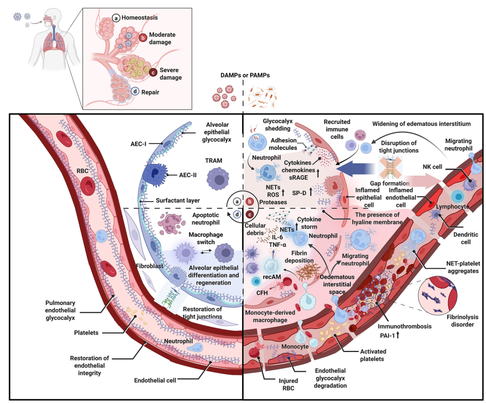
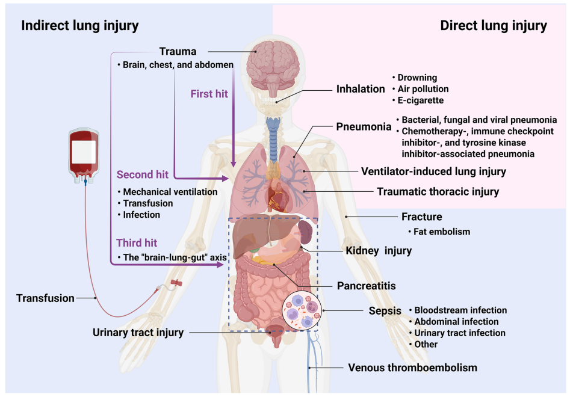
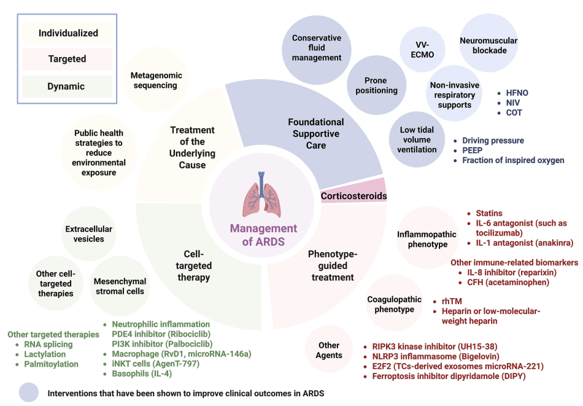

  

    

      
Khuyến Cáo Class I

      
Khuyến cáo chẩn đoán và phân tầng nguy cơ theo tiêu chuẩn MBM 2026.

    

    

      
Bằng Chứng Mức A

      
Khởi trị dược lý và tối ưu hóa liều dùng chuẩn y học chứng cứ.

    

    

      
Mục Tiêu & Theo Dõi

      
Đánh giá đáp ứng lâm sàng, theo dõi an toàn và chỉ số xét nghiệm đích.

    

    

      
Cảnh Báo An Toàn

      
Phòng ngừa biến chứng nặng và bẫy lâm sàng thường gặp trong thực hành.

    

  

<section class="pillars">
    

      

        
🫁

        

          
Driving Pressure Cốt Lõi

          
Low VT (4-8 mL/kg) + Pplat &lt; 30 cmH2O. Tối ưu Driving Pressure (Pplat - PEEP) giảm tối đa VILI.

        

      

      

        
🌍

        

          
Định Nghĩa Toàn Cầu 2023

          
Chấp nhận SpO2/FiO2 (&amp;le;97%), Siêu âm phổi (LUS) &amp; ARDS không đặt ETT thở HFNO (&amp;ge;30 L/phút).

        

      

      

        
🧬

        

          
Cá Thể Hóa "Treatable Traits"

          
Phân loại kiểu hình Viêm mạnh (Hyper-) vs Viêm nhẹ (Hypo-), Proteomics C1-C3, Tế bào MSCs &amp; Đích phân tử mới.

        

      

    

  </section>

  
  

    
    <article class="sec-card" id="sec-1">
      
🩺 <h2 class="sec-title">1. Cơ Sở Sinh Lý Học Của Các Can Thiệp Hỗ Trợ Hô Hấp Nền Tảng</h2>

      

        
Hiểu rõ cơ chế sinh lý giúp bác sĩ thoát khỏi công thức máy móc và thực hiện cá thể hóa điều trị tại giường bệnh:

        
        

          

            

              
<i class="fa-solid fa-gauge-high"></i>

              
Thông Khí Bảo Vệ Phổi (Low VT &amp; Driving Pressure)

            

            

              • Mục tiêu tối thượng: Ngăn chặn <strong>VILI (Ventilator-induced lung injury)</strong>. 
              • Duy trì <strong>Low VT (4–8 mL/kg IBW)</strong> và <strong>Pplat &lt; 30 cmH2O</strong> ngăn Barotrauma &amp; Volutrauma. 
              • <strong>Tối ưu hóa Áp lực đẩy (Driving Pressure = Pplat – PEEP):</strong> Giảm VT đơn thuần chưa đủ; Driving Pressure là yếu tố tiên lượng độc lập quan trọng nhất giảm ứng suất cơ học (stress/strain) lên nhu mô phổi.
            

          

          

            

              
<i class="fa-solid fa-person-praying"></i>

              
Tư Thế Nằm Sấp (Prone Positioning)

            

            

              • Tối ưu hóa tương hợp thông khí - tưới máu <strong>(V/Q matching)</strong>. 
              • Phân phối lại tỷ lệ khí-trên-mô đồng đều theo trục thấp-cao (dependent-nondependent axis). 
              • Huy động các phế nang bị xẹp vùng thấp (recruitment of dependent lung regions) và giảm căng giãn quá mức vùng phổi lành.
            

          

          

            

              
<i class="fa-solid fa-wind"></i>

              
Oxy Dòng Cao Qua Mũi (HFNO)

            

            

              • Giảm khoảng chết giải phẫu hầu họng, cung cấp <strong>PEEP nhẹ (3–5 cmH2O)</strong>. 
              • Đáp ứng nhu cầu dòng đỉnh (peak inspiratory flow) của bệnh nhân tự thở, làm giảm công thở và nỗ lực hô hấp hiệu quả.
            

          

        

        
        <figure class="fig-card" style="margin: 1.25rem 0 0; background: var(--surface-2); border: 1px solid var(--border-light); border-radius: 14px; padding: 1rem; text-align: center;">
          
          <figcaption style="margin-top: 0.65rem; font-size: 0.81rem; color: var(--text-muted); font-style: italic; line-height: 1.5;">
            <strong>Hình 1 (Molecular Biomedicine 2026):</strong> Tóm tắt cơ sở sinh lý học tác động của Thông khí Low VT, Driving Pressure, Tư thế Nằm sấp (Prone V/Q matching) và Oxy dòng cao (HFNO) giúp hạn chế tối đa VILI và giảm công thở.
          </figcaption>
        </figure>
      

    </article>

    
    <article class="sec-card" id="sec-2">
      
📜 <h2 class="sec-title">2. Tiến Trình Tiến Hóa Tiêu Chuẩn Chẩn Đoán &amp; Định Nghĩa Toàn Cầu 2023</h2>

      

        <h3 style="font-family:'Plus Jakarta Sans',sans-serif; font-size:0.9rem; font-weight:700; margin-bottom:0.5rem; color:var(--text);">A. Tiến trình lịch sử chẩn đoán ARDS (1967 – 2023)</h3>
        
        

          

            
1967

            
Báo cáo Ashbaugh đầu tiên mô tả các triệu chứng cơ bản: Thở nhanh, giảm oxy máu, giảm độ giãn nở phổi.

          

          

            
1988

            
<strong>Lung Injury Score</strong> ra đời, tích hợp thâm nhiễm X-quang và mức PEEP.

          

          

            
1994

            
Tiêu chuẩn <strong>AECC</strong> đưa ra khái niệm Tổn thương phổi cấp (ALI) và ngưỡng PaO2/FiO2.

          

          

            
2012

            
<strong>Định nghĩa Berlin</strong> thiết lập khung thời gian cấp tính (7 ngày), yêu cầu PEEP &amp;ge; 5 cmH2O trên thở máy xâm lấn/không xâm lấn.

          

          

            
2015

            
<strong>Sửa đổi Kigali</strong> mở đường chẩn đoán tại nơi thiếu nguồn lực (không bắt buộc PEEP).

          

          

            
2023 (Bước Ngoặt)

            
<strong>Định nghĩa Toàn cầu (Global Definition 2023)</strong> chính thức ban hành, mở rộng chẩn đoán bao trùm.

          

        

        
        <figure class="fig-card" style="margin: 1.25rem 0; background: var(--surface-2); border: 1px solid var(--border-light); border-radius: 14px; padding: 1rem; text-align: center;">
          
          <figcaption style="margin-top: 0.65rem; font-size: 0.81rem; color: var(--text-muted); font-style: italic; line-height: 1.5;">
            <strong>Hình 3 (Molecular Biomedicine 2026):</strong> Tiến trình tiến hóa tiêu chuẩn chẩn đoán ARDS từ Ashbaugh (1967), LIS (1988), AECC (1994), Berlin (2012), Kigali (2015) đến Định nghĩa Toàn cầu (Global Definition 2023) mở rộng chẩn đoán bằng Siêu âm phổi (LUS), SpO2/FiO2 và ARDS không đặt ETT (HFNO &amp;ge; 30 L/min).
          </figcaption>
        </figure>

        <h3 style="font-family:'Plus Jakarta Sans',sans-serif; font-size:0.9rem; font-weight:700; margin-top:1.5rem; margin-bottom:0.5rem; color:var(--text);">B. Phân tích 4 trục cốt lõi của Định nghĩa Toàn cầu 2023</h3>
        

          <table class="regimen-table">
            <thead>
              <tr>
                <th style="width: 25%;">Trục Đánh Giá</th>
                <th>Tiêu Chuẩn Đổi Mới Của Định Nghĩa Toàn Cầu 2023</th>
              </tr>
            </thead>
            <tbody>
              <tr>
                <td><strong>1. Thời gian (Timing)</strong></td>
                <td>Khởi phát cấp tính trong vòng <strong>7 ngày</strong> kể từ khi có tổn thương lâm sàng.</td>
              </tr>
              <tr>
                <td><strong>2. Hình ảnh học (Imaging)</strong></td>
                <td>Mở rộng từ X-quang thâm nhiễm 2 bên sang chấp nhận cả <strong>CT ngực</strong> và đặc biệt là <strong>Siêu âm phổi (LUS - Lung Ultrasound)</strong> khi không có sẵn X-quang. *(Lưu ý phụ thuộc năng lực bác sĩ làm LUS)*.</td>
              </tr>
              <tr>
                <td><strong>3. Oxy hóa máu (Oxygenation)</strong></td>
                <td>Chấp nhận chỉ số <strong>SpO2/FiO2</strong> khi không có khí máu động mạch (ABG). Ngưỡng <strong>SpO2 &amp;le; 97%</strong> được chọn để đảm bảo đường cong phân ly Oxy-Hemoglobin nằm ở vùng tuyến tính. *(Cảnh giác sai số ở người da đậm hoặc shock)*.</td>
              </tr>
              <tr>
                <td><strong>4. Áp lực / Hỗ trợ hô hấp</strong></td>
                <td>Bao gồm phân loại <strong>"ARDS không đặt nội khí quản" (Non-intubated ARDS)</strong> cho bệnh nhân thở <strong>HFNO &amp;ge; 30 L/phút</strong> hoặc NIV/CPAP với PEEP &amp;ge; 5 cmH2O.</td>
              </tr>
            </tbody>
          </table>
        

        <h3 style="font-family:'Plus Jakarta Sans',sans-serif; font-size:0.9rem; font-weight:700; margin-top:1.5rem; margin-bottom:0.5rem; color:var(--text);">C. Đối chiếu Khuyến cáo ATS vs ESICM</h3>
        

          <table class="regimen-table">
            <thead>
              <tr>
                <th>Can Thiệp Lâm Sàng</th>
                <th>Mức Độ Đồng Thuận / Bất Đồng Giữa ATS &amp; ESICM</th>
              </tr>
            </thead>
            <tbody>
              <tr>
                <td><strong>Low VT &amp; Pplat &lt; 30 cmH2O</strong></td>
                <td><strong>Đồng thuận mạnh mẽ:</strong> Cả ATS và ESICM đều coi đây là nền tảng bắt buộc.</td>
              </tr>
              <tr>
                <td><strong>Tư thế Nằm sấp (Prone)</strong></td>
                <td><strong>Đồng thuận:</strong> Khuyến cáo mạnh cho ARDS trung bình - nặng (duy trì &gt; 16h/ngày).</td>
              </tr>
              <tr>
                <td><strong>VV-ECMO</strong></td>
                <td><strong>ATS (Conditional) / ESICM (Strong):</strong> Khuyến cáo áp dụng theo tiêu chuẩn nghiên cứu EOLIA.</td>
              </tr>
              <tr>
                <td><strong>Thuốc giãn cơ (NMBA)</strong></td>
                <td><strong>Bất đồng:</strong> ATS ủng hộ dùng sớm trong ARDS nặng (dựa trên ACURASYS). ESICM không khuyến cáo thường quy sau nghiên cứu ROSE.</td>
              </tr>
              <tr>
                <td><strong>Corticosteroids</strong></td>
                <td><strong>Đồng thuận tương đối:</strong> Ưu tiên dùng sớm (như DEXA-ARDS). Dùng muộn (&gt;72-96h như ESCAPe) không có lợi rõ rệt.</td>
              </tr>
              <tr>
                <td><strong>Nghiệm pháp Huy động phế nang (RM)</strong></td>
                <td><strong>Đồng thuận:</strong> Phản đối huy động phế nang kéo dài hoặc dùng áp lực quá cao thường quy.</td>
              </tr>
            </tbody>
          </table>
        

      

    </article>

    
    <article class="sec-card" id="sec-3">
      
🧬 <h2 class="sec-title">3. Phân Loại Kiểu Hình (Phenotypes) &amp; Sự Khu Trú Miễn Dịch</h2>

      

        

          🔬
          

            <strong>Khái niệm Sự Khu Trú Miễn Dịch (Immune Compartmentalization):</strong> 
            Phản ứng viêm hệ thống (máu ngoại vi) và phản ứng viêm tại phế nang/nhu mô phổi diễn tiến theo các quỹ đạo khác biệt. Giải thích tại sao các thử nghiệm ức chế viêm dựa trên IL-6 máu ngoại vi thất bại, do không phản ánh chính xác gánh nặng viêm thực sự trong phổi.
          

        

        

          
          

            

              
<i class="fa-solid fa-fire"></i>

              
Kiểu Hình Lâm Sàng - Phân Tử

            

            

              • <strong>Viêm mạnh (Hyperinflammatory):</strong> Nồng độ cytokine tiền viêm (IL-6, IL-8, TNF) rất cao, thường gặp ở nam, tuổi cao, kèm tổn thương tạng ngoài phổi (AKI, coagulopathy). Tử vong cao nhưng đáp ứng rất tốt với liệu pháp kháng viêm mạnh. 
              • <strong>Viêm nhẹ (Hypoinflammatory):</strong> Nồng độ dấu ấn viêm thấp hơn, tiên lượng phục hồi tốt hơn.
            

          

          
          

            

              
<i class="fa-solid fa-dna"></i>

              
Kiểu Hình Dựa Trên Omics

            

            

              • <strong>Proteomics (3 phân nhóm):</strong> 
              - <em>C1:</em> Kích hoạt miễn dịch bẩm sinh mạnh mẽ. 
              - <em>C2:</em> Ức chế miễn dịch &amp; phục hồi chống viêm. 
              - <em>C3:</em> Trạng thái trung gian. 
              • <strong>Genomics:</strong> Biến thể di truyền gene <em>HMGCR</em> (chuyển hóa cholesterol) làm tăng cảm nhiễm ARDS. 
              • <strong>Metagenomics:</strong> Kiểu hình viêm mạnh chồng lấp với dấu ấn đáp ứng nhiễm trùng (SRS1/SRS2).
            

          

        

        

          ⏳
          

            <strong>Kiểu hình Động (Dynamic Phenotyping):</strong> 
            Kiểu hình ARDS không phải là trạng thái tĩnh mà biến đổi liên tục theo thời gian. Kiểu hình <strong>Viêm mạnh</strong> có tính mất ổn định tạm thời rất cao, có thể nhanh chóng chuyển sang ức chế miễn dịch. Do đó, <strong>Corticosteroids</strong> mang lại lợi ích trong giai đoạn viêm mạnh nhưng có thể gây hại nếu lạm dụng ở nhóm viêm nhẹ hoặc khi bệnh nhân đã chuyển sang giai đoạn phục hồi.
          

        

        
        <figure class="fig-card" style="margin: 1.25rem 0 0; background: var(--surface-2); border: 1px solid var(--border-light); border-radius: 14px; padding: 1rem; text-align: center;">
          
          <figcaption style="margin-top: 0.65rem; font-size: 0.81rem; color: var(--text-muted); font-style: italic; line-height: 1.5;">
            <strong>Hình 4–6 (Molecular Biomedicine 2026):</strong> Tích hợp dữ liệu sinh lý, lâm sàng và Omics (Proteomics C1-C3) để phân tầng kiểu hình Viêm mạnh vs Viêm nhẹ, nhắm vào các đặc điểm có thể điều trị (Treatable Traits: RIPK3, NLRP3, TRAMs) và mô hình thử nghiệm nền tảng thích ứng (Adaptive Platform Trials PANTHER).
          </figcaption>
        </figure>
      

    </article>

    
    <article class="sec-card" id="sec-4">
      
🧫 <h2 class="sec-title">4. Liệu Pháp Tế Bào Gốc Trung Mô (MSCs) &amp; Túi Ngoại Bào (EVs)</h2>

      

        
Tế bào gốc trung mô (MSCs) là hệ thống điều biến miễn dịch thông minh đa mục tiêu: Tăng biểu hiện <strong>CD24</strong> để tái lập trình neutrophil sang kiểu kháng viêm, tiết <strong>PGE2</strong> phân cực đại thực bào M1 &amp;rarr; M2, ức chế bão cytokine của tế bào T và NK.

        <h3 style="font-family:'Plus Jakarta Sans',sans-serif; font-size:0.9rem; font-weight:700; margin-top:1.25rem; margin-bottom:0.5rem; color:var(--text);">Bảng tổng hợp Bằng chứng Thử nghiệm Lâm sàng MSCs (Table 2):</h3>
        

          <table class="regimen-table">
            <thead>
              <tr>
                <th>Thử Nghiệm &amp; Mã Số</th>
                <th>Đối Tượng Bệnh Nhân</th>
                <th>Liều Dùng &amp; Đường Dùng</th>
                <th>Kết Quả Lâm Sàng Chính</th>
              </tr>
            </thead>
            <tbody>
              <tr>
                <td><strong>STAT</strong> NCT03818854</td>
                <td>ARDS vừa - nặng</td>
                <td>10 &amp;times; 10⁶ tế bào/kg (IV)</td>
                <td>Chung cuộc âm tính về chỉ số oxy hóa (OI), nhưng phân tích dưới nhóm dựa theo dấu ấn sinh học cho thấy triển vọng lớn ở nhóm đích.</td>
              </tr>
              <tr>
                <td><strong>REALIST-COVID</strong> NCT03042143</td>
                <td>COVID-19 ARDS</td>
                <td>400 &amp;times; 10⁶ tế bào (IV)</td>
                <td>An toàn, nhưng không cải thiện đáng kể chức năng phổi trong ngắn hạn. *(Theo dõi 2 năm cần cảnh giác nguy cơ ác tính)*.</td>
              </tr>
              <tr>
                <td><strong>NCT04371393</strong></td>
                <td>COVID-19 ARDS</td>
                <td>2 &amp;times; 10⁶ tế bào/kg (2 liều IV)</td>
                <td>Không cải thiện tỷ lệ tử vong 30 ngày.</td>
              </tr>
              <tr>
                <td><strong>NCT04615429</strong></td>
                <td>COVID-19 ARDS</td>
                <td>1 &amp;times; 10⁶ tế bào/kg (IV)</td>
                <td>Có thể đẩy nhanh quá trình phục hồi chức năng phổi và rút ngắn thời gian xuất viện.</td>
              </tr>
            </tbody>
          </table>
        

        

          ⚠️
          

            <strong>Thách thức &amp; Rào cản Chuyển dịch Lâm sàng MSCs:</strong> 
            • <strong>MSC licensing:</strong> MSCs bắt buộc phải được "kích hoạt" bởi chính vi môi trường viêm tại phổi mới thực hiện chức năng điều hòa. 
            • <strong>Tương tác với Corticosteroid:</strong> Dùng đồng thời corticosteroid có thể làm lu mờ hoặc giảm hiệu năng kháng viêm/chống xơ hóa của MSCs.
          

        

      

    </article>

    
    <article class="sec-card" id="sec-5">
      
🎯 <h2 class="sec-title">5. Triết Lý "Treatable Traits" &amp; Thiết Kế Thử Nghiệm Lâm Sàng Tương Lai</h2>

      

        
Quản lý ARDS hiện đại dịch chuyển sang khung quản lý dựa trên các **"Đặc điểm có thể điều trị" (Treatable Traits)**, can thiệp trúng đích phân tử:

        

          

            

              
<i class="fa-solid fa-crosshairs"></i>

              
Các Đích Phân Tử Mới

            

            

              • <strong>Neutrophil:</strong> Ức chế PDE4 (Ribociclib) &amp; PI3K (Palbociclib) giảm stress oxy hóa. 
              • <strong>Đại thực bào nhu mô (TRAMs):</strong> Resolvin D1 (RvD1) thúc đẩy tự làm mới &amp; thực bào. 
              • <strong>Chống tử vong tế bào:</strong> Ức chế <strong>RIPK3 (UH15-38)</strong> ngăn Necroptosis; ức chế <strong>NLRP3 (Bigelovin)</strong>; Dipyridamole ngăn Ferroptosis. 
              • <strong>Miễn dịch chuyên biệt:</strong> Tế bào iNKT (AgenT-797), IL-4 tác động lên Basophils.
            

          

          

            

              
<i class="fa-solid fa-diagram-next"></i>

              
Thử Nghiệm Thích Ứng (Precision RCTs)

            

            

              • <strong>Prognostic &amp; Predictive enrichment:</strong> Tuyển chọn bệnh nhân nguy cơ cao và có đúng cơ chế phân tử đích của thuốc. 
              • <strong>Adaptive platform trials (ví dụ PANTHER trial):</strong> Đánh giá nhiều thuốc cùng lúc, điều chỉnh phân nhóm theo dữ liệu kiểu hình thời gian thực. 
              • Mô hình hóa tác động điều trị cá thể (ITE - Individualized Treatment Effect).
            

          

        

        

          🏥
          

            <strong>Gói ABCDEF Bundle &amp; Chăm sóc Dài hạn Sau ARDS:</strong> 
            Di chứng thể chất, nhận thức và tâm lý (PICS - Post Intensive Care Syndrome) có thể kéo dài tới 5 năm. Bắt buộc áp dụng triệt để <strong>ABCDEF bundle</strong> trong ICU để giảm thiểu tổn thương do điều trị (sảng, yếu cơ hồi sức) và phối hợp phục hồi chức năng đa chuyên khoa.
          

        

        
        

          <strong>Trích dẫn AMA chuẩn:</strong> 
          Tan D, Zhou J, Li L, Zhong Y, Cheng Z, Yang T. The Acute Respiratory Distress Syndrome (ARDS): epidemiology, etiology, molecular mechanisms, diagnosis and therapeutic strategies. <em>Molecular Biomedicine</em>. 2026;7:130. doi:10.1186/s43556-026-00532-2.
        

        

          <a href="#/ebm/kho-guidelines" class="btn btn-primary"><i class="fa-solid fa-arrow-left"></i> Quay lại Kho Guidelines</a>
          <a href="2026-icm-namsap-ards.html" class="btn"><i class="fa-solid fa-lungs"></i> Xem Bài Tóm Tắt Nằm Sấp Trong ARDS (ICM 2026)</a>
        

      

    </article>

  

