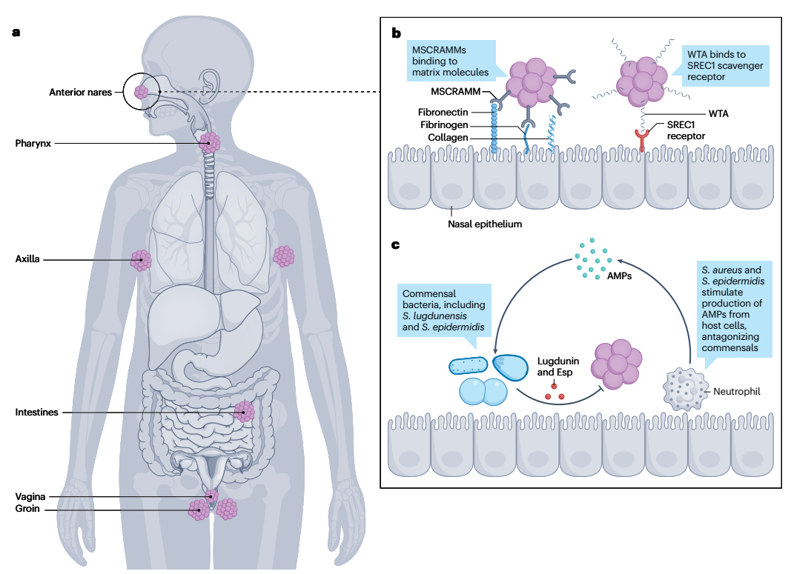
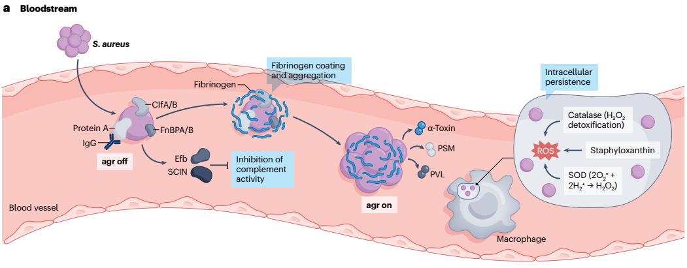
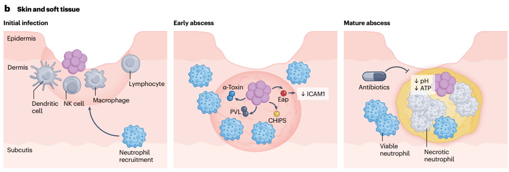
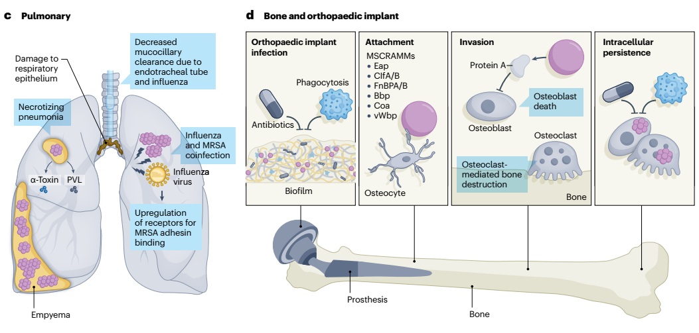

    

      

        
&gt;130.000

        
Ca tử vong toàn cầu / năm do nhiễm khuẩn MRSA (năm 2021)

      

      

        
74% Giảm

        
Tỷ lệ nhiễm khuẩn huyết MRSA tại Mỹ (2005–2016) nhờ kiểm soát dòng USA100

      

      

        
400 – 600

        
Mục tiêu AUC/MIC chuẩn của Vancomycin nhằm tối ưu diệt khuẩn &amp; bảo vệ thận

      

      

        
1 Giờ &amp;rarr; 1,7 Ngày

        
Real-time PCR mecA/mecC rút ngắn 1,7 ngày tiếp cận kháng sinh thích hợp

      

    

  

  
  

    
    

      

        

          
<i class="fa-solid fa-earth-americas"></i>

          

            
1. Đại Cương Lâm Sàng, Gánh Nặng Bệnh Tật &amp; Dịch Tễ Học Toàn Cầu

            
Sự chuyển dịch từ HA-MRSA sang CA-MRSA và biến động dịch tễ các dòng khuẩn

          

        

        Dịch tễ học 2026
      

      

        

          

            

            
<i class="fa-solid fa-virus"></i> Bản Chất &amp; Phổ Bệnh Lý Lâm Sàng

            

              
<strong><em>Staphylococcus aureus</em> kháng Methicillin (MRSA)</strong> là nguyên nhân hàng đầu gây nhiễm trùng kháng thuốc đe dọa tính mạng trên toàn cầu, chịu trách nhiệm cho <strong>&gt;130.000 ca tử vong</strong> vào năm 2021.

              <ul>
<ul style="margin-left: 1.25rem; margin-bottom: 1rem; line-height: 1.65;">
                <li><strong>Nhiễm trùng da và mô mềm (SSTIs):</strong> Từ chốc lở, nhọt, áp-xe nông đến viêm mô tế bào hoại tử lan tỏa.</li>
                <li><strong>Nhiễm trùng xâm lấn nặng:</strong> Nhiễm khuẩn huyết (BSI), viêm phổi hoại tử cộng đồng/thở máy (PNA), viêm xương tủy (osteomyelitis), viêm khớp nhiễm khuẩn, viêm nội tâm mạc nhiễm khuẩn (IE) và nhiễm trùng thiết bị cấy ghép nhân tạo.</li>
                <li><strong>Khả năng chuyển đổi:</strong> Vi khuẩn chuyển nhanh từ vi sinh vật hội sinh trên da/niêm mạc sang tác nhân xâm lấn hủy hoại tế bào nhờ hệ thống độc lực bám dính, né tránh miễn dịch và tiết độc tố ly giải mô.</li>
              </ul>
            

          

          

            

            
<i class="fa-solid fa-dna"></i> Tiến Trình Chuyển Dịch Dòng Khuẩn

            

              
<strong>Sự hòa lẫn ranh giới giữa CA-MRSA và HA-MRSA:</strong>

              <ul>
<ul style="margin-left: 1.25rem; margin-bottom: 1rem; line-height: 1.65;">
                <li><strong>Trước thập kỷ 1990:</strong> MRSA chủ yếu là nhiễm trùng bệnh viện (HA-MRSA, dòng USA100 kinh điển).</li>
                <li><strong>Thập kỷ 1990:</strong> Bùng phát dòng mắc phải tại cộng đồng (CA-MRSA). Dòng <strong>USA400</strong> xuất hiện đầu tiên tại Bắc Mỹ, sau đó bị thay thế bởi <strong>USA300</strong> có độc lực vượt trội.</li>
                <li><strong>Hiện tại:</strong> Dòng USA300 đã xâm nhập ngược trở lại vào môi trường bệnh viện, làm mờ đi ranh giới phân định nguồn gốc lây truyền.</li>
              </ul>
            

          

        

        
Phân Bố Đặc Trưng Theo Vùng Miền Toàn Cầu

        

          

            

            
<i class="fa-solid fa-flag-usa"></i> Bắc &amp; Nam Mỹ

            

              <ul>
<ul style="margin-left: 1.25rem; margin-bottom: 1rem; line-height: 1.65;">
                <li><strong>Hoa Kỳ:</strong> Tỷ lệ nhiễm khuẩn huyết MRSA giảm <strong>74% (2005–2016)</strong> nhờ kiểm soát dòng USA100, trong khi MSSA ổn định. USA300 vẫn chiếm ưu thế.</li>
                <li><strong>Nam Mỹ:</strong> Dòng <strong>USA300-LV</strong> (biến thể Mỹ Latinh) chiếm ưu thế phía bắc; dòng ST5 ở Peru và ST105-II tăng mạnh ở Brazil.</li>
              </ul>
            

          

          

            

            
<i class="fa-solid fa-earth-europe"></i> Châu Âu

            

              <ul>
<ul style="margin-left: 1.25rem; margin-bottom: 1rem; line-height: 1.65;">
                <li>Tỷ lệ kháng Methicillin dao động từ <strong>&lt;5% ở Bắc Âu / Hà Lan</strong> (nhờ chiến lược "Search and Destroy") đến <strong>&gt;45% ở Nam Âu</strong>.</li>
                <li>Dòng HA-MRSA chiếm ưu thế là <strong>EMRSA-15 (ST22-IV)</strong>. Dòng liên quan vật nuôi <strong>LA-ST398</strong> đã tiến hóa lây truyền từ người sang người.</li>
              </ul>
            

          

          

            

            
<i class="fa-solid fa-earth-asia"></i> Châu Á &amp; Châu Phi

            

              <ul>
<ul style="margin-left: 1.25rem; margin-bottom: 1rem; line-height: 1.65;">
                <li><strong>Châu Á:</strong> 9% nhân viên y tế Nam Á mang trùng. Giảm mạnh dòng HA-ST239 tại Nhật Bản và Trung Quốc, xuất hiện dòng ST398 thích ứng ở người.</li>
                <li><strong>Châu Phi:</strong> Tỷ lệ lưu hành MRSA trong bệnh phẩm đạt trung bình <strong>42%</strong>, với dòng ST-88 ("African clone") phân bố rộng khắp.</li>
              </ul>
            

          

        

        
Phân Tầng Yếu Tố Nguy Cơ Mắc MRSA

        

          

            
<i class="fa-solid fa-users"></i>

            

              Yếu Tố Nguy Cơ Nhiễm Trùng Cộng Đồng (CA-MRSA)
              Nam giới, tuổi &gt;65, sử dụng ma túy tiêm chích, sinh sống trong điều kiện đông đúc (trại lính, nhà tù), vận động viên thể thao tiếp xúc trực tiếp da-da, người nhiễm HIV, người vô gia cư/tị nạn, kinh tế xã hội thấp.
            

          

          

            
<i class="fa-solid fa-hospital-user"></i>

            

              Yếu Tố Nguy Cơ Nhiễm Trùng Bệnh Viện (HA-MRSA)
              Tiền sử cư trú MRSA, đặt catheter tĩnh mạch trung tâm, suy thận mạn/chạy thận nhân tạo, nằm viện điều trị kéo dài, sống tại viện dưỡng lão, suy giảm miễn dịch (ung thư, ghép tạng, corticoid) và mang thiết bị cấy ghép nhân tạo.
            

          

        

      

    

    
    

      

        

          
<i class="fa-solid fa-shield-halved"></i>

          

            
2. Cơ Chế Sinh Học Phân Tử Đề Kháng Methicillin &amp; Các Thể Kiểu Hình Đặc Biệt

            
Đảo di truyền SCCmec, protein biến đổi PBP2a, và các biến thể BORSA, MOD-SA, OS-MRSA

          

        

        Cơ chế phân tử
      

      

        

          

            

            
<i class="fa-solid fa-dna"></i> Đảo Di Truyền SCCmec &amp; Gen <em>mec</em>

            

              <ul>
<ul style="margin-left: 1.25rem; margin-bottom: 1rem; line-height: 1.65;">
                <li><strong>Gen <em>mecA</em>:</strong> Thu nhận qua đảo di truyền SCCmec từ tụ cầu coagulase âm tính (những năm 1940), mã hóa protein <strong>PBP2a</strong> có ái lực cực thấp với &amp;beta;-lactam.</li>
                <li><strong>Gen <em>mecC</em>:</strong> Chỉ có <strong>69% độ đồng dạng</strong> với <em>mecA</em>, <strong>không thể phát hiện bằng PCR <em>mecA</em> thông thường</strong>.</li>
                <li><strong>Gen <em>mecB</em>:</strong> Nằm trên plasmid thu nhận từ <em>Macrococcus</em>, rất hiếm gặp lâm sàng.</li>
              </ul>
            

          

          

            

            
<i class="fa-solid fa-triangle-exclamation"></i> Thể Kháng Không Phụ Thuộc <em>mec</em>

            

              <ul>
<ul style="margin-left: 1.25rem; margin-bottom: 1rem; line-height: 1.65;">
                <li><strong>BORSA (Borderline oxacillin-resistant <em>S. aureus</em>):</strong> MIC oxacillin 1–8 &amp;mu;g/mL do đột biến điều hòa &amp;beta;-lactamase dẫn tới <strong>tăng tiết quá mức &amp;beta;-lactamase</strong>.</li>
                <li><strong>MOD-SA (Modified <em>S. aureus</em>):</strong> MIC oxacillin &gt;4–8 &amp;mu;g/mL do đột biến gen <em>gdpP</em> hoặc <em>yjbH</em> dẫn tới <strong>tăng sản xuất PBP4</strong> mà không cần gen <em>mec</em>.</li>
              </ul>
            

          

          

            

            
<i class="fa-solid fa-masks-theater"></i> OS-MRSA &amp; Heteroresistance

            

              <ul>
<ul style="margin-left: 1.25rem; margin-bottom: 1rem; line-height: 1.65;">
                <li><strong>OS-MRSA (Oxacillin-susceptible MRSA):</strong> Mang gen <em>mec</em> nhưng nhạy cảm giả tạo với Oxacillin/Cefoxitin trên đĩa cấy do đột biến RNA polymerase/điều hòa <em>mecA</em>.</li>
                <li><strong>Cảnh báo:</strong> Tái bùng phát kháng thuốc rất nhanh khi gặp Oxacillin. <strong>Bắt buộc điều trị như MRSA thực thụ!</strong></li>
                <li><strong>Heteroresistance:</strong> EUCAST khuyến cáo dùng <strong>Cefoxitin</strong> làm chất cảm ứng tốt nhất.</li>
              </ul>
            

          

        

        
        

          <svg viewBox="0 0 940 380" width="100%" height="100%" style="max-width: 900px; font-family: 'Plus Jakarta Sans', sans-serif;">
            <defs>
              <linearGradient id="grad-sa" x1="0%" y1="0%" x2="100%" y2="100%">
                <stop offset="0%" stop-color="#0284c7"/>
                <stop offset="100%" stop-color="#0369a1"/>
              </linearGradient>
              <linearGradient id="grad-mec" x1="0%" y1="0%" x2="100%" y2="100%">
                <stop offset="0%" stop-color="#dc2626"/>
                <stop offset="100%" stop-color="#b91c1c"/>
              </linearGradient>
              <linearGradient id="grad-nonmec" x1="0%" y1="0%" x2="100%" y2="100%">
                <stop offset="0%" stop-color="#d97706"/>
                <stop offset="100%" stop-color="#b45309"/>
              </linearGradient>
            </defs>

            
            <rect x="360" y="15" width="220" height="46" rx="10" fill="url(#grad-sa)"/>
            <text x="470" y="44" font-size="14" font-weight="700" fill="#ffffff" text-anchor="middle">STAPHYLOCOCCUS AUREUS</text>

            
            <path d="M 420 61 L 420 95 L 240 95 L 240 120" fill="none" stroke="#dc2626" stroke-width="2.5"/>
            <text x="290" y="88" font-size="11" font-weight="700" fill="#dc2626">Thu nhận SCCmec (mecA / mecC)</text>

            
            <path d="M 520 61 L 520 95 L 700 95 L 700 120" fill="none" stroke="#d97706" stroke-width="2.5"/>
            <text x="650" y="88" font-size="11" font-weight="700" fill="#d97706">Không có gen mec (Đột biến)</text>

            
            <rect x="50" y="120" width="180" height="70" rx="8" fill="var(--surface)" stroke="#dc2626" stroke-width="1.5"/>
            <text x="140" y="145" font-size="12" font-weight="700" fill="var(--color-text, #0f172a)" text-anchor="middle">Gen mecA (Đảo SCCmec)</text>
            <text x="140" y="165" font-size="11" fill="var(--color-text-muted, #64748b)" text-anchor="middle">Mã hóa protein biến đổi PBP2a</text>
            <text x="140" y="180" font-size="10" fill="#059669" font-weight="600" text-anchor="middle">Bắt được bằng PCR mecA</text>

            <rect x="250" y="120" width="180" height="70" rx="8" fill="var(--surface)" stroke="#dc2626" stroke-width="1.5"/>
            <text x="340" y="145" font-size="12" font-weight="700" fill="var(--color-text, #0f172a)" text-anchor="middle">Gen mecC (Đồng dạng 69%)</text>
            <text x="340" y="165" font-size="11" fill="var(--color-text-muted, #64748b)" text-anchor="middle">Mã hóa PBP2a biến thể</text>
            <text x="340" y="180" font-size="10" fill="#dc2626" font-weight="700" text-anchor="middle">ÂM TÍNH trên PCR mecA thường</text>

            
            <rect x="530" y="120" width="170" height="70" rx="8" fill="var(--surface)" stroke="#d97706" stroke-width="1.5"/>
            <text x="615" y="145" font-size="12" font-weight="700" fill="var(--color-text, #0f172a)" text-anchor="middle">BORSA (Borderline)</text>
            <text x="615" y="165" font-size="11" fill="var(--color-text-muted, #64748b)" text-anchor="middle">Tăng tiết quá mức &amp;beta;-lactamase</text>
            <text x="615" y="180" font-size="10" fill="#d97706" font-weight="600" text-anchor="middle">MIC Oxacillin: 1–8 &amp;mu;g/mL</text>

            <rect x="720" y="120" width="170" height="70" rx="8" fill="var(--surface)" stroke="#d97706" stroke-width="1.5"/>
            <text x="805" y="145" font-size="12" font-weight="700" fill="var(--color-text, #0f172a)" text-anchor="middle">MOD-SA (Modified)</text>
            <text x="805" y="165" font-size="11" fill="var(--color-text-muted, #64748b)" text-anchor="middle">Đột biến gdpP/yjbH &amp;rarr; Tăng PBP4</text>
            <text x="805" y="180" font-size="10" fill="#d97706" font-weight="600" text-anchor="middle">MIC Oxacillin: &gt;4–8 &amp;mu;g/mL</text>

            
            <path d="M 140 190 L 140 225 L 240 225 L 240 240" fill="none" stroke="#dc2626" stroke-width="2"/>
            <path d="M 340 190 L 340 225 L 240 225 L 240 240" fill="none" stroke="#dc2626" stroke-width="2"/>

            <rect x="50" y="240" width="380" height="55" rx="10" fill="var(--red-bg)" stroke="#dc2626" stroke-width="2"/>
            <text x="240" y="263" font-size="13" font-weight="800" fill="#991b1b" text-anchor="middle">PBP2a: ÁI LỰC CỰC THẤP VỚI &amp;beta;-LACTAM</text>
            <text x="240" y="282" font-size="11" font-weight="600" fill="var(--color-text, #0f172a)" text-anchor="middle">Kháng toàn bộ Penicillin chống tụ cầu &amp; Cephalosporin thế hệ 1–4</text>

            
            <path d="M 140 295 L 140 320" fill="none" stroke="#059669" stroke-width="2"/>
            <path d="M 340 295 L 340 320" fill="none" stroke="#7c3aed" stroke-width="2"/>

            <rect x="50" y="320" width="180" height="48" rx="8" fill="var(--surface)" stroke="#059669" stroke-width="1.5"/>
            <text x="140" y="340" font-size="11" font-weight="700" fill="#065f46" text-anchor="middle">MRSA Điển Hình</text>
            <text x="140" y="356" font-size="10" fill="var(--color-text-muted, #64748b)" text-anchor="middle">Kháng Oxacillin &amp; Cefoxitin</text>

            <rect x="250" y="320" width="180" height="48" rx="8" fill="var(--surface)" stroke="#7c3aed" stroke-width="1.5"/>
            <text x="340" y="338" font-size="11" font-weight="700" fill="#5b21b6" text-anchor="middle">OS-MRSA (Ẩn Danh)</text>
            <text x="340" y="352" font-size="9.5" fill="#dc2626" font-weight="700" text-anchor="middle">Nhạy cảm giả tạo &amp;rarr; Bùng phát lại</text>

            
            <rect x="530" y="240" width="360" height="128" rx="10" fill="var(--blue-bg)" stroke="#2563eb" stroke-width="1.5"/>
            <text x="710" y="268" font-size="12" font-weight="800" fill="#1e40af" text-anchor="middle">KHUYẾN CÁO XÉT NGHIỆM EUCAST / CLSI</text>
            <text x="710" y="292" font-size="11" fill="var(--color-text, #0f172a)" text-anchor="middle">&amp;bull; Sử dụng CEFOXITIN làm chất cảm ứng tốt nhất</text>
            <text x="710" y="312" font-size="11" fill="var(--color-text, #0f172a)" text-anchor="middle">&amp;bull; Phát hiện chính xác cả mecA và mecC</text>
            <text x="710" y="332" font-size="11" fill="var(--color-text, #0f172a)" text-anchor="middle">&amp;bull; Cefoxitin kích thích biểu hiện gen PBP2a mạnh mẽ</text>
            <text x="710" y="352" font-size="10.5" font-weight="700" fill="#dc2626" text-anchor="middle">&amp;bull; Không dùng Oxacillin để sàng lọc do tỷ lệ bỏ sót cao</text>
          </svg>
          
Sơ đồ 1: Cơ chế sinh học phân tử đề kháng &amp;beta;-lactam ở MRSA và các thể kiểu hình liên quan (Nature Reviews 2026).

        

      

    

    
    

      

        

          
<i class="fa-solid fa-bacterium"></i>

          

            
3. Động Học Cư Trú (Colonization Dynamics) &amp; Cạnh Tranh Sinh Học

            
Ổ chứa giải phẫu, phân tử bám dính MSCRAMMs/WTAs và tương tác vi sinh vật cộng sinh

          

        

        Động học cư trú
      

      

        

          

            

            
<i class="fa-solid fa-location-dot"></i> Ổ Chứa Giải Phẫu

            

              <ul>
<ul style="margin-left: 1.25rem; margin-bottom: 1rem; line-height: 1.65;">
                <li><strong>Hốc mũi trước (Anterior nares):</strong> Ổ chứa kinh điển, 1% đến &gt;10% dân số mang trùng; yếu tố nguy cơ độc lập dẫn tới nhiễm trùng xâm lấn.</li>
                <li><strong>Vị trí ngoài mũi (Extranasal):</strong> Phế quản, nách, bẹn, âm đạo.</li>
                <li><strong>Đường tiêu hóa (GI tract):</strong> Ổ chứa quan trọng thường bị bỏ sót, vai trò thậm chí có thể vượt qua hốc mũi trong nhiễm trùng nội sinh.</li>
              </ul>
            

          

          

            

            
<i class="fa-solid fa-link"></i> Phân Tử Bám Dính

            

              <ul>
<ul style="margin-left: 1.25rem; margin-bottom: 1rem; line-height: 1.65;">
                <li><strong>Họ protein MSCRAMMs:</strong> Liên kết đặc hiệu với collagen, fibronectin và fibrinogen ma trận ngoại bào của vật chủ.</li>
                <li><strong>Axit teichoic thành tế bào (WTAs):</strong> Gắn thụ thể scavenger <strong>SREC1</strong> của tế bào biểu mô tỵ hầu sau để thiết lập sự bám dính vững chắc.</li>
              </ul>
            

          

          

            

            
<i class="fa-solid fa-handshake-angle"></i> Cạnh Tranh Sinh Học

            

              <ul>
<ul style="margin-left: 1.25rem; margin-bottom: 1rem; line-height: 1.65;">
                <li><strong><em>S. lugdunensis:</em></strong> Tiết chất kháng khuẩn <strong>Lugdunin</strong>, làm giảm 5–6 lần nguy cơ mang trùng tụ cầu vàng.</li>
                <li><strong><em>S. epidermidis:</em></strong> Tiết serine protease <strong>Esp</strong> phá hủy màng biofilm của tụ cầu vàng.</li>
                <li><strong>Đề kháng AMPs:</strong> <em>S. aureus</em> đổi điện tích màng, tiết staphylokinase trung hòa defensin/LL-37.</li>
              </ul>
            

          

        

        
        <figure class="fig-card">
          
          <figcaption class="fig-caption">
            <strong>Hình 3 (Nature Reviews Disease Primers 2026):</strong> <em>Anatomical reservoirs and mechanisms of Staphylococcus aureus colonization</em>. 
            <strong>a. Các ổ chứa giải phẫu chính:</strong> Hốc mũi trước (Anterior nares - vị trí khảo sát thường quy), hầu họng (Pharynx), nách (Axilla), đường tiêu hóa (Intestines - ổ chứa quan trọng nội sinh), âm đạo (Vagina) và bẹn (Groin). 
            <strong>b. Cơ chế bám dính phân tử:</strong> Họ adhesin MSCRAMMs gắn đặc hiệu với các phân tử nền ngoại bào (Fibronectin, Fibrinogen, Collagen); Axit teichoic thành tế bào (WTA) liên kết với thụ thể scavenger SREC1 trên biểu mô mũi. 
            <strong>c. Cạnh tranh sinh học và đối kháng vi sinh vật cộng sinh:</strong> Vi khuẩn cộng sinh (<em>S. lugdunensis</em> tiết Lugdunin, <em>S. epidermidis</em> tiết Esp) ức chế và phá hủy biofilm tụ cầu; đồng thời <em>S. aureus</em> và <em>S. epidermidis</em> kích thích tế bào biểu mô vật chủ tiết peptide kháng khuẩn (AMPs) để đối kháng các chủng vi sinh vật khác.
          </figcaption>
        </figure>
      

    

    
    

      

        

          
<i class="fa-solid fa-heart-pulse"></i>

          

            
4. Sinh Lý Bệnh Học Các Thể Nhiễm Trùng MRSA Xâm Lấn Sâu

            
Nhiễm khuẩn huyết, áp-xe mô mềm, viêm phổi hoại tử PVL, viêm xương tủy &amp; biofilm thiết bị

          

        

        Sinh lý bệnh sâu
      

      

        
A. Nhiễm Khuẩn Huyết (BSI) &amp; Nhiễm Trùng Da Mô Mềm (SSTI)

        

          
          

            

            
<i class="fa-solid fa-droplet"></i> Nhiễm Khuẩn Huyết (BSI) &amp; Hệ Thống <em>agr</em>

            

              <ul>
<ul style="margin-left: 1.25rem; margin-bottom: 1rem; line-height: 1.65;">
                <li><strong>Giai đoạn bám dính (ức chế <em>agr</em>):</strong> Mật độ thấp làm ức chế hệ thống <em>agr</em>, kích hoạt tối đa các phân tử bám dính MSCRAMM (ClfA, ClfB, FnBPA, FnBPB) bám chặt nội mạc mạch máu.</li>
                <li><strong>Tạo cụm vón Fibrin:</strong> Tiết Coagulase và protein liên kết von Willebrand (vWbp) kích hoạt đông máu tạo kén fibrin che chắn vi khuẩn khỏi thực bào.</li>
                <li><strong>Phát tán di căn (tái kích hoạt <em>agr</em>):</strong> Mật độ cao trong cụm vón kích hoạt lại <em>agr</em>, chuyển sang tiết ồ ạt độc tố tạo lỗ (Alpha-toxin/Hla, PSMs, PVL) ly giải tế bào mô.</li>
                <li><strong>Cơ chế "Trojan Horse":</strong> Vi khuẩn sống sót trong bạch cầu trung tính nhờ catalase, SOD, staphyloxanthin trung hòa ROS; sau đó phá vỡ phagolysosome để phát tán khắp cơ thể.</li>
              </ul>
            

          

          
          

            

            
<i class="fa-solid fa-hand-dots"></i> Nhiễm Trùng Da &amp; Mô Mềm (SSTI)

            

              <ul>
<ul style="margin-left: 1.25rem; margin-bottom: 1rem; line-height: 1.65;">
                <li><strong>Ức chế bạch cầu:</strong> Tiết protein CHIPS và Eap làm giảm biểu hiện phân tử bám dính <strong>ICAM1</strong> trên nội mạc mạch máu, chặn đứng sự huy động bạch cầu trung tính.</li>
                <li><strong>Tạo áp-xe hoại tử:</strong> Độc tố tạo lỗ ly giải tế bào, hình thành ổ mủ có vỏ bọc fibrin dày và lõi hoại tử trung tâm.</li>
                <li><strong>Dung nạp kháng sinh (Low-ATP):</strong> Môi trường áp-xe axit, nghèo dinh dưỡng đẩy MRSA vào trạng thái năng lượng thấp (dung nạp kháng sinh).</li>
                <li><strong>Nguyên tắc vàng:</strong> <strong>Bắt buộc rạch dẫn lưu ngoại khoa</strong> để giải phóng ổ mủ.</li>
              </ul>
            

          

        

        
        

          <figure class="fig-card" style="margin: 0;">
            
            <figcaption class="fig-caption">
              <strong>Hình 4a:</strong> <em>Bloodstream infection (BSI)</em>. 
              • <strong>Giai đoạn đầu (agr tắt):</strong> ClfA/B, FnBPA/B bám dính nội mạc; Protein A gắn Fc của IgG; Efb và SCIN ức chế con đường bổ thể. 
              • <strong>Kén Fibrin:</strong> Coagulase/vWbp kích hoạt đông máu bọc fibrin bảo vệ vi khuẩn. 
              • <strong>Phát tán (agr bật):</strong> Tiết độc tố tạo lỗ &amp;alpha;-toxin, PSMs, PVL. 
              • <strong>Ngựa Trojan:</strong> Sống sót trong đại thực bào nhờ Catalase, SOD và Staphyloxanthin trung hòa các gốc tự do ROS.
            </figcaption>
          </figure>

          <figure class="fig-card" style="margin: 0;">
            
            <figcaption class="fig-caption">
              <strong>Hình 4b:</strong> <em>Skin and soft tissue infection &amp; Abscess formation</em>. 
              • <strong>Nhiễm trùng ban đầu:</strong> MRSA vào lớp trung bì gặp tế bào đuôi gai, NK cell, đại thực bào. 
              • <strong>Ổ áp-xe sớm:</strong> Tiết CHIPS và Eap ức chế ICAM1 ngăn huy động bạch cầu; &amp;alpha;-toxin và PVL ly giải tế bào. 
              • <strong>Ổ áp-xe hoàn chỉnh:</strong> Vỏ fibrin bọc lõi bạch cầu hoại tử; môi trường pH thấp và ATP thấp làm vi khuẩn dung nạp thuốc và ngăn kháng sinh khuếch tán &amp;rarr; Bắt buộc rạch dẫn lưu.
            </figcaption>
          </figure>
        

        
B. Viêm Phổi Hoại Tử &amp; Viêm Xương Tủy / Biofilm Khớp Nhân Tạo

        

          
          

            

            
<i class="fa-solid fa-lungs"></i> Viêm Phổi Hoại Tử &amp; Đồng Nhiễm Vi Rút

            

              <ul>
<ul style="margin-left: 1.25rem; margin-bottom: 1rem; line-height: 1.65;">
                <li><strong>VAP (Viêm phổi thở máy):</strong> Ống nội khí quản làm mất phản xạ ho/nuốt, tạo điều kiện cho MRSA từ hốc mũi di chuyển xuống sâu đường thở.</li>
                <li><strong>Bội nhiễm sau cúm / COVID-19:</strong> Vi rút phá hủy biểu mô hô hấp, liệt nhầy-lông chuyển và bộc lộ ligand cho adhesin của MRSA bám dính.</li>
                <li><strong>Độc tố hoại tử:</strong> <strong>PVL</strong> gây viêm phổi hoại tử xuất huyết tối cấp; <strong>Alpha-toxin</strong> kích hoạt thể viêm NLRP3 inflammasome phá hủy toàn bộ nhu mô phổi.</li>
              </ul>
            

          

          
          

            

            
<i class="fa-solid fa-bone"></i> Viêm Xương Tủy &amp; Biofilm Khớp Nhân Tạo

            

              <ul>
<ul style="margin-left: 1.25rem; margin-bottom: 1rem; line-height: 1.65;">
                <li><strong>Tiêu xương nghiêm trọng:</strong> Protein A gắn nguyên bào xương (osteoblasts) kích hoạt tự hủy, đồng thời kích hoạt tế bào hủy xương (osteoclasts) qua con đường <strong>RANKL</strong>. Sống sót nội bào dai dẳng trong tế bào xương.</li>
                <li><strong>Biofilm trên thiết bị cấy ghép:</strong> Tạo màng exopolysaccharide/lipid/DNA/protein chống lại kháng sinh và miễn dịch.</li>
                <li><strong>Persister cells:</strong> Vi khuẩn nằm sâu trong biofilm rơi vào trạng thái ngủ đông (tế bào dai dẳng), đòi hỏi can thiệp ngoại khoa thay thế thiết bị.</li>
              </ul>
            

          

        

        
        <figure class="fig-card">
          
          <figcaption class="fig-caption">
            <strong>Hình 4c,d (Nature Reviews Disease Primers 2026):</strong> <em>Pathophysiology of pulmonary and bone/orthopaedic implant MRSA infections</em>. 
            <strong>c. Sinh lý bệnh viêm phổi (Pulmonary):</strong> Giảm thanh thải nhầy-lông chuyển do đặt nội khí quản hoặc nhiễm vi rút cúm (Influenza); vi rút cúm phá hủy biểu mô và kích hoạt tăng biểu hiện thụ thể gắn adhesin của MRSA; &amp;alpha;-toxin và PVL gây viêm phổi hoại tử (Necrotizing pneumonia) và tràn mủ màng phổi (Empyema). 
            <strong>d. Nhiễm trùng khớp nhân tạo &amp; xương (Bone and orthopaedic implant):</strong> Màng sinh học (Biofilm) trên bề mặt implant bảo vệ vi khuẩn khỏi thực bào và kháng sinh; phân tử MSCRAMMs (Eap, ClfA/B, FnBPA/B, Bbp, Coa, vWbp) bám tế bào xương (Osteocyte); Protein A ức chế và làm chết nguyên bào xương (Osteoblast death), đồng thời kích thích hủy cốt bào (Osteoclast) qua RANKL gây tiêu xương; vi khuẩn xâm nhập sống sót dai dẳng nội bào (Intracellular persistence).
          </figcaption>
        </figure>
      

    

    
    

      

        

          
<i class="fa-solid fa-clipboard-check"></i>

          

            
5. Quy Trình Chẩn Đoán Cận Lâm Sàng &amp; Phân Tầng Hội Chứng

            
Nuôi cấy, Cefoxitin disk, Real-time PCR, mcfDNA và chẩn đoán hình ảnh chuyên sâu

          

        

        Chẩn đoán vi sinh
      

      

        

          

            
<i class="fa-solid fa-vial"></i>

            

              Nuôi Cấy &amp; MALDI-TOF MS
              Cấy bệnh phẩm đích kết hợp định danh nhanh bằng khối phổ MALDI-TOF MS hoặc hóa sinh. Luôn làm kháng sinh đồ với đĩa <strong>Cefoxitin</strong>.
            

          

          

            
<i class="fa-solid fa-bolt"></i>

            

              Real-Time PCR (Nhanh 1 Giờ)
              Phát hiện trực tiếp <em>S. aureus</em> và gen <em>mecA/mecC</em> từ chai cấy máu dương tính hoặc dịch hô hấp, <strong>rút ngắn 1,7 ngày tiếp cận phác đồ đích</strong>.
            

          

          

            
<i class="fa-solid fa-dna"></i>

            

              Dấu Ấn Tiên Tiến mcfDNA
              Giải trình tự microbial cell-free DNA trong huyết tương phát hiện ổ di căn sâu (viêm nội tâm mạc, viêm đĩa đệm cột sống) còn tiềm ẩn.
            

          

        

        
Bảng 1: Hướng Dẫn Chẩn Đoán Theo Từng Hội Chứng Nhiễm Trùng MRSA (Nature Reviews 2026)

        

          <table class="custom-table">
            <thead>
              <tr>
                <th style="width: 18%;">Hội Chứng</th>
                <th style="width: 25%;">Biểu Hiện Lâm Sàng Điển Hình</th>
                <th style="width: 22%;">Nuôi Cấy &amp; Bệnh Phẩm</th>
                <th style="width: 20%;">Chẩn Đoán Hình Ảnh</th>
                <th style="width: 15%;">Xét Nghiệm Khác</th>
              </tr>
            </thead>
            <tbody>
              <tr>
                <td><strong>Nhiễm trùng da mô mềm (SSTI)</strong></td>
                <td>Áp-xe có mủ, nhọt, viêm da mủ sưng nóng đỏ đau, ranh giới rõ.</td>
                <td>Nhuộm Gram và cấy dịch mủ dẫn lưu từ ổ áp-xe. <strong>Không quệt tăm bông bề mặt da</strong>.</td>
                <td>Siêu âm phát hiện ổ áp-xe sâu; CT/MRI cho viêm cân hoại tử sâu.</td>
                <td>PCR tìm <em>S. aureus</em> &amp; <em>mecA/mecC</em>.</td>
              </tr>
              <tr>
                <td><strong>Viêm phổi (PNA)</strong></td>
                <td>Viêm phổi cộng đồng nặng, hoại tử có hang, suy hô hấp cấp tiến triển nhanh.</td>
                <td>Nhuộm Gram &amp; cấy đờm, dịch hút nội khí quản, BALF hoặc dịch màng phổi.</td>
                <td>X-quang (đông đặc kèm hang hóa); CT ngực đánh giá hoại tử, áp-xe, tràn mủ màng phổi.</td>
                <td>PCR đờm/BALF tìm <em>mecA/mecC</em> và độc tố PVL.</td>
              </tr>
              <tr>
                <td><strong>Nhiễm khuẩn huyết &amp; Viêm nội tâm mạc (BSI/IE)</strong></td>
                <td>Sốt cao rét run, sốc nhiễm khuẩn, tiếng thổi tim mới, tắc mạch di căn.</td>
                <td><strong>Cấy máu ít nhất 2 bộ</strong> từ 2 vị trí tĩnh mạch khác nhau trước khi dùng KS.</td>
                <td><strong>Siêu âm tim bắt buộc:</strong> TTE đầu tiên, làm TEE nếu nghi ngờ cao hoặc TTE âm tính. CT/MRI tìm ổ di căn.</td>
                <td>PCR nhanh chai cấy máu dương tính; mcfDNA huyết tương hoặc 16S rRNA từ van tim.</td>
              </tr>
              <tr>
                <td><strong>Nhiễm trùng xương khớp (B&amp;J)</strong></td>
                <td>Đau xương khu trú dai dẳng, sưng nóng đỏ khớp, hạn chế vận động.</td>
                <td>Cấy sinh thiết xương, dịch khớp hoặc dịch rửa siêu âm đầu dò thiết bị (sonication).</td>
                <td><strong>MRI là lựa chọn hàng đầu</strong> cho viêm tủy xương cột sống; CT đánh giá vỏ xương; X-quang mạn tính.</td>
                <td>PCR tìm <em>mecA/mecC</em> từ dịch khớp / dịch rửa sonication.</td>
              </tr>
            </tbody>
          </table>
        

      

    

    
    

      

        

          
<i class="fa-solid fa-pills"></i>

          

            
6. Phác Đồ Điều Trị Kháng Sinh Nội Khoa &amp; Chiến Lược Phòng Ngừa

            
Tối ưu hóa liều Vancomycin AUC/MIC, Daptomycin, Ceftaroline, Linezolid và khử trùng bệnh viện

          

        

        Phác đồ điều trị
      

      

        

          

            

            
<i class="fa-solid fa-calculator"></i> Vancomycin &amp; Giám Sát Nồng Độ TDM

            

              
Kháng sinh tiêu chuẩn vàng, ức chế tổng hợp thành tế bào qua gắn <em>d-Ala-d-Ala</em>.

              <ul>
<ul style="margin-left: 1.25rem; margin-bottom: 1rem; line-height: 1.65;">
                <li><strong>Mục tiêu TDM hiện đại:</strong> Duy trì <strong>AUC/MIC = 400–600</strong> dựa trên Bayesian software hoặc đo 2 mẫu nồng độ để giảm thiểu độc tính trên thận.</li>
                <li><strong>VISA:</strong> Dày thành tế bào; <strong>VRSA:</strong> Operon <em>vanA</em> biến đổi thành <em>d-Ala-d-Lac</em> (giảm ái lực 1.000 lần). Vancomycin mất hoàn toàn tác dụng.</li>
              </ul>
            

          

          

            

            
<i class="fa-solid fa-ban"></i> Cảnh Báo An Toàn Kháng Sinh Đặc Biệt

            

              <ul>
<ul style="margin-left: 1.25rem; margin-bottom: 1rem; line-height: 1.65;">
                <li>CHỐNG CHỈ ĐỊNH <strong>Daptomycin trong Viêm Phổi:</strong> Thuốc bị bất hoạt hoàn toàn bởi chất diện hoạt phế nang (surfactant). Nguy cơ xuất hiện kháng thuốc 39% nếu BSI dai dẳng không kiểm soát nguồn.</li>
                <li>CẢNH BÁO FDA <strong>Linezolid trong BSI liên quan Catheter:</strong> Tỷ lệ tử vong cao hơn trong thử nghiệm RCT; tuy nhiên lại là lựa chọn số 1 cho viêm phổi MRSA (ZEPHYR: 57% vs 47% Vancomycin).</li>
              </ul>
            

          

        

        
Bảng 2: Tổng Hợp Các Kháng Sinh Điều Trị MRSA Lâm Sàng (Nature Reviews 2026)

        

          <table class="custom-table">
            <thead>
              <tr>
                <th style="width: 15%;">Kháng Sinh</th>
                <th style="width: 20%;">Cơ Chế Hoạt Động</th>
                <th style="width: 25%;">Tác Dụng Phụ &amp; Cảnh Báo</th>
                <th style="width: 25%;">Phổ Chỉ Định Hội Chứng</th>
                <th style="width: 15%;">Hiệu Quả VISA / VRSA</th>
              </tr>
            </thead>
            <tbody>
              <tr>
                <td><strong>Vancomycin (IV)</strong></td>
                <td>Glycopeptide: Gắn d-Ala-d-Ala ức chế tổng hợp thành tế bào.</td>
                <td>Độc thận (nephrotoxicity), hội chứng người đỏ (Red man syndrome), giảm bạch cầu hạt.</td>
                <td>SSTI, BSI, PNA, Xương khớp (B&amp;J).  Đích AUC/MIC: 400–600</td>
                <td>KHÔNG hiệu quả trên cả VISA &amp; VRSA.</td>
              </tr>
              <tr>
                <td><strong>Daptomycin (IV)</strong></td>
                <td>Lipopeptide vòng: Phân cực và phá hủy màng tế bào.</td>
                <td>Độc cơ (tăng CPK, theo dõi hàng tuần), viêm phổi tăng bạch cầu ái toan.</td>
                <td>SSTI, BSI, Xương khớp.  CHỐNG CHỈ ĐỊNH: Viêm phổi</td>
                <td>Không tin cậy với VISA;  CÓ hiệu quả với VRSA.</td>
              </tr>
              <tr>
                <td><strong>Ceftaroline (IV)</strong></td>
                <td>Cephalosporin thế hệ 5: Gắn đặc hiệu protein <strong>PBP2a</strong>.</td>
                <td>Quá mẫn, thiếu máu tán huyết miễn dịch, giảm bạch cầu khi dùng kéo dài.</td>
                <td>SSTI, PNA, BSI cứu cánh (salvage therapy phối hợp Daptomycin).</td>
                <td>CÓ hiệu quả trên cả VISA &amp; VRSA.</td>
              </tr>
              <tr>
                <td><strong>Ceftobiprole (IV)</strong></td>
                <td>Cephalosporin thế hệ 5: Gắn đặc hiệu protein <strong>PBP2a</strong>.</td>
                <td>Quá mẫn, buồn nôn, thay đổi vị giác.</td>
                <td>SSTI, PNA, BSI phức tạp (FDA phê duyệt 2024), Xương khớp.</td>
                <td>CÓ hiệu quả trên cả VISA &amp; VRSA.</td>
              </tr>
              <tr>
                <td><strong>Linezolid (PO/IV)</strong></td>
                <td>Oxazolidinone: Gắn tiểu phần ribosome 50S ức chế tổng hợp protein.</td>
                <td>Giảm tiểu cầu/thiếu máu (dùng &gt;2 tuần), viêm thần kinh thị giác/ngoại biên, hội chứng Serotonin.</td>
                <td>PNA (lựa chọn hàng đầu), SSTI, B&amp;J.  Tránh dùng thường quy BSI</td>
                <td>CÓ hiệu quả trên cả VISA &amp; VRSA.</td>
              </tr>
              <tr>
                <td><strong>Dalbavancin (IV)</strong></td>
                <td>Lipoglycopeptide thế hệ 2 tác dụng kéo dài.</td>
                <td>Phản ứng truyền, đau đầu, tăng men gan nhẹ.</td>
                <td>SSTI, BSI/Osteomyelitis (off-label).  Bán thải cực dài (duy trì 6 tuần/2 liều)</td>
                <td>Không tin cậy VISA;  KHÔNG hiệu quả VRSA.</td>
              </tr>
            </tbody>
          </table>
        

        
Bằng Chứng Về Phối Hợp Kháng Sinh &amp; Viêm Nội Tâm Mạc

        

          

            
<i class="fa-solid fa-triangle-exclamation"></i>

            

              Thử Nghiệm CAMERA2 &amp; ARREST: Không Phối Hợp &amp;beta;-Lactam Thường Quy
              Phối hợp thêm &amp;beta;-lactam vào Vancomycin/Daptomycin tuy rút ngắn thời gian cấy máu dương tính nhưng <strong>KHÔNG làm giảm tỷ lệ tử vong</strong>, ngược lại làm tăng độc tính suy thận cấp và tổn thương gan.
            

          

          

            
<i class="fa-solid fa-heart-pulse"></i>

            

              Viêm Nội Tâm Mạc Van Nhân Tạo (PVE) &amp; ESC 2023
              Phối hợp Rifampicin + Gentamicin kinh điển làm tăng đáng kể độc tính thận/gan và tương tác thuốc mà không cải thiện rõ rệt tỷ lệ sống sót; cần cá thể hóa thận trọng trên từng ca bệnh.
            

          

        

        
Chiến Lược Phòng Ngừa, Sàng Lọc &amp; Khử Trùng Bệnh Viện

        

          <table class="custom-table">
            <thead>
              <tr>
                <th style="width: 20%;">Chiến Lược</th>
                <th style="width: 25%;">Cách Thức Thực Hiện</th>
                <th style="width: 25%;">Ưu Điểm Lâm Sàng</th>
                <th style="width: 30%;">Hạn Chế &amp; Bối Cảnh Áp Dụng</th>
              </tr>
            </thead>
            <tbody>
              <tr>
                <td><strong>Vệ sinh tay</strong></td>
                <td>Sát khuẩn tay có cồn 5 thời điểm theo WHO.</td>
                <td>Biện pháp cốt lõi số 1, chi phí thấp, hiệu quả toàn diện.</td>
                <td>Phụ thuộc vào sự tuân thủ của nhân viên y tế.</td>
              </tr>
              <tr>
                <td><strong>Chiến dịch "Search &amp; Destroy"</strong></td>
                <td>Sàng lọc diện rộng, cách ly nghiêm ngặt và khử trùng triệt để người mang trùng.</td>
                <td>Duy trì tỷ lệ MRSA &lt;5% thành công suốt nhiều thập kỷ.</td>
                <td>Rất hiệu quả ở Hà Lan/Bắc Âu; không khả thi ở vùng dịch tễ lưu hành cao do quá tốn nguồn lực.</td>
              </tr>
              <tr>
                <td><strong>Khử trùng đích (Targeted)</strong></td>
                <td>Chỉ tra mũi Mupirocin + tắm Chlorhexidine cho ca cấy/PCR dương tính.</td>
                <td>Tiết kiệm thuốc, giảm thiểu chọn lọc đề kháng Mupirocin.</td>
                <td>Có thể bỏ sót vi khuẩn cư trú ngoài mũi; phù hợp trước mổ chương trình.</td>
              </tr>
              <tr>
                <td><strong>Khử trùng toàn bộ (Universal)</strong></td>
                <td>Tra mũi Mupirocin + tắm Chlorhexidine đồng loạt cho 100% bệnh nhân ICU.</td>
                <td>Thử nghiệm <strong>REDUCE-MRSA</strong> chứng minh hiệu quả giảm nhiễm khuẩn vượt trội (HR: 0,63 vs 0,75).</td>
                <td>Khuyến cáo mạnh tại ICU có tỷ lệ lưu hành cao; nguy cơ phát sinh chủng kháng Mupirocin (cân nhắc thay bằng <em>Octenidine</em>).</td>
              </tr>
            </tbody>
          </table>
        

      

    

    
    

      

        

          
<i class="fa-solid fa-diagram-project"></i>

          

            
7. Lưu Đồ Thuật Toán Tiếp Cận &amp; Phân Tầng Điều Trị MRSA 2026

            
Lưu đồ quyết định lâm sàng từ chẩn đoán, lựa chọn kháng sinh đến kiểm soát nguồn lây

          

        

        Editorial SVG Studio
      

      

        

          <svg viewBox="0 0 960 520" width="100%" height="100%" style="max-width: 940px; font-family: 'Plus Jakarta Sans', sans-serif;">
            <defs>
              <linearGradient id="flow-head" x1="0%" y1="0%" x2="100%" y2="100%">
                <stop offset="0%" stop-color="#0c4a6e"/>
                <stop offset="100%" stop-color="#0f6fb4"/>
              </linearGradient>
            </defs>

            
            <rect x="330" y="15" width="300" height="46" rx="10" fill="url(#flow-head)"/>
            <text x="480" y="44" font-size="13" font-weight="700" fill="#ffffff" text-anchor="middle">NGHI NGỜ / XÁC ĐỊNH NHIỄM TRÙNG MRSA</text>

            
            <path d="M 480 61 L 480 90" fill="none" stroke="#0f6fb4" stroke-width="2"/>
            <path d="M 120 90 L 840 90" fill="none" stroke="#0f6fb4" stroke-width="2"/>
            <path d="M 120 90 L 120 120" fill="none" stroke="#0f6fb4" stroke-width="2"/>
            <path d="M 360 90 L 360 120" fill="none" stroke="#0f6fb4" stroke-width="2"/>
            <path d="M 600 90 L 600 120" fill="none" stroke="#0f6fb4" stroke-width="2"/>
            <path d="M 840 90 L 840 120" fill="none" stroke="#0f6fb4" stroke-width="2"/>

            
            <rect x="30" y="120" width="180" height="60" rx="8" fill="var(--surface)" stroke="#d97706" stroke-width="1.5"/>
            <text x="120" y="145" font-size="12" font-weight="800" fill="#d97706" text-anchor="middle">Áp-xe Da &amp; Mô Mềm</text>
            <text x="120" y="165" font-size="10.5" fill="var(--color-text-muted, #64748b)" text-anchor="middle">Mủ hoại tử, tụ cầu vàng</text>

            <path d="M 120 180 L 120 210" fill="none" stroke="#d97706" stroke-width="2"/>
            <rect x="25" y="210" width="190" height="90" rx="8" fill="var(--color-surface-2, #f8fafc)" stroke="var(--color-border, #cbd5e1)" stroke-width="1"/>
            <text x="120" y="232" font-size="11" font-weight="700" fill="#dc2626" text-anchor="middle">RẠCH DẪN LƯU NGOẠI KHOA</text>
            <text x="120" y="252" font-size="10" fill="var(--color-text-muted, #64748b)" text-anchor="middle">&amp;bull; Áp-xe nông: Dẫn lưu là đủ</text>
            <text x="120" y="270" font-size="10" fill="var(--color-text-muted, #64748b)" text-anchor="middle">&amp;bull; Lan tỏa/Nặng: KS uống/IV</text>
            <text x="120" y="288" font-size="10" font-weight="600" fill="#059669" text-anchor="middle">(TMP-SMX, Doxy, Vanco)</text>

            
            <rect x="270" y="120" width="180" height="60" rx="8" fill="var(--surface)" stroke="#2563eb" stroke-width="1.5"/>
            <text x="360" y="145" font-size="12" font-weight="800" fill="#2563eb" text-anchor="middle">Viêm Phổi (CAP / VAP)</text>
            <text x="360" y="165" font-size="10.5" fill="var(--color-text-muted, #64748b)" text-anchor="middle">Hoại tử PVL, sau cúm</text>

            <path d="M 360 180 L 360 210" fill="none" stroke="#2563eb" stroke-width="2"/>
            <rect x="265" y="210" width="190" height="90" rx="8" fill="var(--color-surface-2, #f8fafc)" stroke="var(--color-border, #cbd5e1)" stroke-width="1"/>
            <text x="360" y="232" font-size="11" font-weight="700" fill="#2563eb" text-anchor="middle">LINEZOLID HOẶC VANCO</text>
            <text x="360" y="252" font-size="10" fill="var(--color-text-muted, #64748b)" text-anchor="middle">&amp;bull; Linezolid 600mg q12h (Ưu tiên)</text>
            <text x="360" y="270" font-size="10" fill="var(--color-text-muted, #64748b)" text-anchor="middle">&amp;bull; Vanco (AUC/MIC 400–600)</text>
            <text x="360" y="288" font-size="10" font-weight="700" fill="#dc2626" text-anchor="middle">CẤM DÙNG DAPTOMYCIN</text>

            
            <rect x="510" y="120" width="180" height="60" rx="8" fill="var(--surface)" stroke="#dc2626" stroke-width="1.5"/>
            <text x="600" y="145" font-size="12" font-weight="800" fill="#dc2626" text-anchor="middle">Nhiễm Khuẩn Huyết (BSI)</text>
            <text x="600" y="165" font-size="10.5" fill="var(--color-text-muted, #64748b)" text-anchor="middle">Nguy cơ sùi van, di căn</text>

            <path d="M 600 180 L 600 210" fill="none" stroke="#dc2626" stroke-width="2"/>
            <rect x="505" y="210" width="190" height="90" rx="8" fill="var(--color-surface-2, #f8fafc)" stroke="var(--color-border, #cbd5e1)" stroke-width="1"/>
            <text x="600" y="232" font-size="11" font-weight="700" fill="#dc2626" text-anchor="middle">DAPTOMYCIN HOẶC VANCO</text>
            <text x="600" y="252" font-size="10" fill="var(--color-text-muted, #64748b)" text-anchor="middle">&amp;bull; Dapto 8–10 mg/kg/ngày</text>
            <text x="600" y="270" font-size="10" fill="var(--color-text-muted, #64748b)" text-anchor="middle">&amp;bull; Siêu âm tim TTE/TEE bắt buộc</text>
            <text x="600" y="288" font-size="10" font-weight="700" fill="#7c3aed" text-anchor="middle">Salvage: + Ceftaroline</text>

            
            <rect x="750" y="120" width="180" height="60" rx="8" fill="var(--surface)" stroke="#7c3aed" stroke-width="1.5"/>
            <text x="840" y="145" font-size="12" font-weight="800" fill="#7c3aed" text-anchor="middle">Xương Khớp &amp; Thiết Bị</text>
            <text x="840" y="165" font-size="10.5" fill="var(--color-text-muted, #64748b)" text-anchor="middle">Biofilm, tiêu xương RANKL</text>

            <path d="M 840 180 L 840 210" fill="none" stroke="#7c3aed" stroke-width="2"/>
            <rect x="745" y="210" width="190" height="90" rx="8" fill="var(--color-surface-2, #f8fafc)" stroke="var(--color-border, #cbd5e1)" stroke-width="1"/>
            <text x="840" y="232" font-size="11" font-weight="700" fill="#7c3aed" text-anchor="middle">PHẪU THUẬT &amp; KHÁNG SINH</text>
            <text x="840" y="252" font-size="10" fill="var(--color-text-muted, #64748b)" text-anchor="middle">&amp;bull; Nạo viêm / Tháo bỏ khớp</text>
            <text x="840" y="270" font-size="10" fill="var(--color-text-muted, #64748b)" text-anchor="middle">&amp;bull; Vanco / Dapto / Ceftobiprole</text>
            <text x="840" y="288" font-size="10" fill="var(--color-text-muted, #64748b)" text-anchor="middle">&amp;bull; Liệu trình dài 6–12 tuần</text>

            
            <path d="M 120 300 L 120 330 L 480 330" fill="none" stroke="var(--color-border, #cbd5e1)" stroke-width="1.5"/>
            <path d="M 360 300 L 360 330 L 480 330" fill="none" stroke="var(--color-border, #cbd5e1)" stroke-width="1.5"/>
            <path d="M 600 300 L 600 330 L 480 330" fill="none" stroke="var(--color-border, #cbd5e1)" stroke-width="1.5"/>
            <path d="M 840 300 L 840 330 L 480 330" fill="none" stroke="var(--color-border, #cbd5e1)" stroke-width="1.5"/>
            <path d="M 480 330 L 480 360" fill="none" stroke="#059669" stroke-width="2.5"/>

            <rect x="180" y="360" width="600" height="135" rx="12" fill="rgba(16, 185, 129, 0.08)" stroke="#059669" stroke-width="2"/>
            <text x="480" y="388" font-size="13" font-weight="800" fill="#065f46" text-anchor="middle">KIỂM SOÁT NGUỒN NHIỄM TRÙNG &amp; CHIẾN LƯỢC DÀI HẠN</text>
            <text x="480" y="412" font-size="11" fill="var(--color-text, #0f172a)" text-anchor="middle">&amp;bull; <tspan font-weight="700">Cấy máu lặp lại mỗi 24–48h</tspan> cho đến khi âm tính để xác định thời điểm bắt đầu tính độ dài liệu trình.</text>
            <text x="480" y="434" font-size="11" fill="var(--color-text, #0f172a)" text-anchor="middle">&amp;bull; <tspan font-weight="700">Rút bỏ catheter tĩnh mạch</tspan> nhiễm trùng ngay khi phát hiện; dẫn lưu triệt để ổ mủ tụ.</text>
            <text x="480" y="456" font-size="11" fill="var(--color-text, #0f172a)" text-anchor="middle">&amp;bull; <tspan font-weight="700">Xuống thang đường uống:</tspan> Khi lâm sàng ổn định, hết sốt &gt;48h, không có di căn sâu (Linezolid, TMP-SMX, Clindamycin).</text>
            <text x="480" y="478" font-size="11" fill="var(--color-text, #0f172a)" text-anchor="middle">&amp;bull; <tspan font-weight="700">Khử trùng dự phòng (Decolonization):</tspan> Mupirocin tra mũi + tắm Chlorhexidine ở bệnh nhân tái phát hoặc phòng ICU.</text>
          </svg>
          
Sơ đồ 2: Lưu đồ thuật toán phân tầng điều trị và kiểm soát nguồn lây nhiễm trùng do MRSA (Nature Reviews Disease Primers 2026).

        

      

    

    
    

      

        

          
<i class="fa-solid fa-quote-left"></i>

          

            
8. Trích Dẫn Tài Liệu Tham Khảo Chuẩn AMA &amp; Liên Kết Lâm Sàng

            
Nature Reviews Disease Primers 2026 Landmark Primer

          

        

      

      

        

          Parsons JB, Westgeest AC, Conlon BP, et al. Methicillin-resistant <em>Staphylococcus aureus</em>. <em>Nature Reviews Disease Primers</em>. 2026;12:53. doi:10.1038/s41572-026-00729-3.
        

        

          <a href="#/ebm/kho-guidelines" class="btn btn-primary">
            <i class="fa-solid fa-list-check"></i> Quay lại Kho Guidelines
          </a>
          <a href="#/docspace" class="btn">
            <i class="fa-solid fa-calculator"></i> Công Cụ Tính Liều Vancomycin &amp; Kháng Sinh
          </a>
          <a href="#/ebm/kho-guidelines" class="btn">
            <i class="fa-solid fa-book-medical"></i> Hub Y Học Chứng Cứ (EBM)
          </a>
        

      

    

  

