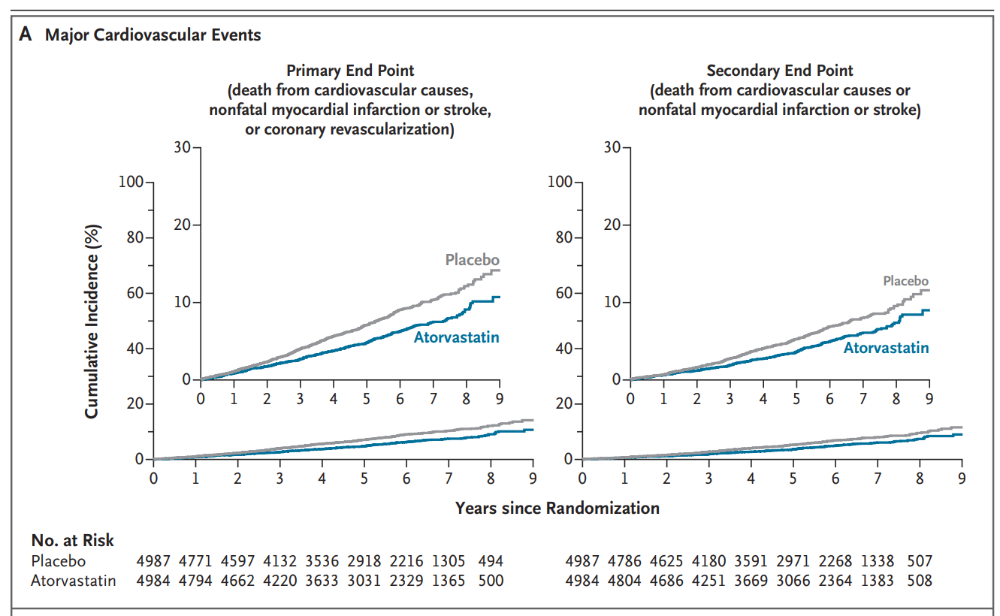
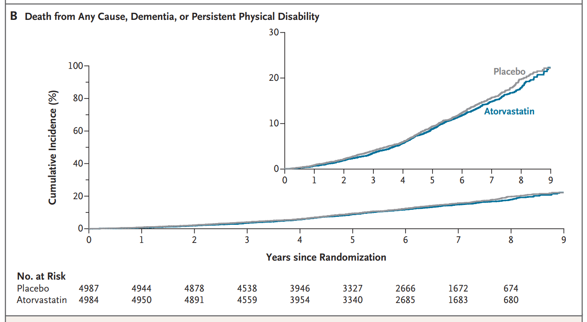

  

    

      
↓ 30%

      
Biến cố Tim mạch Chính (HR 0.70; P &lt; 0.001)

    

    

      
NNT = 37

      
Dự phòng 1 biến cố tim mạch sau 5.9 năm

    

    

      
HR 0.94

      
Sống sót không tàn tật (P = 0.25; Không khác biệt)

    

    

      
↓ 43%

      
Nhồi máu cơ tim &amp; Tái thông mạch vành (HR 0.57)

    

    

      
HR 1.00

      
Tử vong Tim mạch (74 ca vs 74 ca; Hoàn toàn tương đương)

    

    

      
3.3% vs 0.9%

      
Rối loạn gan mật (Tăng ALT/AST &gt; 3 lần: 1.4% vs 0.3%)

    

  

  

    

      
🛡️

      

        
Bảo Vệ Mạch Vành Vượt Trội

        
Atorvastatin 40 mg/ngày làm giảm 30% biến cố tim mạch chính, giảm 43% nhồi máu cơ tim và 43% can thiệp tái thông mạch vành ở người ≥ 70 tuổi khỏe mạnh sống tại cộng đồng.

      

    

    

      
⚖️

      

        
Không Kéo Dài Tuổi Thọ Khỏe Mạnh

        
Hiệu quả tim mạch không chuyển dịch thành cải thiện sống sót không tàn tật (Disability-free survival, HR 0.94; P = 0.25), không giảm tử vong chung, do hơn 80% ca tử vong là vì nguyên nhân ngoài tim mạch.

      

    

    

      
⚠️

      

        
Hồ Sơ An Toàn &amp; Cá Thể Hóa Điều Trị

        
Tăng tỷ lệ biến cố gan mật (3.3% vs 0.9%), đái tháo đường mới (4.0% vs 2.7%) và tỷ lệ bỏ thuốc (7.2% vs 6.1%), đòi hỏi bác sĩ phải cân nhắc kỹ lưỡng đa dược trị và chia sẻ quyết định với người bệnh.

      

    

  

  

    <a href="#sec-1" class="quickmenu-item active">1. Bối Cảnh &amp; PICO</a>
    <a href="#sec-2" class="quickmenu-item">2. Đặc Điểm Nền (Tab 1)</a>
    <a href="#sec-3" class="quickmenu-item">3. Hai Tiêu Chí Chính (Fig 1)</a>
    <a href="#sec-4" class="quickmenu-item">4. Tiêu Chí Chi Tiết (Tab 2)</a>
    <a href="#sec-5" class="quickmenu-item">5. Phân Tích Phân Nhóm (Tab Fig 2)</a>
    <a href="#sec-6" class="quickmenu-item">6. Hồ Sơ An Toàn (Tab 3)</a>
    <a href="#sec-7" class="quickmenu-item">7. Ý Nghĩa Lâm Sàng</a>
    <a href="#sec-8" class="quickmenu-item">8. Tài Liệu Gốc</a>
  

  <!-- ==================== SECTION 1 ==================== -->
  

    

      🔬
      <h2 class="sec-title">1. Bối Cảnh Lâm Sàng, Cơ Sở Sinh Lý Bệnh &amp; Khung Thiết Kế Nghiên Cứu (PICO)</h2>
    

    

      
      

        Sự già hóa dân số toàn cầu đang diễn ra nhanh chóng. Mặc dù tuổi thọ tuyệt đối của con người tăng cao, <strong>tuổi thọ khỏe mạnh (healthy life span) lại không tăng tương ứng</strong>; người cao tuổi vẫn phải chịu gánh nặng bệnh tật nặng nề do bệnh tim mạch (CVD), sa sút trí tuệ (dementia) và tàn phế vận động.
      

      

        ⚠️
        

          <strong>Khoảng trống chứng cứ lịch sử về Statin trong Dự phòng Cấp một ở người cao tuổi:</strong> 
          Vai trò của statin trong việc giảm biến cố tim mạch ở người có nguy cơ cao (đã mắc bệnh tim mạch hoặc đái tháo đường) đã được thiết lập vững chắc. Tuy nhiên, <em>hiệu quả và tính an toàn của việc khởi trị statin ở người cao tuổi khỏe mạnh để dự phòng cấp một (primary prevention) suốt nhiều thập kỷ qua vẫn là chủ đề tranh luận gay gắt</em>. Các phân tích gộp trước đây có chưa đến 25% đối tượng &gt; 70 tuổi, từng gợi ý rằng statin có thể kém hiệu quả hơn ở người già (mức giảm nguy cơ tim mạch trên mỗi 1.0 mmol/L LDL-C giảm được không đạt ý nghĩa thống kê: giảm 16% ở người &gt; 70 tuổi và chỉ giảm 8% ở người &gt; 75 tuổi).
        

      

      

        

          

          

            
💊

            
Dược Động Học &amp; Thách Thức Đa Dược Trị Ở Người Già

          

          

            <ul style="margin-left: 1rem; line-height: 1.7;">
              <li>Người cao tuổi suy giảm sinh lý chức năng gan, giảm độ lọc cầu thận và thay đổi tỷ lệ mỡ/nước cơ thể, làm biến đổi rõ rệt dược động học của statin.</li>
              <li>Tình trạng đa dược trị (polypharmacy) làm gia tăng nguy cơ tương tác thuốc qua enzyme cytochrom P450 (CYP3A4).</li>
              <li>Lo ngại đặc biệt về tác dụng phụ: đau mỏi cơ vân, tiêu cơ vân, suy giảm nhận thức, tổn thương gan, đái tháo đường mới khởi phát và xuất huyết não.</li>
            </ul>
          

          
Nguy cơ tích lũy cao

        

        

          

          

            
🎯

            
Sứ Mệnh Của Thử Nghiệm Lâm Sàng STAREE

          

          

            <ul style="margin-left: 1rem; line-height: 1.7;">
              <li>Thử nghiệm <strong>STAREE (Statins in Reducing Events in the Elderly)</strong> được khởi xướng độc lập nhằm trả lời dứt khoát câu hỏi: Khởi đầu Atorvastatin 40 mg có giúp người cao tuổi khỏe mạnh sống lâu hơn, tự lập hơn và giảm biến cố tim mạch hay không?</li>
              <li>Quy mô lớn nhất từ trước đến nay: <strong>9,971 người từ 70 tuổi trở lên</strong> sống tại cộng đồng trên khắp nước Úc.</li>
              <li>Thời gian theo dõi trung vị kéo dài gần 6 năm (<strong>5.9 năm</strong>; tối đa 9 năm).</li>
            </ul>
          

          
Thử nghiệm bản lề (Landmark)

        

      

      <h3 class="sec-subtitle" style="margin-top: 1.5rem;">Khung Thiết Kế Nghiên Cứu Chuẩn PICO (NEJMoa2607314)</h3>
      

        <table class="regimen-table">
          <thead>
            <tr>
              <th style="width: 18%;">Thành tố PICO</th>
              <th style="width: 82%;">Nội dung chi tiết trong Thử nghiệm STAREE</th>
            </tr>
          </thead>
          <tbody>
            <tr>
              <td class="source-cell">P (Population)</td>
              <td>
                <strong>Người lớn từ 70 tuổi trở lên sống độc lập tại cộng đồng (N = 9,971):</strong> 
                • Tiêu chuẩn loại trừ nghiêm ngặt: Không có tiền sử bệnh tim mạch (nhồi máu cơ tim, đau thắt ngực, suy tim, đột quỵ, TIA, hẹp động mạch cảnh, phình ĐMC bụng, bệnh động mạch ngoại biên, hoặc tái thông mạch vành), không mắc đái tháo đường, không sa sút trí tuệ và không có bệnh lý giới hạn tuổi thọ. 
                • 40.2% người tham gia có độ tuổi từ 75 trở lên; 51.9% là nữ giới.
              </td>
            </tr>
            <tr>
              <td class="source-cell">I (Intervention)</td>
              <td>
                <strong>Atorvastatin 40 mg/ngày đường uống một lần mỗi ngày:</strong> 
                • Khởi đầu liều 20 mg/ngày (1 viên) trong 4 tuần đầu để đánh giá dung nạp, sau đó tăng lên 40 mg/ngày (2 viên). Cho phép điều chỉnh liều hoặc tăng lại liều để xử trí triệu chứng phụ.
              </td>
            </tr>
            <tr>
              <td class="source-cell">C (Comparator)</td>
              <td>
                <strong>Giả dược (Placebo) tương ứng 1 lần/ngày:</strong> Viên giả dược có hình thức, màu sắc và quy trình chỉnh liều hoàn toàn tương đồng với Atorvastatin.
              </td>
            </tr>
            <tr>
              <td class="source-cell">O (Outcomes)</td>
              <td>
                <strong>Hai Tiêu Chí Đánh Giá Chính Kép (Coprimary End Points):</strong> 
                1. <em>Biến cố tim mạch chính:</em> Phức hợp tử vong do nguyên nhân tim mạch, nhồi máu cơ tim không tử vong, đột quỵ không tử vong, hoặc tái thông mạch vành. 
                2. <em>Sống sót không tàn tật (Disability-free survival):</em> Phức hợp tử vong do mọi nguyên nhân, sa sút trí tuệ (dementia), hoặc tàn tật thể chất dai dẳng (persistent physical disability). 
                <strong>Tiêu chí phụ:</strong> Nhồi máu cơ tim đơn độc, đột quỵ đơn độc, tử vong mọi nguyên nhân, tử vong tim mạch, tái thông mạch, nhập viện mọi nguyên nhân, an toàn gan/cơ/đái tháo đường.
              </td>
            </tr>
            <tr>
              <td class="source-cell">Phương pháp thống kê</td>
              <td>
                Thử nghiệm ngẫu nhiên, mù đôi, kiểm soát giả dược, phân tích theo ý định điều trị (<strong>Intent-to-treat</strong>). Áp dụng <strong>Kế hoạch kiểm định phân cấp (hierarchical testing plan)</strong>: Tiêu chí tim mạch được kiểm định trước ở mức alpha = 0.05 hai bên; nếu P &lt; 0.05 thì tiêu chí sống sót không tàn tật mới tiếp tục được kiểm định ở mức alpha = 0.05 để bảo toàn sai lầm loại I.
              </td>
            </tr>
          </tbody>
        </table>
      

    

  

  <!-- ==================== SECTION 2 ==================== -->
  

    

      👥
      <h2 class="sec-title">2. Đặc Điểm Nền Của Quần Thể Nghiên Cứu (Baseline Characteristics - Table 1)</h2>
    

    

      
      

        Tổng cộng có <strong>9,971 người</strong> tham gia được phân ngẫu nhiên: 4,984 người thuộc nhóm Atorvastatin và 4,987 người thuộc nhóm giả dược. Đặc điểm nền giữa hai nhóm hoàn toàn tương đồng và cân bằng tốt.
      

      

        <table class="regimen-table">
          <thead>
            <tr>
              <th style="width: 38%;">Đặc tính nghiên cứu (Characteristic)</th>
              <th style="width: 20%; text-align: center;">Toàn bộ mẫu (N = 9,971)</th>
              <th style="width: 21%; text-align: center;">Nhóm Atorvastatin (N = 4,984)</th>
              <th style="width: 21%; text-align: center;">Nhóm Giả dược (N = 4,987)</th>
            </tr>
          </thead>
          <tbody>
            <tr style="background: var(--color-surface-2, rgba(0,0,0,0.02)); font-weight: bold;">
              <td colspan="4">PHÂN NHÓM ĐỘ TUỔI — no. (%)</td>
            </tr>
            <tr>
              <td>70–74 tuổi</td>
              <td style="text-align: center;">5948 (59.7)</td>
              <td style="text-align: center;">2959 (59.4)</td>
              <td style="text-align: center;">2989 (59.9)</td>
            </tr>
            <tr>
              <td>75–79 tuổi</td>
              <td style="text-align: center;">2503 (25.1)</td>
              <td style="text-align: center;">1274 (25.6)</td>
              <td style="text-align: center;">1229 (24.6)</td>
            </tr>
            <tr>
              <td>80–84 tuổi</td>
              <td style="text-align: center;">1112 (11.2)</td>
              <td style="text-align: center;">562 (11.3)</td>
              <td style="text-align: center;">550 (11.0)</td>
            </tr>
            <tr>
              <td>≥ 85 tuổi</td>
              <td style="text-align: center;">408 (4.1)</td>
              <td style="text-align: center;">189 (3.8)</td>
              <td style="text-align: center;">219 (4.4)</td>
            </tr>
            <tr style="background: var(--color-surface-2, rgba(0,0,0,0.02)); font-weight: bold;">
              <td colspan="4">GIỚI TÍNH — no. (%)</td>
            </tr>
            <tr>
              <td>Nam</td>
              <td style="text-align: center;">4797 (48.1)</td>
              <td style="text-align: center;">2411 (48.4)</td>
              <td style="text-align: center;">2386 (47.8)</td>
            </tr>
            <tr>
              <td>Nữ</td>
              <td style="text-align: center;">5174 (51.9)</td>
              <td style="text-align: center;">2573 (51.6)</td>
              <td style="text-align: center;">2601 (52.2)</td>
            </tr>
            <tr style="background: var(--color-surface-2, rgba(0,0,0,0.02)); font-weight: bold;">
              <td colspan="4">CHỦNG TỘC — no. (%)</td>
            </tr>
            <tr>
              <td>Da trắng</td>
              <td style="text-align: center;">9803 (98.3)</td>
              <td style="text-align: center;">4901 (98.3)</td>
              <td style="text-align: center;">4902 (98.3)</td>
            </tr>
            <tr>
              <td>Châu Á</td>
              <td style="text-align: center;">84 (0.8)</td>
              <td style="text-align: center;">40 (0.8)</td>
              <td style="text-align: center;">44 (0.9)</td>
            </tr>
            <tr>
              <td>Thổ dân / Đảo Torres Strait</td>
              <td style="text-align: center;">23 (0.2)</td>
              <td style="text-align: center;">13 (0.3)</td>
              <td style="text-align: center;">10 (0.2)</td>
            </tr>
            <tr>
              <td>Chủng tộc khác</td>
              <td style="text-align: center;">61 (0.6)</td>
              <td style="text-align: center;">30 (0.6)</td>
              <td style="text-align: center;">31 (0.6)</td>
            </tr>
            <tr style="background: var(--color-surface-2, rgba(0,0,0,0.02)); font-weight: bold;">
              <td colspan="4">TÌNH TRẠNG HÚT THUỐC LÁ — no./total no. (%)</td>
            </tr>
            <tr>
              <td>Đang hút thuốc</td>
              <td style="text-align: center;">245/9967 (2.5)</td>
              <td style="text-align: center;">130/4981 (2.6)</td>
              <td style="text-align: center;">115/4986 (2.3)</td>
            </tr>
            <tr>
              <td>Từng hút thuốc (đã bỏ)</td>
              <td style="text-align: center;">4252/9967 (42.7)</td>
              <td style="text-align: center;">2134/4981 (42.8)</td>
              <td style="text-align: center;">2118/4986 (42.5)</td>
            </tr>
            <tr>
              <td>Chưa từng hút thuốc</td>
              <td style="text-align: center;">5470/9967 (54.9)</td>
              <td style="text-align: center;">2717/4981 (54.5)</td>
              <td style="text-align: center;">2753/4986 (55.2)</td>
            </tr>
            <tr style="background: var(--color-surface-2, rgba(0,0,0,0.02)); font-weight: bold;">
              <td colspan="4">CHỈ SỐ KHỐI CƠ THỂ (BMI) — no./total no. (%)</td>
            </tr>
            <tr>
              <td>≥ 30.0 kg/m² (Béo phì)</td>
              <td style="text-align: center;">2483/9612 (25.8)</td>
              <td style="text-align: center;">1248/4794 (26.0)</td>
              <td style="text-align: center;">1235/4818 (25.6)</td>
            </tr>
            <tr>
              <td>25.0–29.9 kg/m² (Thừa cân)</td>
              <td style="text-align: center;">4078/9612 (42.4)</td>
              <td style="text-align: center;">2043/4794 (42.6)</td>
              <td style="text-align: center;">2035/4818 (42.2)</td>
            </tr>
            <tr>
              <td>&lt; 25.0 kg/m² (Bình thường / Gầy)</td>
              <td style="text-align: center;">3051/9612 (31.7)</td>
              <td style="text-align: center;">1503/4794 (31.4)</td>
              <td style="text-align: center;">1548/4818 (32.1)</td>
            </tr>
            <tr style="background: var(--color-surface-2, rgba(0,0,0,0.02)); font-weight: bold;">
              <td colspan="4">SỬ DỤNG THUỐC PHỐI HỢP ĐI KÈM — no. (%)</td>
            </tr>
            <tr>
              <td>Thuốc hạ huyết áp</td>
              <td style="text-align: center;">4612 (46.3)</td>
              <td style="text-align: center;">2306 (46.3)</td>
              <td style="text-align: center;">2306 (46.2)</td>
            </tr>
            <tr>
              <td>Thuốc chống loét / giảm tiết acid dạ dày</td>
              <td style="text-align: center;">2700 (27.1)</td>
              <td style="text-align: center;">1398 (28.0)</td>
              <td style="text-align: center;">1302 (26.1)</td>
            </tr>
            <tr>
              <td>Thuốc giảm đau</td>
              <td style="text-align: center;">2055 (20.6)</td>
              <td style="text-align: center;">1060 (21.3)</td>
              <td style="text-align: center;">995 (20.0)</td>
            </tr>
            <tr>
              <td>Thuốc chống đông / kháng tiểu cầu</td>
              <td style="text-align: center;">1486 (14.9)</td>
              <td style="text-align: center;">728 (14.6)</td>
              <td style="text-align: center;">758 (15.2)</td>
            </tr>
            <tr style="background: var(--color-surface-2, rgba(0,0,0,0.02)); font-weight: bold;">
              <td colspan="4">NỒNG ĐỘ LIPID MÁU NỀN BAN ĐẦU — mg/dL (mean ± SD)</td>
            </tr>
            <tr>
              <td>Cholesterol toàn phần</td>
              <td style="text-align: center;">211.2 ± 32.0</td>
              <td style="text-align: center;">210.8 ± 31.6</td>
              <td style="text-align: center;">211.6 ± 32.5</td>
            </tr>
            <tr>
              <td>LDL Cholesterol</td>
              <td style="text-align: center;">126.6 ± 28.0</td>
              <td style="text-align: center;">126.2 ± 27.8</td>
              <td style="text-align: center;">127.0 ± 28.1</td>
            </tr>
            <tr>
              <td>HDL Cholesterol</td>
              <td style="text-align: center;">61.6 ± 17.5</td>
              <td style="text-align: center;">61.6 ± 17.7</td>
              <td style="text-align: center;">61.7 ± 17.3</td>
            </tr>
            <tr>
              <td>Non-HDL Cholesterol</td>
              <td style="text-align: center;">149.6 ± 30.7</td>
              <td style="text-align: center;">149.2 ± 30.4</td>
              <td style="text-align: center;">149.9 ± 31.0</td>
            </tr>
            <tr>
              <td>Triglycerides</td>
              <td style="text-align: center;">113.1 ± 53.6</td>
              <td style="text-align: center;">113.1 ± 53.4</td>
              <td style="text-align: center;">113.2 ± 53.8</td>
            </tr>
            <tr style="background: var(--color-surface-2, rgba(0,0,0,0.02)); font-weight: bold;">
              <td colspan="4">HUYẾT ÁP NỀN BAN ĐẦU — mm Hg (mean ± SD)</td>
            </tr>
            <tr>
              <td>Huyết áp tâm thu</td>
              <td style="text-align: center;">135.8 ± 16.1</td>
              <td style="text-align: center;">135.8 ± 16.0</td>
              <td style="text-align: center;">135.7 ± 16.2</td>
            </tr>
            <tr>
              <td>Huyết áp tâm trương</td>
              <td style="text-align: center;">80.1 ± 9.4</td>
              <td style="text-align: center;">80.1 ± 9.3</td>
              <td style="text-align: center;">80.2 ± 9.6</td>
            </tr>
            <tr style="background: var(--color-surface-2, rgba(0,0,0,0.02)); font-weight: bold;">
              <td colspan="4">ĐIỂM ĐÁNH GIÁ NHẬN THỨC 3MS (Trung vị [IQR])</td>
            </tr>
            <tr>
              <td>Đánh giá trực tiếp (In-person)</td>
              <td style="text-align: center;">95.0 (91.0–97.0)</td>
              <td style="text-align: center;">95.0 (91.8–97.0)</td>
              <td style="text-align: center;">95.0 (91.0–97.0)</td>
            </tr>
            <tr>
              <td>Đánh giá qua điện thoại</td>
              <td style="text-align: center;">70.0 (67.0–71.0)</td>
              <td style="text-align: center;">70.0 (67.0–71.0)</td>
              <td style="text-align: center;">70.0 (67.0–71.0)</td>
            </tr>
          </tbody>
        </table>
      

      

        💡
        

          <strong>Bình luận lâm sàng về đặc điểm quần thể:</strong>
          Quần thể STAREE đại diện chân thực cho nhóm người cao tuổi khỏe mạnh đang sống tại cộng đồng: Tuổi trung bình 74.7 tuổi, đa số có chức năng nhận thức tốt (điểm 3MS trung vị 95/100) và <strong>88.7% hoàn toàn tự lập trong các hoạt động sinh hoạt hàng ngày (Katz Index)</strong>. Tuy nhiên, tình trạng đa dược trị xuất hiện ở 19.6% số bệnh nhân và triệu chứng đau mỏi cơ đã có sẵn ở 46.1% số người tại thời điểm ban đầu.
        

      

    

  

  <!-- ==================== SECTION 3 ==================== -->
  

    

      📈
      <h2 class="sec-title">3. Hiệu Quả Hạ Lipid Máu &amp; Hai Tiêu Chí Đánh Giá Chính Kép (Figure 1)</h2>
    

    

      
      <h3 class="sec-subtitle">Biến Đổi Nồng Độ Lipid Máu Sau 5.9 Năm Theo Dõi</h3>
      

        Liệu pháp Atorvastatin 40 mg duy trì hiệu quả hạ lipid máu mạnh mẽ và ổn định xuyên suốt toàn bộ thời gian thử nghiệm:
      

      

        <table class="regimen-table">
          <thead>
            <tr>
              <th style="width: 25%;">Chỉ số Lipid máu</th>
              <th style="width: 25%; text-align: center;">Nhóm Atorvastatin (40 mg)</th>
              <th style="width: 25%; text-align: center;">Nhóm Giả dược (Placebo)</th>
              <th style="width: 25%; text-align: center;">Chênh lệch giảm ròng (Net Difference)</th>
            </tr>
          </thead>
          <tbody>
            <tr>
              <td class="source-cell"><strong>LDL Cholesterol</strong></td>
              <td style="text-align: center; color: #16a34a; font-weight: bold;">Giảm 48 mg/dL (1.23 mmol/L) <small>(Giảm ~38%)</small></td>
              <td style="text-align: center; color: #64748b;">Giảm 16 mg/dL (0.42 mmol/L) <small>(Giảm ~13%)</small></td>
              <td style="text-align: center; font-weight: bold; color: #0284c7;">-31 mg/dL (-0.81 mmol/L) <small>(95% CI: 30 đến 33 mg/dL)</small></td>
            </tr>
            <tr>
              <td class="source-cell"><strong>Cholesterol toàn phần</strong></td>
              <td style="text-align: center; color: #16a34a; font-weight: bold;">Giảm 53 mg/dL (1.37 mmol/L)</td>
              <td style="text-align: center; color: #64748b;">Giảm 18 mg/dL (0.47 mmol/L)</td>
              <td style="text-align: center; font-weight: bold; color: #0284c7;">-35 mg/dL (-0.90 mmol/L) <small>(95% CI: 33 đến 37 mg/dL)</small></td>
            </tr>
          </tbody>
        </table>
      

      <h3 class="sec-subtitle" style="margin-top: 1.5rem;">Kết Quả Hai Tiêu Chí Đánh Giá Chính Kép: Sự Phân Tách Lâm Sàng Đột Phá</h3>
      

        Thử nghiệm STAREE mang lại phát hiện cực kỳ quan trọng: <strong>Có sự phân tách hoàn toàn giữa hiệu quả giảm biến cố tim mạch và khả năng cải thiện sống sót không tàn tật</strong>:
      

      

        

          

          

            
❤️

            
1. Biến Cố Tim Mạch Chính (Primary MACE)

          

          

            

              <strong>Phức hợp:</strong> Tử vong do tim mạch, nhồi máu cơ tim không tử vong, đột quỵ không tử vong, hoặc can thiệp tái thông mạch vành.
            

            <ul style="margin-left: 1rem; line-height: 1.7;">
              <li><strong>Nhóm Atorvastatin:</strong> 297 người (10.9 biến cố / 1000 người-năm).</li>
              <li><strong>Nhóm Giả dược:</strong> 412 người (15.5 biến cố / 1000 người-năm).</li>
              <li><strong>Chỉ số thống kê:</strong> <strong>HR = 0.70 (95% CI, 0.61–0.82; P &lt; 0.001)</strong>.</li>
              <li><strong>Ý nghĩa:</strong> Giảm ý nghĩa <strong>30%</strong> nguy cơ biến cố tim mạch chính. <strong>NNT = 37</strong> trong 5.9 năm theo dõi.</li>
            </ul>
          

          
Giảm 30% MACE (P &lt; 0.001)

        

        

          

          

            
🧓

            
2. Sống Sót Không Tàn Tật (Disability-free Survival)

          

          

            

              <strong>Phức hợp:</strong> Tử vong do mọi nguyên nhân, sa sút trí tuệ (dementia), hoặc tàn tật thể chất dai dẳng.
            

            <ul style="margin-left: 1rem; line-height: 1.7;">
              <li><strong>Nhóm Atorvastatin:</strong> 637 người (21.6 biến cố / 1000 người-năm).</li>
              <li><strong>Nhóm Giả dược:</strong> 676 người (23.0 biến cố / 1000 người-năm).</li>
              <li><strong>Chỉ số thống kê:</strong> <strong>HR = 0.94 (95% CI, 0.84–1.05; P = 0.25)</strong>.</li>
              <li><strong>Ý nghĩa:</strong> Hoàn toàn <strong>không có sự khác biệt có ý nghĩa thống kê</strong> giữa hai nhóm.</li>
            </ul>
          

          
Không cải thiện (P = 0.25)

        

      

      <!-- FIGURES EMBEDDED -->
      

        
        

          
Figure 1A. Biến Cố Tim Mạch Chính Tích Lũy Theo Nhóm Thử Nghiệm (STAREE 2026)

          Đường cong tỷ lệ biến cố tim mạch chính tích lũy (Kaplan-Meier) phân tách rõ rệt ngay từ năm thứ 1–2 và tiếp tục mở rộng cho đến năm thứ 9, chứng minh lợi ích giảm nguy cơ ổn định của Atorvastatin 40 mg (HR 0.70; 95% CI, 0.61–0.82; P &lt; 0.001). Bảng số lượng đối tượng có nguy cơ (No. at Risk) hiển thị ở đáy biểu đồ.
        

      

      

        
        

          
Figure 1B. Tỷ Lệ Tử Vong Mọi Nguyên Nhân, Sa Sút Trí Tuệ Hoặc Tàn Tật Dai Dẳng Tích Lũy

          Hai đường cong Kaplan-Meier của nhóm Atorvastatin và nhóm Placebo gần như trùng khít lên nhau trong suốt 9 năm theo dõi (HR 0.94; 95% CI, 0.84–1.05; P = 0.25). Điều này khẳng định statin không kéo dài thời gian sống khỏe mạnh hoặc ngăn ngừa tàn phế ở người già sống tại cộng đồng.
        

      

      

        🔍
        

          <strong>Cơ chế giải thích sự mâu thuẫn giữa 2 tiêu chí chính:</strong> 
          Tại sao statin giảm mạnh biến cố tim mạch nhưng lại không cải thiện sống sót không tàn tật? Phân tích nguyên nhân tử vong cho thấy <strong>hơn 80% trường hợp tử vong trong thử nghiệm là do nguyên nhân ngoài tim mạch</strong> (chủ yếu là ung thư, suy kiệt, nhiễm trùng đường hô hấp hoặc chấn thương) — những bệnh cảnh hoàn toàn không chịu tác động của liệu pháp statin. Do đó, mức giảm biến cố mạch vành không tử vong bị pha loãng trong tổng gánh nặng tử vong và tàn tật chung của người cao tuổi.
        

      

    

  

  <!-- ==================== SECTION 4 ==================== -->
  

    

      📊
      <h2 class="sec-title">4. Kết Quả Chi Tiết Toàn Bộ Tiêu Chí Chính &amp; Phụ (Primary &amp; Secondary End Points - Table 2)</h2>
    

    

      
      

        Bảng số liệu chi tiết toàn bộ các tiêu chí lâm sàng được trích xuất nguyên văn từ Báo cáo Thử nghiệm STAREE (NEJM 2026). Dữ liệu phản ánh số ca biến cố thực tế, tỷ lệ chuẩn hóa trên 1000 người-năm và tỷ số nguy cơ (Hazard Ratio):
      

      

        <table class="regimen-table">
          <thead>
            <tr>
              <th style="width: 32%;">Tiêu chí đánh giá (End Point)</th>
              <th style="width: 17%; text-align: center;">Tổng số biến cố <small>(N = 9,971)</small></th>
              <th style="width: 17%; text-align: center;">Nhóm Atorvastatin <small>(N = 4,984)</small></th>
              <th style="width: 17%; text-align: center;">Nhóm Giả dược <small>(N = 4,987)</small></th>
              <th style="width: 17%; text-align: center;">Hazard Ratio <small>(95% CI)</small></th>
            </tr>
          </thead>
          <tbody>
            <tr style="background: var(--color-surface-2, rgba(0,0,0,0.03)); font-weight: bold;">
              <td colspan="5">TIÊU CHÍ ĐÁNH GIÁ CHÍNH (PRIMARY END POINTS)</td>
            </tr>
            <tr>
              <td><strong>Biến cố tim mạch chính</strong></td>
              <td style="text-align: center; font-weight: bold;">709 (7.1%)</td>
              <td style="text-align: center; font-weight: bold; color: #16a34a;">297 (10.9)*</td>
              <td style="text-align: center; font-weight: bold; color: #dc2626;">412 (15.5)*</td>
              <td style="text-align: center; font-weight: bold; color: #16a34a;">0.70 (0.61–0.82)</td>
            </tr>
            <tr>
              <td><strong>Sống sót không tàn tật</strong></td>
              <td style="text-align: center; font-weight: bold;">1313 (13.2%)</td>
              <td style="text-align: center; font-weight: bold;">637 (21.6)*</td>
              <td style="text-align: center; font-weight: bold;">676 (23.0)*</td>
              <td style="text-align: center; font-weight: bold; color: #d97706;">0.94 (0.84–1.05)</td>
            </tr>
            <tr style="background: var(--color-surface-2, rgba(0,0,0,0.03)); font-weight: bold;">
              <td colspan="5">TIÊU CHÍ ĐÁNH GIÁ PHỤ (SECONDARY END POINTS)</td>
            </tr>
            <tr>
              <td>Phức hợp biến cố tim mạch chính khác</td>
              <td style="text-align: center;">551 (5.5%)</td>
              <td style="text-align: center; color: #16a34a;">236 (8.6)*</td>
              <td style="text-align: center; color: #dc2626;">315 (11.7)*</td>
              <td style="text-align: center; font-weight: bold; color: #16a34a;">0.73 (0.62–0.87)</td>
            </tr>
            <tr>
              <td>Tử vong do tim mạch</td>
              <td style="text-align: center;">148 (1.5%)</td>
              <td style="text-align: center;">74 (2.4)*</td>
              <td style="text-align: center;">74 (2.4)*</td>
              <td style="text-align: center; font-weight: bold;">1.00 (0.72–1.37)</td>
            </tr>
            <tr>
              <td><strong>Nhồi máu cơ tim (tử vong hoặc không tử vong)</strong></td>
              <td style="text-align: center;">216 (2.2%)</td>
              <td style="text-align: center; color: #16a34a;">79 (2.9)*</td>
              <td style="text-align: center; color: #dc2626;">137 (5.0)*</td>
              <td style="text-align: center; font-weight: bold; color: #16a34a;">0.57 (0.43–0.75)</td>
            </tr>
            <tr>
              <td>Nhồi máu cơ tim không tử vong</td>
              <td style="text-align: center;">207 (2.1%)</td>
              <td style="text-align: center; color: #16a34a;">77 (2.8)*</td>
              <td style="text-align: center; color: #dc2626;">130 (4.8)*</td>
              <td style="text-align: center; font-weight: bold; color: #16a34a;">0.58 (0.44–0.77)</td>
            </tr>
            <tr>
              <td>Đột quỵ (tử vong hoặc không tử vong)</td>
              <td style="text-align: center;">260 (2.6%)</td>
              <td style="text-align: center;">122 (4.4)*</td>
              <td style="text-align: center;">138 (5.1)*</td>
              <td style="text-align: center;">0.87 (0.68–1.11)</td>
            </tr>
            <tr>
              <td>Đột quỵ không tử vong</td>
              <td style="text-align: center;">230 (2.3%)</td>
              <td style="text-align: center;">103 (3.7)*</td>
              <td style="text-align: center;">127 (4.7)*</td>
              <td style="text-align: center;">0.80 (0.62–1.04)</td>
            </tr>
            <tr>
              <td><strong>Can thiệp tái thông mạch vành</strong></td>
              <td style="text-align: center;">300 (3.0%)</td>
              <td style="text-align: center; color: #16a34a;">110 (4.0)*</td>
              <td style="text-align: center; color: #dc2626;">190 (7.0)*</td>
              <td style="text-align: center; font-weight: bold; color: #16a34a;">0.57 (0.45–0.72)</td>
            </tr>
            <tr>
              <td>Bất kỳ can thiệp tái thông mạch máu nào</td>
              <td style="text-align: center;">348 (3.5%)</td>
              <td style="text-align: center; color: #16a34a;">127 (4.6)*</td>
              <td style="text-align: center; color: #dc2626;">221 (8.2)*</td>
              <td style="text-align: center; font-weight: bold; color: #16a34a;">0.56 (0.45–0.70)</td>
            </tr>
            <tr>
              <td>Tử vong do mọi nguyên nhân</td>
              <td style="text-align: center;">828 (8.3%)</td>
              <td style="text-align: center;">395 (13.0)*</td>
              <td style="text-align: center;">433 (14.3)*</td>
              <td style="text-align: center;">0.91 (0.79–1.04)</td>
            </tr>
            <tr>
              <td>Sa sút trí tuệ (Dementia)</td>
              <td style="text-align: center;">570 (5.7%)</td>
              <td style="text-align: center;">290 (10.6)*</td>
              <td style="text-align: center;">280 (10.3)*</td>
              <td style="text-align: center;">1.03 (0.87–1.21)</td>
            </tr>
            <tr>
              <td>Tàn tật thể chất dai dẳng</td>
              <td style="text-align: center;">140 (1.4%)</td>
              <td style="text-align: center;">60 (2.2)*</td>
              <td style="text-align: center;">80 (2.9)*</td>
              <td style="text-align: center;">0.74 (0.53–1.04)</td>
            </tr>
            <tr>
              <td>Nhập viện do mọi nguyên nhân</td>
              <td style="text-align: center;">5515 (55.3%)</td>
              <td style="text-align: center;">2744 (148.9)*</td>
              <td style="text-align: center;">2771 (150.9)*</td>
              <td style="text-align: center;">0.99 (0.94–1.04)</td>
            </tr>
          </tbody>
        </table>
      

      

        <em>*Đơn vị đo lường: Số lượng biến cố xảy ra trên 1000 người-năm (Số lượng người tham gia thực tế gặp biến cố).</em>
      

    

  

  <!-- ==================== SECTION 5 ==================== -->
  

    

      📑
      <h2 class="sec-title">5. Bảng Phân Tích Phân Nhóm Chuyên Sâu (Chuyển Đổi Trực Quan Từ Figure 2 NEJM)</h2>
    

    

      
      

        📌
        

          <strong>Chuyển đổi toàn diện dữ liệu Figure 2 sang bảng đối sánh:</strong> 
          Dưới đây là toàn bộ dữ liệu phân tích phân nhóm tiền định (Prespecified Subgroup Analyses) từ <strong>Figure 2 của bài báo gốc</strong>, so sánh hiệu quả của Atorvastatin 40 mg đối với:
          <strong>Bảng 5.1: Biến cố Tim mạch Chính (Panel A)</strong> và <strong>Bảng 5.2: Sống Sót Không Tàn Tật (Panel B)</strong> qua 11 phân nhóm nhân khẩu học và sinh học.
        

      

      <h3 class="sec-subtitle" style="margin-top: 1.5rem;">Bảng 5.1: Phân Tích Phân Nhóm Đối Với Biến Cố Tim Mạch Chính (Panel A - Figure 2)</h3>
      
      

        <table class="regimen-table">
          <thead>
            <tr>
              <th style="width: 25%;">Phân nhóm (Subgroup)</th>
              <th style="width: 22%; text-align: center;">Atorvastatin 40 mg <small>Biến cố/Tổng số (tỷ lệ /1000 py)</small></th>
              <th style="width: 22%; text-align: center;">Placebo (Giả dược) <small>Biến cố/Tổng số (tỷ lệ /1000 py)</small></th>
              <th style="width: 16%; text-align: center;">Hazard Ratio <small>(95% CI)</small></th>
              <th style="width: 15%; text-align: center;">Ưu thế lâm sàng</th>
            </tr>
          </thead>
          <tbody>
            <!-- GIỚI TÍNH -->
            <tr style="background: var(--color-surface-2, rgba(0,0,0,0.03)); font-weight: bold;">
              <td colspan="5">GIỚI TÍNH (GENDER)</td>
            </tr>
            <tr>
              <td>Nữ giới (Woman)</td>
              <td style="text-align: center;">127 / 2573 (9.0)</td>
              <td style="text-align: center;">149 / 2601 (10.5)</td>
              <td style="text-align: center; font-weight: bold;">0.85 (0.67–1.08)</td>
              <td style="text-align: center;">Tương đương</td>
            </tr>
            <tr>
              <td>Nam giới (Man)</td>
              <td style="text-align: center; color: #16a34a; font-weight: bold;">170 / 2411 (13.0)</td>
              <td style="text-align: center; color: #dc2626;">263 / 2386 (21.0)</td>
              <td style="text-align: center; font-weight: bold; color: #16a34a;">0.62 (0.51–0.75)</td>
              <td style="text-align: center;">Nghiêng về Statin</td>
            </tr>

            <!-- TUỔI -->
            <tr style="background: var(--color-surface-2, rgba(0,0,0,0.03)); font-weight: bold;">
              <td colspan="5">NHÓM TUỔI (AGE)</td>
            </tr>
            <tr>
              <td>70–74 tuổi</td>
              <td style="text-align: center; color: #16a34a;">129 / 2959 (8.0)</td>
              <td style="text-align: center; color: #dc2626;">193 / 2989 (12.0)</td>
              <td style="text-align: center; font-weight: bold; color: #16a34a;">0.67 (0.53–0.83)</td>
              <td style="text-align: center;">Nghiêng về Statin</td>
            </tr>
            <tr>
              <td>≥ 75 tuổi</td>
              <td style="text-align: center; color: #16a34a;">168 / 2025 (15.2)</td>
              <td style="text-align: center; color: #dc2626;">219 / 1998 (20.8)</td>
              <td style="text-align: center; font-weight: bold; color: #16a34a;">0.73 (0.59–0.89)</td>
              <td style="text-align: center;">Nghiêng về Statin</td>
            </tr>

            <!-- HUYẾT ÁP TÂM THU -->
            <tr style="background: var(--color-surface-2, rgba(0,0,0,0.03)); font-weight: bold;">
              <td colspan="5">HUYẾT ÁP TÂM THU (SYSTOLIC BLOOD PRESSURE)</td>
            </tr>
            <tr>
              <td>&lt; 128 mm Hg</td>
              <td style="text-align: center;">71 / 1489 (8.5)</td>
              <td style="text-align: center;">86 / 1548 (10.2)</td>
              <td style="text-align: center; font-weight: bold;">0.84 (0.61–1.14)</td>
              <td style="text-align: center;">Tương đương</td>
            </tr>
            <tr>
              <td>128–141 mm Hg</td>
              <td style="text-align: center; color: #16a34a;">107 / 1692 (11.4)</td>
              <td style="text-align: center; color: #dc2626;">148 / 1640 (16.8)</td>
              <td style="text-align: center; font-weight: bold; color: #16a34a;">0.67 (0.53–0.86)</td>
              <td style="text-align: center;">Nghiêng về Statin</td>
            </tr>
            <tr>
              <td>≥ 142 mm Hg</td>
              <td style="text-align: center; color: #16a34a;">116 / 1589 (13.2)</td>
              <td style="text-align: center; color: #dc2626;">167 / 1595 (19.2)</td>
              <td style="text-align: center; font-weight: bold; color: #16a34a;">0.69 (0.55–0.88)</td>
              <td style="text-align: center;">Nghiêng về Statin</td>
            </tr>

            <!-- HUYẾT ÁP TÂM TRƯƠNG -->
            <tr style="background: var(--color-surface-2, rgba(0,0,0,0.03)); font-weight: bold;">
              <td colspan="5">HUYẾT ÁP TÂM TRƯƠNG (DIASTOLIC BLOOD PRESSURE)</td>
            </tr>
            <tr>
              <td>&lt; 76 mm Hg</td>
              <td style="text-align: center;">105 / 1566 (12.1)</td>
              <td style="text-align: center;">125 / 1593 (14.7)</td>
              <td style="text-align: center; font-weight: bold;">0.82 (0.63–1.06)</td>
              <td style="text-align: center;">Tương đương</td>
            </tr>
            <tr>
              <td>76–83 mm Hg</td>
              <td style="text-align: center; color: #16a34a;">92 / 1576 (10.5)</td>
              <td style="text-align: center; color: #dc2626;">136 / 1547 (16.2)</td>
              <td style="text-align: center; font-weight: bold; color: #16a34a;">0.65 (0.50–0.85)</td>
              <td style="text-align: center;">Nghiêng về Statin</td>
            </tr>
            <tr>
              <td>≥ 84 mm Hg</td>
              <td style="text-align: center; color: #16a34a;">97 / 1628 (10.7)</td>
              <td style="text-align: center; color: #dc2626;">140 / 1642 (15.5)</td>
              <td style="text-align: center; font-weight: bold; color: #16a34a;">0.69 (0.53–0.90)</td>
              <td style="text-align: center;">Nghiêng về Statin</td>
            </tr>

            <!-- BMI -->
            <tr style="background: var(--color-surface-2, rgba(0,0,0,0.03)); font-weight: bold;">
              <td colspan="5">CHỈ SỐ KHỐI CƠ THỂ (BMI - BODY-MASS INDEX)</td>
            </tr>
            <tr>
              <td>&lt; 25 kg/m² (Bình thường / Gầy)</td>
              <td style="text-align: center;">92 / 1503 (11.2)</td>
              <td style="text-align: center;">104 / 1548 (12.5)</td>
              <td style="text-align: center; font-weight: bold;">0.89 (0.67–1.18)</td>
              <td style="text-align: center;">Tương đương</td>
            </tr>
            <tr>
              <td>25–29.9 kg/m² (Thừa cân)</td>
              <td style="text-align: center; color: #16a34a;">123 / 2043 (10.8)</td>
              <td style="text-align: center; color: #dc2626;">185 / 2035 (16.7)</td>
              <td style="text-align: center; font-weight: bold; color: #16a34a;">0.65 (0.51–0.81)</td>
              <td style="text-align: center;">Nghiêng về Statin</td>
            </tr>
            <tr>
              <td>≥ 30 kg/m² (Béo phì)</td>
              <td style="text-align: center; color: #16a34a;">78 / 1248 (11.3)</td>
              <td style="text-align: center; color: #dc2626;">112 / 1235 (16.8)</td>
              <td style="text-align: center; font-weight: bold; color: #16a34a;">0.67 (0.50–0.90)</td>
              <td style="text-align: center;">Nghiêng về Statin</td>
            </tr>

            <!-- HÚT THUỐC -->
            <tr style="background: var(--color-surface-2, rgba(0,0,0,0.03)); font-weight: bold;">
              <td colspan="5">TÌNH TRẠNG HÚT THUỐC (SMOKING STATUS)</td>
            </tr>
            <tr>
              <td>Đang hoặc từng hút (Current or former)</td>
              <td style="text-align: center; color: #16a34a;">151 / 2264 (12.2)</td>
              <td style="text-align: center; color: #dc2626;">205 / 2233 (17.3)</td>
              <td style="text-align: center; font-weight: bold; color: #16a34a;">0.70 (0.57–0.87)</td>
              <td style="text-align: center;">Nghiêng về Statin</td>
            </tr>
            <tr>
              <td>Chưa từng hút thuốc (Never)</td>
              <td style="text-align: center; color: #16a34a;">146 / 2717 (9.8)</td>
              <td style="text-align: center; color: #dc2626;">207 / 2753 (14.0)</td>
              <td style="text-align: center; font-weight: bold; color: #16a34a;">0.70 (0.57–0.87)</td>
              <td style="text-align: center;">Nghiêng về Statin</td>
            </tr>

            <!-- eGFR -->
            <tr style="background: var(--color-surface-2, rgba(0,0,0,0.03)); font-weight: bold;">
              <td colspan="5">ĐỘ LỌC CẦU THẬN ƯỚC TÍNH (eGFR)</td>
            </tr>
            <tr>
              <td>&lt; 60 ml/min/1.73 m² (Suy giảm eGFR)</td>
              <td style="text-align: center;">48 / 577 (15.4)</td>
              <td style="text-align: center;">62 / 598 (19.4)</td>
              <td style="text-align: center; font-weight: bold;">0.80 (0.55–1.16)</td>
              <td style="text-align: center;">Tương đương</td>
            </tr>
            <tr>
              <td>≥ 60 ml/min/1.73 m² (Bình thường / Giảm nhẹ)</td>
              <td style="text-align: center; color: #16a34a;">249 / 4407 (10.3)</td>
              <td style="text-align: center; color: #dc2626;">350 / 4389 (14.9)</td>
              <td style="text-align: center; font-weight: bold; color: #16a34a;">0.69 (0.59–0.81)</td>
              <td style="text-align: center;">Nghiêng về Statin</td>
            </tr>

            <!-- LDL CHOLESTEROL -->
            <tr style="background: var(--color-surface-2, rgba(0,0,0,0.03)); font-weight: bold;">
              <td colspan="5">LDL CHOLESTEROL NỀN</td>
            </tr>
            <tr>
              <td>&lt; 116.01 mg/dL (&lt; 3.0 mmol/L)</td>
              <td style="text-align: center;">107 / 1614 (12.1)</td>
              <td style="text-align: center;">129 / 1617 (15.0)</td>
              <td style="text-align: center; font-weight: bold;">0.80 (0.62–1.03)</td>
              <td style="text-align: center;">Tương đương</td>
            </tr>
            <tr>
              <td>116.01–139.21 mg/dL (3.0–3.6 mmol/L)</td>
              <td style="text-align: center; color: #16a34a;">89 / 1677 (9.6)</td>
              <td style="text-align: center; color: #dc2626;">117 / 1603 (13.5)</td>
              <td style="text-align: center; font-weight: bold; color: #16a34a;">0.71 (0.54–0.94)</td>
              <td style="text-align: center;">Nghiêng về Statin</td>
            </tr>
            <tr>
              <td>&gt; 139.21 mg/dL (&gt; 3.6 mmol/L)</td>
              <td style="text-align: center; color: #16a34a; font-weight: bold;">101 / 1687 (11.1)</td>
              <td style="text-align: center; color: #dc2626;">165 / 1756 (17.6)</td>
              <td style="text-align: center; font-weight: bold; color: #16a34a;">0.63 (0.49–0.81)</td>
              <td style="text-align: center;">Nghiêng về Statin</td>
            </tr>

            <!-- HDL CHOLESTEROL -->
            <tr style="background: var(--color-surface-2, rgba(0,0,0,0.03)); font-weight: bold;">
              <td colspan="5">HDL CHOLESTEROL NỀN</td>
            </tr>
            <tr>
              <td>&lt; 52.98 mg/dL (HDL thấp)</td>
              <td style="text-align: center; color: #16a34a; font-weight: bold;">115 / 1686 (12.6)</td>
              <td style="text-align: center; color: #dc2626;">185 / 1614 (21.9)</td>
              <td style="text-align: center; font-weight: bold; color: #16a34a;">0.58 (0.46–0.73)</td>
              <td style="text-align: center;">Nghiêng về Statin</td>
            </tr>
            <tr>
              <td>52.98–65.74 mg/dL</td>
              <td style="text-align: center;">88 / 1398 (11.7)</td>
              <td style="text-align: center;">109 / 1459 (14.1)</td>
              <td style="text-align: center; font-weight: bold;">0.83 (0.63–1.10)</td>
              <td style="text-align: center;">Tương đương</td>
            </tr>
            <tr>
              <td>&gt; 65.74 mg/dL (HDL cao)</td>
              <td style="text-align: center;">94 / 1900 (8.9)</td>
              <td style="text-align: center;">118 / 1914 (11.3)</td>
              <td style="text-align: center; font-weight: bold;">0.78 (0.60–1.03)</td>
              <td style="text-align: center;">Tương đương</td>
            </tr>

            <!-- ĐIỂM 3MS -->
            <tr style="background: var(--color-surface-2, rgba(0,0,0,0.03)); font-weight: bold;">
              <td colspan="5">ĐIỂM ĐÁNH GIÁ NHẬN THỨC 3MS</td>
            </tr>
            <tr>
              <td>&lt; Trung vị z-score (Nhận thức thấp hơn)</td>
              <td style="text-align: center; color: #16a34a;">162 / 2384 (12.6)</td>
              <td style="text-align: center; color: #dc2626;">207 / 2349 (17.0)</td>
              <td style="text-align: center; font-weight: bold; color: #16a34a;">0.74 (0.60–0.91)</td>
              <td style="text-align: center;">Nghiêng về Statin</td>
            </tr>
            <tr>
              <td>≥ Trung vị z-score (Nhận thức cao hơn)</td>
              <td style="text-align: center; color: #16a34a;">135 / 2600 (9.4)</td>
              <td style="text-align: center; color: #dc2626;">205 / 2638 (14.2)</td>
              <td style="text-align: center; font-weight: bold; color: #16a34a;">0.66 (0.53–0.82)</td>
              <td style="text-align: center;">Nghiêng về Statin</td>
            </tr>

            <!-- THỜI ĐIỂM PHÂN NGẪU NHIÊN -->
            <tr style="background: var(--color-surface-2, rgba(0,0,0,0.03)); font-weight: bold;">
              <td colspan="5">THỜI ĐIỂM PHÂN NGẪU NHIÊN (RANDOMIZATION TIME)</td>
            </tr>
            <tr>
              <td>Trước đại dịch COVID-19 (Before pandemic)</td>
              <td style="text-align: center; color: #16a34a;">236 / 3292 (11.3)</td>
              <td style="text-align: center; color: #dc2626;">320 / 3288 (15.8)</td>
              <td style="text-align: center; font-weight: bold; color: #16a34a;">0.72 (0.61–0.85)</td>
              <td style="text-align: center;">Nghiêng về Statin</td>
            </tr>
            <tr>
              <td>Trong hoặc sau đại dịch (During/after pandemic)</td>
              <td style="text-align: center; color: #16a34a;">61 / 1692 (9.5)</td>
              <td style="text-align: center; color: #dc2626;">92 / 1699 (14.5)</td>
              <td style="text-align: center; font-weight: bold; color: #16a34a;">0.66 (0.48–0.91)</td>
              <td style="text-align: center;">Nghiêng về Statin</td>
            </tr>
          </tbody>
        </table>
      

      <h3 class="sec-subtitle" style="margin-top: 2rem;">Bảng 5.2: Phân Tích Phân Nhóm Đối Với Sống Sót Không Tàn Tật (Panel B - Figure 2)</h3>
      
      

        <table class="regimen-table">
          <thead>
            <tr>
              <th style="width: 25%;">Phân nhóm (Subgroup)</th>
              <th style="width: 22%; text-align: center;">Atorvastatin 40 mg <small>Biến cố/Tổng số (tỷ lệ /1000 py)</small></th>
              <th style="width: 22%; text-align: center;">Placebo (Giả dược) <small>Biến cố/Tổng số (tỷ lệ /1000 py)</small></th>
              <th style="width: 16%; text-align: center;">Hazard Ratio <small>(95% CI)</small></th>
              <th style="width: 15%; text-align: center;">Ưu thế lâm sàng</th>
            </tr>
          </thead>
          <tbody>
            <!-- GIỚI TÍNH -->
            <tr style="background: var(--color-surface-2, rgba(0,0,0,0.03)); font-weight: bold;">
              <td colspan="5">GIỚI TÍNH (GENDER)</td>
            </tr>
            <tr>
              <td>Nữ giới (Woman)</td>
              <td style="text-align: center;">288 / 2573 (18.8)</td>
              <td style="text-align: center;">295 / 2601 (19.1)</td>
              <td style="text-align: center;">0.99 (0.84–1.16)</td>
              <td style="text-align: center;">Không khác biệt</td>
            </tr>
            <tr>
              <td>Nam giới (Man)</td>
              <td style="text-align: center;">349 / 2411 (24.6)</td>
              <td style="text-align: center;">381 / 2386 (27.4)</td>
              <td style="text-align: center;">0.90 (0.78–1.04)</td>
              <td style="text-align: center;">Không khác biệt</td>
            </tr>

            <!-- TUỔI -->
            <tr style="background: var(--color-surface-2, rgba(0,0,0,0.03)); font-weight: bold;">
              <td colspan="5">NHÓM TUỔI (AGE)</td>
            </tr>
            <tr>
              <td>70–74 tuổi</td>
              <td style="text-align: center;">241 / 2959 (13.8)</td>
              <td style="text-align: center;">236 / 2989 (13.3)</td>
              <td style="text-align: center;">1.04 (0.87–1.24)</td>
              <td style="text-align: center;">Không khác biệt</td>
            </tr>
            <tr>
              <td>≥ 75 tuổi</td>
              <td style="text-align: center;">396 / 2025 (33.0)</td>
              <td style="text-align: center;">440 / 1998 (37.7)</td>
              <td style="text-align: center; font-weight: bold; color: #0284c7;">0.87 (0.76–1.00)</td>
              <td style="text-align: center;">Xu hướng nhẹ</td>
            </tr>

            <!-- HUYẾT ÁP TÂM THU -->
            <tr style="background: var(--color-surface-2, rgba(0,0,0,0.03)); font-weight: bold;">
              <td colspan="5">HUYẾT ÁP TÂM THU (SYSTOLIC BLOOD PRESSURE)</td>
            </tr>
            <tr>
              <td>&lt; 128 mm Hg</td>
              <td style="text-align: center;">181 / 1489 (20.1)</td>
              <td style="text-align: center;">215 / 1548 (23.5)</td>
              <td style="text-align: center;">0.84 (0.69–1.03)</td>
              <td style="text-align: center;">Không khác biệt</td>
            </tr>
            <tr>
              <td>128–141 mm Hg</td>
              <td style="text-align: center;">211 / 1692 (20.8)</td>
              <td style="text-align: center;">217 / 1640 (22.1)</td>
              <td style="text-align: center;">0.94 (0.78–1.14)</td>
              <td style="text-align: center;">Không khác biệt</td>
            </tr>
            <tr>
              <td>≥ 142 mm Hg</td>
              <td style="text-align: center;">228 / 1589 (23.9)</td>
              <td style="text-align: center;">232 / 1595 (24.0)</td>
              <td style="text-align: center;">1.01 (0.84–1.21)</td>
              <td style="text-align: center;">Không khác biệt</td>
            </tr>

            <!-- HUYẾT ÁP TÂM TRƯƠNG -->
            <tr style="background: var(--color-surface-2, rgba(0,0,0,0.03)); font-weight: bold;">
              <td colspan="5">HUYẾT ÁP TÂM TRƯƠNG (DIASTOLIC BLOOD PRESSURE)</td>
            </tr>
            <tr>
              <td>&lt; 76 mm Hg</td>
              <td style="text-align: center;">236 / 1566 (25.0)</td>
              <td style="text-align: center;">263 / 1593 (28.2)</td>
              <td style="text-align: center;">0.88 (0.74–1.04)</td>
              <td style="text-align: center;">Không khác biệt</td>
            </tr>
            <tr>
              <td>76–83 mm Hg</td>
              <td style="text-align: center;">178 / 1576 (18.8)</td>
              <td style="text-align: center;">206 / 1547 (22.1)</td>
              <td style="text-align: center;">0.85 (0.70–1.04)</td>
              <td style="text-align: center;">Không khác biệt</td>
            </tr>
            <tr>
              <td>≥ 84 mm Hg</td>
              <td style="text-align: center;">206 / 1628 (21.0)</td>
              <td style="text-align: center;">195 / 1642 (19.6)</td>
              <td style="text-align: center;">1.08 (0.89–1.31)</td>
              <td style="text-align: center;">Không khác biệt</td>
            </tr>

            <!-- BMI -->
            <tr style="background: var(--color-surface-2, rgba(0,0,0,0.03)); font-weight: bold;">
              <td colspan="5">CHỈ SỐ KHỐI CƠ THỂ (BMI - BODY-MASS INDEX)</td>
            </tr>
            <tr>
              <td>&lt; 25 kg/m² (Bình thường / Gầy)</td>
              <td style="text-align: center;">224 / 1503 (25.4)</td>
              <td style="text-align: center;">223 / 1548 (24.4)</td>
              <td style="text-align: center;">1.05 (0.88–1.27)</td>
              <td style="text-align: center;">Không khác biệt</td>
            </tr>
            <tr>
              <td>25–29.9 kg/m² (Thừa cân)</td>
              <td style="text-align: center; color: #16a34a;">241 / 2043 (19.5)</td>
              <td style="text-align: center; color: #dc2626;">285 / 2035 (23.5)</td>
              <td style="text-align: center; font-weight: bold; color: #16a34a;">0.82 (0.69–0.97)</td>
              <td style="text-align: center;">Nghiêng về Statin</td>
            </tr>
            <tr>
              <td>≥ 30 kg/m² (Béo phì)</td>
              <td style="text-align: center;">160 / 1248 (21.3)</td>
              <td style="text-align: center;">156 / 1235 (21.0)</td>
              <td style="text-align: center;">1.02 (0.82–1.27)</td>
              <td style="text-align: center;">Không khác biệt</td>
            </tr>

            <!-- HÚT THUỐC -->
            <tr style="background: var(--color-surface-2, rgba(0,0,0,0.03)); font-weight: bold;">
              <td colspan="5">TÌNH TRẠNG HÚT THUỐC (SMOKING STATUS)</td>
            </tr>
            <tr>
              <td>Đang hoặc từng hút (Current or former)</td>
              <td style="text-align: center;">321 / 2264 (23.9)</td>
              <td style="text-align: center;">342 / 2233 (25.8)</td>
              <td style="text-align: center;">0.93 (0.79–1.08)</td>
              <td style="text-align: center;">Không khác biệt</td>
            </tr>
            <tr>
              <td>Chưa từng hút thuốc (Never)</td>
              <td style="text-align: center;">316 / 2717 (19.7)</td>
              <td style="text-align: center;">334 / 2753 (20.7)</td>
              <td style="text-align: center;">0.95 (0.82–1.11)</td>
              <td style="text-align: center;">Không khác biệt</td>
            </tr>

            <!-- eGFR -->
            <tr style="background: var(--color-surface-2, rgba(0,0,0,0.03)); font-weight: bold;">
              <td colspan="5">ĐỘ LỌC CẦU THẬN ƯỚC TÍNH (eGFR)</td>
            </tr>
            <tr>
              <td>&lt; 60 ml/min/1.73 m² (Suy giảm eGFR)</td>
              <td style="text-align: center;">122 / 577 (35.6)</td>
              <td style="text-align: center;">115 / 598 (32.2)</td>
              <td style="text-align: center;">1.12 (0.87–1.45)</td>
              <td style="text-align: center;">Không khác biệt</td>
            </tr>
            <tr>
              <td>≥ 60 ml/min/1.73 m² (Bình thường / Giảm nhẹ)</td>
              <td style="text-align: center;">515 / 4407 (19.8)</td>
              <td style="text-align: center;">561 / 4389 (21.7)</td>
              <td style="text-align: center;">0.91 (0.81–1.02)</td>
              <td style="text-align: center;">Không khác biệt</td>
            </tr>

            <!-- LDL CHOLESTEROL -->
            <tr style="background: var(--color-surface-2, rgba(0,0,0,0.03)); font-weight: bold;">
              <td colspan="5">LDL CHOLESTEROL NỀN</td>
            </tr>
            <tr>
              <td>&lt; 116.01 mg/dL (&lt; 3.0 mmol/L)</td>
              <td style="text-align: center;">252 / 1614 (26.3)</td>
              <td style="text-align: center;">265 / 1617 (28.0)</td>
              <td style="text-align: center;">0.93 (0.78–1.11)</td>
              <td style="text-align: center;">Không khác biệt</td>
            </tr>
            <tr>
              <td>116.01–139.21 mg/dL (3.0–3.6 mmol/L)</td>
              <td style="text-align: center;">202 / 1677 (20.3)</td>
              <td style="text-align: center;">198 / 1603 (20.8)</td>
              <td style="text-align: center;">0.97 (0.80–1.18)</td>
              <td style="text-align: center;">Không khác biệt</td>
            </tr>
            <tr>
              <td>&gt; 139.21 mg/dL (&gt; 3.6 mmol/L)</td>
              <td style="text-align: center;">182 / 1687 (18.4)</td>
              <td style="text-align: center;">212 / 1756 (20.5)</td>
              <td style="text-align: center;">0.90 (0.74–1.10)</td>
              <td style="text-align: center;">Không khác biệt</td>
            </tr>

            <!-- HDL CHOLESTEROL -->
            <tr style="background: var(--color-surface-2, rgba(0,0,0,0.03)); font-weight: bold;">
              <td colspan="5">HDL CHOLESTEROL NỀN</td>
            </tr>
            <tr>
              <td>&lt; 52.98 mg/dL (HDL thấp)</td>
              <td style="text-align: center;">214 / 1686 (21.6)</td>
              <td style="text-align: center;">240 / 1614 (25.4)</td>
              <td style="text-align: center;">0.85 (0.71–1.03)</td>
              <td style="text-align: center;">Không khác biệt</td>
            </tr>
            <tr>
              <td>52.98–65.74 mg/dL</td>
              <td style="text-align: center;">184 / 1398 (22.5)</td>
              <td style="text-align: center;">184 / 1459 (21.5)</td>
              <td style="text-align: center;">1.05 (0.85–1.29)</td>
              <td style="text-align: center;">Không khác biệt</td>
            </tr>
            <tr>
              <td>&gt; 65.74 mg/dL (HDL cao)</td>
              <td style="text-align: center;">239 / 1900 (20.9)</td>
              <td style="text-align: center;">252 / 1914 (22.1)</td>
              <td style="text-align: center;">0.94 (0.79–1.13)</td>
              <td style="text-align: center;">Không khác biệt</td>
            </tr>

            <!-- ĐIỂM 3MS -->
            <tr style="background: var(--color-surface-2, rgba(0,0,0,0.03)); font-weight: bold;">
              <td colspan="5">ĐIỂM ĐÁNH GIÁ NHẬN THỨC 3MS</td>
            </tr>
            <tr>
              <td>&lt; Trung vị z-score (Nhận thức thấp hơn)</td>
              <td style="text-align: center;">418 / 2384 (30.2)</td>
              <td style="text-align: center;">440 / 2349 (32.5)</td>
              <td style="text-align: center;">0.93 (0.81–1.06)</td>
              <td style="text-align: center;">Không khác biệt</td>
            </tr>
            <tr>
              <td>≥ Trung vị z-score (Nhận thức cao hơn)</td>
              <td style="text-align: center;">219 / 2600 (14.0)</td>
              <td style="text-align: center;">236 / 2638 (14.9)</td>
              <td style="text-align: center;">0.94 (0.79–1.13)</td>
              <td style="text-align: center;">Không khác biệt</td>
            </tr>

            <!-- THỜI ĐIỂM PHÂN NGẪU NHIÊN -->
            <tr style="background: var(--color-surface-2, rgba(0,0,0,0.03)); font-weight: bold;">
              <td colspan="5">THỜI ĐIỂM PHÂN NGẪU NHIÊN (RANDOMIZATION TIME)</td>
            </tr>
            <tr>
              <td>Trước đại dịch COVID-19 (Before pandemic)</td>
              <td style="text-align: center;">542 / 3292 (24.0)</td>
              <td style="text-align: center;">573 / 3288 (25.5)</td>
              <td style="text-align: center;">0.94 (0.84–1.06)</td>
              <td style="text-align: center;">Không khác biệt</td>
            </tr>
            <tr>
              <td>Trong hoặc sau đại dịch (During/after pandemic)</td>
              <td style="text-align: center;">95 / 1692 (13.8)</td>
              <td style="text-align: center;">103 / 1699 (14.9)</td>
              <td style="text-align: center;">0.92 (0.70–1.22)</td>
              <td style="text-align: center;">Không khác biệt</td>
            </tr>
          </tbody>
        </table>
      

      <!-- TỔNG HỢP NHẬN XÉT PHÂN NHÓM -->
      

        

          

          

            
🎯

            
Ai Hưởng Lợi Nhiều Nhất Từ Atorvastatin?

          

          

            <ul style="margin-left: 1rem; line-height: 1.7;">
              <li><strong>Nam giới:</strong> Giảm ngoạn mục 38% nguy cơ biến cố tim mạch (HR 0.62; 95% CI, 0.51–0.75), mạnh hơn đáng kể so với nữ giới (HR 0.85; không đạt ý nghĩa).</li>
              <li><strong>Người có LDL-C nền cao:</strong> Mức giảm MACE tăng dần theo nồng độ LDL-C ban đầu: &gt; 139 mg/dL giảm 37% (HR 0.63); 116–139 mg/dL giảm 29% (HR 0.71).</li>
              <li><strong>Người có HDL-C thấp (&lt; 53 mg/dL):</strong> Mức giảm MACE đạt tới 42% (HR 0.58; 95% CI, 0.46–0.73).</li>
              <li><strong>Bệnh nhân thừa cân &amp; béo phì:</strong> Giảm 35% ở nhóm BMI 25–29.9 (HR 0.65) và giảm 33% ở nhóm BMI ≥ 30 (HR 0.67).</li>
              <li><strong>Tác dụng đồng nhất theo tuổi:</strong> Giảm MACE rõ rệt ở cả phân nhóm 70–74 tuổi (HR 0.67) và ≥ 75 tuổi (HR 0.73).</li>
            </ul>
          

          
Nam giới &amp; Nguy cơ Lipid cao

        

        

          

          

            
⚠️

            
Nhóm Nào Không Ghi Nhận Lợi Ích Rõ Rệt?

          

          

            <ul style="margin-left: 1rem; line-height: 1.7;">
              <li><strong>Nữ giới lớn tuổi:</strong> Hiệu quả bảo vệ tim mạch không đạt ý nghĩa thống kê (HR 0.85; 95% CI 0.67–1.08) và tỷ lệ sống sót không tàn tật hoàn toàn tương đương (HR 0.99).</li>
              <li><strong>Người có huyết áp tâm thu thấp (&lt; 128 mm Hg):</strong> Mức giảm MACE chỉ đạt HR 0.84 (KTC chứa 1.0).</li>
              <li><strong>Người có cân nặng bình thường / gầy (BMI &lt; 25):</strong> HR đối với MACE là 0.89 và không có lợi ích trên sống sót (HR 1.05).</li>
              <li><strong>Toàn bộ các phân nhóm trên tiêu chí sống sót không tàn tật:</strong> Hầu như tất cả các phân nhóm (ngoại trừ nhóm thừa cân giảm nhẹ) đều có khoảng tin cậy chứa 1.0, chứng tỏ statin không giúp cải thiện tổng thể tuổi thọ khỏe mạnh.</li>
            </ul>
          

          
Nữ giới &amp; Thể trạng gầy

        

      

    

  

  <!-- ==================== SECTION 6 ==================== -->
  

    

      🛡️
      <h2 class="sec-title">6. Hồ Sơ An Toàn &amp; Các Biến Cố Bất Lợi Đặc Biệt Quan Tâm (Safety Profile - Table 3)</h2>
    

    

      
      

        Mặc dù tỷ lệ xảy ra biến cố bất lợi nghiêm trọng (Serious Adverse Events) là tương đương giữa hai nhóm (đều ở mức <strong>2.7%</strong>), Atorvastatin 40 mg/ngày ở người cao tuổi làm <strong>gia tăng có ý nghĩa các biến cố bất lợi nhẹ đến trung bình và các biến cố có ý nghĩa y khoa (Medically Important Adverse Events)</strong>.
      

      

        <table class="regimen-table">
          <thead>
            <tr>
              <th style="width: 46%;">Phân loại Biến Cố Bất Lợi (Adverse Event)</th>
              <th style="width: 27%; text-align: center;">Nhóm Atorvastatin (N = 4,876) <small>no. (%)</small></th>
              <th style="width: 27%; text-align: center;">Nhóm Giả dược (N = 4,847) <small>no. (%)</small></th>
            </tr>
          </thead>
          <tbody>
            <tr style="background: var(--color-surface-2, rgba(0,0,0,0.03)); font-weight: bold;">
              <td>BẤT KỲ BIẾN CỐ BẤT LỢI NÀO (ANY ADVERSE EVENT)</td>
              <td style="text-align: center; font-weight: bold; color: #dc2626;">3073 (63.0)</td>
              <td style="text-align: center; font-weight: bold;">2846 (58.7)</td>
            </tr>
            <tr>
              <td>Biến cố bất lợi nghiêm trọng (Serious adverse event)</td>
              <td style="text-align: center;">131 (2.7)</td>
              <td style="text-align: center;">129 (2.7)</td>
            </tr>
            <tr>
              <td><strong>Biến cố bất lợi có ý nghĩa y khoa (Medically important AE)</strong></td>
              <td style="text-align: center; font-weight: bold; color: #dc2626;">430 (8.8)</td>
              <td style="text-align: center;">324 (6.7)</td>
            </tr>
            <tr>
              <td><strong>Ngừng phác đồ điều trị do tác dụng phụ (Discontinuation)</strong></td>
              <td style="text-align: center; font-weight: bold; color: #dc2626;">349 (7.2)</td>
              <td style="text-align: center;">297 (6.1)</td>
            </tr>

            <tr style="background: var(--color-surface-2, rgba(0,0,0,0.03)); font-weight: bold;">
              <td colspan="3">BIẾN CỐ ĐẶC BIỆT QUAN TÂM (EVENTS OF SPECIAL INTEREST)</td>
            </tr>
            <!-- 1. CƠ XƯƠNG -->
            <tr>
              <td colspan="3" style="font-weight: bold; color: #0284c7;">1. Rối loạn cơ-xương và mô liên kết (Musculoskeletal disorders)</td>
            </tr>
            <tr>
              <td style="padding-left: 1.5rem;">• Bất kỳ biến cố nào</td>
              <td style="text-align: center; color: #dc2626;">1562 (32.0)</td>
              <td style="text-align: center;">1423 (29.4)</td>
            </tr>
            <tr>
              <td style="padding-left: 1.5rem;">• Biến cố bất lợi nghiêm trọng (Viêm cơ, tiêu cơ vân)</td>
              <td style="text-align: center;">8 (0.2)</td>
              <td style="text-align: center;">8 (0.2)</td>
            </tr>
            <tr>
              <td style="padding-left: 1.5rem;">• Biến cố bất lợi có ý nghĩa y khoa</td>
              <td style="text-align: center;">54 (1.1)</td>
              <td style="text-align: center;">43 (0.9)</td>
            </tr>

            <!-- 2. GAN MẬT -->
            <tr>
              <td colspan="3" style="font-weight: bold; color: #0284c7;">2. Rối loạn hệ gan mật (Hepatobiliary disorders)</td>
            </tr>
            <tr>
              <td style="padding-left: 1.5rem;">• Bất kỳ biến cố nào</td>
              <td style="text-align: center; font-weight: bold; color: #dc2626;">163 (3.3)</td>
              <td style="text-align: center;">44 (0.9)</td>
            </tr>
            <tr>
              <td style="padding-left: 1.5rem;">• Biến cố bất lợi nghiêm trọng</td>
              <td style="text-align: center;">9 (0.2)</td>
              <td style="text-align: center;">4 (0.1)</td>
            </tr>
            <tr>
              <td style="padding-left: 1.5rem;">• Biến cố có ý nghĩa y khoa (Tăng ALT/AST &gt; 3x ULN)</td>
              <td style="text-align: center; font-weight: bold; color: #dc2626;">69 (1.4)</td>
              <td style="text-align: center;">14 (0.3)</td>
            </tr>

            <!-- 3. ĐÁI THÁO ĐƯỜNG -->
            <tr>
              <td colspan="3" style="font-weight: bold; color: #0284c7;">3. Đái tháo đường &amp; các rối loạn chuyển hóa đường mới phát</td>
            </tr>
            <tr>
              <td style="padding-left: 1.5rem;">• Bất kỳ biến cố nào</td>
              <td style="text-align: center; font-weight: bold; color: #dc2626;">195 (4.0)</td>
              <td style="text-align: center;">132 (2.7)</td>
            </tr>
            <tr>
              <td style="padding-left: 1.5rem;">• Biến cố bất lợi nghiêm trọng</td>
              <td style="text-align: center;">2 (&lt; 0.1)</td>
              <td style="text-align: center;">1 (&lt; 0.1)</td>
            </tr>
            <tr>
              <td style="padding-left: 1.5rem;">• Biến cố có ý nghĩa y khoa (Cần khởi trị thuốc hạ đường)</td>
              <td style="text-align: center; font-weight: bold; color: #dc2626;">56 (1.1)</td>
              <td style="text-align: center;">33 (0.7)</td>
            </tr>

            <!-- 4. THẦN KINH -->
            <tr>
              <td colspan="3" style="font-weight: bold; color: #0284c7;">4. Rối loạn hệ thần kinh (Nervous system disorders)</td>
            </tr>
            <tr>
              <td style="padding-left: 1.5rem;">• Bất kỳ biến cố nào</td>
              <td style="text-align: center;">1148 (23.5)</td>
              <td style="text-align: center;">1141 (23.5)</td>
            </tr>
            <tr>
              <td style="padding-left: 1.5rem;">• Biến cố bất lợi nghiêm trọng</td>
              <td style="text-align: center;">11 (0.2)</td>
              <td style="text-align: center;">7 (0.1)</td>
            </tr>
            <tr>
              <td style="padding-left: 1.5rem;">• Biến cố có ý nghĩa y khoa</td>
              <td style="text-align: center;">20 (0.4)</td>
              <td style="text-align: center;">29 (0.6)</td>
            </tr>
          </tbody>
        </table>
      

      

        ⚠️
        

          <strong>Tóm tắt trọng tâm an toàn cho bác sĩ thực hành:</strong>
          <ul style="margin-left: 1rem; margin-top: 0.3rem; line-height: 1.6;">
            <li><strong>Độc gan:</strong> Atorvastatin 40 mg làm tăng gấp 3.7 lần tỷ lệ biến cố gan mật (3.3% vs 0.9%) và tăng gấp 4.7 lần tỷ lệ tăng men gan có ý nghĩa y khoa (1.4% vs 0.3%). Bắt buộc xét nghiệm chức năng gan trước và sau khi khởi trị statin liều cao ở người già.</li>
            <li><strong>Nguy cơ khởi phát đái tháo đường:</strong> Tăng từ 2.7% lên 4.0% (tăng tương đối gần 50%), đòi hỏi kiểm tra định kỳ đường huyết đói và HbA1c.</li>
            <li><strong>Đau cơ &amp; Tiêu cơ vân:</strong> Tỷ lệ đau mỏi cơ tăng nhẹ (32.0% vs 29.4%), nhưng tỷ lệ tiêu cơ vân nguy hiểm là rất hiếm (0.2%), tương đương giữa 2 nhóm.</li>
            <li><strong>Chức năng nhận thức:</strong> An toàn tuyệt đối trên hệ thần kinh; tỷ lệ sa sút trí tuệ (HR 1.03) và rối loạn thần kinh là như nhau, xóa tan lo ngại statin gây lú lẫn ở người già.</li>
          </ul>
        

      

    

  

  <!-- ==================== SECTION 7 ==================== -->
  

    

      🩺
      <h2 class="sec-title">7. Ý Nghĩa Thực Hành Lâm Sàng, Bàn Luận &amp; Khung Chia Sẻ Quyết Định (Shared Decision Making)</h2>
    

    

      
      

        Thử nghiệm STAREE cung cấp mảnh ghép bằng chứng bị thiếu hụt suốt hàng thập kỷ qua trong y học tim mạch người cao tuổi. Kết quả nghiên cứu không mang tính "nhị phân" (trắng hoặc đen), mà mở ra một góc nhìn đa chiều đòi hỏi sự tinh tế của người thầy thuốc:
      

      

        

          

          

            
✅

            
Những Điểm Đã Được Chứng Minh Rõ Ràng

          

          

            <ul style="margin-left: 1rem; line-height: 1.7;">
              <li>Statin liều cao (Atorvastatin 40 mg) <strong>vẫn giữ nguyên hiệu quả ức chế quá trình sinh xơ vữa mạch vành</strong> ở người từ 70 tuổi trở lên (giảm 43% nhồi máu cơ tim, giảm 43% can thiệp tái thông mạch vành).</li>
              <li>Chỉ số <strong>NNT = 37</strong> sau gần 6 năm là mức hiệu quả rất đáng kể trong dự phòng bệnh lý tim mạch nguyên phát.</li>
              <li>Statin hoàn toàn không gây suy giảm nhận thức hay làm tăng nguy cơ sa sút trí tuệ ở người lớn tuổi.</li>
            </ul>
          

          
Bảo vệ mạch vành thực tế

        

        

          

          

            
❌

            
Những Giới Hạn &amp; Bất Lợi Cần Lưu Ý

          

          

            <ul style="margin-left: 1rem; line-height: 1.7;">
              <li>Uống statin <strong>không giúp người già sống lâu hơn</strong> (không giảm tử vong chung, không giảm tử vong tim mạch).</li>
              <li>Uống statin <strong>không giúp người già sống khỏe mạnh hơn</strong> hoặc giảm nguy cơ phụ thuộc tàn tật thể chất (Disability-free survival HR 0.94; P = 0.25).</li>
              <li>Gia tăng nguy cơ độc gan nhẹ đến trung bình và xuất hiện đái tháo đường mới, làm tăng số lượng thuốc uống vào mỗi ngày (đa dược trị).</li>
            </ul>
          

          
Không kéo dài tuổi thọ khỏe

        

      

      <h3 class="sec-subtitle" style="margin-top: 1.5rem;">Khung Đưa Ra Quyết Định Kê Đơn Cá Thể Hóa (Clinical Decision Algorithm)</h3>

      

        <table class="regimen-table">
          <thead>
            <tr>
              <th style="width: 25%;">Tình huống lâm sàng</th>
              <th style="width: 40%;">Đề xuất xử trí từ Bằng chứng STAREE</th>
              <th style="width: 35%;">Lý giải &amp; Khuyến nghị</th>
            </tr>
          </thead>
          <tbody>
            <tr>
              <td class="source-cell">
                Khuyên dùng 
                <strong>Người cao tuổi có nguy cơ tim mạch rất cao</strong>
              </td>
              <td>
                • Nam giới ≥ 70 tuổi có nhiều yếu tố nguy cơ mạch vành (hút thuốc lá, THA kiểm soát kém, HDL-C thấp &lt; 50 mg/dL, LDL-C &gt; 140 mg/dL hoặc điểm vôi hóa mạch vành CAC cao). 
                • Khởi đầu liều trung bình (Atorvastatin 20 mg), theo dõi dung nạp trước khi tăng lên 40 mg.
              </td>
              <td>
                Phân nhóm nam giới và người có LDL-C cao hưởng lợi lớn nhất (giảm 37–38% MACE). Tuổi thọ kỳ vọng của bệnh nhân phải ≥ 3–5 năm để kịp nhận lợi ích từ thuốc.
              </td>
            </tr>
            <tr>
              <td class="source-cell">
                Cân nhắc kỹ / Trì hoãn 
                <strong>Người cao tuổi thể trạng yếu, nguy cơ thấp</strong>
              </td>
              <td>
                • Nữ giới cao tuổi không có triệu chứng, LDL-C bình thường, huyết áp được kiểm soát tốt. 
                • Người có thể trạng gầy (BMI &lt; 25), hội chứng suy yếu (frailty) hoặc tuổi thọ kỳ vọng ngắn (&lt; 3 năm). 
                • Bệnh nhân đang dùng nhiều loại thuốc (&gt; 5 thuốc) hoặc có nguy cơ té ngã.
              </td>
              <td>
                Thử nghiệm cho thấy nữ giới và người gầy không hưởng lợi tim mạch rõ rệt từ statin, trong khi phải chịu gánh nặng đa dược trị, độc gan và tăng đường huyết.
              </td>
            </tr>
            <tr>
              <td class="source-cell">
                Phân định rõ 
                <strong>Dự phòng Cấp 1 vs Cấp 2</strong>
              </td>
              <td>
                • <strong>Dự phòng cấp 2 (Secondary prevention):</strong> Đã có tiền sử nhồi máu cơ tim, đột quỵ, can thiệp stent mạch vành: <strong>BẮT BUỘC TIẾP TỤC STATIN</strong> theo mọi guideline tim mạch hiện hành (Class I, LOE A). 
                • Bằng chứng STAREE <em>chỉ áp dụng cho người chưa từng có biến cố mạch máu (Dự phòng cấp 1)</em>.
              </td>
              <td>
                Tuyệt đối không áp dụng kết quả STAREE để ngừng statin ở bệnh nhân cao tuổi đã xác lập bệnh tim mạch xơ vữa (ASCVD).
              </td>
            </tr>
          </tbody>
        </table>
      

      

        🤝
        

          <strong>Chia sẻ quyết định với bệnh nhân (Shared Decision Making):</strong> 
          Bác sĩ cần giải thích trung thực với người cao tuổi: <em>"Thuốc này giúp bác giảm nguy cơ bị nhồi máu cơ tim và giảm nguy cơ phải đặt stent mạch vành sau 5 năm tới. Tuy nhiên, thuốc sẽ không giúp bác sống thọ hơn hoặc ngăn ngừa bệnh đãng trí, đồng thời bác cần uống thêm 1 viên thuốc mỗi ngày và kiểm tra men gan, đường huyết định kỳ."</em> Quyết định cuối cùng cần dựa trên mong muốn cá nhân và ưu tiên chất lượng cuộc sống của chính người bệnh.
        

      

    

  

  <!-- ==================== SECTION 8 ==================== -->
  

    

      📚
      <h2 class="sec-title">8. Trích Dẫn Tài Liệu Tham Khảo Chuẩn AMA</h2>
    

    

      
      

        <ol>
          <li>
            <strong>Zoungas S, Wolfe R, Moran C, Nicholls SJ, Cloud GC, Reid CM, Tonkin AM, Beilin L, Wierzbicki AS, Chong TT-J, Broder JC, Curtis AJ, Flanagan Z, Hopper I, Ryan J, Spark S, McNeil JJ, Nelson MR; STAREE Investigators.</strong> Atorvastatin, Cardiovascular Events, and Disability-free Survival in Older Adults. <em>The New England Journal of Medicine</em>. Published online August 29, 2026. DOI: <a href="https://doi.org/10.1056/NEJMoa2607314" target="_blank" rel="noopener noreferrer" style="color: var(--color-primary); text-decoration: underline;">10.1056/NEJMoa2607314</a>.
          </li>
          <li>
            <strong>Cholesterol Treatment Trialists' (CTT) Collaboration.</strong> Efficacy and safety of statin therapy in older people: a meta-analysis of individual participant data from 28 randomised controlled trials. <em>Lancet</em>. 2019;393(10170):407-415. DOI: <a href="https://doi.org/10.1016/S0140-6736(18)31942-1" target="_blank" rel="noopener noreferrer" style="color: var(--color-primary); text-decoration: underline;">10.1016/S0140-6736(18)31942-1</a>.
          </li>
          <li>
            <strong>McNeil JJ, Woods RL, Nelson MR, et al; ASPREE Investigator Group.</strong> Effect of Aspirin on Disability-free Survival in the Healthy Elderly. <em>N Engl J Med</em>. 2018;379(16):1499-1508. DOI: <a href="https://doi.org/10.1056/NEJMoa1800722" target="_blank" rel="noopener noreferrer" style="color: var(--color-primary); text-decoration: underline;">10.1056/NEJMoa1800722</a>.
          </li>
        </ol>
      

    

  

<!-- BOTTOM NAV -->

  

    <a href="#/ebm/kho-guidelines" class="btn btn-primary" style="display: inline-flex; align-items: center; gap: 0.5rem; padding: 0.6rem 1.2rem; border-radius: 8px; background: var(--color-primary, #0284c7); color: #fff; text-decoration: none; font-weight: 600;">
      <i class="fa-solid fa-arrow-left"></i> Quay lại Kho Guidelines
    </a>
    <a href="#sec-1" class="btn" style="display: inline-flex; align-items: center; gap: 0.5rem; padding: 0.6rem 1.2rem; border-radius: 8px; border: 1px solid var(--color-border, #cbd5e1); color: var(--color-text, #0f172a); text-decoration: none; font-weight: 500;">
      <i class="fa-solid fa-arrow-up"></i> Lên đầu trang
    </a>
  

