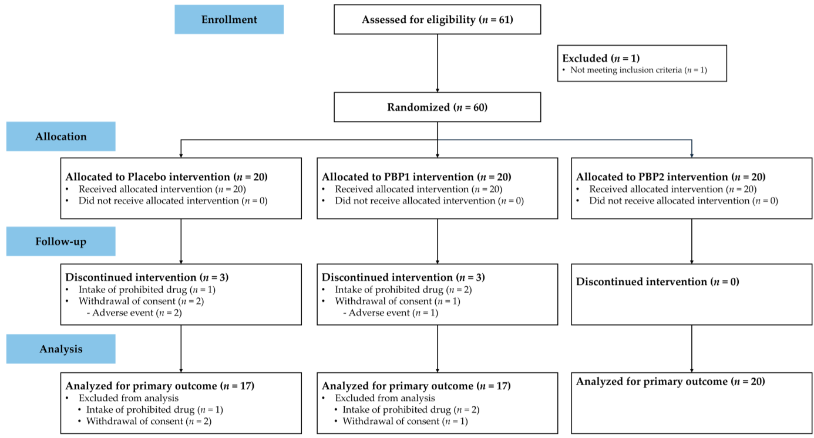
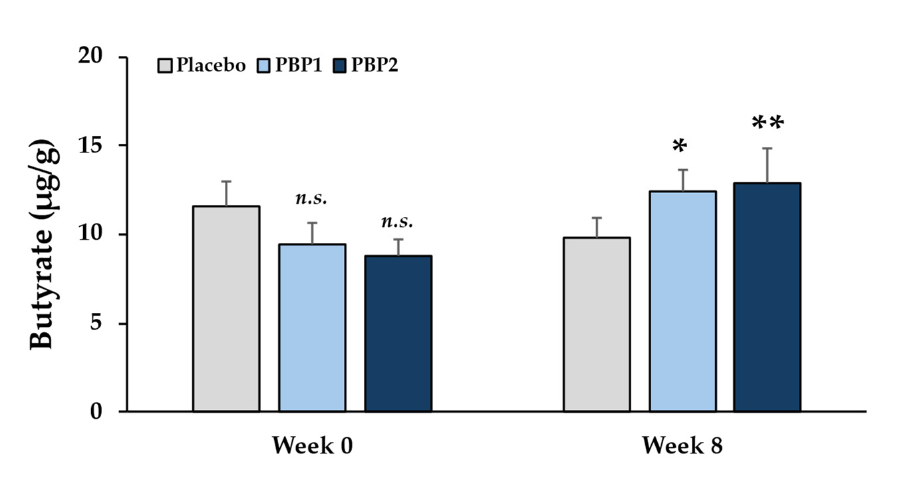
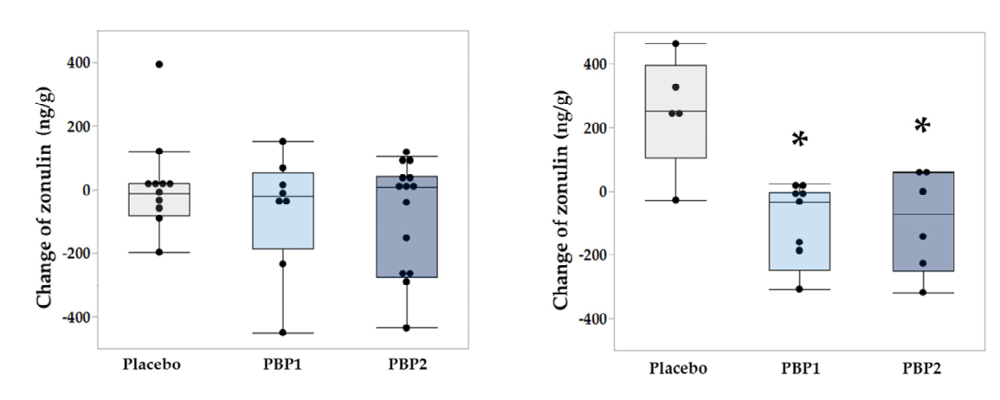
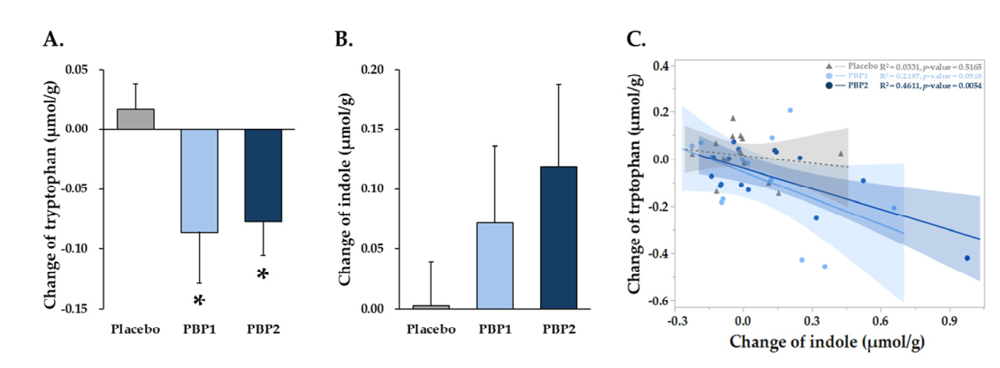
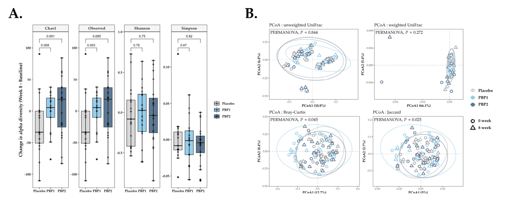
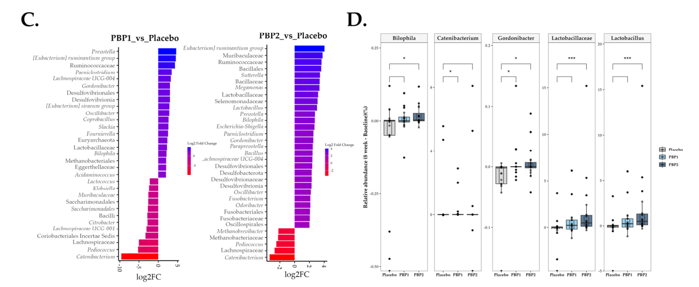
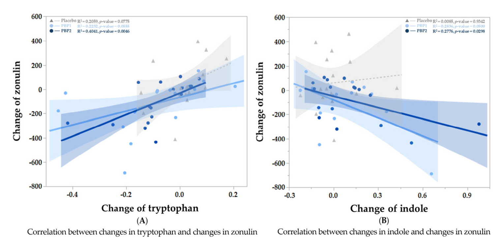

<!-- STATS STRIP -->

  

    

      
+13.96%

      
Tăng Phân Bình Thường (PBP1) (p = 0.0151 vs Placebo)

    

    

      
12.86 µg/g

      
Nồng Độ Butyrate Phân PBP2 (Tăng Vượt Trội p &lt; 0.01)

    

    

      
-155.6 ng/g

      
Giảm Zonulin Ở Người Thừa Cân (25 ≤ BMI &lt; 30, p &lt; 0.05)

    

    

      
R² = 0.4611

      
Tương Quan Nghịch Tryptophan-Indole (PBP2, p = 0.0054)

    

  

<!-- PILLARS -->

  

    

      
🌱

      

        
Hiệp Đồng Probiotics &amp; Phytonutrients

        
Sự phối hợp giữa men vi sinh (2 chủng hoặc 5 chủng) và hoạt chất thực vật (rễ bồ công anh, bioflavonoid cam quýt) vừa cung cấp cơ chất lên men prebiotic, vừa kích hoạt chuyển hóa bảo vệ niêm mạc đại tràng.

      

    

    

      
🛡️

      

        
Củng Cố Hàng Rào Ruột Theo BMI

        
Phân tích phân nhóm chứng minh hiệu quả giảm Zonulin phân đạt ý nghĩa thống kê vượt trội ở người thừa cân (25.0 ≤ BMI &lt; 30.0 kg/m²), sửa chữa hội chứng rò rỉ ruột và thắt chặt liên kết biểu mô.

      

    

    

      
🔄

      

        
Trục Tryptophan → Indole &amp; AhR

        
Hệ vi sinh chuyển hóa Tryptophan thành Indole và các dẫn xuất (IAA, ILA, IPA), kích hoạt thụ thể aryl hydrocarbon (AhR) giúp tăng cường tiết chất nhầy mucin và điều hòa phản ứng miễn dịch kháng viêm tại chỗ.

      

    

  

<!-- QUICKMENU -->

  

    <a href="#sec-1" class="quickmenu-item active">1. Cơ Chế Sinh Lý</a>
    <a href="#sec-2" class="quickmenu-item">2. Thiết Kế CONSORT</a>
    <a href="#sec-3" class="quickmenu-item">3. Thành Phần PBP1/PBP2</a>
    <a href="#sec-4" class="quickmenu-item">4. Đặc Điểm Bệnh Nhân</a>
    <a href="#sec-5" class="quickmenu-item">5. Đi Tiêu &amp; BSFS</a>
    <a href="#sec-6" class="quickmenu-item">6. Triệu Chứng GI &amp; QoL</a>
    <a href="#sec-7" class="quickmenu-item">7. Butyrate &amp; SCFAs</a>
    <a href="#sec-8" class="quickmenu-item">8. Zonulin &amp; BMI</a>
    <a href="#sec-9" class="quickmenu-item">9. Tryptophan &amp; Indole</a>
    <a href="#sec-10" class="quickmenu-item">10. Hệ Vi Sinh 16S</a>
    <a href="#sec-11" class="quickmenu-item">11. Tương Quan Zonulin</a>
    <a href="#sec-12" class="quickmenu-item">12. Thảo Luận Lâm Sàng</a>
    <a href="#sec-13" class="quickmenu-item">13. Tài Liệu Tham Khảo</a>
  

  <!-- ====================================================================== -->
  <!-- PHẦN 1: CƠ CHẾ SINH LÝ HỌC TRỤC VI SINH - HÀNG RÀO RUỘT                -->
  <!-- ====================================================================== -->
  

    

      🔬
      <h2 class="sec-title">Phần 1: Cơ Chế Sinh Lý Học Trục Vi Sinh - Hàng Rào Ruột &amp; Vai Trò Dưỡng Chất Thực Vật</h2>
      Sinh Lý Bệnh EBM
    

    

      

        Hệ sinh thái vi sinh vật đường ruột đóng vai trò tối quan trọng trong việc duy trì cân bằng nội môi cơ thể thông qua hỗ trợ tiêu hóa, tham gia vào chuyển hóa chất dinh dưỡng, tổng hợp các chất chuyển hóa có hoạt tính sinh học như axit béo chuỗi ngắn (SCFAs) và điều hòa chức năng miễn dịch niêm mạc. <strong>Sự rối loạn thành phần vi sinh vật đường ruột (dysbiosis) và suy giảm chức năng hàng rào biểu mô ruột</strong> có mối liên hệ mật thiết với các rối loạn thói quen đi tiêu (thay đổi tần suất, phân không thành khuôn, tiêu chảy hoặc táo bón) và tình trạng tăng tính thấm thành ruột.
      

      

        💡
        

          <strong>Cầu nối phân tử giữa Hệ vi sinh và Hàng rào biểu mô ruột:</strong>
          Các chất chuyển hóa có nguồn gốc từ vi khuẩn ruột đóng vai trò như các phân tử truyền tin điều phối cấu trúc và tính toàn vẹn của liên kết biểu mô.
        

      

      

        

          

          

            
🧪

            
Axit Béo Chuỗi Ngắn (SCFAs) &amp; Butyrate

          

          

            <ul style="margin-left: 1rem; line-height: 1.7;">
              <li><strong>Nguồn năng lượng số 1:</strong> Butyrate là nhiên liệu ưa thích hàng đầu nuôi dưỡng các tế bào biểu mô đại tràng (colonocytes).</li>
              <li><strong>Củng cố liên kết chặt:</strong> Thúc đẩy tăng cường biểu hiện của các protein liên kết chặt then chốt bao gồm <em>claudin-1, ZO-1 (zonula occludens-1), và occludin</em>, duy trì điện trở qua biểu mô (TEER).</li>
              <li><strong>Kích thích tiết chất nhầy:</strong> Kích hoạt các tế bào hình đài (goblet cells) sản xuất mucin bảo vệ lớp niêm dịch chống xâm lấn.</li>
              <li><strong>Điều hòa nhu động:</strong> Hỗ trợ quá trình hấp thu nước và điện giải trong lòng ruột, ổn định độ nhất quán của khối phân.</li>
            </ul>
          

          
Nhiên Liệu Biểu Mô Đại Tràng

        

        

          

          

            
🧬

            
Chuyển Hóa Tryptophan → Indole &amp; AhR

          

          

            <ul style="margin-left: 1rem; line-height: 1.7;">
              <li><strong>Chuyển hóa vi sinh:</strong> Tryptophan khẩu phần ăn được vi khuẩn ruột lên men thành <em>indole</em> và các dẫn xuất chuyển hóa (IAA, ILA, IPA).</li>
              <li><strong>Phối tử thụ thể AhR:</strong> Các indole metabolite hoạt động như các ligand tự nhiên kích hoạt thụ thể aryl hydrocarbon (AhR) trên tế bào biểu mô.</li>
              <li><strong>Sulfo-hóa Mucin:</strong> Tăng cường biến đổi sau dịch mã của chất nhầy, giúp lớp nhầy bền vững trước các enzym phân giải của vi khuẩn gây hại.</li>
              <li><strong>Kháng viêm niêm mạc:</strong> Ức chế phản ứng viêm mạn tính mức độ thấp tại biểu mô ruột.</li>
            </ul>
          

          
Kích Hoạt Thụ Thể AhR/PXR

        

        

          

          

            
🚪

            
Zonulin — Biomarker Hàng Rào Ruột

          

          

            <ul style="margin-left: 1rem; line-height: 1.7;">
              <li><strong>Chất điều hòa sinh lý:</strong> Zonulin kiểm soát sự mở thuận nghịch của các phức hợp liên kết chặt biểu mô ruột.</li>
              <li><strong>Hội chứng Rò rỉ ruột:</strong> Sự tăng hoạt hóa zonulin gây tái cấu trúc bộ khung tế bào (actin polymerization) và phân bố lại protein liên kết chặt, làm tăng tính thấm thành ruột.</li>
              <li><strong>Biomarker lâm sàng:</strong> Nồng độ zonulin trong phân là chỉ điểm không xâm lấn trực tiếp phản ánh mức độ suy giảm tính toàn vẹn hàng rào ruột.</li>
              <li><strong>Mục tiêu can thiệp:</strong> Giảm nồng độ zonulin phân đồng nghĩa với việc thắt chặt liên kết và phục hồi rào chắn niêm mạc.</li>
            </ul>
          

          
Chỉ Điểm Tính Thấm Biểu Mô

        

      

      

        🌿
        

          <strong>Tác động hiệp đồng của Dưỡng chất thực vật (Phytonutrients):</strong>
          Các hợp chất tự nhiên như <em>bột rễ bồ công anh (chứa inulin prebiotic)</em> và <em>phức hợp bioflavonoid cam quýt (polyphenol)</em> đóng vai trò là cơ chất chọn lọc nuôi dưỡng lợi khuẩn, ức chế vi khuẩn sinh độc tố, đồng thời kích thích các chủng vi khuẩn chuyển hóa sản sinh butyrate và indole bảo vệ vật chủ.
        

      

    

  

  <!-- ====================================================================== -->
  <!-- PHẦN 2: THIẾT KẾ THỬ NGHIỆM LÂM SÀNG & QUY TRÌNH CONSORT (FIG 1)       -->
  <!-- ====================================================================== -->
  

    

      📋
      <h2 class="sec-title">Phần 2: Thiết Kế Nghiên Cứu, Đạo Đức Y Khoa &amp; Sơ Đồ Lưu Đồ CONSORT 2025 (Figure 1)</h2>
      Thử Nghiệm RCT Mù Đôi
    

    

      

        

          

          

            
⚖️

            
Thiết Kế &amp; Đạo Đức Nghiên Cứu

          

          

            <ul style="margin-left: 1rem; line-height: 1.7;">
              <li><strong>Thiết kế:</strong> Thử nghiệm lâm sàng ngẫu nhiên, mù đôi, kiểm chứng bằng giả dược, song song 3 nhóm (Randomized, Double-Blind, Placebo-Controlled, Parallel-Group Trial).</li>
              <li><strong>Thời gian &amp; Địa điểm:</strong> Thực hiện từ tháng 11/2025 đến tháng 03/2026 tại HEM Pharma, Hàn Quốc.</li>
              <li><strong>Phê duyệt đạo đức:</strong> Ủy ban Đạo đức Viện Chính sách Sinh học Quốc gia Hàn Quốc (National Bioethics Policy Institute, IRB phê duyệt số <strong>P01-202511-01-048</strong>).</li>
              <li><strong>Đăng ký thử nghiệm lâm sàng:</strong> Clinical Research Information Service (CRIS, mã số <strong>KCT0011874</strong>). Tuân thủ Tuyên ngôn Helsinki và Thực hành lâm sàng tốt (GCP).</li>
            </ul>
          

          
CRIS KCT0011874

        

        

          

          

            
🎯

            
Tiêu Chuẩn Lựa Chọn &amp; Loại Trừ Nghiêm Ngặt

          

          

            <ul style="margin-left: 1rem; line-height: 1.7;">
              <li><strong>Tiêu chuẩn lựa chọn:</strong> Nam và nữ trưởng thành trên 19 tuổi, chỉ số khối cơ thể <strong>BMI ≤ 29.9 kg/m²</strong>, khỏe mạnh toàn thân.</li>
              <li><strong>Tiêu chuẩn loại trừ:</strong>
                <ul style="margin-left: 1rem; font-size: 0.85rem; margin-top: 4px;">
                  <li>Đã được chẩn đoán mắc Hội chứng ruột kích thích (IBS).</li>
                  <li>Mắc bệnh mạn tính nặng, ung thư, nhiễm trùng hoặc phẫu thuật lớn trong vòng 1 năm.</li>
                  <li>Sử dụng kháng sinh đường uống trong vòng 3 tháng trước sàng lọc.</li>
                  <li>Dùng men vi sinh, prebiotic thường xuyên mà không chấp thuận ngưng dùng (washout 1 tuần trước và trong suốt nghiên cứu).</li>
                  <li>Ăn kiêng galactose/lactose, hoặc dị ứng rượu đường (sorbitol, mannitol, lactulose...).</li>
                  <li>Phụ nữ có thai, đang cho con bú hoặc dự định mang thai.</li>
                </ul>
              </li>
            </ul>
          

          
Kiểm Soát Nhiễu Triệt Để

        

      

      <!-- FIGURE 1 CONSORT -->
      

        
        

          
Figure 1. Participant flow chart (CONSORT 2025)

          Lưu đồ dòng chảy người tham gia nghiên cứu theo chuẩn CONSORT: Sàng lọc 61 cá nhân, loại 1 trường hợp không đáp ứng tiêu chuẩn. Phân bổ ngẫu nhiên 60 người vào 3 nhánh (tỷ lệ 1:1:1). Nhóm Placebo có 3 người bỏ cuộc (1 dùng thuốc cấm, 2 rút lui); nhóm PBP1 có 3 người bỏ cuộc (2 dùng thuốc cấm, 1 rút lui); nhóm PBP2 đạt tỷ lệ duy trì 100% (0 ca bỏ cuộc). Phân tích kết cục cuối cùng trên 54 đối tượng hoàn thành (Placebo n = 17, PBP1 n = 17, PBP2 n = 20).
        

      

      <!-- VISUAL CONSORT FLOWCHART COMPONENT -->
      

        

          <i class="fa-solid fa-diagram-project"></i> SƠ ĐỒ TRỰC QUAN HÓA LƯU ĐỒ PHÂN BỔ CONSORT (54 HOÀN THÀNH / 60 NGẪU NHIÊN)
        

        
        

          

            SÀNG LỌC BAN ĐẦU: <strong>61 Cá nhân</strong> 
            (Loại n = 1 do không đạt tiêu chuẩn chọn lựa)
          

          
<i class="fa-solid fa-arrow-down"></i>

          

            NGẪU NHIÊN HÓA (1:1:1): <strong>60 Bệnh Nhân</strong>
          

          
<i class="fa-solid fa-arrows-split-up-and-left fa-rotate-180"></i>

          

            <!-- Placebo -->
            

              
NHÓM GIẢ DƯỢC (Placebo)

              
Phân bổ ban đầu: <strong>n = 20</strong>

              

                Bỏ cuộc n = 3 (1 dùng thuốc cấm, 2 rút lui)
              

              
Hoàn thành: n = 17

            

            <!-- PBP1 -->
            

              
NHÓM PBP1 (2 Chủng)

              
Phân bổ ban đầu: <strong>n = 20</strong>

              

                Bỏ cuộc n = 3 (2 dùng thuốc cấm, 1 rút lui)
              

              
Hoàn thành: n = 17

            

            <!-- PBP2 -->
            

              
NHÓM PBP2 (5 Chủng)

              
Phân bổ ban đầu: <strong>n = 20</strong>

              

                <strong>100% Duy trì</strong> (0 ca bỏ cuộc)
              

              
Hoàn thành: n = 20

            

          

          

            <strong>Tổng số phân tích kết cục cuối cùng:</strong> 54 đối tượng (Được đưa vào phân tích hóa sinh SCFAs, Zonulin, 16S rRNA và chuyển hóa Tryptophan).
          

        

      

    

  

  <!-- ====================================================================== -->
  <!-- PHẦN 3: CẤU TRÚC BÀO CHẾ CÔNG THỨC CAN THIỆP PBP1, PBP2 & PLACEBO       -->
  <!-- ====================================================================== -->
  

    

      💊
      <h2 class="sec-title">Phần 3: Cấu Trúc Thành Phần Công Thức Can Thiệp Bào Chế: PBP1 vs PBP2 &amp; Giả Dược</h2>
      Dược Lý Học Bổ Sung
    

    

      

        Các sản phẩm thử nghiệm được bào chế dưới dạng viên nang cứng <strong>300 mg</strong>, đóng trong bao bì và ngoại quan giống hệt nhau để đảm bảo làm mù tuyệt đối. Liều dùng: <strong>1 viên/ngày</strong>, uống với nước vào lúc đói trước bữa ăn, liên tục trong 8 tuần:
      

      

        <table class="regimen-table">
          <thead>
            <tr>
              <th style="width:20%">Công Thức Can Thiệp</th>
              <th style="width:35%">Thành Phần Men Vi Sinh (Probiotics)</th>
              <th style="width:25%">Thành Phần Dưỡng Chất Thực Vật (Phytonutrients)</th>
              <th style="width:20%">Mật Độ Khuẩn Sống &amp; Tá Dược</th>
            </tr>
          </thead>
          <tbody>
            <tr>
              <td class="source-cell">
                PBP1 (2 Chủng) 
                <strong>Probiotic Blend 1</strong>
              </td>
              <td>
                • <em>Lacticaseibacillus rhamnosus</em> HEM648 (Nutrilite 648™) 
                • <em>Lacticaseibacillus paracasei</em> HEM272 (Nutrilite 272™)
              </td>
              <td>
                • Bột rễ bồ công anh (chứa prebiotic inulin tự nhiên) 
                • Phức hợp bioflavonoid cam quýt (citrus bioflavonoids)
              </td>
              <td>
                <strong>3.0 × 10⁹ CFU/viên</strong> (3 tỷ CFU) 
                Tá dược: Tinh bột ngô (viên nang 300 mg)
              </td>
            </tr>
            <tr>
              <td class="source-cell">
                PBP2 (5 Chủng) 
                <strong>Phức Hợp Đa Chủng</strong>
              </td>
              <td>
                <strong>Hợp chất 3 chủng HEM:</strong> 
                • <em>Bifidobacterium animalis</em> subsp. <em>lactis</em> IDCC 4301 
                • <em>Lacticaseibacillus rhamnosus</em> IDCC 3201 
                • <em>Lactobacillus acidophilus</em> IDCC 3302 
                <em>Phối hợp cùng:</em> 
                • <em>L. rhamnosus</em> HEM648 
                • <em>L. paracasei</em> HEM272
              </td>
              <td>
                • Bột rễ bồ công anh 
                • Phức hợp bioflavonoid cam quýt 
                (Tương tự PBP1 để so sánh hiệu ứng đa chủng)
              </td>
              <td>
                <strong>1.0 × 10¹⁰ CFU/viên</strong> (10 tỷ CFU) 
                Tá dược: Tinh bột ngô (viên nang 300 mg)
              </td>
            </tr>
            <tr>
              <td class="source-cell">
                Giả Dược (Placebo) 
                <strong>Đối Chứng Âm</strong>
              </td>
              <td>
                <em>Không chứa men vi sinh</em>
              </td>
              <td>
                <em>Không chứa dưỡng chất thực vật</em>
              </td>
              <td>
                100% Tinh bột ngô (300 mg) 
                Hình dạng, màu sắc, mùi vị giống viên thử nghiệm
              </td>
            </tr>
          </tbody>
        </table>
      

      

        📐
        

          <strong>Phương pháp thống kê &amp; Cỡ mẫu:</strong>
          Cỡ mẫu được tính toán dựa trên mức biến động dự kiến của nồng độ Butyrate phân (tăng 0.77 ± 0.71 µmol/g ở nhóm can thiệp vs 0.06 ± 0.71 µmol/g ở giả dược), lực lượng thống kê 80%, alpha = 0.05 → Cần tối thiểu 17 người/nhóm. Dự phòng 15% bỏ cuộc → Tuyển chọn 20 người/nhóm. Phân tích thực hiện trên <strong>JMP v17.1.0 và R v4.3.0</strong> (sử dụng Paired t-test, Wilcoxon signed-rank, ANOVA, Kruskal-Wallis, McNemar, DESeq2 và PERMANOVA).
        

      

    

  

  <!-- ====================================================================== -->
  <!-- PHẦN 4: ĐẶC ĐIỂM NHÂN TRẮC HỌC & LÂM SÀNG NỀN (TABLE 1)                -->
  <!-- ====================================================================== -->
  

    

      👥
      <h2 class="sec-title">Phần 4: Đặc Điểm Nhân Trắc Học &amp; Lâm Sàng Nền Của Đối Tượng Tham Gia (Table 1)</h2>
      Dữ Liệu Baseline Cân Bằng
    

    

      

        Phân tích đối sánh các chỉ số tại thời điểm ban đầu (Week 0) khẳng định không có sự khác biệt có ý nghĩa thống kê giữa ba nhóm về tuổi tác, giới tính, chỉ số khối cơ thể BMI, điểm số phân khuôn Bristol, tổng nồng độ SCFAs, Butyrate hay Zonulin phân (tất cả p &gt; 0.05), chứng minh quy trình ngẫu nhiên hóa phân bổ hoàn toàn đồng đều:
      

      

        <table class="regimen-table">
          <thead>
            <tr>
              <th style="width:30%">Chỉ Số Đánh Giá Baseline</th>
              <th style="width:22%">Nhóm PBP1 (n = 17)</th>
              <th style="width:22%">Nhóm PBP2 (n = 20)</th>
              <th style="width:22%">Nhóm Placebo (n = 17)</th>
              <th style="width:14%">Giá Trị p (Tổng thể)</th>
            </tr>
          </thead>
          <tbody>
            <tr>
              <td class="source-cell"><strong>Tuổi trung bình (năm)</strong></td>
              <td>40.18 ± 10.34</td>
              <td>41.10 ± 9.53</td>
              <td>39.47 ± 8.80</td>
              <td>0.8740</td>
            </tr>
            <tr>
              <td class="source-cell"><strong>Giới tính Nữ (% (n))</strong></td>
              <td>58.82% (10)</td>
              <td>60.00% (12)</td>
              <td>47.06% (8)</td>
              <td>0.6940</td>
            </tr>
            <tr>
              <td class="source-cell"><strong>Chỉ số BMI (kg/m²)</strong></td>
              <td>24.23 ± 4.02</td>
              <td>23.36 ± 3.04</td>
              <td>22.85 ± 3.18</td>
              <td>0.5002</td>
            </tr>
            <tr>
              <td class="source-cell">• BMI &lt; 25.0 kg/m² (% (n))</td>
              <td>47.06% (8)</td>
              <td>70.00% (14)</td>
              <td>70.59% (12)</td>
              <td>0.2602</td>
            </tr>
            <tr>
              <td class="source-cell">• 25.0 ≤ BMI &lt; 30.0 kg/m² (% (n))</td>
              <td>52.94% (9)</td>
              <td>30.00% (6)</td>
              <td>29.41% (5)</td>
              <td>0.2602</td>
            </tr>
            <tr>
              <td class="source-cell"><strong>Điểm nhất quán của phân (BSFS)</strong></td>
              <td>4.12 ± 0.99</td>
              <td>4.25 ± 1.25</td>
              <td>4.06 ± 1.25</td>
              <td>0.8785</td>
            </tr>
            <tr>
              <td class="source-cell">• Táo bón (BSFS Type 1–2) (% (n))</td>
              <td>11.76% (2)</td>
              <td>5.00% (1)</td>
              <td>11.76% (2)</td>
              <td>0.7446</td>
            </tr>
            <tr>
              <td class="source-cell">• Bình thường (BSFS Type 3–5) (% (n))</td>
              <td>82.35% (14)</td>
              <td>75.00% (15)</td>
              <td>76.47% (13)</td>
              <td>0.7446</td>
            </tr>
            <tr>
              <td class="source-cell">• Tiêu chảy (BSFS Type 6–7) (% (n))</td>
              <td>5.88% (1)</td>
              <td>20.00% (4)</td>
              <td>11.76% (2)</td>
              <td>0.7446</td>
            </tr>
            <tr>
              <td class="source-cell"><strong>Tổng lượng SCFAs phân (µg/g)</strong></td>
              <td>67.94 ± 20.94</td>
              <td>68.01 ± 18.42</td>
              <td>82.33 ± 26.95</td>
              <td>0.0974</td>
            </tr>
            <tr>
              <td class="source-cell"><strong>Butyrate phân (µg/g)</strong></td>
              <td>9.47 ± 4.90</td>
              <td>8.82 ± 4.05</td>
              <td>11.58 ± 5.79</td>
              <td>0.2242</td>
            </tr>
            <tr>
              <td class="source-cell"><strong>Zonulin phân (ng/mL)</strong></td>
              <td>299.88 ± 187.75</td>
              <td>246.89 ± 175.54</td>
              <td>240.99 ± 181.47</td>
              <td>0.5777</td>
            </tr>
          </tbody>
        </table>
      

      

        <em>Ghi chú: Dữ liệu được biểu diễn dưới dạng Trung bình ± Độ lệch chuẩn (Mean ± SD) hoặc tỷ lệ phần trăm (số lượng ca). Giá trị p so sánh tổng thể giữa 3 nhóm tại thời điểm nền (ANOVA hoặc Chi-square test).</em>
      

    

  

  <!-- ====================================================================== -->
  <!-- PHẦN 5: ĐỘNG HỌC CẢI THIỆN TÍNH CHẤT PHÂN BSFS (TABLE 2)               -->
  <!-- ====================================================================== -->
  

    

      🚽
      <h2 class="sec-title">Phần 5: Động Học Biến Đổi Tính Chất Phân Theo Thang Đo Bristol (BSFS 7-Day Diary)</h2>
      Hiệu Quả Lâm Sàng Tại Giường
    

    

      

        Nhật ký theo dõi thói quen đi tiêu 7 ngày dựa trên Thang đo phân Bristol (Bristol Stool Form Scale - BSFS) cho thấy sự tối ưu hóa rõ rệt về hình thái khuôn phân ở cả hai nhóm can thiệp so với nhóm giả dược:
      

      

        

          

          

            
📈

            
Tăng Vọt Tỷ Lệ Phân Bình Thường (Type 3–5)

          

          

            <ul style="margin-left: 1rem; line-height: 1.7;">
              <li><strong>Nhóm PBP1 (2 chủng):</strong> Tỷ lệ phân bình thường tăng mạnh từ 74.10% lên <strong>88.07% ở tuần thứ 8</strong> (p = 0.0005 so với nền). Mức tăng ròng đạt <strong>+13.96% so với giả dược (p = 0.0151)</strong>.</li>
              <li><strong>Nhóm PBP2 (5 chủng):</strong> Cải thiện xuất hiện rất sớm ngay từ tuần thứ 4 (+15.50% vs giả dược, p = 0.0360) và duy trì vững chắc đến tuần thứ 8 với mức tăng ròng <strong>+12.22% (79.67% vs 67.08%, p = 0.0226)</strong>.</li>
              <li><strong>Nhóm Giả dược:</strong> Hoàn toàn không ghi nhận cải thiện (70.39% còn 67.08% ở tuần 8, p = 0.5321).</li>
            </ul>
          

          
Khuôn Phân Tối Ưu

        

        

          

          

            
💧

            
Giảm Đột Biến Phân Lỏng &amp; Tiêu Chảy (Type 6–7)

          

          

            <ul style="margin-left: 1rem; line-height: 1.7;">
              <li><strong>Nhóm PBP2:</strong> Tỷ lệ phân lỏng/tiêu chảy giảm mạnh từ 24.14% xuống còn 12.06% ở tuần thứ 4 (p = 0.0468 so với giả dược) và duy trì ở mức 16.26% ở tuần thứ 8.</li>
              <li><strong>Nhóm PBP1:</strong> Tỷ lệ phân lỏng giảm từ 16.39% còn <strong>9.36% ở tuần thứ 8</strong>.</li>
              <li><strong>Giảm phân táo bón (Type 1–2):</strong> Nhóm PBP1 giảm táo bón từ 9.51% xuống chỉ còn <strong>2.57%</strong> ở tuần thứ 8 (p = 0.0130 so với nền).</li>
            </ul>
          

          
Hạn Chế Phân Nước

        

      

      <!-- TABLE 2 -->
      

        <table class="regimen-table">
          <thead>
            <tr>
              <th style="width:14%">Nhóm</th>
              <th style="width:10%">Mốc Tuần</th>
              <th style="width:20%">Phân Táo Bón (BSFS 1–2) (%)</th>
              <th style="width:22%">Phân Bình Thường (BSFS 3–5) (%)</th>
              <th style="width:20%">Phân Tiêu Chảy (BSFS 6–7) (%)</th>
              <th style="width:18%">p† (vs Tuần 0) / p‡ (vs Placebo)</th>
            </tr>
          </thead>
          <tbody>
            <tr>
              <td class="source-cell" rowspan="3">
                <strong>PBP1</strong> 
                (2 Chủng)
              </td>
              <td>Tuần 0</td>
              <td>9.51 ± 12.72</td>
              <td>74.10 ± 22.80</td>
              <td>16.39 ± 17.55</td>
              <td>—</td>
            </tr>
            <tr>
              <td>Tuần 4</td>
              <td>6.71 ± 14.43</td>
              <td>76.56 ± 26.45</td>
              <td>16.73 ± 21.43</td>
              <td>p† = 0.6830 / p‡ = 0.1432</td>
            </tr>
            <tr style="background: rgba(16, 185, 129, 0.05);">
              <td><strong>Tuần 8</strong></td>
              <td><strong>2.57 ± 6.09</strong></td>
              <td><strong>88.07 ± 17.45</strong></td>
              <td><strong>9.36 ± 13.86</strong></td>
              <td><strong>p† = 0.0005 / p‡ = 0.0151</strong></td>
            </tr>

            <tr>
              <td class="source-cell" rowspan="3">
                <strong>PBP2</strong> 
                (5 Chủng)
              </td>
              <td>Tuần 0</td>
              <td>8.42 ± 14.05</td>
              <td>67.44 ± 29.06</td>
              <td>24.14 ± 25.83</td>
              <td>—</td>
            </tr>
            <tr style="background: rgba(139, 92, 246, 0.05);">
              <td>Tuần 4</td>
              <td>5.00 ± 15.39</td>
              <td>82.94 ± 23.19</td>
              <td>12.06 ± 17.21</td>
              <td>p† = 0.0438 / <strong>p‡ = 0.0360</strong></td>
            </tr>
            <tr style="background: rgba(139, 92, 246, 0.08);">
              <td><strong>Tuần 8</strong></td>
              <td><strong>4.07 ± 7.62</strong></td>
              <td><strong>79.67 ± 20.74</strong></td>
              <td><strong>16.26 ± 18.82</strong></td>
              <td><strong>p† = 0.0304 / p‡ = 0.0226</strong></td>
            </tr>

            <tr>
              <td class="source-cell" rowspan="3">
                <strong>Placebo</strong> 
                (Giả dược)
              </td>
              <td>Tuần 0</td>
              <td>13.01 ± 17.41</td>
              <td>70.39 ± 25.57</td>
              <td>16.61 ± 27.23</td>
              <td>—</td>
            </tr>
            <tr>
              <td>Tuần 4</td>
              <td>15.82 ± 18.27</td>
              <td>67.01 ± 22.19</td>
              <td>17.18 ± 20.80</td>
              <td>p† = 0.5127</td>
            </tr>
            <tr>
              <td>Tuần 8</td>
              <td>16.42 ± 24.20</td>
              <td>67.08 ± 27.59</td>
              <td>16.50 ± 20.71</td>
              <td>p† = 0.5321</td>
            </tr>
          </tbody>
        </table>
      

      

        <em>Ghi chú: Dữ liệu tính toán dựa trên nhật ký đi tiêu 7 ngày liên tục. p†: So sánh trong cùng một nhóm đối chiếu với thời điểm nền Tuần 0; p‡: So sánh mức biến thiên ròng đối chiếu với nhóm Giả dược (Placebo).</em>
      

    

  

  <!-- ====================================================================== -->
  <!-- PHẦN 6: TRIỆU CHỨNG TIÊU HÓA, ĐỘ KHẨN CẤP ĐI TIÊU & CHẤT LƯỢNG CUỘC SỐNG-->
  <!-- ====================================================================== -->
  

    

      ⚡
      <h2 class="sec-title">Phần 6: Triệu Chứng Tiêu Hóa Lâm Sàng, Mức Độ Khẩn Cấp Đi Tiêu Sau Ăn &amp; Chất Lượng Cuộc Sống</h2>
      Gánh Nặng Tiêu Hóa
    

    

      

        

          

          

            
⏱️

            
Độ Khẩn Cấp Đi Tiêu Sau Ăn (Postprandial Urgency)

          

          

            <ul style="margin-left: 1rem; line-height: 1.7;">
              <li><strong>Cải thiện vượt trội ở PBP1:</strong> Ghi nhận sự sụt giảm có ý nghĩa thống kê về mức độ khẩn cấp phải đi tiêu ngay sau khi ăn ở cả <strong>Tuần 4 (p = 0.0066)</strong> và <strong>Tuần 8 (p = 0.0029)</strong> so với giả dược.</li>
              <li><strong>Ý nghĩa thực tế:</strong> Giúp bệnh nhân chủ động hơn trong sinh hoạt hằng ngày, giảm áp lực tâm lý phải tìm kiếm nhà vệ sinh khẩn cấp sau bữa ăn.</li>
              <li><strong>Nhóm PBP2:</strong> Cũng ghi nhận xu hướng giảm độ khẩn cấp đi tiêu nhưng chưa đạt mức ý nghĩa thống kê.</li>
            </ul>
          

          
Giảm Cơn Mót Rặn Sau Ăn

        

        

          

          

            
🎯

            
Điều Hòa Tần Suất Đi Tiêu (Bowel Frequency)

          

          

            <ul style="margin-left: 1rem; line-height: 1.7;">
              <li><strong>Ổn định sớm ở PBP2:</strong> Nhóm 5 chủng PBP2 ghi nhận điểm số tần suất đi tiêu thấp hơn đáng kể và điều hòa nhịp nhàng hơn so với giả dược ở mốc tuần thứ 4 <strong>(p = 0.0015)</strong>.</li>
              <li><strong>Triệu chứng khác:</strong> Thời gian ngồi đại tiện, mức độ đau quặn bụng, chướng hơi đầy bụng không ghi nhận sự khác biệt bất lợi giữa các nhóm can thiệp và giả dược (p &gt; 0.05).</li>
              <li><strong>Chất lượng cuộc sống (QoL):</strong> Điểm tổng thể không khác biệt, nhưng phân tích từng khía cạnh ghi nhận sự cải thiện về mặt số học đối với sự thuận tiện trong sinh hoạt và giảm gánh nặng lo âu tiêu hóa.</li>
            </ul>
          

          
Nhịp Đi Tiêu Cân Bằng

        

      

    

  

  <!-- ====================================================================== -->
  <!-- PHẦN 7: ĐỘNG HỌC AXIT BÉO CHUỖI NGẮN (SCFAs) & NỒNG ĐỘ BUTYRATE (FIG 4) -->
  <!-- ====================================================================== -->
  

    

      🧪
      <h2 class="sec-title">Phần 7: Động Học Axit Béo Chuỗi Ngắn (SCFAs) &amp; Nồng Độ Butyrate Nuôi Đại Tràng (Figure 4)</h2>
      Kích Hoạt Lên Men Lợi Khuẩn
    

    

      

        Phân tích định lượng hóa sinh các chất chuyển hóa trong phân chứng minh việc bổ sung Probiotic phối hợp Phytonutrients đã kích hoạt mạnh mẽ hoạt động lên men carbohydrate của hệ vi sinh vật đường ruột:
      

      

        

          

          

            
📊

            
Tổng Nồng Độ SCFAs Phân

          

          

            <ul style="margin-left: 1rem; line-height: 1.7;">
              <li><strong>Nhóm PBP1:</strong> Tăng <strong>+11.19 ± 18.29 µg/g</strong> (tương ứng tăng <strong>+20.01%</strong>, p = 0.0285 so với thời điểm nền).</li>
              <li><strong>Nhóm PBP2:</strong> Tăng <strong>+14.90 ± 29.14 µg/g</strong> (tương ứng tăng <strong>+24.65%</strong>, p = 0.0062 so với thời điểm nền).</li>
              <li><strong>Nhóm Giả dược:</strong> Giảm trung bình <strong>-4.82%</strong> sau 8 tuần.</li>
              <li><strong>So sánh ở Tuần 8:</strong> Tổng hàm lượng SCFAs ở cả PBP1 và PBP2 đều vượt trội có ý nghĩa thống kê so với giả dược (p &lt; 0.05).</li>
            </ul>
          

          
Tăng Tổng SCFAs +24.6%

        

        

          

          

            
🧈

            
Hàm Lượng Butyrate &amp; Acetate

          

          

            <ul style="margin-left: 1rem; line-height: 1.7;">
              <li><strong>Động lực chính:</strong> Sự gia tăng SCFAs được dẫn dắt bởi Butyrate và Acetate.</li>
              <li><strong>Nhóm PBP1:</strong> Butyrate tăng từ 9.47 ± 1.19 µg/g lên <strong>12.42 ± 1.20 µg/g</strong> (* p &lt; 0.05 so với giả dược).</li>
              <li><strong>Nhóm PBP2:</strong> Butyrate tăng mạnh nhất từ 8.82 ± 0.91 µg/g lên <strong>12.86 ± 1.97 µg/g</strong> (** p &lt; 0.01 so với giả dược).</li>
              <li><strong>Nhóm Giả dược:</strong> Butyrate giảm từ 11.58 ± 1.40 µg/g xuống còn 9.80 ± 1.11 µg/g.</li>
            </ul>
          

          
Butyrate Tăng Đột Phá

        

      

      <!-- FIGURE 4 -->
      

        
        

          
Figure 4. Changes in fecal butyrate levels following PBP1 and PBP2 supplementation

          Biểu đồ cột biểu diễn nồng độ Butyrate trong phân (đơn vị: µg/g, Mean ± SE) ở thời điểm nền (Week 0) và sau 8 tuần can thiệp (Week 8) giữa 3 nhóm Placebo, PBP1 và PBP2. Tại Week 0, nồng độ butyrate giữa các nhóm tương đương nhau không có ý nghĩa thống kê (n.s.). Sau 8 tuần, nồng độ Butyrate ở nhóm PBP1 tăng lên 12.42 µg/g (* p &lt; 0.05 vs Placebo) và nhóm PBP2 tăng mạnh lên 12.86 µg/g (** p &lt; 0.01 vs Placebo), trong khi nhóm giả dược sụt giảm còn 9.80 µg/g. Phân tích thống kê dựa trên giá trị biến thiên thực tế (Delta value).
        

      

    

  

  <!-- ====================================================================== -->
  <!-- PHẦN 8: ĐỘNG HỌC ZONULIN PHÂN & HIỆU QUẢ HÀNG RÀO RUỘT THEO BMI (FIG 5) -->
  <!-- ====================================================================== -->
  

    

      🛡️
      <h2 class="sec-title">Phần 8: Động Học Zonulin Phân &amp; Hiệu Hóa Hàng Rào Ruột Phụ Thuộc BMI Nền (Figure 5)</h2>
      Phân Nhóm Trúng Đích
    

    

      

        <strong>Zonulin</strong> là chỉ điểm then chốt phản ánh sự nới lỏng của các liên kết chặt biểu mô ruột. Khi đánh giá chung trên toàn bộ dân số nghiên cứu, nồng độ zonulin phân có xu hướng giảm ở cả hai nhóm can thiệp nhưng chưa đạt ý nghĩa thống kê do sự bù trừ giữa các nhóm thể trạng. Tuy nhiên, sự khác biệt mang tính đột phá xuất hiện khi tiến hành <strong>phân tích phân nhóm theo chỉ số BMI nền</strong>:
      

      

        

          

          

            
⚖️

            
Phân Nhóm BMI Bình Thường (&lt; 25.0 kg/m²)

          

          

            <ul style="margin-left: 1rem; line-height: 1.7;">
              <li><strong>Kết quả:</strong> Cả nhóm PBP1 và PBP2 đều ghi nhận xu hướng giảm nồng độ zonulin phân sau 8 tuần nhưng không có sự khác biệt có ý nghĩa thống kê so với giả dược.</li>
              <li><strong>Cơ chế:</strong> Ở những cá nhân có thể trạng bình thường, hàng rào biểu mô ruột vốn dĩ đã tương đối nguyên vẹn và ổn định (ceiling effect), do đó mức độ biến thiên zonulin không lớn.</li>
            </ul>
          

          
Hàng Rào Vốn Ổn Định

        

        

          

          

            
🎯

            
Phân Nhóm Thừa Cân (25.0 ≤ BMI &lt; 30.0 kg/m²)

          

          

            <ul style="margin-left: 1rem; line-height: 1.7;">
              <li><strong>Giảm Zonulin vượt bậc:</strong> Cả hai nhóm can thiệp đều ghi nhận sự sụt giảm mạnh mẽ và đạt ý nghĩa thống kê so với giả dược <strong>(p &lt; 0.05 vs Placebo)</strong>.</li>
              <li><strong>Mức giảm định lượng:</strong>
                 • Nhóm PBP1: Giảm ròng <strong>-155.62 ± 228.95 ng/g</strong>.
                 • Nhóm PBP2: Giảm ròng <strong>-95.55 ± 158.64 ng/g</strong>.
              </li>
              <li><strong>Cơ chế khuếch đại đáp ứng (Amplified response):</strong> Người thừa cân thường có tình trạng loạn khuẩn ruột, viêm mạn tính và tăng tính thấm biểu mô ruột nền; do đó, khi nhận can thiệp vi sinh và phytonutrients, khả năng phục hồi và thắt chặt liên kết biểu mô diễn ra rõ rệt nhất.</li>
            </ul>
          

          
Sửa Chữa Rò Rỉ Ruột

        

      

      <!-- FIGURE 5 -->
      

        
        

          
Figure 5. Changes in fecal zonulin levels according to baseline BMI subgroups

          Biểu đồ hộp (Box plot) biểu diễn trung vị và khoảng tứ phân vị (IQR) kết hợp các điểm dữ liệu cá thể về sự biến đổi nồng độ Zonulin phân (Delta Zonulin, Tuần 8 - Tuần 0) phân tầng theo phân nhóm BMI nền: Ở phân nhóm BMI &lt; 25.0 kg/m² (bên trái), không có sự khác biệt ý nghĩa giữa các nhóm. Ở phân nhóm thừa cân 25.0 ≤ BMI &lt; 30.0 kg/m² (bên phải), nồng độ zonulin phân sụt giảm mạnh mẽ và có ý nghĩa thống kê ở cả hai nhóm can thiệp PBP1 và PBP2 so với nhóm giả dược (* p &lt; 0.05 vs Placebo).
        

      

    

  

  <!-- ====================================================================== -->
  <!-- PHẦN 9: KÍCH HOẠT CHUYỂN HÓA TRYPTOPHAN THÀNH INDOLE (FIG 6)           -->
  <!-- ====================================================================== -->
  

    

      🔄
      <h2 class="sec-title">Phần 9: Điều Hòa Con Đường Chuyển Hóa Tryptophan Thành Indole Bảo Vệ Niêm Mạc (Figure 6)</h2>
      Trục Trao Đổi Chất Vi Sinh
    

    

      

        <strong>Tryptophan</strong> là axit amin thiết yếu khẩu phần. Một phần tryptophan trong lòng ruột được hệ vi sinh vật lên men chuyển hóa thành <strong>Indole</strong> và các dẫn xuất (IAA, ILA, IPA), hoạt động như phối tử kích hoạt thụ thể <em>AhR (Aryl Hydrocarbon Receptor)</em> và <em>PXR</em> trên tế bào biểu mô đại tràng, thúc đẩy phiên mã gene liên kết chặt và kích thích sulfo-hóa chất nhầy mucin:
      

      

        

          

          

            
📉

            
Giảm Tiêu Thụ Tryptophan Tự Do Trong Phân

          

          

            <ul style="margin-left: 1rem; line-height: 1.7;">
              <li><strong>Nhóm PBP1:</strong> Tryptophan phân giảm <strong>-0.0862 ± 0.1743 µmol/g (p = 0.0285)</strong> so với giả dược.</li>
              <li><strong>Nhóm PBP2:</strong> Tryptophan phân giảm <strong>-0.0771 ± 0.1201 µmol/g (p = 0.0456)</strong> so với giả dược.</li>
              <li><strong>Ý nghĩa:</strong> Thể hiện sự tăng tốc độ tiêu thụ và biến đổi sinh học của tryptophan bởi các chủng vi khuẩn được bổ sung.</li>
            </ul>
          

          
Tăng Sử Dụng Tryptophan

        

        

          

          

            
📈

            
Tăng Sinh Sản Phẩm Chuyển Hóa Indole

          

          

            <ul style="margin-left: 1rem; line-height: 1.7;">
              <li><strong>Nhóm PBP1:</strong> Indole phân tăng trung bình <strong>+0.0719 ± 0.2398 µmol/g</strong>.</li>
              <li><strong>Nhóm PBP2:</strong> Indole phân tăng mạnh <strong>+0.1184 ± 0.2842 µmol/g</strong>.</li>
              <li><strong>Nhóm Giả dược:</strong> Thay đổi không đáng kể (+0.0027 ± 0.1468 µmol/g).</li>
              <li><strong>Dẫn xuất khác:</strong> IAA (indole-acetic acid), ILA (indole-lactic acid) và IPA (indolepropionic acid) cũng ghi nhận xu hướng tăng đồng thuận.</li>
            </ul>
          

          
Tăng Sinh Indole Kháng Viêm

        

      

      <!-- FIGURE 6 -->
      

        
        

          
Figure 6. Modulation of tryptophan metabolism toward indole production following PBP1 and PBP2 supplementation

          (A) và (B): Biểu đồ cột (Mean ± SE) thể hiện mức biến thiên (Delta, Tuần 8 - Tuần 0) của Tryptophan (A) và Indole (B) trong phân. Nồng độ Tryptophan giảm có ý nghĩa ở cả PBP1 và PBP2 (* p &lt; 0.05 vs Placebo) song hành cùng sự gia tăng tương ứng của Indole. (C): Đồ thị phân tán thể hiện mối tương quan tuyến tính ngược chiều giữa mức giảm Tryptophan và mức tăng Indole. Nhóm 5 chủng PBP2 thể hiện mối tương quan nghịch có ý nghĩa thống kê rất mạnh (R² = 0.4611, p = 0.0054), chứng minh khả năng tối ưu hóa con đường chuyển hóa tryptophan vượt trội của công thức phối hợp đa chủng.
        

      

    

  

  <!-- ====================================================================== -->
  <!-- PHẦN 10: BIẾN ĐỔI CẤU TRÚC HỆ VI SINH VẬT RUỘT 16S rRNA (FIG 7)       -->
  <!-- ====================================================================== -->
  

    

      🦠
      <h2 class="sec-title">Phần 10: Biến Đổi Cấu Trúc Hệ Vi Sinh Vật Ruột &amp; Sự Định Cư Chọn Lọc Taxon Lợi Khuẩn (Figure 7)</h2>
      Giải Trình Tự Gen 16S rRNA
    

    

      

        Phân tích hệ gen vi sinh vật qua giải trình tự 16S rRNA làm sáng tỏ những đặc điểm chuyển dịch sinh thái có chọn lọc:
      

      

        

          

          

            
🌱

            
Đa Dạng Sinh Học Alpha &amp; Beta Diversity

          

          

            <ul style="margin-left: 1rem; line-height: 1.7;">
              <li><strong>Alpha Diversity (Trong mẫu):</strong> Không có sự thay đổi đột ngột hay suy giảm các chỉ số Chao1, Observed ASVs, Shannon, Simpson (p &gt; 0.05). Khẳng định việc bổ sung không gây xáo trộn sinh thái thô bạo, bảo tồn tính bền vững tự nhiên của hệ vi sinh.</li>
              <li><strong>Beta Diversity (Giữa các nhóm):</strong> Phân tích PCoA dựa trên khoảng cách Bray–Curtis và Jaccard ghi nhận <strong>tương tác Nhóm × Thời gian có ý nghĩa thống kê (PERMANOVA, p &lt; 0.05)</strong>, phản ánh sự chuyển dịch thành phần vi sinh có chủ đích và mục tiêu sau can thiệp.</li>
            </ul>
          

          
Bảo Tồn Cân Bằng Sinh Thái

        

        

          

          

            
🏆

            
Định Cư Thành Công &amp; Làm Giàu Lợi Khuẩn

          

          

            <ul style="margin-left: 1rem; line-height: 1.7;">
              <li><strong>Lactobacillaceae &amp; Lactobacillus:</strong> Tăng trưởng vượt bậc ở nhóm can thiệp (đặc biệt là PBP2, p &lt; 0.001 vs Placebo), chứng minh <strong>sự định cư thành công (successful engraftment)</strong> của các chủng vi khuẩn sống được đưa vào.</li>
              <li><strong>Gordonibacter:</strong> Tăng lên rõ rệt ở cả hai nhóm can thiệp. Đây là taxon chuyên biệt chuyển hóa polyphenol từ dưỡng chất thực vật thành các chất có hoạt tính sinh học.</li>
              <li><strong>Nhóm sinh Butyrate:</strong> Tăng sinh chọn lọc <em>Prevotella</em> (lên men carbohydrate), <em>Eubacterium ruminantium</em> (chứa enzym butyryl-CoA:acetate CoA-transferase sinh butyrate) và <em>Oscillibacter</em> (taxon tương quan nghịch với béo phì và đề kháng insulin HOMA-IR).</li>
              <li><strong>Đặc hiệu ở PBP2:</strong> Làm giàu thêm họ <em>Muribaculaceae</em>, Bacillales và Bacillaceae (phối hợp thoái giáng polysaccharide cùng Bifidobacterium).</li>
            </ul>
          

          
Định Cư Lợi Khuẩn Đích

        

      

      <!-- FIGURE 7A & 7B -->
      

        
        

          
Figure 7 (A, B). Effects of PBP1 and PBP2 supplementation on gut microbiome diversity

          (A) Đồ thị hộp biểu diễn các chỉ số Alpha diversity (Chao1, Observed ASVs, Shannon, Simpson) cho thấy không có sự khác biệt ý nghĩa giữa 3 nhóm tại tuần thứ 8 (n.s.), khẳng định can thiệp an toàn và bảo tồn sự cân bằng sinh thái vi sinh vật vật chủ. (B) Đồ thị PCoA biểu diễn khoảng cách Bray–Curtis và Jaccard thể hiện sự phân tách cấu trúc vi sinh rõ rệt giữa các nhóm theo thời gian (PERMANOVA Group × Time, p &lt; 0.05), minh chứng sự chuyển dịch thành phần vi sinh có chọn lọc.
        

      

      

        
        

          
Figure 7 (C, D). Differential abundance analysis (DESeq2) and key taxonomic shifts

          (C) Biểu đồ thanh biểu diễn log2 fold change từ phân tích vi sai DESeq2 thể hiện sự gia tăng chọn lọc các taxon lợi khuẩn ở nhóm PBP1 và PBP2 so với giả dược. (D) Biến thiên tỷ lệ tương đối của các nhóm vi khuẩn chủ chốt (Lactobacillaceae, Lactobacillus, Gordonibacter, Bilophila, Catenibacterium) chứng minh sự tăng trưởng vượt trội có ý nghĩa thống kê của các chi lợi khuẩn sau 8 tuần bổ sung (* p &lt; 0.05, *** p &lt; 0.001 vs Placebo).
        

      

    

  

  <!-- ====================================================================== -->
  <!-- PHẦN 11: TƯƠNG QUAN TUYẾN TÍNH TRYPTOPHAN - INDOLE VÀ ZONULIN (FIG 8)   -->
  <!-- ====================================================================== -->
  

    

      🔗
      <h2 class="sec-title">Phần 11: Mối Tương Quan Tuyến Tính Giữa Chuyển Hóa Tryptophan-Indole &amp; Zonulin Hàng Rào Ruột (Figure 8)</h2>
      Bằng Chứng Liên Kết Cơ Chế Trực Tiếp
    

    

      

        Để tìm kiếm bằng chứng trực tiếp liên kết giữa quá trình chuyển đổi sinh học của vi khuẩn với tính thấm hàng rào ruột, các tác giả đã thực hiện phân tích tương quan tuyến tính giữa mức độ biến thiên chất chuyển hóa và sự biến thiên nồng độ zonulin phân:
      

      

        

          

          

            
📉

            
Tương Quan Thuận Giữa Delta Tryptophan &amp; Delta Zonulin

          

          

            <ul style="margin-left: 1rem; line-height: 1.7;">
              <li><strong>Kết quả phân tích:</strong> Ghi nhận mối tương quan thuận tuyến tính có ý nghĩa thống kê mạnh mẽ ở nhóm <strong>PBP2 (R² = 0.4041, p = 0.0046)</strong>. Nhóm PBP1 ghi nhận xu hướng tương tự tiệm cận ý nghĩa (R² = 0.2232, p = 0.0555), trong khi nhóm giả dược hoàn toàn không có tương quan.</li>
              <li><strong>Giải thích sinh lý học:</strong> Mức độ sụt giảm tryptophan tự do trong lòng ruột (biểu thị sự tăng tốc tiêu thụ và chuyển hóa tryptophan của lợi khuẩn) tương quan thuận chặt chẽ với sự sụt giảm nồng độ zonulin phân (biểu thị sự phục hồi và thắt chặt các mối nối biểu mô).</li>
            </ul>
          

          
R² = 0.4041 (p = 0.0046)

        

        

          

          

            
📈

            
Tương Quan Nghịch Giữa Delta Indole &amp; Delta Zonulin

          

          

            <ul style="margin-left: 1rem; line-height: 1.7;">
              <li><strong>Kết quả phân tích:</strong> Ghi nhận mối tương quan nghịch tuyến tính có ý nghĩa thống kê ở nhóm <strong>PBP2 (R² = 0.2776, p = 0.0298)</strong>. Nhóm PBP1 đạt mức tiệm cận ý nghĩa thống kê (R² = 0.2836, p = 0.0500), nhóm giả dược không có mối liên quan.</li>
              <li><strong>Giải thích sinh lý học:</strong> Sự gia tăng nồng độ indole trong phân (chất chuyển hóa bảo vệ từ tryptophan) tương quan nghịch chặt chẽ với mức giảm zonulin, chứng minh trên lâm sàng rằng indole thúc đẩy thắt chặt phức hợp liên kết biểu mô và giảm tính thấm thành ruột.</li>
            </ul>
          

          
R² = 0.2776 (p = 0.0298)

        

      

      <!-- FIGURE 8 -->
      

        
        

          
Figure 8. Associations between changes in tryptophan, indole, and zonulin following intervention

          Đồ thị hồi quy tuyến tính kèm khoảng tin cậy 95% thể hiện mối quan hệ cơ chế giữa chuyển hóa vi sinh và hàng rào biểu mô ruột: (A) Tương quan giữa Delta Tryptophan và Delta Zonulin; nhóm PBP2 thể hiện mối tương quan thuận có ý nghĩa thống kê cao (R² = 0.4041, p = 0.0046). (B) Tương quan giữa Delta Indole và Delta Zonulin; nhóm PBP2 thể hiện mối tương quan nghịch có ý nghĩa thống kê (R² = 0.2776, p = 0.0298). Dữ liệu cung cấp bằng chứng trực tiếp rằng sự sản sinh indole từ tryptophan của men vi sinh đóng vai trò mấu chốt trong việc giảm nồng độ zonulin và củng cố hàng rào ruột.
        

      

    

  

  <!-- ====================================================================== -->
  <!-- PHẦN 12: THẢO LUẬN LÂM SÀNG, HIỆP ĐỒNG, HẠN CHẾ & ĐỊNH HƯỚNG          -->
  <!-- ====================================================================== -->
  

    

      ⚖️
      <h2 class="sec-title">Phần 12: Thảo Luận Hiệp Đồng Sinh Học Probiotics-Phytonutrients, Hạn Chế Nghiên Cứu &amp; Khuyến Nghị Thực Hành</h2>
      Tổng Kết &amp; Ứng Dụng EBM
    

    

      

        

          

          

            
🌟

            
Cơ Chế Hiệp Đồng Đa Mục Tiêu (Synbiotic Synergy)

          

          

            <ul style="margin-left: 1rem; line-height: 1.7;">
              <li><strong>Tác động kép vi sinh - thực vật:</strong> Men vi sinh (<em>Lacticaseibacillus</em>, <em>Bifidobacterium</em>) cung cấp khả năng bám dính và ức chế hại khuẩn; trong khi dưỡng chất thực vật (bột rễ bồ công anh, flavonoid cam quýt) cung cấp cơ chất lên men prebiotic chọn lọc.</li>
              <li><strong>Hai con đường bảo vệ song song:</strong>
                 (1) <em>Con đường Butyrate:</em> Cung cấp năng lượng trực tiếp cho tế bào biểu mô đại tràng, duy trì độ dày lớp chất nhầy.
                 (2) <em>Con đường Indole - AhR:</em> Kích hoạt thụ thể nhân tế bào, điều hòa miễn dịch kháng viêm và ức chế phóng thích zonulin.
              </li>
              <li><strong>So sánh PBP1 (2 chủng) vs PBP2 (5 chủng):</strong> Cả hai công thức đều mang lại hiệu quả vượt bậc về tính chất phân và tăng Butyrate. Tuy nhiên, nhóm 5 chủng PBP2 thể hiện khả năng tối ưu hóa con đường Tryptophan → Indole mạnh mẽ hơn (tương quan chặt chẽ hơn với Zonulin) và làm giàu thêm các nhóm taxon phân giải polysaccharide đa dạng (Muribaculaceae).</li>
            </ul>
          

          
Tác Động Toàn Diện

        

        

          

          

            
⚠️

            
Hạn Chế Khoa Học Của Nghiên Cứu

          

          

            <ul style="margin-left: 1rem; line-height: 1.7;">
              <li><strong>Cỡ mẫu tương đối khiêm tốn:</strong> 54 đối tượng hoàn thành được tính toán tối ưu dựa trên chỉ số nồng độ Butyrate; lực lượng thống kê có thể chưa đủ phát hiện sự thay đổi zonulin chung ở toàn bộ dân số nếu không phân tầng BMI.</li>
              <li><strong>Thời gian can thiệp 8 tuần:</strong> Cần các nghiên cứu dài hạn hơn (12–24 tuần) để đánh giá tính bền vững của các chủng vi khuẩn sau khi ngưng sử dụng sản phẩm.</li>
              <li><strong>Chưa kiểm soát thực đơn chi tiết:</strong> Người tham gia duy trì chế độ ăn thông thường, sự dao động dinh dưỡng cá thể (chất xơ, hàm lượng tryptophan bữa ăn) có thể tạo nhiễu lên hồ sơ chuyển hóa phân.</li>
              <li><strong>Đo lường gián tiếp qua phân:</strong> Nồng độ chất chuyển hóa và zonulin phân là marker thay thế không xâm lấn, chưa phản ánh trực tiếp biểu hiện gene niêm mạc qua sinh thiết.</li>
            </ul>
          

          
Cần Diễn Giải Khách Quan

        

      

      <!-- BẢNG TỔNG HỢP KHUYẾN CÁO LÂM SÀNG THỰC HÀNH -->
      

        

          <i class="fa-solid fa-user-doctor"></i> BẢNG ĐỊNH HƯỚNG ỨNG DỤNG LÂM SÀNG TẠI PHÒNG KHÁM (PRACTICAL CLINICAL TAKEAWAYS)
        

        

          <table class="regimen-table">
            <thead>
              <tr>
                <th style="width:25%">Đối Tượng Bệnh Nhân</th>
                <th style="width:40%">Bằng Chứng EBM &amp; Chỉ Định Can Thiệp</th>
                <th style="width:35%">Mục Tiêu &amp; Dấu Ấn Theo Dõi</th>
              </tr>
            </thead>
            <tbody>
              <tr>
                <td class="source-cell">
                  Ưu Tiên Cao 
                  <strong>Người Thừa Cân / Béo Phì (25 ≤ BMI &lt; 30)</strong>
                </td>
                <td>
                  Bổ sung phối hợp Men vi sinh (chứa <em>L. rhamnosus</em>, <em>L. paracasei</em>, <em>Bifidobacterium</em>) cùng Dưỡng chất thực vật (rễ bồ công anh, bioflavonoids) giúp giảm rõ rệt nồng độ Zonulin phân (p &lt; 0.05), sửa chữa tổn thương hàng rào ruột và hạn chế rò rỉ nội độc tố LPS vào tuần hoàn.
                </td>
                <td>
                  • Giảm tính thấm thành ruột. 
                  • Thắt chặt liên kết biểu mô. 
                  • Giảm viêm mạn tính chuyển hóa.
                </td>
              </tr>
              <tr>
                <td class="source-cell">
                  Khuyến Nghị Rộng Rãi 
                  <strong>Rối Loạn Đi Tiêu, Phân Không Khuôn, Tiêu Chảy Nhẹ</strong>
                </td>
                <td>
                  Chỉ định can thiệp 1 viên/ngày lúc đói liên tục 4–8 tuần giúp tăng tỷ lệ phân thành khuôn chuẩn BSFS 3–5 thêm +12% đến +14%, giảm nhanh tỷ lệ phân lỏng/tiêu chảy ngay từ tuần thứ 4.
                </td>
                <td>
                  • Khuôn phân mềm, dễ tống xuất. 
                  • Tăng sinh Butyrate đại tràng. 
                  • Giảm cơn mót rặn khẩn cấp sau ăn.
                </td>
              </tr>
              <tr>
                <td class="source-cell">
                  Duy Trì 
                  <strong>Người Trưởng Thành Khỏe Mạnh Muốn Tối Ưu Tiêu Hóa</strong>
                </td>
                <td>
                  An toàn cao, không làm đảo lộn cân bằng sinh thái vi sinh tự nhiên (Alpha diversity ổn định), thúc đẩy định cư có lợi của các chủng sinh SCFA và chuyển hóa polyphenol.
                </td>
                <td>
                  • Duy trì điện trở qua biểu mô ruột. 
                  • Tăng cường lớp màng nhầy mucin. 
                  • Cân bằng chuyển hóa Tryptophan.
                </td>
              </tr>
            </tbody>
          </table>
        

      

    

  

  <!-- ====================================================================== -->
  <!-- PHẦN 13: TÀI LIỆU THAM KHẢO CHUẨN AMA                                  -->
  <!-- ====================================================================== -->
  

    

      📚
      <h2 class="sec-title">Phần 13: Tài Liệu Tham Khảo Chuẩn Y Khoa AMA</h2>
      Nguồn Gốc EBM
    

    

      

        

          <i class="fa-solid fa-quote-left"></i> Trích dẫn nghiên cứu gốc (Primary Landmark Publication):
        

        <ol style="margin-left: 1.25rem; line-height: 1.7; font-size: 0.9rem; color: var(--color-text, #334155);">
          <li>
            Hwang AY, Lee S, Yoon JH, Jung ES, Kim JY, Lee HS. Effects of Probiotic–Phytonutrient Blends on Defecation, Intestinal Barrier Function, and Gut Microbiota: A Randomized, Placebo-Controlled Trial. <em>Nutrients</em>. 2026;18(13):2085. doi:10.3390/nu18132085.
          </li>
          <li>
            Fasano A. Zonulin and its regulation of intestinal barrier function: the biological door to inflammation, autoimmunity, and cancer. <em>Physiol Rev</em>. 2011;91(1):151-175. doi:10.1152/physrev.00003.2008.
          </li>
          <li>
            Roager HM, Licht TR. Microbial tryptophan catabolites in health and disease. <em>Nat Commun</em>. 2018;9(1):3294. doi:10.1038/s41467-018-05470-4.
          </li>
          <li>
            Koh A, De Vadder F, Kovatcheva-Dabanlouz P, Bäckhed F. From dietary fiber to host physiology: short-chain fatty acids as key bacterial metabolites. <em>Cell</em>. 2016;165(6):1332-1345. doi:10.1016/j.cell.2016.05.041.
          </li>
        </ol>
      

    

  

