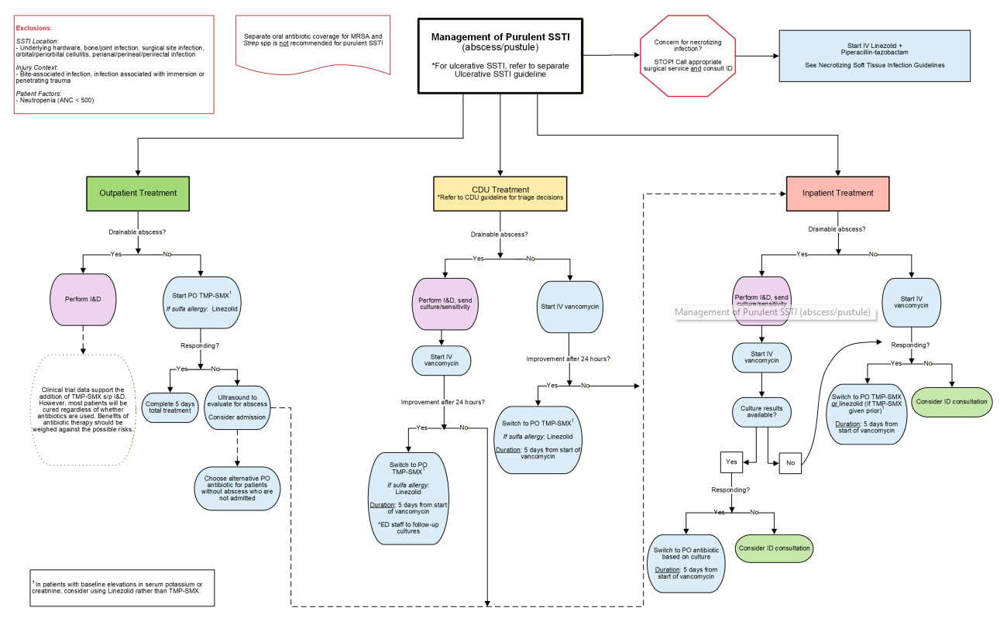
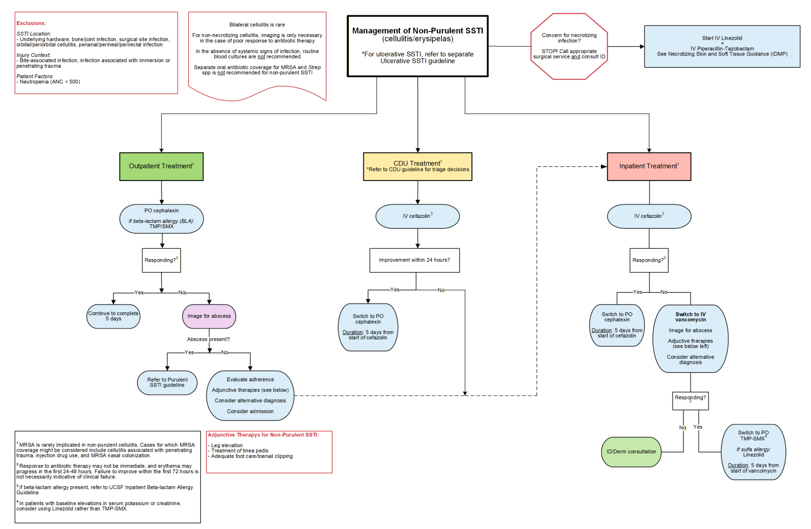
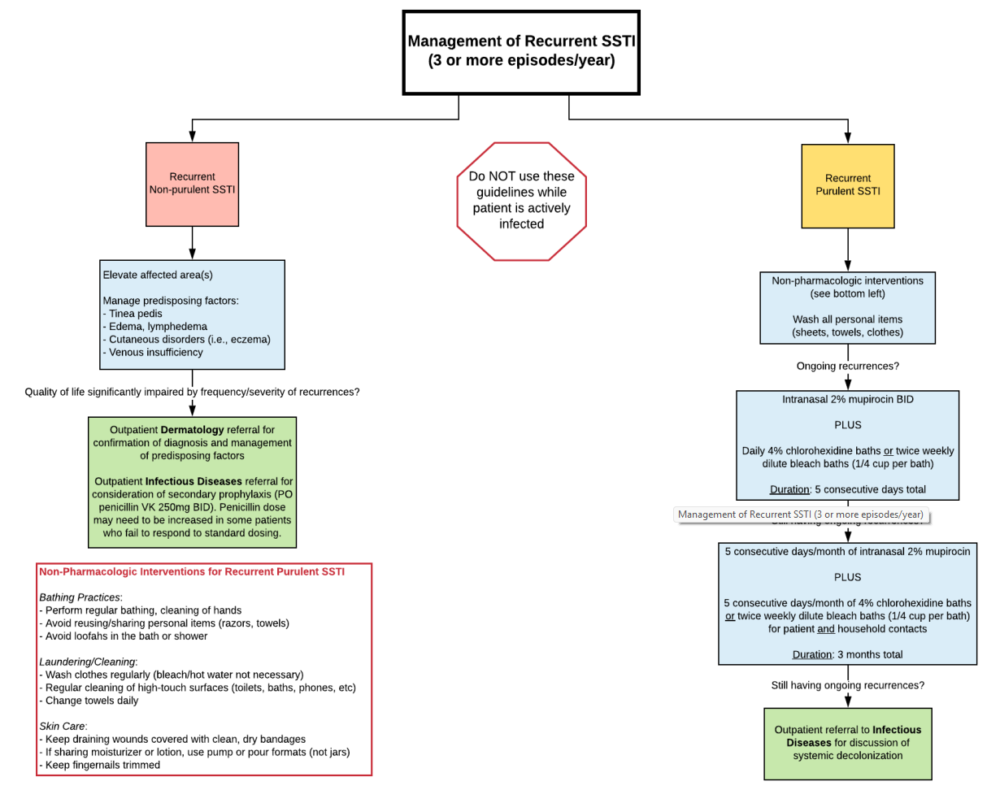
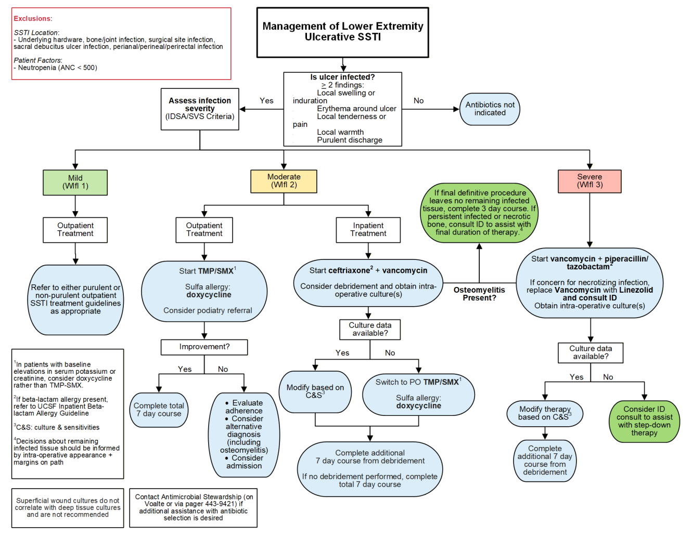

  

    

      
5 Ngày Điều Trị

      
Thời gian điều trị chuẩn cho SSTI không biến chứng (mủ và không mủ)

    

    

      
Linezolid Cho NSTI

      
Thay thế Clindamycin bằng Linezolid do liên cầu kháng Clindamycin gia tăng

    

    

      
Bilateral Là Rất Hiếm

      
Hồng ban 2 bên đối xứng hầu như luôn là viêm da ứ máu hoặc nguyên nhân không nhiễm trùng

    

    

      
Khử Khuẩn 3 Tháng

      
Áp dụng chu kỳ 5 ngày/tháng x 3 tháng cho cả hộ gia đình khi áp xe tái phát

    

  

  

    

      
🎯

      

        
Tối Ưu Hóa Kháng Sinh &amp; Thời Gian 5 Ngày

        
Áp dụng thời gian điều trị chuẩn 5 ngày dựa trên RCT; hạn chế bao phủ thừa MRSA trong thể không mủ; cảnh báo không cấy tăm bông vết thương nông.

      

    

    

      
🚨

      

        
Phản Ứng Khẩn Cấp Với Hoại Tử (NSTI)

        
Cắt lọc ngoại khoa khẩn cấp ngay khi nghi ngờ hoại tử mà không chờ chẩn đoán hình ảnh; dùng ngay Linezolid + Piperacillin-Tazobactam.

      

    

    

      
🔄

      

        
Dự Phòng Tái Phát Bậc Thang Toàn Diện

        
Kê cao chân và điều trị nấm kẽ cho thể không mủ (Penicillin VK dự phòng); khử khuẩn Mupirocin + Chlorhexidine cho cả gia đình ở thể có mủ.

      

    

  

  

    <a href="#sec-tong-quan-pham-vi" class="quickmenu-item active">1. Tổng Quan &amp; 4 Thể SSTI</a>
    <a href="#sec-chan-doan-vi-sinh-wifi" class="quickmenu-item">2. Vi Sinh &amp; Bảng SVS WIFI</a>
    <a href="#sec-luu-do-purulent-ssti" class="quickmenu-item">3. SSTI Có Mủ (Figure 1)</a>
    <a href="#sec-luu-do-non-purulent-ssti" class="quickmenu-item">4. SSTI Không Mủ (Figure 2)</a>
    <a href="#sec-luu-do-recurrent-ssti" class="quickmenu-item">5. SSTI Tái Phát (Figure 3)</a>
    <a href="#sec-luu-do-ulcerative-ssti" class="quickmenu-item">6. Thể Loét &amp; Viêm Xương (Figure 4)</a>
    <a href="#sec-lich-su-y-hoc-chung-cu" class="quickmenu-item">7. Cập Nhật 2026 &amp; Bằng Chứng</a>
    <a href="#sec-phu-luc-lieu-dung-mcq" class="quickmenu-item">8. Bảng Liều &amp; 5 MCQ</a>
  

  {/* ==================== SECTION 1 ==================== */}
  

    

      🩺
      <h2 class="sec-title">1. Giới Thiệu, Phạm Vi Áp Dụng (Chỉ Định &amp; Loại Trừ) &amp; Định Nghĩa 4 Thể Lâm Sàng</h2>
    

    

      

        💡
        

          <strong>Bối Cảnh &amp; Sứ Mệnh Của Hướng Dẫn UCSF Health 2026:</strong>
          Nhiễm trùng da và mô mềm (Skin and Soft Tissue Infections - SSTI) là một trong những lý do khám bệnh và nhập viện phổ biến nhất tại các khoa cấp cứu và nội khoa. Hướng dẫn của Trung tâm Y tế Đại học California San Francisco (UCSF Medical Center) được sửa đổi toàn diện vào tháng 1/2026 nhằm chuẩn hóa các can thiệp thực hành dựa trên y học chứng cứ, đối phó với xu hướng kháng kháng sinh mới (liên cầu kháng Clindamycin), tối ưu hóa thời gian dùng thuốc và bảo vệ chức năng thận của người bệnh.
        

      

      
Phạm Vi Áp Dụng &amp; Các Đối Tượng Loại Trừ Nghiêm Ngặt

      

        

          

          
Đối Tượng Áp Dụng (Inclusion) ✅

          

            
Bệnh nhân điều trị ngoại trú, tại Đơn vị quyết định lâm sàng (CDU) hoặc nội trú là <strong>người lớn (≥ 18 tuổi)</strong> nghi ngờ mắc SSTI thuộc 4 thể:

            <ul class="clin-card-list">
              <li>Nhiễm trùng không mủ (viêm mô tế bào, hồng ban).</li>
              <li>Nhiễm trùng có mủ (áp xe, mụn mủ).</li>
              <li>Nhiễm trùng thể loét mạn tính chi dưới.</li>
              <li>Nhiễm trùng tái phát hoặc kháng trị.</li>
            </ul>
          

        

        

          

          
Đối Tượng Loại Trừ (Exclusion) 🚫

          

            
<strong>Hướng dẫn này KHÔNG áp dụng cho các trường hợp sau:</strong>

            <ul class="clin-card-list">
              <li>SSTI liên quan đến dụng cụ cấy ghép/phần cứng dưới da (underlying hardware).</li>
              <li>Nhiễm trùng xương và khớp (trừ viêm xương trong loét bàn chân).</li>
              <li>Vết thương do động vật hoặc người cắn (bites).</li>
              <li>Nhiễm trùng liên quan ngâm nước (immersion) hoặc chấn thương xuyên thấu.</li>
              <li>Viêm tổ chức hốc mắt/quanh hốc mắt (orbital/periorbital cellulitis).</li>
              <li>Nhiễm trùng vùng tầng sinh môn, quanh hậu môn, trực tràng.</li>
              <li>Loét tỳ đè vùng xương cùng; Bệnh nhân giảm bạch cầu hạt (ANC &lt; 500); Nhiễm trùng vết mổ ngoại khoa.</li>
            </ul>
          

        

      

      
Định Nghĩa 4 Thể Lâm Sàng Cốt Lõi Của SSTI

      

        

          

          

            
1️⃣

            
Nhiễm Trùng Không Mủ (Non-Purulent SSTI)

          

          

            Biểu hiện chủ yếu là <strong>viêm mô tế bào (cellulitis)</strong> hoặc <strong>hồng ban (erysipelas)</strong> lan tỏa mà <strong>HOÀN TOÀN KHÔNG CÓ</strong> ổ áp xe hay tình trạng chảy mủ dẫn lưu tại chỗ. Tác nhân gây bệnh áp đảo là các loài Liên cầu khuẩn (<em>Streptococcus spp.</em>).
          

          
Chủ yếu do Liên cầu

        

        

          

          

            
2️⃣

            
Nhiễm Trùng Có Mủ (Purulent SSTI)

          

          

            Biểu hiện bằng <strong>ổ áp xe da (abscess)</strong> có tụ mủ hoặc viêm mô tế bào đi kèm các <strong>mụn mủ (pustules)</strong>. Tác nhân chiếm ưu thế tuyệt đối là Tụ cầu vàng (<em>Staphylococcus aureus</em>), bao gồm cả MSSA và MRSA.
          

          
Chủ yếu do Tụ cầu (MRSA/MSSA)

        

        

          

          

            
3️⃣

            
Nhiễm Trùng Thể Loét Chi Dưới (Ulcerative SSTI)

          

          

            Các vết loét da mạn tính ở cẳng chân và bàn chân, điển hình là loét bàn chân đái tháo đường hoặc loét do suy mạch máu (bệnh động mạch ngoại biên, suy tĩnh mạch). Căn nguyên vi sinh thường là đa khuẩn (cầu khuẩn Gram dương + trực khuẩn Gram âm + vi khuẩn kỵ khí).
          

          
Nhiễm trùng đa khuẩn phức tạp

        

        

          

          

            
4️⃣

            
Nhiễm Trùng Tái Phát / Kháng Trị (Recurrent SSTI)

          

          

            Được định nghĩa khi bệnh nhân xuất hiện <strong>từ 3 đợt SSTI trở lên trong vòng 1 năm</strong> (áp dụng cho cả thể có mủ và không mủ). Đòi hỏi quy trình can thiệp dự phòng y khoa hoặc khử khuẩn bậc thang chuyên sâu.
          

          
Tiêu chuẩn: ≥ 3 đợt / năm

        

      

    

  

  {/* ==================== SECTION 2 ==================== */}
  

    

      🔬
      <h2 class="sec-title">2. Chẩn Đoán, Xét Nghiệm Vi Sinh &amp; Bảng Phân Loại Vết Thương IDSA/SVS WIFI (Table 1)</h2>
    

    

      
Nguyên Tắc Xét Nghiệm Cận Lâm Sàng &amp; Vi Sinh Học Chọn Lọc

      

        

          

          
Nhuộm Gram &amp; Cấy Mủ Vết Thương 🧫

          

            <ul class="clin-card-list">
              <li><strong>Chỉ định:</strong> Bắt buộc thực hiện ở tất cả bệnh nhân có chỉ định <strong>rạch dẫn lưu (I&amp;D)</strong> hoặc <strong>cắt lọc ngoại khoa</strong>.</li>
              <li>Lấy mẫu mủ hoặc mô sâu trước khi tiêm kháng sinh nếu bệnh nhân ổn định.</li>
              <li><strong style="color: #dc2626;">CẢNH BÁO: TUYỆT ĐỐI TRÁNH DÙNG TĂM BÔNG QUỆT VẾT THƯƠNG (NO WOUND SWABS):</strong> Tăm bông quệt bề mặt không tương quan với mô sâu và chủ yếu bắt giữ vi khuẩn thường trú ngoại nhiễm.</li>
            </ul>
          

        

        

          

          
Cấy Máu &amp; Chẩn Đoán Hình Ảnh 📷

          

            <ul class="clin-card-list">
              <li><strong>Cấy máu:</strong> <em>Không khuyến cáo thường quy</em> trừ khi bệnh nhân có biểu hiện nhiễm trùng toàn thân nặng (sốt cao, tụt huyết áp, rét run, suy giảm miễn dịch).</li>
              <li><strong>Chẩn đoán hình ảnh (X-quang, Siêu âm, CT):</strong> Chỉ định khi điều trị thất bại (tìm ổ áp xe sâu) hoặc nghi ngờ nhiễm trùng hoại tử / viêm xương.</li>
              <li><strong style="color: #dc2626;">NGUYÊN TẮC VÀNG:</strong> Nghi ngờ nhiễm trùng hoại tử mô mềm (NSTI) <strong>TUYỆT ĐỐI KHÔNG TRÌ HOÃN PHẪU THUẬT</strong> để chờ chụp phim.</li>
            </ul>
          

        

      

      
Hệ Thống Phân Loại Mức Độ Nặng Vết Thương Theo IDSA / SVS WIFI (Table 1 UCSF)

      

        <table class="regimen-table">
          <thead>
            <tr>
              <th style="width: 50%;">Biểu Hiện Lâm Sàng Của Nhiễm Trùng Vết Loét</th>
              <th style="width: 25%; text-align: center;">Phân Loại SVS WIFI</th>
              <th style="width: 25%; text-align: center;">Mức Độ Nặng Theo IDSA</th>
            </tr>
          </thead>
          <tbody>
            <tr>
              <td><strong>Hoàn toàn không có</strong> triệu chứng hoặc dấu hiệu nhiễm trùng tại chỗ.</td>
              <td style="text-align: center;">WIFI 0</td>
              <td style="text-align: center;"><strong>Không nhiễm trùng</strong> (Uninfected)</td>
            </tr>
            <tr>
              <td>
                Nhiễm trùng biểu hiện khi có <strong>ít nhất 2</strong> trong số các dấu hiệu sau: 
                • Sưng hoặc chai cứng tại chỗ (Local swelling or induration) 
                • <strong>Hồng ban rộng &gt; 0.5 cm đến ≤ 2 cm</strong> quanh bờ vết loét 
                • Đau hoặc nhạy cảm đau tại chỗ 
                • Ấm / nóng tại chỗ (Local warmth) 
                • <strong>Chảy mủ</strong> (dịch tiết đặc, đục đến trắng hoặc dịch máu mủ) 
                <em>Lưu ý:</em> Tổn thương chỉ khu trú ở da và mô dưới da (không tổn thương mô sâu, không có dấu hiệu toàn thân). Cần loại trừ chấn thương, gút, khớp Charcot cấp, huyết khối tĩnh mạch.
              </td>
              <td style="text-align: center;">WIFI 1</td>
              <td style="text-align: center;"><strong style="color: #0284c7;">Nhẹ</strong> (Mild)</td>
            </tr>
            <tr>
              <td>
                Nhiễm trùng tại chỗ (như trên) đi kèm <strong>hồng ban lan rộng &gt; 2 cm</strong> quanh bờ vết loét, 
                <strong>HOẶC</strong> tổn thương lan sâu vào các cấu trúc dưới da (áp xe sâu, viêm cân mạc, viêm khớp nhiễm trùng, viêm xương tủy xương). 
                <strong>Đồng thời KHÔNG CÓ</strong> biểu hiện của hội chứng đáp ứng viêm toàn thân (SIRS).
              </td>
              <td style="text-align: center;">WIFI 2</td>
              <td style="text-align: center;"><strong style="color: #d97706;">Trung bình</strong> (Moderate)</td>
            </tr>
            <tr>
              <td>
                Nhiễm trùng tại chỗ (nhẹ hoặc trung bình) đi kèm với <strong>từ 2 dấu hiệu trở lên</strong> của hội chứng đáp ứng viêm toàn thân (<strong>SIRS</strong>): 
                • Nhiệt độ cơ thể &gt; 38°C hoặc &lt; 36°C 
                • Nhịp tim &gt; 90 lần/phút 
                • Nhịp thở &gt; 20 lần/phút hoặc PaCO2 &lt; 32 mmHg 
                • Bạch cầu máu &gt; 12.000 hoặc &lt; 4.000 /µL (hoặc tỷ lệ bạch cầu non bands ≥ 10%)
              </td>
              <td style="text-align: center;">WIFI 3</td>
              <td style="text-align: center;"><strong style="color: #dc2626;">Nặng</strong> (Severe)</td>
            </tr>
          </tbody>
        </table>
      

    

  

  {/* ==================== SECTION 3 ==================== */}
  

    

      💉
      <h2 class="sec-title">3. Quản Lý Nhiễm Trùng Da Có Mủ (Áp Xe/Mụn Mủ): Lưu Đồ &amp; Code Trực Quan (Figure 1)</h2>
    

    

      

        🚨
        

          <strong>Bước Đánh Giá Ban Đầu: Loại Trừ Nhiễm Trùng Hoại Tử Mô Mềm (NSTI)</strong>
          Trước khi xử trí bất kỳ ca nhiễm trùng có mủ nào, câu hỏi đầu tiên là: <strong>Có nghi ngờ nhiễm trùng hoại tử không?</strong>
           • Nếu <strong>CÓ</strong>: Lập tức <strong>DỪNG LẠI (STOP!)</strong>, gọi hội chẩn cấp cứu ngoại khoa và chuyên khoa Truyền nhiễm (ID). Khởi đầu ngay kháng sinh truyền tĩnh mạch: <strong>Linezolid + Piperacillin-Tazobactam</strong>.
           • Nếu <strong>KHÔNG</strong>: Tiến hành phân loại xử trí theo 3 bối cảnh (Ngoại trú, Đơn vị quyết định lâm sàng CDU, Nội trú).
        

      

      {/* FIGURE 1 CARD */}
      

        
        

          
Figure 1. Lưu Đồ Quản Lý Nhiễm Trùng Da Và Mô Mềm Có Mủ (UCSF 2026)

          Lưu đồ phân nhánh xử trí áp xe/mụn mủ theo 3 môi trường điều trị (Ngoại trú, CDU, Nội trú), vai trò rạch dẫn lưu (I&amp;D), đánh giá đáp ứng sau 24h và thời gian điều trị chuẩn 5 ngày.
        

      

      {/* VISUAL DIAGRAM CODE: TÁI HIỆN CODE LƯU ĐỒ FIGURE 1 */}
      

        

          <i class="fa-solid fa-diagram-project"></i> Sơ Đồ Thuật Toán Tái Hiện Bằng Code: Xử Trí Nhiễm Trùng Có Mủ (Purulent SSTI)
        

        

          {/* CỘT 1: NGOẠI TRÚ */}
          

            

              🏠 ĐIỀU TRỊ NGOẠI TRÚ (OUTPATIENT)
            

            

              • <strong>Dẫn lưu được:</strong> Tiến hành <strong>Rạch và Dẫn lưu (I&amp;D)</strong>. 
              • Khởi đầu kháng sinh uống: <strong>TMP-SMX</strong> (dị ứng sulfa: thay bằng <strong>Linezolid</strong>). 
              • <em>Đánh giá sau 24h:</em> 
              &nbsp;&nbsp;+ <strong>Cải thiện:</strong> Hoàn thành tổng liệu trình <strong>5 ngày</strong>. 
              &nbsp;&nbsp;+ <strong>Không cải thiện:</strong> Siêu âm tìm áp xe sâu, xem xét nhập viện.
            

          

          {/* CỘT 2: CDU */}
          

            

              🏥 ĐƠN VỊ QUYẾT ĐỊNH LÂM SÀNG (CDU)
            

            

              • I&amp;D nếu có thể dẫn lưu được, gửi mủ cấy vi khuẩn. 
              • Khởi đầu kháng sinh tĩnh mạch: <strong>Vancomycin IV</strong>. 
              • <em>Đánh giá sau 24h:</em> 
              &nbsp;&nbsp;+ <strong>Cải thiện:</strong> Chuyển sang <strong>TMP-SMX uống</strong> (dị ứng sulfa: Linezolid). Tổng thời gian: <strong>5 ngày tính từ liều Vancomycin đầu</strong>. 
              &nbsp;&nbsp;+ <strong>Không cải thiện:</strong> Nhập viện nội trú chính thức.
            

          

          {/* CỘT 3: NỘI TRÚ */}
          

            

              🛏️ ĐIỀU TRỊ NỘI TRÚ (INPATIENT)
            

            

              • I&amp;D nếu có thể dẫn lưu được, gửi cấy và làm kháng sinh đồ. 
              • Khởi đầu tĩnh mạch: <strong>Vancomycin IV</strong>. 
              • <em>Đánh giá sau 24h:</em> 
              &nbsp;&nbsp;+ <strong>Có kết quả cấy:</strong> Hạ bậc sang kháng sinh uống nhạy cảm nhất. 
              &nbsp;&nbsp;+ <strong>Chưa có kết quả cấy:</strong> Chuyển <strong>TMP-SMX uống</strong> (hoặc Linezolid). 
              • Tổng thời gian: <strong>5 ngày tính từ liều Vancomycin đầu tiên</strong>.
            

          

        

        

          ⚠️ <strong>LƯU Ý AN TOÀN VỀ THẬN &amp; KALI MÁU:</strong> Ở bệnh nhân có nồng độ kali máu hoặc creatinine nền tăng cao, <strong>ưu tiên dùng Linezolid thay cho TMP-SMX</strong> để tránh nguy cơ tăng kali máu trầm trọng do cơ chế ức chế bài tiết kali tại ống lượn xa tương tự Amiloride của Trimethoprim.
        

      

    

  

  {/* ==================== SECTION 4 ==================== */}
  

    

      🔴
      <h2 class="sec-title">4. Quản Lý Viêm Mô Tế Bào Không Mủ: Lưu Đồ, Cảnh Báo &amp; Code Trực Quan (Figure 2)</h2>
    

    

      
3 Cảnh Báo Lâm Sàng Bản Lề Trong Viêm Mô Tế Bào (Cellulitis / Erysipelas)

      

        

          

          

            
1️⃣

            
Hồng Ban Hai Bên (Bilateral) Là Vô Cùng Hiếm Gặp!

          

          

            Viêm mô tế bào thực sự là bệnh lý nhiễm trùng <strong>chỉ xảy ra ở một bên cơ thể</strong>. Nếu bệnh nhân xuất hiện hồng ban đối xứng cả hai chân, <strong>hầu như luôn là các nguyên nhân không nhiễm trùng</strong>: viêm da ứ máu (stasis dermatitis) do suy van tĩnh mạch, phù bạch huyết, viêm da tiếp xúc, gút hoặc xơ mỡ da (lipodermatosclerosis).
          

          
Không dùng kháng sinh cho hồng ban 2 bên

        

        

          

          

            
2️⃣

            
Hồng Ban Lan Rộng Trong 24 - 48 Giờ Đầu Là Bình Thường!

          

          

            Khi kháng sinh tiêu diệt vi khuẩn, sự ly giải tế bào giải phóng ồ ạt các kháng nguyên và độc tố vào mô kẽ, gây phản ứng viêm thứ phát mạnh mẽ. Diện đỏ có thể lan rộng nhẹ trong 24 - 48h đầu. <strong>Việc tổn thương chưa thuyên giảm trong 72h đầu KHÔNG PHẢI là thất bại điều trị</strong> nếu người bệnh không có triệu chứng nhiễm độc toàn thân.
          

          
Kiên nhẫn theo dõi, không vội đổi thuốc

        

        

          

          

            
3️⃣

            
MRSA Rất Hiếm Khi Gây Viêm Mô Tế Bào Không Mủ!

          

          

            Căn nguyên chủ đạo là Liên cầu khuẩn (<em>Streptococcus spp.</em>). Tuyệt đối không phối hợp kháng sinh riêng lẻ để phủ đồng thời cả MRSA và Streptococcus. Chỉ cân nhắc phủ MRSA khi có 1 trong 3 yếu tố nguy cơ: <strong>(1) Chấn thương xuyên thấu</strong>, <strong>(2) Tiêm chích ma túy</strong>, hoặc <strong>(3) Có bằng chứng khư trú MRSA ở mũi</strong>.
          

          
Chỉ phủ MRSA khi có 3 yếu tố nguy cơ

        

      

      {/* FIGURE 2 CARD */}
      

        
        

          
Figure 2. Lưu Đồ Quản Lý Nhiễm Trùng Da Và Mô Mềm Không Mủ (UCSF 2026)

          Phác đồ điều trị viêm mô tế bào không mủ với thuốc ưu tiên hàng đầu là Cephalexin (uống) hoặc Cefazolin (tĩnh mạch) trong 5 ngày; hướng dẫn xử trí khi thất bại điều trị và liệu pháp bổ trợ kê cao chi.
        

      

      {/* VISUAL DIAGRAM CODE: TÁI HIỆN CODE LƯU ĐỒ FIGURE 2 */}
      

        

          <i class="fa-solid fa-diagram-project"></i> Sơ Đồ Thuật Toán Tái Hiện Bằng Code: Xử Trí Viêm Mô Tế Bào Không Mủ
        

        

          

            
🏠 NGOẠI TRÚ (OUTPATIENT)

            

              • <strong>Kháng sinh ưu tiên:</strong> <strong>Cephalexin 500mg uống mỗi 8 giờ</strong>. 
              • Dị ứng beta-lactam: Thay bằng <strong>TMP-SMX</strong>. 
              • Đáp ứng tốt: Hoàn thành đủ <strong>5 ngày</strong>. 
              • Không đáp ứng: Siêu âm tìm áp xe sâu; nếu có áp xe $
ightarrow$ chuyển lưu đồ mủ; nếu không áp xe $
ightarrow$ kê cao chân, xét chẩn đoán khác hoặc nhập viện.
            

          

          

            
🏥 CDU HOẶC NỘI TRÚ (INPATIENT)

            

              • <strong>Kháng sinh ưu tiên:</strong> <strong>Cefazolin truyền tĩnh mạch</strong>. 
              • Cải thiện lâm sàng: Chuyển sang <strong>Cephalexin uống</strong> xuất viện. 
              • Tổng thời gian điều trị: <strong>5 ngày tính từ liều Cefazolin đầu tiên</strong>. 
              • Không cải thiện: Đổi sang <strong>Vancomycin</strong> phủ MRSA, siêu âm tìm áp xe sâu, kê cao chân và hội chẩn Truyền nhiễm/Da liễu.
            

          

        

        

          🦶 <strong>LIỆU PHÁP BỔ TRỢ BẮT BUỘC (ADJUNCTIVE THERAPY):</strong> Luôn hướng dẫn bệnh nhân kê cao chân bị tổn thương cao hơn mức tim để tăng hồi lưu tĩnh mạch/bạch huyết; điều trị triệt để nấm kẽ ngón chân (tinea pedis) và cắt tỉa móng chân an toàn để bít ngõ vào của liên cầu khuẩn.
        

      

    

  

  {/* ==================== SECTION 5 ==================== */}
  

    

      🔄
      <h2 class="sec-title">5. Quản Lý SSTI Tái Phát (≥ 3 Đợt/Năm): Phác Đồ Khử Khuẩn Bậc Thang (Figure 3)</h2>
    

    

      

        ⚠️
        

          <strong>CẢNH BÁO NGUYÊN TẮC VÀNG:</strong>
          <strong>TUYỆT ĐỐI KHÔNG KHỞI ĐỘNG PHÁC ĐỒ DỰ PHÒNG HOẶC KHỬ KHUẨN KHI ĐANG CÓ NHIỄM TRÙNG HOẠT ĐỘNG.</strong> Đợt cấp tính phải được điều trị khỏi hoàn toàn bằng kháng sinh trước khi bắt đầu các biện pháp phòng ngừa dưới đây.
        

      

      {/* FIGURE 3 CARD */}
      

        
        

          
Figure 3. Lưu Đồ Quản Lý Nhiễm Trùng Da Và Mô Mềm Tái Phát (UCSF 2026)

          Lưu đồ phân nhánh quản lý SSTI tái phát (≥ 3 đợt/năm) phân tách thể không mủ (Penicillin VK dự phòng) và thể có mủ (phác đồ khử khuẩn bậc thang Mupirocin + Chlorhexidine theo chu kỳ 3 tháng cho toàn bộ gia đình).
        

      

      {/* VISUAL DIAGRAM CODE: TÁI HIỆN CODE LƯU ĐỒ FIGURE 3 */}
      

        

          <i class="fa-solid fa-diagram-project"></i> Sơ Đồ Thuật Toán Tái Hiện Bằng Code: Quản Lý SSTI Tái Phát (≥ 3 Đợt / Năm)
        

        

          {/* NHÁNH KHÔNG MỦ */}
          

            
🦵 THỂ KHÔNG MỦ TÁI PHÁT (RECURRENT NON-PURULENT)

            

              1. Kê cao chân, điều trị triệt để nấm kẽ ngón chân, phù bạch huyết, suy tĩnh mạch. 
              2. Nếu chất lượng cuộc sống bị ảnh hưởng nặng: 
              &nbsp;&nbsp;• Hội chẩn Da liễu ngoại trú. 
              &nbsp;&nbsp;• Hội chẩn Truyền nhiễm (ID) để chỉ định <strong>dự phòng thứ phát kéo dài</strong>: 
              &nbsp;&nbsp;&nbsp;&nbsp;👉 <strong style="color: #0284c7;">Penicillin VK 250mg uống 2 lần/ngày (BID)</strong> (dựa trên thử nghiệm PATCH-I).
            

          

          {/* NHÁNH CÓ MỦ: BẬC THANG KHỬ KHUẨN */}
          

            
🧼 THỂ CÓ MỦ TÁI PHÁT (RECURRENT PURULENT - BẬC THANG KHỬ KHUẨN)

            

              • <strong>Bước 1 (Phi dược lý):</strong> Tắm xà phòng thường xuyên; không dùng chung dao cạo, khăn tắm; giặt ga khăn mỗi ngày; khử khuẩn bề mặt; chỉ dùng kem dưỡng thể dạng vòi nhấn (pump), không dùng hũ (jars). 
              • <strong>Bước 2 (Khử khuẩn Bậc 1 - 5 ngày):</strong> 
              &nbsp;&nbsp;+ <strong>Mupirocin 2%</strong> mỡ tra mũi 2 lần/ngày x 5 ngày. 
              &nbsp;&nbsp;+ Phối hợp tắm <strong>Chlorhexidine 4%</strong> hàng ngày (hoặc tắm nước Javel loãng 2 lần/tuần) x 5 ngày. 
              • <strong>Bước 3 (Khử khuẩn Bậc 2 - Chu kỳ 3 tháng CHO CẢ GIA ĐÌNH):</strong> 
              &nbsp;&nbsp;+ Thực hiện phác đồ Mupirocin + Chlorhexidine trong <strong>5 ngày liên tiếp mỗi tháng x 3 tháng</strong>. 
              &nbsp;&nbsp;+ <strong style="color: #dc2626;">ÁP DỤNG CHO TẤT CẢ THÀNH VIÊN SỐNG CHUNG</strong> để cắt nguồn lây chéo. 
              • <strong>Bước 4:</strong> Hội chẩn ID xét khử khuẩn toàn thân bằng kháng sinh uống.
            

          

        

      

    

  

  {/* ==================== SECTION 6 ==================== */}
  

    

      🦶
      <h2 class="sec-title">6. Nhiễm Trùng Thể Loét Chi Dưới &amp; Viêm Xương Tủy Xương: Lưu Đồ &amp; Code (Figure 4)</h2>
    

    

      

        💡
        

          <strong>Quy Tắc Vàng Lấy Mẫu Cấy Trong Vết Loét Mạn Tính Chi Dưới:</strong>
           • <strong>TUYỆT ĐỐI KHÔNG GỬI MẪU CẤY</strong> đối với vết loét không có dấu hiệu nhiễm trùng (WIFI 0).
           • Luôn ưu tiên <strong>mẫu cấy mô sâu (deep tissue culture)</strong> lấy trong phòng mổ khi cắt lọc ngoại khoa.
           • Nếu chỉ lấy được mẫu cấy bề mặt: <strong>CHỈ ĐIỀU TRỊ ĐÍCH NẾU MỌC <em>Staphylococcus aureus</em> HOẶC <em>Group A Streptococcus</em></strong>. Các vi khuẩn Gram âm khác mọc từ mẫu cấy bề mặt thường chỉ là vi khuẩn ngoại nhiễm định cư.
        

      

      {/* FIGURE 4 CARD */}
      

        
        

          
Figure 4. Lưu Đồ Quản Lý Nhiễm Trùng Thể Loét Chi Dưới (UCSF 2026)

          Phác đồ phân tầng điều trị theo IDSA/SVS WIFI (Nhẹ, Trung bình, Nặng), chỉ định cắt lọc mô sâu, thời gian điều trị 7 ngày và thuật toán xử trí Viêm xương tủy xương (Osteomyelitis) sau phẫu thuật cắt cụt/cắt bỏ xương.
        

      

      {/* VISUAL DIAGRAM CODE: TÁI HIỆN CODE LƯU ĐỒ FIGURE 4 */}
      

        

          <i class="fa-solid fa-diagram-project"></i> Sơ Đồ Thuật Toán Tái Hiện Bằng Code: Phân Tầng Điều Trị Nhiễm Trùng Thể Loét
        

        

          {/* NHẸ */}
          

            
🟢 NHẸ (MILD - WIFI 1)

            

              • Điều trị ngoại trú đường uống. 
              • Kháng sinh kinh nghiệm: <strong>TMP-SMX</strong> (hoặc <strong>Doxycycline</strong> nếu dị ứng sulfa hoặc có tăng creatinine/kali máu). 
              • Thời gian điều trị: <strong>7 ngày</strong>.
            

          

          {/* TRUNG BÌNH */}
          

            
🟡 TRUNG BÌNH (MODERATE - WIFI 2)

            

              • Nội trú truyền tĩnh mạch: <strong>Ceftriaxone + Vancomycin</strong>. 
              • Cắt lọc ngoại khoa &amp; cấy mô sâu trong phòng mổ. 
              • Lâm sàng cải thiện: Chuyển sang <strong>TMP-SMX uống</strong> (hoặc Doxycycline). 
              • Thời gian: Tiếp tục thêm <strong>7 ngày tính từ ngày cắt lọc cuối cùng</strong> (hoặc 7 ngày nếu không phẫu thuật).
            

          

          {/* NẶNG */}
          

            
🔴 NẶNG (SEVERE - WIFI 3)

            

              • Bắt buộc nhập viện khẩn cấp. 
              • Kháng sinh tĩnh mạch: <strong>Vancomycin + Piperacillin-Tazobactam</strong>. 
              • <em>Nghi ngờ hoại tử mô mềm:</em> Thay Vancomycin bằng <strong>Linezolid</strong>. 
              • Cắt lọc mô hoại tử khẩn cấp &amp; sinh thiết xương.
            

          

        

        

          
🦴 THUẬT TOÁN XỬ TRÍ VIÊM XƯƠNG TỦY XƯƠNG (OSTEOMYELITIS) KÈM THEO:

          

            

              <strong style="color: #16a34a;">✅ ĐÃ CẮT BỎ TOÀN BỘ XƯƠNG NHIỄM TRÙNG:</strong> 
              Cuộc phẫu thuật đã cắt lọc sạch toàn bộ mô xương viêm hoại tử (bờ diện cắt sạch cả trên đại thể và vi thể): 
              👉 <strong>Chỉ cần dùng một đợt kháng sinh ngắn ngày gồm 3 NGÀY sau phẫu thuật</strong>.
            

            

              <strong style="color: #dc2626;">❌ CÒN SÓT XƯƠNG NHIỄM TRÙNG / KHÔNG THỂ CẮT BỎ:</strong> 
              Vẫn còn mô xương viêm dai dẳng không thể cắt cụt/lấy bỏ sạch: 
              👉 Bắt buộc <strong>Hội chẩn chuyên khoa Truyền nhiễm (ID)</strong> để điều trị kháng sinh kéo dài (thường <strong>4 – 6 tuần</strong>).
            

          

        

      

    

  

  {/* ==================== SECTION 7 ==================== */}
  

    

      📜
      <h2 class="sec-title">7. Lịch Sử Sửa Đổi 2026 (Kháng Clindamycin, Bỏ Ertapenem) &amp; Thử Nghiệm RCT Bản Lề</h2>
    

    

      
Lịch Sử Sửa Đổi Thể Chế UCSF: Thích Ứng Với Xu Hướng Kháng Kháng Sinh

      

        

          

          

            
📅

            
Cập Nhật Tháng 9/2024: Loại Bỏ Hoàn Toàn Ertapenem

          

          

            UCSF chính thức loại bỏ Ertapenem khỏi các khuyến cáo điều trị tại Zuckerberg San Francisco General (ZSFG) nhằm tuân thủ chính sách hạn chế kháng sinh của bệnh viện, bảo tồn hoạt phổ nhóm Carbapenem và ngăn chặn sự phát tán của các chủng trực khuẩn Gram âm kháng Carbapenem (CRE).
          

          
Bảo tồn phổ Carbapenem

        

        

          

          

            
📅

            
Cập Nhật Tháng 1/2026: Kháng Clindamycin &amp; Vai Trò Linezolid

          

          

            Do tình trạng các chủng Liên cầu khuẩn (<em>Streptococcus</em>) kháng Clindamycin gia tăng đột biến, hướng dẫn đã chuyển dịch mạnh mẽ: <strong>Thay thế Clindamycin bằng Linezolid</strong> phối hợp Piperacillin-Tazobactam cho nhiễm trùng hoại tử mô mềm (NSTI). Linezolid vừa diệt MRSA vừa ức chế sinh độc tố vi khuẩn mà không bị đề kháng chéo.
          

          
Đột phá thích ứng đề kháng 2026

        

      

      
Cơ Sở Dữ Liệu Y Học Chứng Cứ Của Các Khuyến Cáo (Landmark RCTs)

      

        <table class="regimen-table">
          <thead>
            <tr>
              <th style="width: 30%;">Nghiên Cứu Bản Lề (RCTs)</th>
              <th style="width: 35%;">Thiết Kế &amp; Kết Quả Then Chốt</th>
              <th style="width: 35%;">Ứng Dụng Trong Hướng Dẫn UCSF 2026</th>
            </tr>
          </thead>
          <tbody>
            <tr>
              <td class="source-cell"><strong>Hepburn et al.</strong> (Arch Intern Med 2004)</td>
              <td>Thử nghiệm RCT so sánh liệu trình <strong>5 ngày vs 10 ngày</strong> kháng sinh trong điều trị viêm mô tế bào không biến chứng: Tỷ lệ khỏi bệnh tương đương nhau (98% vs 97%).</td>
              <td>Thiết lập tiêu chuẩn <strong>thời gian điều trị chuẩn 5 ngày</strong> cho toàn bộ phác đồ SSTI không biến chứng của UCSF.</td>
            </tr>
            <tr>
              <td class="source-cell"><strong>Daum et al. / Talan et al.</strong> (N Engl J Med 2016, 2017)</td>
              <td>RCT mù đôi có đối chứng giả dược ở bệnh nhân áp xe da sau rạch dẫn lưu (I&amp;D): Kháng sinh bổ sung làm tăng nhẹ tỷ lệ khỏi và giảm tái phát, nhưng đa số nhóm giả dược vẫn tự khỏi tốt nhờ I&amp;D đơn thuần.</td>
              <td>Khuyến cáo bác sĩ <strong>cân nhắc lợi ích vs nguy cơ tác dụng phụ</strong> trước khi kê kháng sinh sau I&amp;D ổ áp xe nhỏ.</td>
            </tr>
            <tr>
              <td class="source-cell"><strong>PATCH-I Trial</strong> (Thomas et al., NEJM 2013)</td>
              <td>RCT chứng minh điều trị dự phòng kéo dài bằng <strong>Penicillin VK</strong> giúp giảm rõ rệt số đợt viêm mô tế bào tái phát ở chi dưới.</td>
              <td>Chỉ định <strong>Penicillin VK 250mg PO BID</strong> dự phòng thứ phát cho thể không mủ tái phát (≥ 3 đợt/năm).</td>
            </tr>
            <tr>
              <td class="source-cell"><strong>Acquisto et al.</strong> (Emerg Med J 2018)</td>
              <td>Phết mũi xét nghiệm MRSA có <strong>giá trị dự báo âm tính (NPV) cực cao (&gt; 95 - 98%)</strong> đối với nhiễm trùng da do MRSA.</td>
              <td>Sử dụng kết quả phết mũi MRSA âm tính làm công cụ vững chắc để <strong>ngừng sớm Vancomycin kinh nghiệm</strong> ở bệnh nhân nội trú.</td>
            </tr>
          </tbody>
        </table>
      

    

  

  {/* ==================== SECTION 8 ==================== */}
  

    

      💊
      <h2 class="sec-title">8. Bảng Liều Kháng Sinh Lọc Máu, Cheat-Sheet Lâm Sàng &amp; 5 Câu Hỏi Tự Lượng Giá</h2>
    

    

      
Phụ Lục Liều Lượng Kháng Sinh Đường Uống Cho Bệnh Nhân Không Lọc Máu &amp; Có Lọc Máu

      

        <table class="regimen-table">
          <thead>
            <tr>
              <th style="width: 20%;">Thuốc Kháng Sinh</th>
              <th style="width: 25%;">CrCl &gt; 50 mL/phút</th>
              <th style="width: 25%;">CrCl 15 - 50 mL/phút</th>
              <th style="width: 30%;">Lọc Máu Ngắt Quãng (IHD) / CRRT</th>
            </tr>
          </thead>
          <tbody>
            <tr>
              <td class="source-cell"><strong>Cephalexin</strong></td>
              <td>500 mg PO mỗi 8 giờ (TID)</td>
              <td>250 mg PO mỗi 8 giờ (TID)</td>
              <td><strong>IHD:</strong> 500 mg PO mỗi ngày (uống sau lọc máu). <strong>CRRT:</strong> Dùng như CrCl &gt; 50 mL/phút.</td>
            </tr>
            <tr>
              <td class="source-cell"><strong>Clindamycin</strong></td>
              <td>300 - 450 mg PO mỗi 8 giờ</td>
              <td>300 - 450 mg PO mỗi 8 giờ</td>
              <td>300 mg PO mỗi 8 giờ (không cần chỉnh liều theo lọc máu).</td>
            </tr>
            <tr>
              <td class="source-cell"><strong>Doxycycline</strong></td>
              <td>100 mg PO mỗi 12 giờ (BID)</td>
              <td>100 mg PO mỗi 12 giờ (BID)</td>
              <td>100 mg PO mỗi 12 giờ (không cần chỉnh liều thận/lọc máu).</td>
            </tr>
            <tr>
              <td class="source-cell"><strong>TMP/SMX DS</strong> (800/160 mg)</td>
              <td>
                • 40-59 kg: 1 viên DS q12h 
                • 60-79 kg: 1 viên DS q8h 
                • ≥ 80 kg: 2 viên DS q12h
              </td>
              <td>
                • 40-59 kg: 1 viên DS mỗi ngày 
                • 60-79 kg: 1 viên DS q12h 
                • ≥ 80 kg: 1 viên DS q8h
              </td>
              <td>
                Liều theo cân nặng hiệu chỉnh: <strong>2.5 – 5 mg/kg/ngày</strong> (theo TMP). 
                <em>CrCl &lt; 15 mL/min không lọc máu:</em> Không sử dụng.
              </td>
            </tr>
          </tbody>
        </table>
      

      
Cheat-Sheet Tóm Tắt Quy Chuẩn Hành Động Nhanh (UCSF 2026)

      

        ⚡
        

          • <strong>Nhiễm trùng hoại tử (NSTI):</strong> Phẫu thuật khẩn + Linezolid IV + Piperacillin-Tazobactam IV. 
          • <strong>Viêm mô tế bào không mủ:</strong> Cephalexin 500mg PO q8h x 5 ngày (Cefazolin IV nếu nội trú). 
          • <strong>Áp xe da (có mủ):</strong> Rạch dẫn lưu (I&amp;D) + TMP-SMX PO x 5 ngày (Vancomycin IV nếu nội trú). 
          • <strong>Hồng ban 2 bên đối xứng:</strong> Không phải viêm mô tế bào $
ightarrow$ Tìm viêm da ứ máu, chàm, gút. 
          • <strong>Tăng Kali/Creatinine máu:</strong> Thay TMP-SMX bằng Linezolid (áp xe) hoặc Doxycycline (loét). 
          • <strong>Áp xe tái phát:</strong> Khử khuẩn Mupirocin mũi + Chlorhexidine tắm 5 ngày/tháng x 3 tháng cho cả gia đình. 
          • <strong>Viêm xương sau cắt lọc sạch:</strong> Chỉ cần 3 ngày kháng sinh.
        

      

      
5 Câu Hỏi Trắc Nghiệm Tự Lượng Giá Lâm Sàng (MCQ Quiz)

      

        
Câu 1: Theo hướng dẫn UCSF 2026 cập nhật mới nhất, thay đổi quan trọng nào đã được thực hiện trong phác đồ điều trị nhiễm trùng hoại tử mô mềm (NSTI) do xu hướng đề kháng vi sinh tại chỗ?

        

          
A. Thay thế hoàn toàn Vancomycin bằng Daptomycin

          
B. Tăng gấp đôi liều Clindamycin tĩnh mạch

          
C. Thay thế Clindamycin bằng Linezolid phối hợp với Piperacillin-Tazobactam do liên cầu kháng Clindamycin gia tăng

          
D. Chỉ định Ertapenem đơn trị liệu cho mọi trường hợp hoại tử

        

        

          <strong>Giải thích:</strong> Cập nhật tháng 1/2026 ghi nhận tình trạng liên cầu khuẩn kháng Clindamycin gia tăng, do đó UCSF chính thức khuyến cáo phối hợp Linezolid (thay cho Clindamycin) cùng Piperacillin-Tazobactam để vừa diệt MRSA, vừa ức chế sinh độc tố vi khuẩn mà không lo ngại đề kháng.
        

      

      

        
Câu 2: Bệnh nhân nam 65 tuổi đến khám vì cẳng chân hai bên sưng đỏ đối xứng, ấm nhẹ, có giãn tĩnh mạch nông và xơ cứng nhẹ vùng cổ chân, không sốt, không có mủ. Thái độ xử trí phù hợp nhất là gì?

        

          
A. Cho nhập viện truyền Vancomycin + Cefazolin điều trị viêm mô tế bào hai bên

          
B. Hướng dẫn kê cao chân, điều trị viêm da ứ máu suy tĩnh mạch và KHÔNG dùng kháng sinh vì viêm mô tế bào hai bên là cực kỳ hiếm

          
C. Kê đơn kháng sinh Cephalexin kết hợp TMP-SMX uống trong 14 ngày

          
D. Quệt tăm bông bề mặt da để cấy vi khuẩn

        

        

          <strong>Giải thích:</strong> Hướng dẫn UCSF nhấn mạnh "Bilateral cellulitis is rare". Hồng ban đối xứng hai bên hầu như luôn là viêm da ứ máu do suy van tĩnh mạch hoặc nguyên nhân không nhiễm trùng khác; không chỉ định dùng kháng sinh.
        

      

      

        
Câu 3: Thời gian điều trị kháng sinh chuẩn được UCSF 2026 khuyến cáo cho viêm mô tế bào không mủ và áp xe sau dẫn lưu không biến chứng là bao nhiêu ngày?

        

          
A. 14 ngày

          
B. 10 ngày

          
C. 7 đến 10 ngày

          
D. 5 ngày (dựa trên thử nghiệm RCT của Hepburn et al.)

        

        

          <strong>Giải thích:</strong> Thử nghiệm lâm sàng RCT của Hepburn et al. (Arch Intern Med 2004) chứng minh liệu trình 5 ngày mang lại hiệu quả khỏi bệnh tương đương 10 ngày. UCSF áp dụng chuẩn 5 ngày cho toàn bộ SSTI không biến chứng.
        

      

      

        
Câu 4: Ở bệnh nhân có bệnh thận mạn tính với nồng độ Creatinine và Kali máu tăng cao nền bị áp xe da có mủ, kháng sinh đường uống nào nên được ưu tiên lựa chọn thay thế cho TMP-SMX?

        

          
A. Linezolid

          
B. Ciprofloxacin

          
C. Spironolactone

          
D. Amoxicillin-clavulanate

        

        

          <strong>Giải thích:</strong> Thành phần Trimethoprim trong TMP-SMX ức chế bài tiết kali ở ống thận tương tự thuốc lợi tiểu giữ kali Amiloride. Do đó, ở bệnh nhân có tăng kali máu hoặc suy thận nền, nên chọn Linezolid thay cho TMP-SMX để tránh loạn nhịp nguy hiểm.
        

      

      

        
Câu 5: Bệnh nhân đái tháo đường có vết loét bàn chân kèm viêm xương tủy xương ngón chân cái đã được phẫu thuật tháo ngón chân triệt để, diện cắt xương sạch hoàn toàn cả trên đại thể và giải phẫu bệnh vi thể. Thời gian dùng kháng sinh sau mổ được khuyến cáo là bao lâu?

        

          
A. 6 tuần truyền kháng sinh tĩnh mạch liên tục

          
B. 4 tuần uống kháng sinh

          
C. Chỉ cần 3 ngày kháng sinh sau phẫu thuật

          
D. Ngừng kháng sinh ngay lập tức trong phòng mổ

        

        

          <strong>Giải thích:</strong> Nếu toàn bộ mô xương nhiễm trùng và hoại tử đã được cắt bỏ sạch hoàn toàn trên phẫu thuật, hướng dẫn UCSF khuyến cáo chỉ cần hoàn thành đợt kháng sinh ngắn ngày gồm 3 ngày sau mổ.
        

      

      
Danh Mục Tài Liệu Tham Khảo Chuẩn AMA

      

        <strong>Tài liệu gốc chính thức:</strong>
        <ol style="margin-left: 1.5rem; margin-top: 0.5rem; line-height: 1.8;">
          <li>Mulliken JS, Doernberg SM. <em>UCSF Medical Center Guideline for the Management of Suspected Skin and Soft Tissue Infections in Adults</em>. San Francisco, CA: UCSF Medical Center; Last revised September 24, 2024, minor revision January 2026.</li>
          <li>Stevens DL, Bisno AL, Chambers HF, et al. Practice guidelines for the diagnosis and management of skin and soft tissue infections: 2014 update by the Infectious Diseases Society of America. <em>Clin Infect Dis</em>. 2014;59(2):e10-52.</li>
          <li>Hepburn MJ, Dooley DP, Skidmore PJ, et al. Comparison of short-course (5 days) and standard (10 days) treatment for uncomplicated cellulitis. <em>Arch Intern Med</em>. 2004;164(15):1669-1674.</li>
          <li>Daum RS, Miller LG, Immergluck L, et al. A placebo-controlled trial of antibiotics for smaller skin abscesses. <em>N Engl J Med</em>. 2017;376(26):2545-2555.</li>
          <li>Talan DA, Mower WR, Krishnadasan A, et al. Trimethoprim-sulfamethoxazole versus placebo for uncomplicated skin abscess. <em>N Engl J Med</em>. 2016;374(9):823-832.</li>
          <li>Thomas KS, Crook AM, Nunn AJ, et al. Penicillin to prevent recurrent leg cellulitis. <em>N Engl J Med</em>. 2013;368(18):1695-1703.</li>
          <li>Mills JL, Conte MS, Armstrong DG, et al. The Society for Vascular Surgery Lower Extremity Threatened Limb Classification System: Risk stratification based on Wound, Ischemia, and foot Infection (WIfI). <em>J Vasc Surg</em>. 2014;59(1):220-234.e1-2.</li>
          <li>Lipsky BA, Berendt AR, Cornia PB, et al. 2012 Infectious Diseases Society of America clinical practice guideline for the diagnosis and treatment of diabetic foot infections. <em>Clin Infect Dis</em>. 2012;54(12):e132-173.</li>
          <li>Acquisto NM, Bodkin RP, Brown JE, et al. MRSA nares swab is a more accurate predictor of MRSA wound infection compared with clinical risk factors in emergency department patients with skin and soft tissue infections. <em>Emerg Med J</em>. 2018;35(6):357-360.</li>
        </ol>
      

    

  

{/* BOTTOM NAV */}

  

    <a href="#/ebm/kho-guidelines" class="btn btn-primary">
      <i class="fa-solid fa-arrow-left"></i> Quay lại Kho Guidelines
    </a>
    <a href="#sec-tong-quan-pham-vi" class="btn">
      <i class="fa-solid fa-arrow-up"></i> Lên đầu trang
    </a>
  

