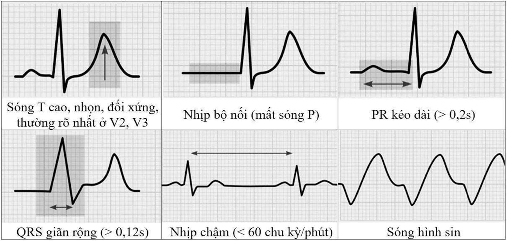
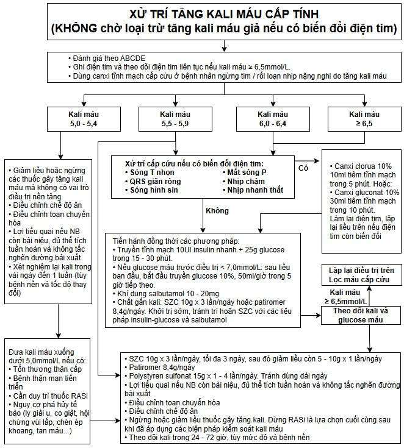
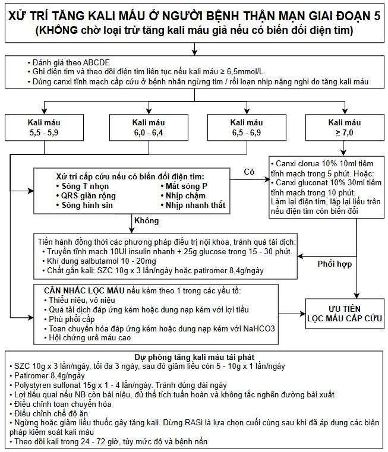

  

    COR I
    LOE A
    VUNA / VNUA 2026
    Hồi Sức Cấp Cứu & Thận Học
  

  <h1 class="guideline-hero-title">Khuyến Cáo Quốc Gia Chẩn Đoán & Điều Trị Tăng Kali Máu (2026)</h1>
  

    Đồng thuận chuyên môn toàn diện giữa <strong>Hội Hồi sức Cấp cứu và Chống độc Việt Nam (VUNA)</strong> và <strong>Hội Tiết niệu - Thận học Việt Nam (VNUA)</strong>: Tái định nghĩa quy trình tiếp cận khẩn cấp theo ba trục can thiệp (Ổn định màng tim – Chuyển dịch nội bào – Đào thải cơ thể), cập nhật động học hồi ứng kali sau lọc máu, chỉ định thuốc gắn kali trao đổi ion thế hệ mới (SZC, Patiromer) và đột phá trong chiến lược bảo tồn thuốc ức chế hệ renin-angiotensin-aldosterone (RASi) ở bệnh nhân suy tim và bệnh thận mạn tiến triển.
  

---

<section id="sec-dinh-nghia-dich-te" class="guideline-section">
  <h2 class="section-title"><i class="fa-solid fa-notes-medical"></i> 1. Định Nghĩa, Phân Loại Mức Độ & Dịch Tễ Học</h2>
  
  

    Kali là cation phong phú nhất trong cơ thể, đóng vai trò then chốt trong việc duy trì điện thế nghỉ của màng tế bào thần kinh, cơ vân và đặc biệt là hệ thống dẫn truyền cơ tim. Nồng độ kali huyết thanh bình thường ở người trưởng thành dao động trong khoảng hẹp từ <strong>3.5 đến 5.0 mmol/L</strong>. Tăng kali máu (Hyperkalemia) được định nghĩa khi nồng độ kali huyết thanh vượt quá <strong>5.0 mmol/L</strong>. Đây là một trong những cấp cứu nội khoa và hồi sức phổ biến nhất, có nguy cơ gây ngừng tim đột ngột do rung thất hoặc vô tâm thu mà không có dấu hiệu báo trước.
  

  

    <table class="table-custom">
      <thead>
        <tr>
          <th>Mức Độ Tăng Kali Máu</th>
          <th>Nồng Độ Kali Máu (mmol/L)</th>
          <th>Đặc Điểm Biến Đổi Điện Tâm Đồ (ECG)</th>
          <th>Chiến Lược Xử Trí Tương Ứng</th>
        </tr>
      </thead>
      <tbody>
        <tr>
          <td><strong class="text-success">Nhẹ (Mild)</strong></td>
          <td><strong>5.0 – 5.9</strong></td>
          <td>Thường không có biến đổi ECG hoặc chỉ có biến đổi sóng T không đặc hiệu.</td>
          <td>Rà soát và ngừng các thuốc gây giữ kali; điều chỉnh chế độ ăn giảm kali; bổ sung lợi tiểu quai nếu còn nước tiểu; điều chỉnh toan máu nếu có.</td>
        </tr>
        <tr>
          <td><strong class="text-warning">Trung bình (Moderate)</strong></td>
          <td><strong>6.0 – 6.4</strong></td>
          <td>Sóng T cao, nhọn, đối xứng, đáy hẹp (rõ nhất ở các chuyển đạo trước tim V2 – V4); không có biến đổi dẫn truyền nhĩ thất hoặc mở rộng QRS.</td>
          <td>Khởi động ngay các biện pháp nội khoa dịch chuyển kali vào nội bào (Insulin + Glucose, khí dung Salbutamol); phối hợp thuốc gắn kali đường uống; theo dõi ECG liên tục.</td>
        </tr>
        <tr>
          <td><strong class="text-danger">Nặng (Severe)</strong></td>
          <td>
            <strong>≥ 6.5</strong> HOẶC bất kỳ nồng độ nào kèm biến đổi ECG dẫn truyền. 
            <em>(≥ 7.0 ở bệnh nhân suy thận mạn lọc máu chu kỳ không triệu chứng)</em>
          </td>
          <td>Sóng P dẹt hoặc mất, khoảng PR kéo dài, phức bộ QRS giãn rộng, đoạn ST chênh, sóng hình sin (Sine wave), nhịp tự thất hoặc loạn nhịp thất.</td>
          <td><strong>Cấp cứu tối khẩn:</strong> Tiêm ngay muối Calci tĩnh mạch để bảo vệ màng tim; dùng ngay Insulin-Glucose liều cao, Salbutamol khí dung; chỉ định Thận nhân tạo cấp cứu (HD) hoặc CRRT.</td>
        </tr>
      </tbody>
    </table>
  

  

    
<i class="fa-solid fa-chart-line"></i> Dịch Tễ Học Lâm Sàng Theo VUNA 2026

    

      <ul>
        <li>Tăng kali máu xuất hiện ở khoảng <strong>1 – 10%</strong> tổng số bệnh nhân nhập viện nội trú, và lên đến <strong>10 – 15%</strong> bệnh nhân điều trị tại khoa Hồi sức tích cực (ICU).</li>
        <li>Tỷ lệ tăng kali máu tăng vọt lên <strong>10%</strong> ở bệnh nhân có Bệnh thận mạn (CKD) giai đoạn 3 – 5, và đạt mức <strong>30 – 50%</strong> ở nhóm bệnh nhân CKD kết hợp Đái tháo đường hoặc Suy tim phân suất tống máu giảm (HFrEF) có chỉ định điều trị thuốc ức chế hệ Renin-Angiotensin-Aldosterone (RASi: thuốc ức chế men chuyển ACEi, chẹn thụ thể ARB, kháng aldosterone MRA, hoặc ARNI).</li>
        <li>Tử vong do tăng kali máu nặng tại viện có thể lên tới <strong>15 – 30%</strong> nếu chậm trễ trong việc sử dụng canxi bảo vệ cơ tim và can thiệp lọc máu đào thải kali.</li>
      </ul>
    

  

</section>

---

<section id="sec-sinh-ly-chuyen-hoa" class="guideline-section">
  <h2 class="section-title"><i class="fa-solid fa-dna"></i> 2. Sinh Lý Bệnh Chuyển Hóa Kali & Điện Thế Nghỉ Của Màng Tế Bào</h2>

  

    Tổng lượng kali trong cơ thể người trưởng thành khoảng <strong>3000 – 4000 mmol (50 – 55 mmol/kg thể trọng)</strong>. Trong đó:
  

  <ul>
    <li><strong>98% tổng lượng kali (khoảng 3500 mmol)</strong> nằm trong ngăn nội bào, với nồng độ nội bào rất cao đạt <strong>140 – 150 mmol/L</strong>, chủ yếu trong tế bào cơ vân (chiếm 80%), gan, hồng cầu và xương.</li>
    <li><strong>Chỉ 2% tổng lượng kali (khoảng 50 – 70 mmol)</strong> nằm trong ngăn dịch ngoại bào, với nồng độ duy trì từ <strong>3.5 – 5.0 mmol/L</strong>.</li>
  </ul>

  

    
<i class="fa-solid fa-bolt"></i> Phương Trình Nernst & Điện Thế Nghỉ Của Màng Tế Bào Cơ Tim

    

      

        Điện thế nghỉ màng tế bào (Resting Membrane Potential — Em) phụ thuộc chủ yếu vào tỷ lệ giữa nồng độ kali nội bào và ngoại bào, được tính toán theo phương trình Nernst:
      

      

        <strong>Em = -61.5 × log10 ( [K+]nội bào / [K+]ngoại bào ) (ở 37°C)</strong>
      

      

        Ở trạng thái sinh lý, [K+]nội / [K+]ngoại xấp xỉ 140 / 4.0 = 35, tạo ra điện thế nghỉ màng cơ tim khoảng <strong>-90 mV</strong>.
      

      

        Khi kali máu ngoại bào tăng cao (ví dụ tăng lên 8.0 mmol/L), tỷ lệ này giảm xuống 140 / 8.0 = 17.5, làm cho điện thế nghỉ màng bớt âm hơn (chuyển dịch từ -90 mV lên -70 mV hoặc cao hơn). Hiện tượng khử cực màng bán phần này dẫn đến <strong>bất hoạt nhanh các kênh Natri phụ thuộc điện thế (Fast Na+ channels)</strong>, làm giảm đột ngột vận tốc dẫn truyền xung động khử cực thất (giảm dV/dt pha 0) và kéo dài thời gian trơ, biểu hiện trên lâm sàng bằng sóng QRS giãn rộng, rối loạn dẫn truyền nhĩ thất, nhịp chậm tiến triển và ngừng tim.
      

    

  

  <h3 class="subsection-title">2.1. Các Cơ Chế Điều Hòa Dịch Chuyển Kali Qua Màng (Transcellular Shift)</h3>
  <ul>
    <li><strong>Hoạt động của bơm Na+/K+-ATPase:</strong> Bơm chủ động vận chuyển 3 ion Na+ ra ngoài và đưa 2 ion K+ vào trong nội bào. Bơm này được kích hoạt mạnh mẽ bởi hai tác nhân sinh lý chính: <strong>Insulin</strong> và các chất <strong>chủ vận thụ thể Beta-2 giao cảm (Epinephrine, Salbutamol)</strong>. Thiếu hụt insulin hoặc ức chế beta giao cảm làm giảm vận chuyển kali vào nội bào, thúc đẩy tăng kali máu.</li>
    <li><strong>Cân bằng Kiềm - Toan:</strong> Trong toan chuyển hóa do acid vô cơ (tăng H+ do acid hydrochloric hoặc giảm bài tiết acid tại thận), ion H+ di chuyển vào trong tế bào để được đệm bởi protein nội bào, đổi lại ion K+ phải đi ra dịch ngoại bào để cân bằng điện tích. Quy tắc lâm sàng ước tính: <em>mỗi khi pH máu giảm 0.1 đơn vị, nồng độ kali huyết thanh tăng khoảng 0.4 – 0.7 mmol/L</em>. Ngược lại, trong toan chuyển hóa acid hữu cơ (toan lactic, toan ceton), anion lactat hoặc acetoacetat đi cùng H+ vào nội bào nên ít gây dịch chuyển kali hơn.</li>
    <li><strong>Áp lực thẩm thấu máu:</strong> Tình trạng tăng áp lực thẩm thấu ngoại bào cấp (ví dụ tăng glucose máu nặng trong đái tháo đường hoặc truyền mannitol) kéo nước từ nội bào ra dịch kẽ và lòng mạch. Sự thoát nước tế bào làm tăng nồng độ K+ nội bào, tạo độ dốc nồng độ đẩy kali ra ngoại bào (hiện tượng cuốn dung môi - solvent drag), làm tăng kali máu nặng nề.</li>
  </ul>

  <h3 class="subsection-title">2.2. Cơ Chế Đào Thải Kali Tại Thận</h3>
  

    Thận đảm nhiệm đào thải <strong>90 – 95%</strong> lượng kali ăn vào mỗi ngày, phần còn lại (5 – 10%) được thải qua đường tiêu hóa và mồ hôi. Toàn bộ kali lọc qua cầu thận được tái hấp thu gần hoàn toàn (khoảng 90%) tại ống lượn gần và quai Henle. Lượng kali thực tế bài xuất qua nước tiểu được quyết định bởi quá trình bài tiết chủ động tại <strong>tế bào chính (Principal Cells)</strong> của ống lượn xa muộn và ống góp vỏ thận thông qua kênh kali ROMK (Renal Outer Medullary K+ Channel) và kênh BK (Big K+ Channel). Quá trình này được điều hòa bởi 3 yếu tố sống còn:
  

  <ol>
    <li><strong>Hormone Aldosterone:</strong> Kích thích tăng biểu hiện và hoạt hóa bơm Na+/K+-ATPase ở màng đáy bên và kênh ENaC ở màng đỉnh, tạo điện thế âm trong lòng ống giúp hút K+ bài tiết ra ngoài nước tiểu.</li>
    <li><strong>Lưu lượng dòng dịch và tải lượng Natri đến nephron xa:</strong> Dòng nước tiểu chảy nhanh cuốn trôi kali trong lòng ống, duy trì độ dốc nồng độ thuận lợi cho bài tiết kali liên tục.</li>
    <li><strong>Toan kiềm tại chỗ:</strong> Kiềm chuyển hóa kích thích bài tiết kali, trong khi toan chuyển hóa ức chế bài tiết kali tại ống lượn xa.</li>
  </ol>
</section>

---

<section id="sec-chan-doan-gia-thuc" class="guideline-section">
  <h2 class="section-title"><i class="fa-solid fa-vial-circle-check"></i> 3. Chẩn Đoán Xác Định & Phân Biệt Tăng Kali Máu Giả (Pseudohyperkalemia)</h2>

  

    Tăng kali máu giả là hiện tượng nồng độ kali đo được trong mẫu xét nghiệm huyết thanh in vitro tăng cao giả tạo, trong khi nồng độ kali thực tế trong huyết tương lưu hành của cơ thể bệnh nhân hoàn toàn bình thường. Nhận diện chính xác tăng kali máu giả giúp ngăn ngừa việc điều trị hạ kali máu sai lầm dẫn đến hạ kali máu thực sự nguy kịch.
  

  

    
<i class="fa-solid fa-triangle-exclamation"></i> CẢNH BÁO ĐỎ TỪ VUNA 2026

    

      <strong>Tuyệt đối không được chờ đợi kết quả xét nghiệm lại để loại trừ tăng kali máu giả nếu bệnh nhân đã có triệu chứng lâm sàng nặng hoặc trên monitor / điện tim 12 chuyển đạo đã xuất hiện các biến đổi điện học rõ rệt!</strong> Việc tiêm muối Calci và các biện pháp cấp cứu phải được tiến hành ngay lập tức.
    

  

  <h3 class="subsection-title">3.1. Các Nguyên Nhân Phổ Biến Gây Tăng Kali Máu Giả</h3>
  <ul>
    <li><strong>Tan máu cơ học trong quá trình lấy mẫu:</strong> Garô quá chặt hoặc buộc quá 1 phút; nắm mở bàn tay liên tục khi lấy máu; dùng kim lấy máu quá nhỏ (cỡ &gt; 22G); hút chân không quá mạnh; lắc ống nghiệm quá mạnh gây vỡ hồng cầu; để mẫu máu quá lâu ngoài nhiệt độ phòng trước khi ly tâm tách huyết thanh.</li>
    <li><strong>Hội chứng tăng sinh tủy và tăng số lượng tế bào máu nặng:</strong>
      <ul>
        <li>Tăng số lượng tiểu cầu cực cao (&gt; 500 – 1000 × 10⁹/L): Trong quá trình đông máu in vitro để tạo huyết thanh, tiểu cầu vỡ ra giải phóng một lượng lớn kali nội bào.</li>
        <li>Tăng số lượng bạch cầu nặng (&gt; 50 – 100 × 10⁹/L trong bệnh bạch cầu cấp hoặc mạn): Bạch cầu non rất mỏng manh, dễ bị ly giải khi xử lý mẫu.</li>
      </ul>
    </li>
    <li><strong>Nhiễm bẩn mẫu do sai sót kỹ thuật:</strong> Lấy máu từ cùng cánh tay đang truyền dịch chứa kali (dịch Ringer Lactate, bổ sung KCl); lấy máu vào ống nghiệm chống đông EDTA (chứa muối Kali-EDTA) rồi đổ sang ống sinh hóa.</li>
  </ul>

  

    <table class="table-custom">
      <thead>
        <tr>
          <th>Tiêu Chí So Sánh</th>
          <th>Tăng Kali Máu Thật Sự</th>
          <th>Tăng Kali Máu Giả (Pseudohyperkalemia)</th>
        </tr>
      </thead>
      <tbody>
        <tr>
          <td><strong>Bối cảnh lâm sàng</strong></td>
          <td>Thường kèm suy thận cấp (AKI), suy thận mạn (CKD), đái tháo đường, suy tim, dùng thuốc RASi, toan máu nặng, tiêu cơ vân.</td>
          <td>Bệnh nhân hoàn toàn tỉnh táo, không có bệnh lý nền về thận hoặc tim mạch, không dùng thuốc giữ kali.</td>
        </tr>
        <tr>
          <td><strong>Điện tâm đồ (ECG)</strong></td>
          <td>Xuất hiện các biến đổi tiến triển: sóng T cao nhọn đối xứng, PR dài, QRS giãn rộng, hoặc rối loạn nhịp thất.</td>
          <td><strong>ECG 12 chuyển đạo hoàn toàn bình thường</strong>, không có biến đổi sóng T hoặc dẫn truyền nhĩ thất.</td>
        </tr>
        <tr>
          <td><strong>Xét nghiệm Khí máu (Máu toàn phần Heparin)</strong></td>
          <td>Kali máu toàn phần tăng cao đồng nhất với kết quả sinh hóa labo (chênh lệch &lt; 0.3 – 0.5 mmol/L).</td>
          <td><strong>Kali máu trên khí máu bình thường</strong> trong khi kali huyết thanh labo lại tăng cao rõ rệt (chênh lệch &gt; 0.5 mmol/L).</td>
        </tr>
        <tr>
          <td><strong>Chỉ số tan máu (HIL index)</strong></td>
          <td>Không có tán huyết in vitro (chỉ số HIL âm tính).</td>
          <td>Huyết thanh có màu hồng hoặc đỏ; chỉ số HIL báo hiệu có tán huyết cơ học trong ống nghiệm.</td>
        </tr>
        <tr>
          <td><strong>Lấy lại mẫu chuẩn (ống Heparinized máu tĩnh mạch không garô)</strong></td>
          <td>Kali tiếp tục tăng cao.</td>
          <td>Kali trở về giới hạn bình thường (3.5 – 5.0 mmol/L).</td>
        </tr>
      </tbody>
    </table>
  

</section>

---

<section id="sec-bien-doi-ecg" class="guideline-section">
  <h2 class="section-title"><i class="fa-solid fa-heart-pulse"></i> 4. 6 Giai Đoạn Biến Đổi Điện Tâm Đồ Tiến Triển Trong Tăng Kali Máu (Figure 1)</h2>

  

    Biến đổi điện tâm đồ phản ánh trực tiếp độc tính điện học của ion kali trên cơ tim và là chỉ dẫn tối thượng để quyết định can thiệp cấp cứu ổn định màng tim bằng muối Calci tĩnh mạch. Khuyến cáo VUNA 2026 hệ thống hóa biến đổi điện tim thành <strong>6 giai đoạn kinh điển nối tiếp nhau</strong>:
  

  

    <table class="table-custom">
      <thead>
        <tr>
          <th>Giai Đoạn</th>
          <th>Nồng Độ K+ Thường Gặp</th>
          <th>Đặc Điểm Điện Tim Chi Tiết</th>
          <th>Cơ Chế Điện Sinh Học Phân Tử</th>
        </tr>
      </thead>
      <tbody>
        <tr>
          <td><strong>Giai đoạn 1</strong></td>
          <td>5.5 – 6.5 mmol/L</td>
          <td><strong>Sóng T cao, nhọn, đối xứng, đáy hẹp (Peaked / Tented T waves)</strong>, rõ rệt nhất ở các chuyển đạo trước tim V2, V3, V4.</td>
          <td>Tăng tốc độ tái cực cơ thất do dòng kali đi ra (IKr) qua kênh HERG tăng cường độ dốc.</td>
        </tr>
        <tr>
          <td><strong>Giai đoạn 2</strong></td>
          <td>6.5 – 7.0 mmol/L</td>
          <td><strong>Khoảng PR kéo dài</strong>, sóng P dẹt dần, giảm biên độ và mở rộng thời gian dẫn truyền nhĩ.</td>
          <td>Giảm vận tốc dẫn truyền qua cơ nhĩ và nút nhĩ thất (AV node) do bất hoạt bán phần kênh Na+.</td>
        </tr>
        <tr>
          <td><strong>Giai đoạn 3</strong></td>
          <td>7.0 – 7.5 mmol/L</td>
          <td><strong>Mất hoàn toàn sóng P</strong> (dẫn truyền cơ nhĩ bị liệt hoàn toàn, xuất hiện nhịp xoang nhĩ thất - Sinuventricular rhythm hoặc nhịp bộ nối chậm); đoạn ST chênh (dễ chẩn đoán nhầm với hội chứng vành cấp).</td>
          <td>Cơ tâm nhĩ nhạy cảm với tăng kali hơn cơ thất, tế bào cơ nhĩ mất khả năng đáp ứng khử cực; xung động từ nút xoang truyền thẳng xuống nút AV qua bó liên nút.</td>
        </tr>
        <tr>
          <td><strong>Giai đoạn 4</strong></td>
          <td>7.5 – 8.0 mmol/L</td>
          <td><strong>Phức bộ QRS giãn rộng dần</strong>, biến dạng, trục tim chuyển dịch bất thường, hợp nhất một phần với sóng T.</td>
          <td>Vận tốc khử cực tâm thất giảm sâu sắc do phần lớn kênh Na+ nhanh bị bất hoạt hoàn toàn.</td>
        </tr>
        <tr>
          <td><strong>Giai đoạn 5</strong></td>
          <td>&gt; 8.0 mmol/L</td>
          <td><strong>Dạng sóng hình sin (Sine wave pattern)</strong>: Phức bộ QRS giãn rộng cực đại sáp nhập hoàn toàn với sóng T thành một đường lượn sóng liên tục hai pha nhịp nhàng.</td>
          <td>Dấu hiệu đe dọa ngừng tim tối cấp tính bằng phút; buồng tim mất hoàn toàn khả năng co bóp hiệu quả.</td>
        </tr>
        <tr>
          <td><strong>Giai đoạn 6</strong></td>
          <td>Bất kỳ khi K+ rất cao</td>
          <td><strong>Rung thất (Ventricular Fibrillation), Vô tâm thu (Asystole)</strong> hoặc Phân ly điện cơ (PEA). Ngừng tuần hoàn hô hấp.</td>
          <td>Hệ thống dẫn truyền tê liệt hoàn toàn, block dẫn truyền cơ tim toàn phần.</td>
        </tr>
      </tbody>
    </table>
  

  

    
<i class="fa-solid fa-triangle-exclamation"></i> Độ Nhạy Hạn Chế Của Điện Tâm Đồ Trong Tăng Kali Máu

    

      Các nghiên cứu lâm sàng quy mô lớn ghi nhận rằng <strong>độ nhạy của ECG trong chẩn đoán tăng kali máu chỉ đạt từ 34% đến 43%</strong>. Khoảng <strong>50% bệnh nhân có kali máu &ge; 6.5 mmol/L hoàn toàn không biểu hiện các dấu hiệu ECG kinh điển</strong>, hoặc có thể nhảy cóc từ một sóng T nhọn đơn thuần tiến thẳng vào rung thất mà không qua các bước QRS giãn rộng tuần tự. Do đó:
      <ul>
        <li><strong>Có biến đổi ECG:</strong> Bắt buộc dùng Calci tĩnh mạch ngay lập tức.</li>
        <li><strong>Không có biến đổi ECG:</strong> KHÔNG ĐƯỢC phép chủ quan loại trừ tăng kali máu nặng nếu xét nghiệm máu xác nhận K+ &ge; 6.5 mmol/L.</li>
      </ul>
    

  

  

    

      Hình Ảnh Thực Tế
      Hình 1. Các Biến Đổi Điện Tâm Đồ Tiến Triển Trong Tăng Kali Máu (VUNA 2026)
    

    

      
      

        <em>Hình 1: Tiến trình biến đổi hình thái phức bộ P-QRS-T từ bình thường qua sóng T cao nhọn, PR kéo dài, mất sóng P, QRS giãn rộng, sóng hình sin và rung thất / vô tâm thu. (Nguồn: Hội Hồi sức Cấp cứu và Chống độc Việt Nam, 2026).</em>
      

    

  

  

    

      Inline Vector SVG Studio
      <h4 class="editorial-title">Sơ Đồ Trực Quan Hóa 6 Giai Đoạn Biến Đổi Điện Tim & Ngưỡng Kali Máu</h4>
    

    

      <svg viewBox="0 0 900 320" width="100%" height="100%" class="svg-diagram" xmlns="http://www.w3.org/2000/svg">
        <defs>
          <linearGradient id="grad-norm" x1="0%" y1="0%" x2="0%" y2="100%">
            <stop offset="0%" stop-color="#10b981" stop-opacity="0.2"/>
            <stop offset="100%" stop-color="#10b981" stop-opacity="0.05"/>
          </linearGradient>
          <linearGradient id="grad-st1" x1="0%" y1="0%" x2="0%" y2="100%">
            <stop offset="0%" stop-color="#f59e0b" stop-opacity="0.2"/>
            <stop offset="100%" stop-color="#f59e0b" stop-opacity="0.05"/>
          </linearGradient>
          <linearGradient id="grad-st2" x1="0%" y1="0%" x2="0%" y2="100%">
            <stop offset="0%" stop-color="#f97316" stop-opacity="0.2"/>
            <stop offset="100%" stop-color="#f97316" stop-opacity="0.05"/>
          </linearGradient>
          <linearGradient id="grad-st3" x1="0%" y1="0%" x2="0%" y2="100%">
            <stop offset="0%" stop-color="#ef4444" stop-opacity="0.2"/>
            <stop offset="100%" stop-color="#ef4444" stop-opacity="0.05"/>
          </linearGradient>
          <linearGradient id="grad-st4" x1="0%" y1="0%" x2="0%" y2="100%">
            <stop offset="0%" stop-color="#b91c1c" stop-opacity="0.2"/>
            <stop offset="100%" stop-color="#b91c1c" stop-opacity="0.05"/>
          </linearGradient>
          <linearGradient id="grad-st5" x1="0%" y1="0%" x2="0%" y2="100%">
            <stop offset="0%" stop-color="#881337" stop-opacity="0.3"/>
            <stop offset="100%" stop-color="#881337" stop-opacity="0.1"/>
          </linearGradient>
        </defs>

        <!-- Stage 0: Normal -->
        <g transform="translate(10, 20)">
          <rect width="135" height="280" rx="8" fill="url(#grad-norm)" stroke="#10b981" stroke-width="1.5"/>
          <text x="67" y="30" text-anchor="middle" font-size="13" font-weight="bold" fill="#10b981">BÌNH THƯỜNG</text>
          <text x="67" y="50" text-anchor="middle" font-size="11" fill="var(--color-text-muted)">K+: 3.5 - 5.0</text>
          <!-- ECG trace Normal -->
          <path d="M 15 150 L 35 150 Q 42 140 48 150 L 53 150 L 57 160 L 63 90 L 70 170 L 73 150 L 85 150 Q 100 125 115 150 L 125 150" fill="none" stroke="#10b981" stroke-width="2"/>
          <text x="67" y="210" text-anchor="middle" font-size="11" font-weight="600" fill="var(--color-text)">Sóng P rõ</text>
          <text x="67" y="228" text-anchor="middle" font-size="11" fill="var(--color-text-muted)">PR: 0.12 - 0.20s</text>
          <text x="67" y="246" text-anchor="middle" font-size="11" fill="var(--color-text-muted)">QRS thanh mảnh</text>
          <text x="67" y="264" text-anchor="middle" font-size="11" fill="var(--color-text-muted)">Sóng T tròn đều</text>
        </g>

        <!-- Stage 1: Peaked T -->
        <g transform="translate(155, 20)">
          <rect width="135" height="280" rx="8" fill="url(#grad-st1)" stroke="#f59e0b" stroke-width="1.5"/>
          <text x="67" y="30" text-anchor="middle" font-size="13" font-weight="bold" fill="#f59e0b">GIAI ĐOẠN 1</text>
          <text x="67" y="50" text-anchor="middle" font-size="11" fill="var(--color-text-muted)">K+: 5.5 - 6.5</text>
          <!-- ECG trace Peaked T -->
          <path d="M 15 150 L 35 150 Q 42 140 48 150 L 53 150 L 57 158 L 63 95 L 69 165 L 72 150 L 80 150 L 98 75 L 115 150 L 125 150" fill="none" stroke="#f59e0b" stroke-width="2"/>
          <text x="67" y="210" text-anchor="middle" font-size="11" font-weight="bold" fill="#f59e0b">Sóng T cao nhọn</text>
          <text x="67" y="228" text-anchor="middle" font-size="11" fill="var(--color-text-muted)">Đáy hẹp, đối xứng</text>
          <text x="67" y="246" text-anchor="middle" font-size="11" fill="var(--color-text-muted)">Rõ ở V2 - V4</text>
          <text x="67" y="264" text-anchor="middle" font-size="11" fill="var(--color-text-muted)">Khoảng QT ngắn</text>
        </g>

        <!-- Stage 2: Flat P, Long PR -->
        <g transform="translate(300, 20)">
          <rect width="135" height="280" rx="8" fill="url(#grad-st2)" stroke="#f97316" stroke-width="1.5"/>
          <text x="67" y="30" text-anchor="middle" font-size="13" font-weight="bold" fill="#f97316">GIAI ĐOẠN 2</text>
          <text x="67" y="50" text-anchor="middle" font-size="11" fill="var(--color-text-muted)">K+: 6.5 - 7.0</text>
          <!-- ECG trace PR long -->
          <path d="M 15 150 L 30 150 Q 38 145 45 150 L 65 150 L 68 158 L 74 100 L 80 165 L 83 150 L 92 150 L 105 80 L 118 150 L 125 150" fill="none" stroke="#f97316" stroke-width="2"/>
          <text x="67" y="210" text-anchor="middle" font-size="11" font-weight="bold" fill="#f97316">PR kéo dài</text>
          <text x="67" y="228" text-anchor="middle" font-size="11" fill="var(--color-text-muted)">Sóng P dẹt dần</text>
          <text x="67" y="246" text-anchor="middle" font-size="11" fill="var(--color-text-muted)">Chậm dẫn truyền nhĩ</text>
          <text x="67" y="264" text-anchor="middle" font-size="11" fill="var(--color-text-muted)">Sóng T vẫn nhọn</text>
        </g>

        <!-- Stage 3: Loss of P -->
        <g transform="translate(445, 20)">
          <rect width="135" height="280" rx="8" fill="url(#grad-st3)" stroke="#ef4444" stroke-width="1.5"/>
          <text x="67" y="30" text-anchor="middle" font-size="13" font-weight="bold" fill="#ef4444">GIAI ĐOẠN 3</text>
          <text x="67" y="50" text-anchor="middle" font-size="11" fill="var(--color-text-muted)">K+: 7.0 - 7.5</text>
          <!-- ECG trace Loss of P -->
          <path d="M 15 150 L 55 150 L 60 162 L 68 105 L 77 170 L 82 145 L 88 145 Q 98 140 105 85 Q 112 140 120 150 L 125 150" fill="none" stroke="#ef4444" stroke-width="2"/>
          <text x="67" y="210" text-anchor="middle" font-size="11" font-weight="bold" fill="#ef4444">Mất sóng P</text>
          <text x="67" y="228" text-anchor="middle" font-size="11" fill="var(--color-text-muted)">Liệt cơ tâm nhĩ</text>
          <text x="67" y="246" text-anchor="middle" font-size="11" fill="var(--color-text-muted)">Đoạn ST chênh</text>
          <text x="67" y="264" text-anchor="middle" font-size="11" fill="var(--color-text-muted)">Nhịp bộ nối / xoang thất</text>
        </g>

        <!-- Stage 4: QRS Widening -->
        <g transform="translate(590, 20)">
          <rect width="135" height="280" rx="8" fill="url(#grad-st4)" stroke="#b91c1c" stroke-width="1.5"/>
          <text x="67" y="30" text-anchor="middle" font-size="13" font-weight="bold" fill="#b91c1c">GIAI ĐOẠN 4</text>
          <text x="67" y="50" text-anchor="middle" font-size="11" fill="var(--color-text-muted)">K+: 7.5 - 8.0</text>
          <!-- ECG trace QRS Wide -->
          <path d="M 15 150 L 40 150 L 48 165 L 62 110 L 78 175 L 88 140 Q 98 135 106 90 Q 116 142 125 150" fill="none" stroke="#b91c1c" stroke-width="2.5"/>
          <text x="67" y="210" text-anchor="middle" font-size="11" font-weight="bold" fill="#b91c1c">QRS giãn rộng</text>
          <text x="67" y="228" text-anchor="middle" font-size="11" fill="var(--color-text-muted)">QRS sáp nhập sóng T</text>
          <text x="67" y="246" text-anchor="middle" font-size="11" fill="var(--color-text-muted)">Dẫn truyền thất suy sụp</text>
          <text x="67" y="264" text-anchor="middle" font-size="11" fill="var(--color-text-muted)">Block nhánh / phân nhánh</text>
        </g>

        <!-- Stage 5: Sine Wave -->
        <g transform="translate(735, 20)">
          <rect width="155" height="280" rx="8" fill="url(#grad-st5)" stroke="#881337" stroke-width="2"/>
          <text x="77" y="30" text-anchor="middle" font-size="13" font-weight="bold" fill="#e11d48">GIAI ĐOẠN 5 & 6</text>
          <text x="77" y="50" text-anchor="middle" font-size="11" fill="#fb7185">K+ &gt; 8.0 mmol/L</text>
          <!-- ECG trace Sine Wave -->
          <path d="M 10 150 Q 25 80 50 150 Q 75 220 100 150 Q 125 80 145 150" fill="none" stroke="#e11d48" stroke-width="3"/>
          <text x="77" y="210" text-anchor="middle" font-size="12" font-weight="bold" fill="#e11d48">SÓNG HÌNH SIN</text>
          <text x="77" y="228" text-anchor="middle" font-size="11" fill="var(--color-text-muted)">(Sine Wave Pattern)</text>
          <text x="77" y="246" text-anchor="middle" font-size="11" font-weight="bold" fill="#fb7185">Ngừng tim tối cấp</text>
          <text x="77" y="264" text-anchor="middle" font-size="11" fill="var(--color-text-muted)">Rung thất / Vô tâm thu</text>
        </g>
      </svg>
    

  

</section>

---

<section id="sec-kieng-ba-chan-cap-cuu" class="guideline-section">
  <h2 class="section-title"><i class="fa-solid fa-kit-medical"></i> 5. Kiềng Ba Chân Điều Trị Cấp Cứu Tăng Kali Máu Nặng</h2>

  

    Khuyến cáo VUNA / VNUA 2026 nhấn mạnh mô hình điều trị toàn diện dựa trên <strong>Kiềng ba chân (The Treatment Triad)</strong> được tiến hành song song đồng thời, nhằm đạt mục tiêu: Bảo vệ màng tế bào cơ tim ngay tức thì &rarr; Dịch chuyển nhanh kali vào nội bào trong giờ đầu &rarr; Đào thải dứt điểm tổng lượng kali dư thừa ra khỏi cơ thể.
  

  

    
<i class="fa-solid fa-layer-group"></i> Tổng Quan 3 Trục Can Thiệp Của Kiềng Ba Chân

    

      <ol>
        <li><strong>Trục 1 — Ổn định màng tế bào cơ tim (Tức thì: 1 – 3 phút):</strong> Sử dụng muối Calci tĩnh mạch để đối kháng tác dụng ức chế dẫn truyền của kali lên màng tế bào tim. <em>Lưu ý: Calci không làm thay đổi nồng độ kali trong máu.</em></li>
        <li><strong>Trục 2 — Dịch chuyển kali vào nội bào (Tạm thời: 15 – 60 phút):</strong> Sử dụng phối hợp Insulin kèm Glucose, khí dung thuốc chủ vận Beta-2 (Salbutamol) và Natri Bicarbonate (nếu có toan máu nặng).</li>
        <li><strong>Trục 3 — Đào thải kali ra khỏi cơ thể (Triệt để: hàng giờ đến hàng ngày):</strong> Lọc máu cấp cứu (Thận nhân tạo HD hoặc CRRT), Lợi tiểu quai tiêm tĩnh mạch và Thuốc gắn kali trao đổi ion đường tiêu hóa (SZC, Patiromer, SPS).</li>
      </ol>
    

  

  <h3 class="subsection-title">5.1. Trục 1: Ổn Định Màng Cơ Tim Bằng Muối Calci Tĩnh Mạch</h3>
  
  

    <strong>Chỉ định:</strong> Khi kali máu &ge; 6.5 mmol/L HOẶC bất kỳ nồng độ kali máu nào có biến đổi trên điện tâm đồ (sóng T nhọn, mất P, QRS giãn rộng, loạn nhịp tim).
  

  

    <strong>Cơ chế tác dụng:</strong> Nồng độ Calci ngoại bào tăng cao làm tăng điện thế ngưỡng kích thích (Threshold potential) của tế bào cơ tim từ khoảng -75 mV lên -65 mV, phục hồi lại khoảng cách chênh lệch điện thế bình thường giữa điện thế nghỉ và điện thế ngưỡng, từ đó tái lập hoạt tính của các kênh Natri nhanh và phục hồi tốc độ dẫn truyền cơ tim.
  

  

    <table class="table-custom">
      <thead>
        <tr>
          <th>Chế Phẩm Calci Tĩnh Mạch</th>
          <th>Liều Lượng & Cách Dùng</th>
          <th>Hàm Lượng Calci Nguyên Tố</th>
          <th>Ưu Điểm, Nhược Điểm & Thận Trọng</th>
        </tr>
      </thead>
      <tbody>
        <tr>
          <td><strong>Calci Clorua 10% (Calcium Chloride)</strong></td>
          <td>
            <strong>10 ml (1 ống 1g)</strong> 
            Tiêm tĩnh mạch chậm trong <strong>3 – 5 phút</strong>. 
            Lặp lại liều sau 5 – 10 phút nếu ECG chưa cải thiện.
          </td>
          <td><strong>270 mg (13.6 mEq)</strong> Calci nguyên tố (gấp 3 lần Calci gluconat).</td>
          <td>
            <strong>Ưu điểm:</strong> Nâng nồng độ Ca2+ ion hóa nhanh nhất; là lựa chọn ưu tiên hàng đầu trong ngừng tim hoặc sốc nặng. 
            <strong>Nhược điểm:</strong> Gây kích ứng tĩnh mạch mạnh, nguy cơ hoại tử mô nghiêm trọng nếu thoát mạch. <em>Chỉ nên tiêm qua catheter tĩnh mạch trung tâm</em> (hoặc ven ngoại vi lớn trong tình huống tối khẩn cấp).
          </td>
        </tr>
        <tr>
          <td><strong>Calci Gluconat 10% (Calcium Gluconate)</strong></td>
          <td>
            <strong>30 ml (3 ống 10ml = 3g)</strong> 
            Tiêm tĩnh mạch chậm trong <strong>5 – 10 phút</strong>. 
            Lặp lại liều sau 5 – 10 phút nếu ECG chưa cải thiện.
          </td>
          <td><strong>90 mg / 10ml (khoảng 270 mg trong 30ml)</strong> Calci nguyên tố.</td>
          <td>
            <strong>Ưu điểm:</strong> An toàn cho tĩnh mạch ngoại biên, ít nguy cơ hoại tử mô nếu rò rỉ ra ngoài lòng mạch; là lựa chọn ưu tiên khi chưa có đường truyền tĩnh mạch trung tâm. 
            <strong>Lưu ý liều dùng:</strong> Phải dùng đủ 30ml (3 ống) mới tương đương lượng Calci nguyên tố của 1 ống Calci Clorua 10ml.
          </td>
        </tr>
      </tbody>
    </table>
  

  

    
<i class="fa-solid fa-ban"></i> 2 Chống Chỉ Định & Tương Tác Cần Nhớ Tuyệt Đối

    

      <ul>
        <li><strong>Không pha chung Calci với Natri Bicarbonate:</strong> Trong cùng một đường truyền tĩnh mạch, ion Ca2+ và HCO3- sẽ kết tủa ngay lập tức tạo thành tinh thể Calci Carbonate (CaCO3) trắng đục, gây tắc đường truyền và thuyên tắc mạch. Phải tráng rửa đường truyền bằng NaCl 0.9% trước khi đổi thuốc.</li>
        <li><strong>Thận trọng tối đa trong Ngộ độc Digitalis (Digoxin):</strong> Calci làm tăng nồng độ Ca2+ nội bào tự do, kích hoạt tình trạng co cứng tim ('stone heart') và thúc đẩy rung thất gây tử vong. Nếu bệnh nhân nghi ngờ hoặc xác định ngộ độc Digoxin có tăng kali máu đe dọa, <strong>ưu tiên sử dụng kháng thể Fab kháng Digoxin (Digoxin-specific antibody fragments)</strong> và Magnesi Sulfat. Chỉ truyền Calci thật chậm khi các biện pháp khác thất bại và ngừng tim cận kề.</li>
      </ul>
    

  

  <h3 class="subsection-title">5.2. Trục 2: Dịch Chuyển Kali Vào Nội Bào (Transcellular Shifting)</h3>

  

    <table class="table-custom">
      <thead>
        <tr>
          <th>Liệu Pháp Dịch Chuyển</th>
          <th>Phác Đồ & Liều Dùng Chuẩn VUNA 2026</th>
          <th>Thời Gian Khởi Phát & Tác Dụng</th>
          <th>Khả Năng Hạ Kali Máu & Lưu Ý An Toàn</th>
        </tr>
      </thead>
      <tbody>
        <tr>
          <td><strong>Insulin Thường (Regular) + Glucose</strong></td>
          <td>
            <strong>10 UI Insulin Regular (tiêm TM bolus)</strong> 
            kết hợp truyền tĩnh mạch nhanh <strong>25g Glucose</strong> (50 ml Glucose 50% hoặc 125 ml Glucose 20%) trong 15 – 30 phút.
          </td>
          <td>Khởi phát sau <strong>15 – 30 phút</strong>; tác dụng tối đa sau 60 phút; kéo dài <strong>4 – 6 giờ</strong>.</td>
          <td>
            Giảm kali máu từ <strong>0.5 – 1.2 mmol/L</strong>. 
            <strong>Phòng ngừa hạ đường huyết:</strong> Theo dõi đường huyết mao mạch tại thời điểm 15, 30 phút và mỗi giờ trong 4 – 6 giờ. Nếu đường huyết nền &lt; 7.0 mmol/L (126 mg/dL), <em>bắt buộc truyền duy trì dịch Glucose 10% tốc độ 50 ml/giờ trong 5 giờ liên tục</em>.
          </td>
        </tr>
        <tr>
          <td><strong>Khí Dung Thuốc Chủ Vận Beta-2 (Salbutamol)</strong></td>
          <td>
            <strong>10 – 20 mg Salbutamol</strong> (2 – 4 ống khí dung 5mg/2.5ml) 
            pha với 2 – 4 ml NaCl 0.9%, khí dung qua mặt nạ thở oxy trong <strong>10 – 15 phút</strong>.
          </td>
          <td>Khởi phát sau <strong>15 – 30 phút</strong>; tác dụng tối đa sau 90 phút; kéo dài <strong>2 – 4 giờ</strong>.</td>
          <td>
            Giảm kali máu thêm <strong>0.5 – 1.0 mmol/L</strong>. 
            <strong>Tác dụng hiệp đồng:</strong> Phối hợp cùng Insulin-Glucose giúp hạ kali sâu hơn và kéo dài hơn. Lưu ý: Khoảng <strong>20 – 40% bệnh nhân không đáp ứng</strong> (đặc biệt là bệnh nhân đang sử dụng thuốc chẹn beta giao cảm không chọn lọc như Propranolol, Carvedilol). Tác dụng phụ: nhịp nhanh, run cơ, đánh trống ngực.
          </td>
        </tr>
        <tr>
          <td><strong>Natri Bicarbonate (NaHCO3)</strong></td>
          <td>
            <strong>50 – 100 mmol</strong> (tương đương 250 – 500 ml dung dịch NaHCO3 1.4% đẳng trương) truyền tĩnh mạch chậm trong 2 – 4 giờ.
          </td>
          <td>Khởi phát chậm sau <strong>2 – 4 giờ</strong>; hiệu lực không ổn định.</td>
          <td>
            <strong>Chỉ định hạn chế:</strong> Chỉ sử dụng khi bệnh nhân có <em>toan chuyển hóa nặng đi kèm (pH &lt; 7.10 và HCO3- &lt; 10 mmol/L)</em>. Không dùng NaHCO3 đơn độc để hạ kali ở bệnh nhân không toan máu. Nguy cơ: quá tải tuần hoàn do nạp muối Natri, hạ Calci ion hóa cấp kích hoạt co giật / loạn nhịp, và kiềm chuyển hóa dội ngược.
          </td>
        </tr>
      </tbody>
    </table>
  

</section>

---

<section id="sec-cac-nhom-thuoc-dao-thai" class="guideline-section">
  <h2 class="section-title"><i class="fa-solid fa-pills"></i> 6. Các Biện Pháp Đào Thải Triệt Để: Lọc Máu Cấp Cứu & Thuốc Gắn Kali Thế Hệ Mới</h2>

  

    Các biện pháp dịch chuyển kali nội bào chỉ có tác dụng tạm thời trong 4 – 6 giờ. Sau thời gian này, kali sẽ tái giải phóng từ nội bào trở lại dòng máu. Do đó, việc kích hoạt ngay các biện pháp đào thải kali ra khỏi cơ thể là yếu tố quyết định để kiểm soát triệt để tăng kali máu.
  

  <h3 class="subsection-title">6.1. Thuốc Lợi Tiểu Quai (Loop Diuretics)</h3>
  <ul>
    <li><strong>Chế phẩm & Liều lượng:</strong> Furosemide tiêm tĩnh mạch <strong>40 – 80 mg</strong> (hoặc liều cao hơn 120 – 200 mg ở bệnh nhân suy thận mạn tiến triển).</li>
    <li><strong>Cơ chế:</strong> Ức chế đồng vận chuyển Na+/K+/2Cl- tại nhánh dày quai Henle, làm tăng lượng Natri và lưu lượng dịch chảy đến ống lượn xa, kích thích tế bào chính tăng bài tiết K+ qua nước tiểu.</li>
    <li><strong>Điều kiện áp dụng:</strong> Chỉ có tác dụng khi bệnh nhân còn bảo tồn chức năng thận bài tiết nước tiểu (nước tiểu &gt; 0.5 ml/kg/h) và có tình trạng thể tích bình thường (euvolemia) hoặc thừa dịch (hypervolemia). Chống chỉ định khi bệnh nhân đang có giảm thể tích tuần hoàn hoặc tụt huyết áp.</li>
  </ul>

  <h3 class="subsection-title">6.2. Điều Trị Thay Thế Thận (Lọc Máu Cấp Cứu)</h3>
  

    Lọc máu là phương pháp đào thải kali trực tiếp, nhanh chóng và triệt để nhất trong y học hồi sức, đặc biệt là ở bệnh nhân suy thận cấp vô niệu, suy thận mạn giai đoạn cuối hoặc tăng kali máu trơ với điều trị nội khoa.
  

  

    <table class="table-custom">
      <thead>
        <tr>
          <th>Phương Thức Lọc Máu</th>
          <th>Tốc Độ Đào Thải Kali</th>
          <th>Chỉ Định Ưu Tiên</th>
          <th>Hiện Tượng Hồi Ứng Kali Sau Lọc (Rebound)</th>
        </tr>
      </thead>
      <tbody>
        <tr>
          <td><strong>Thận Nhân Tạo Ngắt Quãng (Intermittent Hemodialysis — HD)</strong></td>
          <td>
            <strong>Nhanh nhất:</strong> Giảm nồng độ K+ máu <strong>&gt; 1.0 – 1.5 mmol/L ngay trong giờ đầu tiên</strong>. 
            Loại bỏ tổng cộng <strong>70 – 100 mmol Kali</strong> sau một cuộc lọc tiêu chuẩn 3 – 4 giờ.
          </td>
          <td>Lựa chọn ưu tiên số 1 khi bệnh nhân có huyết động ổn định, cần hạ kali cấp tốc để cứu vãn tính mạng.</td>
          <td>
            <strong>Hiện tượng tái tăng kali dội ngược (Rebound):</strong> Sau khi kết thúc HD, kali trong nội bào tiếp tục khuếch tán ra dịch ngoại bào. Nồng độ K+ máu tăng trở lại khoảng <strong>35% sau 1 giờ</strong> và lên đến <strong>70% sau 6 giờ</strong>. <em>Bắt buộc xét nghiệm lại kali máu sau lọc 2 – 4 giờ</em> để quyết định cuộc lọc bổ sung.
          </td>
        </tr>
        <tr>
          <td><strong>Lọc Máu Liên Tục (Continuous Renal Replacement Therapy — CRRT)</strong></td>
          <td>
            Tốc độ đào thải chậm và êm dịu hơn: khoảng <strong>15 – 30 mmol/giờ</strong> với liều dịch thay thế / thẩm tách 25 – 35 ml/kg/giờ.
          </td>
          <td>Bệnh nhân sốc, huyết động không ổn định, đang dùng vận mạch liều cao, chấn thương sọ não hoặc suy đa tạng.</td>
          <td>Kiểm soát kali ổn định liên tục, không gây hiện tượng tái tăng dội ngược đột ngột; tuy nhiên hạ kali chậm hơn HD trong giờ đầu.</td>
        </tr>
      </tbody>
    </table>
  

  <h3 class="subsection-title">6.3. Thuốc Gắn Kali Đường Tiêu Hóa (Potassium Binders): Bước Tiến Với SZC & Patiromer</h3>
  
  

    Sự ra đời của các thuốc gắn kali thế hệ mới (Sodium Zirconium Cyclosilicate và Patiromer) đã làm thay đổi căn bản thực hành lâm sàng, khắc phục hoàn toàn nhược điểm hoại tử ruột của nhựa trao đổi ion cổ điển SPS.
  

  

    <table class="table-custom">
      <thead>
        <tr>
          <th>Thuốc Gắn Kali</th>
          <th>Cơ Chế Tác Dụng & Tính Chọn Lọc</th>
          <th>Liều Dùng Khuyến Cáo (Cấp Cứu & Duy Trì)</th>
          <th>Thời Gian Khởi Phát & Ưu Nhược Điểm Lâm Sàng</th>
        </tr>
      </thead>
      <tbody>
        <tr>
          <td><strong>Sodium Zirconium Cyclosilicate (SZC — Lokelma)</strong></td>
          <td>Bột tinh thể vô cơ bẫy chọn lọc cao ion K+ để đổi lấy ion Na+ và H+ xuyên suốt toàn bộ chiều dài đường tiêu hóa (từ dạ dày đến trực tràng).</td>
          <td>
            <strong>Giai đoạn cấp cứu:</strong> Uống <strong>10g × 3 lần/ngày</strong> (mỗi lần pha trong 45ml nước) trong vòng <strong>24 – 48 giờ</strong> (tối đa 72 giờ) cho đến khi kali về bình thường. 
            <strong>Giai đoạn duy trì:</strong> Uống <strong>5 – 10g × 1 lần/ngày</strong>.
          </td>
          <td>
            <strong>Khởi phát nhanh nhất: tác dụng hạ kali bắt đầu sau 1 giờ</strong>; đạt mức giảm trung bình 0.7 – 1.1 mmol/L sau 24 – 48 giờ. 
            <strong>Ưu điểm:</strong> Dung nạp tiêu hóa rất tốt, không gây hoại tử ruột. Có thể dùng trong cấp cứu. 
            <strong>Thận trọng:</strong> Mỗi liều 10g giải phóng khoảng 800mg Natri; cần theo dõi phù, tăng huyết áp nhẹ ở bệnh nhân suy tim ứ huyết nặng.
          </td>
        </tr>
        <tr>
          <td><strong>Patiromer (Veltassa)</strong></td>
          <td>Polymer trao đổi cation không hấp thu, gắn kết ion K+ để giải phóng ion Calci (Ca2+) chủ yếu tại đại tràng (nơi có nồng độ kali cao nhất).</td>
          <td>
            <strong>Khởi đầu:</strong> Uống <strong>8.4g × 1 lần/ngày</strong> (pha trong nước). 
            Điều chỉnh tăng liều từng nấc 8.4g sau mỗi tuần (liều tối đa 25.2g/ngày) tùy theo nồng độ kali huyết thanh mục tiêu.
          </td>
          <td>
            <strong>Khởi phát sau 4 – 7 giờ</strong>; tác dụng tối đa sau 24 – 48 giờ. 
            <strong>Ưu điểm:</strong> Không chứa Natri nên rất an toàn cho bệnh nhân suy tim và tăng huyết áp khó kiểm soát; dung nạp tốt. 
            <strong>Thận trọng:</strong> Có thể gắn một phần Magnesi gây hạ Magnesi máu (cần kiểm tra định kỳ Mg2+); uống cách các thuốc khác ít nhất 2 – 3 giờ.
          </td>
        </tr>
        <tr>
          <td><strong>Sodium Polystyrene Sulfonate (SPS — Kayexalate / Resonium A)</strong></td>
          <td>Nhựa resin trao đổi cation không chọn lọc, gắn ion K+ để đổi lấy ion Natri tại đại tràng.</td>
          <td>
            Uống 15 – 30g (pha trong nước hoặc siro) × 1 – 4 lần/ngày; hoặc thụt giữ qua hậu môn 30 – 50g.
          </td>
          <td>
            Khởi phát chậm sau <strong>4 – 6 giờ</strong> (hoặc lâu hơn). Hiệu lực hạ kali không dự đoán trước được. 
            <strong>CẢNH BÁO ĐỎ CỦA FDA & VUNA:</strong> Nguy cơ gây <strong>hoại tử ruột (Intestinal necrosis)</strong>, thủng đại tràng và viêm loét ruột thiếu máu cục bộ, đặc biệt khi dùng đồng thời với Sorbitol. VUNA 2026 khuyến cáo <em>hạn chế sử dụng SPS</em>, chỉ dùng khi không có sẵn SZC hoặc Patiromer.
          </td>
        </tr>
      </tbody>
    </table>
  

</section>

---

<section id="sec-luo-do-cap-cuu" class="guideline-section">
  <h2 class="section-title"><i class="fa-solid fa-diagram-project"></i> 7. Lưu Đồ Xử Trí Tăng Kali Máu Cấp Cứu (Figure 2)</h2>

  

    Lưu đồ dưới đây tóm tắt các bước ra quyết định khẩn cấp theo chuẩn của Hội Hồi sức Cấp cứu và Chống độc Việt Nam (VUNA 2026) cho mọi bác sĩ hồi sức, cấp cứu và nội khoa:
  

  

    

      Hình Ảnh Thực Tế
      Hình 2. Lưu Đồ Xử Trí Tăng Kali Máu Cấp Cứu (VUNA 2026)
    

    

      
      

        <em>Hình 2: Lưu đồ tiếp cận và xử trí tăng kali máu cấp cứu từ đánh giá ABCDE, bảo vệ cơ tim bằng Canxi, dịch chuyển nội bào, chỉ định lọc máu cấp cứu đến dự phòng tái phát. (Nguồn: Hội Hồi sức Cấp cứu và Chống độc Việt Nam, 2026).</em>
      

    

  

  

    

      Inline Vector SVG Studio
      <h4 class="editorial-title">Sơ Đồ Phân Nhánh Lưu Đồ Xử Trí Tăng Kali Máu Cấp Cứu (VUNA 2026)</h4>
    

    

      <svg viewBox="0 0 920 620" width="100%" height="100%" class="svg-diagram" xmlns="http://www.w3.org/2000/svg">
        <defs>
          <marker id="arrow" viewBox="0 0 10 10" refX="5" refY="5" markerWidth="6" markerHeight="6" orient="auto-start-reverse">
            <path d="M 0 0 L 10 5 L 0 10 z" fill="#0284c7"/>
          </marker>
          <marker id="arrow-red" viewBox="0 0 10 10" refX="5" refY="5" markerWidth="6" markerHeight="6" orient="auto-start-reverse">
            <path d="M 0 0 L 10 5 L 0 10 z" fill="#ef4444"/>
          </marker>
        </defs>

        <!-- Top Node: Identification -->
        <rect x="230" y="20" width="460" height="60" rx="8" fill="var(--color-surface)" stroke="#0284c7" stroke-width="2"/>
        <text x="460" y="45" text-anchor="middle" font-size="14" font-weight="bold" fill="var(--color-primary)">BỆNH NHÂN XÁC ĐỊNH TĂNG KALI MÁU (K+ &ge; 5.0 mmol/L)</text>
        <text x="460" y="65" text-anchor="middle" font-size="12" fill="var(--color-text-muted)">Đánh giá khẩn cấp ABCDE &bull; Monitor nhịp tim &bull; Đo ECG 12 chuyển đạo ngay</text>

        <!-- Arrow Down to ECG Branch -->
        <line x1="460" y1="80" x2="460" y2="120" stroke="#0284c7" stroke-width="2" marker-end="url(#arrow)"/>

        <!-- Decision Box: ECG Changes -->
        <rect x="300" y="120" width="320" height="50" rx="6" fill="#fef2f2" stroke="#ef4444" stroke-width="2"/>
        <text x="460" y="145" text-anchor="middle" font-size="13" font-weight="bold" fill="#b91c1c">CÓ BIẾN ĐỔI ĐIỆN TÂM ĐỒ HOẶC K+ &ge; 6.5?</text>
        <text x="460" y="162" text-anchor="middle" font-size="11" fill="#ef4444">(T nhọn, PR dài, mất P, QRS giãn rộng, hoặc loạn nhịp)</text>

        <!-- Branch Yes: Left -->
        <line x1="300" y1="145" x2="160" y2="145" stroke="#ef4444" stroke-width="2"/>
        <line x1="160" y1="145" x2="160" y2="200" stroke="#ef4444" stroke-width="2" marker-end="url(#arrow-red)"/>
        <text x="215" y="138" font-size="12" font-weight="bold" fill="#ef4444">CÓ (Tối Khẩn)</text>

        <!-- Branch No: Right -->
        <line x1="620" y1="145" x2="760" y2="145" stroke="#0284c7" stroke-width="2"/>
        <line x1="760" y1="145" x2="760" y2="200" stroke="#0284c7" stroke-width="2" marker-end="url(#arrow)"/>
        <text x="680" y="138" font-size="12" font-weight="bold" fill="#0284c7">KHÔNG (5.0 - 5.9)</text>

        <!-- Left Node: Calcium -->
        <rect x="40" y="200" width="240" height="90" rx="6" fill="#fff1f2" stroke="#e11d48" stroke-width="1.5"/>
        <text x="160" y="222" text-anchor="middle" font-size="13" font-weight="bold" fill="#be123c">MŨI CANXI TĨNH MẠCH</text>
        <text x="160" y="242" text-anchor="middle" font-size="11" fill="var(--color-text)">Calci Clorua 10% 10ml tiêm TM (5p)</text>
        <text x="160" y="258" text-anchor="middle" font-size="11" fill="var(--color-text)">HOẶC Calci Gluconat 10% 30ml (10p)</text>
        <text x="160" y="276" text-anchor="middle" font-size="11" font-weight="600" fill="#be123c">Lặp lại sau 5 phút nếu ECG chưa hồi</text>

        <!-- Right Node: Initial Mild Mgmt -->
        <rect x="640" y="200" width="240" height="90" rx="6" fill="#f0fdf4" stroke="#16a34a" stroke-width="1.5"/>
        <text x="760" y="222" text-anchor="middle" font-size="13" font-weight="bold" fill="#15803d">ĐIỀU TRỊ BAN ĐẦU</text>
        <text x="760" y="242" text-anchor="middle" font-size="11" fill="var(--color-text)">Ngừng thuốc giữ K+ (RASi, NSAIDs)</text>
        <text x="760" y="258" text-anchor="middle" font-size="11" fill="var(--color-text)">Lợi tiểu quai (Furosemid 40-80mg)</text>
        <text x="760" y="276" text-anchor="middle" font-size="11" fill="var(--color-text)">Chế độ ăn giảm K+ &bull; Chỉnh toan</text>

        <!-- Center Node: Shifting Therapies -->
        <rect x="200" y="325" width="520" height="95" rx="8" fill="var(--color-surface)" stroke="#0284c7" stroke-width="2"/>
        <text x="460" y="348" text-anchor="middle" font-size="14" font-weight="bold" fill="#0284c7">ĐIỀU TRỊ NỘI KHOA DỊCH CHUYỂN ĐỒNG THỜI</text>
        <text x="460" y="370" text-anchor="middle" font-size="12" fill="var(--color-text)">&bull; 10 UI Regular Insulin + 25g Glucose (50ml G50% hoặc 125ml G20%) IV trong 15-30p</text>
        <text x="460" y="388" text-anchor="middle" font-size="11" fill="#b45309">(Truyền duy trì G10% 50ml/h x 5h nếu đường huyết ban đầu &lt; 7.0 mmol/L)</text>
        <text x="460" y="406" text-anchor="middle" font-size="12" fill="var(--color-text)">&bull; Khí dung Salbutamol 10 - 20mg &bull; Uống SZC 10g x 3 lần hoặc Patiromer 8.4g</text>

        <!-- Connect Calcium & Mild to Shifting -->
        <line x1="160" y1="290" x2="160" y2="372" stroke="#ef4444" stroke-width="2"/>
        <line x1="160" y1="372" x2="200" y2="372" stroke="#ef4444" stroke-width="2" marker-end="url(#arrow)"/>

        <!-- Arrow from Shifting to RRT Decision -->
        <line x1="460" y1="420" x2="460" y2="455" stroke="#0284c7" stroke-width="2" marker-end="url(#arrow)"/>

        <!-- Decision RRT -->
        <rect x="290" y="455" width="340" height="45" rx="6" fill="#f8fafc" stroke="#64748b" stroke-width="1.5"/>
        <text x="460" y="475" text-anchor="middle" font-size="12" font-weight="bold" fill="var(--color-text)">CÓ CHỈ ĐỊNH LỌC MÁU CẤP CỨU?</text>
        <text x="460" y="492" text-anchor="middle" font-size="11" fill="var(--color-text-muted)">(K+ &ge; 6.5 trơ, vô niệu, phù phổi cấp, toan nặng, urê cao)</text>

        <!-- Split RRT vs Monitoring -->
        <line x1="290" y1="477" x2="160" y2="477" stroke="#ef4444" stroke-width="2"/>
        <line x1="160" y1="477" x2="160" y2="530" stroke="#ef4444" stroke-width="2" marker-end="url(#arrow-red)"/>

        <line x1="630" y1="477" x2="760" y2="477" stroke="#0284c7" stroke-width="2"/>
        <line x1="760" y1="477" x2="760" y2="530" stroke="#0284c7" stroke-width="2" marker-end="url(#arrow)"/>

        <!-- Bottom Left: Urgent Dialysis -->
        <rect x="50" y="530" width="220" height="70" rx="6" fill="#fee2e2" stroke="#ef4444" stroke-width="2"/>
        <text x="160" y="555" text-anchor="middle" font-size="13" font-weight="bold" fill="#b91c1c">LỌC MÁU CẤP CỨU</text>
        <text x="160" y="573" text-anchor="middle" font-size="11" fill="var(--color-text)">Ưu tiên Thận nhân tạo (HD)</text>
        <text x="160" y="589" text-anchor="middle" font-size="11" fill="var(--color-text)">CRRT nếu huyết động không ổn</text>

        <!-- Bottom Right: Secondary Prevention -->
        <rect x="650" y="530" width="220" height="70" rx="6" fill="#f0fdf4" stroke="#16a34a" stroke-width="2"/>
        <text x="760" y="555" text-anchor="middle" font-size="13" font-weight="bold" fill="#15803d">DỰ PHÒNG TÁI PHÁT</text>
        <text x="760" y="573" text-anchor="middle" font-size="11" fill="var(--color-text)">SZC duy trì 5-10g/d hoặc Patiromer</text>
        <text x="760" y="589" text-anchor="middle" font-size="11" fill="var(--color-text)">Tái đánh giá K+ sau 24 - 72h</text>
      </svg>
    

  

</section>

---

<section id="sec-luo-do-ckd5" class="guideline-section">
  <h2 class="section-title"><i class="fa-solid fa-hospital-user"></i> 8. Lưu Đồ Xử Trí Ở Bệnh Nhân Suy Thận Mạn Giai Đoạn 5 (Figure 3)</h2>

  

    Bệnh nhân suy thận mạn giai đoạn cuối (CKD giai đoạn 5, bao gồm bệnh nhân lọc máu chu kỳ và lọc màng bụng) có đặc điểm mất hoàn toàn khả năng bài tiết kali qua thận và cơ chế đệm nội bào đã thích nghi mạn tính. Khuyến cáo VUNA 2026 đưa ra lưu đồ phân tầng riêng biệt theo các ngưỡng kali máu cụ thể:
  

  

    

      Hình Ảnh Thực Tế
      Hình 3. Lưu Đồ Xử Trí Tăng Kali Máu Ở Người Bệnh Thận Mạn Giai Đoạn 5 (VUNA 2026)
    

    

      
      

        <em>Hình 3: Lưu đồ phân tầng xử trí chuyên biệt cho bệnh nhân bệnh thận mạn giai đoạn 5 theo nồng độ K+ từ 5.5 đến &ge; 7.0 mmol/L và chỉ định lọc máu cấp cứu. (Nguồn: Hội Hồi sức Cấp cứu và Chống độc Việt Nam, 2026).</em>
      

    

  

  

    

      Inline Vector SVG Studio
      <h4 class="editorial-title">Sơ Đồ Phân Tầng Xử Trí CKD Giai Đoạn 5 Theo Nồng Độ Kali & Chỉ Định Lọc Máu</h4>
    

    

      <svg viewBox="0 0 920 480" width="100%" height="100%" class="svg-diagram" xmlns="http://www.w3.org/2000/svg">
        <!-- Top Title -->
        <rect x="180" y="15" width="560" height="50" rx="8" fill="var(--color-surface)" stroke="#059669" stroke-width="2"/>
        <text x="460" y="38" text-anchor="middle" font-size="14" font-weight="bold" fill="#059669">BỆNH THẬN MẠN GIAI ĐOẠN 5 VỚI KALI MÁU TĂNG</text>
        <text x="460" y="55" text-anchor="middle" font-size="12" fill="var(--color-text-muted)">Đánh giá khẩn cấp ABCDE &bull; Ghi điện tâm đồ 12 chuyển đạo ngay lập tức</text>

        <!-- 4 Tiers of K+ -->
        <!-- Tier 1: 5.5 - 5.9 -->
        <rect x="30" y="90" width="190" height="70" rx="6" fill="#f0fdf4" stroke="#10b981" stroke-width="1.5"/>
        <text x="125" y="115" text-anchor="middle" font-size="14" font-weight="bold" fill="#047857">K+: 5.5 - 5.9</text>
        <text x="125" y="135" text-anchor="middle" font-size="11" fill="var(--color-text-muted)">Theo dõi & chỉnh chế độ ăn</text>
        <text x="125" y="150" text-anchor="middle" font-size="11" fill="var(--color-text-muted)">SZC 5-10g hoặc Patiromer</text>

        <!-- Tier 2: 6.0 - 6.4 -->
        <rect x="250" y="90" width="190" height="70" rx="6" fill="#fffbeb" stroke="#f59e0b" stroke-width="1.5"/>
        <text x="345" y="115" text-anchor="middle" font-size="14" font-weight="bold" fill="#b45309">K+: 6.0 - 6.4</text>
        <text x="345" y="135" text-anchor="middle" font-size="11" fill="var(--color-text-muted)">Insulin + Glucose</text>
        <text x="345" y="150" text-anchor="middle" font-size="11" fill="var(--color-text-muted)">Khí dung Salbutamol</text>

        <!-- Tier 3: 6.5 - 6.9 -->
        <rect x="470" y="90" width="190" height="70" rx="6" fill="#fff7ed" stroke="#ea580c" stroke-width="1.5"/>
        <text x="565" y="115" text-anchor="middle" font-size="14" font-weight="bold" fill="#c2410c">K+: 6.5 - 6.9</text>
        <text x="565" y="135" text-anchor="middle" font-size="11" fill="var(--color-text-muted)">Calci IV nếu có biến đổi ECG</text>
        <text x="565" y="150" text-anchor="middle" font-size="11" fill="var(--color-text-muted)">Chuẩn bị lọc máu sớm</text>

        <!-- Tier 4: >= 7.0 -->
        <rect x="690" y="90" width="200" height="70" rx="6" fill="#fef2f2" stroke="#ef4444" stroke-width="2"/>
        <text x="790" y="115" text-anchor="middle" font-size="14" font-weight="bold" fill="#b91c1c">K+ &ge; 7.0 mmol/L</text>
        <text x="790" y="135" text-anchor="middle" font-size="11" font-weight="bold" fill="#ef4444">Chỉ định Lọc máu cấp cứu</text>
        <text x="790" y="150" text-anchor="middle" font-size="11" fill="var(--color-text-muted)">Calci IV ngay lập tức</text>

        <!-- Convergence lines to ECG check -->
        <line x1="125" y1="160" x2="460" y2="200" stroke="#64748b" stroke-width="1.5"/>
        <line x1="345" y1="160" x2="460" y2="200" stroke="#64748b" stroke-width="1.5"/>
        <line x1="565" y1="160" x2="460" y2="200" stroke="#64748b" stroke-width="1.5"/>
        <line x1="790" y1="160" x2="460" y2="200" stroke="#ef4444" stroke-width="2"/>

        <!-- Middle Node: ECG and Criteria check -->
        <rect x="250" y="200" width="420" height="60" rx="6" fill="var(--color-surface)" stroke="#0284c7" stroke-width="2"/>
        <text x="460" y="225" text-anchor="middle" font-size="13" font-weight="bold" fill="var(--color-primary)">ĐÁNH GIÁ BIẾN ĐỔI ĐIỆN TIM & YẾU TỐ KÈM THEO</text>
        <text x="460" y="245" text-anchor="middle" font-size="11" fill="var(--color-text-muted)">Thiểu/vô niệu &bull; Quá tải dịch phù phổi &bull; Toan máu trơ &bull; Hội chứng urê cao</text>

        <!-- Left Branch: Has ECG or severe criteria -->
        <line x1="250" y1="230" x2="130" y2="230" stroke="#ef4444" stroke-width="2"/>
        <line x1="130" y1="230" x2="130" y2="290" stroke="#ef4444" stroke-width="2"/>
        <text x="180" y="222" font-size="11" font-weight="bold" fill="#ef4444">Có biến đổi ECG</text>

        <rect x="30" y="290" width="200" height="80" rx="6" fill="#fff1f2" stroke="#e11d48" stroke-width="1.5"/>
        <text x="130" y="315" text-anchor="middle" font-size="12" font-weight="bold" fill="#be123c">CANXI IV NGAY</text>
        <text x="130" y="335" text-anchor="middle" font-size="11" fill="var(--color-text)">Calci Clorua 10% 10ml hoặc</text>
        <text x="130" y="352" text-anchor="middle" font-size="11" fill="var(--color-text)">Calci Gluconat 10% 30ml</text>

        <!-- Connect to Urgent HD -->
        <line x1="130" y1="370" x2="130" y2="400" stroke="#ef4444" stroke-width="2"/>
        <rect x="30" y="400" width="380" height="60" rx="6" fill="#fee2e2" stroke="#ef4444" stroke-width="2"/>
        <text x="220" y="425" text-anchor="middle" font-size="13" font-weight="bold" fill="#b91c1c">TIẾN HÀNH THẬN NHÂN TẠO CẤP CỨU (HD)</text>
        <text x="220" y="445" text-anchor="middle" font-size="11" fill="var(--color-text)">Phương pháp duy nhất đào thải triệt để kali khi thận đã mất chức năng</text>

        <!-- Right Branch: Medical shifting -->
        <line x1="670" y1="230" x2="790" y2="230" stroke="#0284c7" stroke-width="2"/>
        <line x1="790" y1="230" x2="790" y2="290" stroke="#0284c7" stroke-width="2"/>
        <text x="695" y="222" font-size="11" font-weight="bold" fill="#0284c7">Không biến đổi ECG</text>

        <rect x="520" y="290" width="370" height="80" rx="6" fill="var(--color-surface)" stroke="#0284c7" stroke-width="1.5"/>
        <text x="705" y="315" text-anchor="middle" font-size="12" font-weight="bold" fill="#0284c7">ĐIỀU TRỊ NỘI KHOA DỊCH CHUYỂN</text>
        <text x="705" y="335" text-anchor="middle" font-size="11" fill="var(--color-text)">10 UI Insulin + 25g Glucose &bull; Khí dung Salbutamol</text>
        <text x="705" y="352" text-anchor="middle" font-size="11" fill="var(--color-text)">Chất gắn kali: SZC 10g x 3 hoặc Patiromer 8.4g</text>

        <!-- Connect to Subacute Dialysis / Watch -->
        <line x1="705" y1="370" x2="705" y2="400" stroke="#059669" stroke-width="2"/>
        <rect x="520" y="400" width="370" height="60" rx="6" fill="#f0fdf4" stroke="#059669" stroke-width="1.5"/>
        <text x="705" y="425" text-anchor="middle" font-size="12" font-weight="bold" fill="#047857">THEO DÕI SÁT K+ & LỌC MÁU CHU KỲ SỚM</text>
        <text x="705" y="445" text-anchor="middle" font-size="11" fill="var(--color-text)">Chuyển ca lọc máu định kỳ lên sớm hơn nếu K+ chưa hạ &lt; 6.0</text>
      </svg>
    

  

</section>

---

<section id="sec-doi-tuong-dac-thu" class="guideline-section">
  <h2 class="section-title"><i class="fa-solid fa-user-doctor"></i> 9. Xử Trí Ở Các Đối Tượng Lâm Sàng Đặc Thù</h2>

  <h3 class="subsection-title">9.1. Tổn Thương Thận Cấp (AKI) Kèm Tiêu Cơ Vân Hoặc Ly Giải Khối U (TLS)</h3>
  <ul>
    <li><strong>Đặc điểm:</strong> Sụt giảm mức lọc cầu thận đột ngột kết hợp với sự phóng thích ồ ạt hàng trăm mmol kali nội bào từ tế bào cơ dập nát hoặc tế bào u bị phá hủy. Nguy cơ tăng kali máu bùng nổ cực nhanh.</li>
    <li><strong>Xử trí:</strong> Các biện pháp chuyển dịch nội bào (Insulin, Salbutamol) chỉ duy trì được trong thời gian rất ngắn vì tế bào bị phá hủy tiếp tục giải phóng kali. <strong>Lọc máu cấp cứu là chỉ định bắt buộc</strong>. Lựa chọn HD nếu huyết động ổn định để loại bỏ lượng lớn K+; lựa chọn CRRT nếu bệnh nhân sốc hoặc toan lactic nặng.</li>
    <li><strong>Lưu ý dịch lọc:</strong> Tuyệt đối không dùng dịch lọc có nồng độ kali quá thấp (0 – 1 mmol/L) kéo dài vì dễ làm kali máu sụt giảm quá dốc, kích hoạt loạn nhịp tim sau lọc. Nên chọn dịch lọc có nồng độ K+ từ 2.0 – 3.0 mmol/L.</li>
  </ul>

  <h3 class="subsection-title">9.2. Bệnh Nhân Suy Thượng Thận (Adrenal Insufficiency)</h3>
  <ul>
    <li><strong>Cơ chế:</strong> Thiếu hụt mineralocorticoid (Aldosterone) làm tê liệt kênh bài tiết ROMK và bơm Na+/K+-ATPase tại nephron xa, kết hợp với tụt huyết áp giảm tưới máu thận, gây toan chuyển hóa mất natri và giữ kali nặng nề.</li>
    <li><strong>Xử trí đặc hiệu:</strong>
      <ul>
        <li><em>Cơn suy thượng thận cấp (Adrenal Crisis):</em> Tiêm tĩnh mạch bolus ngay <strong>Hydrocortison 100 mg</strong>, sau đó duy trì <strong>100 – 200 mg/24 giờ</strong> (truyền liên tục hoặc tiêm 50mg mỗi 6 giờ) kết hợp bù đủ dịch đẳng trương NaCl 0.9%. Với liều Hydrocortison &ge; 100 mg/ngày, tác dụng giữ muối kháng kali của mineralocorticoid đã được kích hoạt tối đa nên chưa cần phối hợp Fludrocortison đường uống trong giai đoạn cấp.</li>
        <li><em>Suy thượng thận mạn nguyên phát:</em> Bổ sung <strong>Fludrocortison liều 0.05 – 0.2 mg/ngày</strong> uống 1 lần vào buổi sáng, chuẩn liều theo huyết áp tư thế, điện giải và hoạt độ renin huyết tương.</li>
      </ul>
    </li>
  </ul>

  <h3 class="subsection-title">9.3. Bệnh Nhân Ngộ Độc Digitalis (Digoxin)</h3>
  <ul>
    <li><strong>Cơ chế:</strong> Digoxin gắn và ức chế trực tiếp bơm Na+/K+-ATPase tại màng cơ tim và tế bào toàn thân, ngăn chặn dòng K+ đi vào trong tế bào, dẫn đến tăng kali máu ngoại bào cấp tính kèm theo tăng nồng độ Ca2+ nội bào tự do.</li>
    <li><strong>Xử trí đặc hiệu:</strong>
      <ul>
        <li>Ngừng ngay Digoxin. Theo dõi điện tim liên tục tại ICU.</li>
        <li><strong>Chỉ định Kháng thể kháng Digoxin (Digoxin-specific Fab fragments — Digibind / DigiFab):</strong> Là liệu pháp giải độc đặc hiệu tối thượng khi kali máu &gt; 5.0 mmol/L kèm ngộ độc nặng hoặc có rối loạn nhịp thất đe dọa tính mạng. Liều tính theo lượng Digoxin uống hoặc nồng độ Digoxin huyết thanh (thường dùng liều kinh nghiệm 10 – 20 lọ trong cấp cứu ngừng tim).</li>
        <li><strong>CẢNH BÁO TỐI KHẨN: Tránh tiêm nhanh muối Calci tĩnh mạch</strong> trong ngộ độc Digoxin vì có nguy cơ kích hoạt co cứng tim bất hồi phục ('stone heart') do tương tác hiệp đồng làm quá tải Calci nội bào. Chỉ truyền Calci thật chậm khi tăng kali đe dọa ngừng tim mà hoàn toàn không có kháng thể Fab và Magnesi Sulfat.</li>
      </ul>
    </li>
  </ul>

  <h3 class="subsection-title">9.4. Cấp Cứu Ngừng Tuần Hoàn Do Tăng Kali Máu</h3>
  <ul>
    <li>Tiến hành quy trình Hồi sức Tim Phổi Nâng Cao (ACLS) chuẩn ngay lập tức (ép tim liên tục chất lượng cao, kiểm soát đường thở có bóng/ống nội khí quản).</li>
    <li><strong>Chỉ định tiêm tĩnh mạch bolus Muối Calci ngay lập tức</strong>: Calci Clorua 10% 10ml (hoặc Calci Gluconat 10% 30ml) tiêm thẳng qua đường truyền tĩnh mạch hoặc đường trong xương (IO), lặp lại sau mỗi 3 – 5 phút nếu chưa phục hồi tuần hoàn tự nhiên (ROSC).</li>
    <li>Tiêm tĩnh mạch đồng thời 10 UI Regular Insulin + 50ml Glucose 50%.</li>
    <li>Tiêm tĩnh mạch Natri Bicarbonate 8.4% 50ml nếu ngừng tim kéo dài hoặc nghi ngờ toan máu nặng.</li>
    <li>Kích hoạt hệ thống hỗ trợ tuần hoàn cơ học ngoài cơ thể khẩn cấp (E-CPR / VA-ECMO) kết hợp lọc máu liên tục hoặc Thận nhân tạo ngắt quãng cấp cứu.</li>
  </ul>
</section>

---

<section id="sec-quan-ly-man-rasi" class="guideline-section">
  <h2 class="section-title"><i class="fa-solid fa-shield-heart"></i> 10. Quản Lý Ngoại Trú Dài Hạn & Chiến Lược Bảo Tồn Thuốc Ức Chế Hệ RASi</h2>

  

    Thuốc ức chế hệ Renin-Angiotensin-Aldosterone (RASi: ACEi, ARB, ARNI, và đặc biệt là thuốc kháng aldosterone MRA như Spironolactone, Eplerenone, Finerenone) là trụ cột điều trị cải thiện sống còn sống còn ở bệnh nhân Suy tim phân suất tống máu giảm (HFrEF) và làm chậm tiến triển bệnh thận mạn có albumin niệu.
  

  

    Trước đây, tăng kali máu là nguyên nhân hàng đầu khiến các bác sĩ phải ngừng vĩnh viễn thuốc RASi. Các nghiên cứu dịch tễ ghi nhận: <strong>ngừng thuốc RASi làm tăng 2 – 3 lần nguy cơ tử vong do mọi nguyên nhân và tử vong tim mạch</strong> ở bệnh nhân suy tim và bệnh thận mạn.
  

  

    
<i class="fa-solid fa-arrows-rotate"></i> Chuyển Đổi Mô Hình Điều Trị Của VUNA / VNUA 2026: Duy Trì RASi Bằng Thuốc Gắn Kali Mới

    

      Khuyến cáo VUNA 2026 đồng thuận thay đổi căn bản thực hành lâm sàng: <strong>Không vội vã ngừng vĩnh viễn thuốc RASi khi kali máu tăng</strong>. Thay vào đó, áp dụng chiến lược bậc thang:
      <ol>
        <li>Tối ưu hóa chế độ ăn giảm kali và điều chỉnh toan chuyển hóa bằng NaHCO3 uống.</li>
        <li>Phối hợp thuốc lợi tiểu quai hoặc thuốc ức chế SGLT2i (vừa bảo vệ tim thận vừa tăng đào thải kali qua nước tiểu).</li>
        <li><strong>Chủ động khởi động sớm thuốc gắn kali trao đổi ion thế hệ mới:</strong>
          <ul>
            <li><strong>SZC (Sodium Zirconium Cyclosilicate):</strong> Liều duy trì 5 – 10g uống 1 lần/ngày.</li>
            <li><strong>Patiromer:</strong> Liều duy trì 8.4 – 16.8g uống 1 lần/ngày.</li>
          </ul>
        </li>
        <li>Duy trì và tối ưu liều thuốc RASi / MRA đạt đích khuyến cáo tim mạch trong khi nồng độ kali máu được kiểm soát bền vững trong khoảng <strong>4.0 – 5.0 mmol/L</strong>.</li>
      </ol>
    

  

  <h3 class="subsection-title">10.1. Chế Độ Dinh Dưỡng Giảm Kali Cho Bệnh Nhân Thận Mạn</h3>
  <ul>
    <li>Hạn chế lượng kali khẩu phần ăn hàng ngày xuống mức <strong>2000 – 3000 mg/ngày (khoảng 50 – 75 mmol/ngày)</strong> ở bệnh nhân CKD giai đoạn 3b – 5.</li>
    <li><strong>Các thực phẩm giàu kali cần hạn chế hoặc kiêng:</strong>
      <ul>
        <li>Trái cây: Chuối tiêu, cam, quýt, kiwi, bơ, đu đủ, nho khô, sầu riêng.</li>
        <li>Rau củ: Khoai tây, khoai lang, rau muống, rau ngót, cà chua, nấm, các loại hạt đậu.</li>
        <li>Đồ uống & Gia vị: Nước dừa tươi, nước ép trái cây đóng hộp, sô-cô-la, cà phê đậm đặc; đặc biệt là <em>các loại muối ăn kiêng thay thế natri bằng muối kali (KCl)</em>.</li>
      </ul>
    </li>
    <li><strong>Phương pháp chế biến giảm kali:</strong> Thái nhỏ rau củ và ngâm trong nước ấm nhiều lần, luộc rau với nhiều nước và bỏ nước luộc trước khi chế biến giúp loại bỏ tới 30 – 50% lượng kali trong thực phẩm.</li>
  </ul>
</section>

---

<section id="sec-tai-lieu-tham-khao" class="guideline-section">
  <h2 class="section-title"><i class="fa-solid fa-book-medical"></i> 11. Tài Liệu Tham Khảo Chuẩn AMA</h2>

  

    <ol class="references-ama">
      <li>Hội Hồi sức Cấp cứu và Chống độc Việt Nam (VUNA), Hội Tiết niệu - Thận học Việt Nam (VNUA). <em>Khuyến cáo chẩn đoán và điều trị tăng kali máu</em>. Hà Nội: Nhà xuất bản Y học; 2026.</li>
      <li>Palmer BF, Clegg DJ. Diagnosis and treatment of hyperkalemia. <em>Lancet</em>. 2022;400(10355):818-831. doi:10.1016/S0140-6736(22)01103-6.</li>
      <li>Rossignol P, Legrand M, Kosiborod M, et al. Emergency management of severe hyperkalemia: guideline for best practice and future research. <em>Eur Heart J Acute Cardiovasc Care</em>. 2020;9(8):1001-1011. doi:10.1177/2048872620925206.</li>
      <li>National Kidney Foundation. KDOQI clinical practice guideline for diabetes and CKD: 2023 update. <em>Am J Kidney Dis</em>. 2023;82(5 Suppl 2):S1-S127. doi:10.1053/j.ajkd.2023.06.001.</li>
      <li>Kosiborod MN, Rasmussen HS, Lavin P, et al. Effect of sodium zirconium cyclosilicate on potassium lowering for 28 days among outpatients with hyperkalemia: the HARMONIZE randomized clinical trial. <em>JAMA</em>. 2014;312(21):2223-2233. doi:10.1001/jama.2014.15688.</li>
      <li>Weir MR, Bakris GL, Bushinsky DA, et al. Patiromer in patients with kidney disease and hyperkalemia receiving RAAS inhibitors (PEARL-HF & OPAL-HK). <em>N Engl J Med</em>. 2015;372(3):211-221. doi:10.1056/NEJMoa1410853.</li>
      <li>Harel Z, Kamel KS. Optimal management of severe hyperkalemia in the emergency department. <em>Curr Opin Nephrol Hypertens</em>. 2016;25(5):435-440. doi:10.1097/MNH.0000000000000252.</li>
    </ol>
  

</section>
