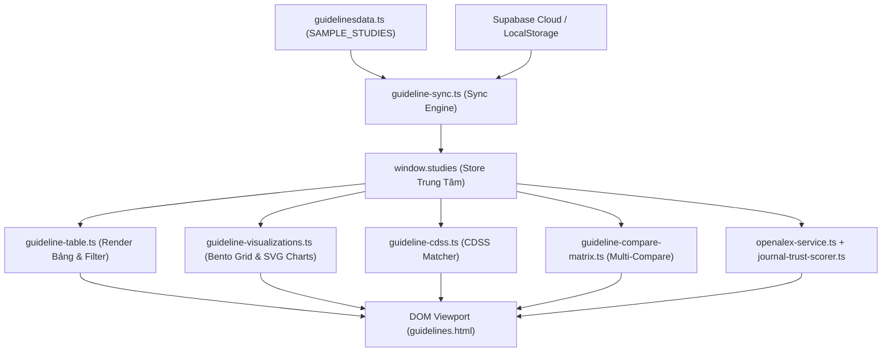

# 🛠️ OPERATIONS.md — Hướng Dẫn Vận Hành Phân Hệ Guidelines & EBM

> **Tài liệu Kỹ thuật & Vận hành Nội bộ**: Dành cho Kỹ thuật viên và AI Agent khi phát triển, tối ưu hóa và mở rộng phân hệ **Kho Guidelines & Nghiên Cứu Lâm Sàng** trong CliniPortal.
> **Kiến trúc**: TypeScript Modular, Vanilla CSS3, Zero Frameworks.

---

## 📁 1. Cấu Trúc Mã Nguồn Phân Hệ

```text
src/content/ebm/guidelines/
├── guidelines.html                          # UI Layout Shell chính (Bento Grid, Tables, Modals)
├── guidelines.css                           # Master CSS Entry Point (@import architecture)
├── guidelines.ts                            # Main Application Controller (TypeScript)
├── guidelinesdata.ts                        # Dữ liệu chuẩn quốc tế & BYT (60+ EBM Guidelines & RCTs)
├── guidelines-types.ts                      # Hệ thống Interface & Type Definitions trung tâm
├── guidelines-view.ts                       # SPA View Native Integration cho CliniPortal Core
│
├── css/                                     # Các mô-đun CSS chuyên biệt
│   ├── guidelines-base.css                  # Reset, Tokens, Topnav, Sidebar & App Shell
│   ├── guidelines-components.css            # Filter Pills, Search Bar, Badges, Journal Quality
│   ├── guidelines-table.css                 # Data Tables, Compact Cards, Timeline & Forest Plot SVGs
│   └── guidelines-modals.css                # Modal Thêm/Sửa, Case CDSS, Multi-Compare Matrix
│
├── js/                                      # Các mô-đun TypeScript nghiệp vụ
│   ├── guideline-sync.ts                    # LocalStorage & Supabase Realtime Sync Engine (2 chiều)
│   ├── guideline-table.ts                   # Lọc và Render Bảng bài báo, Thẻ Compact, Tabs Switcher
│   ├── guideline-modals.ts                  # Xử lý Modal Thêm/Sửa, Nhập JSON & Cấu hình ICD-10 Registry
│   ├── guideline-visualizations.ts          # Bento Grid, Đồng hồ Gauge SVG & Bubble Evidence Map
│   ├── guideline-evidence-analytics.ts      # Evidence Analytics & NNT Calculator Engine
│   ├── guideline-cmd-palette.ts             # Command Palette (Ctrl+K) tra cứu nhanh Snippet
│   ├── guideline-cdss.ts                    # CDSS Dosing Matcher & Export EBM Note Clipboard
│   ├── guideline-compare-matrix.ts          # Multi-Guideline 3D Compare Matrix & Floating Bar
│   ├── guideline-tools.ts                   # Unified Bridge Export Hub
│   ├── guideline-charts-engine.ts           # SVG Forest Plot, Column, H-Bar, Donut chart generators
│   ├── guideline-journal-badge.ts           # Journal quality badge injection & click handlers
│   ├── openalex-service.ts                  # OpenAlex API live journal metadata lookup
│   ├── journal-trust-scorer.ts              # Weighted Trust Score calculation (0-100)
│   ├── journal-quality-analyzer.ts          # Modal so sánh và phân tích chất lượng tạp chí
│   └── drug-linker.ts                       # Auto-Linking Thuốc vào Kho Dược lý
│
├── data/
│   └── predatory-blacklist.ts               # Beall's list & cơ sở dữ liệu kiểm toán rủi ro tạp chí
│
└── kho-guidelines/                          # Thư mục lưu 50+ bài viết tóm tắt HTML chi tiết
```

---

## 🔌 2. Luồng Vận Hành Dữ Liệu (Data Flow)



---

## 📐 3. Mô-Đun Thẩm Định Tạp Chí & Y Văn (Journal Quality Engine)

Phân hệ tích hợp hệ thống kiểm định tạp chí 3 tầng:

1. **Live OpenAlex API Lookup (`openalex-service.ts`)**:
   - Truy vấn thông tin thời gian thực về ISSN, Nhà xuất bản, Số trích dẫn trung bình (CiteScore), H-index và tỷ lệ bài báo Open Access.
2. **Journal Trust Scorer (`journal-trust-scorer.ts`)**:
   - Tính toán điểm số từ 0 - 100 dựa trên trọng số chuẩn EBM:
     $$\text{Score} = w_{\text{pub}} \times S_{\text{pub}} + w_{\text{peer}} \times S_{\text{peer}} + w_{\text{cite}} \times S_{\text{cite}} + w_{\text{index}} \times S_{\text{index}}$$
   - Phân loại: 🟢 **Rất cao ($\ge 85$)**, 🔵 **Cao ($70 - 84$)**, 🟡 **Trung bình ($50 - 69$)**, 🔴 **Rủi ro ($< 50$)**.
3. **Predatory Blacklist Audit (`data/predatory-blacklist.ts`)**:
   - Tự động đối chiếu tên nhà xuất bản và tên tạp chí với danh sách Beall's List. Nếu phát hiện trùng khớp, hệ thống tự động gắn cờ cảnh báo đỏ (`⚠️ Nguy cơ Tạp chí Săn mồi`).

---

## 🌲 4. Động Cơ Forest Plot & Biểu Đồ SVG Thuần

### `parseForestData(keyResults)`
Trích xuất chuỗi kết quả lâm sàng dạng văn bản hoặc JSON thành cấu trúc toán học:
```typescript
interface ForestData {
  label: string;      // "HR", "OR", "RR", "aOR", "ARR"
  estimate: number;   // Điểm ước lượng (Point Estimate, vd: 0.86)
  lower: number;      // Giới hạn dưới 95% CI (vd: 0.74)
  upper: number;      // Giới hạn trên 95% CI (vd: 0.99)
  pValue?: string;    // "0.04"
  isSig?: boolean;    // true nếu không chứa 1.0 (cho ratio) hoặc 0.0 (cho difference)
}
```

### `renderForestPlotSVG(fd)`
Vẽ trực tiếp mã SVG inline (không thư viện Chart.js hay D3):
- Đường trục tham chiếu $1.0$ (Đường vô hiệu - Null Effect Line).
- Thanh ngang biểu diễn khoảng tin cậy $95\%\text{ CI}$ ($lower \rightarrow upper$).
- Hình thoi / hình tròn tại điểm ước lượng $estimate$.
- Tự động gán màu thích ứng:
  - 🟢 Xanh lá: $estimate < 1.0$ và $upper < 1.0$ (Giảm nguy cơ có ý nghĩa).
  - 🔴 Đỏ: $estimate > 1.0$ và $lower > 1.0$ (Tăng nguy cơ có ý nghĩa).
  - ⚪ Xám: Khoảng tin cậy cắt qua $1.0$ ($lower < 1.0 < upper$ - Chưa đủ ý nghĩa thống kê).

---

## 📋 5. Quy Trình Thêm Nghiên Cứu / Guideline Mới

Khi có khuyến cáo hoặc nghiên cứu mới cần bổ sung:
1. **Bước 1**: Mở tệp `src/content/ebm/guidelines/guidelinesdata.ts`.
2. **Bước 2**: Thêm một bản ghi mới vào mảng `SAMPLE_STUDIES` tuân thủ đầy đủ schema `Study`.
3. **Bước 3** (Nếu có bài viết HTML chuyên sâu): Tạo tệp tóm tắt `.html` trong `src/content/ebm/guidelines/kho-guidelines/<slug>.html`.
4. **Bước 4**: Kiểm tra hiển thị trên bảng, kiểm tra Forest Plot SVG và chạy thử bộ lọc.
