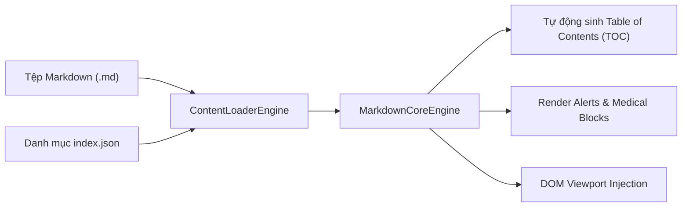

# 📚 Phân Hệ Nội Dung Y Khoa (Markdown-Driven Content Pipeline)

> **Master Content Architecture Guide**: Hướng dẫn tổ chức, biên soạn và quản lý tri thức y khoa theo cơ chế **Markdown-Driven Content** trong thư mục `src/content/` của **CliniPortal**.

---

## 🏛️ 1. Tổng Quan Kiến Trúc `src/content/`

Thư mục `src/content/` là kho lưu trữ trung tâm của toàn bộ dữ liệu bài viết, phác đồ, khuyến cáo lâm sàng, dữ liệu mô phỏng và công cụ tính toán y khoa. Nội dung được cấu trúc dưới dạng **Markdown (`.md`)** kết hợp cấu hình danh mục **JSON (`index.json`)** và các tệp giao diện độc lập **HTML (`.html`)**.

```text
src/content/
├── docspace/                  # Không gian Bác sĩ (SOAP, SBAR, Living Protocols, AI Config)
│   ├── ai/                    # Multi-Provider LLM Engine & RAG Search
│   ├── data/                  # Mẫu phác đồ động (Living Protocol Templates)
│   ├── features/              # Giao diện tính năng lâm sàng
│   ├── tools/                 # Bộ công cụ thang điểm và tính toán
│   └── README.md              # Sổ tay vận hành & kiến trúc hệ sinh thái DocSpace
│
├── ebm/                       # Phân hệ Y học chứng cứ (Evidence-Based Medicine)
│   ├── guideline-radar/       # Radar khuyến cáo và đối sánh hướng dẫn điều trị
│   ├── guidelines/            # Kho 60+ Guidelines, RCTs và Trình đọc Guideline chuyên sâu
│   │   ├── kho-guidelines/    # Các bài tóm tắt HTML độc lập
│   │   └── data/              # Danh mục đen tạp chí rởm (Predatory Journals)
│   ├── medical-statistics/    # 12 Chuyên đề Thống kê Y học lâm sàng & EBM Quiz
│   └── index.md               # Cổng điều hướng phân hệ EBM
│
├── pathophysiology/           # Phân hệ Sinh lý & Sinh lý bệnh
│   ├── biochemistry/          # Kho Hóa sinh Y học (7 Khối - 31 Chuyên đề .md)
│   │   ├── block1-biomolecules/
│   │   ├── block2-catalysis-signaling/
│   │   ├── block3-bioenergetics/
│   │   ├── block4-intermediary-metabolism/
│   │   ├── block5-molecular-genetics/
│   │   ├── block6-organ-metabolism/
│   │   └── block7-clinical-biochemistry/
│   ├── content/               # Bài viết chi tiết sinh lý màng & cơ chế bệnh sinh
│   ├── pathophysiology-cases/ # 17+ Ca lâm sàng sinh lý bệnh (ACS, AKI, Shock, CKD...)
│   ├── physiology/            # Sinh lý học 9 phân hệ cơ quan
│   ├── simulators/            # Các bộ mô phỏng sinh lý & huyết động học tương tác
│   ├── index.json             # Danh mục chỉ mục bài học nạp động
│   └── index.md               # Cổng điều hướng phân hệ Sinh lý - SLB
│
├── knowledge-vault/           # Phân hệ Kho Kiến Thức Y Khoa (Knowledge Vault Hub & Reader)
│   ├── data/                  # Danh mục 600+ bài viết nạp động (vault-catalog.json)
│   ├── css/                   # Giao diện Bento Grid & Reader chuẩn Design Tokens
│   ├── types.ts               # Khai báo TypeScript cho Vault
│   ├── vault-loader.ts        # Engine nạp và lọc dữ liệu tra cứu
│   ├── vault-hub-view.ts      # Màn hình Hub & Trình đọc Drawer
│   ├── index.ts               # Entry point module
│   └── index.html             # Cổng tra cứu Standalone Hub
│
├── VAN_HANH_HETHONG.md        # Hướng dẫn vận hành chi tiết các phân hệ CliniPortal
└── README.md                  # Tài liệu hướng dẫn này
```

---

## 📝 2. Quy Chuẩn Biên Soạn Bài Viết Markdown (.md)

Mọi bài viết trong hệ thống tuân thủ định dạng Frontmatter YAML chuẩn và hệ thống thẻ mở rộng để `MarkdownCoreEngine` và `ContentLoaderEngine` có thể tự động phân tích và kết xuất.

### 2.1 Frontmatter YAML Chuẩn

```yaml
---
id: "CHEM_01_Nuoc_pH"
title: "Hóa Học Nước, pH & Cân Bằng Điện Giải Nền Tảng"
category: "Hóa Sinh Y Học"
subcategory: "Khối 1: Cấu Trúc Phân Tử Sinh Học"
difficulty: "Cơ bản - Nâng cao"
read_time: "15 phút"
author: "Ban Biên Tập CliniPortal"
tags: ["Hóa Sinh", "pH", "Hệ Đệm", "Điện Giải", "Khí Máu"]
has_interactive_diagram: true
formulas: ["henderson_hasselbalch", "anion_gap"]
---
```

### 2.2 Các Khối Ghi Chú Y Khoa Chuẩn (Medical Callouts)

Hệ thống hỗ trợ các cú pháp ghi chú chuẩn GitHub Alert:

```markdown
> [!NOTE]
> Thông tin bổ trợ, định nghĩa hoặc bối cảnh sinh học nền tảng.

> [!TIP]
> Mẹo thực hành lâm sàng, quy tắc nhớ nhanh hoặc phương pháp suy luận.

> [!IMPORTANT]
> Lưu ý then chốt, cơ chế quyết định hoặc kiến thức bắt buộc phải nhớ.

> [!WARNING]
> Cảnh báo nguy cơ, tương tác thuốc nguy hiểm, hoặc sai lầm lâm sàng thường gặp.

> [!CAUTION]
> Tình huống chống chỉ định tuyệt đối hoặc biến chứng đe dọa tính mạng.
```

### 2.3 Các Thẻ Mở Rộng Chuyên Biệt (Custom Medical Blocks)

`MarkdownCoreEngine` tự động nhận diện và biên dịch các khối đặc thù:

- **💎 Điểm ngọc lâm sàng (`:::clinical-pearl`)**:
  ```markdown
  :::clinical-pearl
  💎 **Clinical Pearl**: Hạ Magnesi máu kháng trị là nguyên nhân hàng đầu gây hạ Kali máu không đáp ứng với bù Kali thông thường.
  :::
  ```

- **📐 Thẻ công thức định lượng (`:::formula-card`)**:
  ```markdown
  :::formula-card
  📐 **Khoảng trống Anion (Anion Gap)**:
  $$\text{AG} = [\text{Na}^+] - ([\text{Cl}^-] + [\text{HCO}_3^-])$$
  *Giá trị bình thường: $10 - 12\text{ mmol/L}$*
  :::
  ```

- **🔄 Các bước diễn tiến cơ chế (`:::physio-steps`)**:
  ```markdown
  :::physio-steps
  1. **Tác nhân kích hoạt**: Giảm thể tích tuần hoàn hiệu dụng.
  2. **Tiết Renin**: Bộ máy cạnh cầu thận tiết Renin chuyển Angiotensinogen thành Angiotensin I.
  3. **Chuyển đổi ACE**: Men ACE tại mao mạch phổi chuyển Angiotensin I thành Angiotensin II.
  4. **Co mạch & Tiết Aldosterone**: Tăng tái hấp thu Na+ và nước tại ống lượn xa.
  :::
  ```

---

## ⚙️ 3. Quy Trình Nạp Động (Content Loading Workflow)



1. **Chỉ mục hóa**: Mỗi phân hệ duy trì tệp `index.json` định nghĩa danh sách bài học, đường dẫn, thẻ tags và biểu tượng.
2. **Nạp động**: Khi người dùng chọn bài học trên giao diện SPA (ví dụ: `#/pathophysiology?article=01-nuoc-ph-he-dem`), `ContentLoaderEngine` thực hiện tìm nạp tệp qua URL tương ứng.
3. **Biên dịch & Tương tác**: `MarkdownCoreEngine` chuyển đổi Markdown sang HTML, chèn cây mục lục ScrollSpy, định dạng công thức toán-y học LaTeX và kích hoạt các bộ mô phỏng tương tác đi kèm.
