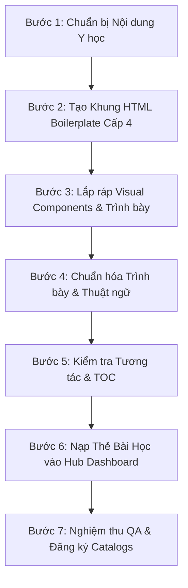

# WORKFLOW: Quy Trình Chuẩn Tạo Trang Sinh Lý Bệnh & Cơ Chế Bệnh Sinh (Pathophysiology Cases)

> **Tài liệu Hướng dẫn Quy trình Thao tác Chuẩn (SOP)** dành cho AI và Lập trình viên khi khởi tạo hoặc cập nhật bài học Sinh lý bệnh & Cơ chế bệnh sinh trong thư mục `src/content/pathophysiology/pathophysiology-cases/`.

---

## 📌 Tổng Quan Quy Trình (Workflow Summary)



---

## 🗂️ 7 Bước Thực Hiện Chi Tiết

### 🎯 BƯỚC 1: CHUẨN BỊ & BIÊN TẬP NỘI DUNG Y HỌC
1. **Xác định tên tệp chuẩn**:
   - Định dạng: `slb-ccbs-[mã-bệnh].html` (Ví dụ: `slb-ccbs-sepsis.html`, `slb-ccbs-aki.html`, `slb-ccbs-dot-quy.html`).
2. **Nguồn tài liệu y khoa bắt buộc**:
   - *Harrison's Principles of Internal Medicine* (21st Edition)
   - *Guyton and Hall Textbook of Medical Physiology* (14th Edition)
   - Khuyến cáo & Consensus quốc tế mới nhất (ADA 2026, KDIGO, ESC, Sepsis-3, GOLD, WHO).
3. **Cấu trúc Dàn bài 5-7 phần chuẩn**:
   - **Phần I**: Định nghĩa, Định danh & Dịch chuyển Mô hình Chẩn đoán (Consensus).
   - **Phần II**: Sinh lý bệnh Cấp độ Tế bào, Ty thể & Phân tử.
   - **Phần III**: Rối loạn Huyết động, Vi tuần hoàn, Nội mô & Bão Cytokine.
   - **Phần IV**: Vòng Luẩn Quẩn Bệnh Lý & Suy Chức Năng Cơ Quan Đặc Hiệu.
   - **Phần V**: Biến Đổi Dược Động Học (PK/PD) & Chỉ Số Sinh Học (Biomarkers).
   - **Phần VI**: Sơ Đồ Thuật Toán / Lưu Đồ Tiếp Cận Chẩn Đoán & Điều Trị.
   - **Phần VII (Tùy chọn)**: Bảng So Sánh Phân Nhóm Thể Lâm Sàng.
   - **Tài liệu tham khảo**: Chuẩn AMA.
4. **Xử lý Hình ảnh Đính kèm từ Markdown / Knowledge Vault**:
   - Quét toàn bộ tệp `.md` nguồn để tìm thẻ hình ảnh (ví dụ: `![[Pasted image ...]]` hoặc ``).
   - Sao chép tệp ảnh từ `knowledge-vault/_resources/attachments/` vào thư mục `src/content/pathophysiology/images/[slug]/`.
   - Đổi tên tệp ảnh thành tên có nghĩa (kebab-case tiếng Anh/Việt không dấu, ví dụ: `hp-pathogenesis-nobel.png`).
   - Đặt thẻ `<figure class="physio-figure">` vào đúng vị trí tương ứng trong bài học HTML.

---

### 🧩 BƯỚC 2: TẠO KHUNG HTML BOILERPLATE (LEVEL 4 PATHS)
Tạo file HTML mới sử dụng chuẩn đường dẫn tương đối **Cấp 4** (`../../../../` lên Root):

```html
<!DOCTYPE html>
<html lang="vi" data-theme="light">

<head>
    <meta charset="UTF-8">
    <meta name="viewport" content="width=device-width, initial-scale=1.0">
    <meta name="description" content="Sinh lý bệnh và Cơ chế bệnh sinh [Tên Bệnh] ([English Term]): Phân tích chi tiết...">
    <title>Sinh lý bệnh &amp; Cơ chế bệnh sinh [Tên Bệnh] – CliniPortal</title>

    <!-- Google Fonts & FontAwesome -->
    <link rel="preconnect" href="https://fonts.googleapis.com">
    <link rel="preconnect" href="https://fonts.gstatic.com" crossorigin>
    <link href="https://fonts.googleapis.com/css2?family=Inter:wght@300..700&family=Plus+Jakarta+Sans:wght@400;500;600;700;800&display=swap" rel="stylesheet">
    <link href="https://cdnjs.cloudflare.com/ajax/libs/font-awesome/6.4.0/css/all.min.css" rel="stylesheet">

    <!-- CSS Core CliniPortal (Level 4 Paths) -->
    <link rel="stylesheet" href="../../../../css/reset.css">
    <link rel="stylesheet" href="../../../../css/main.css">
    <link rel="stylesheet" href="../../../../css/components/header.css">
    <link rel="stylesheet" href="../../../../css/components/sidebar.css">
    <link rel="stylesheet" href="../../../../css/components/footer.css">

    <!-- CSS Sinh lý học & TOC -->
    <link rel="stylesheet" href="../../../../css/components/module-dashboard.css">
    <link rel="stylesheet" href="../../../../css/components/physio-headings.css">
    <link rel="stylesheet" href="../../../../css/components/physio-content.css">
    <link rel="stylesheet" href="../css/physio-shared.css">
    <link rel="stylesheet" href="../../../../css/components/toc.css">

    <!-- Scripts -->
    <script src="../../../../components/header.js" defer></script>
    <script src="../../../../components/footer.js" defer></script>
    <script src="../../../../js/main.js" defer></script>
    <script src="../js/physio-shared.js" defer></script>
    <script src="../../../../js/toc.js" defer></script>
</head>

<body>
    <!-- HEADER PLACEHOLDER -->
    <div id="header-placeholder" data-header-path="../../../../components/header.html"></div>
    <div class="sidebar-overlay" id="sidebarOverlay"></div>

    <div class="app-container">
        <!-- SIDEBAR -->
        <aside class="app-sidebar" id="appSidebar">
            <!-- Sidebar Navigation Items -->
        </aside>

        <!-- MAIN WRAPPER -->
        <div class="main-wrapper" id="mainContent">
            <!-- BREADCRUMB -->
            <clini-breadcrumb items='[{"label": "🏠 Home", "url": "../../../../index.html"}, {"label": "Sinh lý & sinh lý bệnh", "url": "../sinhly-sinhlybenh.html"}, {"label": "Sinh lý bệnh [Tên Bệnh]"}]'></clini-breadcrumb>

            <!-- VÙNG HIỂN THỊ TRỰC QUAN -->
            <main class="visual-container">
                <!-- Nội dung bài học -->
            </main>
        </div>
    </div>
</body>
</html>
```

---

### 🎨 BƯỚC 3: LẮP RÁP VISUAL COMPONENTS & TRÌNH BÀY
Sử dụng các component UI chuẩn đã được định nghĩa trong `physio-shared.css` và `physio-headings.css`:

| Thành phần UI | Mã HTML Mẫu | Mục đích sử dụng |
|---|---|---|
| **Header Bài học** | `<div class="chapter-header"><h1>...</h1><p>...</p></div>` | Đặt ở đầu bài, chứa tên tiếng Việt + Subheading tiếng Anh. |
| **Tiêu đề Phần (H2)** | `<h2 id="phan-1-id" class="section-title"><span>Phần I: Tên Phần</span></h2>` | Chia các phần chính. Bắt buộc có thuộc tính `id`. |
| **Tiêu đề Mục con (H3)** | `<h3 id="muc-1-1" class="subsection-title">1. Tên Mục Con</h3>` | Chia các mục nhỏ trong phần. Bắt buộc có thuộc tính `id`. |
| **Lưới Thẻ Song Song** | `<div class="physio-grid"><div class="physio-grid-card">...</div></div>` | So sánh 2-3 cơ chế hoặc yếu tố sinh lý bệnh song song. |
| **Chuỗi Diễn Tiến** | `<div class="pathway-chain"><span class="pathway-node red">A</span><span class="pathway-arrow">➔</span>...</div>` | Mô tả các bước chuyển hóa hoặc đường truyền tín hiệu. |
| **Vòng Luẩn Quẩn** | `<div class="vicious-cycle"><div class="vicious-cycle-title">🔄 Title</div><div class="cycle-steps">...</div></div>` | Mô tả các vòng xoắn bệnh lý mất bù. |
| **Hộp Công Thức** | `<div class="formula-box"><div class="formula-label">CÔNG THỨC</div><div class="formula-main">...</div></div>` | Hiển thị các phương trình sinh lý/huyết động. |
| **Card Cấu trúc Vi sinh/Virus** | `<div class="virus-structure-card"><h4>...</h4>...</div>` | Mô tả đặc điểm phân tử, protein vỏ, capsid hoặc độc tính tác nhân vi sinh. |
| **Pill Dấu ấn Sinh học** | `<span class="biomarker-pill"><i class="fa-solid fa-droplet"></i> ...</span>` | Hiển thị các chỉ thị phân tử, cytokine, interleukin, biomarkers độ nặng. |
| **Bảng So sánh Cơ chế** | `<table class="mech-compare-table"><thead>...</thead></table>` | Bảng so sánh trực quan các thể bệnh lý hoặc cơ chế sinh lý đối chiếu. |
| **Card Ngọc Lâm Sàng** | `<div class="clinical-pearl">💎 <strong>Pearl lâm sàng:</strong> ...</div>` | Đúc kết kinh nghiệm lâm sàng áp dụng sinh lý bệnh. |
| **Hộp Cảnh Báo** | `<div class="warning-box">⚠️ <strong>Cảnh báo:</strong> ...</div>` | Lưu ý biến cấp tính hoặc nguy cơ tử vong. |

---

### ✍️ BƯỚC 4: CHUẨN HÓA TRÌNH BÀY & THUẬT NGỮ (TYPOGRAPHY RULES)

1. **KHÔNG DÙNG KÝ HIỆU `$ ... $` TEX RAW**:
   - ❌ **Sai**: `$\rightarrow$`, `$\ge 2$`, `$&gt; 2\text{ mmol/L}$`, `$V_d$`, `$40\%$`, `$\alpha$`, `$\beta$`
   - ✅ **Đúng**: `&rarr;`, `&ge; 2`, `&gt; 2 mmol/L`, `<i>V</i><sub>d</sub>`, `40%`, `&alpha;`, `&beta;`
   - Dùng thẻ HTML chuẩn: `&rarr;`, `&ge;`, `&le;`, `<sub>`, `<sup>`, `<i>`, `<b>`.

2. **QUY TẮC TÔ ĐEN (`<strong>`) VỪA PHẢI**:
   - ✅ **Nên tô đậm**:
     - Tiêu đề danh sách: `<li><strong>Tăng Kali máu (Hyperkalemia):</strong> ...</li>`
     - Ngưỡng chỉ số chẩn đoán / Cảnh báo cấp cứu: `<strong>Hb &le; 5 g/dL</strong>`, `<strong>MAP &ge; 65 mmHg</strong>`.
   - ❌ **Không tô đậm**:
     - Không tô đậm tràn lan các danh từ giữa câu (`**báng bụng**`, `**viêm mạn tính**`, `**eNOS**`).
     - Không để lọt ký tự `**` thô của Markdown trong HTML.

3. **HIGHLIGHT THUẬT NGỮ Y KHOA**:
   - Thuật ngữ chính: `<span class="term-hl">Sepsis-3</span>`
   - Thuật ngữ phụ (Enzyme/Kênh/Vi khuẩn): `<span class="term-hl-secondary">ADAMTS-13</span>`

---

### 🔄 BƯỚC 5: KIỂM TRA TƯƠNG TÁC & MỤC LỤC TỰ ĐỘNG (`toc.js`)

1. Đảm bảo `<main class="visual-container">` bọc toàn bộ nội dung.
2. Kiểm tra tất cả các thẻ `<h2 class="section-title">` và `<h3 class="subsection-title">` đều có thuộc tính `id` chuẩn (viết thường, dùng dấu gạch ngang, không dấu tiếng Việt).
3. Khi tải trang, `toc.js` sẽ tự động:
   - Tạo cây Mục lục bài viết trên Right Sidebar (Desktop) và Drawer (Mobile).
   - Tự động cuộn mượt (Smooth scroll) đến phần tương ứng khi click.
   - Tự động bắt vị trí cuộn trang (ScrollSpy) để highlight mục lục đang đọc.

---

### 🎴 BƯỚC 6: NẠP THẺ BÀI HỌC VÀO HUB DASHBOARD (`co-che-benh-sinh.html`)

Mỗi khi tạo bài học mới, **bắt buộc phải nạp thẻ bài học (Specialty Card)** vào đúng phân khu Chuyên khoa tương ứng trong `src/content/pathophysiology/co-che-benh-sinh.html`:

1. **Thêm Card HTML**:
   ```html
   <a href="pathophysiology-cases/slb-ccbs-[mã-bệnh].html" class="specialty-card">
       <div class="specialty-card-top">
           <div class="specialty-icon"><i class="fa-solid fa-[icon]"></i></div>
           <div class="specialty-info">
               <h3>[Tên Bệnh Chi Tiết]</h3>
               <p>[Tóm tắt 1-2 câu về cơ chế bệnh sinh chính và các từ khóa high-yield].</p>
           </div>
       </div>
       <div class="specialty-card-action">
           <span>Xem bài học</span>
           <i class="fa-solid fa-arrow-right-long"></i>
       </div>
   </a>
   ```
2. **Cập nhật Badge số lượng bài**: Tăng giá trị số lượng bài học tương ứng trên Sidebar Chuyên khoa (`<span class="part-count-badge">N</span>`).
3. **Đăng ký vào Master Catalog**: Thêm object đăng ký thông tin bài mới vào tệp `src/content/pathophysiology/index.json`.

---

### ✅ BƯỚC 7: QA CHECKLIST TRƯỚC KHI COMMIT

- [ ] Đường dẫn tương đối chuẩn Cấp 4 (`../../../../css/...`, `../css/physio-shared.css`, `../../../../js/...`).
- [ ] Thẻ `<html>` chứa `data-theme="light"`.
- [ ] Thẻ `<meta name="description">` mô tả chuẩn SEO.
- [ ] Không có thẻ `$` TeX raw hay `**` Markdown thừa.
- [ ] **Toàn vẹn Sơ đồ SVG**:
  - Không có bất kỳ thẻ HTML nào (`<em>`, `<strong>`, `<span>`, `<br>`, `<b>`, `<i>`) trong thẻ `<text>` của SVG.
  - Sử dụng `<tspan font-weight="700">`, `<tspan font-style="italic">`, và `<tspan x="..." dy="...">` cho định dạng và xuống dòng.
  - Đồng bộ `text-anchor="start"` cho các danh sách bullet point trong card (tránh lệch tọa độ `x`).
- [ ] Chạy `node scratch/check_tags.js <file.html>` **PASSED** (0 lỗi HTML/SVG).
- [ ] Các thẻ Heading H2/H3 hiển thị đúng style (có vạch xanh accent, nền gradient nhẹ).
- [ ] Không hardcode màu sắc (dùng Design Tokens tương thích Dark Mode).
- [ ] Đã nạp thẻ bài học mới và cập nhật badge đếm số lượng bài trong `co-che-benh-sinh.html`.
- [ ] Đã đồng bộ với `src/content/pathophysiology/co-che-benh-sinh-view.ts`.
- [ ] Đã đăng ký vào `src/content/pathophysiology/index.json`.

