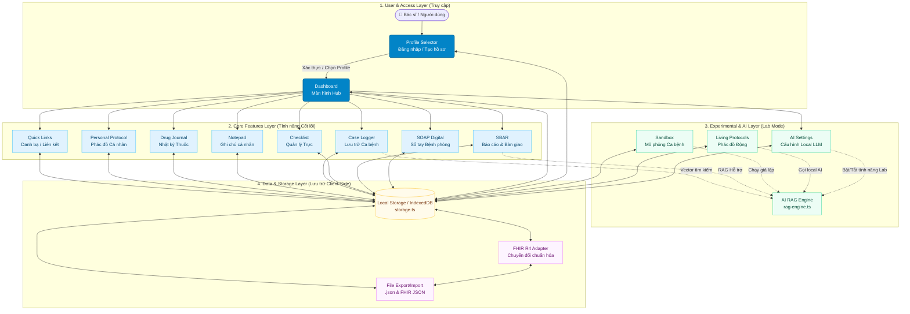

# Sơ đồ Vận hành Hệ sinh thái DocSpace

DocSpace là "Không gian riêng" của bác sĩ trên nền tảng CliniPortal. Đây là phân hệ chạy hoàn toàn trên trình duyệt (client-side), lưu trữ dữ liệu nội bộ bằng Local Storage / IndexedDB và có thể hoạt động offline 100%.

Dưới đây là sơ đồ vận hành tổng thể của hệ sinh thái DocSpace:

## 1. Flowchart Tổng thể (Mermaid)

## 2. Các Lớp Kiến trúc (Architecture Layers)

### 2.1. User & Access Layer
- **Profile Selector (`storage.ts`, `docspace-view.ts`)**: Mọi dữ liệu được phân lập (isolate) theo từng Hồ sơ Bác sĩ (Profile ID). Nếu chưa chọn hồ sơ, người dùng bắt buộc phải tạo/đăng nhập.
- **Dashboard (`docspace-view.ts`)**: Trung tâm điều khiển (Hub) chứa thống kê tổng quan (số ca bệnh đã lưu, số SBAR đang hoạt động) và điều hướng (routing).

### 2.2. Core Features Layer (Các tính năng lâm sàng)
Tất cả các tính năng đều nằm trong thư mục `src/docspace/features/`:
1. **SOAP Digital**: Quản lý bệnh án hằng ngày theo cấu trúc Subjective - Objective - Assessment - Plan.
2. **SBAR**: Ghi chú hội chẩn, báo cáo ca bệnh (Situation - Background - Assessment - Recommendation).
3. **OnCall**: Checklist các công việc trong tua trực (nhắc nhở sinh hiệu, thuốc, xét nghiệm).
4. **Case Logger**: Sổ tay lưu trữ các ca bệnh hay, có thể đánh tag và tìm kiếm lại.
5. **Personal Notepad**: Ghi chú tự do bằng Markdown.
6. **Drug Journal**: Sổ tay ghi chép kinh nghiệm tương tác thuốc, liều lượng cá nhân.
7. **Personal Protocol**: Nơi bác sĩ tự xây dựng phác đồ cá nhân.
8. **Quick Links**: Danh sách các liên kết, danh bạ nội bộ hay dùng.

### 2.3. Experimental & AI Layer (Phân hệ AI)
Thư mục `src/docspace/ai/` xử lý kết nối với Local LLM / API:
- **AI Settings**: Giao diện cấu hình WebLLM, API Key hoặc Local endpoint (Ollama/LM Studio).
- **RAG Engine**: Hệ thống nhúng (Embeddings) và lưu trữ vector nội bộ để hỗ trợ tìm kiếm ngữ nghĩa trong Case Logger và SBAR.
- **Living Protocols**: Tạo phác đồ xử trí có khả năng điều chỉnh linh hoạt dựa trên dữ kiện bệnh nhân đầu vào qua AI.
- **Sandbox Mô phỏng**: Môi trường giả lập tình huống lâm sàng (như thi OSCE) để bác sĩ luyện tập.

### 2.4. Data & Storage Layer
Tất cả xử lý lưu trữ tập trung tại `src/docspace/storage.ts`:
- **Local Storage / IndexedDB**: Không dùng backend server. Dữ liệu lưu hoàn toàn trên trình duyệt người dùng.
- **Auto-Save Hook (`quick-save.ts`)**: Cơ chế tự động lưu khi bác sĩ gõ phím.
- **FHIR R4 Interoperability (`fhir-adapter.ts`)**: Bộ chuyển đổi (Adapter) cho phép ánh xạ dữ liệu SOAP/SBAR/Case sang định dạng chuẩn HL7 FHIR R4 (như *Practitioner, ClinicalImpression, Composition, Bundle*).
- **Export / Import**: Quản lý việc sao lưu thành file `.json` thông thường, hoặc trích xuất/nạp dữ liệu y khoa chuẩn hóa qua định dạng `.json` của FHIR để đồng bộ với các hệ thống HIS/EMR của bệnh viện. 

## 3. Quy trình Vận hành Tiêu chuẩn (Standard Operating Procedure)

1. **Khởi động**: Người dùng vào `#/docspace`. Trình duyệt kiểm tra LocalStorage xem có `dsp_active_profile` chưa.
2. **Xác thực**: Nếu chưa, render màn hình **Profile Selector**. Người dùng tạo hoặc chọn Profile.
3. **Điều hướng**: Sau khi có Profile, hệ thống render **Dashboard** và **Sidebar**. Sidebar được sử dụng để chuyển đổi nhanh giữa các công cụ.
4. **Làm việc (VD: Tạo SOAP mới)**: 
   - Controller (`soap-view.ts`) lấy `profileId`.
   - Render form. Bác sĩ điền nội dung.
   - Khi có thay đổi (input event), hook `quick-save` sẽ tự động trigger `saveDocSpaceData()`.
5. **Sao lưu**: Bác sĩ định kỳ click "Export" ở Sidebar để tải file `.json` về máy.
